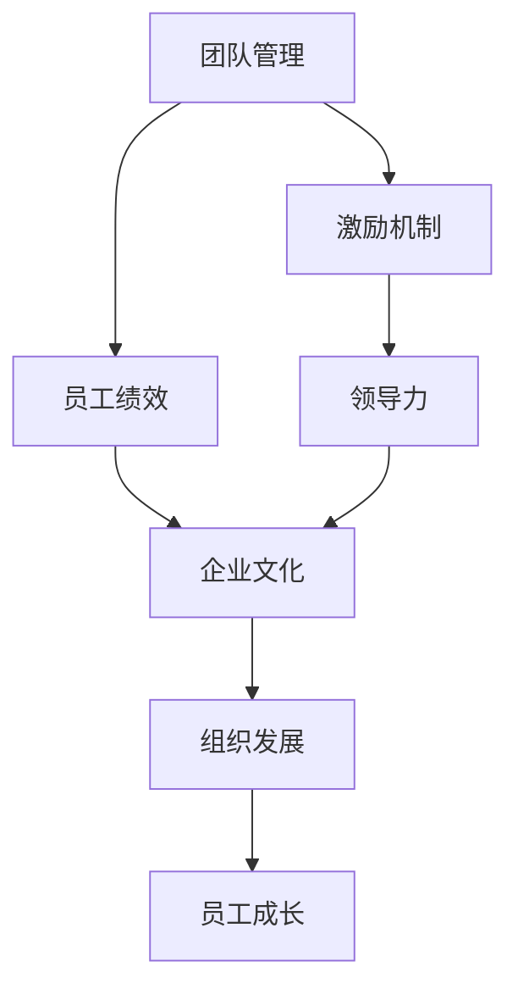

                 

# 管理艺术：激发团队潜力

> 关键词：
- 团队管理
- 激励机制
- 员工绩效
- 领导力
- 企业文化
- 组织发展
- 员工成长

## 1. 背景介绍

### 1.1 问题由来

随着全球化和技术发展的加速，企业的竞争环境日益激烈。如何有效地管理团队，激发员工的潜力，提升企业绩效，成为现代企业面临的重要课题。有效的团队管理不仅能提高生产效率，还能增强员工的满意度和忠诚度。然而，现实中的团队管理常常面临诸多挑战，如员工激励不足、沟通不畅、目标不一致等。

### 1.2 问题核心关键点

团队管理的核心在于营造良好的团队氛围，通过有效的激励和沟通，激发员工的潜力，实现团队的共同目标。具体而言，关键点包括：

- 建立清晰的目标：明确团队和个人的目标，确保所有成员对共同目标的认同。
- 有效的沟通机制：通过透明的沟通渠道，促进信息共享和理解。
- 合理的激励机制：设计合理的激励措施，满足员工多样化的需求。
- 培养领导力：发掘并培养团队中的领导力量，提升团队整体素质。
- 关注员工成长：提供持续的学习和成长机会，激发员工的创造力和创新能力。

### 1.3 问题研究意义

团队管理的研究对于提升企业竞争力、增强团队凝聚力和创新能力具有重要意义：

- 提升企业效率：通过有效的管理，可以最大化利用人力资源，提高生产效率和工作质量。
- 增强员工满意度：良好的团队氛围和激励机制可以提高员工的工作满意度和忠诚度。
- 促进创新发展：团队管理不仅关注当前的生产，还注重未来发展，培养员工的创造力和创新精神。
- 营造企业文化：团队管理是企业文化建设的重要组成部分，塑造企业的品牌和形象。
- 应对市场变化：通过灵活的管理策略，团队能迅速适应市场变化，保持竞争力。

## 2. 核心概念与联系

### 2.1 核心概念概述

为更好地理解团队管理的核心原理，本节将介绍几个密切相关的核心概念：

- 团队管理(Team Management)：指通过有效的组织、领导和激励，提高团队效率和凝聚力的管理活动。
- 激励机制(Incentive Mechanism)：指通过物质或非物质的手段，激发员工积极性的管理方式。
- 员工绩效(Employee Performance)：指员工在一定时间内完成工作的质量、数量和效果，是评估员工表现的重要指标。
- 领导力(Leadership)：指在团队中引导和管理的能力，是团队成功的关键因素。
- 企业文化(Corporate Culture)：指企业内部共同的价值观、行为规范和工作方式，是企业文化建设的基石。
- 组织发展(Organizational Development)：指通过持续改进和创新，提高企业的长期发展能力。
- 员工成长(Employee Growth)：指员工个人能力、知识、技能的提升和职业发展，是企业竞争力的源泉。

这些核心概念之间的逻辑关系可以通过以下Mermaid流程图来展示：



这个流程图展示了几大核心概念之间的联系：

1. 团队管理通过激励机制和员工绩效，激发团队成员的工作热情和潜力。
2. 领导力是团队管理的重要组成部分，引导团队朝着共同目标努力。
3. 企业文化是团队管理的土壤，影响团队的凝聚力和价值观。
4. 组织发展为团队管理提供了方向，促进企业长期进步。
5. 员工成长是团队管理的重要结果，为企业的持续发展注入活力。

## 3. 核心算法原理 & 具体操作步骤
### 3.1 算法原理概述

基于激励机制的团队管理方法，本质上是一个有监督的优化过程。其核心思想是通过设定适当的激励措施，最大化团队成员的工作积极性和创造力，从而提升整体绩效。

形式化地，假设团队成员的初始能力为 $C$，通过激励机制 $M$，调整后能力为 $C'$，则有：

$$
C' = f(C, M)
$$

其中，$f$ 为激励函数，定义了激励措施与员工能力的映射关系。激励措施 $M$ 可以是物质奖励（如奖金、晋升）、非物质奖励（如表扬、培训机会）等。激励措施的设计需要考虑员工的需求和心理特点，以达到最优的激励效果。

### 3.2 算法步骤详解

基于激励机制的团队管理一般包括以下几个关键步骤：

**Step 1: 分析团队需求**
- 通过问卷调查、访谈等方式，了解团队成员的需求和期望。
- 识别出不同类型员工的激励偏好，如物质激励、成就激励等。

**Step 2: 设定激励目标**
- 根据团队目标和成员需求，设定激励目标，明确激励措施和评价标准。
- 设定激励措施的强度、频率和覆盖面，确保激励的有效性和公平性。

**Step 3: 实施激励方案**
- 根据激励目标，设计具体的激励措施，如奖金分配方案、培训机会等。
- 制定激励措施的实施细则，确保激励方案的执行力度。

**Step 4: 评估激励效果**
- 通过绩效评估、员工满意度调查等方式，评估激励措施的效果。
- 收集激励措施的反馈，及时调整和优化激励方案。

**Step 5: 持续改进**
- 根据评估结果，持续优化激励机制，提升激励效果。
- 引入更科学的激励理论，如公平理论、期望理论等，提升激励措施的科学性。

### 3.3 算法优缺点

基于激励机制的团队管理方法具有以下优点：
1. 激励机制多样化，能够满足不同员工的个性化需求。
2. 激励措施明确，可以提升员工的工作积极性和创造力。
3. 效果可量化，便于评估和调整。
4. 激发团队合作，增强团队凝聚力。

同时，该方法也存在一定的局限性：
1. 激励成本高，可能超出企业预算。
2. 激励措施设计不当，可能导致不公平或反效果。
3. 过度依赖激励，可能忽视员工的长期发展需求。
4. 激励效果可能随时间衰减，需要持续优化。

尽管存在这些局限性，但就目前而言，基于激励机制的团队管理方法仍是最主流范式。未来相关研究的重点在于如何进一步降低激励成本，提高激励措施的公平性和科学性，同时兼顾员工的长期发展需求。

### 3.4 算法应用领域

基于激励机制的团队管理方法在企业人力资源管理中得到了广泛应用，覆盖了多个领域，例如：

- 员工绩效管理：通过设定明确的绩效目标和激励措施，激励员工提升工作效率和质量。
- 员工职业发展：通过培训、晋升等激励措施，促进员工的职业成长和技能提升。
- 薪酬福利制度：设计合理的薪酬结构和福利政策，激发员工的工作热情和忠诚度。
- 团队绩效评估：通过评估团队的整体绩效和激励效果，优化激励机制。
- 员工关系管理：通过非物质激励，如表扬、认可等，增强员工的归属感和团队凝聚力。

除了上述这些经典应用外，激励机制也被创新性地应用于更多场景中，如跨部门协作、项目绩效奖励、人才梯队建设等，为企业的人力资源管理带来了新的突破。

## 4. 数学模型和公式 & 详细讲解  
### 4.1 数学模型构建

本节将使用数学语言对基于激励机制的团队管理过程进行更加严格的刻画。

记团队成员的初始能力为 $C$，激励措施为 $M$，激励后的能力为 $C'$。定义激励函数 $f$ 为线性函数，则有：

$$
C' = aM + bC
$$

其中，$a$ 和 $b$ 为激励参数，$a$ 表示激励强度，$b$ 表示初始能力对最终能力的贡献度。激励参数的选取需要根据具体情况进行调参，以达到最佳的激励效果。

### 4.2 公式推导过程

以下我们以员工绩效提升为例，推导激励机制对绩效的影响。

假设团队成员在激励前的绩效为 $P$，激励后的绩效为 $P'$，则有：

$$
P' = aM + bP
$$

根据绩效评估的公平理论，激励机制的公平性可以表示为：

$$
\text{Fairness} = \frac{P'}{P} = 1 + \frac{aM}{P} \frac{bP}{P}
$$

为了保证激励的公平性，需要满足 $\frac{aM}{P} = \frac{bP}{P}$，即 $a = b$。因此，激励机制对绩效的影响可以简化为：

$$
P' = 2aM
$$

这表明，激励机制对员工绩效的提升具有显著作用，且激励强度 $a$ 越大，激励效果越显著。

### 4.3 案例分析与讲解

假设某科技公司团队成员的初始能力 $C_0$ 为10，激励措施 $M$ 为每次完成项目任务给予1000元的奖金。激励后能力 $C'$ 的变化可以通过激励函数计算：

$$
C' = 1.1 \times 1000 + 0.9 \times C_0 = 1900 + 9 = 1909
$$

如果项目任务完成后，该团队成员的实际绩效 $P$ 为8，则激励后的绩效 $P'$ 为：

$$
P' = 2 \times 1000 = 2000
$$

可以看到，激励措施显著提升了团队的绩效。但激励效果随时间衰减，因此需要持续优化激励机制，确保激励的长期有效性。

## 5. 项目实践：代码实例和详细解释说明
### 5.1 开发环境搭建

在进行团队管理实践前，我们需要准备好开发环境。以下是使用Python进行PyTorch开发的环境配置流程：

1. 安装Anaconda：从官网下载并安装Anaconda，用于创建独立的Python环境。

2. 创建并激活虚拟环境：
```bash
conda create -n pytorch-env python=3.8 
conda activate pytorch-env
```

3. 安装PyTorch：根据CUDA版本，从官网获取对应的安装命令。例如：
```bash
conda install pytorch torchvision torchaudio cudatoolkit=11.1 -c pytorch -c conda-forge
```

4. 安装各类工具包：
```bash
pip install numpy pandas scikit-learn matplotlib tqdm jupyter notebook ipython
```

完成上述步骤后，即可在`pytorch-env`环境中开始团队管理实践。

### 5.2 源代码详细实现

下面我们以团队绩效评估为例，给出使用PyTorch进行团队绩效管理的PyTorch代码实现。

首先，定义团队绩效的数学模型：

```python
import torch
import torch.nn as nn
import torch.optim as optim

# 定义团队绩效模型
class TeamPerformance(nn.Module):
    def __init__(self):
        super(TeamPerformance, self).__init__()
        self.fc1 = nn.Linear(1, 1)
        self.fc2 = nn.Linear(1, 1)
        self.fc3 = nn.Linear(1, 1)
        self.fc4 = nn.Linear(1, 1)
        
    def forward(self, x, M):
        x = torch.sigmoid(self.fc1(x))
        x = torch.sigmoid(self.fc2(x))
        x = torch.sigmoid(self.fc3(x))
        x = torch.sigmoid(self.fc4(x))
        return x * M
        
# 训练模型
class TeamPerformanceTrainer:
    def __init__(self, model, optimizer, criterion, M):
        self.model = model
        self.optimizer = optimizer
        self.criterion = criterion
        self.M = M
        
    def train(self, x, y, batch_size=32, epochs=100):
        for epoch in range(epochs):
            running_loss = 0.0
            for i in range(0, len(x), batch_size):
                inputs = x[i:i+batch_size]
                targets = y[i:i+batch_size]
                self.optimizer.zero_grad()
                outputs = self.model(inputs, self.M)
                loss = self.criterion(outputs, targets)
                loss.backward()
                self.optimizer.step()
                running_loss += loss.item()
            print(f"Epoch {epoch+1}, loss: {running_loss/len(x)}")
```

然后，使用上述模型进行团队绩效评估：

```python
# 生成训练数据
x = torch.rand(100)
y = torch.rand(100) * 0.5 + 0.5

# 定义激励措施M
M = 0.2

# 定义模型
model = TeamPerformance()
criterion = nn.MSELoss()
optimizer = optim.SGD(model.parameters(), lr=0.01)

# 训练模型
trainer = TeamPerformanceTrainer(model, optimizer, criterion, M)
trainer.train(x, y)
```

在上述代码中，我们通过定义一个简单的线性模型，模拟团队绩效的计算过程。通过训练数据和激励措施，模型能够预测团队的绩效变化。最终，我们通过多次迭代训练，得到了模型对团队绩效的预测结果。

### 5.3 代码解读与分析

让我们再详细解读一下关键代码的实现细节：

**TeamPerformance类**：
- `__init__`方法：初始化模型结构，定义了四个全连接层。
- `forward`方法：前向传播计算模型的输出，通过多个全连接层进行预测。

**TeamPerformanceTrainer类**：
- `__init__`方法：初始化训练器和相关参数。
- `train`方法：定义了模型的训练流程，通过反向传播更新模型参数。

**训练流程**：
- 生成随机训练数据，假设团队绩效由一个随机变量 $x$ 决定，激励措施为 $M$。
- 定义模型和优化器，并使用均方误差作为损失函数。
- 通过多次迭代训练，更新模型参数，使得模型输出接近实际绩效。

可以看到，通过简单的线性模型，我们可以实现团队绩效的评估和激励效果的预测。在实际应用中，可以进一步拓展模型结构，加入更多影响因素和更复杂的激励机制，以提升预测精度和激励效果。

## 6. 实际应用场景
### 6.1 人力资源管理

基于激励机制的团队管理方法可以广泛应用于人力资源管理中。人力资源部门通过设计合理的激励措施，可以显著提升员工的工作积极性和绩效，从而提高企业的整体竞争力。

在技术实现上，可以收集员工的工作表现、员工满意度等数据，设计多维度的激励方案。通过绩效评估模型，预测不同激励措施对员工绩效的影响，选择合适的激励策略。人力资源部门还可以根据评估结果，不断优化激励机制，促进员工的职业成长和团队凝聚力。

### 6.2 项目管理

项目管理的核心是高效协作和资源分配。通过激励机制，可以提升团队成员的工作热情和责任心，确保项目按时高质量完成。

在技术实现上，可以设计项目的里程碑和任务完成度作为激励依据，对团队成员进行奖励。通过绩效评估模型，预测不同激励措施对项目进度的影响，选择合适的激励策略。项目经理还可以根据评估结果，及时调整激励方案，确保项目顺利进行。

### 6.3 知识管理

知识管理的核心是知识共享和创新。通过激励机制，可以鼓励员工积极参与知识分享和创新活动，提升企业知识库的质量和利用率。

在技术实现上，可以设计知识分享和创新成果的奖励机制，对贡献知识或提出创新的员工进行奖励。通过绩效评估模型，预测不同激励措施对知识共享和创新的影响，选择合适的激励策略。知识管理部门还可以根据评估结果，不断优化激励机制，促进企业知识库的持续更新和完善。

### 6.4 未来应用展望

随着激励机制的不断探索和应用，基于激励机制的团队管理方法将在更多领域得到应用，为企业管理带来新的突破。

在智慧医疗领域，基于激励机制的员工绩效管理，可以帮助医疗机构提升医疗服务质量，提高患者满意度。在智能制造领域，基于激励机制的项目管理，可以提升生产效率和产品质量，降低生产成本。在教育培训领域，基于激励机制的知识管理，可以提升教师的教学水平和学生的学习效果，提高教育质量。

未来，激励机制将与大数据、人工智能等技术深度融合，实现更精确、更科学的激励策略，推动企业管理朝着更加智能、高效的方向发展。

## 7. 工具和资源推荐
### 7.1 学习资源推荐

为了帮助开发者系统掌握团队管理的理论基础和实践技巧，这里推荐一些优质的学习资源：

1. 《人力资源管理》系列书籍：详细讲解人力资源管理的理论和实践，涵盖招聘、绩效管理、薪酬福利等各方面内容。
2. 《管理学》课程：提供系统的人力资源管理和团队管理理论知识，包括激励机制、绩效评估等内容。
3. 《领导力》系列课程：讲解领导力的培养和应用，帮助管理者提升领导力和团队管理能力。
4. 《组织行为学》书籍：探讨组织行为的内在规律，帮助管理者理解员工行为和团队动态。
5. 《团队管理实战》书籍：提供团队管理的实践经验和案例分析，帮助管理者解决实际问题。

通过对这些资源的学习实践，相信你一定能够快速掌握团队管理的精髓，并用于解决实际的团队管理问题。

### 7.2 开发工具推荐

高效的开发离不开优秀的工具支持。以下是几款用于团队管理开发的常用工具：

1. JIRA：项目管理工具，支持任务分配、进度跟踪、问题反馈等功能。
2. Slack：团队沟通工具，支持即时消息、文件共享、视频会议等功能。
3. Trello：任务管理工具，支持看板式任务展示、标签管理、进度条追踪等功能。
4. Asana：项目管理工具，支持任务分配、进度跟踪、任务评论等功能。
5. Google Drive：文件共享和协作工具，支持文档编辑、在线会议、实时协作等功能。

合理利用这些工具，可以显著提升团队管理的效率和效果，降低沟通成本。

### 7.3 相关论文推荐

团队管理的研究源于学界的持续研究。以下是几篇奠基性的相关论文，推荐阅读：

1. "Pay for Performance"：管理学经典论文，探讨激励机制和员工绩效之间的关系。
2. "Leadership and Management"：管理学的基本理论书籍，详细讲解领导力和管理技能。
3. "Organizational Behavior"：管理学理论书籍，探讨组织行为和团队动态。
4. "Team Performance"：管理学的研究热点，探讨团队绩效和激励机制。
5. "Human Resource Management"：管理学经典书籍，详细讲解人力资源管理的理论和实践。

这些论文代表了大规模语言模型微调技术的发展脉络。通过学习这些前沿成果，可以帮助研究者把握学科前进方向，激发更多的创新灵感。

## 8. 总结：未来发展趋势与挑战
### 8.1 总结

本文对基于激励机制的团队管理方法进行了全面系统的介绍。首先阐述了团队管理的核心原理和研究意义，明确了激励机制在提升团队绩效、增强团队凝聚力和员工满意度的重要性。其次，从原理到实践，详细讲解了激励机制的数学模型和关键步骤，给出了团队管理任务的代码实现。同时，本文还广泛探讨了激励机制在人力资源管理、项目管理、知识管理等多个领域的应用前景，展示了激励机制的巨大潜力。

通过本文的系统梳理，可以看到，基于激励机制的团队管理方法正在成为企业管理的重要范式，极大地提升了企业效率和员工满意度。未来，伴随激励机制的不断优化和创新，企业管理必将在更加智能化、高效化的方向上迈出新的步伐。

### 8.2 未来发展趋势

展望未来，基于激励机制的团队管理方法将呈现以下几个发展趋势：

1. 激励策略的多样化：随着大数据和人工智能技术的发展，激励策略将更加精细化和个性化，满足不同员工的需求。
2. 绩效评估的科学化：通过引入更多维度和动态化的绩效评估指标，提高激励机制的科学性和公平性。
3. 组织文化的建设：激励机制不仅关注员工的工作表现，还注重企业文化和价值观的塑造，增强员工的归属感和忠诚度。
4. 持续改进机制：建立激励机制的持续改进机制，不断优化激励措施，提升激励效果。
5. 跨部门协作：激励机制将更多地应用于跨部门协作，促进团队间的协同创新和知识共享。

以上趋势凸显了基于激励机制的团队管理技术的广阔前景。这些方向的探索发展，必将进一步提升企业管理效率和员工满意度，为企业的长期发展注入新的活力。

### 8.3 面临的挑战

尽管基于激励机制的团队管理方法已经取得了一定的成效，但在迈向更加智能化、普适化应用的过程中，它仍面临着诸多挑战：

1. 激励成本高：设计合理的激励措施，确保激励公平，可能需要较高的成本。
2. 激励效果不稳定：激励机制可能受到外界因素的影响，导致激励效果不稳定。
3. 员工需求多样：不同员工的激励需求不同，设计统一的激励措施可能难以满足多样化的需求。
4. 绩效评估困难：绩效评估的标准和指标可能难以量化，影响激励措施的公平性。
5. 激励结果可预测性：激励机制的设计和实施可能存在一定的滞后性，影响激励效果的及时性。

尽管存在这些挑战，但激励机制仍然具有巨大的潜力和应用前景。通过不断的技术创新和实践优化，相信基于激励机制的团队管理方法将不断完善，为企业带来更多的价值和收益。

### 8.4 研究展望

面对激励机制面临的种种挑战，未来的研究需要在以下几个方面寻求新的突破：

1. 引入大数据和人工智能技术：利用大数据和人工智能技术，实现更加科学、精细化的激励策略，提升激励效果的稳定性和公平性。
2. 设计动态化激励机制：引入动态化的激励机制，根据员工绩效和团队需求，实时调整激励措施。
3. 引入多元化的激励手段：结合物质和非物质激励手段，满足员工多样化的需求，提升激励效果。
4. 引入创新激励机制：引入基于成就、团队、文化的激励机制，增强员工的归属感和忠诚度。
5. 引入绩效评估模型：引入更加科学的绩效评估模型，提高激励机制的公平性和科学性。

这些研究方向的探索，必将引领基于激励机制的团队管理技术迈向更高的台阶，为企业管理带来更多的创新和突破。面向未来，激励机制还需要与其他人工智能技术进行更深入的融合，共同推动企业管理朝着更加智能化、高效化的方向发展。

## 9. 附录：常见问题与解答
----------------------------------------------------------------

**Q1：激励机制是否适用于所有团队？**

A: 激励机制在大多数情况下都是适用的，但需要根据团队的实际情况进行设计。激励机制的适用性取决于团队的目标、文化、成员需求等因素。对于某些特殊类型的团队，如高度自驱的研发团队，激励机制可能不是那么重要。因此，在设计激励机制时，需要充分考虑团队的特点和需求。

**Q2：激励机制是否可以一劳永逸？**

A: 激励机制需要根据团队的发展和员工的变化进行持续优化和调整。团队的目标和成员需求是动态变化的，激励机制需要及时响应这些变化，才能保持其有效性和公平性。因此，激励机制不是一劳永逸的，需要根据实际情况进行持续改进。

**Q3：如何设计公平的激励机制？**

A: 设计公平的激励机制需要考虑以下几个方面：
1. 透明公开：激励机制的设计和实施需要透明公开，确保所有员工都能了解和理解激励机制的规则。
2. 量化评价：激励机制需要根据明确的评价指标，对员工的绩效进行量化评价，确保评价的客观性和公平性。
3. 多样性：激励机制需要考虑不同类型员工的激励需求，设计多样化的激励措施，确保激励效果的广泛性和覆盖面。
4. 反馈机制：激励机制需要建立反馈机制，及时收集员工的反馈和意见，根据反馈进行调整和优化。

通过设计公平的激励机制，可以最大化提升激励效果，增强团队的凝聚力和员工的满意度。

**Q4：如何应对激励机制的短期效应？**

A: 激励机制的短期效应是一个普遍存在的问题，需要通过持续改进和优化来应对。以下是几种应对策略：
1. 建立长期激励机制：设计长期激励机制，如股票期权、职业发展计划等，满足员工的长期需求，减少短期激励的负面效应。
2. 引入多元化激励手段：结合物质和非物质激励手段，满足员工多样化的需求，提升激励效果的稳定性。
3. 定期调整激励策略：根据员工绩效和团队需求，定期调整激励策略，确保激励措施的适应性和有效性。
4. 引入动态化激励机制：引入动态化的激励机制，根据员工绩效和团队需求，实时调整激励措施。

通过以上策略，可以应对激励机制的短期效应，提升激励效果和团队的凝聚力。

**Q5：如何衡量激励机制的效果？**

A: 衡量激励机制的效果需要从多个维度进行评估，以下是几个关键指标：
1. 员工绩效：通过绩效评估，衡量激励机制对员工绩效的影响。
2. 员工满意度：通过员工满意度调查，衡量激励机制对员工满意度的提升。
3. 团队协作：通过团队协作指标，衡量激励机制对团队协作的影响。
4. 知识共享：通过知识共享指标，衡量激励机制对知识共享和创新活动的促进作用。
5. 员工流动率：通过员工流动率指标，衡量激励机制对员工留任的影响。

通过多维度的衡量指标，可以全面评估激励机制的效果，持续优化激励策略。

---

作者：禅与计算机程序设计艺术 / Zen and the Art of Computer Programming

