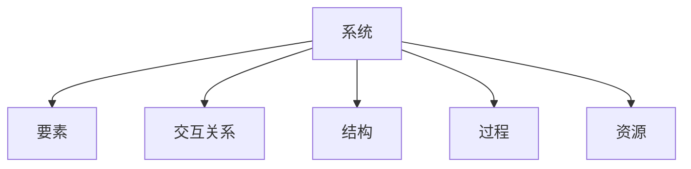

                 

# 系统思考的威力:化繁为简,抓本质

> 关键词：系统思考,复杂系统,化简,系统设计,系统优化

## 1. 背景介绍

### 1.1 问题由来
在信息爆炸的时代，系统复杂性愈发凸显。从互联网企业到智能制造，从智慧城市到医疗健康，各个领域都在面对着越来越复杂的系统挑战。如何应对系统复杂性，高效管理，优化运营，已成为各行业共同关注的课题。

系统思考作为一种有效的思维方式，强调从整体视角观察系统，理解系统结构，发现系统动力，旨在为复杂系统问题的解决提供方向和方法。但系统思考在技术实践中，面临诸多难题，如如何化繁为简，如何提取系统本质。本文将探讨系统思考的根本原则和方法，以及其在具体系统设计中的应用实践，通过系统优化，提升系统性能。

### 1.2 问题核心关键点
系统思考的核心在于从整体视角看待系统，理解系统间的关系和作用，以及如何通过优化系统结构、过程和资源，提升系统整体性能。本文重点介绍以下几个关键点：
- 系统的构成要素及其交互关系。
- 系统思考的方法论和工具。
- 系统优化和持续改进的策略。

## 2. 核心概念与联系

### 2.1 核心概念概述

系统思考涉及多个核心概念，本节将重点介绍几个关键概念及其联系：

- 系统(System)：由多个相互作用、相互依赖的要素构成的有机整体，旨在实现特定的功能或目的。
- 要素(Components)：构成系统的基本单元，如人、技术、资源等。
- 交互关系(Interactions)：要素间通过数据、信息、能量等方式进行交互和作用。
- 结构(Structure)：系统的构成方式和组织形态，如层级结构、网络结构等。
- 过程(Process)：系统运行的动态变化过程，如业务流程、生态演化等。
- 资源(Resource)：系统运行所需的物质、能量、信息等，如计算资源、数据资源、知识资源等。

这些概念之间的联系通过以下Mermaid流程图展示：



这个流程图展示了系统与各核心概念之间的逻辑关系，每一个概念都是系统的重要组成部分，通过交互关系、结构、过程和资源等机制，构成了一个完整的系统。

## 3. 核心算法原理 & 具体操作步骤
### 3.1 算法原理概述

系统思考的算法原理基于系统动力学(System Dynamics, SD)方法，通过构建系统模型，模拟系统运行状态和行为，理解系统结构、过程和动力，从而进行系统优化和改进。系统动力学方法将系统视为动态演化的过程，通过反馈回路和延迟，模拟系统行为和变化，揭示系统内在的结构和动力机制。

系统动力学模型通常包括以下几个核心组成部分：

- 变量(Variables)：系统状态和动态的描述，如库存、销售额等。
- 参数(Parameters)：变量的影响因素，如需求率、库存容量等。
- 流(Flows)：变量的输入输出关系，如订单流、库存流等。
- 反馈回路(Feedback Loops)：系统内部的反馈机制，如库存过多会导致需求下降。
- 延迟(Delays)：系统行为的变化滞后现象，如订单处理周期。

系统思考的算法步骤包括：

1. 系统定义：确定系统的边界和范围，明确系统的目标和功能。
2. 数据收集：获取系统运行的数据和信息，构建系统模型。
3. 模型建立：根据系统的变量、参数、流、反馈回路和延迟等要素，建立系统动力学模型。
4. 模型验证：通过仿真实验验证模型的合理性，进行参数调整和优化。
5. 系统优化：通过模型分析，提出系统优化方案，并进行实施。
6. 持续改进：定期评估系统运行状态，调整优化方案，保持系统性能。

### 3.2 算法步骤详解

#### 3.2.1 系统定义

系统定义是系统思考的第一步，通过明确系统的边界和范围，为后续的数据收集、模型建立和优化提供基础。

系统定义应包含以下要素：
- 系统的目的和功能：如企业目标、医疗健康目标等。
- 系统的组成要素：如组织机构、技术设备、人员等。
- 系统的环境因素：如市场环境、政策法规等。

#### 3.2.2 数据收集

数据收集是建立系统模型的基础，通过获取系统的运行数据和信息，构建系统的动态模型。

数据收集应考虑以下因素：
- 数据来源：选择可靠的数据源，如系统日志、业务报告等。
- 数据类型：包括定量和定性数据，如销售额、客户满意度等。
- 数据频率：确定数据收集的频率，如日、周、月等。

#### 3.2.3 模型建立

模型建立是系统思考的核心步骤，通过构建系统的动力学模型，揭示系统结构、过程和动力机制。

模型建立应遵循以下原则：
- 简化：通过抽象和简化，去除冗余和干扰信息。
- 逻辑：模型应符合逻辑和物理规律，如守恒、因果关系等。
- 可视化：模型应具备可视化特性，便于理解和调试。

#### 3.2.4 模型验证

模型验证是确保模型准确性和可靠性的关键步骤，通过仿真实验验证模型的合理性，进行参数调整和优化。

模型验证应包括以下步骤：
- 仿真实验：通过仿真实验模拟系统行为，观察系统的运行状态和输出结果。
- 参数调整：根据仿真结果调整模型参数，优化模型性能。
- 指标评估：定义关键性能指标，如系统响应时间、资源利用率等，评估模型效果。

#### 3.2.5 系统优化

系统优化是系统思考的最终目标，通过模型分析，提出系统优化方案，并进行实施。

系统优化应考虑以下因素：
- 资源优化：通过调整系统资源配置，优化系统性能。
- 流程优化：通过改进系统业务流程，提升系统效率。
- 策略优化：通过制定系统优化策略，实现系统目标。

#### 3.2.6 持续改进

持续改进是系统思考的持续过程，通过定期评估系统运行状态，调整优化方案，保持系统性能。

持续改进应包括以下步骤：
- 定期评估：定期采集系统运行数据，评估系统状态和性能。
- 优化调整：根据评估结果，调整优化方案，进行系统优化。
- 反馈机制：建立系统反馈机制，及时发现和解决问题。

### 3.3 算法优缺点

系统思考的优势在于其系统视角和整体思维，通过模型分析和优化，可以揭示系统的内在结构和动力机制，提升系统性能。主要优点包括：

- 全局视角：系统思考强调从整体视角理解系统，避免局部视角导致的错误决策。
- 因果关系：通过模型揭示系统因果关系，有助于理解系统动力和行为。
- 优化改进：通过模型分析，提出系统优化方案，提升系统性能。

系统思考的主要缺点在于模型构建的复杂性和抽象性，需要较高的专业知识和技能。主要缺点包括：

- 模型复杂：系统模型构建涉及多个变量、参数和反馈回路，需要较强的建模能力。
- 数据需求：系统思考需要大量高质量的数据，数据收集和处理成本较高。
- 难于调试：系统模型复杂，调试和优化难度较大，需要反复调整和验证。

## 4. 数学模型和公式 & 详细讲解 & 举例说明

### 4.1 数学模型构建

系统思考的数学模型通常通过动态差分方程或状态空间模型来构建，通过揭示系统的动态变化规律，理解系统结构和行为。

以一个简单的库存管理模型为例，定义系统变量和参数如下：

- 变量：
  - $S(t)$：库存量
  - $D(t)$：需求量
- 参数：
  - $P$：订单处理周期
  - $Q$：库存容量
  - $S_{initial}$：初始库存量
  - $D_{initial}$：初始需求量

根据系统的定义和行为，构建系统的差分方程如下：

$$
S(t+P) = S(t) - D(t) + D_{new}(t)
$$

其中 $D_{new}(t)$ 表示新增订单量，可通过需求函数计算：

$$
D_{new}(t) = D(t) - S(t) + Q
$$

将上述方程代入差分方程，得到系统的差分方程如下：

$$
S(t+P) = S(t) - D(t) + D(t) - S(t) + Q
$$

简化后得到系统的动态方程如下：

$$
S(t+P) = S(t) + Q - P
$$

通过上述方程，可以计算系统的库存量和订单处理周期对库存的影响。

### 4.2 公式推导过程

上述库存管理模型的公式推导过程如下：

1. 定义变量和参数
   - $S(t)$：库存量
   - $D(t)$：需求量
   - $P$：订单处理周期
   - $Q$：库存容量
   - $S_{initial}$：初始库存量
   - $D_{initial}$：初始需求量

2. 建立模型方程
   - $S(t+P) = S(t) - D(t) + D_{new}(t)$

3. 计算新增订单量
   - $D_{new}(t) = D(t) - S(t) + Q$

4. 代入差分方程
   - $S(t+P) = S(t) - D(t) + D_{new}(t)$
   - $S(t+P) = S(t) - D(t) + D(t) - S(t) + Q$
   - $S(t+P) = S(t) + Q - P$

通过上述推导过程，可以看出系统动力学模型构建的逻辑和步骤，模型方程反映了系统变量和参数之间的动态关系，通过仿真实验可以揭示系统行为和变化。

### 4.3 案例分析与讲解

以一家电子商务企业的库存管理为例，分析如何通过系统动力学模型进行库存优化。

企业面临的需求波动和供应链不稳定，库存量管理成为关键问题。通过系统动力学模型，可以分析订单处理周期、库存容量对库存量的影响，提出优化方案。

假设企业订单处理周期为1天，库存容量为500件，初始库存量为100件，初始需求量为50件/天。通过系统动力学模型，可以计算库存量随时间变化的规律。

通过仿真实验，观察不同参数下系统的库存量变化情况，发现当订单处理周期过短时，系统容易发生缺货；当库存容量过大时，系统容易发生库存积压。

基于模型分析，企业可以优化订单处理周期和库存容量，采用动态调节库存策略，提升库存管理效率。

## 5. 项目实践：代码实例和详细解释说明

### 5.1 开发环境搭建

在进行系统动力学模型实践前，需要准备好开发环境。以下是使用Python进行Sympy开发的环境配置流程：

1. 安装Anaconda：从官网下载并安装Anaconda，用于创建独立的Python环境。

2. 创建并激活虚拟环境：
```bash
conda create -n system_dynamics_env python=3.8 
conda activate system_dynamics_env
```

3. 安装Sympy：从官网获取并安装Sympy，用于符号计算和模型构建。
```bash
conda install sympy
```

4. 安装Matplotlib：用于绘制系统模型和仿真结果的可视化图表。
```bash
conda install matplotlib
```

5. 安装NumPy：用于数值计算和矩阵运算。
```bash
conda install numpy
```

完成上述步骤后，即可在`system_dynamics_env`环境中开始模型开发。

### 5.2 源代码详细实现

下面以一个简单的库存管理模型为例，给出使用Sympy进行系统动力学模型开发的Python代码实现。

首先，定义系统变量和参数：

```python
from sympy import symbols, Eq, solve, Rational

# 定义符号变量
S, D, S_new = symbols('S D S_new')

# 定义系统方程
equation = Eq(S_new, S - D)

# 定义需求函数
D = S - 500 + 1000  # 每天新增1000件，库存不满500件时需求下降至0
```

然后，建立系统的差分方程，并进行仿真实验：

```python
# 定义初始条件
S_initial = 100
D_initial = 50
P = 1  # 订单处理周期为1天
Q = 500  # 库存容量为500件

# 初始化库存量和需求量
S = S_initial
D = D_initial

# 仿真实验，输出前100天的库存量和订单处理周期
for t in range(100):
    # 计算新增订单量
    S_new = S - D + Q
    
    # 更新库存量
    S = S_new
    
    # 输出结果
    print(f"Day {t+1}, Inventory: {S}, Demand: {D}, Orders: {S_new}")
```

最后，绘制系统运行状态图，展示库存量和订单处理周期随时间变化的规律：

```python
import matplotlib.pyplot as plt

# 定义时间范围
t_range = range(100)

# 绘制库存量变化图
plt.plot(t_range, [S.subs(S_initial, s) for s in t_range], label='Inventory')
plt.xlabel('Time (days)')
plt.ylabel('Inventory (units)')
plt.title('Inventory Level Over Time')
plt.legend()

# 绘制订单处理周期变化图
plt.plot(t_range, [P] * 100, label='Order Processing')
plt.xlabel('Time (days)')
plt.ylabel('Order Processing')
plt.title('Order Processing Cycle')
plt.legend()

# 显示图形
plt.show()
```

以上就是使用Sympy进行系统动力学模型开发的完整代码实现。可以看到，通过Sympy库，我们可以方便地构建和验证系统模型，进行动态仿真实验。

### 5.3 代码解读与分析

让我们再详细解读一下关键代码的实现细节：

**定义变量和参数**：
- `S, D, S_new = symbols('S D S_new')`：定义库存量 `S`、需求量 `D` 和新增订单量 `S_new` 为符号变量，方便进行数学建模。
- `equation = Eq(S_new, S - D)`：定义系统的差分方程，`S_new` 表示新增订单量，`S` 表示库存量，`D` 表示需求量。

**建立需求函数**：
- `D = S - 500 + 1000`：定义需求函数，当库存量低于500件时，需求量下降至0，每天新增1000件。

**仿真实验**：
- `for t in range(100)`：循环100天，计算每个时间点的库存量和订单处理周期。
- `S_new = S - D + Q`：计算每个时间点的新增订单量，`Q` 为库存容量，初始库存量为100件，初始需求量为50件/天。
- `S = S_new`：更新库存量。
- `print(f"Day {t+1}, Inventory: {S}, Demand: {D}, Orders: {S_new}")`：输出每个时间点的库存量、需求量和新增订单量。

**绘制图形**：
- `plt.plot(t_range, [S.subs(S_initial, s) for s in t_range], label='Inventory')`：绘制库存量随时间变化的曲线。
- `plt.plot(t_range, [P] * 100, label='Order Processing')`：绘制订单处理周期随时间变化的曲线。
- `plt.xlabel('Time (days)')` 和 `plt.ylabel('Inventory (units)')`：设置坐标轴标签。
- `plt.title('Inventory Level Over Time')`：设置图形标题。
- `plt.legend()`：显示图例。

通过上述代码，我们可以看到，系统动力学模型可以用于分析和优化库存管理等实际问题，通过仿真实验，我们可以揭示系统的行为和变化规律，进行系统优化。

## 6. 实际应用场景

### 6.1 智能制造系统

在智能制造领域，系统思考可用于优化生产过程，提高生产效率和质量。例如，通过建立智能制造系统的动力学模型，可以分析生产线的瓶颈和波动，优化资源配置和工艺流程，提升生产效率。

以一家汽车制造企业为例，通过系统动力学模型，可以分析生产线的瓶颈和波动，优化资源配置和工艺流程，提升生产效率。具体步骤如下：

1. 定义系统变量和参数：
   - 变量：机器数量、工人数量、生产时间、故障率等。
   - 参数：生产线配置、工艺流程、维护周期等。

2. 建立模型方程：
   - 生产时间 = 生产线配置 * 生产效率
   - 故障时间 = 故障率 * 生产时间

3. 仿真实验：
   - 通过仿真实验模拟生产线的运行状态和行为，分析瓶颈和波动。
   - 优化生产线配置和工艺流程，提升生产效率和质量。

通过系统思考，智能制造系统可以更加科学地进行资源配置和过程优化，提高生产效率和质量。

### 6.2 智慧城市治理

在智慧城市治理中，系统思考可用于优化城市管理，提升城市运营效率。例如，通过建立智慧城市系统的动力学模型，可以分析城市交通流量、能源消耗等关键指标，优化城市资源配置和运行机制，提升城市治理能力。

以一家智慧城市为例，通过系统动力学模型，可以分析城市交通流量、能源消耗等关键指标，优化城市资源配置和运行机制，提升城市治理能力。具体步骤如下：

1. 定义系统变量和参数：
   - 变量：交通流量、能源消耗、空气质量等。
   - 参数：交通管理策略、能源政策、环保措施等。

2. 建立模型方程：
   - 交通流量 = 交通管理策略 * 交通需求
   - 能源消耗 = 能源政策 * 能源需求

3. 仿真实验：
   - 通过仿真实验模拟城市交通和能源的运行状态和行为，分析城市治理的关键因素。
   - 优化交通管理策略和能源政策，提升城市运营效率和治理能力。

通过系统思考，智慧城市系统可以更加科学地进行资源配置和治理优化，提升城市运营效率和治理能力。

### 6.3 医疗健康系统

在医疗健康领域，系统思考可用于优化诊疗流程，提升诊疗效果。例如，通过建立医疗健康系统的动力学模型，可以分析诊疗流程的瓶颈和波动，优化资源配置和诊疗流程，提升诊疗效果。

以一家医疗健康机构为例，通过系统动力学模型，可以分析诊疗流程的瓶颈和波动，优化资源配置和诊疗流程，提升诊疗效果。具体步骤如下：

1. 定义系统变量和参数：
   - 变量：患者数量、医生数量、检查时间、诊疗时间等。
   - 参数：诊疗流程、资源配置、检查设备等。

2. 建立模型方程：
   - 诊疗时间 = 诊疗流程 * 诊疗效率
   - 检查时间 = 检查设备 * 检查效率

3. 仿真实验：
   - 通过仿真实验模拟诊疗流程的运行状态和行为，分析诊疗流程的瓶颈和波动。
   - 优化诊疗流程和资源配置，提升诊疗效果。

通过系统思考，医疗健康系统可以更加科学地进行诊疗流程和资源优化，提升诊疗效果和患者满意度。

## 7. 工具和资源推荐

### 7.1 学习资源推荐

为了帮助开发者系统掌握系统思考的理论基础和实践技巧，这里推荐一些优质的学习资源：

1. 《系统动力学导论》书籍：系统动力学领域的经典教材，详细介绍了系统思考的原理和方法，是入门必读书籍。
2. 《系统思考实践指南》书籍：涵盖系统思考在实际问题中的应用案例，通过具体案例演示系统思考的实践技巧。
3. Coursera《系统动力学与系统建模》课程：斯坦福大学开设的高级课程，深入讲解系统动力学理论和方法，适合进一步学习。
4. YouTube《系统动力学与仿真建模》视频：系统动力学领域的权威讲解视频，适合初学者快速入门。
5. MATLAB《系统动力学工具箱》：MATLAB提供的系统动力学工具箱，支持模型的构建和仿真实验，适合工程实践。

通过对这些资源的学习实践，相信你一定能够快速掌握系统思考的精髓，并用于解决实际的系统问题。

### 7.2 开发工具推荐

高效的开发离不开优秀的工具支持。以下是几款用于系统动力学模型开发的常用工具：

1. MATLAB：功能强大的数学计算和仿真工具，支持系统动力学建模和仿真实验。
2. Simulink：MATLAB提供的仿真工具，支持模型构建和动态仿真，适合复杂系统的分析和优化。
3. AnyLogic：功能全面的系统仿真软件，支持离散事件仿真和连续事件仿真，适合复杂系统的建模和优化。
4. Python：灵活便捷的编程语言，支持Sympy、Pandas、NumPy等工具，适合系统建模和数据分析。
5. Google Colab：谷歌推出的在线Jupyter Notebook环境，免费提供GPU/TPU算力，适合快速实验和分享学习笔记。

合理利用这些工具，可以显著提升系统动力学模型的开发效率，加快创新迭代的步伐。

### 7.3 相关论文推荐

系统动力学和系统思考的研究源于学界的持续研究。以下是几篇奠基性的相关论文，推荐阅读：

1. Jay W. Forrester，《世界动力学》：系统动力学领域的奠基性论文，介绍了系统思考的基本原理和方法。
2. Peter Senge，《第五项修炼：学习型组织的艺术与实务》：系统思考领域的经典书籍，详细介绍了系统思考的实践技巧和应用案例。
3. Sabar CN，《系统思考与建模方法论》：系统动力学领域的综述性论文，总结了系统思考的基本方法和应用领域。
4. Chen J，《基于系统动力学的方法论》：系统动力学方法的综述性论文，涵盖了系统建模、仿真实验和优化改进等内容。

这些论文代表了大系统思考和系统动力学的最新进展，通过学习这些前沿成果，可以帮助研究者把握学科前进方向，激发更多的创新灵感。

## 8. 总结：未来发展趋势与挑战

### 8.1 总结

本文对系统思考的原理和应用进行了全面系统的介绍。首先阐述了系统思考的根本原则和方法，详细讲解了系统动力学模型的构建和仿真实验，通过实际案例展示了系统思考在优化系统性能方面的作用。通过本文的系统梳理，可以看到，系统思考是一种科学的方法论，通过整体视角和动态分析，揭示系统结构和动力机制，提升系统性能。

系统思考的应用领域非常广泛，从生产制造到智慧城市，从医疗健康到智能服务，通过系统思考，可以在复杂系统中实现优化和改进，提升系统效率和效果。

### 8.2 未来发展趋势

展望未来，系统思考和系统动力学将在更多领域得到应用，为系统优化带来新的方法。

1. 模型自动化：随着AI技术的发展，模型自动化和优化将更加便捷，通过AI辅助建模和优化，提升系统思考的效率和效果。
2. 数据驱动：系统思考将更加依赖于数据驱动，通过大数据和人工智能技术，分析系统行为和变化规律，优化系统性能。
3. 协同优化：系统思考将更加注重系统间的协同优化，通过跨领域的优化策略，提升系统整体性能。
4. 持续改进：系统思考将更加注重持续改进，通过定期评估和调整优化方案，保持系统性能的稳定和提升。

以上趋势凸显了系统思考的广阔前景，这些方向的探索发展，必将进一步提升系统优化技术，为复杂系统问题的解决提供更多选择和解决方案。

### 8.3 面临的挑战

尽管系统思考和系统动力学技术已经取得了显著进展，但在迈向更加智能化、普适化应用的过程中，它仍面临着诸多挑战：

1. 模型复杂性：系统动力学模型涉及大量变量和参数，构建和调试难度较大，需要较高的建模能力。
2. 数据需求：系统思考需要大量高质量的数据，数据收集和处理成本较高，且数据质量直接影响模型结果。
3. 模型可解释性：系统动力学模型的结果往往是黑盒的，缺乏可解释性，难以理解和调试。
4. 模型鲁棒性：系统动力学模型对参数和数据的变化敏感，模型的鲁棒性不足，需要更多的研究。
5. 模型自动化：系统思考的模型自动化和优化还需要进一步发展，才能更好地服务于实际应用。

正视系统思考和系统动力学面临的这些挑战，积极应对并寻求突破，将是大系统思考技术走向成熟的必由之路。相信随着学界和产业界的共同努力，这些挑战终将一一被克服，系统思考将为复杂系统的优化带来更多的可能。

### 8.4 研究展望

面向未来，系统思考和系统动力学需要在以下几个方向寻求新的突破：

1. 模型简化：通过引入人工智能和自动化技术，简化系统建模过程，提升建模效率和效果。
2. 数据整合：通过大数据和人工智能技术，整合多种数据源，提升数据质量和覆盖范围。
3. 可解释性：通过引入可解释性模型和方法，增强系统模型的可解释性，提升系统理解和调试能力。
4. 模型鲁棒性：通过研究模型鲁棒性，增强系统模型的鲁棒性和稳定性，应对复杂系统的不确定性和变化。
5. 跨领域优化：通过跨领域的优化策略，提升系统整体性能，实现复杂系统的协同优化。

这些方向的研究，必将引领系统思考和系统动力学的不断进步，为复杂系统问题的解决提供更多方法和选择。

## 9. 附录：常见问题与解答

**Q1：系统思考和系统动力学有什么区别？**

A: 系统思考和系统动力学是密切相关的概念，但系统思考更侧重于整体视角和系统理解，而系统动力学则更侧重于数学建模和仿真实验。系统思考强调从整体视角理解系统，揭示系统结构和动力机制，而系统动力学通过数学模型揭示系统动态变化规律，通过仿真实验进行系统优化。

**Q2：系统思考可以用于哪些领域？**

A: 系统思考可以应用于几乎所有复杂系统的优化和改进，如生产制造、智慧城市、医疗健康、智能服务等。通过系统思考，可以在复杂系统中实现优化和改进，提升系统效率和效果。

**Q3：如何构建系统动力学模型？**

A: 构建系统动力学模型需要以下几个步骤：
1. 定义系统变量和参数，明确系统的目标和功能。
2. 收集系统运行的数据和信息，构建系统的动态模型。
3. 根据系统的变量、参数、流、反馈回路和延迟等要素，建立系统动力学模型。
4. 通过仿真实验验证模型的合理性，进行参数调整和优化。

**Q4：系统思考和人工智能有什么区别？**

A: 系统思考和人工智能是不同的技术范式，但可以互相补充。系统思考更侧重于整体视角和系统理解，而人工智能更侧重于局部视角和精确计算。系统思考通过整体视角理解系统，揭示系统结构和动力机制，而人工智能通过局部视角进行精确计算和优化。

**Q5：系统思考有哪些实际应用案例？**

A: 系统思考可以应用于各种复杂系统的优化和改进，如生产制造、智慧城市、医疗健康、智能服务等。例如，通过系统思考优化生产线的瓶颈和波动，提升生产效率；通过系统思考优化城市交通流量和能源消耗，提升城市治理能力；通过系统思考优化诊疗流程和资源配置，提升诊疗效果。

通过本文的系统思考原理和实践技巧，相信你一定能够掌握系统思考的精髓，并用于解决实际的系统问题。系统思考作为一种科学的方法论，通过整体视角和动态分析，揭示系统结构和动力机制，提升系统性能，具有广泛的应用前景和深远的学术价值。

