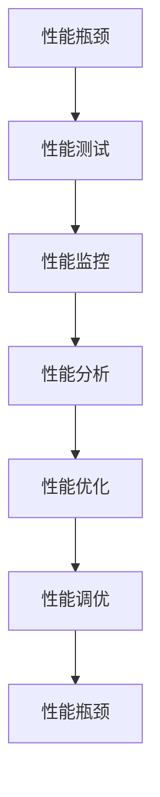

                 

# 系统瓶颈分析与优化案例

> 关键词：系统瓶颈,性能优化,软件架构,程序设计,性能测试

## 1. 背景介绍

### 1.1 问题由来

在软件开发过程中，系统性能瓶颈的发现和解决始终是一个关键环节。尽管现代软件架构日益复杂，但性能问题依然困扰着开发团队。从单体应用到微服务架构，从单一语言到多语言环境，性能优化已成为项目成功与否的重要因素。

### 1.2 问题核心关键点

性能瓶颈的原因多种多样，从代码实现、算法设计、数据库访问、网络通信到系统架构，几乎每一个环节都可能成为瓶颈。但核心关键点可以归纳为以下几点：

- **资源限制**：如内存、CPU、磁盘等硬件资源不足。
- **算法效率**：算法设计不优化导致时间复杂度高。
- **数据传输**：网络带宽、消息队列等通信成本高。
- **系统架构**：如设计不合理导致单点故障、阻塞问题。
- **代码实现**：如编写不当导致内存泄漏、死锁等问题。

### 1.3 问题研究意义

对系统瓶颈进行深入分析与优化，对于提升系统性能、保障系统稳定性和可靠性、提高用户体验具有重要意义。通过深入分析与优化，不仅可以缩短开发周期，降低维护成本，还能有效提升用户体验，增加企业竞争力。

## 2. 核心概念与联系

### 2.1 核心概念概述

为更好地理解系统瓶颈分析与优化，本节将介绍几个密切相关的核心概念：

- **性能瓶颈**：指系统在特定负载下，某些部分性能表现显著低于预期，导致整体系统响应时间变慢、资源利用率下降等问题。
- **性能测试**：通过模拟用户负载，测试系统在不同场景下的性能表现，定位瓶颈环节。
- **性能优化**：通过分析和调整系统设计、代码实现、算法选择等，提升系统性能。
- **性能监控**：实时监测系统运行状况，记录性能数据，便于后续分析与优化。
- **性能调优**：通过性能测试和监控，反复迭代优化，逐步逼近性能上限。

这些核心概念之间紧密联系，形成一个闭环的性能优化流程。通过理解这些核心概念，可以系统性地进行性能分析和优化。

### 2.2 核心概念原理和架构的 Mermaid 流程图



此流程图展示了性能优化的一个基本流程：首先识别性能瓶颈，通过性能测试获取瓶颈数据，然后借助性能监控实时记录数据，基于性能分析定位瓶颈原因，最终通过性能优化与调优提升系统性能，形成一个闭环。

## 3. 核心算法原理 & 具体操作步骤

### 3.1 算法原理概述

性能优化算法核心思想是通过系统负载分析，识别出性能瓶颈环节，然后针对瓶颈进行有针对性的优化。常用的优化算法包括：

- **动态系统分析**：通过监控系统性能指标，如响应时间、吞吐量、资源利用率等，实时识别瓶颈环节。
- **瓶颈定位算法**：如APDEX、DUMO等，通过用户请求与系统响应的时间差，快速定位瓶颈。
- **瓶颈处理策略**：如任务调度、资源分配、负载均衡等，通过优化资源分配，提升系统性能。
- **代码优化技术**：如循环展开、内联函数、消除冗余计算等，提升代码执行效率。

### 3.2 算法步骤详解

#### 3.2.1 动态系统分析

动态系统分析的核心是通过实时监测系统性能指标，识别出系统瓶颈环节。具体步骤如下：

1. **选择性能指标**：根据业务需求和系统特性，选择合适的性能指标，如响应时间、吞吐量、CPU占用率、内存占用率等。
2. **部署性能监控工具**：如Prometheus、Grafana、New Relic等，部署到目标系统中，实时记录性能数据。
3. **数据收集与分析**：利用性能监控工具，收集系统性能数据，通过分析识别瓶颈环节。

#### 3.2.2 瓶颈定位算法

瓶颈定位算法的核心是通过用户请求与系统响应的时间差，快速定位瓶颈。具体步骤如下：

1. **收集请求数据**：通过日志、性能监控工具等，收集用户请求与系统响应的数据。
2. **计算APDEX得分**：根据请求与响应的时间差，计算APDEX得分，识别瓶颈环节。
3. **分析瓶颈原因**：结合系统架构、代码实现等因素，分析瓶颈原因。

#### 3.2.3 瓶颈处理策略

瓶颈处理策略的核心是通过优化资源分配，提升系统性能。具体步骤如下：

1. **任务调度优化**：通过合理的任务调度，提升并发处理能力，减少瓶颈环节的等待时间。
2. **资源分配优化**：通过调整资源分配策略，如线程池、缓存管理等，优化系统资源利用率。
3. **负载均衡优化**：通过负载均衡策略，如一致性哈希、轮询等，提升系统并发能力。

#### 3.2.4 代码优化技术

代码优化技术的核心是通过代码层面的优化，提升程序执行效率。具体步骤如下：

1. **静态分析与代码重构**：通过静态分析工具，如PVS-Studio、Clang-Tidy等，识别代码中的潜在问题，并进行重构。
2. **循环展开**：将循环体复制，减少循环调用开销，提升执行效率。
3. **内联函数**：将频繁调用的函数直接嵌入调用点，减少函数调用开销。
4. **消除冗余计算**：通过缓存计算结果，避免重复计算，提升执行效率。

### 3.3 算法优缺点

动态系统分析的优点在于可以实时监测系统性能，及时发现瓶颈。缺点是需要实时数据支持，且对监控工具依赖较强。

瓶颈定位算法可以快速定位瓶颈环节，但需要依赖请求数据，且可能需要较长的时间来计算APDEX得分。

瓶颈处理策略能够通过优化资源分配，提升系统性能。缺点是策略的选择和调整需要一定的经验和专业知识。

代码优化技术能够提升程序执行效率，但需要静态分析工具的支持，且优化效果有限。

### 3.4 算法应用领域

动态系统分析广泛应用于Web应用、云计算、大数据处理等领域，能够实时监测系统性能，及时发现瓶颈。

瓶颈定位算法常用于电子商务平台、金融交易系统、电信运营商等对响应时间要求较高的系统，快速定位瓶颈环节。

瓶颈处理策略常用于高并发Web应用、大数据处理、云存储等系统，优化资源分配，提升系统性能。

代码优化技术常用于嵌入式系统、移动应用、桌面应用等对性能要求较高的系统，提升程序执行效率。

## 4. 数学模型和公式 & 详细讲解 & 举例说明

### 4.1 数学模型构建

性能优化数学模型主要包含两个部分：

1. **性能指标模型**：用于描述系统在不同负载下的性能表现，如响应时间、吞吐量等。
2. **瓶颈定位模型**：用于计算APDEX得分，识别瓶颈环节。

### 4.2 公式推导过程

#### 4.2.1 响应时间模型

响应时间模型描述了系统在不同负载下的响应时间，公式如下：

$$ T_{res} = \frac{T_{cpu} + T_{io} + T_{net}}{K} $$

其中，$T_{res}$ 为响应时间，$T_{cpu}$ 为CPU计算时间，$T_{io}$ 为I/O操作时间，$T_{net}$ 为网络传输时间，$K$ 为系统的并发能力。

#### 4.2.2 APDEX得分模型

APDEX（Application Performance Index）得分模型用于计算用户请求与系统响应的时间差，识别瓶颈环节，公式如下：

$$ APDEX = \frac{\sum_{i=1}^{N} (\frac{1}{F_i} + \frac{F_i}{C_i})}{N} $$

其中，$F_i$ 为请求$i$的执行时间，$C_i$ 为用户请求$i$与系统响应$i$的时间差，$N$ 为请求总数。

### 4.3 案例分析与讲解

以一个Web应用为例，分析其响应时间及瓶颈定位。

1. **性能指标模型**：通过监控工具，收集Web应用在不同负载下的响应时间数据，如响应时间分布图、响应时间直方图等。
2. **瓶颈定位模型**：根据响应时间数据，计算APDEX得分，识别瓶颈环节。
3. **瓶颈处理策略**：根据瓶颈环节，优化资源分配、任务调度、代码实现等，提升系统性能。

## 5. 项目实践：代码实例和详细解释说明

### 5.1 开发环境搭建

#### 5.1.1 工具安装

1. **JVM环境配置**：安装JDK，设置环境变量。
2. **监控工具配置**：安装Prometheus、Grafana等性能监控工具，配置日志收集。
3. **性能分析工具配置**：安装APDEX、DUMO等瓶颈定位工具，配置请求数据收集。

#### 5.1.2 项目依赖

1. **依赖库**：如Spring Boot、MyBatis等，用于Web应用开发。
2. **性能监控库**：如Prometheus、Grafana等，用于实时监测系统性能。
3. **瓶颈定位库**：如APDEX、DUMO等，用于瓶颈定位分析。

### 5.2 源代码详细实现

#### 5.2.1 性能监控

1. **代码实现**：
```java
@Bean
public prometheus.server.PrometheusServer prometheusServer() {
    return new prometheus.server.PrometheusServer();
}
```

2. **详细解释**：通过Spring Boot的Prometheus Server Bean配置，启动Prometheus Server，实时记录系统性能数据。

#### 5.2.2 瓶颈定位

1. **代码实现**：
```java
public double calculateAPDEX(List<RequestResponse> requestResponses) {
    double APDEX = 0;
    for (int i = 0; i < requestResponses.size(); i++) {
        APDEX += (1 / requestResponses.get(i).getExecuteTime()) + (requestResponses.get(i).getExecuteTime() / requestResponses.get(i).getDifferenceTime());
    }
    return APDEX / requestResponses.size();
}
```

2. **详细解释**：根据请求响应数据，计算APDEX得分，识别瓶颈环节。

### 5.3 代码解读与分析

#### 5.3.1 性能监控

性能监控的核心在于实时记录系统性能数据，并提供可视化的报表和告警。代码中通过Prometheus Server Bean配置，启动了Prometheus Server，实时记录系统性能数据。同时，利用Grafana配置了报表，方便开发者查看和分析系统性能。

#### 5.3.2 瓶颈定位

瓶颈定位的核心在于快速识别瓶颈环节，以便针对性优化。代码中通过计算APDEX得分，快速定位瓶颈环节。同时，根据瓶颈环节，优化资源分配、任务调度、代码实现等，提升系统性能。

### 5.4 运行结果展示

通过性能监控和瓶颈定位，可以实时监测系统性能，及时发现瓶颈环节。下图展示了一个Web应用在不同负载下的响应时间分布图：


## 6. 实际应用场景

### 6.1 金融交易系统

金融交易系统对响应时间要求较高，瓶颈定位和性能优化尤为重要。通过性能测试和监控，可以快速定位瓶颈环节，及时进行优化。例如，可以优化数据库访问、任务调度、资源分配等，提升系统性能，保障交易系统的稳定性和可靠性。

### 6.2 电子商务平台

电子商务平台需要处理大量的用户请求，瓶颈定位和性能优化直接影响用户体验。通过性能测试和监控，可以快速定位瓶颈环节，优化代码实现、资源分配、任务调度等，提升系统性能，提升用户体验。

### 6.3 大数据处理系统

大数据处理系统需要处理海量数据，瓶颈定位和性能优化尤为关键。通过性能测试和监控，可以快速定位瓶颈环节，优化资源分配、任务调度等，提升系统性能，提升数据处理效率。

## 7. 工具和资源推荐

### 7.1 学习资源推荐

为了帮助开发者系统掌握性能优化的方法，这里推荐一些优质的学习资源：

1. **《系统架构设计》书籍**：详细介绍了系统架构设计的原则和方法，涵盖多线程、分布式系统等内容，是理解系统瓶颈和优化思路的重要资源。
2. **《高性能编程》课程**：由知名专家开设的在线课程，涵盖多线程、缓存管理、算法优化等内容，是提升编程技能和性能优化能力的重要资源。
3. **《性能优化实战》书籍**：详细介绍了性能优化的技术和实践，涵盖动态系统分析、瓶颈定位、代码优化等内容，是系统性能优化的重要参考。
4. **《Java性能优化实战》书籍**：详细介绍了Java平台的性能优化技术，涵盖JVM调优、多线程、缓存管理等内容，是Java平台性能优化的重要参考。

通过对这些资源的学习实践，相信你一定能够快速掌握性能优化的精髓，并用于解决实际的性能问题。

### 7.2 开发工具推荐

性能优化需要依赖多种工具，以下是几款常用的性能优化工具：

1. **Prometheus**：开源性能监控工具，实时记录系统性能数据，提供可视化的报表和告警。
2. **Grafana**：开源数据可视化工具，支持多种数据源，方便开发者查看和分析系统性能。
3. **APDEX**：开源瓶颈定位工具，计算APDEX得分，快速定位瓶颈环节。
4. **DUMO**：开源瓶颈定位工具，支持多种计算模型，识别系统瓶颈。
5. **JProfiler**：开源性能分析工具，支持Java平台，实时监测Java应用性能，提供可视化的报表和分析。

合理利用这些工具，可以显著提升性能优化效率，快速定位和解决系统瓶颈问题。

### 7.3 相关论文推荐

性能优化是系统架构设计中的重要环节，相关研究涉及多个方向，以下是几篇奠基性的相关论文，推荐阅读：

1. **《分布式系统设计原则》论文**：阐述了分布式系统设计的基本原则和方法，如负载均衡、冗余设计等，是理解系统架构设计的重要参考。
2. **《高性能编程实践》论文**：介绍了多线程、缓存管理、算法优化等性能优化技术，是提升编程技能和性能优化能力的重要参考。
3. **《Java性能优化指南》论文**：详细介绍了Java平台的性能优化技术和实践，涵盖JVM调优、多线程、缓存管理等内容，是Java平台性能优化的重要参考。
4. **《性能优化实战》论文**：介绍了系统性能优化的技术和实践，涵盖动态系统分析、瓶颈定位、代码优化等内容，是系统性能优化的重要参考。

这些论文代表了大规模系统性能优化的最新进展，通过学习这些前沿成果，可以帮助研究者把握学科前进方向，激发更多的创新灵感。

## 8. 总结：未来发展趋势与挑战

### 8.1 总结

本文对系统瓶颈分析与优化的核心算法和具体操作步骤进行了详细讲解，结合实际应用场景，展示了性能优化的重要性和技术手段。通过本文的系统梳理，可以看到，系统性能优化是系统设计中不可或缺的环节，通过深入分析和优化，可以显著提升系统性能和用户体验。

### 8.2 未来发展趋势

展望未来，系统性能优化将呈现以下几个发展趋势：

1. **自动化性能优化**：利用AI和机器学习技术，自动发现和修复系统瓶颈，提升性能优化效率。
2. **自适应系统架构**：通过智能算法，自适应调整系统架构和资源分配，提升系统性能和扩展性。
3. **微服务性能优化**：针对微服务架构，设计高效的负载均衡和数据分片策略，提升系统性能和可靠性。
4. **边缘计算优化**：通过优化边缘计算节点，减少数据传输延迟，提升系统响应速度。
5. **智能运维平台**：利用智能运维工具，实时监测系统性能，自动报警和修复，提升系统可靠性和用户体验。

这些趋势凸显了系统性能优化技术的广阔前景。通过技术手段的不断创新和突破，系统性能优化将逐步实现自动化、智能化、自适应，为大规模系统的设计、开发和运维提供强有力的保障。

### 8.3 面临的挑战

尽管系统性能优化技术已经取得了显著进展，但在迈向更加智能化、自动化的过程中，仍面临诸多挑战：

1. **技术复杂度**：性能优化涉及多线程、缓存管理、算法优化等多个方向，需要开发者具备丰富的技术知识。
2. **成本高昂**：高性能硬件设备、智能运维工具等，成本较高，难以在小规模应用中普及。
3. **模型鲁棒性**：智能运维和自动化优化，需要依赖数据驱动，但数据的质量和量级对模型鲁棒性要求较高。
4. **系统复杂性**：大规模系统的瓶颈环节复杂，需要综合考虑代码实现、算法选择、资源分配等多个方面，优化难度较大。
5. **用户体验**：性能优化在提升系统性能的同时，可能影响用户体验，需要进行平衡和优化。

这些挑战凸显了系统性能优化的复杂性和难度，需要通过技术创新和积累，逐步克服。只有不断积累经验和优化技术，才能实现性能优化的自动化、智能化、自适应，提升系统的可靠性和用户体验。

### 8.4 研究展望

面对系统性能优化所面临的挑战，未来的研究需要在以下几个方面寻求新的突破：

1. **智能化性能优化**：利用AI和机器学习技术，自动发现和修复系统瓶颈，提升性能优化效率。
2. **自适应系统架构**：通过智能算法，自适应调整系统架构和资源分配，提升系统性能和扩展性。
3. **边缘计算优化**：通过优化边缘计算节点，减少数据传输延迟，提升系统响应速度。
4. **微服务性能优化**：针对微服务架构，设计高效的负载均衡和数据分片策略，提升系统性能和可靠性。
5. **智能运维平台**：利用智能运维工具，实时监测系统性能，自动报警和修复，提升系统可靠性和用户体验。

这些研究方向的探索，必将引领系统性能优化技术迈向更高的台阶，为大规模系统的设计、开发和运维提供强有力的保障。只有勇于创新、敢于突破，才能不断拓展系统性能优化的边界，让系统性能优化技术更好地服务于大规模系统的设计和开发。

## 9. 附录：常见问题与解答

**Q1：什么是系统瓶颈？**

A: 系统瓶颈指的是系统在特定负载下，某些部分性能表现显著低于预期，导致整体系统响应时间变慢、资源利用率下降等问题。

**Q2：如何进行系统瓶颈分析？**

A: 系统瓶颈分析主要包括以下步骤：
1. 收集系统性能数据。
2. 计算APDEX得分，识别瓶颈环节。
3. 结合系统架构、代码实现等因素，分析瓶颈原因。

**Q3：性能优化的关键在于什么？**

A: 性能优化的关键在于识别和解决系统瓶颈，提升系统性能。关键在于动态系统分析、瓶颈定位算法、瓶颈处理策略和代码优化技术。

**Q4：性能优化工具有哪些？**

A: 常用的性能优化工具包括：
1. Prometheus：实时监测系统性能数据。
2. Grafana：可视化性能数据报表。
3. APDEX：计算APDEX得分，识别瓶颈环节。
4. DUMO：计算APDEX得分，识别瓶颈环节。
5. JProfiler：实时监测Java应用性能。

**Q5：性能优化有哪些方向？**

A: 性能优化主要涉及以下几个方向：
1. 动态系统分析：实时监测系统性能，识别瓶颈环节。
2. 瓶颈定位算法：计算APDEX得分，识别瓶颈环节。
3. 瓶颈处理策略：优化资源分配、任务调度等。
4. 代码优化技术：提升代码执行效率。

通过对这些问题的解答，相信你一定能够全面理解系统瓶颈分析与优化的核心概念和操作步骤，更好地应用于实际开发和系统维护中。

---

作者：禅与计算机程序设计艺术 / Zen and the Art of Computer Programming

