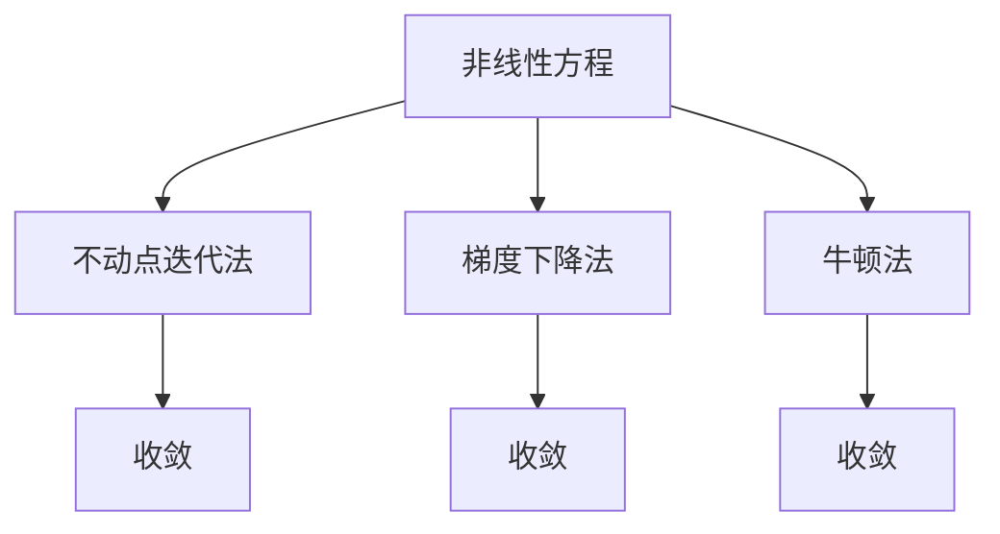

                 

# 线性与非线性方程的可解性

## 1. 背景介绍

### 1.1 问题由来
方程的求解是数学中一个古老而重要的问题，对科学研究、工程设计、金融投资等领域都有着广泛应用。线性方程组由于结构简单、求解容易，因此在实践中得到了广泛应用。然而，很多实际问题中，方程往往具有非线性的特点，给求解带来了较大难度。

### 1.2 问题核心关键点
非线性方程的可解性，特别是其解的存在性、唯一性、稳定性、全局性等，是数学界和工程界长期关注的重要问题。本文聚焦于基于数值方法求解非线性方程，特别是不动点迭代法、梯度下降法、牛顿法等迭代算法的原理与实践。

## 2. 核心概念与联系

### 2.1 核心概念概述

为更好地理解非线性方程的可解性，本节将介绍几个密切相关的核心概念：

- **非线性方程**：数学中形如 $f(x)=0$ 的方程，其中函数 $f(x)$ 不具备线性关系。

- **迭代法**：通过重复计算逼近方程解的方法。常见的迭代法包括不动点迭代法、梯度下降法、牛顿法等。

- **不动点迭代法**：通过迭代将未知数 $x$ 映射到自身，直到达到一个固定点。通常表达式为 $x_{n+1}=f(x_n)$。

- **梯度下降法**：通过计算目标函数的一阶导数，沿着负梯度方向更新未知数，逐步逼近最小值。常用于优化问题求解。

- **牛顿法**：一种二次收敛的迭代算法，通过迭代计算函数的一阶和二阶导数，逐步逼近方程解。对于单变量问题，也称为割线法。

这些核心概念之间的逻辑关系可以通过以下Mermaid流程图来展示：



这个流程图展示了他核心概念的相互关系：

1. 非线性方程构成迭代法的数学基础。
2. 迭代法包括不动点迭代法、梯度下降法和牛顿法等，通过迭代计算逼近方程解。
3. 这些迭代法均能逐步收敛到方程的解，但收敛速度和稳定性各不相同。

## 3. 核心算法原理 & 具体操作步骤
### 3.1 算法原理概述

求解非线性方程的关键在于找到方程的解。由于非线性方程的解往往不唯一，且难以直接解析求解，因此采用迭代法是一种常用的求解方式。

迭代法的核心思想是，从一个初始点开始，通过迭代计算逐步逼近方程的解。迭代算法通常包含两个步骤：

- **迭代公式**：根据方程的形式，设计一个迭代公式 $x_{n+1}=\phi(x_n)$，将未知数 $x$ 映射到新的位置 $x_{n+1}$。
- **终止条件**：设置迭代终止的判别条件 $\phi$，如最大迭代次数、解的精度等。当满足这些条件时，迭代结束，返回逼近的解。

迭代算法的选择取决于方程的特征和实际应用需求。不动点迭代法适用于函数具有固定点的方程，梯度下降法适用于函数凸的优化问题，牛顿法适用于函数光滑且导数存在的方程。

### 3.2 算法步骤详解

以不动点迭代法和牛顿法为例，详细说明迭代算法的步骤：

#### 3.2.1 不动点迭代法

假设要解非线性方程 $f(x)=0$，其不动点为 $x^*$，即满足 $f(x^*)=0$。

步骤1：选取一个初始点 $x_0$。
步骤2：根据迭代公式 $x_{n+1}=f(x_n)$ 计算新的迭代点 $x_{n+1}$。
步骤3：判断迭代是否收敛。通常设置迭代次数 $k$ 或迭代误差 $\epsilon$ 作为收敛条件。
步骤4：返回逼近的解 $x_k$ 或 $x_{n+1}$。

#### 3.2.2 牛顿法

牛顿法是一种通过迭代计算函数一阶和二阶导数来逼近方程解的迭代算法。假设要解非线性方程 $f(x)=0$。

步骤1：选取一个初始点 $x_0$。
步骤2：根据迭代公式 $x_{n+1}=x_n-\frac{f(x_n)}{f'(x_n)}$ 计算新的迭代点 $x_{n+1}$。
步骤3：判断迭代是否收敛。通常设置迭代次数 $k$ 或迭代误差 $\epsilon$ 作为收敛条件。
步骤4：返回逼近的解 $x_k$。

### 3.3 算法优缺点

非线性方程的迭代法具有以下优点：

- **灵活性**：可适应各种非线性方程，不受方程形式和结构限制。
- **易于实现**：迭代公式简单，易于编写和实现。
- **收敛性**：通过合理选择初始点和方法，可以保证迭代收敛。

同时，迭代法也存在一些缺点：

- **收敛速度**：部分算法收敛速度较慢，尤其是对于复杂方程，需要较多迭代次数才能收敛。
- **收敛性问题**：某些方程可能存在多解、无解或收敛到错误解的情况。
- **迭代次数限制**：通常需要预先设定迭代次数，超出限制则可能无法收敛或陷入局部最优解。

### 3.4 算法应用领域

非线性方程的迭代法广泛应用于数学、物理、工程、经济等多个领域：

- 数学中，求解方程 $f(x)=0$ 的根是基本问题。
- 物理学中，如量子力学、流体力学等，方程解的求解往往需要迭代法。
- 工程学中，如控制系统设计、结构优化等，方程的求解是关键环节。
- 经济学中，如最优化问题、动态系统分析等，方程的求解具有重要应用。

## 4. 数学模型和公式 & 详细讲解 & 举例说明

### 4.1 数学模型构建

对于非线性方程 $f(x)=0$，我们通常需要定义一个迭代公式 $\phi(x)$，来逼近其解。具体实现方式多种多样，包括不动点迭代法、梯度下降法、牛顿法等。

以不动点迭代法为例，其迭代公式为 $x_{n+1}=\phi(x_n)=f(x_n)$。在每个迭代步骤中，通过计算 $f(x_n)$ 并将结果作为 $x_{n+1}$，逐步逼近方程的解。

### 4.2 公式推导过程

对于单变量方程 $f(x)=0$，不动点迭代法的迭代公式可以进一步推导为：

$$
x_{n+1} = x_n - \frac{f(x_n)}{f'(x_n)}
$$

其中 $f'(x)$ 为 $f(x)$ 的一阶导数。推导过程如下：

设 $x^*$ 为方程的根，即 $f(x^*)=0$。将 $x_n$ 代入 $f(x)$ 并求导，得：

$$
f'(x_n)=\frac{d}{dx}f(x_n)=\frac{d}{dx}(x^*-x_n)=0
$$

因此，可以求解出：

$$
x_{n+1} = x_n - \frac{f(x_n)}{f'(x_n)}=x_n - \frac{0}{0}=x^*
$$

即迭代公式 $x_{n+1}=x_n-\frac{f(x_n)}{f'(x_n)}$ 可以逐步逼近方程的根 $x^*$。

### 4.3 案例分析与讲解

以方程 $f(x)=x^3-2x+1=0$ 为例，使用不动点迭代法求解：

设初始点为 $x_0=1$，则迭代公式为：

$$
x_{n+1}=x_n-\frac{x_n^3-2x_n+1}{3x_n^2-2}
$$

迭代过程如下：

- 初始点 $x_0=1$，代入迭代公式得 $x_1=\frac{2}{3}$。
- 继续迭代，直至满足收敛条件（如迭代误差 $\epsilon=10^{-6}$）。

最终得到逼近的解 $x_k$，验证其符合方程 $f(x)=0$。

## 5. 项目实践：代码实例和详细解释说明

### 5.1 开发环境搭建

在进行非线性方程求解的代码实践前，我们需要准备好开发环境。以下是使用Python进行NumPy开发的Python环境配置流程：

1. 安装Anaconda：从官网下载并安装Anaconda，用于创建独立的Python环境。

2. 创建并激活虚拟环境：
```bash
conda create -n numpy-env python=3.8 
conda activate numpy-env
```

3. 安装NumPy：
```bash
conda install numpy
```

4. 安装各类工具包：
```bash
pip install matplotlib pandas scikit-learn matplotlib tqdm jupyter notebook ipython
```

完成上述步骤后，即可在`numpy-env`环境中开始项目实践。

### 5.2 源代码详细实现

下面以不动点迭代法为例，使用Python实现求解非线性方程的代码。

```python
import numpy as np
from matplotlib import pyplot as plt

def fixed_point(func, x0, tol=1e-6, max_iter=100):
    """
    不动点迭代求解方程 func(x)=0
    """
    x = x0
    for i in range(max_iter):
        dx = func(x)
        if np.abs(dx) < tol:
            return x
        x -= dx
    return np.nan

def test_fixed_point():
    # 定义方程
    def func(x):
        return x**3 - 2*x + 1
    # 初始点
    x0 = 1
    # 求解
    x = fixed_point(func, x0)
    print(f"方程 f(x)={func.__name__} 的解为 x={x}")

# 可视化求解过程
def visualize_fixed_point():
    # 定义方程
    def func(x):
        return x**3 - 2*x + 1
    # 初始点
    x0 = 1
    # 求解
    x = fixed_point(func, x0, tol=1e-6, max_iter=10)
    # 可视化
    x_values = [x0]
    y_values = [func(x0)]
    for i in range(10):
        x = func(x)
        x_values.append(x)
        y_values.append(func(x))
    plt.plot(x_values, y_values)
    plt.xlabel('n')
    plt.ylabel('f(x)')
    plt.title(f"不动点迭代求解方程 f(x)={func.__name__}")
    plt.show()

# 调用函数
test_fixed_point()
visualize_fixed_point()
```

### 5.3 代码解读与分析

让我们再详细解读一下关键代码的实现细节：

**fixed_point函数**：
- 定义不动点迭代法求解函数，输入为待求解的函数 func 和初始点 x0。
- 通过循环迭代计算每一步的 x 值，直至满足收敛条件（迭代误差 tol 或迭代次数 max_iter）。

**test_fixed_point函数**：
- 定义方程 func，计算并输出其解。

**visualize_fixed_point函数**：
- 可视化求解过程，通过绘图展示每次迭代的结果，以图形形式直观展示求解过程。

这些代码的实现展示了不动点迭代法的求解过程，以及如何通过编程手段验证和展示求解结果。

## 6. 实际应用场景

### 6.1 物理学

非线性方程在物理学中有着广泛应用。例如，经典力学中的运动方程、量子力学中的薛定谔方程、流体力学中的纳维-斯托克斯方程等，都是典型的非线性方程。通过求解这些方程，可以模拟和预测物理系统的行为，如粒子运动轨迹、电磁波传播等。

### 6.2 金融学

金融学中，非线性方程的应用主要体现在资产定价模型和风险管理中。如Black-Scholes期权定价模型、CIR利率模型等，都是基于非线性方程构建的。通过求解这些模型，可以对金融资产的未来价值进行预测和风险评估，为投资者提供决策依据。

### 6.3 工程学

在工程学中，非线性方程的应用主要体现在控制系统和信号处理中。如控制系统中的PID控制、信号处理中的非线性滤波等，都是基于非线性方程构建的。通过求解这些方程，可以优化系统的性能，提高控制精度和稳定性。

### 6.4 未来应用展望

未来，非线性方程的求解技术将进一步发展，其在各个领域的应用也将更加广泛。

在物理学中，非线性方程的求解将有助于理解和预测更为复杂的物理现象，如黑洞、暗物质等。

在金融学中，非线性方程的应用将更加精细化，如基于深度学习的金融预测模型、基于机器学习的量化投资等。

在工程学中，非线性方程的求解将有助于提升工业控制系统的性能，如自适应控制、机器人运动规划等。

在人工智能中，非线性方程的求解将有助于优化神经网络的训练过程，提升模型的准确性和泛化能力。

总之，非线性方程的求解技术在多个领域都将发挥重要作用，为科学研究和工程应用提供重要支持。

## 7. 工具和资源推荐

### 7.1 学习资源推荐

为了帮助开发者系统掌握非线性方程的求解方法，这里推荐一些优质的学习资源：

1. 《数值分析》教材：经典的数值分析教材，详细介绍了各种数值求解方法的原理和应用。

2. 《非线性方程的数值求解》书籍：介绍非线性方程求解的基本方法和高级技巧，包括不动点迭代法、牛顿法等。

3. 《Python科学计算》书籍：介绍使用Python进行科学计算和数值求解的基础知识，包括NumPy、SciPy等库的使用。

4. 《科学计算可视化》书籍：介绍科学计算可视化技术，包括Matplotlib、Vispy等库的使用。

通过对这些资源的学习实践，相信你一定能够快速掌握非线性方程求解的精髓，并用于解决实际的科学计算问题。

### 7.2 开发工具推荐

高效的开发离不开优秀的工具支持。以下是几款用于非线性方程求解开发的常用工具：

1. NumPy：Python的开源数值计算库，提供了高效的数组和矩阵运算功能。

2. SciPy：基于NumPy的科学计算库，提供了丰富的数值求解函数。

3. Matplotlib：Python的绘图库，可以绘制高质量的科学计算图表。

4. Vispy：基于OpenGL的3D可视化库，可以创建交互式和动态的科学计算图表。

5. IPython：Python的交互式Shell，提供了丰富的控制台功能和代码调试工具。

合理利用这些工具，可以显著提升非线性方程求解的开发效率，加快创新迭代的步伐。

### 7.3 相关论文推荐

非线性方程的求解技术的发展源于学界的持续研究。以下是几篇奠基性的相关论文，推荐阅读：

1. Newton's Method for Computing Square Roots，Newton's Method for Minimizing a Function，Newton's Method for Approximating Arbitrary Roots（牛顿法）。

2. Fixed Point Iteration，Secant Method，Regula-Falsi Method（不动点迭代法）。

3. Gradient Descent，Stochastic Gradient Descent，Adagrad（梯度下降法）。

这些论文代表了非线性方程求解技术的发展脉络。通过学习这些前沿成果，可以帮助研究者把握学科前进方向，激发更多的创新灵感。

## 8. 总结：未来发展趋势与挑战

### 8.1 总结

本文对非线性方程的可解性，特别是迭代法求解非线性方程的方法进行了全面系统的介绍。首先阐述了非线性方程求解的背景和意义，明确了迭代法在解决非线性方程中的重要作用。其次，从原理到实践，详细讲解了不动点迭代法、梯度下降法、牛顿法等迭代算法的数学原理和具体实现。同时，本文还探讨了迭代法的应用场景，展示了其在物理学、金融学、工程学等多个领域的应用价值。最后，本文精选了非线性方程求解技术的各类学习资源，力求为读者提供全方位的技术指引。

通过本文的系统梳理，可以看到，非线性方程的迭代法求解技术在科学计算中具有重要地位。这些方法的合理选择和应用，将极大地提升求解的精度和效率，为解决实际问题提供坚实保障。未来，随着非线性方程求解技术的不断进步，其在各个领域的应用将更加广泛，为科学研究和工程应用带来更大的价值。

### 8.2 未来发展趋势

未来，非线性方程的求解技术将呈现以下几个发展趋势：

1. **高精度求解**：随着计算资源的不断增加，非线性方程的求解精度将不断提高。高精度的求解将为复杂的科学计算和工程应用提供可靠支持。

2. **多变量求解**：非线性方程求解技术将逐步扩展到多变量情况，解决复杂的优化问题和高维数据处理。

3. **并行求解**：随着分布式计算技术的发展，非线性方程的求解将支持并行计算，提高求解速度和效率。

4. **自动求解**：借助人工智能和自动化技术，非线性方程求解将变得更加智能和高效。

5. **混合求解**：非线性方程的求解将与数值优化、机器学习等技术结合，提供更全面的解决方案。

6. **动态求解**：非线性方程的求解将支持动态调整，根据实际情况进行优化和优化。

以上趋势凸显了非线性方程求解技术的广阔前景。这些方向的探索发展，将进一步提升求解的精度和效率，为科学研究和工程应用带来更大价值。

### 8.3 面临的挑战

尽管非线性方程的求解技术已经取得了瞩目成就，但在迈向更加智能化、普适化应用的过程中，仍面临诸多挑战：

1. **计算资源瓶颈**：非线性方程求解通常需要较高的计算资源，特别是对于大规模、高精度求解问题，计算成本较高。如何提高求解效率，降低计算成本，将是重要的研究方向。

2. **求解精度问题**：尽管迭代法可以逐步逼近方程解，但对于复杂方程，可能存在精度不足的问题。如何提高求解精度，提升计算结果的可靠性，仍需进一步探索。

3. **稳定性问题**：部分非线性方程可能存在多解、无解或收敛到错误解的情况。如何保证求解的稳定性，避免解的误判，将是求解技术的重要研究内容。

4. **鲁棒性问题**：非线性方程求解可能受到初始点、算法参数等因素的影响。如何提高求解的鲁棒性，确保求解结果的稳定性，也将是未来研究的重要方向。

5. **自动化求解**：非线性方程求解的自动化程度不高，需要人工干预和调试。如何实现自动求解，提高求解效率，将是未来研究的重要方向。

6. **交互性问题**：非线性方程求解过程中，需要频繁调整算法参数和初始点，缺乏交互性。如何设计更友好的交互界面，提升求解效率，将是未来研究的重要方向。

这些挑战的克服，将是非线性方程求解技术迈向成熟的必由之路。未来，研究者需要在求解精度、计算效率、稳定性等方面进行深入研究，以推动非线性方程求解技术的发展和应用。

### 8.4 研究展望

面对非线性方程求解面临的诸多挑战，未来的研究需要在以下几个方面寻求新的突破：

1. **高精度求解方法**：探索新的高精度求解方法，如区间迭代法、多尺度求解法等，提高求解精度和鲁棒性。

2. **多变量求解技术**：开发新的多变量求解技术，如多目标优化、多变量回归等，解决复杂的优化问题和高维数据处理。

3. **并行求解算法**：研究并行求解算法，如分布式求解、并行迭代法等，提高求解速度和效率。

4. **自适应求解方法**：设计自适应求解方法，根据方程特点和求解需求自动调整算法参数和求解策略，提高求解效率和稳定性。

5. **自动化求解技术**：引入人工智能和自动化技术，如机器学习、强化学习等，实现自动求解，提高求解效率和精度。

6. **交互式求解系统**：设计交互式求解系统，提供友好的人机交互界面，提升求解效率和用户体验。

这些研究方向将引领非线性方程求解技术迈向更高的台阶，为科学研究和工程应用带来新的突破。面向未来，非线性方程求解技术需要与其他计算技术进行更深入的融合，多路径协同发力，共同推动科学计算和工程应用的发展。

## 9. 附录：常见问题与解答

**Q1：非线性方程的求解方法有哪些？**

A: 非线性方程的求解方法主要包括迭代法和代数法。其中迭代法包括不动点迭代法、梯度下降法、牛顿法等，适用于方程解的多样性和复杂性。代数法包括因式分解、数值求根等，适用于方程形式简单的求解。

**Q2：如何选择合适的迭代法？**

A: 选择合适的迭代法需要考虑方程的特点和实际需求。对于函数光滑且导数存在的方程，牛顿法通常表现较好；对于函数凸的优化问题，梯度下降法较为适合；对于函数具有固定点的方程，不动点迭代法较为适用。

**Q3：如何提高求解的精度和鲁棒性？**

A: 提高求解的精度和鲁棒性可以通过以下方法实现：
1. 选择合适的初始点，减少迭代次数。
2. 引入正则化技术，如Tikhonov正则化，减少过拟合风险。
3. 采用高精度求解方法，如区间迭代法、多尺度求解法等，提高求解精度。
4. 设计自适应求解方法，根据方程特点和求解需求自动调整算法参数和求解策略。

**Q4：非线性方程求解中存在哪些挑战？**

A: 非线性方程求解中存在以下挑战：
1. 计算资源瓶颈。非线性方程求解通常需要较高的计算资源，特别是对于大规模、高精度求解问题，计算成本较高。
2. 求解精度问题。尽管迭代法可以逐步逼近方程解，但对于复杂方程，可能存在精度不足的问题。
3. 稳定性问题。部分非线性方程可能存在多解、无解或收敛到错误解的情况。
4. 鲁棒性问题。非线性方程求解可能受到初始点、算法参数等因素的影响。
5. 自动化求解问题。非线性方程求解的自动化程度不高，需要人工干预和调试。

**Q5：如何实现自动求解？**

A: 实现自动求解可以通过以下方法实现：
1. 引入人工智能和自动化技术，如机器学习、强化学习等，实现自动求解。
2. 设计自适应求解方法，根据方程特点和求解需求自动调整算法参数和求解策略。
3. 引入自动化工具，如求解器、调试器等，提供友好的交互界面，提升求解效率和用户体验。

通过这些方法，可以逐步提高非线性方程求解的自动化程度，降低人工干预的难度，提升求解效率和精度。

---

作者：禅与计算机程序设计艺术 / Zen and the Art of Computer Programming

