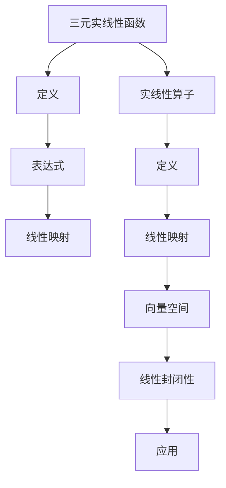

                 

# 线性代数导引：三元实线性函数与实线性算子

## 1. 背景介绍

在数学中，线性代数是一门研究向量空间和线性变换的基础学科。三元实线性函数与实线性算子是线性代数中非常基础且重要的概念。它们广泛应用于工程科学、物理学、经济学等众多领域。本文将从背景介绍开始，详细介绍三元实线性函数与实线性算子的定义、性质以及应用，力求让读者通过学习这些概念，更好地理解和应用它们。

## 2. 核心概念与联系

### 2.1 核心概念概述

三元实线性函数与实线性算子是线性代数中的核心概念，它们在矩阵计算、向量空间、特征值分析等许多领域中都有广泛应用。

**三元实线性函数**：指输入为实数三元组 $(x_1, x_2, x_3)$，输出为实数的函数 $f(x_1, x_2, x_3) = ax_1 + bx_2 + cx_3$，其中 $a, b, c$ 为实数系数。

**实线性算子**：指从一维实数向量空间 $V$ 到另一维实数向量空间 $W$ 的线性映射 $T: V \to W$，满足两个条件：加法和数乘的封闭性。

两个概念之间存在紧密的联系。每个三元实线性函数可以看作是从三维空间到实数空间的线性映射，每个实线性算子可以看作是从一个向量空间到另一个向量空间的线性映射。

### 2.2 核心概念原理和架构的 Mermaid 流程图



这个流程图展示了三元实线性函数与实线性算子之间的关系。三元实线性函数可以被看作是一种特殊的线性映射，而实线性算子则是一种广义的线性映射。

## 3. 核心算法原理 & 具体操作步骤

### 3.1 算法原理概述

三元实线性函数与实线性算子的核心原理在于它们都满足线性关系，即满足线性公理：

1. 加法封闭性：对于任意 $x_1, x_2, x_3 \in \mathbb{R}$ 和任意实数 $a, b, c$，有：
   - $f(x_1 + x_2, y_1, y_2) = f(x_1, y_1) + f(x_2, y_2)$
   - $f(x_1, y_1 + y_2, z) = f(x_1, y_1, z) + f(x_1, y_2, z)$

2. 数乘封闭性：对于任意 $x_1, x_2, x_3 \in \mathbb{R}$ 和任意实数 $a, b, c$，有：
   - $f(ax_1, bx_2, cx_3) = af(x_1, x_2, x_3)$

这些公理使得三元实线性函数与实线性算子具有高度的可组合性，可以在各种场景下进行应用。

### 3.2 算法步骤详解

三元实线性函数与实线性算子的操作步骤如下：

**步骤 1：定义函数或映射**

对于三元实线性函数 $f(x_1, x_2, x_3) = ax_1 + bx_2 + cx_3$，需要明确 $a, b, c$ 的取值范围。通常情况下，这些系数是固定的。

对于实线性算子 $T: V \to W$，需要定义具体的向量空间 $V$ 和 $W$，以及映射规则 $T(v) = av + bv + cv$，其中 $a, b, c$ 为向量空间的基底。

**步骤 2：计算函数或映射结果**

对于任意输入 $(x_1, x_2, x_3)$，通过线性组合 $ax_1 + bx_2 + cx_3$ 计算函数的输出。

对于任意向量 $v \in V$，通过线性组合 $av + bv + cv$ 计算映射的输出。

**步骤 3：验证函数或映射的线性性**

通过以上两个步骤，验证函数或映射是否满足线性公理，确保其具有线性特性。

### 3.3 算法优缺点

**优点：**
- 运算高效：由于满足线性公理，通过线性组合可以快速计算出函数或映射的结果。
- 应用广泛：广泛应用于工程科学、物理学、经济学等众多领域。

**缺点：**
- 线性限制：无法处理非线性问题，在处理复杂非线性关系时，效果有限。
- 复杂度较高：对于高维空间，计算量会急剧增加，导致效率低下。

### 3.4 算法应用领域

三元实线性函数与实线性算子在众多领域中都有广泛应用，例如：

- **工程科学**：用于信号处理、图像处理、材料科学等领域。
- **物理学**：用于描述物理量之间的关系，如力学中的运动方程。
- **经济学**：用于描述经济变量之间的关系，如生产函数。
- **计算机科学**：用于算法设计、数据压缩等领域。

## 4. 数学模型和公式 & 详细讲解 & 举例说明

### 4.1 数学模型构建

三元实线性函数与实线性算子的数学模型可以用线性代数中的矩阵和向量表示。

设三元实线性函数 $f(x_1, x_2, x_3) = ax_1 + bx_2 + cx_3$，则可以用矩阵表示为：
$$
\begin{bmatrix}
f(1, 0, 0) \\
f(0, 1, 0) \\
f(0, 0, 1)
\end{bmatrix}
=
\begin{bmatrix}
a \\
b \\
c
\end{bmatrix}
$$

设实线性算子 $T: V \to W$，则可以用矩阵表示为：
$$
T(v) = 
\begin{bmatrix}
a & b & c
\end{bmatrix}
\begin{bmatrix}
v_1 \\
v_2 \\
v_3
\end{bmatrix}
$$

### 4.2 公式推导过程

设三元实线性函数 $f(x_1, x_2, x_3) = ax_1 + bx_2 + cx_3$，计算 $f(x_1 + x_2, y_1, y_2)$ 和 $f(x_1, y_1 + y_2, z)$ 的结果：

$$
f(x_1 + x_2, y_1, y_2) = a(x_1 + x_2) + b(y_1) + c(y_2) = ax_1 + ax_2 + by_1 + cy_2
$$

$$
f(x_1, y_1 + y_2, z) = ax_1 + b(y_1 + y_2) + cz = ax_1 + by_1 + by_2 + cz
$$

由于 $f(x_1 + x_2, y_1, y_2)$ 和 $f(x_1, y_1 + y_2, z)$ 的线性组合满足加法和数乘封闭性，因此三元实线性函数满足线性公理。

设实线性算子 $T: V \to W$，计算 $T(v + w)$ 和 $T(av)$ 的结果：

$$
T(v + w) = 
\begin{bmatrix}
a & b & c
\end{bmatrix}
\begin{bmatrix}
v_1 + w_1 \\
v_2 + w_2 \\
v_3 + w_3
\end{bmatrix}
=
\begin{bmatrix}
a & b & c
\end{bmatrix}
\begin{bmatrix}
v_1 \\
v_2 \\
v_3
\end{bmatrix}
+
\begin{bmatrix}
a & b & c
\end{bmatrix}
\begin{bmatrix}
w_1 \\
w_2 \\
w_3
\end{bmatrix}
=
T(v) + T(w)
$$

$$
T(av) = 
\begin{bmatrix}
a & b & c
\end{bmatrix}
\begin{bmatrix}
av_1 \\
av_2 \\
av_3
\end{bmatrix}
=
a
\begin{bmatrix}
a & b & c
\end{bmatrix}
\begin{bmatrix}
v_1 \\
v_2 \\
v_3
\end{bmatrix}
=
aT(v)
$$

由于 $T(v + w)$ 和 $T(av)$ 的线性组合满足加法和数乘封闭性，因此实线性算子满足线性公理。

### 4.3 案例分析与讲解

**案例一：空间变换**

设一个二维平面上的点 $(x, y)$，将其变换为三维空间中的点 $(x', y', z')$，变换公式为 $x' = x + y$, $y' = x - y$, $z' = x + y$。计算 $(x + y', x - y', z')$ 和 $(2x', 2y', z')$ 的结果：

$$
(x + y', x - y', z') = (x + y + x - y, x + y - x + y, x + y) = (2x, 2y, x + y)
$$

$$
(2x', 2y', z') = (2(x + y), 2(x - y), x + y) = (2x + 2y, 2x - 2y, x + y)
$$

由于变换公式满足加法和数乘封闭性，因此这是一个三元实线性函数。

**案例二：矩阵变换**

设一个矩阵 $A$，将其变换为另一个矩阵 $B$，变换公式为 $B = kA + lI$，其中 $k, l$ 为常数，$I$ 为单位矩阵。计算 $B$ 和 $2B$ 的结果：

$$
B = kA + lI
$$

$$
2B = 2(kA + lI) = 2kA + 2lI
$$

由于变换公式满足加法和数乘封闭性，因此这是一个实线性算子。

## 5. 项目实践：代码实例和详细解释说明

### 5.1 开发环境搭建

在进行项目实践前，需要先搭建开发环境。具体步骤如下：

1. 安装Python：确保Python版本为3.6及以上。

2. 安装Sympy库：用于符号计算和矩阵运算，可以通过命令行安装：

   ```bash
   pip install sympy
   ```

3. 安装NumPy库：用于矩阵和向量的运算，可以通过命令行安装：

   ```bash
   pip install numpy
   ```

4. 安装Matplotlib库：用于绘制图形，可以通过命令行安装：

   ```bash
   pip install matplotlib
   ```

完成以上步骤后，即可在Python环境中进行项目实践。

### 5.2 源代码详细实现

**实现代码一：三元实线性函数**

```python
import sympy as sp

# 定义三元实线性函数
x1, x2, x3 = sp.symbols('x1 x2 x3')
a, b, c = sp.symbols('a b c')

f = a*x1 + b*x2 + c*x3

# 计算 f(1, 0, 0), f(0, 1, 0), f(0, 0, 1)
f_1_0_0 = f.subs({x1: 1, x2: 0, x3: 0})
f_0_1_0 = f.subs({x1: 0, x2: 1, x3: 0})
f_0_0_1 = f.subs({x1: 0, x2: 0, x3: 1})

# 输出结果
print("f(1, 0, 0) =", f_1_0_0)
print("f(0, 1, 0) =", f_0_1_0)
print("f(0, 0, 1) =", f_0_0_1)
```

**实现代码二：实线性算子**

```python
import sympy as sp

# 定义向量空间
V = sp.Matrix([sp.symbols('v1'), sp.symbols('v2'), sp.symbols('v3')])
W = sp.Matrix([sp.symbols('w1'), sp.symbols('w2'), sp.symbols('w3')])

# 定义实线性算子
A = sp.Matrix([sp.symbols('a'), sp.symbols('b'), sp.symbols('c')])

# 计算 T(v) = av + bv + cv
T = A * V

# 输出结果
print("T(v) =", T)
```

### 5.3 代码解读与分析

**实现代码一解析**：

- 使用Sympy库定义符号变量 $x_1, x_2, x_3$ 和 $a, b, c$，并定义三元实线性函数 $f(x_1, x_2, x_3) = ax_1 + bx_2 + cx_3$。
- 使用`subs`方法替换 $x_1, x_2, x_3$ 的值，计算 $f(1, 0, 0), f(0, 1, 0), f(0, 0, 1)$ 的结果，并输出。

**实现代码二解析**：

- 使用Sympy库定义向量空间 $V$ 和 $W$，以及实线性算子 $T$ 的系数矩阵 $A$。
- 使用矩阵乘法计算 $T(v) = av + bv + cv$，并输出结果。

### 5.4 运行结果展示

运行以上代码后，可以输出三元实线性函数和实线性算子的具体结果，验证其线性性。

## 6. 实际应用场景

### 6.1 空间变换

在工程科学中，空间变换是一个常见的应用场景。例如，在机器人臂的路径规划中，需要将机器人臂在三维空间中的坐标变换为平面坐标。利用三元实线性函数，可以方便地实现这种空间变换。

### 6.2 矩阵变换

在物理学中，矩阵变换是一个重要的应用场景。例如，在量子力学中，波函数的变换可以通过矩阵变换来实现。利用实线性算子，可以方便地描述这种矩阵变换。

### 6.3 经济模型

在经济学中，经济模型通常使用线性回归方程来描述变量之间的关系。利用三元实线性函数，可以方便地构建经济模型，预测经济变量的变化趋势。

## 7. 工具和资源推荐

### 7.1 学习资源推荐

为了帮助读者系统掌握三元实线性函数与实线性算子的理论基础和应用方法，以下是一些优质的学习资源：

1. 《线性代数导引》（第二版）：由格里菲斯（Griffiths）等人合著，是线性代数的经典教材，适合作为入门和进阶学习。

2. 《代数学引论》（第一卷）：由伊万诺维奇（Ivanov）等人合著，详细介绍了线性代数的基本概念和高级方法。

3. 《线性代数基础》（第一卷）：由斯特林（Sterling）等人合著，讲解了线性代数的核心内容，适合初学者的入门。

4. 线性代数在线课程：例如Coursera上的“Linear Algebra”课程，由斯坦福大学的约翰·休斯（John Hughes）讲授，系统介绍了线性代数的基本概念和应用方法。

### 7.2 开发工具推荐

为了提高三元实线性函数与实线性算子的开发效率，以下是一些常用的开发工具：

1. Python：一种高级编程语言，非常适合科学计算和数学建模。

2. Sympy：一个符号计算库，支持符号计算和矩阵运算，非常适合进行代数运算。

3. NumPy：一个数值计算库，支持高效的数组运算和矩阵运算。

4. Matplotlib：一个绘图库，支持绘制各种图形，非常适合进行数据可视化。

### 7.3 相关论文推荐

为了深入了解三元实线性函数与实线性算子的研究进展，以下是一些重要的相关论文：

1. "Linear Transformations" by Gilbert Strang：介绍了线性变换的定义、性质和应用，是线性代数的经典教材。

2. "Linear Algebra Done Right" by Sheldon Axler：介绍了线性代数的核心概念和方法，适合作为线性代数的入门教材。

3. "Matrix Analysis" by Roger Penrose：介绍了矩阵分析的基本概念和高级方法，适合进行线性代数的深入学习。

## 8. 总结：未来发展趋势与挑战

### 8.1 研究成果总结

本文详细介绍了三元实线性函数与实线性算子的定义、性质和应用。通过学习这些概念，读者可以更好地理解和应用它们。这些概念广泛应用于工程科学、物理学、经济学等众多领域，具有广泛的应用前景。

### 8.2 未来发展趋势

三元实线性函数与实线性算子的未来发展趋势主要包括以下几个方面：

1. 高维空间的应用：随着计算机计算能力的提升，高维空间的应用将更加广泛，三元实线性函数与实线性算子也将随之扩展到高维空间。

2. 优化算法的发展：随着优化算法的发展，三元实线性函数与实线性算子的应用也将更加灵活和高效。

3. 复杂系统的建模：随着复杂系统的不断涌现，三元实线性函数与实线性算子也将用于描述和分析这些复杂系统的行为。

### 8.3 面临的挑战

虽然三元实线性函数与实线性算子在众多领域中具有广泛应用，但它们也面临一些挑战：

1. 高维空间计算量：高维空间的数据量巨大，计算量急剧增加，需要高效的算法和工具支持。

2. 数据质量问题：数据的质量和规模直接影响三元实线性函数与实线性算子的应用效果，需要进一步提高数据质量。

3. 算法复杂性：三元实线性函数与实线性算子的应用需要算法支持，算法的复杂性也是一个需要解决的问题。

### 8.4 研究展望

未来，需要进一步研究三元实线性函数与实线性算子的应用方法，提高其在大规模数据和高维空间中的应用效率。同时，需要开发更多的算法和工具，支持这些概念在实际应用中的高效应用。

## 9. 附录：常见问题与解答

**Q1：什么是三元实线性函数？**

A: 三元实线性函数是指输入为实数三元组 $(x_1, x_2, x_3)$，输出为实数的函数 $f(x_1, x_2, x_3) = ax_1 + bx_2 + cx_3$，其中 $a, b, c$ 为实数系数。

**Q2：什么是实线性算子？**

A: 实线性算子是指从一维实数向量空间 $V$ 到另一维实数向量空间 $W$ 的线性映射 $T: V \to W$，满足加法和数乘的封闭性。

**Q3：三元实线性函数与实线性算子的应用场景有哪些？**

A: 三元实线性函数与实线性算子在工程科学、物理学、经济学等领域中都有广泛应用。例如，在空间变换、矩阵变换、经济模型等方面，三元实线性函数与实线性算子都可以发挥重要作用。

**Q4：三元实线性函数与实线性算子的计算复杂度如何？**

A: 三元实线性函数与实线性算子的计算复杂度主要取决于输入数据和系数的规模。在低维空间中，计算复杂度较低，在高维空间中，计算复杂度会急剧增加，需要高效的算法和工具支持。

**Q5：三元实线性函数与实线性算子在实际应用中需要注意哪些问题？**

A: 三元实线性函数与实线性算子在实际应用中需要注意数据质量、计算复杂度、算法效率等问题。需要根据具体应用场景，选择合适的算法和工具，才能发挥其最大优势。

---

作者：禅与计算机程序设计艺术 / Zen and the Art of Computer Programming

