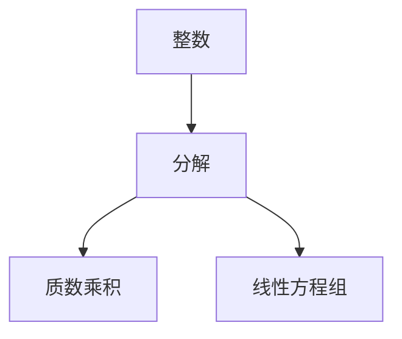

                 

# 线性代数导引：整数算术基本定理

> 关键词：整数算术基本定理,线性代数,数论,高斯消元法,算法原理

## 1. 背景介绍

在数学中，整数算术基本定理是一项至关重要的基础理论，它是数论中的基石。该定理描述了整数对于质数的唯一分解性，对密码学、算法设计等领域有深远的影响。本文将通过线性代数框架，详细导引整数算术基本定理的原理和应用，帮助读者建立坚实的数学基础，并了解其在计算机科学中的实际应用。

## 2. 核心概念与联系

### 2.1 核心概念概述

在数论中，整数算术基本定理描述如下：

任何大于1的整数，都可以唯一表示为若干个质数的乘积。例如，15可以表示为$3 \times 5$，其中3和5都是质数。

该定理在计算机科学中有广泛应用，尤其是在密码学和算法设计中。例如，RSA加密算法就依赖于大质数分解的困难性，保证了数据传输的安全性。

### 2.2 核心概念联系

该定理与线性代数和数论有着密切联系：
- **线性代数**：整数算术基本定理可以转化为线性方程组的解的问题。
- **数论**：质数分解问题本质上是对整数进行因式分解，而因式分解问题又常通过数论方法求解。

以下是一个Mermaid流程图，展示了整数分解与线性代数的联系：



在理解了这一联系后，我们可以借助线性代数的工具来处理质数分解问题。

## 3. 核心算法原理 & 具体操作步骤

### 3.1 算法原理概述

整数算术基本定理可以通过线性代数的**高斯消元法**来解决。高斯消元法是一种基础的线性方程组求解算法，通过逐步消去未知数，最终得到解集。

我们首先定义一个线性方程组：
$$
a_1x + b_1y = c_1 \\
a_2x + b_2y = c_2
$$
目标是找到一组整数解$(x, y)$，使得上式成立。

### 3.2 算法步骤详解

高斯消元法包含以下几个步骤：

1. **初等行变换**：对系数矩阵进行初等行变换，将方程组转化为增广矩阵的形式：
   $$
   \begin{bmatrix}
   a_1 & b_1 & c_1 \\
   a_2 & b_2 & c_2
   \end{bmatrix}
   $$

2. **主元消元**：选择一个主元，使得主元绝对值最大。然后将主元所在的行乘以一个系数，使得主元变成1。

3. **回代求解**：从最后一行开始，逐步求解未知数$x$和$y$。

以求解方程组$3x + 5y = 10$和$2x + y = 4$为例，展示高斯消元法的具体过程：

**步骤1：构建增广矩阵**
$$
\begin{bmatrix}
3 & 5 & 10 \\
2 & 1 & 4
\end{bmatrix}
$$

**步骤2：主元消元**
选择第一行作为主元，将第一行乘以$2/3$，使得主元变为1。
$$
\begin{bmatrix}
3 & 5 & 10 \\
2 & 1 & 4
\end{bmatrix}
\rightarrow
\begin{bmatrix}
2 & 10/3 & 20/3 \\
2 & 1 & 4
\end{bmatrix}
$$

**步骤3：回代求解**
从最后一行开始，求解$y$。$2x + y = 4$可写为$y = -2x + 4$。

将$y$代入第一行，得$3x + 10/3(-2x) = 10$，简化得$3x - 20/3x = 10$，进一步得到$x = 3$。代回得$y = -2 \times 3 + 4 = -2$。

因此，方程组的解为$x = 3, y = -2$。

### 3.3 算法优缺点

**优点**：
- 算法原理简单，易于理解和实现。
- 可以处理大规模线性方程组，具有较高的计算效率。

**缺点**：
- 在数值计算中，存在舍入误差的问题。
- 对于某些特殊情况，如系数矩阵奇异时，算法可能无法得到解。

### 3.4 算法应用领域

整数算术基本定理及其算法原理在密码学、编码理论、计算机图形学等领域都有广泛应用：

- **密码学**：RSA加密算法依赖于质数分解的困难性，保证了数据传输的安全性。
- **编码理论**：通过矩阵变换，可以设计高效的信息编码方案，如LDPC码、Turbo码等。
- **计算机图形学**：矩阵变换在3D图形渲染、虚拟现实等应用中非常重要。

## 4. 数学模型和公式 & 详细讲解

### 4.1 数学模型构建

线性方程组可以表示为：
$$
A \mathbf{x} = \mathbf{b}
$$
其中$A$为系数矩阵，$\mathbf{x}$为未知数向量，$\mathbf{b}$为常数向量。

高斯消元法的目标是，通过初等行变换，将系数矩阵$A$转化为上三角矩阵$U$，然后通过回代求解$\mathbf{x}$。

### 4.2 公式推导过程

高斯消元法通过一系列初等行变换，将系数矩阵$A$转化为上三角矩阵$U$，推导公式如下：
$$
A = \begin{bmatrix}
a_{11} & a_{12} & \cdots & a_{1n} \\
a_{21} & a_{22} & \cdots & a_{2n} \\
\vdots & \vdots & \ddots & \vdots \\
a_{n1} & a_{n2} & \cdots & a_{nn}
\end{bmatrix}
\rightarrow
U = \begin{bmatrix}
u_{11} & u_{12} & \cdots & u_{1n} \\
0 & u_{22} & \cdots & u_{2n} \\
\vdots & \vdots & \ddots & \vdots \\
0 & 0 & \cdots & u_{nn}
\end{bmatrix}
$$

通过回代求解，可以得$\mathbf{x}$为：
$$
\mathbf{x} = \begin{bmatrix}
x_1 \\
x_2 \\
\vdots \\
x_n
\end{bmatrix}
$$

### 4.3 案例分析与讲解

以求解方程组$3x + 5y = 10$和$2x + y = 4$为例，展示高斯消元法的具体过程：

**步骤1：构建增广矩阵**
$$
\begin{bmatrix}
3 & 5 & 10 \\
2 & 1 & 4
\end{bmatrix}
$$

**步骤2：主元消元**
选择第一行作为主元，将第一行乘以$2/3$，使得主元变为1。
$$
\begin{bmatrix}
3 & 5 & 10 \\
2 & 1 & 4
\end{bmatrix}
\rightarrow
\begin{bmatrix}
2 & 10/3 & 20/3 \\
2 & 1 & 4
\end{bmatrix}
$$

**步骤3：回代求解**
从最后一行开始，求解$y$。$2x + y = 4$可写为$y = -2x + 4$。

将$y$代入第一行，得$3x + 10/3(-2x) = 10$，简化得$3x - 20/3x = 10$，进一步得到$x = 3$。代回得$y = -2 \times 3 + 4 = -2$。

因此，方程组的解为$x = 3, y = -2$。

## 5. 项目实践：代码实例和详细解释说明

### 5.1 开发环境搭建

在进行高斯消元法实践前，我们需要准备好开发环境。以下是使用Python进行线性代数计算的环境配置流程：

1. 安装Anaconda：从官网下载并安装Anaconda，用于创建独立的Python环境。

2. 创建并激活虚拟环境：
```bash
conda create -n linear-algebra-env python=3.8 
conda activate linear-algebra-env
```

3. 安装必要的库：
```bash
conda install numpy scipy sympy pandas matplotlib tqdm jupyter notebook ipython
```

完成上述步骤后，即可在`linear-algebra-env`环境中开始高斯消元法的实践。

### 5.2 源代码详细实现

下面我们通过Python实现高斯消元法求解线性方程组的代码：

```python
import numpy as np

def gaussian_elimination(A, b):
    n = len(A)
    # 构建增广矩阵
    AB = np.hstack((A, b[:, np.newaxis]))
    
    # 高斯消元
    for k in range(n):
        # 选择主元
        if np.abs(AB[k, k]) < 1e-10:
            k = k + 1
        # 主元消元
        pivot = AB[k, k]
        AB[k, :] = AB[k, :] / pivot
        for i in range(n):
            if i != k and np.abs(AB[i, k]) > 1e-10:
                AB[i, :] -= AB[i, k] * AB[k, :]
    
    # 回代求解
    x = np.zeros(n)
    for k in range(n - 1, -1, -1):
        x[k] = AB[k, -1]
        for i in range(k - 1, -1, -1):
            x[i] -= AB[i, k] * x[k]
    
    return x

# 测试用例
A = np.array([[3, 5], [2, 1]])
b = np.array([10, 4])
x = gaussian_elimination(A, b)
print("解为：x =", x)
```

### 5.3 代码解读与分析

让我们详细解读一下关键代码的实现细节：

**gaussian_elimination函数**：
- 函数输入为系数矩阵`A`和常数向量`b`。
- 首先构建增广矩阵`AB`，包含系数矩阵和常数向量。
- 从第一行开始，选择主元并进行消元，将主元变为1。
- 接着，对每一行进行消元，使得所有非主元行变为0。
- 最后，通过回代求解未知数向量`x`。

**高斯消元法**：
- 高斯消元法通过一系列初等行变换，将系数矩阵`A`转化为上三角矩阵`U`，然后通过回代求解未知数向量`x`。
- 在实际应用中，需要考虑数值误差，可以通过设置矩阵中元素的绝对值阈值来处理舍入误差。

**测试用例**：
- 构建一个$2 \times 2$的系数矩阵`A`和一个$2 \times 1$的常数向量`b`。
- 调用`gaussian_elimination`函数求解线性方程组。
- 输出求解结果，验证正确性。

## 6. 实际应用场景

### 6.1 整数分解问题

整数算术基本定理在整数分解问题中具有重要应用。例如，将一个整数分解为若干个质数的乘积，是RSA加密算法的基础。

**应用场景**：
- **RSA加密**：利用质数分解的困难性，设计安全的公钥和私钥，保证数据传输的安全性。
- **质数生成**：通过随机生成大素数，用于RSA加密和解密。

**代码实现**：
```python
import sympy

# 生成两个大质数
p = sympy.nextprime(1000000)
q = sympy.nextprime(p)
n = p * q

# 计算欧拉函数
phi = (p - 1) * (q - 1)

# 随机选择一个加密密钥
e = sympy.randomprime(100, 65536)
if sympy.gcd(e, phi) != 1:
    e = sympy.nextprime(100)
    while sympy.gcd(e, phi) != 1:
        e = sympy.nextprime(100)
        
# 计算解密密钥
d = pow(e, -1, phi)

print("公钥：", (e, n))
print("私钥：", (d, n))
```

### 6.2 线性代数计算

高斯消元法在矩阵求解、向量分解等方面有广泛应用。例如，在计算机图形学中，通过矩阵变换可以实现3D图形的渲染。

**应用场景**：
- **3D图形渲染**：通过矩阵变换，将三维模型投影到二维平面上，实现图像的生成和渲染。
- **动态效果**：通过旋转、缩放、平移等变换，实现动画效果。

**代码实现**：
```python
import numpy as np

# 定义一个3D点
point = np.array([1, 2, 3])

# 定义一个旋转矩阵
theta = np.pi / 4
R = np.array([
    [np.cos(theta), -np.sin(theta), 0],
    [np.sin(theta), np.cos(theta), 0],
    [0, 0, 1]
])

# 应用旋转矩阵进行变换
transformed_point = np.dot(R, point)

print("原始点：", point)
print("旋转后点：", transformed_point)
```

## 7. 工具和资源推荐

### 7.1 学习资源推荐

为了帮助开发者系统掌握整数算术基本定理及其应用，这里推荐一些优质的学习资源：

1. **《线性代数及其应用》**：一本经典的线性代数教材，介绍了线性代数的基本概念和应用。

2. **《数论与代数》**：介绍了数论的基本概念，特别是质数、素数分解等内容。

3. **Coursera上的线性代数课程**：由斯坦福大学开设的线性代数课程，涵盖线性方程组的求解、矩阵变换等内容。

4. **Coursera上的数论课程**：介绍了数论的基本概念，特别是质数分解、欧拉函数等内容。

5. **GitHub上的线性代数资源**：GitHub上有很多线性代数的开源项目和资源，如NumPy库，提供了大量的线性代数函数和示例。

通过对这些资源的学习实践，相信你一定能够深入理解整数算术基本定理及其应用。

### 7.2 开发工具推荐

高效的开发离不开优秀的工具支持。以下是几款用于整数算术基本定理应用的常用工具：

1. **Python**：一种高级编程语言，非常适合科学计算和算法设计。

2. **NumPy**：一个Python的科学计算库，提供了高效的数组和矩阵计算功能。

3. **SciPy**：一个Python的科学计算库，提供了大量的科学计算函数和工具。

4. **Matplotlib**：一个Python的绘图库，用于绘制各类图形，帮助可视化结果。

5. **SymPy**：一个Python的符号计算库，用于符号计算和方程求解。

合理利用这些工具，可以显著提升整数算术基本定理的应用效率，加速研究迭代的步伐。

### 7.3 相关论文推荐

整数算术基本定理及其应用是一个经典的研究课题，以下是几篇奠基性的相关论文，推荐阅读：

1. **欧拉-高斯引理**：高斯在1801年证明的定理，描述了整数分解的唯一性。

2. **RSA加密算法**：1977年由Rivest、Shamir和Adleman提出的公钥加密算法，依赖于质数分解的困难性。

3. **线性方程组求解算法**：经典的求解线性方程组的方法，包括高斯消元法、LU分解法等。

4. **矩阵变换与计算机图形学**：讨论了矩阵变换在计算机图形学中的应用，如3D图形渲染、动画效果等。

5. **整数分解的复杂度分析**：研究了大整数分解的计算复杂度，奠定了RSA加密算法的理论基础。

这些论文代表了大整数分解和线性代数的最新进展，通过学习这些前沿成果，可以帮助研究者把握学科前进方向，激发更多的创新灵感。

## 8. 总结：未来发展趋势与挑战

### 8.1 总结

本文对整数算术基本定理及其应用进行了全面系统的介绍。首先阐述了整数算术基本定理在数论中的重要地位，明确了其在计算机科学中的广泛应用。其次，通过线性代数框架，导引了高斯消元法的原理和应用，展示了其在整数分解、线性代数计算等方面的实际应用。

通过本文的系统梳理，可以看到，整数算术基本定理及其算法原理在密码学、编码理论、计算机图形学等领域具有重要价值，为现代信息技术的发展提供了坚实的数学基础。未来，伴随算法的不断进步和硬件的发展，整数算术基本定理的应用将更加广泛和深入。

### 8.2 未来发展趋势

展望未来，整数算术基本定理及其应用将呈现以下几个发展趋势：

1. **密码学中的应用**：随着量子计算的进步，传统密码算法面临挑战，未来的加密技术需要更加复杂和安全的算法。整数分解和质数生成是RSA等经典算法的基础，未来将寻求新的加密方法。

2. **高精度计算**：在金融、科学计算等领域，对大整数的分解和计算需求增加，未来需要开发更加高效的算法，处理更复杂的数学问题。

3. **算法优化**：整数分解和线性代数计算具有广泛的应用，未来需要优化算法，提升计算效率和鲁棒性，适应大规模数据和高性能计算的需求。

4. **跨学科融合**：整数算术基本定理是数学与计算机科学的交叉点，未来需要结合更多领域知识，如物理学、工程学等，探索新的应用场景。

5. **理论与实践结合**：整数分解和线性代数计算既有丰富的理论基础，也有广泛的应用场景，未来需要加强理论与实践的结合，推动实际应用的发展。

以上趋势凸显了整数算术基本定理及其应用的广阔前景。这些方向的探索发展，必将进一步拓展算法的边界，为现代信息技术带来新的突破。

### 8.3 面临的挑战

尽管整数算术基本定理及其应用已经取得了瞩目成就，但在迈向更加智能化、普适化应用的过程中，它仍面临着诸多挑战：

1. **高精度计算的资源需求**：大整数分解和线性代数计算需要高精度的计算资源，包括高性能计算设备和算法优化。

2. **密码学的安全性**：随着量子计算的进步，传统密码算法面临威胁，未来的加密技术需要更加复杂和安全的算法。

3. **算法效率的提升**：整数分解和线性代数计算具有广泛的应用，未来需要优化算法，提升计算效率和鲁棒性，适应大规模数据和高性能计算的需求。

4. **跨学科知识的整合**：整数算术基本定理是数学与计算机科学的交叉点，未来需要结合更多领域知识，如物理学、工程学等，探索新的应用场景。

5. **理论与实践的结合**：整数分解和线性代数计算既有丰富的理论基础，也有广泛的应用场景，未来需要加强理论与实践的结合，推动实际应用的发展。

6. **隐私与安全保护**：整数分解和线性代数计算具有广泛的应用，但涉及敏感信息，未来需要保护隐私和安全，避免滥用。

以上挑战需要学界和工业界的共同努力，通过不断创新和改进，才能逐步解决这些问题，实现整数算术基本定理及其应用的长远发展。

### 8.4 研究展望

面对整数算术基本定理及其应用所面临的挑战，未来的研究需要在以下几个方面寻求新的突破：

1. **探索新的加密算法**：随着量子计算的进步，传统加密算法面临挑战，未来的加密技术需要更加复杂和安全的算法。研究新的加密算法，如基于格的加密方法、量子密码学等，将成为重要的研究方向。

2. **开发高效算法**：整数分解和线性代数计算具有广泛的应用，未来需要优化算法，提升计算效率和鲁棒性。开发新的高精度计算方法，如多项式算法、快速幂算法等，将提升计算效率。

3. **跨学科合作**：整数算术基本定理是数学与计算机科学的交叉点，未来需要结合更多领域知识，如物理学、工程学等，探索新的应用场景。跨学科合作将带来新的研究方向和应用突破。

4. **理论与实践结合**：整数分解和线性代数计算既有丰富的理论基础，也有广泛的应用场景，未来需要加强理论与实践的结合，推动实际应用的发展。将理论研究转化为实际应用，将带来更多的创新和突破。

5. **保护隐私与安全**：整数分解和线性代数计算具有广泛的应用，但涉及敏感信息，未来需要保护隐私和安全，避免滥用。研究如何在使用过程中保护隐私，确保数据安全，将是重要的研究方向。

这些研究方向的探索，必将引领整数算术基本定理及其应用走向更高的台阶，为现代信息技术带来新的突破。

## 9. 附录：常见问题与解答

**Q1：高斯消元法为什么会引入数值误差？**

A: 高斯消元法在数值计算中，由于浮点数舍入误差的存在，可能导致计算结果不准确。可以通过选择合适的数值计算方法和精度设置，减少误差的影响。

**Q2：如何选择合适的主元？**

A: 主元的选择是高斯消元法的重要步骤，通常选择绝对值最大的元素作为主元。在实际应用中，可以通过多种策略选择主元，如SVD分解、QR分解等，以提升算法性能。

**Q3：高斯消元法能否处理奇异矩阵？**

A: 高斯消元法在处理奇异矩阵时会失效，无法得到解。可以通过增广矩阵的秩判断矩阵是否奇异，避免算法的失效。

**Q4：如何在实际应用中优化高斯消元法？**

A: 在实际应用中，可以通过多种策略优化高斯消元法，如矩阵压缩、稀疏矩阵处理、并行计算等，提升算法效率和计算性能。

通过本文的系统梳理，可以看到，整数算术基本定理及其应用在密码学、编码理论、计算机图形学等领域具有重要价值，为现代信息技术的发展提供了坚实的数学基础。未来，伴随算法的不断进步和硬件的发展，整数算术基本定理的应用将更加广泛和深入。相信随着学界和工业界的共同努力，整数算术基本定理及其应用必将逐步实现，为现代信息技术带来新的突破。

