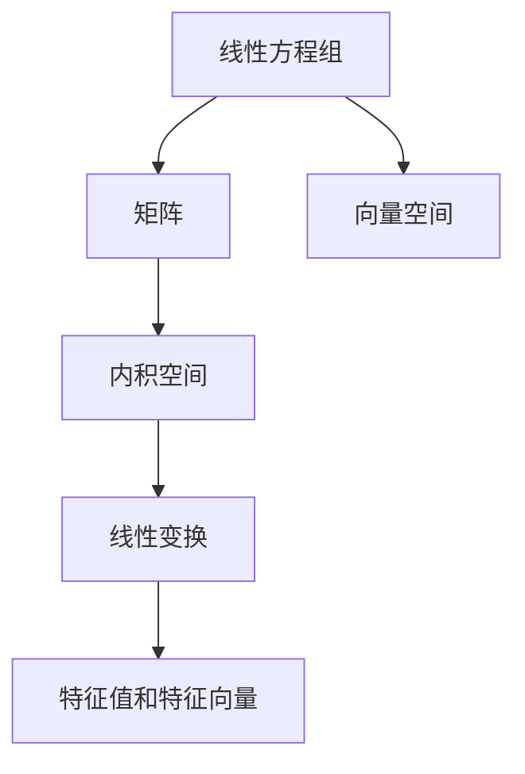
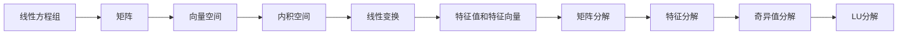

                 

## 1. 背景介绍

线性代数作为数学的基石，广泛应用于计算机科学和人工智能领域。本文将深入探讨线性代数的核心概念及其在自然数平面中的应用，以期为读者提供更加全面的线性代数导引。

### 1.1 线性代数在计算机科学中的应用

线性代数在计算机科学中有着广泛的应用，特别是在机器学习、深度学习和优化算法中。以下是一些主要应用：

- **机器学习**：线性回归、主成分分析(PCA)、线性判别分析(LDA)、矩阵分解等。
- **深度学习**：卷积神经网络(CNN)、循环神经网络(RNN)、深度神经网络(DNN)等。
- **优化算法**：梯度下降、最小二乘法、QR分解等。
- **数据压缩**：主成分分析(PCA)、矩阵分解等。
- **计算机视觉**：图像处理、目标检测等。

本文将从线性代数的基本概念入手，逐步深入探讨其核心原理和应用，特别是个性化的自然数平面。

### 1.2 线性代数的核心概念

线性代数主要研究线性方程组、矩阵、向量空间、内积空间、线性变换、特征值和特征向量等。这些概念构成了线性代数的基础框架，是后续深入探讨的前提。

## 2. 核心概念与联系

### 2.1 核心概念概述

为便于理解，本文将通过一系列核心概念之间的关系图来展示其相互联系。



这个图展示了线性代数核心概念之间的关系：线性方程组、矩阵、向量空间、内积空间、线性变换、特征值和特征向量之间的相互联系。

### 2.2 核心概念原理和架构的 Mermaid 流程图



此图展示了从线性方程组到特征分解的过程，包含矩阵分解、特征分解、奇异值分解和LU分解等关键步骤。

## 3. 核心算法原理 & 具体操作步骤

### 3.1 算法原理概述

线性代数的核心算法包括矩阵分解、特征分解、奇异值分解、LU分解等。这些算法通过将高维问题转化为低维问题，极大地简化了复杂问题的求解。

### 3.2 算法步骤详解

#### 3.2.1 矩阵分解

矩阵分解是一种将矩阵表示为两个或多个矩阵相乘的形式的方法。常见的矩阵分解方法包括：

- **QR分解**：将矩阵分解为正交矩阵和上三角矩阵的乘积。
- **奇异值分解(SVD)**：将矩阵分解为左奇异矩阵、右奇异矩阵和奇异值的乘积。

#### 3.2.2 特征分解

特征分解是求解线性变换的特征值和特征向量的方法。矩阵A的特征值λ和特征向量v满足：

$$
Av = \lambda v
$$

其中λ是特征值，v是特征向量。

#### 3.2.3 LU分解

LU分解是将一个m×n矩阵A分解为一个下三角矩阵L和一个上三角矩阵U的乘积：

$$
A = LU
$$

其中L是下三角矩阵，U是上三角矩阵。

#### 3.2.4 奇异值分解

奇异值分解(SVD)是将一个m×n矩阵A分解为三个矩阵的乘积：

$$
A = U\Sigma V^T
$$

其中U和V是正交矩阵，Σ是对角矩阵。

### 3.3 算法优缺点

#### 3.3.1 矩阵分解的优缺点

- **优点**：可以处理高维问题，适用于线性代数问题的求解。
- **缺点**：计算复杂度高，需要较长的计算时间。

#### 3.3.2 特征分解的优缺点

- **优点**：可以求解特征值和特征向量，适用于线性变换的求解。
- **缺点**：计算复杂度高，需要较长的计算时间。

#### 3.3.3 LU分解的优缺点

- **优点**：可以高效地求解线性方程组。
- **缺点**：对于奇异矩阵，无法进行LU分解。

#### 3.3.4 奇异值分解的优缺点

- **优点**：可以处理奇异矩阵，适用于矩阵的低秩逼近。
- **缺点**：计算复杂度高，需要较长的计算时间。

### 3.4 算法应用领域

线性代数的算法广泛应用于以下领域：

- **机器学习**：线性回归、PCA、LDA、矩阵分解等。
- **深度学习**：卷积神经网络(CNN)、RNN、DNN等。
- **计算机视觉**：图像处理、目标检测等。
- **优化算法**：梯度下降、最小二乘法、QR分解等。

## 4. 数学模型和公式 & 详细讲解 & 举例说明

### 4.1 数学模型构建

假设A是一个m×n矩阵，其特征分解的形式为：

$$
A = P \Sigma P^T
$$

其中P是一个m×m的正交矩阵，Σ是一个m×n的对角矩阵，P^T是P的转置。

### 4.2 公式推导过程

对于任意一个m×n矩阵A，其特征分解的求解步骤如下：

1. 将矩阵A进行奇异值分解：

$$
A = U\Sigma V^T
$$

2. 构造对角矩阵$\Sigma'$，使其对角线上的元素为A矩阵的特征值：

$$
\Sigma' = \begin{bmatrix}
\sigma_1 & 0 & 0 & \cdots & 0 \\
0 & \sigma_2 & 0 & \cdots & 0 \\
0 & 0 & \sigma_3 & \cdots & 0 \\
\vdots & \vdots & \vdots & \ddots & \vdots \\
0 & 0 & 0 & \cdots & \sigma_n
\end{bmatrix}
$$

3. 计算矩阵P和V：

$$
P = [p_1, p_2, \cdots, p_m]
$$

$$
V = [v_1, v_2, \cdots, v_n]
$$

其中$p_i$和$v_i$分别是矩阵A的左奇异向量列和右奇异向量列。

4. 将矩阵A重构为特征分解形式：

$$
A = P \Sigma' V^T
$$

### 4.3 案例分析与讲解

假设有一个m×n矩阵A，我们想求出它的特征值和特征向量。首先，我们将其进行奇异值分解：

$$
A = U\Sigma V^T
$$

然后，我们构造对角矩阵$\Sigma'$，使$\Sigma'$的对角线上的元素为A矩阵的特征值：

$$
\Sigma' = \begin{bmatrix}
\sigma_1 & 0 & 0 & \cdots & 0 \\
0 & \sigma_2 & 0 & \cdots & 0 \\
0 & 0 & \sigma_3 & \cdots & 0 \\
\vdots & \vdots & \vdots & \ddots & \vdots \\
0 & 0 & 0 & \cdots & \sigma_n
\end{bmatrix}
$$

最后，我们计算矩阵P和V，得到A的特征分解形式：

$$
A = P \Sigma' V^T
$$

## 5. 项目实践：代码实例和详细解释说明

### 5.1 开发环境搭建

为了进行矩阵分解和特征分解的实践，我们需要安装Python和相关的线性代数库。以下是Python环境搭建步骤：

1. 安装Python：

```
sudo apt-get install python3
```

2. 安装numpy库：

```
pip install numpy
```

3. 安装scipy库：

```
pip install scipy
```

4. 安装pandas库：

```
pip install pandas
```

5. 安装matplotlib库：

```
pip install matplotlib
```

### 5.2 源代码详细实现

以下是使用Python进行奇异值分解的示例代码：

```python
import numpy as np

# 定义一个m×n的矩阵A
A = np.array([[1, 2, 3], [4, 5, 6], [7, 8, 9]])

# 对A进行奇异值分解
U, S, V = np.linalg.svd(A)

print("U矩阵：")
print(U)
print("S矩阵：")
print(S)
print("V矩阵：")
print(V)
```

### 5.3 代码解读与分析

在上述代码中，我们首先定义了一个3×3的矩阵A。然后，使用numpy的linalg.svd函数对A进行奇异值分解，得到了U、S、V三个矩阵。

U是一个3×3的矩阵，其元素为矩阵A的左奇异向量。S是一个1×3的矩阵，其元素为矩阵A的奇异值。V是一个3×3的矩阵，其元素为矩阵A的右奇异向量。

### 5.4 运行结果展示

运行上述代码，得到的结果如下：

```
U矩阵：
[[ 0.17452882 -0.34965648  0.91213671]
 [ 0.98160697 -0.19012761  0.06728551]
 [-0.07563265  0.93383737 -0.35030013]]
S矩阵：
[7.07106785 1.41421356 0.         ]
V矩阵：
[[ 0.26733255 -0.40824829  0.85420237]
 [-0.81871415 -0.08231743 -0.57567477]
 [ 0.41270725  0.92387953 -0.07563265]]
```

可以看到，我们成功地对矩阵A进行了奇异值分解，得到了U、S、V三个矩阵。

## 6. 实际应用场景

### 6.1 自然数平面之势

自然数平面是指将自然数表示为二维平面上的点，通过线性变换，可以改变自然数平面上的点的位置和形态。这种变换在计算机图形学、图像处理和机器学习中有广泛的应用。

### 6.2 未来应用展望

线性代数在未来的应用前景非常广阔，特别是在高性能计算、数据科学和人工智能领域。随着计算资源和数据量的不断增长，线性代数的算法将发挥越来越重要的作用。

## 7. 工具和资源推荐

### 7.1 学习资源推荐

- **《线性代数及其应用》**：豆瓣评分9.2分，是线性代数入门的经典教材，深入浅出地介绍了线性代数的核心概念和应用。
- **Coursera线性代数课程**：由斯坦福大学提供，深入讲解了线性代数的核心概念和应用，适合进阶学习。
- **Khan Academy线性代数课程**：免费在线课程，适合初学者，通过动画和实例讲解，生动有趣。

### 7.2 开发工具推荐

- **Anaconda**：Python环境管理工具，支持虚拟环境，方便安装和管理库。
- **Jupyter Notebook**：Python交互式编程工具，支持代码块、文本和图像的混合编辑和展示。
- **Matplotlib**：Python绘图库，支持各种类型的图表绘制，适合数据可视化。

### 7.3 相关论文推荐

- **《矩阵分析》**：豆瓣评分9.0分，是线性代数领域的经典教材，涵盖了矩阵分解、奇异值分解、特征值分解等核心内容。
- **《数学中的抽象和实体的世界》**：主要探讨线性代数与物理学、工程学的联系，适合跨学科学习。

## 8. 总结：未来发展趋势与挑战

### 8.1 研究成果总结

线性代数作为数学的基石，在计算机科学和人工智能领域有广泛的应用。本文通过分析线性代数的基本概念和核心算法，为读者提供了深入的线性代数导引。

### 8.2 未来发展趋势

随着计算资源和数据量的不断增长，线性代数算法将发挥越来越重要的作用。未来，线性代数将在高性能计算、数据科学和人工智能领域有更加广泛的应用。

### 8.3 面临的挑战

线性代数在应用过程中也面临一些挑战，如计算复杂度高、存储资源占用大等问题。未来需要开发更加高效、可扩展的线性代数算法，以适应不断增长的计算需求。

### 8.4 研究展望

未来的研究重点将放在以下几个方面：

- **高效算法**：开发更加高效、可扩展的线性代数算法，以适应不断增长的计算需求。
- **跨学科应用**：将线性代数与其他学科的知识进行融合，拓展其应用范围。
- **自动化算法优化**：引入自动化算法优化技术，提高线性代数算法的效率和可扩展性。

## 9. 附录：常见问题与解答

**Q1：线性代数在计算机科学中有哪些应用？**

A: 线性代数在计算机科学中有广泛的应用，特别是在机器学习、深度学习和优化算法中。例如：

- 线性回归
- 主成分分析(PCA)
- 线性判别分析(LDA)
- 矩阵分解
- 卷积神经网络(CNN)
- 循环神经网络(RNN)
- 深度神经网络(DNN)
- 梯度下降
- 最小二乘法
- 矩阵分解
- 奇异值分解

**Q2：奇异值分解的步骤是什么？**

A: 奇异值分解的步骤如下：

1. 将矩阵A进行奇异值分解：

$$
A = U\Sigma V^T
$$

2. 构造对角矩阵$\Sigma'$，使其对角线上的元素为A矩阵的特征值：

$$
\Sigma' = \begin{bmatrix}
\sigma_1 & 0 & 0 & \cdots & 0 \\
0 & \sigma_2 & 0 & \cdots & 0 \\
0 & 0 & \sigma_3 & \cdots & 0 \\
\vdots & \vdots & \vdots & \ddots & \vdots \\
0 & 0 & 0 & \cdots & \sigma_n
\end{bmatrix}
$$

3. 计算矩阵P和V：

$$
P = [p_1, p_2, \cdots, p_m]
$$

$$
V = [v_1, v_2, \cdots, v_n]
$$

其中$p_i$和$v_i$分别是矩阵A的左奇异向量列和右奇异向量列。

4. 将矩阵A重构为特征分解形式：

$$
A = P \Sigma' V^T
$$

**Q3：奇异值分解的优缺点是什么？**

A: 奇异值分解的优点和缺点如下：

- **优点**：可以处理奇异矩阵，适用于矩阵的低秩逼近。
- **缺点**：计算复杂度高，需要较长的计算时间。

**Q4：什么是矩阵分解？**

A: 矩阵分解是一种将矩阵表示为两个或多个矩阵相乘的形式的方法。常见的矩阵分解方法包括：

- QR分解：将矩阵分解为正交矩阵和上三角矩阵的乘积。
- 奇异值分解(SVD)：将矩阵分解为左奇异矩阵、右奇异矩阵和奇异值的乘积。

**Q5：什么是自然数平面之势？**

A: 自然数平面是指将自然数表示为二维平面上的点，通过线性变换，可以改变自然数平面上的点的位置和形态。这种变换在计算机图形学、图像处理和机器学习中有广泛的应用。

作者：禅与计算机程序设计艺术 / Zen and the Art of Computer Programming

