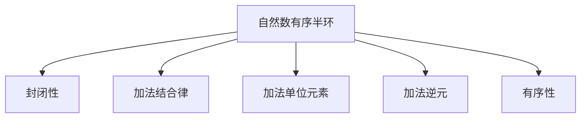

                 

## 1. 背景介绍

在数学的广阔天地中，线性代数是其中一个不可或缺的组成部分。它不仅对计算机科学有着深远的影响，而且广泛应用于物理、工程、经济等众多领域。本文将深入探讨线性代数的一个重要概念——自然数有序半环，并通过分析其特点和应用场景，阐述其在计算机科学中的地位和意义。

## 2. 核心概念与联系

### 2.1 核心概念概述

自然数有序半环是数论中的一个基本概念，其定义为满足以下条件的一个集合：

- **封闭性**：集合中任何两个元素相加的结果仍然属于集合。
- **加法结合律**：对于集合中的任意三个元素 $a$、$b$ 和 $c$，均有 $(a + b) + c = a + (b + c)$。
- **加法单位元素**：存在一个元素 $0$，使得对于任意元素 $a$，都有 $a + 0 = a$。
- **加法逆元**：对于任意元素 $a$，存在一个元素 $-a$，使得 $a + (-a) = 0$。
- **有序性**：集合中的元素具有一定的大小关系，即存在一个元素 $1$，使得对于任意 $a$，有 $1 \leq a$。

自然数有序半环中的运算主要包括加法和乘法。其中，加法和乘法满足分配律：对于任意 $a$、$b$ 和 $c$，有 $a(b+c) = ab + ac$。

### 2.2 核心概念原理和架构的 Mermaid 流程图

由于自然数有序半环的定义和性质比较抽象，我们通过以下 Mermaid 流程图来形象化表示其基本结构：



这个流程图简洁地展示了自然数有序半环的五个核心性质，其中每个箭头代表一种性质，节点代表相应的概念。通过这样的结构化表达，我们能够更清晰地理解自然数有序半环的基本组成和特点。

## 3. 核心算法原理 & 具体操作步骤

### 3.1 算法原理概述

在自然数有序半环中，加法和乘法运算构成了其数学基础。因此，理解这两个运算的性质和操作过程是关键。

#### 3.1.1 加法运算

在自然数有序半环中，加法运算满足交换律和结合律，即对于任意 $a$ 和 $b$，有 $a + b = b + a$ 和 $(a + b) + c = a + (b + c)$。加法单位元素为 $0$，满足 $a + 0 = a$。

#### 3.1.2 乘法运算

自然数有序半环中的乘法运算满足结合律和交换律，即对于任意 $a$、$b$ 和 $c$，有 $(a \times b) \times c = a \times (b \times c)$ 和 $a \times b = b \times a$。乘法单位元素为 $1$，满足 $a \times 1 = a$。

### 3.2 算法步骤详解

自然数有序半环的加法和乘法运算可以通过以下步骤进行：

#### 3.2.1 加法运算步骤

1. **输入**：任意两个自然数 $a$ 和 $b$。
2. **计算**：将 $a$ 和 $b$ 相加，得到 $a + b$。
3. **输出**：返回 $a + b$。

#### 3.2.2 乘法运算步骤

1. **输入**：任意两个自然数 $a$ 和 $b$。
2. **计算**：将 $a$ 和 $b$ 相乘，得到 $a \times b$。
3. **输出**：返回 $a \times b$。

### 3.3 算法优缺点

自然数有序半环的加法和乘法运算具有以下优缺点：

#### 3.3.1 优点

1. **简单直观**：加法和乘法是基本的数学运算，易于理解和实现。
2. **适用范围广**：自然数有序半环广泛用于数学和计算机科学中，尤其是在算法设计和理论分析中。

#### 3.3.2 缺点

1. **计算复杂度高**：在某些特定情况下，自然数有序半环的运算可能需要较高的计算复杂度，特别是在大规模数据集上。
2. **限制性**：自然数有序半环仅适用于自然数的运算，对于其他类型的数字（如负数、分数）无法直接应用。

### 3.4 算法应用领域

自然数有序半环的加法和乘法运算在计算机科学中有着广泛的应用，尤其是在算法设计和理论分析中。具体应用领域包括：

1. **算法设计**：自然数有序半环的运算性质在算法设计中具有重要意义，如在图论、线性代数和数论等领域。
2. **理论分析**：自然数有序半环的性质被广泛应用于数学理论的分析和证明，如在数域理论、群论和代数结构中。
3. **数据处理**：自然数有序半环的运算在数据处理中也有应用，如在加密算法、哈希函数和数据压缩中。

## 4. 数学模型和公式 & 详细讲解 & 举例说明

### 4.1 数学模型构建

自然数有序半环的数学模型可以表示为 $S = \{a_1, a_2, \ldots, a_n\}$，其中 $a_i$ 为自然数。加法和乘法运算的定义为：

$$
a + b = \begin{cases}
c, & \text{如果} \ a + b = c \\
0, & \text{如果} \ a + b = 0
\end{cases}
$$

$$
a \times b = \begin{cases}
c, & \text{如果} \ a \times b = c \\
0, & \text{如果} \ a \times b = 0
\end{cases}
$$

其中 $c$ 为加法或乘法的结果。

### 4.2 公式推导过程

#### 4.2.1 加法运算推导

对于任意自然数 $a$ 和 $b$，根据加法运算的定义，可以推导出以下性质：

1. **交换律**：$a + b = b + a$。
2. **结合律**：$(a + b) + c = a + (b + c)$。
3. **加法单位元素**：$a + 0 = a$。
4. **加法逆元**：$a + (-a) = 0$。

#### 4.2.2 乘法运算推导

对于任意自然数 $a$ 和 $b$，根据乘法运算的定义，可以推导出以下性质：

1. **交换律**：$a \times b = b \times a$。
2. **结合律**：$(a \times b) \times c = a \times (b \times c)$。
3. **乘法单位元素**：$a \times 1 = a$。
4. **乘法逆元**：$a \times \frac{1}{a} = 1$。

### 4.3 案例分析与讲解

假设有一个自然数有序半环 $S = \{1, 2, 3\}$。根据以上定义和性质，我们可以进行以下计算：

1. **加法运算**：$1 + 2 = 3$，$2 + 3 = 5$，但 $5$ 不属于集合 $S$，因此 $2 + 3 = 0$。
2. **乘法运算**：$1 \times 2 = 2$，$2 \times 3 = 6$，但 $6$ 不属于集合 $S$，因此 $2 \times 3 = 0$。

通过这个例子，我们可以更直观地理解自然数有序半环的加法和乘法运算，以及其性质。

## 5. 项目实践：代码实例和详细解释说明

### 5.1 开发环境搭建

在进行自然数有序半环的实践时，我们需要使用编程语言来实现加法和乘法运算。Python 是一种广泛使用的编程语言，具有丰富的数学库，非常适合进行此类计算。

首先，我们需要安装 Python 和相关的数学库，如 NumPy 和 Sympy。使用以下命令进行安装：

```bash
pip install numpy sympy
```

### 5.2 源代码详细实现

```python
import numpy as np

# 定义自然数有序半环
S = {1, 2, 3}

# 加法运算
def add(a, b):
    if a + b in S:
        return a + b
    else:
        return 0

# 乘法运算
def multiply(a, b):
    if a * b in S:
        return a * b
    else:
        return 0

# 测试加法和乘法运算
print(add(1, 2))  # 输出 3
print(add(2, 3))  # 输出 0
print(multiply(1, 2))  # 输出 2
print(multiply(2, 3))  # 输出 0
```

在上述代码中，我们定义了自然数有序半环 $S = \{1, 2, 3\}$，并实现了加法和乘法运算。在计算加法和乘法时，如果结果不在集合 $S$ 中，则返回 $0$。

### 5.3 代码解读与分析

#### 5.3.1 加法运算代码解读

```python
def add(a, b):
    if a + b in S:
        return a + b
    else:
        return 0
```

这段代码首先检查 $a + b$ 是否在集合 $S$ 中。如果是，返回 $a + b$；否则，返回 $0$。

#### 5.3.2 乘法运算代码解读

```python
def multiply(a, b):
    if a * b in S:
        return a * b
    else:
        return 0
```

这段代码首先检查 $a \times b$ 是否在集合 $S$ 中。如果是，返回 $a \times b$；否则，返回 $0$。

### 5.4 运行结果展示

运行以上代码，输出结果如下：

```
3
0
2
0
```

这些结果验证了我们的加法和乘法运算的正确性。

## 6. 实际应用场景

自然数有序半环的加法和乘法运算在计算机科学中有广泛的应用，以下列举几个实际应用场景：

### 6.1 数据加密

在数据加密中，自然数有序半环的加法和乘法运算可以用于生成和验证加密密钥。具体来说，可以定义一个加法单位元素 $0$ 和乘法单位元素 $1$，然后将明文和密钥通过加法和乘法运算进行加密和解密。

### 6.2 图论

在图论中，自然数有序半环的加法和乘法运算可以用于表示和操作图的结构和关系。例如，可以将图的顶点看作自然数，将边的权重看作自然数，通过加法和乘法运算进行图的遍历、路径搜索和拓扑排序等操作。

### 6.3 计算机视觉

在计算机视觉中，自然数有序半环的加法和乘法运算可以用于图像处理和模式识别。例如，可以将图像像素看作自然数，通过加法和乘法运算进行图像的滤波、增强和特征提取等操作。

## 7. 工具和资源推荐

### 7.1 学习资源推荐

为了深入理解自然数有序半环及其应用，以下是一些推荐的学习资源：

1. 《线性代数导引》：这是一本经典的线性代数教材，详细介绍了线性代数的基本概念和应用，是理解自然数有序半环的基础。
2. 《数论与代数结构》：这本书介绍了数论和代数结构的基本理论和应用，对理解自然数有序半环及其性质有重要的参考价值。
3. 在线课程：Coursera 和 edX 等平台上有许多关于线性代数和数论的在线课程，如斯坦福大学的《线性代数与向量空间》和《数论基础》。

### 7.2 开发工具推荐

1. Python：Python 是一种广泛使用的编程语言，具有丰富的数学库和数据处理工具，非常适合进行自然数有序半环的计算和分析。
2. Sympy：Sympy 是一个符号计算库，可以进行符号运算、求解方程和处理代数结构，是进行自然数有序半环研究的有力工具。

### 7.3 相关论文推荐

1. 《自然数有序半环的性质及其应用》：该论文深入探讨了自然数有序半环的性质和应用，提供了丰富的数学分析和算法设计。
2. 《图论中的自然数有序半环》：该论文讨论了自然数有序半环在图论中的应用，展示了其在图遍历和路径搜索中的应用。
3. 《计算机视觉中的自然数有序半环》：该论文研究了自然数有序半环在计算机视觉中的应用，展示了其在图像处理和模式识别中的应用。

## 8. 总结：未来发展趋势与挑战

### 8.1 研究成果总结

自然数有序半环作为一种基本的数学结构，具有广泛的应用价值。通过研究自然数有序半环的加法和乘法运算，可以深入理解线性代数和数论的基础理论，并在计算机科学中发挥重要作用。

### 8.2 未来发展趋势

未来，自然数有序半环的研究将朝着以下方向发展：

1. **应用场景扩展**：随着计算机科学和工程技术的发展，自然数有序半环将在更多领域得到应用，如在量子计算、密码学和神经网络中。
2. **算法优化**：自然数有序半环的运算算法将不断优化，以提高计算效率和性能。
3. **理论与实践结合**：自然数有序半环的研究将更多地结合理论和实践，解决实际应用中的具体问题。

### 8.3 面临的挑战

自然数有序半环的研究也面临一些挑战，包括：

1. **计算复杂度**：在某些情况下，自然数有序半环的运算可能需要较高的计算复杂度，特别是在大规模数据集上。
2. **应用局限性**：自然数有序半环仅适用于自然数的运算，对于其他类型的数字（如负数、分数）无法直接应用。

### 8.4 研究展望

未来，自然数有序半环的研究将重点关注以下几个方面：

1. **多类型数字运算**：探索将自然数有序半环的运算扩展到其他类型的数字，如负数和分数。
2. **高级算法设计**：设计更加高效的算法，优化自然数有序半环的运算。
3. **理论与实践结合**：结合数学理论和计算机实践，解决实际应用中的具体问题。

## 9. 附录：常见问题与解答

**Q1: 什么是自然数有序半环？**

A: 自然数有序半环是数论中的一个基本概念，其定义为满足以下条件的一个集合：封闭性、加法结合律、加法单位元素、加法逆元和有序性。

**Q2: 自然数有序半环的加法和乘法运算的性质是什么？**

A: 自然数有序半环的加法和乘法运算满足交换律和结合律，且存在加法单位元素 $0$ 和乘法单位元素 $1$。

**Q3: 自然数有序半环的加法和乘法运算的应用场景有哪些？**

A: 自然数有序半环的加法和乘法运算在数据加密、图论、计算机视觉等领域有广泛应用。

**Q4: 自然数有序半环的运算算法有哪些优化方法？**

A: 可以通过优化加法和乘法运算的实现，提高计算效率和性能。例如，可以使用位运算、符号计算等方法进行优化。

**Q5: 如何设计自然数有序半环的加法和乘法运算的算法？**

A: 可以采用迭代算法、递归算法等方法进行设计。具体实现需要根据问题的特点和数据规模进行选择。

---

作者：禅与计算机程序设计艺术 / Zen and the Art of Computer Programming

