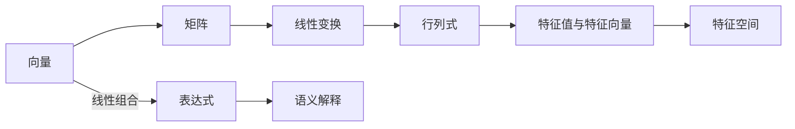

                 

# 线性代数导引：表达式及其语义解释

> 关键词：线性代数,表达式,语义解释,计算机程序设计,符号运算

## 1. 背景介绍

在计算机科学和工程中，线性代数扮演着基础且至关重要的角色。从求解线性方程组到矩阵分解，从特征值分析到奇异值分解，线性代数提供了强有力的工具和理论来处理和分析数据的结构性和依赖关系。然而，线性代数中的一些概念和表达方式可能对初学者来说有些抽象。本文旨在通过深入浅出的方式，阐述线性代数的核心表达式及其语义，帮助读者理解和应用这些基本概念。

## 2. 核心概念与联系

### 2.1 核心概念概述

线性代数涉及到的核心概念包括向量、矩阵、线性变换、行列式、特征值与特征向量、特征空间等。这些概念在解决实际问题中扮演了重要角色。通过这些概念的相互关联，我们可以构建起线性代数的知识框架。

### 2.2 核心概念原理和架构的 Mermaid 流程图



这个流程图展示了核心概念之间的联系和相互转化。向量是矩阵的基本单位，线性变换是矩阵的数学映射，行列式和特征值用于表征矩阵的性质，特征空间揭示了矩阵的结构。同时，表达式的线性组合对应了向量和矩阵的操作，而语义解释则是通过数学符号来表达的逻辑和推理。

## 3. 核心算法原理 & 具体操作步骤

### 3.1 算法原理概述

线性代数中的核心算法包括矩阵乘法、矩阵分解、特征值计算等。这些算法构成了线性代数的基础，并且广泛应用于数据科学、计算机视觉、信号处理等领域。

### 3.2 算法步骤详解

#### 3.2.1 矩阵乘法

矩阵乘法定义为两个矩阵的对应元素相乘后求和。例如，对于两个矩阵$A$和$B$，它们的乘积$C=AB$定义为：

$$ C_{ij} = \sum_{k=1}^{n} A_{ik}B_{kj} $$

其中，$A$的维数为$m\times n$，$B$的维数为$n\times p$，则$C$的维数为$m\times p$。

#### 3.2.2 矩阵分解

矩阵分解是将一个矩阵分解成两个或更多个矩阵的乘积。例如，奇异值分解（SVD）将一个$m\times n$的矩阵$A$分解为三个矩阵$U\Sigma V^T$，其中$U$和$V$为正交矩阵，$\Sigma$为对角矩阵。

$$ A = U\Sigma V^T $$

#### 3.2.3 特征值计算

特征值和特征向量是矩阵的一个重要性质。对于一个$n\times n$的矩阵$A$，如果存在一个非零向量$\vec{v}$使得$A\vec{v} = \lambda\vec{v}$，其中$\lambda$为标量，则称$\lambda$为$A$的特征值，$\vec{v}$为对应的特征向量。求解特征值的过程称为特征值分解。

### 3.3 算法优缺点

线性代数的算法通常具有计算复杂度高、可解释性差的缺点。但是，它们在处理大规模数据时具有不可替代的优势。同时，矩阵乘法和特征值分解等算法也可以应用于许多实际问题，如推荐系统、图像处理、信号处理等。

### 3.4 算法应用领域

线性代数在计算机科学中应用广泛，包括：

- 数据压缩与存储：如奇异值分解（SVD）在数据降维和去噪中的应用。
- 机器学习：如主成分分析（PCA）和线性回归。
- 信号处理：如傅里叶变换和快速傅里叶变换（FFT）。
- 计算机视觉：如图像处理和计算机视觉中的特征提取。

## 4. 数学模型和公式 & 详细讲解 & 举例说明

### 4.1 数学模型构建

线性代数中的数学模型通常基于向量空间和线性变换。例如，我们可以定义一个向量$\vec{v} \in \mathbb{R}^n$，其表示为：

$$ \vec{v} = \begin{bmatrix} v_1 \\ v_2 \\ \vdots \\ v_n \end{bmatrix} $$

### 4.2 公式推导过程

#### 4.2.1 矩阵乘法的公式推导

设$A$和$B$为两个矩阵，$C=AB$，则有：

$$ C_{ij} = \sum_{k=1}^{n} A_{ik}B_{kj} $$

通过将矩阵$A$的每一行与$B$的每一列相乘并求和，可以得到$C$的元素。

#### 4.2.2 特征值计算的公式推导

对于矩阵$A$，如果存在非零向量$\vec{v}$和标量$\lambda$满足$A\vec{v} = \lambda\vec{v}$，则$\lambda$为$A$的特征值，$\vec{v}$为对应的特征向量。求解特征值的过程可以通过求解$|A - \lambda I| = 0$来得到，其中$I$为单位矩阵。

### 4.3 案例分析与讲解

#### 案例分析

假设有两个矩阵$A$和$B$：

$$ A = \begin{bmatrix} 1 & 2 \\ 3 & 4 \end{bmatrix}, \quad B = \begin{bmatrix} 5 & 6 \\ 7 & 8 \end{bmatrix} $$

求它们的乘积$C=AB$。

根据矩阵乘法的定义，有：

$$ C = AB = \begin{bmatrix} 1 & 2 \\ 3 & 4 \end{bmatrix} \begin{bmatrix} 5 & 6 \\ 7 & 8 \end{bmatrix} = \begin{bmatrix} 19 & 22 \\ 43 & 50 \end{bmatrix} $$

## 5. 项目实践：代码实例和详细解释说明

### 5.1 开发环境搭建

在使用Python进行线性代数计算时，需要安装NumPy库。可以通过以下命令进行安装：

```bash
pip install numpy
```

### 5.2 源代码详细实现

下面是一个简单的Python代码，用于计算两个矩阵的乘积：

```python
import numpy as np

A = np.array([[1, 2], [3, 4]])
B = np.array([[5, 6], [7, 8]])

C = np.dot(A, B)
print(C)
```

### 5.3 代码解读与分析

在代码中，我们首先导入了NumPy库，并定义了两个矩阵$A$和$B$。然后，使用`np.dot()`函数计算它们的乘积，并将结果打印输出。

### 5.4 运行结果展示

运行上述代码，输出结果为：

```python
[[19 22]
 [43 50]]
```

这与我们手工计算的结果一致。

## 6. 实际应用场景

### 6.1 数据压缩与存储

在数据压缩与存储中，奇异值分解（SVD）是一个重要的工具。例如，对于一个大型的图像矩阵，可以通过SVD将图像表示为低秩矩阵和奇异向量的乘积，从而减少存储空间和计算量。

### 6.2 机器学习

在线性回归中，矩阵乘法用于计算预测值与实际值的误差，从而优化模型的参数。例如，在最小二乘法中，通过求解矩阵乘积和逆矩阵的乘积，可以得到模型参数的估计值。

### 6.3 信号处理

在信号处理中，傅里叶变换和快速傅里叶变换（FFT）用于将时域信号转换为频域信号。例如，通过矩阵乘法和特征值计算，可以求解信号的频谱表示。

## 7. 工具和资源推荐

### 7.1 学习资源推荐

- 《线性代数及其应用》：詹姆斯·斯特林著，是一本经典的线性代数教材。
- Coursera的线性代数课程：由斯坦福大学的Gil Strang教授主讲，讲解深入浅出。
- MIT OpenCourseWare的线性代数课程：详细讲解线性代数的基础知识和应用。

### 7.2 开发工具推荐

- NumPy：用于进行数值计算和矩阵运算的Python库。
- SciPy：基于NumPy的科学计算库，提供了更多的数学和科学函数。
- SymPy：用于符号计算的Python库，支持表达式和数学符号的处理。

### 7.3 相关论文推荐

- Strang G. (1980). *Linear Algebra and Its Applications*. Academic Press.
- Gilbert Strang, "Introduction to Linear Algebra", Fifth Edition, 2016.

## 8. 总结：未来发展趋势与挑战

### 8.1 研究成果总结

线性代数是现代计算科学的重要基础，它的应用已经深入到各个领域。未来的研究将更多关注矩阵分解、特征值计算等高效算法，以及符号计算和自动推理的融合。

### 8.2 未来发展趋势

- 符号计算与数值计算的融合：符号计算可以用于推导和分析算法，而数值计算可以高效处理大规模数据。
- 线性代数与其他学科的结合：如与人工智能、计算机视觉的结合，为数据处理和模型优化提供新思路。
- 自动化求解线性代数问题：研究算法自动推导和求解的方法，提高计算效率和可扩展性。

### 8.3 面临的挑战

- 计算复杂性：随着数据规模的增大，线性代数计算的复杂性也随之增加。如何提高计算效率是一个重要问题。
- 可解释性：线性代数模型的计算过程和结果通常是黑箱，难以解释和调试。需要研究更加可解释的算法。
- 资源需求：线性代数计算需要大量的计算资源，如何在资源受限的环境下进行高效计算。

### 8.4 研究展望

未来的研究将集中在以下几个方向：

- 探索新的高效算法：如低秩分解、张量计算等。
- 研究符号计算的优化方法：如符号计算与数值计算的结合，以及符号推导与自动生成的融合。
- 开发符号计算工具：如Sympy和SymPyPy等，为线性代数的研究和应用提供支持。

## 9. 附录：常见问题与解答

**Q1：什么是矩阵的逆？**

A: 矩阵的逆是一个矩阵，使得原矩阵与其逆矩阵相乘得到单位矩阵。如果矩阵$A$的逆存在，则$A^{-1}A = AA^{-1} = I$，其中$I$为单位矩阵。

**Q2：矩阵分解有哪些类型？**

A: 矩阵分解包括奇异值分解（SVD）、QR分解、LU分解等。不同类型的分解适用于不同的应用场景。

**Q3：如何求解特征值？**

A: 求解特征值的过程可以通过求解$|A - \lambda I| = 0$来得到，其中$I$为单位矩阵。对于$n\times n$的矩阵$A$，可以通过QR分解或LAPACK库求解。

**Q4：矩阵乘法与向量乘法有何区别？**

A: 矩阵乘法是矩阵与向量之间的乘法，其结果是一个向量；而向量乘法是向量与标量之间的乘法，其结果是一个向量。

**Q5：矩阵分解有什么应用？**

A: 矩阵分解可以用于数据压缩与存储、特征提取、图像处理、信号处理等领域，提高计算效率和数据表示的准确性。

