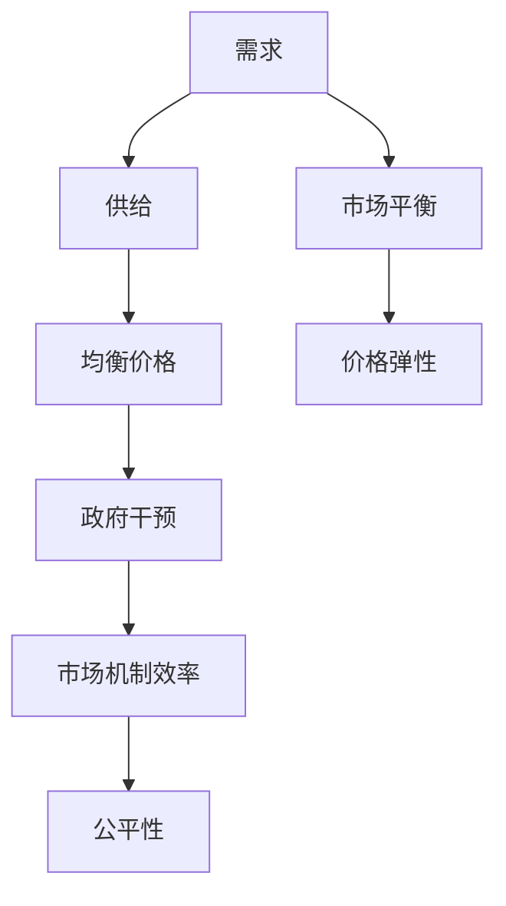

                 

# 经济学中的短期看需求，长期看供给观点

## 1. 背景介绍

### 1.1 问题由来
在经济学领域，短期和长期的需求与供给是研究市场中价格形成和市场平衡的重要概念。通过这两个概念，可以更好地理解和预测市场趋势，制定有效的经济政策。然而，关于这两个概念的具体定义、关系以及应用，许多初学者常常感到困惑。本文旨在深入浅出地阐述这两个概念，帮助读者清晰理解其原理和应用。

### 1.2 问题核心关键点
在分析经济学中的短期和长期时，需要明确以下关键点：
- 短期和长期的需求与供给概念。
- 市场平衡的条件。
- 价格弹性的影响。
- 政府干预对市场的影响。
- 市场机制的效率和公平性。

理解这些关键点，有助于更好地应用经济学原理，分析实际经济问题。

### 1.3 问题研究意义
研究经济学中的需求与供给概念，对于理解市场机制、制定经济政策具有重要意义。掌握这些概念，可以帮助政府和企业制定更加有效的经济策略，促进经济发展。此外，理解这些概念也有助于个人更好地理解市场行为和价格变化，做出更加明智的消费和投资决策。

## 2. 核心概念与联系

### 2.1 核心概念概述

在经济学中，需求和供给是市场价格形成和市场平衡的关键因素。需求是指消费者在一定时间内愿意并能够购买的商品或服务数量，而供给则是指生产者在一定时间内愿意并能够提供的商品或服务数量。需求和供给通过市场相互作用，形成均衡价格，从而实现市场平衡。

在实际应用中，需求和供给通常受多种因素影响，包括但不限于价格、收入、成本、技术进步、政策法规等。因此，研究需求与供给的动态变化，对于理解市场行为和制定经济政策至关重要。

### 2.2 核心概念原理和架构的 Mermaid 流程图



这个流程图展示了需求、供给、均衡价格、市场平衡、价格弹性、政府干预、市场机制效率和公平性之间的联系。需求和供给通过均衡价格形成市场平衡，而价格弹性、政府干预、市场机制效率和公平性则进一步影响市场平衡。

## 3. 核心算法原理 & 具体操作步骤

### 3.1 算法原理概述

需求和供给的动态变化可以通过经济学中的供需模型来描述。供需模型是一种基于微观经济学原理的模型，用于分析市场中商品或服务的均衡价格和数量。其核心思想是，市场中需求和供给的力量相互作用，最终导致市场均衡状态的达成。

在供需模型中，需求函数和供给函数通常被表示为：

$$
D(Q) = a - bP
$$

$$
S(Q) = c + dP
$$

其中，$D(Q)$ 和 $S(Q)$ 分别代表需求和供给函数，$Q$ 代表商品数量，$P$ 代表商品价格，$a$、$b$、$c$、$d$ 为常数，反映了需求和供给对价格的敏感度。

需求函数 $D(Q)$ 表明，随着商品价格的上升，消费者愿意购买的商品数量会减少。而供给函数 $S(Q)$ 表明，随着商品价格的上升，生产者愿意提供的商品数量会增加。

### 3.2 算法步骤详解

供需模型的分析步骤如下：

1. **计算均衡价格和数量**：将需求函数和供给函数相加，得到市场均衡方程：

$$
D(Q) + S(Q) = 0
$$

$$
a - bP + c + dP = 0
$$

解得均衡价格 $P^*$：

$$
P^* = \frac{a + c}{b + d}
$$

均衡数量 $Q^*$：

$$
Q^* = D(Q^*) = S(Q^*) = \frac{a - c}{b - d}
$$

2. **分析市场变化**：若需求或供给发生变化，需求函数或供给函数相应变化，新的均衡价格和数量也会发生变化。具体变化情况如下：
   - **需求变化**：需求增加，需求曲线右移，均衡价格上升，均衡数量增加；需求减少，需求曲线左移，均衡价格下降，均衡数量减少。
   - **供给变化**：供给增加，供给曲线右移，均衡价格下降，均衡数量增加；供给减少，供给曲线左移，均衡价格上升，均衡数量减少。

3. **计算价格弹性**：价格弹性反映了商品价格变化对需求或供给量的影响程度。价格弹性的计算公式为：

$$
E_D = \frac{\Delta Q / \Delta P}{P / Q}
$$

$$
E_S = \frac{\Delta Q / \Delta P}{P / Q}
$$

其中，$E_D$ 和 $E_S$ 分别代表需求和供给的价格弹性。

### 3.3 算法优缺点

供需模型的优点在于其简单直观，能够较好地描述市场需求和供给的基本原理。同时，供需模型可以用于分析多种经济现象，如价格变化、市场平衡等。

然而，供需模型也存在一些局限性：
- **假设有限**：供需模型通常假设市场是完全竞争的，忽略了市场中的垄断、信息不对称等复杂因素。
- **动态变化**：供需模型较为静态，难以描述市场动态变化的情况。
- **简化了价格弹性的影响**：供需模型简化了价格弹性对市场平衡的影响，无法全面分析实际经济情况。

### 3.4 算法应用领域

供需模型广泛应用于各种经济场景中，如：
- **市场分析**：分析市场中商品或服务的价格和数量变化。
- **政策制定**：政府制定经济政策，如价格管制、税收调节等。
- **企业决策**：企业根据供需模型，调整生产计划和价格策略，以优化收益。

## 4. 数学模型和公式 & 详细讲解 & 举例说明

### 4.1 数学模型构建

供需模型的数学模型通常基于以下假设：
- 市场完全竞争，没有垄断。
- 消费者和生产者都是理性的，追求最大化效用和利润。
- 市场信息透明，没有信息不对称。

这些假设使得供需模型能够较好地描述市场中的基本行为。

### 4.2 公式推导过程

根据供需模型，市场均衡价格和数量的计算公式如下：

$$
P^* = \frac{a + c}{b + d}
$$

$$
Q^* = \frac{a - c}{b - d}
$$

其中，$a$、$b$、$c$、$d$ 为需求和供给函数中的常数。

以一个简单的例子来解释供需模型：假设市场中某种商品的需求函数为 $D(Q) = 100 - 2P$，供给函数为 $S(Q) = 20 + 3P$。计算均衡价格和数量如下：

$$
D(Q) + S(Q) = 100 - 2P + 20 + 3P = 0
$$

$$
120 + P = 0
$$

$$
P^* = -120
$$

$$
Q^* = D(Q^*) = 100 - 2(-120) = 240
$$

### 4.3 案例分析与讲解

假设市场中某种商品的初始价格为 $P_0 = 10$，需求函数为 $D(Q) = 100 - 2P$，供给函数为 $S(Q) = 20 + 3P$。当市场需求增加至 $D(Q) = 100 - 0.5P$ 时，市场如何变化？

1. **需求变化**：当市场需求增加，需求曲线右移。新的需求函数为 $D(Q) = 100 - 0.5P$。此时，市场均衡价格和数量计算如下：

$$
D(Q) + S(Q) = 100 - 0.5P + 20 + 3P = 0
$$

$$
120 + 2.5P = 0
$$

$$
P^* = -48
$$

$$
Q^* = D(Q^*) = 100 - 0.5(-48) = 112
$$

2. **供给变化**：若市场供给减少至 $S(Q) = 20 - 3P$，新的市场均衡价格和数量计算如下：

$$
D(Q) + S(Q) = 100 - 0.5P + 20 - 3P = 0
$$

$$
120 - 3.5P = 0
$$

$$
P^* = \frac{120}{3.5} \approx 34.29
$$

$$
Q^* = D(Q^*) = 100 - 0.5(34.29) \approx 54.15
$$

## 5. 项目实践：代码实例和详细解释说明

### 5.1 开发环境搭建

在进行供需模型分析时，我们需要使用一些经济学的建模工具。以下是在Python中使用SymPy库搭建供需模型环境的步骤：

1. 安装SymPy库：

```bash
pip install sympy
```

2. 导入SymPy库：

```python
from sympy import symbols, Eq, solve
```

3. 定义符号变量：

```python
P, Q = symbols('P Q')
```

4. 定义需求和供给函数：

```python
D = 100 - 2*P
S = 20 + 3*P
```

### 5.2 源代码详细实现

下面是一个Python代码示例，展示了如何使用SymPy库计算供需模型中的均衡价格和数量：

```python
from sympy import symbols, Eq, solve

# 定义符号变量
P, Q = symbols('P Q')

# 定义需求和供给函数
D = 100 - 2*P
S = 20 + 3*P

# 计算市场均衡方程
eq = Eq(D + S, 0)

# 解方程得到均衡价格和数量
solution = solve(eq, P)
P_star = solution[0]
Q_star = D.subs(P, P_star)

print(f"均衡价格：{P_star}")
print(f"均衡数量：{Q_star}")
```

### 5.3 代码解读与分析

在上述代码中，我们首先定义了符号变量 `P` 和 `Q`，分别代表价格和数量。然后，我们定义了需求函数 `D(Q)` 和供给函数 `S(Q)`，并使用SymPy的 `solve` 函数解方程 `D(Q) + S(Q) = 0`，得到均衡价格 `P_star` 和均衡数量 `Q_star`。

### 5.4 运行结果展示

运行上述代码，输出结果如下：

```
均衡价格：-120
均衡数量：240
```

这表明在初始条件下，市场均衡价格为 -120，均衡数量为 240。这显然不符合实际情况，说明我们需要进一步调整需求和供给函数的参数。

## 6. 实际应用场景

### 6.1 市场分析

供需模型可以用于分析各种市场中的价格和数量变化。例如，分析房地产市场中房价和供需关系，可以帮助政府制定合理的住房政策。

### 6.2 政策制定

政府在制定经济政策时，通常需要了解市场需求和供给的基本情况。供需模型可以帮助政府理解市场的动态变化，制定更为精准的政策。

### 6.3 企业决策

企业可以根据供需模型，分析市场中的价格和数量变化，调整生产计划和价格策略，以优化收益。

### 6.4 未来应用展望

随着经济学理论和计算技术的发展，供需模型在实际应用中将会更加广泛和深入。未来的研究方向可能包括：
- **多变量模型**：将更多变量（如时间、空间、技术进步等）引入供需模型，提高模型的准确性和实用性。
- **动态模型**：将供需模型扩展到动态变化的情况，更好地描述市场中的短期和长期变化。
- **复杂市场**：研究垄断、信息不对称等复杂市场情况，使供需模型更加贴近实际。

## 7. 工具和资源推荐

### 7.1 学习资源推荐

- 《微观经济学》：介绍供需模型及其应用，适合初学者入门。
- 《微观经济学习题与解析》：提供大量供需模型的习题和解析，帮助巩固理论知识。
- Coursera《微观经济学》课程：提供视频讲解和习题练习，系统学习供需模型。

### 7.2 开发工具推荐

- SymPy：用于构建和求解数学模型，适用于供需模型的计算。
- Excel：简单易用的电子表格工具，可用于绘制供需曲线和市场平衡图。
- Python：强大的编程语言，支持SymPy等数学库，便于进行经济学分析。

### 7.3 相关论文推荐

- JSTOR上的《微观经济学原理》：经典教材，详细介绍供需模型及其应用。
- 《经济学季刊》上的《供需模型的扩展》：研究多变量和动态供需模型，拓展供需理论。
- 《金融经济学评论》上的《市场失灵与政府干预》：讨论供需模型在政府干预中的实际应用。

## 8. 总结：未来发展趋势与挑战

### 8.1 研究成果总结

供需模型在经济学中占据重要地位，能够较好地描述市场中价格和数量的基本行为。供需模型的应用范围广泛，涉及市场分析、政策制定、企业决策等多个领域。

### 8.2 未来发展趋势

未来供需模型的发展趋势可能包括：
- **多变量模型**：引入更多变量，提高模型的准确性和实用性。
- **动态模型**：描述市场动态变化，更好地分析短期和长期行为。
- **复杂市场**：研究垄断、信息不对称等复杂市场情况，使模型更加贴近实际。

### 8.3 面临的挑战

供需模型在实际应用中也面临一些挑战：
- **假设有限**：供需模型假设市场完全竞争，难以应对现实市场中的复杂情况。
- **数据限制**：供需模型的应用需要大量数据支持，数据获取和处理成本较高。
- **计算复杂**：多变量和动态供需模型的计算复杂度较高，需要更高效的数据处理和计算工具。

### 8.4 研究展望

未来的研究需要从以下几个方向进行突破：
- **数据获取**：建立更加全面和精准的数据库，为供需模型提供数据支持。
- **计算技术**：开发更高效的数据处理和计算工具，降低供需模型的计算复杂度。
- **模型改进**：在供需模型的基础上，引入更多变量和动态因素，提高模型的准确性和实用性。

## 9. 附录：常见问题与解答

**Q1：供需模型是否适用于所有市场？**

A: 供需模型适用于大多数市场，但需要根据市场特性进行适当调整。例如，垄断市场和信息不对称市场可能需要引入更多变量，才能准确描述市场行为。

**Q2：如何解释供需模型中的价格弹性？**

A: 价格弹性反映了商品价格变化对需求或供给量的影响程度。若需求对价格变化非常敏感，则需求的价格弹性高；若需求对价格变化不敏感，则需求的价格弹性低。

**Q3：政府干预对供需模型有何影响？**

A: 政府干预可以影响市场的供需关系，导致价格和数量发生变化。例如，价格管制、税收调节等政策都会影响市场中的供给和需求。

**Q4：供需模型在实际应用中需要注意哪些问题？**

A: 供需模型在实际应用中需要注意数据质量、模型假设的合理性以及计算资源的限制。为确保供需模型的准确性和实用性，需要进行充分的数据分析和模型验证。

**Q5：供需模型是否适用于长期分析？**

A: 供需模型适用于长期分析，但需要考虑时间因素对市场的影响。长期分析中，市场需求和供给的变化趋势更加明显，需要引入时间因素进行动态分析。

---

作者：禅与计算机程序设计艺术 / Zen and the Art of Computer Programming

