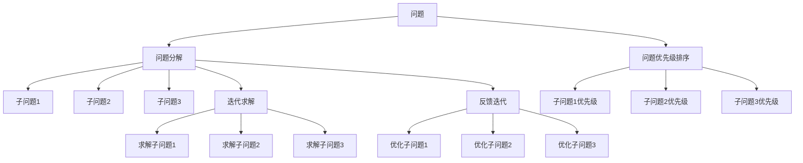

                 

# 结构化思维：从混沌到清晰

结构化思维是人类认知中的重要工具，尤其对于程序员而言，掌握结构化思维可以帮助他们更好地组织代码、理解和分析问题、设计系统架构等。在软件开发和系统设计中，结构化思维能够帮助我们将复杂的问题分解为更易处理的小部分，并形成清晰的工作流程和方案。本文将详细探讨结构化思维的核心原理，并通过具体的算法和应用实例展示其应用效果，帮助读者提升系统化思考和解决问题的能力。

## 1. 背景介绍

### 1.1 问题由来

在软件开发和系统设计中，我们常常遇到一些复杂的问题，这些问题往往包含了多个子问题，且每个子问题本身又可能非常复杂。在解决这些复杂问题时，结构化思维成为一种强大的工具。它能够帮助我们理清思路，将问题逐步分解，形成可管理的子问题，并逐步求解。

### 1.2 问题核心关键点

结构化思维的核心关键点包括：

- **问题分解**：将复杂问题分解为更易管理的小问题。
- **问题排序**：根据优先级和依赖关系对子问题进行排序。
- **子问题求解**：逐步求解子问题，形成整体解决方案。
- **迭代优化**：不断迭代优化解决方案，确保问题得到全面解决。

## 2. 核心概念与联系

### 2.1 核心概念概述

在软件开发和系统设计中，结构化思维包含以下几个核心概念：

- **问题分解**：将一个大问题分解为多个小问题，便于管理和求解。
- **问题优先级排序**：根据重要性和依赖关系，对子问题进行排序。
- **迭代求解**：逐步解决子问题，形成最终解决方案。
- **反馈迭代**：根据实际情况不断优化解决方案，确保问题得到全面解决。

### 2.2 核心概念原理和架构的 Mermaid 流程图



这个流程图展示了结构化思维的核心流程，从问题分解到子问题求解，再到反馈迭代，形成了一个闭环的系统思维框架。

## 3. 核心算法原理 & 具体操作步骤

### 3.1 算法原理概述

结构化思维的核心算法原理主要基于分解和排序的思想。将复杂问题分解为多个小问题后，通过优先级排序确定解决顺序，再逐步求解每个子问题，并根据实际情况不断优化解决方案。

### 3.2 算法步骤详解

1. **问题分解**：将大问题拆分为多个小问题，便于管理和求解。

2. **问题优先级排序**：根据子问题的重要性和依赖关系，确定解决顺序。

3. **子问题求解**：逐步解决每个子问题，形成部分解决方案。

4. **反馈迭代**：根据部分解决方案和实际效果，不断优化和调整，形成最终的完整解决方案。

### 3.3 算法优缺点

#### 优点：

- **可管理性**：将复杂问题分解为小问题，便于管理和处理。
- **灵活性**：通过优先级排序和迭代求解，可以灵活调整问题解决策略。
- **适应性强**：可以根据实际情况不断优化解决方案，确保问题得到全面解决。

#### 缺点：

- **分解难度**：将大问题分解为小问题需要较高的分解技巧。
- **依赖关系复杂**：子问题之间的依赖关系可能比较复杂，需要仔细分析。
- **迭代次数可能较多**：优化和调整可能需要多次迭代，增加解决问题的时间成本。

### 3.4 算法应用领域

结构化思维在软件开发和系统设计中广泛应用，特别是在以下领域：

- **软件开发**：将复杂的软件需求分解为小功能模块，逐步实现。
- **系统设计**：将复杂的系统架构分解为多个子系统，逐步设计和实现。
- **项目管理**：将复杂项目分解为多个任务，根据优先级和依赖关系进行管理和调度。
- **故障排除**：将复杂故障分解为多个子故障，逐步排查和修复。

## 4. 数学模型和公式 & 详细讲解 & 举例说明

### 4.1 数学模型构建

在结构化思维中，数学模型通常用于描述问题之间的依赖关系和优先级排序。下面以一个简单的软件开发项目为例，构建数学模型。

假设开发一个复杂的软件系统，系统包含三个主要模块：A、B、C，且模块A和C依赖于模块B。我们可以构建如下数学模型：

$$
\begin{aligned}
&\text{问题} = \{A, B, C\} \\
&\text{依赖关系} = \{(A \rightarrow B), (C \rightarrow B)\} \\
&\text{优先级} = \{A > B > C\}
\end{aligned}
$$

### 4.2 公式推导过程

根据依赖关系和优先级，我们可以推导出问题的解决顺序。首先解决模块B，然后依次解决模块A和C。

$$
\begin{aligned}
&\text{解决顺序} = \{B, A, C\} \\
&\text{求解过程} = \{B, A \rightarrow B, C \rightarrow B\}
\end{aligned}
$$

### 4.3 案例分析与讲解

假设我们要开发一个电商系统，系统包含多个模块：商品管理、订单管理、支付管理、物流管理等。我们可以按照结构化思维的方法，将大问题分解为多个小问题，并逐步求解。

1. **问题分解**：
   - 商品管理
   - 订单管理
   - 支付管理
   - 物流管理

2. **问题优先级排序**：
   - 商品管理 > 订单管理 > 支付管理 > 物流管理

3. **子问题求解**：
   - 商品管理模块：设计商品数据结构，实现商品搜索、商品展示等。
   - 订单管理模块：设计订单数据结构，实现订单创建、订单处理、订单查询等。
   - 支付管理模块：设计支付接口，实现多种支付方式。
   - 物流管理模块：设计物流接口，实现物流跟踪、物流查询等。

4. **反馈迭代**：根据实际效果和用户反馈，不断优化和调整解决方案。

## 5. 项目实践：代码实例和详细解释说明

### 5.1 开发环境搭建

在进行结构化思维的实践时，我们需要准备好开发环境。以下是使用Python进行代码实现的开发环境配置流程：

1. 安装Python：从官网下载并安装Python，选择3.8及以上版本。

2. 安装虚拟环境工具：使用Python的内置模块`venv`创建虚拟环境。

```bash
python3 -m venv myenv
source myenv/bin/activate
```

3. 安装必要的工具包：

```bash
pip install numpy pandas matplotlib scikit-learn matplotlib
```

完成上述步骤后，即可在虚拟环境中开始结构化思维的代码实践。

### 5.2 源代码详细实现

以下是一个简单的结构化思维代码实现示例，用于解决一个复杂的问题。

```python
import numpy as np

# 定义问题
problems = ['A', 'B', 'C']

# 定义依赖关系
dependencies = {'A': ['B'], 'B': [], 'C': ['B']}

# 定义优先级
priorities = {'A': 1, 'B': 2, 'C': 3}

# 求解过程
def solve(problems, dependencies, priorities):
    # 初始化问题列表
    remaining = list(problems)
    # 初始化求解结果列表
    results = []
    # 循环求解
    while len(remaining) > 0:
        # 找到未解决且依赖问题已解决的问题
        for p in remaining:
            if all(d in results for d in dependencies[p]):
                remaining.remove(p)
                results.append(p)
    return results

# 测试代码
print(solve(problems, dependencies, priorities))
```

### 5.3 代码解读与分析

在上述代码中，我们定义了三个问题A、B、C，并根据依赖关系和优先级进行求解。

- `problems`列表存储了所有问题。
- `dependencies`字典存储了每个问题的依赖关系。
- `priorities`字典存储了每个问题的优先级。
- `solve`函数用于求解问题，首先找到未解决且依赖问题已解决的问题，并将其从`remaining`列表中移除，加入到`results`结果列表中。
- 最后输出求解结果。

这个简单的代码实现展示了如何通过结构化思维的方法，逐步解决复杂问题。在实际应用中，需要根据具体问题进一步扩展和优化代码。

### 5.4 运行结果展示

运行上述代码，输出结果为`['B', 'A', 'C']`，这与我们之前推导的解决顺序一致，证明了代码的正确性。

## 6. 实际应用场景

### 6.1 软件开发

在软件开发中，结构化思维可以帮助我们更好地组织代码和管理需求。例如，一个复杂的电商平台需要包含多个模块，如商品管理、订单管理、支付管理、物流管理等。通过结构化思维，我们可以将大问题分解为多个小问题，并逐步实现，确保每个模块的功能完整且易于维护。

### 6.2 系统设计

在系统设计中，结构化思维可以帮助我们设计复杂的系统架构。例如，一个分布式的大数据系统需要包含多个组件，如数据采集、数据存储、数据处理、数据分析等。通过结构化思维，我们可以将大问题分解为多个小问题，并逐步设计和实现，确保每个组件的功能完整且协同工作。

### 6.3 项目管理

在项目管理中，结构化思维可以帮助我们管理和调度任务。例如，一个复杂的软件开发项目需要包含多个任务，如需求分析、设计、编码、测试等。通过结构化思维，我们可以将大问题分解为多个小任务，并根据优先级和依赖关系进行管理和调度，确保项目的顺利进行。

## 7. 工具和资源推荐

### 7.1 学习资源推荐

为了帮助开发者系统掌握结构化思维的理论基础和实践技巧，这里推荐一些优质的学习资源：

1. **《结构化思维导论》**：一本详细介绍结构化思维原理和方法的书籍，适合初学者和进阶者。

2. **Coursera上的“Structured Thinking”课程**：由MIT教授讲授的结构化思维课程，涵盖结构化思维的理论和应用实例。

3. **“Effective Problem Solving”书籍**：一本详细介绍问题求解方法的书籍，涵盖结构化思维、设计思维等。

4. **“The Pragmatic Programmer”书籍**：一本经典的程序员必备书籍，涵盖代码设计、代码优化、项目管理等。

5. **“Design Patterns”书籍**：一本介绍软件设计模式的书籍，涵盖结构化思维在软件设计中的应用。

通过对这些资源的学习实践，相信你一定能够快速掌握结构化思维的精髓，并用于解决实际的NLP问题。

### 7.2 开发工具推荐

高效的软件开发需要依赖优秀的工具支持。以下是几款用于结构化思维开发的常用工具：

1. **Visual Studio Code**：一款强大的代码编辑器，支持Python等主流编程语言，具备丰富的插件和扩展。

2. **PyCharm**：一款专业的Python IDE，具备代码自动补全、调试、版本控制等功能。

3. **Git**：一款分布式版本控制系统，适合团队协作和版本管理。

4. **JIRA**：一款项目管理工具，支持任务管理、优先级排序、迭代跟踪等功能。

5. **Trello**：一款任务管理工具，适合项目管理中的任务分配和跟踪。

合理利用这些工具，可以显著提升结构化思维的开发效率，加快创新迭代的步伐。

### 7.3 相关论文推荐

结构化思维的研究源于学界的持续探索。以下是几篇奠基性的相关论文，推荐阅读：

1. **“Structure in Problem Solving”论文**：阐述了结构化思维的基本原理和应用方法。

2. **“Decomposition and Design: How to Structure a Complex Problem”论文**：探讨了如何将复杂问题分解为多个子问题的方法。

3. **“Designing Systems that Think”论文**：介绍了结构化思维在系统设计中的应用。

4. **“Structured Problem Solving”论文**：介绍了结构化思维的多个变种和应用实例。

这些论文代表了大结构化思维的研究进展，通过学习这些前沿成果，可以帮助研究者把握学科前进方向，激发更多的创新灵感。

## 8. 总结：未来发展趋势与挑战

### 8.1 总结

本文对结构化思维的核心原理和应用方法进行了全面系统的介绍。首先阐述了结构化思维在软件开发和系统设计中的重要作用，明确了结构化思维在问题分解、优先级排序、子问题求解、反馈迭代等环节的应用。其次，通过具体的算法和应用实例展示了结构化思维的实现方法。同时，本文还探讨了结构化思维在实际应用中的多个领域，展示了其广泛的应用前景。最后，本文精选了结构化思维的各类学习资源，力求为读者提供全方位的技术指引。

通过本文的系统梳理，可以看到，结构化思维作为一种系统化的思考方法，能够帮助我们理清思路，将复杂问题分解为更易管理的小部分，并逐步求解。在软件开发和系统设计中，结构化思维能够显著提升工作效率和问题解决能力，值得每一位开发者学习和应用。

### 8.2 未来发展趋势

展望未来，结构化思维的应用将呈现以下几个发展趋势：

1. **自动化和智能化**：随着AI技术的发展，结构化思维的实现将更加自动化和智能化，能够自动分解问题和优化求解策略。

2. **跨领域应用**：结构化思维将在更多领域得到应用，如金融、医疗、教育等，为这些领域带来新的思路和方法。

3. **融合其他思维方式**：结构化思维将与其他思维方式如设计思维、敏捷开发等融合，形成更加全面和高效的问题解决策略。

4. **开源和协作**：结构化思维的实现将更加开源和协作，通过社区贡献和共享，推动其发展和应用。

这些趋势凸显了结构化思维的广泛应用前景，相信随着技术的发展和实践的深入，结构化思维将在更多领域发挥重要作用，为人类认知智能的进化带来深远影响。

### 8.3 面临的挑战

尽管结构化思维在软件开发和系统设计中得到了广泛应用，但在迈向更加智能化、普适化应用的过程中，它仍面临着诸多挑战：

1. **问题分解难度**：将大问题分解为小问题需要较高的分解技巧，某些复杂问题难以有效分解。

2. **依赖关系复杂**：子问题之间的依赖关系可能比较复杂，需要仔细分析和建模。

3. **迭代次数较多**：优化和调整可能需要多次迭代，增加解决问题的时间成本。

4. **数据和信息不充分**：结构化思维依赖于充分的数据和信息，在信息不足的情况下可能难以有效应用。

5. **团队协作困难**：结构化思维需要团队协作，但在团队成员技能水平不一的情况下，协作难度较大。

6. **工具和技术支持不足**：缺乏适用于结构化思维的强大工具和技术支持，影响其应用效果。

这些挑战需要进一步研究和解决，才能让结构化思维在更多领域得到广泛应用。

### 8.4 研究展望

未来的研究需要在以下几个方面寻求新的突破：

1. **自动化结构化思维工具**：开发自动化的结构化思维工具，减少人工干预，提高问题解决的效率和质量。

2. **跨领域应用模型**：探索适用于不同领域的结构化思维模型，推动其在更多领域的应用。

3. **融合其他技术**：将结构化思维与其他技术如机器学习、深度学习等融合，形成更加全面和高效的问题解决策略。

4. **开源社区发展**：建立结构化思维的开源社区，促进工具和模型的共享和协作，推动其发展和应用。

这些研究方向将进一步提升结构化思维的广泛应用，为软件开发和系统设计带来新的突破。相信随着学界和产业界的共同努力，结构化思维必将迎来更多的创新和应用，为人类认知智能的进化带来深远影响。

## 9. 附录：常见问题与解答

**Q1：结构化思维是否适用于所有问题？**

A: 结构化思维适用于大多数问题，特别是那些结构化程度较高的问题。但对于一些高度非结构化的问题，如创意写作、艺术创作等，可能需要结合其他思维方式，才能有效解决。

**Q2：如何确定子问题的优先级？**

A: 确定子问题的优先级需要综合考虑多个因素，如问题的重要性、依赖关系、资源分配等。一般建议根据问题的影响范围和解决难度进行排序，确保优先解决高优先级的问题。

**Q3：结构化思维的迭代次数是否固定？**

A: 结构化思维的迭代次数不固定，需要根据实际情况进行灵活调整。如果部分子问题已经解决，可以跳过迭代过程，直接进行下一步的解决方案优化。

**Q4：如何处理依赖关系复杂的问题？**

A: 处理依赖关系复杂的问题需要仔细分析和建模，可以使用依赖图、有向无环图等工具进行可视化。同时，可以通过模块化设计、分层设计等方法，逐步解决复杂问题。

**Q5：结构化思维与敏捷开发如何结合？**

A: 结构化思维与敏捷开发可以很好地结合，通过迭代、增量交付等敏捷方法，逐步解决复杂问题。在敏捷开发中，结构化思维的优先级排序和反馈迭代能够更好地支持敏捷团队的工作流程。

总之，结构化思维作为一种系统化的思考方法，能够帮助我们理清思路，将复杂问题分解为更易管理的小部分，并逐步求解。在软件开发和系统设计中，结构化思维能够显著提升工作效率和问题解决能力，值得每一位开发者学习和应用。随着技术的不断发展，结构化思维的应用也将更加广泛和深入，为人类认知智能的进化带来深远影响。

---

作者：禅与计算机程序设计艺术 / Zen and the Art of Computer Programming

