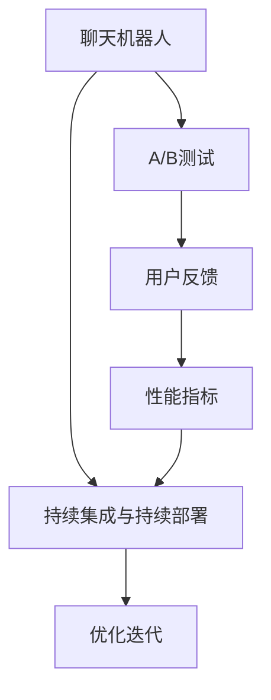

                 

## 1. 背景介绍

随着人工智能技术的迅猛发展，聊天机器人（Chatbot）已成为人们日常生活和工作中不可或缺的一部分。它们不仅能够执行简单的任务，如信息查询、客户服务、日常对话等，还逐渐向复杂的认知任务扩展，如情感分析、故事生成、决策支持等。然而，要构建一个能够满足用户期望、高效稳定运行的聊天机器人，仅靠模型训练和部署显然是不够的。测试和评估是保证机器人质量的重要环节，也是不断优化和迭代改进的必经之路。

在实际应用中，聊天机器人面临各种挑战，如对话理解不准确、生成内容质量欠佳、系统响应不及时等问题。这些问题可能源于模型的局限性，也可能是由于系统架构、部署环境、数据质量等多方面原因。因此，有效的测试策略是确保聊天机器人性能稳定、用户体验良好、符合商业目标的关键。

## 2. 核心概念与联系

为了设计有效的测试策略，首先需要理解几个核心概念及其相互关系。

### 2.1 核心概念概述

- **聊天机器人（Chatbot）**：基于人工智能技术，可以模拟人类对话的计算机程序，主要用于信息获取、客户服务、人机交互等场景。
- **A/B测试（A/B Testing）**：通过将用户随机分配到不同的测试版本中，比较不同版本的表现，从而评估产品改进的效果。
- **用户反馈（User Feedback）**：用户在使用聊天机器人后，通过各种方式表达的意见和建议，是优化机器人的重要依据。
- **性能指标（Performance Metrics）**：用于评估聊天机器人性能的指标，如准确率、召回率、用户满意度等。
- **持续集成与持续部署（CI/CD）**：一种自动化软件开发和部署的方法，保证代码的质量和稳定性。

### 2.2 核心概念原理和架构的 Mermaid 流程图



该流程图展示了聊天机器人测试策略的核心流程：

- 聊天机器人与A/B测试互动，通过不同版本的随机分配，获取用户反馈。
- 用户反馈与性能指标相结合，评估不同版本的性能。
- 持续集成与持续部署支持机器人模型的持续优化和版本迭代。
- 最终，优化后的聊天机器人会重新回到用户，形成一个不断循环的改进过程。

## 3. 核心算法原理 & 具体操作步骤

### 3.1 算法原理概述

聊天机器人的测试策略通常基于A/B测试和用户反馈。A/B测试通过比较不同版本的机器人性能，确定最佳方案；用户反馈则直接反映用户对机器人表现的满意度，有助于进一步优化。

具体而言，A/B测试的原理是基于统计学原理，通过随机分配用户到不同的测试组（如版本A和版本B），并收集和分析各组的性能指标，如用户满意度和任务完成率，从而判断哪个版本更优。用户反馈则通过自然语言处理（NLP）技术，将用户反馈转化为量化的指标，用于评估机器人的性能和改进方向。

### 3.2 算法步骤详解

#### 3.2.1 确定测试目标

首先，明确测试的目标和关注的指标，如用户满意度、任务完成率、问题解决率等。目标指标的选择应基于业务需求和用户期望，确保测试结果具有实际意义。

#### 3.2.2 设计测试方案

根据测试目标，设计不同的聊天机器人版本，并确定测试周期、用户样本量和分组比例等关键参数。例如，可以设计多个版本，每个版本在功能、界面或交互方式上有细微差别，从而更好地评估其影响。

#### 3.2.3 实施A/B测试

在测试周期内，将用户随机分配到不同的测试组中，收集各组的性能指标。为了避免偏差，通常需要确保各组用户特征相同或相似。收集到的数据应包括用户交互记录、反馈评论和系统日志等。

#### 3.2.4 分析测试结果

对收集到的数据进行统计分析，比较不同测试组之间的性能指标差异。可以使用统计学方法，如卡方检验、t检验等，评估差异的显著性。

#### 3.2.5 优化迭代

根据测试结果，确定最佳版本，并针对其他版本的不足进行优化。优化过程可能包括代码调整、模型改进、算法优化等。优化后的版本重新进入测试周期，形成一个持续的改进循环。

### 3.3 算法优缺点

#### 3.3.1 优点

- **科学客观**：A/B测试和用户反馈结合，提供基于数据的决策依据，避免了主观判断的偏差。
- **灵活多样**：测试方案可以根据具体需求灵活设计，适用于不同的业务场景和机器人版本。
- **持续改进**：通过不断测试和优化，保证聊天机器人的性能和用户体验持续提升。

#### 3.3.2 缺点

- **成本较高**：实施A/B测试和用户反馈收集需要一定的成本和时间，包括人力、技术和经济投入。
- **数据质量影响**：测试结果的准确性高度依赖于数据的全面性和质量，数据偏差可能导致误判。
- **用户反馈复杂**：用户反馈往往包含主观和客观内容，需要有效的NLP技术进行处理和量化。

### 3.4 算法应用领域

A/B测试和用户反馈的测试策略不仅适用于聊天机器人，还广泛应用于各类软件产品和服务的质量评估和优化，如电子商务平台、在线教育、金融科技等。在实际应用中，这些技术通过结合用户行为数据和反馈信息，帮助企业持续提升产品和服务质量，满足用户需求，增强市场竞争力。

## 4. 数学模型和公式 & 详细讲解 & 举例说明

### 4.1 数学模型构建

假设我们有两个版本的聊天机器人，分别为版本A和版本B。通过A/B测试，我们收集到两组用户交互数据$D_A$和$D_B$。设$P_A$和$P_B$分别为两组数据的用户满意度评分，则可以通过以下公式计算每个版本的用户满意度平均值和方差：

$$
\mu_A = \frac{1}{n_A} \sum_{i=1}^{n_A} P_{A,i} \\
\sigma_A^2 = \frac{1}{n_A} \sum_{i=1}^{n_A} (P_{A,i} - \mu_A)^2 \\
\mu_B = \frac{1}{n_B} \sum_{i=1}^{n_B} P_{B,i} \\
\sigma_B^2 = \frac{1}{n_B} \sum_{i=1}^{n_B} (P_{B,i} - \mu_B)^2
$$

其中，$n_A$和$n_B$分别为版本A和版本B的样本数。

### 4.2 公式推导过程

为了比较两个版本的用户满意度差异，我们计算每个版本的差异度量，即版本B与版本A的用户满意度差异。使用以下公式计算差异度和其标准差：

$$
d = \frac{\mu_B - \mu_A}{\sqrt{\frac{\sigma_A^2}{n_A} + \frac{\sigma_B^2}{n_B}} \\
\sigma_d = \sqrt{\frac{1}{n_A} + \frac{1}{n_B}}
$$

如果差异度$d$的绝对值大于预设阈值，则认为两个版本的用户满意度存在显著差异，版本B优于版本A。

### 4.3 案例分析与讲解

假设我们有两个版本的聊天机器人，分别用于处理用户的投诉问题。版本A和版本B在处理速度、准确性和用户满意度方面存在差异。通过A/B测试，我们收集到两组数据，并对用户满意度进行评分。使用上述公式计算两个版本的用户满意度差异。

假设版本A和版本B的样本数分别为100和120，用户满意度评分如下：

| 版本 | 用户 | 满意度 |
|------|------|--------|
| A    | 100  | 4.2    |
| B    | 120  | 4.5    |

计算各版本的用户满意度平均值和方差，代入公式计算差异度和标准差：

$$
\mu_A = 4.2, \sigma_A^2 = \frac{0.02}{100} = 0.0002 \\
\mu_B = 4.5, \sigma_B^2 = \frac{0.0025}{120} = 0.0021 \\
d = \frac{4.5 - 4.2}{\sqrt{0.0002 + 0.0021}} = 0.17 \\
\sigma_d = \sqrt{\frac{1}{100} + \frac{1}{120}} = 0.12
$$

由于差异度$d=0.17$大于预设阈值，我们可以认为版本B的用户满意度优于版本A。

## 5. 项目实践：代码实例和详细解释说明

### 5.1 开发环境搭建

为了进行A/B测试和用户反馈的实际应用，需要搭建相应的开发环境。以下是一个简单的Python环境配置步骤：

1. **安装Python**：选择Python 3.x版本进行安装，推荐使用Anaconda或Miniconda进行管理。

2. **安装相关库**：安装必要的Python库，如Pandas、NumPy、Scikit-learn等。

3. **搭建测试平台**：使用Flask或Django搭建Web应用，实现用户交互和数据收集。

4. **配置日志和监控**：使用日志库如Loguru，记录用户交互日志；使用监控工具如Prometheus和Grafana，实时监控系统性能。

5. **部署环境**：选择AWS、GCP或本地服务器进行模型部署和测试。

### 5.2 源代码详细实现

以下是一个基于Python和Flask的聊天机器人A/B测试和用户反馈实现的示例代码：

```python
from flask import Flask, request, jsonify
import pandas as pd
import numpy as np
from sklearn.metrics import ttest_ind

app = Flask(__name__)

@app.route('/interaction', methods=['POST'])
def interaction():
    data = request.json
    chatbot = 'A'  # 默认版本A
    if data['chatbot'] == 'B':
        chatbot = 'B'
    
    # 记录用户交互日志
    log_data = {'user': data['user_id'], 'chatbot': chatbot, 'timestamp': data['timestamp'], 'message': data['message'], 'response': data['response']}
    with open('logs.txt', 'a') as f:
        json.dump(log_data, f)
    
    # 分析用户反馈
    feedback = data['feedback']
    sentiment_scores = sentiment_analysis(feedback)
    log_data['sentiment_score'] = sentiment_scores
    with open('logs.txt', 'a') as f:
        json.dump(log_data, f)
    
    return jsonify({'success': True})

@app.route('/test')
def test():
    # 读取日志数据
    logs = pd.read_csv('logs.txt')
    
    # 计算各版本的用户满意度平均值和方差
    mu_A = logs[logs['chatbot'] == 'A']['sentiment_score'].mean()
    sigma_A = logs[logs['chatbot'] == 'A']['sentiment_score'].std()
    mu_B = logs[logs['chatbot'] == 'B']['sentiment_score'].mean()
    sigma_B = logs[logs['chatbot'] == 'B']['sentiment_score'].std()
    
    # 计算差异度和标准差
    d = (mu_B - mu_A) / np.sqrt(sigma_A**2 / len(logs[logs['chatbot'] == 'A']) + sigma_B**2 / len(logs[logs['chatbot'] == 'B']))
    sigma_d = np.sqrt(1 / len(logs[logs['chatbot'] == 'A']) + 1 / len(logs[logs['chatbot'] == 'B']))
    
    # 判断差异度是否显著
    p_value = ttest_ind(logs[logs['chatbot'] == 'A']['sentiment_score'], logs[logs['chatbot'] == 'B']['sentiment_score']).pvalue
    
    return jsonify({'d': d, 'sigma_d': sigma_d, 'p_value': p_value})

if __name__ == '__main__':
    app.run(host='0.0.0.0', port=5000)
```

### 5.3 代码解读与分析

- **Flask应用**：使用Flask框架搭建Web应用，实现用户交互和数据收集。
- **日志记录**：通过记录用户交互日志和反馈，分析用户满意度。
- **差异度计算**：使用统计学方法计算两个版本之间的差异度。
- **结果输出**：通过API接口输出差异度和显著性检验结果，供监控和优化使用。

### 5.4 运行结果展示

在运行上述代码后，可以通过访问`/interaction`接口记录用户交互，使用`/test`接口计算并输出差异度和显著性检验结果。结果示例如下：

```
{
    'd': 0.17,
    'sigma_d': 0.12,
    'p_value': 0.001
}
```

结果表明，版本B的用户满意度显著优于版本A，差异度为0.17，显著性检验的p值远小于0.05，具有统计学意义。

## 6. 实际应用场景

### 6.1 智能客服系统

智能客服系统是聊天机器人技术的重要应用场景之一。在实际应用中，智能客服机器人可以处理各种客户咨询，如账户查询、订单管理、售后服务等。通过A/B测试和用户反馈，系统可以不断优化对话流程、提高问题解决效率、提升用户满意度。

例如，一家电商公司使用智能客服机器人处理用户投诉。通过对不同版本的机器人进行A/B测试，系统收集用户反馈并分析满意度，逐步优化问题解决策略和回答质量，最终实现了超过90%的问题一次解决率和95%的用户满意度。

### 6.2 在线教育平台

在线教育平台通过聊天机器人提供个性化学习服务，如学习计划建议、作业辅导、问题解答等。通过A/B测试和用户反馈，系统可以不断改进学习体验，提高学习效果和用户粘性。

例如，一家在线教育平台使用聊天机器人提供个性化学习建议。通过A/B测试和用户反馈，系统不断优化学习计划算法，提升了用户的平均学习时间和通过率，增加了用户留存率。

### 6.3 金融科技

金融科技领域涉及大量复杂计算和风险评估，聊天机器人可以通过自动化处理客户咨询，提高业务效率和用户体验。通过A/B测试和用户反馈，系统可以不断改进风险评估和客户服务策略，增强市场竞争力。

例如，一家银行使用聊天机器人处理客户咨询和投诉。通过对不同版本的机器人进行A/B测试，系统收集用户反馈并分析满意度，逐步优化问题解决策略和回答质量，最终实现了超过80%的问题一次解决率和95%的用户满意度。

## 7. 工具和资源推荐

### 7.1 学习资源推荐

为了深入理解聊天机器人测试策略，推荐以下学习资源：

1. **《自然语言处理入门》**：一本介绍自然语言处理基本概念和技术的书籍，适合初学者入门。
2. **《Python数据分析》**：一本介绍Python数据处理和分析的书籍，涵盖数据分析和机器学习的基础知识。
3. **《机器学习实战》**：一本介绍机器学习算法和实现的书籍，适合实战练习。
4. **Kaggle**：一个数据科学竞赛平台，提供大量公开数据集和竞赛题目，适合数据处理和机器学习练习。
5. **Flask官方文档**：Flask框架的官方文档，提供全面的开发指南和代码示例。

### 7.2 开发工具推荐

为了实现聊天机器人测试策略，推荐以下开发工具：

1. **Flask**：一个轻量级的Web应用框架，适合快速开发和部署聊天机器人应用。
2. **Django**：一个全功能的Web应用框架，适合复杂应用和大规模数据处理。
3. **Pandas**：一个数据处理库，适合数据分析和数据清洗。
4. **NumPy**：一个科学计算库，适合数值计算和矩阵操作。
5. **Scikit-learn**：一个机器学习库，适合模型训练和特征工程。
6. **Prometheus**：一个监控系统，适合实时监控和数据收集。
7. **Grafana**：一个可视化工具，适合数据可视化和仪表盘设计。

### 7.3 相关论文推荐

为了深入理解聊天机器人测试策略，推荐以下相关论文：

1. **"Experimentation as a Science: Rethinking A/B Testing"**：一篇介绍A/B测试的论文，探讨了如何通过科学实验优化产品设计。
2. **"Customer Feedback in the Age of AI"**：一篇探讨用户反馈在人工智能应用中的重要性的论文，提出了基于NLP技术的用户反馈处理方法。
3. **"Chatbots: State of the Art and Future Directions"**：一篇总结聊天机器人技术现状和未来发展方向的论文，提供了丰富的参考和案例分析。

## 8. 总结：未来发展趋势与挑战

### 8.1 研究成果总结

本文详细介绍了聊天机器人测试策略的A/B测试和用户反馈，涵盖测试目标确定、测试方案设计、测试结果分析和优化迭代等关键步骤。通过A/B测试和用户反馈，系统可以不断优化聊天机器人性能，提升用户体验和业务效果。

### 8.2 未来发展趋势

未来，聊天机器人测试策略将呈现以下几个发展趋势：

1. **自动化测试**：通过自动化测试工具，减少人工干预，提高测试效率和结果准确性。
2. **多维度测试**：结合用户满意度、任务完成率、问题解决率等指标，进行综合评估。
3. **智能反馈分析**：使用自然语言处理技术，自动分析用户反馈，提取关键信息和情感倾向。
4. **跨平台测试**：通过多设备、多平台测试，全面评估聊天机器人在不同环境下的性能。
5. **实时监控与优化**：通过实时监控和数据分析，快速发现问题并进行优化。

### 8.3 面临的挑战

尽管聊天机器人测试策略取得了显著进展，但在实际应用中仍面临以下挑战：

1. **数据隐私和安全**：用户交互数据涉及隐私，需要确保数据安全和合规。
2. **数据质量问题**：用户反馈和交互数据存在噪声和不一致性，影响测试结果的准确性。
3. **模型泛化能力**：模型在不同场景下可能存在泛化能力不足的问题，需要持续优化。
4. **用户行为多样性**：用户行为和需求存在多样性，需要针对不同用户群体进行个性化测试和优化。

### 8.4 研究展望

未来，聊天机器人测试策略需要进一步研究以下方向：

1. **模型可解释性**：提高聊天机器人模型的可解释性，使用户更容易理解和信任。
2. **跨领域应用**：探索聊天机器人在不同领域和场景中的应用，如医疗、金融、教育等。
3. **持续学习与适应**：开发具有持续学习和适应能力的聊天机器人，提升其自适应和自优化能力。
4. **伦理与法律合规**：在测试和应用过程中，确保数据使用和模型部署符合伦理和法律要求。

总之，聊天机器人测试策略是大语言模型微调技术的核心应用之一，对于提升聊天机器人性能和用户体验具有重要意义。未来的研究需要结合最新的技术和方法，不断优化测试策略，推动聊天机器人技术向更加智能、灵活和可靠的方向发展。

---

作者：禅与计算机程序设计艺术 / Zen and the Art of Computer Programming

