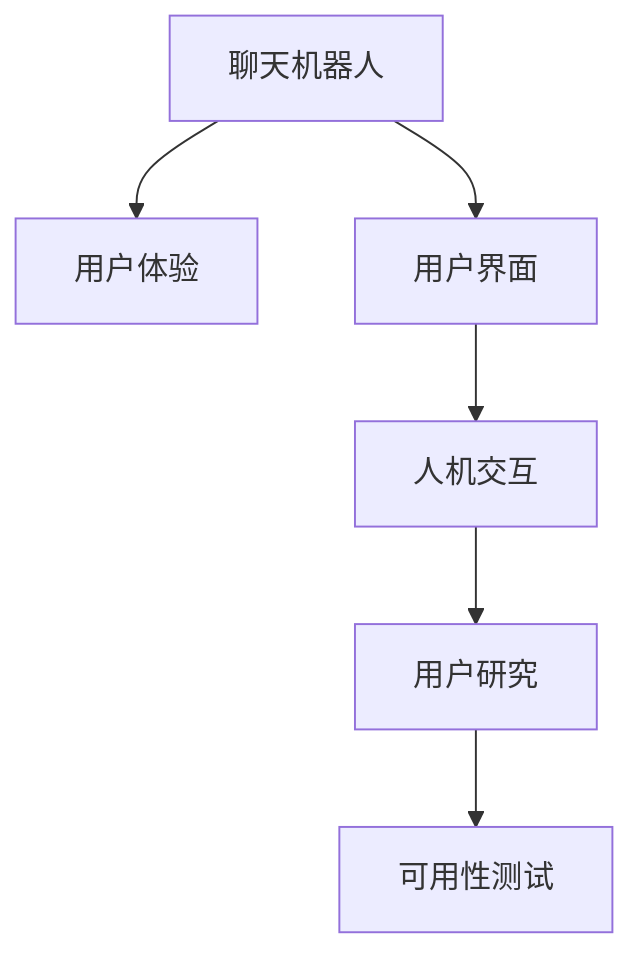

                 

# 聊天机器人界面设计：用户体验优化

## 1. 背景介绍

### 1.1 问题由来

随着人工智能技术的快速发展，聊天机器人（Chatbot）已经成为智能交互的重要形式，广泛应用在客服、教育、娱乐、健康等多个领域。然而，尽管技术不断进步，但用户体验（User Experience，UX）一直是聊天机器人设计中的关键挑战。用户体验的好坏直接影响了用户的使用意愿和满意度，关系到系统的成功率和商业价值。

### 1.2 问题核心关键点

用户体验优化的核心在于如何通过界面设计，让用户能够轻松、自然地与聊天机器人进行交互，同时获得满意的服务和反馈。这不仅涉及到界面元素的布局和颜色，还包括交互流程的流畅性、信息的清晰度和反馈的及时性。一个好的聊天机器人界面应该能够：

1. **提升用户参与度**：引导用户积极参与对话，降低用户流失率。
2. **简化操作流程**：提供直观的操作路径，减少用户的操作负担。
3. **增强信息透明度**：清晰展示聊天机器人的功能和操作提示，减少用户困惑。
4. **提高反馈效率**：快速响应用户请求，提供即时的反馈和解决方案。
5. **提供个性化服务**：根据用户的行为和偏好，提供定制化的交互体验。

### 1.3 问题研究意义

聊天机器人界面设计的好坏，直接影响用户的使用体验和满意度。优秀的界面设计不仅能提高用户黏性，还能提升品牌的形象和声誉。因此，研究聊天机器人界面设计，优化用户体验，具有重要意义：

1. **提升用户满意度**：通过界面优化，提高用户的使用体验，增加用户的满意度和忠诚度。
2. **降低运营成本**：优秀的设计可以减少用户流失，提高用户使用时长和频次，降低客服成本。
3. **促进技术创新**：界面设计的优化需要不断借鉴和应用最新的设计理念和技术手段，推动聊天机器人技术的持续进步。
4. **增强品牌影响力**：良好的用户界面可以提升品牌形象，增加品牌的市场竞争力。
5. **推动产业发展**：界面设计的优化可以带动相关产业的发展，如交互设计、用户研究、UX/UI设计等。

## 2. 核心概念与联系

### 2.1 核心概念概述

为了更好地理解聊天机器人界面设计，本节将介绍几个密切相关的核心概念：

- **聊天机器人（Chatbot）**：一种能够通过自然语言处理技术，与用户进行对话的系统。聊天机器人广泛应用于客服、教育、娱乐等多个领域。
- **用户体验（UX）**：用户在使用产品或服务过程中所感受到的满足度。好的用户体验能够让用户更加愉快和满意。
- **用户界面（UI）**：用户与产品或服务进行交互的界面，包括视觉元素、交互元素、布局和导航等。
- **人机交互（HCI）**：研究人如何与计算机系统进行交互的技术，涵盖界面设计、用户行为分析等多个方面。
- **用户研究（User Research）**：通过调查、访谈等方式，了解用户需求和行为，指导产品设计。
- **可用性测试（Usability Testing）**：评估用户对产品或服务的可用性，发现和解决问题，提升用户体验。

这些核心概念之间的逻辑关系可以通过以下Mermaid流程图来展示：



这个流程图展示了一些核心概念及其之间的关系：

1. 聊天机器人通过用户界面与用户进行交互，体验优化的目的是提高用户对界面的满意度。
2. 界面设计需要考虑人机交互的原则，通过用户研究获取用户需求，进而进行可用性测试，确保设计方案的有效性。

## 3. 核心算法原理 & 具体操作步骤

### 3.1 算法原理概述

聊天机器人界面设计中的用户体验优化，本质上是基于用户行为数据和反馈的迭代优化过程。其核心思想是通过用户界面的设计和调整，不断提升用户在使用过程中的满意度和操作效率，从而优化用户体验。

具体而言，界面设计的优化过程包括：

1. **数据收集**：通过用户行为数据和反馈，了解用户在使用过程中的痛点和需求。
2. **界面设计**：基于收集到的数据，设计出直观、易用的用户界面。
3. **可用性测试**：通过可用性测试，评估设计方案的实际效果，发现并解决用户使用中的问题。
4. **迭代优化**：根据测试结果，不断调整和优化界面设计，提高用户体验。

### 3.2 算法步骤详解

聊天机器人界面设计的优化过程可以分为以下几个关键步骤：

**Step 1: 数据收集与分析**

- 使用分析工具（如Google Analytics、Mixpanel）收集用户行为数据，包括点击路径、停留时间、操作频率等。
- 通过用户反馈（如问卷调查、用户评论）了解用户对当前界面的满意度和不满意度。
- 分析数据，找出用户操作中的高频问题和瓶颈，确定优化方向。

**Step 2: 界面设计**

- 根据用户行为数据和反馈，设计出直观、易用的用户界面，包括按钮布局、文字大小、颜色搭配等。
- 确保界面元素的排列顺序符合用户使用习惯，减少用户的操作负担。
- 设计清晰的提示和引导，帮助用户理解操作流程和功能。

**Step 3: 可用性测试**

- 邀请目标用户参与可用性测试，模拟真实使用场景，评估界面设计的有效性。
- 观察用户在使用过程中的行为，记录用户的问题和困惑点。
- 收集用户的反馈，分析用户的痛点和需求。

**Step 4: 迭代优化**

- 根据可用性测试的结果，不断调整和优化界面设计，提高用户体验。
- 重复进行可用性测试，确保优化方案的有效性。
- 持续收集用户反馈，动态调整界面设计，满足用户需求。

### 3.3 算法优缺点

聊天机器人界面设计优化中的用户体验优化方法具有以下优点：

1. **提高用户满意度**：通过优化界面设计，提高用户的使用体验，增加用户黏性和满意度。
2. **减少用户流失**：优秀的设计可以减少用户流失，提高用户使用时长和频次，降低客服成本。
3. **提升品牌形象**：良好的用户界面可以提升品牌形象，增加品牌的市场竞争力。

同时，该方法也存在一定的局限性：

1. **数据收集难度大**：收集高质量的用户行为数据和反馈需要一定的时间和成本。
2. **设计复杂性高**：界面设计需要兼顾美观和功能，设计过程复杂且耗时。
3. **用户差异性大**：不同用户对界面的接受度和使用习惯存在差异，设计需要兼顾多样性。
4. **设计成本高**：优秀的界面设计需要专业的设计师和工程师，成本较高。

尽管存在这些局限性，但就目前而言，用户体验优化的界面设计方法仍是大语言模型应用的重要范式。未来相关研究的重点在于如何进一步降低界面设计对资源的需求，提高设计的效率和效果，同时兼顾可解释性和伦理安全性等因素。

### 3.4 算法应用领域

聊天机器人界面设计的用户体验优化方法在多个领域中得到了广泛应用，例如：

- 客服系统：通过优化界面设计，提高用户满意度，降低客服成本。
- 教育平台：设计直观易用的界面，增强学习体验，提升教学质量。
- 健康咨询：设计人性化的界面，提供方便易用的健康咨询服务。
- 娱乐应用：设计吸引用户的界面，增强游戏体验和用户黏性。
- 商务应用：设计高效易用的界面，提高业务效率和用户满意度。

除了上述这些经典领域外，聊天机器人界面设计的用户体验优化方法也被创新性地应用到更多场景中，如智能家居、智能交通等，为各行各业带来了新的技术突破。随着预训练模型和界面设计的不断进步，相信聊天机器人界面设计的用户体验优化方法将在更广阔的应用领域大放异彩。

## 4. 数学模型和公式 & 详细讲解 & 举例说明

### 4.1 数学模型构建

在聊天机器人界面设计中，用户体验优化的数学模型可以表示为：

$$
\max_{I} UX(I) = \max_{I} \left[ \sum_{i} satisfaction(i) - \sum_{i} effort(i) \right]
$$

其中 $I$ 表示界面设计方案，$satisfaction(i)$ 表示用户在使用界面 $i$ 时的满意度，$effort(i)$ 表示用户在使用界面 $i$ 时的操作负担。

### 4.2 公式推导过程

对于每个界面元素 $x_i$，其对用户满意度的贡献可以表示为：

$$
satisfaction(x_i) = \alpha \cdot \text{Impact}(x_i) + \beta \cdot \text{Visibility}(x_i)
$$

其中 $\alpha$ 和 $\beta$ 是权值，表示元素的重要性和可见性。$\text{Impact}(x_i)$ 表示元素对用户操作的影响，$\text{Visibility}(x_i)$ 表示元素在界面中的可见性。

对于用户的操作负担，可以表示为：

$$
effort(x_i) = \gamma \cdot \text{ClickDistance}(x_i) + \delta \cdot \text{LearningCurve}(x_i)
$$

其中 $\gamma$ 和 $\delta$ 是权值，表示点击距离和操作难度的重要性。$\text{ClickDistance}(x_i)$ 表示用户点击元素的距离，$\text{LearningCurve}(x_i)$ 表示用户学习新操作所需的时间。

### 4.3 案例分析与讲解

以下是一个简化的案例分析，说明如何通过界面设计优化用户体验：

假设我们有一个简单的在线购物聊天机器人界面，包含以下元素：

- 首页按钮（Home Button）
- 搜索输入框（Search Box）
- 产品展示区域（Product Display Area）
- 购物车图标（Shopping Cart Icon）

我们可以根据用户行为数据和反馈，分析每个元素对用户满意度和操作负担的贡献，从而优化界面设计。

- 首页按钮对用户满意度的贡献较大，因为用户需要快速访问首页。
- 搜索输入框对用户满意度的贡献也较大，因为用户需要快速查找商品。
- 产品展示区域对用户满意度的贡献较小，因为用户主要是通过商品图片和描述进行选择。
- 购物车图标对用户满意度的贡献较小，因为用户只有在购买商品时才会关注。

基于上述分析，我们可以调整界面设计，将首页按钮和搜索输入框放在更显眼的位置，简化产品展示区域的设计，提升用户的操作效率和满意度。

## 5. 项目实践：代码实例和详细解释说明

### 5.1 开发环境搭建

在进行界面设计实践前，我们需要准备好开发环境。以下是使用HTML和CSS开发的界面设计环境配置流程：

1. 安装Node.js和npm：从官网下载并安装Node.js和npm，用于创建和管理项目。
2. 创建并激活虚拟环境：
```bash
npm init
npm install
```

3. 安装相关的设计工具：
```bash
npm install express ejs
```

4. 安装相关的前端框架：
```bash
npm install bootstrap vue
```

完成上述步骤后，即可在Node.js环境下开始界面设计实践。

### 5.2 源代码详细实现

这里我们以一个简单的聊天机器人界面为例，给出HTML和CSS的代码实现。

首先，创建HTML文件，定义界面的基本结构：

```html
<!DOCTYPE html>
<html>
<head>
    <meta charset="UTF-8">
    <title>Chatbot Interface Design</title>
    <link rel="stylesheet" href="https://stackpath.bootstrapcdn.com/bootstrap/4.5.2/css/bootstrap.min.css">
</head>
<body>
    <header>
        <nav class="navbar navbar-expand-lg navbar-light bg-light">
            <a class="navbar-brand" href="#">Chatbot</a>
            <button class="navbar-toggler" type="button" data-toggle="collapse" data-target="#navbarNavAltMarkup" aria-controls="navbarNavAltMarkup" aria-expanded="false" aria-label="Toggle navigation">
                <span class="navbar-toggler-icon"></span>
            </button>
            <div class="collapse navbar-collapse" id="navbarNavAltMarkup">
                <div class="navbar-nav">
                    <a class="nav-item nav-link" href="#">Home</a>
                    <a class="nav-item nav-link" href="#">Search</a>
                    <a class="nav-item nav-link" href="#">Products</a>
                    <a class="nav-item nav-link" href="#">Cart</a>
                </div>
            </div>
        </nav>
    </header>
    <main>
        <div class="container">
            <div class="row">
                <div class="col-md-6">
                    <h2>Chatbot Interface Design</h2>
                    <form>
                        <div class="form-group">
                            <label for="chat-input">Chat Input:</label>
                            <textarea class="form-control" id="chat-input" rows="5"></textarea>
                        </div>
                        <button class="btn btn-primary" type="button" id="send-button">Send</button>
                    </form>
                </div>
                <div class="col-md-6">
                    <div class="chat-log">
                        <div class="chat-message chatbot-message">
                            <p>Hello! How can I help you?</p>
                        </div>
                    </div>
                </div>
            </div>
        </div>
    </main>
    <script src="https://code.jquery.com/jquery-3.5.1.slim.min.js"></script>
    <script src="https://cdn.jsdelivr.net/npm/@popperjs/core@2.5.4/dist/umd/popper.min.js"></script>
    <script src="https://stackpath.bootstrapcdn.com/bootstrap/4.5.2/js/bootstrap.min.js"></script>
    <script>
        // 发送按钮点击事件
        $('#send-button').click(function() {
            var inputText = $('#chat-input').val();
            // 将用户输入发送给聊天机器人
            // 实现具体交互逻辑
        });
    </script>
</body>
</html>
```

然后，创建CSS文件，定义界面的样式：

```css
/* 样式表 */
header {
    background-color: #f8f9fa;
}

nav.navbar {
    justify-content: space-between;
}

.navbar-nav {
    justify-content: center;
}

.chat-log {
    max-height: 200px;
    overflow-y: scroll;
}

.chat-message {
    padding: 10px;
    background-color: #e9ecef;
    border-radius: 5px;
    margin-bottom: 10px;
}

.chatbot-message {
    background-color: #007bff;
    color: white;
}

.chatbot-message::before {
    content: "✉ ";
    margin-right: 5px;
}
```

最后，运行HTML文件，即可看到界面效果：

```bash
node index.html
```

### 5.3 代码解读与分析

这里我们详细解读一下关键代码的实现细节：

**HTML文件**：
- `<header>`标签定义了导航栏，包括品牌名称和菜单按钮。
- `<nav>`标签定义了导航栏的结构，包括品牌名称、菜单项和菜单按钮。
- `<button>`标签定义了发送按钮，用于发送用户输入。
- `<div>`标签定义了聊天区域，包含用户输入和聊天机器人输出。

**CSS文件**：
- `header`样式定义了导航栏的背景颜色和间距。
- `nav.navbar`样式定义了导航栏的布局。
- `.chat-log`样式定义了聊天记录的样式，包括高度、滚动条等。
- `.chat-message`样式定义了聊天消息的样式，包括内边距、背景色和圆角。

以上代码展示了如何通过HTML和CSS创建一个基本的聊天机器人界面。可以看到，界面设计的核心在于对元素布局、样式和交互逻辑的合理编排。

## 6. 实际应用场景

### 6.1 智能客服系统

聊天机器人界面设计在智能客服系统中具有重要应用。通过优化用户界面，提升用户满意度，降低客服成本，提高工作效率。

在技术实现上，可以收集客服历史聊天记录和用户反馈，分析用户使用中的痛点和需求，根据分析结果优化界面设计。例如，将常见问题解答放在更显眼的位置，简化操作步骤，使用户能够快速找到答案。

### 6.2 在线教育平台

聊天机器人界面设计在在线教育平台中也有广泛应用。通过优化界面设计，提高用户的学习体验，增强课程的吸引力。

在技术实现上，可以分析用户的学习路径和行为，了解用户的学习习惯和偏好，根据分析结果优化界面设计。例如，将重要的学习内容和提示放在用户能够方便看到的位置，使用户能够更轻松地进行学习。

### 6.3 智能健康咨询

聊天机器人界面设计在智能健康咨询中也有重要应用。通过优化界面设计，提升用户的咨询体验，提供更便捷的健康咨询服务。

在技术实现上，可以收集用户的健康咨询记录和反馈，分析用户的使用需求，根据分析结果优化界面设计。例如，将常用的健康问题解答放在用户能够方便看到的位置，简化操作步骤，使用户能够更快速地得到帮助。

### 6.4 未来应用展望

随着聊天机器人界面设计的不断发展，未来的应用场景将更加广泛，涉及更多行业和领域。

在智慧医疗领域，通过优化界面设计，提高医生的工作效率，降低医疗事故风险。

在智能教育领域，通过优化界面设计，提高学生的学习效率，提升教学质量。

在智能客服领域，通过优化界面设计，提高用户满意度，降低客服成本。

在智能娱乐领域，通过优化界面设计，提高用户的娱乐体验，增强用户黏性。

此外，在智能家居、智能交通等众多领域，聊天机器人界面设计的用户体验优化也将不断涌现，为各行各业带来新的技术突破。相信随着技术的不断进步，聊天机器人界面设计的用户体验优化将更加深入，为人们的生活带来更多便利和乐趣。

## 7. 工具和资源推荐

### 7.1 学习资源推荐

为了帮助开发者系统掌握聊天机器人界面设计的技术基础和实践技巧，这里推荐一些优质的学习资源：

1. **《聊天机器人设计指南》（《Chatbot Design Guide》）**：一本经典的聊天机器人设计书籍，涵盖了聊天机器人的设计原则、用户研究和测试方法等内容。
2. **《人机交互设计》（《Human-Computer Interaction》）**：斯坦福大学开设的HCI课程，深入讲解人机交互的理论和实践。
3. **《用户体验设计》（《User Experience Design》）**：CMU大学开设的UX课程，涵盖用户体验设计的核心内容和方法。
4. **《可用性测试实战》（《Usability Testing in Practice》）**：一本实用性很强的可用性测试书籍，提供了详细的测试步骤和案例分析。
5. **《用户研究基础》（《User Research Fundamentals》）**：一本用户研究入门书籍，介绍了用户研究的基本方法和工具。

通过对这些资源的学习实践，相信你一定能够系统掌握聊天机器人界面设计的技术基础，并应用于实际的项目中。

### 7.2 开发工具推荐

优秀的开发工具是聊天机器人界面设计的基础保障。以下是几款常用的开发工具：

1. **Sketch**：一款专业的UI设计工具，支持矢量图、原型设计等功能，是界面设计的不二选择。
2. **Adobe XD**：一款全功能的UX设计工具，支持设计、原型、协作等功能，适用于大型的团队合作。
3. **Figma**：一款基于云端的设计工具，支持实时协作和版本管理，方便团队共享和迭代。
4. **InVision**：一款原型设计和用户测试工具，支持高保真原型设计和用户测试，方便设计师和开发人员沟通。

合理利用这些工具，可以显著提升聊天机器人界面设计的开发效率，加快创新迭代的步伐。

### 7.3 相关论文推荐

聊天机器人界面设计的用户体验优化需要不断借鉴和应用最新的设计理念和技术手段。以下是几篇奠基性的相关论文，推荐阅读：

1. **《A Design of Chatbot User Interface》**：探讨聊天机器人界面设计的关键要素和设计原则。
2. **《Chatbot Usability Evaluation and Improvement》**：研究如何通过可用性测试提升聊天机器人界面的体验。
3. **《Human-Computer Interaction in Chatbots》**：研究人机交互在聊天机器人中的应用。
4. **《User-Centered Design for Chatbots》**：探讨用户为中心的界面设计方法在聊天机器人中的应用。
5. **《Chatbot Design Patterns》**：总结常见的聊天机器人界面设计模式和最佳实践。

这些论文代表了大语言模型微调技术的发展脉络。通过学习这些前沿成果，可以帮助研究者把握学科前进方向，激发更多的创新灵感。

## 8. 总结：未来发展趋势与挑战

### 8.1 总结

本文对聊天机器人界面设计中的用户体验优化进行了全面系统的介绍。首先阐述了聊天机器人界面设计的背景和重要性，明确了用户体验优化的目标和关键点。其次，从原理到实践，详细讲解了用户体验优化的数学模型和算法步骤，给出了界面设计的完整代码实例。同时，本文还广泛探讨了用户体验优化在多个行业领域的应用前景，展示了其广阔的前景。

通过本文的系统梳理，可以看到，聊天机器人界面设计的用户体验优化在提高用户满意度、降低运营成本、提升品牌形象等方面具有重要意义。未来，随着技术的不断进步，聊天机器人界面设计的用户体验优化将更加深入，为人们的生活带来更多便利和乐趣。

### 8.2 未来发展趋势

展望未来，聊天机器人界面设计的用户体验优化将呈现以下几个发展趋势：

1. **智能化和个性化**：未来的界面设计将更加智能化和个性化，能够根据用户的行为和偏好动态调整界面元素，提供定制化的交互体验。
2. **多模态设计**：未来的界面设计将融合视觉、听觉等多种模态，提供更加丰富和多样的交互方式。
3. **虚拟现实和增强现实**：未来的界面设计将结合虚拟现实和增强现实技术，提供更加沉浸和交互的体验。
4. **实时反馈和动态调整**：未来的界面设计将更加注重实时反馈和动态调整，使用户能够快速得到响应和解决方案。
5. **自然语言处理**：未来的界面设计将更加依赖自然语言处理技术，使用户能够通过自然语言与机器人进行交互。

以上趋势凸显了聊天机器人界面设计用户体验优化的广阔前景。这些方向的探索发展，必将进一步提升聊天机器人系统的性能和应用范围，为人类生产生活带来新的变革。

### 8.3 面临的挑战

尽管聊天机器人界面设计的用户体验优化技术已经取得了瞩目成就，但在迈向更加智能化、普适化应用的过程中，它仍面临着诸多挑战：

1. **数据收集难度大**：收集高质量的用户行为数据和反馈需要一定的时间和成本。
2. **设计复杂性高**：界面设计需要兼顾美观和功能，设计过程复杂且耗时。
3. **用户差异性大**：不同用户对界面的接受度和使用习惯存在差异，设计需要兼顾多样性。
4. **设计成本高**：优秀的界面设计需要专业的设计师和工程师，成本较高。
5. **技术迭代快**：界面设计需要不断更新和优化，保持技术的先进性。

尽管存在这些挑战，但通过不断探索和创新，相信聊天机器人界面设计的用户体验优化技术将不断突破，为人们带来更好的交互体验。

### 8.4 研究展望

未来，聊天机器人界面设计的用户体验优化需要关注以下几个研究方向：

1. **多模态界面设计**：结合视觉、听觉、触觉等多种模态，提供更加丰富和多样的交互方式。
2. **情感计算**：通过情感分析技术，理解用户的情感状态，提供更加人性化的交互体验。
3. **自然语言处理**：研究自然语言处理技术在聊天机器人中的应用，使用户能够通过自然语言与机器人进行交互。
4. **用户行为分析**：通过用户行为分析技术，了解用户的行为模式和需求，指导界面设计。
5. **实时反馈机制**：研究实时反馈机制，使用户能够快速得到响应和解决方案。

这些研究方向将进一步推动聊天机器人界面设计的用户体验优化，为人们带来更好的交互体验，提升用户满意度和忠诚度。

## 9. 附录：常见问题与解答

**Q1: 界面设计的关键要素有哪些？**

A: 界面设计的关键要素包括：
1. **布局设计**：合理的布局能够引导用户快速找到所需功能。
2. **视觉设计**：通过颜色、字体、图标等元素，提升界面的视觉吸引力。
3. **交互设计**：使用户能够方便地进行交互操作，减少操作负担。
4. **信息透明度**：清晰展示聊天机器人的功能和操作提示，减少用户困惑。
5. **反馈设计**：快速响应用户请求，提供即时的反馈和解决方案。

**Q2: 如何优化聊天机器人的界面设计？**

A: 优化聊天机器人的界面设计，可以通过以下步骤：
1. **数据收集**：使用分析工具收集用户行为数据，了解用户使用中的痛点和需求。
2. **界面设计**：基于收集到的数据，设计直观、易用的用户界面，确保布局合理、视觉美观、交互顺畅。
3. **可用性测试**：邀请目标用户参与可用性测试，评估设计方案的实际效果，发现并解决用户使用中的问题。
4. **迭代优化**：根据可用性测试的结果，不断调整和优化界面设计，提高用户体验。

**Q3: 如何设计高效的聊天机器人界面？**

A: 设计高效的聊天机器人界面，可以从以下几个方面入手：
1. **简化操作步骤**：减少用户的操作步骤，提高操作效率。
2. **提供即时反馈**：快速响应用户请求，提供即时的反馈和解决方案。
3. **增强信息透明度**：清晰展示聊天机器人的功能和操作提示，减少用户困惑。
4. **个性化设计**：根据用户的行为和偏好，提供定制化的交互体验。
5. **动态调整界面**：根据用户的行为和反馈，动态调整界面元素，提升用户体验。

**Q4: 聊天机器人界面设计有哪些挑战？**

A: 聊天机器人界面设计面临以下挑战：
1. **数据收集难度大**：收集高质量的用户行为数据和反馈需要一定的时间和成本。
2. **设计复杂性高**：界面设计需要兼顾美观和功能，设计过程复杂且耗时。
3. **用户差异性大**：不同用户对界面的接受度和使用习惯存在差异，设计需要兼顾多样性。
4. **设计成本高**：优秀的界面设计需要专业的设计师和工程师，成本较高。
5. **技术迭代快**：界面设计需要不断更新和优化，保持技术的先进性。

**Q5: 如何提高聊天机器人的用户体验？**

A: 提高聊天机器人的用户体验，可以从以下几个方面入手：
1. **简化操作步骤**：减少用户的操作步骤，提高操作效率。
2. **提供即时反馈**：快速响应用户请求，提供即时的反馈和解决方案。
3. **增强信息透明度**：清晰展示聊天机器人的功能和操作提示，减少用户困惑。
4. **个性化设计**：根据用户的行为和偏好，提供定制化的交互体验。
5. **动态调整界面**：根据用户的行为和反馈，动态调整界面元素，提升用户体验。

这些研究方向的探索，必将引领聊天机器人界面设计的用户体验优化技术迈向更高的台阶，为人们带来更好的交互体验，提升用户满意度和忠诚度。

---

作者：禅与计算机程序设计艺术 / Zen and the Art of Computer Programming

