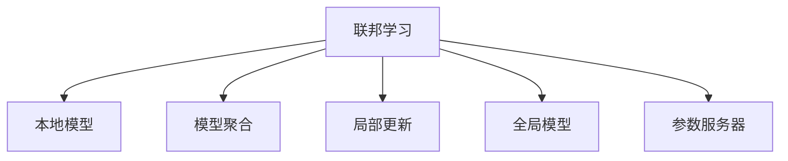

                 

## 1. 背景介绍

### 1.1 问题由来

随着人工智能技术的快速发展，数据隐私保护、数据分散化管理等挑战日益凸显。集中式训练的机器学习模型面临数据泄露、数据孤岛等风险，导致模型泛化能力受限，无法在多源数据上保持最优性能。而联邦学习（Federated Learning）作为一种分布式学习范式，通过本地计算、远程聚合的方式，有效保护了数据的隐私性和安全性，同时保留了数据的多样性和丰富性。

### 1.2 问题核心关键点

联邦学习通过在多个参与方的本地数据上训练模型，然后将模型参数或梯度进行聚合，更新全局模型。其核心思想在于保护数据隐私、提升模型泛化能力的同时，充分利用多源数据带来的优势。

联邦学习的关键点包括：
- **数据分布与隐私保护**：模型训练在各个本地设备上进行，数据本地化，避免数据泄露。
- **模型聚合方式**：通常采用加权平均、平均值、模型合并等方式，整合本地模型，更新全局模型。
- **通信开销控制**：由于模型参数或梯度的传输，通信开销是联邦学习的一大挑战，如何高效传输数据成为关键。
- **算法设计**：如何设计高效且安全的算法，使得模型能在多源数据上持续更新，提升模型性能。
- **收敛速度与稳定性**：联邦学习模型的收敛速度和稳定性问题，需要通过算法优化和硬件设施改进来解决。

联邦学习已经在多个领域，如移动设备学习、工业生产管理、物联网设备优化等，展现了巨大的应用潜力，成为解决数据隐私与分布式计算矛盾的重要技术手段。

### 1.3 问题研究意义

研究联邦学习对于提升人工智能技术的隐私保护和分布式协同能力具有重要意义：

1. **数据隐私保护**：联邦学习通过本地计算，减少了数据传输和集中存储，保护了数据隐私。
2. **提升泛化能力**：通过利用多源数据进行训练，联邦学习模型在复杂和多变的真实世界环境中更具泛化能力。
3. **强化协同效应**：联邦学习模型可以充分利用分布式计算资源，提升模型训练效率和效果。
4. **推动技术创新**：联邦学习推动了分布式机器学习、安全计算、区块链等前沿技术的发展。
5. **赋能产业升级**：联邦学习技术为多个垂直领域的数据协同与智能化转型提供了新路径，如智能制造、智慧城市、金融科技等。

## 2. 核心概念与联系

### 2.1 核心概念概述

为更好地理解联邦学习，本节将介绍几个密切相关的核心概念：

- **联邦学习（Federated Learning）**：一种分布式机器学习方法，通过本地设备的数据本地计算，远程聚合更新全局模型，达到在保护数据隐私的同时，提升模型泛化性能。
- **本地模型（Local Model）**：参与联邦学习的各个设备，如移动终端、传感器、服务器等，在本地数据上训练的模型。
- **模型聚合（Model Aggregation）**：通过某种方式，如加权平均、平均、模型合并等，将本地模型的参数或梯度进行聚合，更新全局模型。
- **局部更新（Local Update）**：在本地模型上，根据本地数据进行更新，通常涉及梯度下降等优化算法。
- **全局模型（Global Model）**：在所有参与方上训练得到的全局模型，可用于多源数据的泛化。
- **参数服务器（Parameter Server）**：作为中心服务器，用于接收和聚合本地模型的参数或梯度，更新全局模型。

这些核心概念之间的逻辑关系可以通过以下Mermaid流程图来展示：



这个流程图展示了联邦学习的关键流程：

1. 本地模型在本地设备上通过本地数据进行训练。
2. 参数服务器定期收集各个设备的本地模型参数或梯度。
3. 通过模型聚合算法更新全局模型。
4. 全局模型用于多源数据的泛化。

## 3. 核心算法原理 & 具体操作步骤
### 3.1 算法原理概述

联邦学习通过本地模型在本地数据上训练，并远程聚合更新全局模型，实现多源数据的联合训练。其核心算法流程包括以下几个步骤：

1. 初始化全局模型。
2. 本地模型在本地数据上训练，更新模型参数。
3. 本地模型参数或梯度被传输到参数服务器。
4. 参数服务器通过某种聚合方式，更新全局模型参数。
5. 全局模型参数被传输回各个本地设备，重复以上过程。

### 3.2 算法步骤详解

联邦学习的基本算法步骤如下：

1. **初始化全局模型**：将预训练模型或随机初始化模型作为全局模型。

2. **本地模型训练**：每个参与方在自己的数据上独立训练模型，更新模型参数。

3. **模型参数传输**：每个参与方将模型参数或梯度传输到参数服务器。

4. **模型聚合**：参数服务器根据接收到的模型参数或梯度，使用某种聚合方式，如加权平均、平均等，更新全局模型参数。

5. **全局模型更新**：将更新后的全局模型参数传输回各个本地设备，替换全局模型。

6. **重复执行**：重复以上步骤，直至模型收敛或达到预设的迭代次数。

### 3.3 算法优缺点

联邦学习具有以下优点：
- **数据隐私保护**：本地模型不向外部传输原始数据，保护了数据的隐私性。
- **模型泛化能力**：通过多源数据的联合训练，联邦学习模型在多样化的数据上具备更好的泛化能力。
- **高效资源利用**：充分利用分布式计算资源，提升模型训练效率。
- **容错性好**：多个参与方共同参与模型训练，单个设备的故障不会影响整个系统的运行。

同时，联邦学习也存在一些局限性：
- **通信开销大**：每次模型更新都需要在各个参与方和参数服务器之间传输数据，通信开销较大。
- **异构设备挑战**：不同设备间的计算能力和数据质量差异，可能导致模型性能不一致。
- **收敛速度慢**：由于每次模型更新都需要进行本地计算和远程聚合，联邦学习模型的收敛速度较慢。
- **算法设计复杂**：需要设计高效且安全的算法，以应对模型的数据异质性和通信延迟等问题。

### 3.4 算法应用领域

联邦学习已经在多个领域展现了其独特的应用优势：

- **移动设备学习**：在移动设备上，联邦学习可以保护用户隐私，同时提升设备间的协同学习能力。例如，联邦学习可以用于移动设备的语音识别、图像识别等任务。
- **工业生产管理**：在工业生产中，联邦学习可以优化生产线的运行效率，提高设备利用率，降低生产成本。例如，联邦学习可以用于生产线的预测性维护和故障诊断。
- **物联网设备优化**：在物联网设备上，联邦学习可以优化设备的运行状态，提高能效和设备寿命。例如，联邦学习可以用于智能家居设备的能源管理。
- **医疗健康**：在医疗领域，联邦学习可以保护患者的隐私，同时提升医疗数据的协同分析能力。例如，联邦学习可以用于多中心临床试验数据分析和疾病预测。
- **智慧城市**：在智慧城市中，联邦学习可以优化城市交通、能源管理等系统的运行，提升城市治理能力。例如，联邦学习可以用于交通流预测和能源需求分析。

## 4. 数学模型和公式 & 详细讲解 & 举例说明
### 4.1 数学模型构建

联邦学习的数学模型可以抽象为多源数据联合优化问题。假设每个参与方 $i$ 的数据集为 $D_i$，模型参数为 $\theta$，本地模型在本地数据 $D_i$ 上的损失函数为 $\ell_i(\theta)$，则联邦学习的目标为最小化全局损失函数：

$$
\min_{\theta} \sum_{i=1}^N \ell_i(\theta)
$$

其中 $N$ 为参与方的数量。在每次本地更新后，每个参与方将更新后的参数 $\theta_i$ 传输到参数服务器，参数服务器根据接收到的参数，通过某种聚合方式，更新全局模型参数 $\theta$。

### 4.2 公式推导过程

联邦学习中的模型聚合方式有多种，以下以加权平均为例进行推导：

假设每个参与方的本地模型参数为 $\theta_i$，参数服务器采用加权平均方式，则全局模型参数的更新公式为：

$$
\theta_{k+1} = \theta_k - \eta \sum_{i=1}^N w_i \nabla \ell_i(\theta_k)
$$

其中 $\eta$ 为学习率，$w_i$ 为参与方 $i$ 的权重，通常与本地数据量、质量等因素相关。通过公式可以看出，全局模型参数在每次更新后，将根据各个参与方的本地模型参数进行加权平均，更新全局模型。

### 4.3 案例分析与讲解

以移动设备上的联邦学习为例，假设参与方为 $N$ 个用户的手机设备，每个设备的数据集为 $D_i$，模型参数为 $\theta$，本地模型在本地数据上的损失函数为 $\ell_i(\theta)$。则联邦学习的目标为最小化全局损失函数：

$$
\min_{\theta} \sum_{i=1}^N \ell_i(\theta)
$$

在每次本地更新后，每个用户的手机设备将更新后的参数 $\theta_i$ 传输到参数服务器，参数服务器根据接收到的参数，采用加权平均方式，更新全局模型参数 $\theta$。假设每个用户的数据集大小和质量相同，则权重 $w_i$ 相等，全局模型参数的更新公式为：

$$
\theta_{k+1} = \theta_k - \eta \frac{1}{N} \sum_{i=1}^N \nabla \ell_i(\theta_k)
$$

通过该公式，可以不断更新全局模型参数，提升模型在多源数据上的泛化能力。

## 5. 项目实践：代码实例和详细解释说明
### 5.1 开发环境搭建

在进行联邦学习实践前，我们需要准备好开发环境。以下是使用Python进行FedML库开发的环境配置流程：

1. 安装Anaconda：从官网下载并安装Anaconda，用于创建独立的Python环境。

2. 创建并激活虚拟环境：
```bash
conda create -n fedml-env python=3.8 
conda activate fedml-env
```

3. 安装FedML库：
```bash
pip install fedml
```

4. 安装各类工具包：
```bash
pip install numpy pandas scikit-learn torch torchvision torchaudio
```

完成上述步骤后，即可在`fedml-env`环境中开始联邦学习实践。

### 5.2 源代码详细实现

下面我们以移动设备上的语音识别任务为例，给出使用FedML库进行联邦学习的PyTorch代码实现。

首先，定义联邦学习的数据处理函数：

```python
import os
import torch
from fedml.python.fedml import FederatedML
from torch.utils.data import DataLoader, TensorDataset
from sklearn.model_selection import train_test_split

class MyDataset:
    def __init__(self, path):
        self.data = []
        self.labels = []
        with open(path, 'r') as f:
            for line in f:
                data, label = line.strip().split(',')
                self.data.append(torch.tensor(eval(data)))
                self.labels.append(int(label))
        self.data = torch.stack(self.data)
        self.labels = torch.tensor(self.labels)

class MyDatasetSplit:
    def __init__(self, path):
        self.dataset = MyDataset(path)
        self.train_data, self.test_data, self.train_labels, self.test_labels = train_test_split(
            self.dataset.data, self.dataset.labels, test_size=0.2, random_state=42)

    def __len__(self):
        return len(self.dataset)

    def __getitem__(self, idx):
        return self.dataset.data[idx], self.dataset.labels[idx]

# 加载数据
train_path = 'train.txt'
test_path = 'test.txt'
train_dataset = MyDatasetSplit(train_path)
test_dataset = MyDatasetSplit(test_path)
```

然后，定义联邦学习的模型和优化器：

```python
from torch import nn
from torch.nn import functional as F

class MyModel(nn.Module):
    def __init__(self):
        super(MyModel, self).__init__()
        self.fc1 = nn.Linear(784, 128)
        self.fc2 = nn.Linear(128, 64)
        self.fc3 = nn.Linear(64, 10)

    def forward(self, x):
        x = F.relu(self.fc1(x))
        x = F.relu(self.fc2(x))
        x = self.fc3(x)
        return x

model = MyModel().to('cpu')

optimizer = torch.optim.Adam(model.parameters(), lr=0.001)

# 定义本地更新函数
def local_update(i, client):
    client = client.load_data(train_dataset)
    client.fit(model, optimizer, num_epochs=5)
    return client.model

# 定义联邦聚合函数
def federated_aggregation(models):
    # 计算全局模型参数
    global_model = torch.mean(torch.stack([m.fc3.weight for m in models]), dim=0)
    # 更新全局模型参数
    for m in models:
        m.fc3.weight = global_model
    return models
```

接着，定义联邦学习的全局模型训练函数：

```python
from fedml.python.fedml import FedML
from sklearn.metrics import accuracy_score

def global_train(rounds, model, optimizer, federated_aggregation, local_update):
    federated_learning = FedML(model, optimizer, federated_aggregation, local_update)
    for round in range(rounds):
        # 进行本地更新
        models = federated_learning.local_trainer(train_dataset, local_update)
        # 进行联邦聚合
        models = federated_aggregation(models)
        # 在测试集上评估模型性能
        test_dataset = MyDatasetSplit(test_path)
        test_model = federated_learning.eval_model(test_dataset)
        loss = F.cross_entropy(test_model, test_dataset.test_labels)
        accuracy = accuracy_score(test_dataset.test_labels, test_model.argmax(dim=1))
        print(f'Round {round+1}, loss: {loss:.4f}, accuracy: {accuracy:.4f}')
    return federated_learning.model

# 进行联邦学习训练
global_model = global_train(10, model, optimizer, federated_aggregation, local_update)
```

以上就是使用PyTorch和FedML库进行联邦学习语音识别任务的全过程。可以看到，联邦学习通过在多个设备上分布式训练模型，并远程聚合更新全局模型，实现了多源数据上的联合训练。

### 5.3 代码解读与分析

让我们再详细解读一下关键代码的实现细节：

**MyDataset类**：
- `__init__`方法：初始化数据集和标签，从文件中读取数据。
- `__len__`方法：返回数据集的长度。
- `__getitem__`方法：根据索引返回单个样本。

**MyDatasetSplit类**：
- `__init__`方法：初始化数据集和标签，将数据集分为训练集和测试集。
- `__len__`方法：返回数据集的长度。
- `__getitem__`方法：根据索引返回单个样本。

**local_update函数**：
- 加载本地数据集，进行本地模型训练，返回更新后的本地模型。

**federated_aggregation函数**：
- 计算全局模型参数，更新全局模型参数。

**global_train函数**：
- 初始化联邦学习环境，进行多轮训练，并在测试集上评估模型性能。

可以看到，联邦学习的代码实现较为简洁，核心在于本地训练、联邦聚合和全局更新。但实际应用中，还需要考虑更多因素，如本地数据质量、通信效率、安全性等。

## 6. 实际应用场景
### 6.1 智能医疗

联邦学习在智能医疗领域具有重要应用价值。医疗机构通过本地化存储患者数据，保护患者隐私，同时联合各医疗机构的数据，提升疾病的诊断和治疗能力。

例如，多个医疗机构可以通过联邦学习，联合训练模型进行疾病预测和诊断。联邦学习可以避免单个医院数据不足的问题，提升模型在复杂和罕见疾病上的诊断能力。此外，联邦学习还能用于个性化治疗方案的优化，提升患者治疗效果。

### 6.2 工业生产管理

联邦学习可以用于工业生产管理的优化，提升生产效率和设备利用率。

例如，多个工厂可以通过联邦学习，联合训练模型进行生产线的预测性维护和故障诊断。联邦学习可以避免单个工厂数据不足的问题，提升模型在复杂和多样化的设备故障模式上的预测能力。此外，联邦学习还能用于生产线的能效管理，提升能源利用率。

### 6.3 智慧城市

联邦学习可以用于智慧城市的优化，提升城市治理和管理能力。

例如，多个城市可以通过联邦学习，联合训练模型进行交通流预测和能源需求分析。联邦学习可以避免单个城市数据不足的问题，提升模型在复杂和多样化的城市环境下的预测能力。此外，联邦学习还能用于智慧交通管理和智能电网优化，提升城市运行效率和能源管理水平。

## 7. 工具和资源推荐
### 7.1 学习资源推荐

为了帮助开发者系统掌握联邦学习的理论基础和实践技巧，这里推荐一些优质的学习资源：

1. 《Federated Learning: Concepts and Applications》系列博文：由联邦学习专家撰写，深入浅出地介绍了联邦学习的原理、应用和前沿进展。

2. 《Federated Learning: System Design and Algorithms》书籍：Federated AI创始人Caleb Chen著作，全面介绍了联邦学习的系统设计和算法优化。

3. 《Machine Learning: A Probabilistic Perspective》书籍：本书是机器学习的经典教材，包含了联邦学习的理论基础和应用实例。

4. Federated Learning GitHub开源项目：包含联邦学习相关的算法和代码实现，是联邦学习研究和实践的重要参考。

5. AI-Reddit论坛上的联邦学习讨论：Reddit社区上有大量关于联邦学习的讨论，可以帮助开发者学习社区经验，解决实际问题。

通过对这些资源的学习实践，相信你一定能够快速掌握联邦学习的精髓，并用于解决实际的机器学习问题。
### 7.2 开发工具推荐

高效的联邦学习开发离不开优秀的工具支持。以下是几款用于联邦学习开发的常用工具：

1. FedML库：Google开发的联邦学习框架，提供了丰富的联邦学习算法和接口。

2. TensorFlow Federated（TFF）：Google开发的联邦学习框架，支持多种分布式计算方式和优化算法。

3. PySyft：OpenMined开发的联邦学习框架，支持多种数据和模型安全技术。

4. Parameter Server：作为联邦学习的核心组件，Parameter Server提供了分布式存储和计算功能，支持多种模型聚合方式。

5. gRPC和gRPC-Web：用于联邦学习中的通信协议，支持高效的异步通信和数据传输。

6. Apache Kafka和Apache Zookeeper：用于联邦学习中的分布式协调和数据传输，支持多节点协同工作。

合理利用这些工具，可以显著提升联邦学习的开发效率，加快创新迭代的步伐。

### 7.3 相关论文推荐

联邦学习作为机器学习的前沿研究方向，得到了学界的持续关注。以下是几篇奠基性的相关论文，推荐阅读：

1. Google的《Communication-Efficient Learning of Deep Networks from Decentralized Data》：提出了联邦学习的基本框架，展示了联邦学习在Google语音识别任务上的应用效果。

2. 斯坦福大学的《Federated Learning with Security and Privacy-Efficient Training of Deep Models》：介绍了联邦学习的安全性和隐私保护措施，展示了联邦学习在医疗数据联合分析上的应用效果。

3. Microsoft的《Federated Learning: Concepts and Applications》：综述了联邦学习的概念、技术和应用场景，展示了联邦学习在工业生产优化上的应用效果。

4. OpenMined的《Federated Learning in Practice》：介绍了联邦学习的实践经验和挑战，展示了联邦学习在智慧城市优化上的应用效果。

这些论文代表了大规模分布式学习领域的发展脉络。通过学习这些前沿成果，可以帮助研究者把握学科前进方向，激发更多的创新灵感。

## 8. 总结：未来发展趋势与挑战
### 8.1 总结

本文对联邦学习进行全面系统的介绍。首先阐述了联邦学习的基本概念和研究背景，明确了其在数据隐私保护和分布式计算中的重要价值。其次，从原理到实践，详细讲解了联邦学习的数学模型和算法流程，给出了联邦学习任务开发的完整代码实例。同时，本文还广泛探讨了联邦学习在智能医疗、工业生产、智慧城市等领域的实际应用，展示了联邦学习范式的广泛应用前景。最后，本文精选了联邦学习的各类学习资源，力求为读者提供全方位的技术指引。

通过本文的系统梳理，可以看到，联邦学习通过在本地设备上独立训练模型，并在分布式环境中进行模型聚合，保护了数据隐私，提升了模型泛化能力，成为解决数据分布与隐私保护矛盾的重要技术手段。未来，伴随联邦学习模型的进一步演进，其在数据驱动的智能化应用中必将发挥更大的作用。

### 8.2 未来发展趋势

展望未来，联邦学习将呈现以下几个发展趋势：

1. **联邦学习的标准化**：随着联邦学习技术的发展，标准化的联邦学习框架和工具将出现，使得联邦学习更加便捷和高效。

2. **联邦学习与区块链技术结合**：区块链技术可以提供透明、可追溯的通信和数据存储方式，增强联邦学习的安全和可靠性。

3. **联邦学习的分布式优化**：分布式优化算法和分布式计算平台将进一步优化联邦学习模型的训练效率和性能。

4. **联邦学习的隐私保护**：联邦学习将继续研究如何更好地保护数据隐私和模型安全，防止数据泄露和模型篡改。

5. **联邦学习的跨领域应用**：联邦学习将进一步拓展到多源数据联合分析的各个领域，如医疗、金融、智能制造等。

6. **联邦学习的混合学习范式**：联邦学习和中心化学习、分布式训练等技术的混合应用，将提升模型性能和数据利用效率。

以上趋势凸显了联邦学习技术的广阔前景。这些方向的探索发展，必将进一步提升联邦学习模型的性能和应用范围，为数据驱动的智能化应用提供新的技术路径。

### 8.3 面临的挑战

尽管联邦学习已经取得了瞩目成就，但在迈向更加智能化、普适化应用的过程中，它仍面临诸多挑战：

1. **通信开销大**：联邦学习模型的通信开销较大，如何高效传输数据，减少通信延迟，是一个重要研究方向。

2. **异构设备挑战**：不同设备间的计算能力和数据质量差异，可能导致模型性能不一致，如何统一设备计算能力和数据格式，是联邦学习的关键挑战。

3. **模型更新复杂**：联邦学习模型的更新涉及多源数据的联合训练，模型更新复杂，如何设计高效且安全的算法，是联邦学习的核心问题。

4. **数据隐私保护**：如何在保证数据隐私的前提下，实现高效的联邦学习训练，是一个亟待解决的难题。

5. **安全性和可靠性**：联邦学习模型面临模型篡改、数据泄露等安全威胁，如何提高系统的安全性和可靠性，是一个重要的研究方向。

6. **算法优化**：联邦学习模型需要处理多源数据，算法优化是一个复杂的任务，如何设计高效且稳定的算法，是联邦学习的关键研究内容。

这些挑战是联邦学习技术不断发展的动力，也是研究人员不断探索的方向。只有通过不断的技术创新和优化，联邦学习才能更好地应对实际应用中的各种挑战，实现更广泛的应用。

### 8.4 研究展望

面对联邦学习面临的挑战，未来的研究需要在以下几个方面寻求新的突破：

1. **优化联邦学习算法**：设计高效且安全的联邦学习算法，提升模型训练效率和效果。

2. **改进联邦学习通信协议**：开发高效的通信协议，减少数据传输延迟，提高联邦学习模型的性能。

3. **引入分布式优化技术**：引入分布式优化技术，提升联邦学习模型的训练效率和稳定性。

4. **提升联邦学习数据处理能力**：改进数据处理技术，提高联邦学习模型的数据利用效率和泛化能力。

5. **研究联邦学习安全性**：研究联邦学习模型的安全性问题，设计安全的联邦学习框架和工具。

6. **探索联邦学习的混合学习范式**：探索联邦学习与中心化学习、分布式训练等技术的混合应用，提升联邦学习模型的性能和应用范围。

这些研究方向的探索，必将引领联邦学习技术迈向更高的台阶，为数据驱动的智能化应用提供新的技术路径。面向未来，联邦学习技术还需要与其他人工智能技术进行更深入的融合，如知识表示、因果推理、强化学习等，多路径协同发力，共同推动人工智能技术的发展。

## 9. 附录：常见问题与解答

**Q1：联邦学习与中心化学习有何区别？**

A: 联邦学习与中心化学习的主要区别在于模型训练的数据存储和计算方式。中心化学习将数据集中存储在单一服务器上，通过集中式计算更新全局模型。而联邦学习在本地设备上独立训练模型，并远程聚合更新全局模型，保护了数据的隐私性。

**Q2：联邦学习中如何选择本地更新策略？**

A: 本地更新策略包括梯度下降、动量优化、自适应学习率等，需要根据具体任务和数据特点进行灵活选择。通常建议采用自适应学习率，如AdamW等，动态调整学习率，提升模型性能。

**Q3：联邦学习中如何选择模型聚合方式？**

A: 模型聚合方式包括加权平均、平均、模型合并等，需要根据具体任务和数据特点进行灵活选择。通常建议采用加权平均，根据数据质量、设备能力等因素，动态调整各设备的权重。

**Q4：联邦学习中如何进行数据划分？**

A: 数据划分包括训练集、验证集和测试集。通常采用K-fold交叉验证的方式，将数据集分为多份，每份数据集轮流作为验证集，提升模型泛化能力。

**Q5：联邦学习中如何进行模型评估？**

A: 联邦学习模型在本地设备上训练，在测试集上评估模型性能。通常采用交叉验证的方式，评估模型在不同数据集上的性能表现。

这些问答旨在帮助读者更好地理解联邦学习的基本概念和实践技巧，进一步提高其对联邦学习的认识和应用能力。

