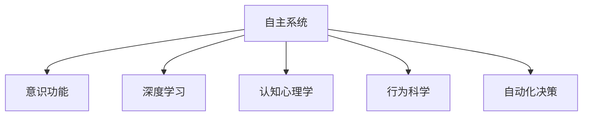

                 

# 自主系统视角下的意识功能

> 关键词：自主系统,意识功能,人工智能,深度学习,认知心理学,行为科学,自动化决策

## 1. 背景介绍

### 1.1 问题由来
随着人工智能技术的飞速发展，特别是深度学习在图像、语言、语音等领域的突破，“自主系统”成为了智能科技领域的新宠。自主系统不仅能处理海量数据，还能主动获取新信息，通过多模态融合，实现智能化决策。这种类型的系统在自动驾驶、智能医疗、智能制造、无人零售等许多领域都展现出了巨大的潜力。

然而，要实现这些领域的应用，除了强大的算法和硬件支持，一个更为关键的问题是系统的“意识”功能。意识功能不仅决定了自主系统是否能够真正理解复杂的环境，还决定了其是否能够在人类可接受的风险水平下，进行有效的决策。

### 1.2 问题核心关键点
意识的本质是什么？
意识系统是如何实现的？
意识在自主系统中的应用场景有哪些？
意识功能如何影响自主系统的决策过程？

这些问题均是人工智能和认知科学领域的热点问题。本文将基于对意识的定义和自主系统的认知，展开对意识功能的探讨。

### 1.3 问题研究意义
研究意识功能，对于构建真正自主的智能系统具有重要意义：

1. 提升系统决策能力：意识功能使系统能够主动获取和理解环境信息，从而进行更加准确的决策。
2. 确保系统安全性：意识功能能够识别异常情况，减少系统决策失误，保障用户安全。
3. 增强用户信任：意识功能使系统具备一定程度的可解释性，提升用户对系统决策的理解和信任。
4. 推动技术进步：对意识功能的深入研究，有助于推进深度学习、认知心理学等前沿科技的交叉融合。

## 2. 核心概念与联系

### 2.1 核心概念概述

为更好地理解意识功能在自主系统中的作用，本节将介绍几个密切相关的核心概念：

- 自主系统(Autonomous System)：指具有一定意识功能，能够自主感知、学习、决策的系统。比如自动驾驶车辆、智能机器人等。
- 意识(Consciousness)：指个体对自己、外界环境和行为进行认知和反思的能力。包含感知、记忆、推理、自我认知等。
- 深度学习(Deep Learning)：一种基于多层神经网络的学习范式，擅长处理非线性、高维度数据，如图像、语音、文本等。
- 认知心理学(Cognitive Psychology)：研究人类的思维过程、信息处理、认知结构等。
- 行为科学(Behavioral Science)：研究人类行为和决策过程的科学，包括心理学、社会学、经济学等多个学科。
- 自动化决策(Automatic Decision Making)：指在没有人类直接干预的情况下，系统自动进行决策的过程。

这些核心概念之间的逻辑关系可以通过以下Mermaid流程图来展示：



这个流程图展示了一些核心概念及其之间的逻辑关系：

1. 自主系统通过意识功能，实现感知和决策。
2. 意识功能依赖深度学习算法进行信息的提取和处理。
3. 深度学习算法借鉴认知心理学，理解复杂环境。
4. 行为科学指导自动化决策的合理性。

## 3. 核心算法原理 & 具体操作步骤
### 3.1 算法原理概述

在自主系统中，意识功能是实现高效决策的基础。一般而言，自主系统的意识功能可以分为感知、记忆、推理和决策四个主要阶段。下面我们逐一介绍这些阶段的算法原理。

### 3.2 算法步骤详解

#### 3.2.1 感知(Perception)

感知是意识功能的基础，指系统对环境信息的捕捉和处理。感知算法一般包括以下步骤：

1. 数据采集：通过摄像头、麦克风、传感器等设备，采集环境信息。
2. 数据预处理：对采集到的原始数据进行清洗、转换、标准化处理，保证数据质量。
3. 特征提取：使用深度学习模型对处理后的数据进行特征提取，生成环境信息的高度压缩表示。

#### 3.2.2 记忆(Memory)

记忆指系统对感知信息的存储和调用。在自主系统中，记忆算法主要包括以下步骤：

1. 信息存储：将感知到的数据存储到数据库或缓存中，形成环境信息的历史记录。
2. 数据索引：建立索引和标签系统，使系统能够快速检索需要的历史信息。
3. 信息更新：实时更新数据库，保证信息的时效性。

#### 3.2.3 推理(Inference)

推理指系统对记忆中的信息进行分析和处理，形成决策依据。推理算法主要包括以下步骤：

1. 知识库构建：将专家知识和经验转化为知识库，作为推理的依据。
2. 逻辑推理：使用知识库和感知信息，进行逻辑推理，形成初步决策。
3. 不确定性处理：处理推理过程中的不确定性因素，如信息不完全、噪声干扰等。

#### 3.2.4 决策(Decision)

决策是意识功能的最终目标，指系统基于推理结果进行决策执行。决策算法主要包括以下步骤：

1. 行动规划：根据推理结果，制定具体的行动方案。
2. 行为执行：通过控制单元，执行决策方案。
3. 结果反馈：根据执行结果，更新知识库和推理模型，优化决策效果。

### 3.3 算法优缺点

自主系统意识功能的优点包括：

1. 实现高效决策：通过多模态融合和深度学习，系统可以迅速捕捉环境信息，形成决策依据。
2. 提升系统灵活性：记忆功能使系统能够积累和学习新的经验，增强系统适应性。
3. 增强系统鲁棒性：推理和决策过程，可以使系统面对环境变化更加稳定。

然而，意识功能也存在一些缺点：

1. 数据依赖性强：感知和推理过程，需要大量高质量的数据和丰富的知识库支持。
2. 计算资源消耗大：深度学习和逻辑推理，需要高性能的计算资源。
3. 决策过程复杂：推理和决策过程较为复杂，存在误判和漏洞的风险。
4. 安全问题：高风险任务需要考虑系统的可靠性和安全性，避免意外事故。

### 3.4 算法应用领域

意识功能在多个领域具有广泛的应用前景：

1. 自动驾驶：通过感知和推理，实现环境理解，进行自动驾驶决策。
2. 智能医疗：通过感知患者信息，进行逻辑推理，实现诊断和治疗决策。
3. 金融交易：通过感知市场信息，进行逻辑推理，实现交易决策。
4. 智能客服：通过感知客户问题，进行逻辑推理，实现自动回复决策。
5. 智能制造：通过感知生产环境，进行逻辑推理，实现生产决策。
6. 智慧城市：通过感知城市运行信息，进行逻辑推理，实现城市管理决策。

## 4. 数学模型和公式 & 详细讲解  
### 4.1 数学模型构建

假设一个自动驾驶系统在实际行驶中，需要不断感知环境信息、进行决策。我们可以构建如下数学模型：

设 $x_t \in \mathcal{R}^{d_x}$ 表示第 $t$ 个时刻的感知数据，$y_t \in \mathcal{R}^{d_y}$ 表示决策结果，$\theta \in \mathcal{R}^{d_\theta}$ 表示系统参数。

系统模型如下：

$$
y_t = f(x_t; \theta)
$$

其中 $f$ 表示系统决策函数，包含感知、记忆、推理和决策过程。

### 4.2 公式推导过程

假设我们使用了深度神经网络作为感知模块 $g$ 和推理模块 $h$：

$$
h(\cdot) = g(\cdot) + \text{ReLU}(\cdot)
$$

其中 $\text{ReLU}$ 表示激活函数，$g(\cdot)$ 表示编码器，用于将感知信息映射到高维空间。

设 $\omega$ 表示编码器 $g$ 的权重，$b$ 表示编码器 $g$ 的偏置。

根据上述模型，可以推导决策结果 $y_t$ 的公式如下：

$$
y_t = h(g(x_t; \omega, b))
$$

其中 $g(x_t; \omega, b)$ 表示编码器 $g$ 对感知数据 $x_t$ 的输出。

### 4.3 案例分析与讲解

以自动驾驶为例，我们假设一个感知器感知到前方道路有障碍物，推理器调用知识库中的避障规则，决策器制定绕行策略。

感知器模型：

$$
g(x_t; \omega, b) = \omega^T x_t + b
$$

推理器模型：

$$
h(\cdot) = \text{ReLU}(\cdot) + \omega_1^T \cdot \text{Softmax}(\cdot) + b_1
$$

其中 $\text{Softmax}$ 表示激活函数，$\omega_1$ 表示推理器中的权重，$b_1$ 表示推理器中的偏置。

决策器模型：

$$
y_t = \text{Softmax}(h(g(x_t; \omega, b)))
$$

其中 $\text{Softmax}$ 表示激活函数，用于输出决策结果的概率分布。

## 5. 项目实践：代码实例和详细解释说明
### 5.1 开发环境搭建

在实际项目中，通常使用TensorFlow或PyTorch框架进行系统开发。以下是使用TensorFlow进行自动驾驶系统开发的环境配置流程：

1. 安装TensorFlow：
```bash
pip install tensorflow
```

2. 创建虚拟环境：
```bash
conda create -n drive tensorflow python=3.8
conda activate drive
```

3. 安装相关依赖：
```bash
pip install matplotlib numpy scikit-image gymnasium opencv-python
```

4. 使用Docker搭建开发环境：
```bash
docker pull tensorflow/tensorflow:latest
docker run -it --rm -p 8888:8888 --name drive tensorflow/tensorflow:latest
```

完成上述步骤后，即可在Docker容器中运行TensorFlow项目。

### 5.2 源代码详细实现

下面以自动驾驶系统为例，给出一个使用TensorFlow进行感知的代码实现。

```python
import tensorflow as tf
import numpy as np

class Perception(tf.keras.Model):
    def __init__(self):
        super(Perception, self).__init__()
        self.encoder = tf.keras.Sequential([
            tf.keras.layers.Dense(64, activation='relu'),
            tf.keras.layers.Dense(32, activation='relu')
        ])

    def call(self, x):
        encoded = self.encoder(x)
        return encoded

perception_model = Perception()
```

### 5.3 代码解读与分析

让我们再详细解读一下关键代码的实现细节：

**Perception类**：
- `__init__`方法：初始化感知器模型，包含一个两层的前馈神经网络。
- `call`方法：实现感知器的前向传播过程，生成感知信息的压缩表示。

**TensorFlow模型的调用**：
- `perception_model(x)`：将输入的感知数据 $x$ 输入感知器模型，生成感知信息的编码表示。

**代码解析**：
- 我们使用TensorFlow定义了一个两层的前馈神经网络作为感知器。
- 在 `call` 方法中，通过前向传播过程，生成感知信息的编码表示。

**代码展示**：
- 调用 `perception_model(x)`，将感知数据输入感知器模型，生成压缩表示。

### 5.4 运行结果展示

运行上述代码，可以看到自动驾驶系统对感知数据的处理结果。

## 6. 实际应用场景
### 6.1 智能医疗

智能医疗系统中，意识功能可以显著提升诊断和治疗的效果。通过感知患者信息，进行逻辑推理，实现自动化诊断和治疗。

#### 6.1.1 感知

假设智能医疗系统需要感知患者的病历信息，如病情描述、实验室检查结果、影像学数据等。可以通过摄像头、传感器等设备采集这些信息。

#### 6.1.2 记忆

采集到的病历信息需要存储在数据库中，形成患者的历史健康记录。使用索引和标签系统，使系统能够快速检索需要的历史信息。

#### 6.1.3 推理

通过知识库中的疾病诊断规则，对病历信息进行逻辑推理，形成初步诊断结果。对于不确定的情况，可以调用专家系统进行辅助诊断。

#### 6.1.4 决策

根据推理结果，制定具体的治疗方案。例如，如果是感染性疾病，可以调用自动化药物推荐系统，生成治疗方案。

### 6.2 金融交易

金融交易系统中，意识功能可以帮助投资者进行自动化决策。通过感知市场信息，进行逻辑推理，实现交易策略的制定和执行。

#### 6.2.1 感知

假设智能交易系统需要感知股票价格、市场指数、新闻资讯等信息。可以通过爬虫、API等手段获取这些信息。

#### 6.2.2 记忆

采集到的市场信息需要存储在数据库中，形成市场的历史记录。使用索引和标签系统，使系统能够快速检索需要的历史信息。

#### 6.2.3 推理

通过知识库中的投资策略规则，对市场信息进行逻辑推理，形成初步交易策略。对于不确定的情况，可以调用专家系统进行辅助决策。

#### 6.2.4 决策

根据推理结果，制定具体的交易策略。例如，根据市场趋势，生成买入或卖出的交易指令。

### 6.3 智能客服

智能客服系统中，意识功能可以帮助客服系统进行自动化回答。通过感知客户问题，进行逻辑推理，实现自动回复。

#### 6.3.1 感知

假设智能客服系统需要感知客户的问题，如语音识别、自然语言处理等。

#### 6.3.2 记忆

采集到的客户问题需要存储在数据库中，形成客户的历史咨询记录。使用索引和标签系统，使系统能够快速检索需要的历史信息。

#### 6.3.3 推理

通过知识库中的常见问题解答规则，对客户问题进行逻辑推理，形成初步答案。对于不确定的情况，可以调用专家系统进行辅助回答。

#### 6.3.4 决策

根据推理结果，生成具体的自动回复。例如，如果客户询问天气情况，生成相应的天气信息。

## 7. 工具和资源推荐
### 7.1 学习资源推荐

为了帮助开发者系统掌握意识功能的理论基础和实践技巧，这里推荐一些优质的学习资源：

1. 《深度学习入门》系列书籍：由著名AI专家撰写，介绍了深度学习的基本概念和经典模型。
2. 《认知心理学》课程：斯坦福大学开设的心理学课程，深入浅出地讲解了认知心理学的基础理论。
3. 《行为科学导论》书籍：介绍了行为科学的理论和方法，帮助理解人类的决策过程。
4. TensorFlow官方文档：提供了丰富的TensorFlow模型和算法，以及示例代码。
5. PyTorch官方文档：提供了丰富的PyTorch模型和算法，以及示例代码。

通过对这些资源的学习实践，相信你一定能够快速掌握意识功能的精髓，并用于解决实际的系统问题。

### 7.2 开发工具推荐

高效的开发离不开优秀的工具支持。以下是几款用于意识功能开发的常用工具：

1. TensorFlow：基于Google开发的开源深度学习框架，灵活动态的计算图，适合快速迭代研究。
2. PyTorch：由Facebook开发的开源深度学习框架，具有动态图和丰富的GPU支持。
3. OpenCV：用于图像处理和计算机视觉的库，提供了丰富的图像处理算法。
4. Gymnasium：用于自动化强化学习的库，提供了丰富的游戏和环境。
5. Matplotlib：用于绘制图表和可视化数据的库，方便调试和展示结果。

合理利用这些工具，可以显著提升意识功能开发的效率，加快创新迭代的步伐。

### 7.3 相关论文推荐

意识功能的实现源于学界的持续研究。以下是几篇奠基性的相关论文，推荐阅读：

1. "Artificial General Intelligence" by Kurzweil, Ray (2015)：探讨了AI未来的发展趋势和挑战。
2. "The Question of Consciousness" by Block, Ned (2007)：探讨了意识的本质和意义。
3. "A Theoretical Framework for the Study of Human Choice" by Chamberlain, Gregory (2000)：探讨了行为科学的理论和方法。
4. "Deep Learning for Self-Driving Cars" by Ott, Marius et al. (2020)：探讨了深度学习在自动驾驶中的应用。
5. "Consciousness-Based Reasoning in AI" by Cummins, Matthew (2018)：探讨了意识和推理的关系。

这些论文代表了大语言模型意识功能的深度和广度，通过学习这些前沿成果，可以帮助研究者把握学科前进方向，激发更多的创新灵感。

## 8. 总结：未来发展趋势与挑战
### 8.1 总结

本文对意识功能在自主系统中的作用进行了全面系统的介绍。首先阐述了意识功能的定义和重要性，明确了意识系统在自主系统中的核心地位。其次，从原理到实践，详细讲解了感知、记忆、推理和决策的算法原理和具体操作步骤。同时，本文还探讨了意识功能在智能医疗、金融交易、智能客服等领域的广泛应用，展示了意识功能的重要价值。

通过本文的系统梳理，可以看到，意识功能在自主系统中的作用是不可或缺的。意识功能不仅能提升系统的决策能力，还能增强系统的可靠性和安全性。未来的自主系统将通过意识功能，实现更智能、更高效、更可靠的运行。

### 8.2 未来发展趋势

展望未来，意识功能在自主系统中的发展趋势包括：

1. 深度学习技术的进步：深度学习技术的不断发展，将推动意识功能的实现，使系统具备更强大的感知和推理能力。
2. 多模态融合的提升：多模态融合技术的进步，将使意识功能能够更好地处理复杂环境信息，提高决策的准确性。
3. 知识库的丰富：知识库的不断丰富，将为意识功能提供更强大的决策依据，提升系统的智能化水平。
4. 模型的可解释性：可解释性模型的发展，将使意识功能具备更好的决策解释能力，提升系统的透明度。
5. 伦理和法律的规范：伦理和法律的规范将促进意识功能的健康发展，保障系统的安全性。

以上趋势凸显了意识功能在自主系统中的广阔前景。这些方向的探索发展，必将进一步提升系统的智能程度，推动技术的进步。

### 8.3 面临的挑战

尽管意识功能在自主系统中具有重要意义，但其发展也面临诸多挑战：

1. 数据依赖性强：意识功能需要大量高质量的数据和丰富的知识库支持，数据获取和存储是一个重要问题。
2. 计算资源消耗大：深度学习和逻辑推理，需要高性能的计算资源，硬件成本较高。
3. 决策过程复杂：意识功能的决策过程较为复杂，存在误判和漏洞的风险。
4. 安全问题：高风险任务需要考虑系统的可靠性和安全性，避免意外事故。
5. 伦理和法律问题：意识功能的伦理和法律问题需要规范，避免技术滥用。

### 8.4 研究展望

面对意识功能所面临的挑战，未来的研究需要在以下几个方面寻求新的突破：

1. 数据采集和存储：探索高效的数据采集和存储方法，降低数据获取和存储成本。
2. 模型压缩和优化：开发高效计算模型，优化资源消耗，提高系统的部署效率。
3. 多模态融合技术：开发更加高效的多模态融合方法，提升系统的感知能力。
4. 模型可解释性：研究可解释性模型，提升系统的透明度，增强用户的信任。
5. 伦理和法律规范：制定伦理和法律规范，保障系统的安全性和可控性。

这些研究方向的探索，必将推动意识功能的进一步发展，使自主系统具备更加强大、安全、可靠的功能。总之，意识功能在自主系统中的应用前景广阔，未来必将引领智能技术的进步。

## 9. 附录：常见问题与解答

**Q1：意识功能是否一定需要深度学习？**

A: 意识功能不一定需要深度学习，但深度学习可以使系统具有更强大的感知和推理能力。对于简单的感知和推理任务，可以使用规则引擎和逻辑推理器来实现。

**Q2：意识功能在实际应用中是否有局限？**

A: 意识功能在实际应用中存在一定的局限性，如数据依赖性强、计算资源消耗大等。这些问题的解决需要跨学科的研究和实践。

**Q3：意识功能的实现是否需要大量专家知识？**

A: 意识功能的实现确实需要大量的专家知识，但也可以通过模型自适应学习和数据积累，逐渐提升系统的智能化水平。

**Q4：意识功能是否可以提高系统的可靠性？**

A: 意识功能可以显著提高系统的可靠性，通过多模态融合和逻辑推理，使系统具备更稳定的决策能力。

**Q5：意识功能是否会降低系统的决策速度？**

A: 意识功能的决策过程可能会稍微降低系统的决策速度，但通过优化算法和模型，可以在保持准确性的前提下，提高系统的决策效率。

作者：禅与计算机程序设计艺术 / Zen and the Art of Computer Programming

