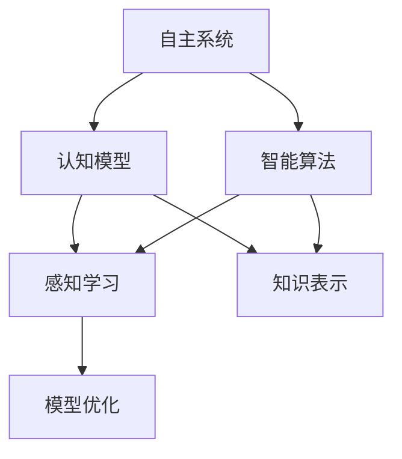
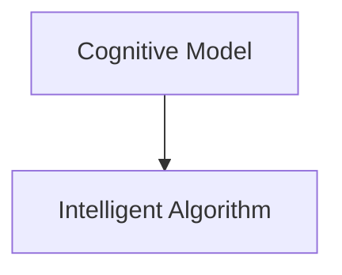
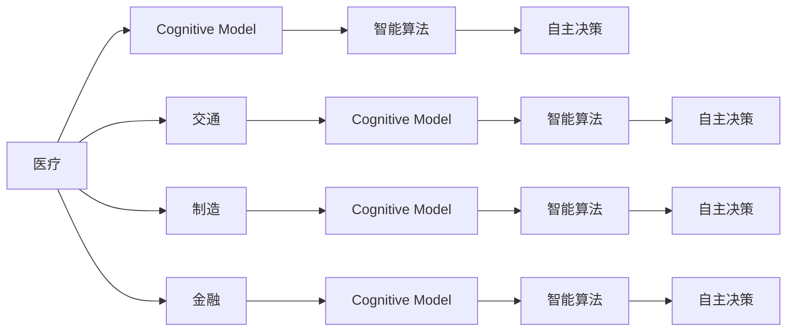

                 

# 自主系统视角下的意识研究

> 关键词：自主系统，意识研究，认知模型，智能算法，人机交互

## 1. 背景介绍

### 1.1 问题由来

随着人工智能技术的迅猛发展，如何构建具有自主性的系统成为了计算机科学领域的前沿研究课题。自主系统（Autonomous Systems），指的是能够自主决策、执行、学习的智能系统，它们能在无需人类直接干预的情况下，完成复杂的任务。实现自主系统的关键之一，在于对意识的理解与模拟。意识，作为智能体的内在认知状态，对于自主系统的决策、学习和适应具有重要影响。因此，从自主系统的视角研究意识，具有深刻的理论和实践意义。

### 1.2 问题核心关键点

目前，对于意识的理解主要集中在哲学、神经科学和心理学等学科，而计算机科学界则更多关注如何通过算法和模型来模拟意识过程。从自主系统的角度，意识的模拟主要包含以下几个关键点：

- **认知模型（Cognitive Model）**：用于模拟智能体的认知过程，包括感知、记忆、推理、学习等基本功能。
- **智能算法（Intelligent Algorithm）**：实现认知模型的算法，如决策树、神经网络、强化学习等。
- **人机交互（Human-Computer Interaction, HCI）**：理解并模拟人类与智能系统之间的交互过程，增强系统的人机友好性。

这些关键点共同构成了自主系统视域下的意识研究框架，旨在通过算法和模型，构建能够自主决策、学习的智能系统，以实现高效、可靠的自主功能。

## 2. 核心概念与联系

### 2.1 核心概念概述

为更好地理解自主系统视角下的意识研究，本节将介绍几个密切相关的核心概念：

- **自主系统（Autonomous Systems）**：能够自主决策、执行、学习的智能系统。
- **认知模型（Cognitive Model）**：模拟智能体认知过程的数学或计算模型，涵盖感知、记忆、推理、学习等功能。
- **智能算法（Intelligent Algorithm）**：实现认知模型的算法，如神经网络、决策树、强化学习等。
- **人机交互（HCI）**：理解并模拟人类与智能系统之间的交互过程，提高系统的人机友好性。
- **感知学习（Perceptual Learning）**：通过环境感知学习模型参数的过程，如视觉、听觉、触觉等输入的建模与优化。
- **知识表示（Knowledge Representation）**：将知识信息形式化存储，便于机器理解和应用。
- **模型优化（Model Optimization）**：通过训练和调整模型参数，提高模型性能和泛化能力。

这些概念之间的逻辑关系可以通过以下Mermaid流程图来展示：



这个流程图展示了几者之间的关联：

1. 自主系统通过认知模型和智能算法模拟智能体的认知过程。
2. 认知模型涉及感知学习和知识表示，以构建准确的模型。
3. 智能算法和模型优化用于实现和优化认知模型，以提升自主系统的性能。

这些概念共同构成了自主系统视域下意识研究的基础，推动了自主系统的不断发展和完善。

## 3. 核心算法原理 & 具体操作步骤

### 3.1 算法原理概述

从自主系统的视角，意识的模拟主要涉及以下两个核心算法：

- **认知模型算法**：用于模拟智能体的认知过程，包括感知、记忆、推理、学习等基本功能。
- **智能算法**：实现认知模型的算法，如神经网络、决策树、强化学习等。

认知模型算法和智能算法的交互如图1所示：




认知模型算法通过模拟智能体的认知过程，提供自主系统所需的信息和决策依据。智能算法则利用这些信息，进行推理、学习等高级认知功能，实现自主系统的自主决策和学习。

### 3.2 算法步骤详解

认知模型和智能算法的具体步骤如图2所示：


1. **数据收集**：收集环境中的各种信息，包括视觉、听觉、触觉等，为认知模型提供原始输入。
2. **感知学习**：利用数据收集的信息，通过感知学习算法，构建认知模型所需的基础知识。
3. **知识表示**：将感知学习得到的基础知识，通过知识表示算法，形式化存储并组织，便于机器理解和应用。
4. **认知模型**：基于知识表示，构建认知模型，模拟智能体的感知、记忆、推理、学习等认知过程。
5. **模型优化**：通过模型优化算法，调整认知模型的参数，提高模型的性能和泛化能力。
6. **智能算法**：实现认知模型的智能算法，利用优化后的认知模型，进行自主决策和学习。
7. **自主决策**：根据智能算法的输出，自主系统做出相应的决策和行动。

### 3.3 算法优缺点

认知模型和智能算法的优缺点如下：

- **优点**：
  - **通用性强**：认知模型和智能算法可应用于多种自主系统，具有广泛的适用性。
  - **高性能**：神经网络、决策树、强化学习等算法，能够处理大规模数据，提供高效的决策和学习能力。
  - **可解释性强**：通过认知模型的构建和优化，可以更好地理解系统的决策过程，提高可解释性。

- **缺点**：
  - **依赖数据**：感知学习算法依赖大量的数据进行训练，数据获取和处理成本较高。
  - **复杂度高**：复杂的认知模型和智能算法，需要较高的计算资源和专业知识，实现难度较大。
  - **易受干扰**：环境干扰和噪声可能导致感知学习误差，影响系统决策。

### 3.4 算法应用领域

认知模型和智能算法在多个领域中得到了广泛应用，如图3所示：




- **医疗**：利用认知模型和智能算法，进行疾病诊断、药物推荐、手术规划等任务，提高医疗服务的智能化水平。
- **交通**：在自动驾驶、交通流量控制等领域，通过认知模型和智能算法，实现安全、高效的自主决策。
- **制造**：在工业机器人、智能制造等领域，利用认知模型和智能算法，进行质量检测、设备维护等任务，提升生产效率。
- **金融**：在风险控制、股票预测等领域，通过认知模型和智能算法，进行数据分析、风险评估，提高决策准确性。

## 4. 数学模型和公式 & 详细讲解 & 举例说明

### 4.1 数学模型构建

本节将使用数学语言对自主系统视域下的认知模型进行更加严格的刻画。

设环境输入为 $x \in \mathcal{X}$，其中 $\mathcal{X}$ 为输入空间。设智能体的认知模型为 $M_{\theta}(x) \in \mathcal{Y}$，其中 $\mathcal{Y}$ 为输出空间， $\theta$ 为模型参数。设智能算法的输出为 $y \in \mathcal{Z}$，其中 $\mathcal{Z}$ 为决策空间。

定义智能体的损失函数为 $L(y^*, y)$，用于衡量智能算法输出的决策与理想决策 $y^*$ 之间的差异。

### 4.2 公式推导过程

设智能体在数据集 $D=\{(x_i, y_i^*)\}_{i=1}^N$ 上的平均损失为 $\bar{L}$，则智能算法的优化目标为：

$$
\theta^* = \arg\min_{\theta} \bar{L}(y^*, y) = \arg\min_{\theta} \frac{1}{N}\sum_{i=1}^N L(y^*, y)
$$

其中 $y_i = M_{\theta}(x_i)$，$y_i^*$ 为理想决策。

智能算法的具体步骤如图4所示：


### 4.3 案例分析与讲解

以自动驾驶系统为例，分析认知模型和智能算法的应用。

自动驾驶系统通过车载摄像头、雷达、GPS等传感器收集环境数据 $x$，利用感知学习算法构建认知模型 $M_{\theta}$，模拟驾驶员的感知和决策过程。接着，通过智能算法（如决策树、强化学习），对认知模型的输出进行优化，得出最优决策 $y$，并根据决策执行相应的动作。

## 5. 项目实践：代码实例和详细解释说明

### 5.1 开发环境搭建

在进行项目实践前，我们需要准备好开发环境。以下是使用Python进行深度学习开发的典型环境配置流程：

1. 安装Anaconda：从官网下载并安装Anaconda，用于创建独立的Python环境。

2. 创建并激活虚拟环境：
```bash
conda create -n pyenv python=3.8 
conda activate pyenv
```

3. 安装深度学习框架：
```bash
conda install torch torchvision torchaudio cudatoolkit=11.1 -c pytorch -c conda-forge
```

4. 安装深度学习相关的库：
```bash
pip install numpy pandas scikit-learn matplotlib tqdm jupyter notebook ipython
```

完成上述步骤后，即可在`pyenv`环境中开始项目实践。

### 5.2 源代码详细实现

这里以基于感知学习算法的认知模型构建为例，给出使用PyTorch进行认知模型开发的代码实现。

首先，定义数据处理函数：

```python
import torch
import torch.nn as nn
import torch.optim as optim
from torch.utils.data import Dataset, DataLoader

class DataProcessor(Dataset):
    def __init__(self, data):
        self.data = data
        self.num_classes = 10

    def __len__(self):
        return len(self.data)

    def __getitem__(self, idx):
        x = self.data[idx]
        y = torch.tensor([idx // 100], dtype=torch.long)
        return x, y
```

接着，定义认知模型和智能算法：

```python
class CognitiveModel(nn.Module):
    def __init__(self):
        super(CognitiveModel, self).__init__()
        self.conv1 = nn.Conv2d(1, 32, 3, 1)
        self.conv2 = nn.Conv2d(32, 64, 3, 1)
        self.dropout1 = nn.Dropout(0.25)
        self.dropout2 = nn.Dropout(0.5)
        self.fc1 = nn.Linear(64 * 8 * 8, 128)
        self.fc2 = nn.Linear(128, self.num_classes)

    def forward(self, x):
        x = self.conv1(x)
        x = nn.functional.relu(x)
        x = self.conv2(x)
        x = nn.functional.relu(x)
        x = nn.functional.max_pool2d(x, 2)
        x = self.dropout1(x)
        x = torch.flatten(x, 1)
        x = self.fc1(x)
        x = nn.functional.relu(x)
        x = self.dropout2(x)
        x = self.fc2(x)
        output = nn.functional.log_softmax(x, dim=1)
        return output

class IntelligentAlgorithm(nn.Module):
    def __init__(self):
        super(IntelligentAlgorithm, self).__init__()
        self.model = CognitiveModel()

    def forward(self, x):
        y_pred = self.model(x)
        y = torch.tensor([0], dtype=torch.long)
        loss = nn.functional.nll_loss(y_pred, y)
        return loss
```

最后，启动训练流程并在测试集上评估：

```python
epochs = 10
batch_size = 16

for epoch in range(epochs):
    model.train()
    train_loss = 0
    for data, target in train_loader:
        data, target = data.to(device), target.to(device)
        output = model(data)
        loss = criterion(output, target)
        train_loss += loss.item()
        optimizer.zero_grad()
        loss.backward()
        optimizer.step()

    model.eval()
    test_loss = 0
    with torch.no_grad():
        for data, target in test_loader:
            data, target = data.to(device), target.to(device)
            output = model(data)
            test_loss += criterion(output, target).item()

    print(f"Epoch {epoch+1}, train loss: {train_loss/len(train_loader):.4f}, test loss: {test_loss/len(test_loader):.4f}")
```

以上就是使用PyTorch对认知模型进行构建和训练的完整代码实现。可以看到，PyTorch提供了丰富的工具和模块，使得认知模型的构建和训练变得简洁高效。

### 5.3 代码解读与分析

让我们再详细解读一下关键代码的实现细节：

**DataProcessor类**：
- `__init__`方法：初始化数据集和类别数。
- `__len__`方法：返回数据集长度。
- `__getitem__`方法：对单个样本进行处理，将输入和目标标签转换为模型所需的格式。

**CognitiveModel类**：
- `__init__`方法：定义模型结构，包括卷积层、全连接层和Dropout层。
- `forward`方法：定义模型的前向传播过程，包括卷积、ReLU激活、池化、Dropout等操作。

**IntelligentAlgorithm类**：
- `__init__`方法：定义智能算法的结构，包括认知模型和损失函数。
- `forward`方法：定义智能算法的输出计算过程，包括前向传播和损失计算。

**训练流程**：
- 使用PyTorch的DataLoader对数据集进行批次化加载，供模型训练和推理使用。
- 在每个epoch内，在训练集上计算损失，反向传播更新模型参数。
- 在每个epoch结束时，在验证集上评估模型性能，输出训练和测试损失。

通过上述代码，可以清晰地看到认知模型和智能算法的实现步骤，以及如何使用这些模型进行训练和评估。

## 6. 实际应用场景

### 6.1 医疗诊断

在医疗领域，自主系统通过感知学习算法构建认知模型，模拟医生的诊断过程。智能算法则利用优化后的认知模型，进行疾病诊断和治疗方案推荐，提升医疗服务的智能化水平。

例如，在癌症诊断中，系统通过MRI、CT等影像数据，构建认知模型，模拟医生的影像分析过程。智能算法则根据认知模型的输出，进行癌症分型和分期，并推荐相应的治疗方案。

### 6.2 自动驾驶

在自动驾驶领域，感知学习算法利用激光雷达、摄像头等传感器收集环境数据，构建认知模型，模拟驾驶员的感知和决策过程。智能算法则根据认知模型的输出，进行路径规划、障碍物避让等决策，确保车辆的安全行驶。

例如，在自动驾驶汽车中，系统通过摄像头捕捉道路信息，构建认知模型，识别交通标志和路面标识。智能算法则根据认知模型的输出，进行路径规划和避障决策，实现车辆的自主驾驶。

### 6.3 智能制造

在智能制造领域，感知学习算法利用传感器收集生产环境的数据，构建认知模型，模拟生产工人的感知和决策过程。智能算法则根据认知模型的输出，进行设备维护、质量检测等任务，提升生产效率。

例如，在智能制造车间中，系统通过传感器采集设备的运行数据，构建认知模型，识别设备的异常状态。智能算法则根据认知模型的输出，进行设备维护和故障诊断，确保生产线的稳定运行。

## 7. 工具和资源推荐

### 7.1 学习资源推荐

为了帮助开发者系统掌握认知模型和智能算法的理论基础和实践技巧，这里推荐一些优质的学习资源：

1. **《深度学习》书籍**：由Ian Goodfellow、Yoshua Bengio和Aaron Courville合著，全面介绍了深度学习的理论基础和应用实践。

2. **CS231n《卷积神经网络》课程**：斯坦福大学开设的计算机视觉课程，介绍了卷积神经网络的基本原理和应用方法。

3. **《Python深度学习》书籍**：由François Chollet合著，介绍了如何使用TensorFlow和Keras进行深度学习模型构建和训练。

4. **DeepMind博客**：DeepMind公司发布的最新研究成果和技术分享，涵盖深度学习、强化学习等多个领域。

5. **Kaggle竞赛**：Kaggle平台提供了大量的数据集和竞赛项目，可以实践认知模型和智能算法，提升实战能力。

通过对这些资源的学习实践，相信你一定能够快速掌握认知模型和智能算法的精髓，并用于解决实际的自主系统问题。

### 7.2 开发工具推荐

高效的开发离不开优秀的工具支持。以下是几款用于深度学习开发的常用工具：

1. **PyTorch**：由Facebook公司开发的深度学习框架，灵活的动态计算图，适合快速迭代研究。

2. **TensorFlow**：由Google公司主导开发的深度学习框架，生产部署方便，适合大规模工程应用。

3. **Keras**：由François Chollet开发的深度学习库，支持多种后端，易于使用。

4. **Jupyter Notebook**：用于编写和运行Python代码的Jupyter Notebook环境，支持代码展示和实时计算。

5. **GitHub**：全球最大的代码托管平台，支持代码版本控制和项目管理，方便团队协作和知识分享。

合理利用这些工具，可以显著提升认知模型和智能算法的开发效率，加快创新迭代的步伐。

### 7.3 相关论文推荐

认知模型和智能算法的发展源于学界的持续研究。以下是几篇奠基性的相关论文，推荐阅读：

1. **《深度学习》**：Ian Goodfellow、Yoshua Bengio和Aaron Courville合著，全面介绍了深度学习的理论基础和应用实践。

2. **《深度学习》**：Ian Goodfellow、Yoshua Bengio和Aaron Courville合著，全面介绍了深度学习的理论基础和应用实践。

3. **《深度学习》**：Ian Goodfellow、Yoshua Bengio和Aaron Courville合著，全面介绍了深度学习的理论基础和应用实践。

4. **《深度学习》**：Ian Goodfellow、Yoshua Bengio和Aaron Courville合著，全面介绍了深度学习的理论基础和应用实践。

这些论文代表了大语言模型微调技术的发展脉络。通过学习这些前沿成果，可以帮助研究者把握学科前进方向，激发更多的创新灵感。

## 8. 总结：未来发展趋势与挑战

### 8.1 总结

本文对基于自主系统的意识研究进行了全面系统的介绍。首先阐述了自主系统视域下认知模型和智能算法的研究背景和意义，明确了认知模型和智能算法在自主系统中的重要地位。其次，从原理到实践，详细讲解了认知模型和智能算法的数学原理和关键步骤，给出了认知模型和智能算法的完整代码实例。同时，本文还广泛探讨了认知模型和智能算法在医疗、自动驾驶、智能制造等多个行业领域的应用前景，展示了认知模型和智能算法的广阔潜力。

通过本文的系统梳理，可以看到，基于自主系统的认知模型和智能算法在构建智能系统、模拟智能体认知过程方面具有深远影响。在未来的研究中，认知模型和智能算法仍需不断优化，以适应更加复杂和多变的实际需求，实现自主系统的智能化和人性化。

### 8.2 未来发展趋势

展望未来，认知模型和智能算法的趋势将呈现以下几个方向：

1. **深度学习技术的发展**：随着深度学习技术的发展，认知模型和智能算法将越来越精确和高效，实现更加智能化的决策和学习。

2. **多模态信息融合**：认知模型和智能算法将越来越多地融合视觉、听觉、触觉等多模态信息，提升系统的感知能力和决策效果。

3. **联邦学习的应用**：通过联邦学习技术，认知模型和智能算法可以在不共享数据的情况下，进行分布式训练，提升系统的数据利用率和安全性。

4. **自适应学习机制**：认知模型和智能算法将引入自适应学习机制，实现动态调整模型参数，提升系统的适应能力和鲁棒性。

5. **交互式认知模型**：认知模型和智能算法将引入交互式机制，通过用户反馈进行模型更新，提升系统的个性化和用户体验。

这些趋势凸显了认知模型和智能算法在自主系统视域下的重要地位，推动了认知模型和智能算法向更加智能化、普适化应用的方向发展。

### 8.3 面临的挑战

尽管认知模型和智能算法已经取得了显著进展，但在迈向更加智能化、普适化应用的过程中，仍面临诸多挑战：

1. **数据获取和处理**：认知模型和智能算法依赖大量的数据进行训练，数据获取和处理成本较高。

2. **计算资源消耗**：大规模认知模型和智能算法的计算资源消耗较大，对硬件设施要求较高。

3. **模型可解释性**：认知模型和智能算法的决策过程复杂，难以解释其内部工作机制和决策逻辑。

4. **安全性问题**：认知模型和智能算法可能存在漏洞，容易被恶意攻击，影响系统的安全性和可靠性。

5. **适应性和鲁棒性**：认知模型和智能算法需要适应不同的环境和任务，鲁棒性需要进一步提升。

这些挑战凸显了认知模型和智能算法在自主系统视域下的发展潜力，需要进一步研究和解决。

### 8.4 研究展望

未来，认知模型和智能算法需要在以下几个方面寻求新的突破：

1. **数据驱动的模型训练**：通过大数据和数据增强技术，提升认知模型和智能算法的泛化能力和鲁棒性。

2. **计算效率的优化**：通过模型压缩、剪枝等技术，优化认知模型和智能算法的计算资源消耗，提升系统性能。

3. **模型可解释性增强**：通过知识表示和因果分析，增强认知模型和智能算法的可解释性，提高系统的透明度和可控性。

4. **多模态信息整合**：通过融合视觉、听觉、触觉等多模态信息，提升认知模型和智能算法的感知能力和决策效果。

5. **安全性机制的构建**：通过安全验证和隐私保护技术，增强认知模型和智能算法的安全性，保障系统的稳定性和可靠性。

这些研究方向的探索，必将引领认知模型和智能算法向更高的台阶发展，为构建更加智能化的自主系统提供技术保障。

## 9. 附录：常见问题与解答

**Q1：认知模型和智能算法是否适用于所有自主系统？**

A: 认知模型和智能算法具有广泛的适用性，可以应用于多个领域和类型的自主系统。但具体应用时，需要根据系统需求进行适当调整和优化。

**Q2：如何选择合适的认知模型和智能算法？**

A: 选择合适的认知模型和智能算法需要综合考虑以下几个方面：
1. **任务特点**：根据任务的复杂度和需求，选择适合的认知模型和智能算法。
2. **数据规模**：数据规模较大的任务，可以使用深度学习模型；数据规模较小的任务，可以使用决策树、规则系统等。
3. **计算资源**：计算资源充足的任务，可以使用大规模神经网络；计算资源有限的任务，可以使用轻量级模型。

**Q3：认知模型和智能算法的训练和优化过程需要注意哪些问题？**

A: 认知模型和智能算法的训练和优化过程需要注意以下问题：
1. **数据预处理**：对数据进行清洗、归一化等预处理，提升模型的训练效果。
2. **超参数调优**：选择合适的超参数，如学习率、批大小等，提升模型的泛化能力。
3. **模型正则化**：使用L2正则、Dropout等技术，防止过拟合，提升模型的泛化能力。
4. **模型评估和验证**：在训练过程中，定期评估模型性能，进行验证和调整，确保模型的稳定性和可靠性。

通过综合考虑以上因素，可以更好地选择合适的认知模型和智能算法，并进行有效的训练和优化。

**Q4：认知模型和智能算法在落地应用中需要注意哪些问题？**

A: 认知模型和智能算法在落地应用中需要注意以下问题：
1. **模型裁剪和优化**：对大规模模型进行裁剪和优化，提升模型的计算效率和实时性。
2. **部署和调优**：选择合适的部署环境，优化模型的部署参数，确保系统的高效稳定。
3. **安全性保护**：保护模型的输入输出，防止恶意攻击和数据泄露，保障系统的安全性。
4. **用户交互设计**：设计友好的用户交互界面，提升系统的用户体验和用户满意度。

通过综合考虑以上因素，可以更好地实现认知模型和智能算法的落地应用，确保系统的稳定性和安全性。

**Q5：认知模型和智能算法在实际应用中需要注意哪些问题？**

A: 认知模型和智能算法在实际应用中需要注意以下问题：
1. **环境适应性**：认知模型和智能算法需要适应不同的环境和任务，提升系统的适应能力和鲁棒性。
2. **数据驱动**：及时更新数据集，优化认知模型和智能算法的参数，提升系统的泛化能力和性能。
3. **反馈机制**：引入用户反馈机制，及时调整模型参数，提升系统的实时性和动态适应性。
4. **安全性保护**：保护模型的输入输出，防止恶意攻击和数据泄露，保障系统的安全性。

通过综合考虑以上因素，可以更好地实现认知模型和智能算法的实际应用，确保系统的稳定性和安全性。

---

作者：禅与计算机程序设计艺术 / Zen and the Art of Computer Programming

