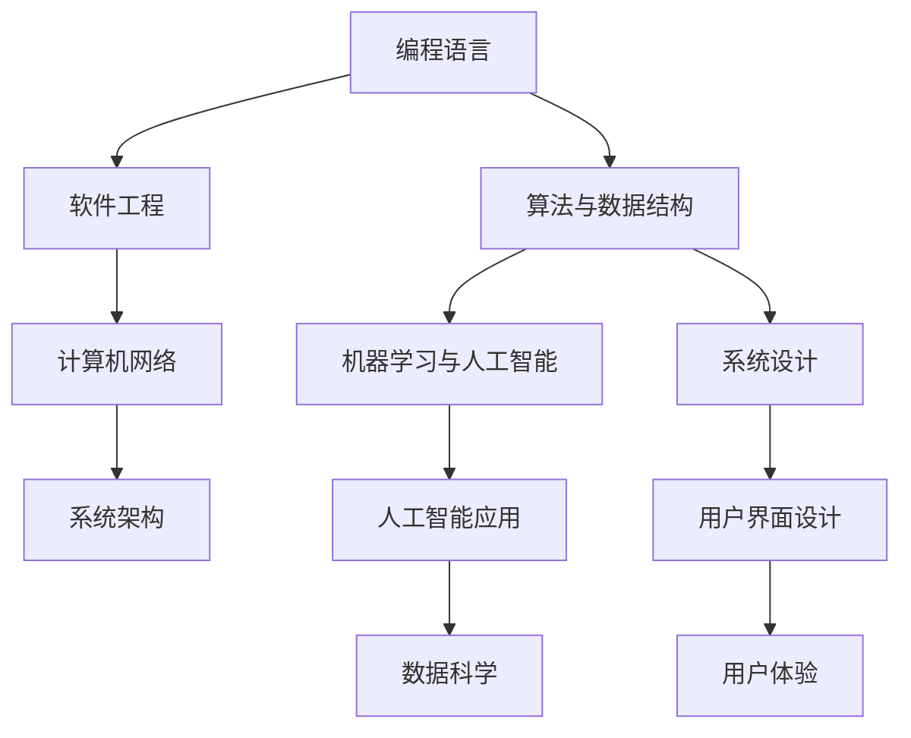

                 

# 自信：因为每个人都可以学习和提高这些技能

## 1. 背景介绍

在数字化时代，技术日新月异，掌握计算机技能已经成为我们生活和工作的重要组成部分。无论你是初学者还是有一定经验的开发者，都可以在学习和实践中不断提升自己的技能水平。本博客旨在帮助读者建立信心，掌握高效学习计算机技能的方法，从而在职业发展和技术探索的道路上更进一步。

### 1.1 问题由来

在技术快速发展的大背景下，学习计算机技能的方法和工具层出不穷，这对技术人员来说既是机遇也是挑战。如何高效、系统地学习这些技能，如何在实践中不断提升自我，已成为当前技术人员关注的焦点。本文将从技术原理和实践操作两个角度，详细介绍如何通过学习提升计算机技能，从而实现个人和职业发展的目标。

## 2. 核心概念与联系

### 2.1 核心概念概述

本节将介绍几个与提升计算机技能密切相关的核心概念：

- **编程语言**：如Python、Java、C++等，是软件开发的基础工具，掌握其特性和用法对提升编程能力至关重要。
- **算法与数据结构**：理解和掌握常用的排序、查找、图论、树等算法和数据结构，是提升解决复杂问题的关键。
- **软件工程**：包括需求分析、设计、编码、测试、维护等全生命周期的软件开发生命周期管理方法，是提高软件质量和效率的重要保障。
- **机器学习与人工智能**：通过算法和数据训练模型，进行预测、分类、聚类等任务，是现代技术的重要应用领域。
- **计算机网络**：了解TCP/IP协议、HTTP请求、数据库等基础知识，是构建可靠网络应用的基础。

这些核心概念之间有着紧密的联系。通过系统学习这些概念，我们可以构建坚实的技术基础，为进一步提升技能奠定基础。

### 2.2 核心概念原理和架构的 Mermaid 流程图



这个流程图展示了各个核心概念之间的联系。编程语言是基础，算法和数据结构是工具，软件工程是方法论，机器学习和人工智能是应用，而计算机网络和系统架构则是实践框架。

## 3. 核心算法原理 & 具体操作步骤

### 3.1 算法原理概述

计算机技能的提升，离不开对算法和数据结构的理解和应用。算法的选择和实现是解决复杂问题的关键，而数据结构的合理组织和应用，则可以提高程序的效率和可维护性。

### 3.2 算法步骤详解

#### 3.2.1 算法设计

算法设计是一个系统性过程，涉及问题建模、算法选择、数据处理、性能优化等多个环节。在设计算法时，首先需要明确问题的本质和目标，然后根据问题的特性选择合适的算法，并进行具体实现。

#### 3.2.2 算法实现

算法实现通常包括编写代码、调试和优化等步骤。在实现过程中，需要注意代码的可读性和可维护性，避免过度优化导致的复杂性增加。同时，也要关注算法的性能，确保其在实际应用中的高效性和可靠性。

#### 3.2.3 算法评估

算法评估是检验算法性能和可靠性的重要环节。常用的评估方法包括时间复杂度分析、空间复杂度分析、实验测试等。通过对算法进行全面的评估，可以发现和解决算法设计中的问题，提升算法的实用性和可扩展性。

### 3.3 算法优缺点

#### 3.3.1 优点

1. **提高问题解决能力**：通过学习算法和数据结构，可以系统性地分析和解决复杂问题，提高编程能力和软件工程水平。
2. **提升工作效率**：高效的算法和数据结构可以显著提高程序的执行效率和响应速度，提升软件性能和用户体验。
3. **增强职业竞争力**：掌握先进的算法和数据结构，可以提升在技术竞争激烈的职场中的竞争力，为职业发展提供保障。

#### 3.3.2 缺点

1. **学习难度较大**：算法和数据结构涉及复杂的理论和实践，需要较高的数学和编程能力，对初学者来说可能有一定的学习难度。
2. **实际应用限制**：算法和数据结构的应用受限于实际问题的复杂性和数据特征，有时需要结合具体问题进行优化。
3. **理论与实践脱节**：在学习过程中，有时需要从理论到实践，进行多次迭代，才能真正理解和掌握。

### 3.4 算法应用领域

算法和数据结构在多个领域都有广泛的应用，例如：

- **软件开发**：在软件开发中，算法和数据结构是实现功能的基础，如排序算法、图遍历算法等。
- **数据处理**：在数据处理中，算法和数据结构用于数据的清洗、分析和挖掘，如分布式算法、数据压缩算法等。
- **机器学习**：在机器学习中，算法和数据结构用于模型的训练和优化，如神经网络、决策树等。
- **计算机网络**：在计算机网络中，算法和数据结构用于协议的实现和优化，如路由算法、流量控制算法等。

## 4. 数学模型和公式 & 详细讲解 & 举例说明

### 4.1 数学模型构建

数学模型是计算机技能学习的重要工具，通过对实际问题的数学建模，可以系统性地分析和解决问题。常用的数学模型包括线性规划、最优化问题、概率模型等。

### 4.2 公式推导过程

以下以线性规划为例，推导求解线性规划问题的基本步骤：

1. 确定线性规划问题的目标函数和约束条件。
2. 将目标函数和约束条件转化为标准形式。
3. 使用单纯形法、内点法等求解算法进行求解。
4. 验证求解结果的正确性。

### 4.3 案例分析与讲解

以著名的"旅行商问题"（Traveling Salesman Problem, TSP）为例，分析使用遗传算法解决该问题的方法和过程。

**目标函数**：最小化总路程

**约束条件**：
- 每个城市必须被访问一次且仅访问一次。
- 访问顺序对总路程有直接影响。

**求解步骤**：
1. 初始化种群，随机生成若干路径。
2. 计算每个路径的总路程，选择最优路径。
3. 进行交叉和变异操作，生成新的路径。
4. 重复步骤2和3，直到满足停止条件。

## 5. 项目实践：代码实例和详细解释说明

### 5.1 开发环境搭建

#### 5.1.1 安装开发工具

- **Python**：安装最新版本的Python，并确保pip和virtualenv已安装。
- **IDE**：安装适合的IDE，如PyCharm、Visual Studio Code等。
- **版本控制**：安装Git和GitHub Desktop或GitHub Desktop等版本控制工具。

#### 5.1.2 创建虚拟环境

```bash
python -m venv venv
source venv/bin/activate
```

### 5.2 源代码详细实现

以下是一个简单的Python代码示例，展示如何使用Python进行列表排序：

```python
# 定义列表
numbers = [5, 3, 8, 4, 2]

# 使用内置排序函数
numbers.sort()

# 输出排序后的列表
print(numbers)
```

### 5.3 代码解读与分析

在上述代码中，我们首先定义了一个包含无序数字的列表`numbers`，然后使用Python内置的`sort()`函数对其进行排序。排序后的结果存储在`numbers`变量中，并通过`print()`函数输出。

## 6. 实际应用场景

### 6.1 软件开发

在软件开发中，算法和数据结构的应用非常广泛。例如，使用排序算法和数据结构，可以优化数据库查询、提高内存管理效率、提升数据处理性能等。

### 6.2 数据分析

数据分析是数据科学的重要应用领域，使用算法和数据结构可以高效地进行数据清洗、分析和挖掘。例如，使用决策树算法进行特征选择，使用聚类算法进行数据分类等。

### 6.3 机器学习

在机器学习中，算法和数据结构是实现模型训练和优化的基础。例如，使用神经网络算法进行图像识别、使用决策树算法进行分类等。

### 6.4 未来应用展望

随着人工智能技术的不断进步，算法和数据结构的应用将更加广泛。例如，在智能交通、医疗健康、金融科技等领域，算法和数据结构将发挥重要作用，提升数据处理和决策分析的效率和准确性。

## 7. 工具和资源推荐

### 7.1 学习资源推荐

1. **书籍**：
   - 《算法导论》：由Thomas H. Cormen等著，系统介绍了算法和数据结构的理论基础和实现方法。
   - 《深入理解计算机系统》：由Randal E. Bryant和David R. O'Hallaron著，介绍了计算机系统设计的核心概念和实现方法。
   - 《Python核心编程》：由Wesley Chun著，介绍了Python语言的特性和应用方法。

2. **在线课程**：
   - Coursera上的《算法与数据结构》课程。
   - edX上的《Python基础》课程。
   - Udacity上的《机器学习基础》课程。

### 7.2 开发工具推荐

1. **IDE**：
   - PyCharm：功能强大的Python开发环境，支持代码自动完成、版本控制、调试等功能。
   - Visual Studio Code：轻量级的代码编辑器，支持多种编程语言和插件扩展。

2. **版本控制**：
   - Git：主流的版本控制系统，支持分布式协作开发。
   - GitHub Desktop：GitHub的桌面客户端，方便管理Git仓库。

### 7.3 相关论文推荐

1. **《深入理解计算机系统》**：由Randal E. Bryant和David R. O'Hallaron著，介绍了计算机系统设计的核心概念和实现方法。
2. **《算法导论》**：由Thomas H. Cormen等著，系统介绍了算法和数据结构的理论基础和实现方法。
3. **《Python核心编程》**：由Wesley Chun著，介绍了Python语言的特性和应用方法。

## 8. 总结：未来发展趋势与挑战

### 8.1 研究成果总结

算法和数据结构是计算机技能提升的重要基础。通过系统学习算法和数据结构，可以提升编程能力、提高软件工程水平、增强职业竞争力。

### 8.2 未来发展趋势

1. **算法优化**：未来算法和数据结构的研究将更加关注算法的优化和性能提升，如多核并行、分布式计算等。
2. **跨学科融合**：算法和数据结构的应用将更加广泛，与机器学习、人工智能、计算机网络等领域进行跨学科融合。
3. **自动化与智能化**：未来算法和数据结构的实现将更加自动化和智能化，提升开发效率和系统性能。

### 8.3 面临的挑战

1. **学习难度**：算法和数据结构的学习难度较大，需要较高的数学和编程能力。
2. **实际应用限制**：算法和数据结构的应用受限于实际问题的复杂性和数据特征。
3. **理论与实践脱节**：在学习过程中，有时需要从理论到实践，进行多次迭代，才能真正理解和掌握。

### 8.4 研究展望

未来的研究将更加注重算法的可解释性和可扩展性，同时加强跨学科的融合和应用，推动算法和数据结构的创新和实践。

## 9. 附录：常见问题与解答

### 9.1 常见问题

#### Q1：如何高效学习算法和数据结构？

A：
1. **系统学习**：从基础概念入手，逐步深入学习常用算法和数据结构的原理和实现方法。
2. **实践应用**：通过实际项目和编程练习，加深对算法和数据结构的应用理解。
3. **总结归纳**：定期总结所学知识，形成自己的知识体系。

#### Q2：如何提升编程能力？

A：
1. **编程练习**：通过练习编码和调试，提高编程技能。
2. **项目实践**：参与实际项目开发，积累项目经验。
3. **阅读源码**：阅读优秀开源项目的源码，学习其设计思路和实现方法。

#### Q3：如何选择适合的算法和数据结构？

A：
1. **问题分析**：明确问题的本质和目标，分析问题的复杂性和数据特征。
2. **算法评估**：选择适合的算法，评估其性能和可靠性。
3. **优化改进**：根据实际应用情况，进行优化和改进。

#### Q4：如何在实际应用中提升系统性能？

A：
1. **性能分析**：使用性能分析工具，分析系统瓶颈和性能问题。
2. **优化算法**：优化算法和数据结构，提升系统性能。
3. **多核并行**：使用多核并行技术，提升计算效率。

---

作者：禅与计算机程序设计艺术 / Zen and the Art of Computer Programming

