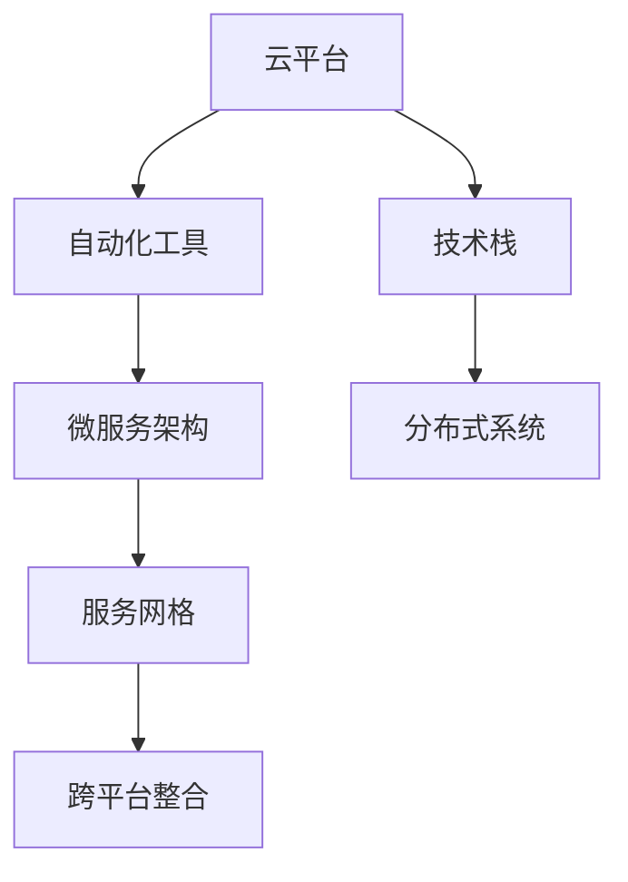

                 

# 自动化创业中的跨平台整合

> 关键词：自动化,创业,跨平台整合,技术栈,分布式系统

## 1. 背景介绍

### 1.1 问题由来
随着云计算和自动化技术的不断成熟，越来越多的创业者开始借助云平台和自动化工具来提升创业项目的效率和稳定性。然而，由于现有云平台和工具各具特色，且往往存在孤岛效应，使得创业者在整合不同平台、工具和技术栈时面临诸多挑战。

1. **数据迁移困难**：不同平台的数据格式和存储方式差异较大，数据迁移和集成难度高。
2. **兼容性问题**：不同平台和技术栈的API接口和协议不一致，相互兼容难度大。
3. **运维复杂性**：跨平台系统的运维涉及多台服务器、多种操作系统和软件环境，运维复杂度显著增加。
4. **性能瓶颈**：跨平台系统性能瓶颈往往出现在数据交互和同步过程中，难以有效优化。
5. **安全性问题**：跨平台数据流动和访问控制复杂，安全性风险较高。

面对这些挑战，跨平台整合成为创业项目必须解决的难题。只有通过有效整合，才能充分发挥各平台和工具的优势，实现资源的最大化利用，提升创业项目的整体效率和竞争力。

### 1.2 问题核心关键点
实现跨平台整合的核心在于建立统一的技术架构和数据模型，通过标准化和规范化接口协议，实现不同平台和工具的无缝对接。其关键点包括：

- **统一技术架构**：设计和实施统一的技术栈，避免各平台的技术差异带来的兼容性问题。
- **标准化数据模型**：定义统一的数据模型和接口规范，确保不同平台的数据互操作性。
- **分布式系统设计**：构建分布式系统架构，提高系统的可扩展性和容错性。
- **微服务架构**：采用微服务架构，提高系统的模块化和可维护性。
- **云原生技术**：利用云原生技术，实现应用的自动化部署、监控和运维。

## 2. 核心概念与联系

### 2.1 核心概念概述

为更好地理解跨平台整合技术，本节将介绍几个密切相关的核心概念：

- **云平台**：提供弹性计算资源和相关服务的公共平台，如AWS、Google Cloud、阿里云等。
- **自动化工具**：通过脚本、CI/CD工具、容器化等技术手段，实现软件自动化的构建、部署和运维工具，如Jenkins、Kubernetes、Docker等。
- **技术栈**：一种或多种编程语言、框架、库和工具的组合，用于开发和运行软件应用。
- **微服务架构**：将应用拆分为多个小服务，每个服务负责独立的功能模块，并通过RESTful API接口进行通信。
- **分布式系统**：由多台计算机协同工作，共同完成复杂任务的系统，如Hadoop、Spark等。
- **服务网格**：一种网络技术，通过代理和拦截器，实现服务间的流量管理和数据路由。

这些概念之间的逻辑关系可以通过以下Mermaid流程图来展示：



这个流程图展示了几大核心概念及其之间的联系：

1. 云平台提供资源和基础设施，支持自动化工具和技术栈的部署和运维。
2. 自动化工具通过脚本、容器化等技术，自动化软件构建、部署和运维过程。
3. 技术栈是开发软件应用的基础，包含编程语言、框架、库等。
4. 微服务架构将应用拆分为独立的服务模块，通过API接口进行通信。
5. 分布式系统通过多台计算机协同工作，提高系统的可扩展性和容错性。
6. 服务网格通过流量管理和数据路由，优化微服务架构下的服务通信。
7. 跨平台整合通过统一技术架构和接口协议，实现不同平台和工具的无缝对接。

这些概念共同构成了跨平台整合的完整技术框架，为实现跨平台整合提供了基本思路和方法。

## 3. 核心算法原理 & 具体操作步骤
### 3.1 算法原理概述

跨平台整合的核心算法原理是统一技术架构和数据模型，通过标准化接口协议，实现不同平台和工具的无缝对接。具体而言，包括以下几个关键步骤：

1. **统一技术栈**：选择一种通用的编程语言和框架，作为所有平台和工具的基础。
2. **标准化数据模型**：定义统一的数据模型和接口规范，确保不同平台的数据互操作性。
3. **分布式系统设计**：构建分布式系统架构，提高系统的可扩展性和容错性。
4. **微服务架构**：采用微服务架构，提高系统的模块化和可维护性。
5. **云原生技术**：利用云原生技术，实现应用的自动化部署、监控和运维。

### 3.2 算法步骤详解

以下是对跨平台整合具体步骤的详细介绍：

**Step 1: 选择统一技术栈**
- 选择一种流行的编程语言（如Python、Java）和框架（如Django、Spring）作为所有平台和工具的基础。
- 采用一致的项目结构和开发规范，确保代码的可移植性和可维护性。
- 使用统一的开发环境、版本控制工具和CI/CD流程，提高开发效率和协作能力。

**Step 2: 标准化数据模型**
- 定义统一的数据模型和接口规范，确保不同平台的数据互操作性。
- 使用JSON/XML等通用的数据交换格式，确保数据的通用性和兼容性。
- 设计统一的API接口规范，定义数据输入输出格式和参数规范。

**Step 3: 分布式系统设计**
- 采用分布式系统架构，将系统拆分为多个独立的服务模块。
- 使用消息队列、分布式锁、状态管理等技术，确保服务的可靠性和性能。
- 设计系统的负载均衡和容错机制，提高系统的可扩展性和稳定性。

**Step 4: 微服务架构**
- 将应用拆分为多个独立的服务模块，每个服务负责独立的功能模块。
- 通过RESTful API接口进行通信，确保服务之间的解耦合。
- 设计服务发现和注册机制，确保服务动态部署和扩展。

**Step 5: 云原生技术**
- 使用容器化技术（如Docker、Kubernetes）实现应用的自动化部署和运维。
- 利用云原生服务（如ECS、Cloud Foundry）提高系统的可扩展性和容错性。
- 采用DevOps实践，实现自动化构建、测试和部署流程。

### 3.3 算法优缺点

跨平台整合具有以下优点：
1. 提高系统的可扩展性和容错性。分布式系统和微服务架构使得系统能够快速扩展，具备良好的容错性。
2. 提高系统的模块化和可维护性。微服务架构将应用拆分为独立的服务模块，便于单独开发和维护。
3. 提高系统的自动化程度。云原生技术和自动化工具可以自动完成构建、部署和运维过程，提升开发效率和协作能力。
4. 提高系统的兼容性和互操作性。标准化数据模型和接口规范使得不同平台和工具能够无缝对接。

同时，该方法也存在一定的局限性：
1. 实现难度较大。统一技术栈和数据模型需要较高的设计和技术水平，实现成本较高。
2. 性能开销较大。分布式系统和微服务架构带来一定的性能开销，需要合理优化。
3. 数据一致性问题。不同平台和工具的数据存储和处理方式不同，数据一致性问题难以完全解决。
4. 安全性风险。跨平台数据流动和访问控制复杂，安全性风险较高。

尽管存在这些局限性，但就目前而言，跨平台整合仍是实现跨平台无缝对接的最佳方式。未来相关研究的重点在于如何进一步优化实现方法，降低技术难度和成本，提高系统性能和安全性。

### 3.4 算法应用领域

跨平台整合技术已经在多个领域得到了广泛的应用，包括但不限于以下几个方面：

- **云计算平台**：通过统一技术栈和接口协议，实现不同云平台之间的应用迁移和数据交换。
- **企业级应用**：构建统一的企业级应用架构，提高系统的可扩展性和互操作性。
- **大数据处理**：通过分布式系统和微服务架构，实现大数据处理应用的统一管理和扩展。
- **物联网(IoT)**：通过统一数据模型和接口规范，实现不同物联网设备和平台之间的数据互操作性。
- **人工智能(AI)**：构建统一的人工智能应用架构，提高系统的模块化和可维护性。

除了上述这些经典应用外，跨平台整合还在更多场景中得到了创新性地应用，如跨平台机器学习、跨平台应用程序开发等，为云计算和企业信息化带来了新的变革。

## 4. 数学模型和公式 & 详细讲解 & 举例说明（备注：数学公式请使用latex格式，latex嵌入文中独立段落使用 $$，段落内使用 $)
### 4.1 数学模型构建

本节将使用数学语言对跨平台整合的技术架构进行更加严格的刻画。

假设系统由多个独立的服务模块组成，每个服务模块的输出和输入可以表示为向量形式：

$$
x_i = [x_{i1}, x_{i2}, ..., x_{in}]
$$

其中 $x_{ij}$ 表示服务 $i$ 的第 $j$ 个输入或输出，$n$ 表示输入输出的总数量。服务间的交互可以通过标准化的API接口进行，每个API接口可以表示为一个函数映射：

$$
f: \mathcal{X}_i \times \mathcal{Y}_i \rightarrow \mathcal{X}_{i+1} \times \mathcal{Y}_{i+1}
$$

其中 $\mathcal{X}_i$ 和 $\mathcal{Y}_i$ 分别表示服务 $i$ 的输入和输出空间。服务 $i+1$ 的输入由服务 $i$ 的输出决定，即：

$$
x_{i+1} = f(x_i, y_i)
$$

其中 $y_i$ 表示服务 $i$ 的输入参数。系统的整体功能可以通过服务链 $S$ 进行描述：

$$
S = (x_1, f_1, x_2, f_2, ..., x_n, f_n, x_{n+1})
$$

其中 $f_1, f_2, ..., f_n$ 表示服务链中的所有API接口。

### 4.2 公式推导过程

在跨平台整合的实现过程中，需要解决以下问题：

**问题 1: 服务模块的集成和通信**  
服务模块之间的集成和通信是跨平台整合的核心问题。假设存在 $m$ 个服务模块，每个服务模块的输出可以表示为向量形式：

$$
x_i = [x_{i1}, x_{i2}, ..., x_{im}]
$$

其中 $x_{ij}$ 表示服务 $i$ 的第 $j$ 个输入或输出，$m$ 表示输入输出的总数量。服务间的交互可以通过标准化的API接口进行，每个API接口可以表示为一个函数映射：

$$
f: \mathcal{X}_i \times \mathcal{Y}_i \rightarrow \mathcal{X}_{i+1} \times \mathcal{Y}_{i+1}
$$

其中 $\mathcal{X}_i$ 和 $\mathcal{Y}_i$ 分别表示服务 $i$ 的输入和输出空间。服务 $i+1$ 的输入由服务 $i$ 的输出决定，即：

$$
x_{i+1} = f(x_i, y_i)
$$

其中 $y_i$ 表示服务 $i$ 的输入参数。系统的整体功能可以通过服务链 $S$ 进行描述：

$$
S = (x_1, f_1, x_2, f_2, ..., x_n, f_n, x_{n+1})
$$

其中 $f_1, f_2, ..., f_n$ 表示服务链中的所有API接口。

**问题 2: 数据模型的标准化**  
跨平台整合的另一个关键问题是数据模型的标准化。假设存在 $n$ 个数据源，每个数据源的数据可以表示为向量形式：

$$
d_j = [d_{j1}, d_{j2}, ..., d_{jn}]
$$

其中 $d_{ij}$ 表示数据源 $j$ 的第 $i$ 个数据项。为了实现数据模型的标准化，需要定义统一的数据模型和接口规范，确保不同平台的数据互操作性。可以使用JSON/XML等通用的数据交换格式，确保数据的通用性和兼容性。

**问题 3: 分布式系统的设计**  
跨平台整合还需要解决分布式系统的设计问题。假设存在 $k$ 个分布式节点，每个节点的输出可以表示为向量形式：

$$
o_l = [o_{l1}, o_{l2}, ..., o_{ln}]
$$

其中 $o_{lj}$ 表示节点 $l$ 的第 $j$ 个输出，$n$ 表示输出总数。分布式系统的设计可以通过分布式计算框架（如Hadoop、Spark）来实现，确保系统的可扩展性和容错性。

### 4.3 案例分析与讲解

假设有一个跨平台的电子商务系统，需要实现用户注册、商品搜索、订单管理等功能。系统的技术栈统一使用Java和Spring，采用微服务架构，每个服务模块通过RESTful API接口进行通信。系统的数据模型采用JSON格式，确保不同平台的数据互操作性。

服务链 $S$ 可以表示为：

$$
S = (u, f_u, p, f_p, o, f_o)
$$

其中 $u$ 表示用户服务，$p$ 表示商品服务，$o$ 表示订单服务。服务链的每个API接口可以表示为一个函数映射：

$$
f_u: \mathcal{X}_u \times \mathcal{Y}_u \rightarrow \mathcal{X}_p \times \mathcal{Y}_p
$$

$$
f_p: \mathcal{X}_p \times \mathcal{Y}_p \rightarrow \mathcal{X}_o \times \mathcal{Y}_o
$$

其中 $\mathcal{X}_u$ 和 $\mathcal{Y}_u$ 分别表示用户服务的输入和输出空间，$\mathcal{X}_p$ 和 $\mathcal{Y}_p$ 分别表示商品服务的输入和输出空间，$\mathcal{X}_o$ 和 $\mathcal{Y}_o$ 分别表示订单服务的输入和输出空间。

## 5. 项目实践：代码实例和详细解释说明
### 5.1 开发环境搭建

在进行跨平台整合实践前，我们需要准备好开发环境。以下是使用Java和Spring Boot开发的环境配置流程：

1. 安装JDK：从Oracle官网下载并安装JDK，确保环境变量配置正确。
2. 安装Maven：从Maven官网下载并安装Maven，用于构建和管理项目依赖。
3. 安装Spring Boot：从Spring官网下载并安装Spring Boot，用于快速构建Web应用。
4. 安装PostgreSQL：从PostgreSQL官网下载并安装PostgreSQL，用于数据库管理。

完成上述步骤后，即可在IDE中启动开发环境。

### 5.2 源代码详细实现

下面我们以跨平台的电子商务系统为例，给出使用Spring Boot和Docker进行跨平台整合的Java代码实现。

首先，定义商品服务模块的API接口：

```java
@RestController
@RequestMapping("/products")
public class ProductController {

    @Autowired
    private ProductService productService;

    @GetMapping("/{id}")
    public Product getProductById(@PathVariable Long id) {
        return productService.findById(id);
    }

    @PostMapping
    public Product addProduct(@RequestBody Product product) {
        return productService.addProduct(product);
    }
}
```

然后，定义订单服务模块的API接口：

```java
@RestController
@RequestMapping("/orders")
public class OrderController {

    @Autowired
    private OrderService orderService;

    @GetMapping("/{id}")
    public Order getOrderById(@PathVariable Long id) {
        return orderService.findById(id);
    }

    @PostMapping
    public Order placeOrder(@RequestBody Order order) {
        return orderService.placeOrder(order);
    }
}
```

接着，定义用户服务模块的API接口：

```java
@RestController
@RequestMapping("/users")
public class UserController {

    @Autowired
    private UserService userService;

    @GetMapping("/{id}")
    public User getUserById(@PathVariable Long id) {
        return userService.findById(id);
    }

    @PostMapping("/register")
    public User registerUser(@RequestBody User user) {
        return userService.registerUser(user);
    }
}
```

最后，定义全局异常处理器：

```java
@ControllerAdvice
public class GlobalExceptionHandler {

    @ExceptionHandler(Exception.class)
    public ResponseEntity<String> handleException(Exception ex) {
        return ResponseEntity.status(HttpStatus.INTERNAL_SERVER_ERROR).body(ex.getMessage());
    }
}
```

### 5.3 代码解读与分析

让我们再详细解读一下关键代码的实现细节：

**ProductController类**：
- `@RestController`注解：定义该类为RESTful接口控制器。
- `@RequestMapping`注解：指定该类的路由路径。
- `@Autowired`注解：自动注入依赖服务。
- `@GetMapping`注解：指定HTTP GET请求的路由。
- `@PostMapping`注解：指定HTTP POST请求的路由。
- `getProductById`方法：根据ID获取商品信息。
- `addProduct`方法：添加新商品。

**OrderController类**：
- `@RestController`注解：定义该类为RESTful接口控制器。
- `@RequestMapping`注解：指定该类的路由路径。
- `@Autowired`注解：自动注入依赖服务。
- `@GetMapping`注解：指定HTTP GET请求的路由。
- `@PostMapping`注解：指定HTTP POST请求的路由。
- `getOrderById`方法：根据ID获取订单信息。
- `placeOrder`方法：下单。

**UserController类**：
- `@RestController`注解：定义该类为RESTful接口控制器。
- `@RequestMapping`注解：指定该类的路由路径。
- `@Autowired`注解：自动注入依赖服务。
- `@GetMapping`注解：指定HTTP GET请求的路由。
- `@PostMapping`注解：指定HTTP POST请求的路由。
- `getUserById`方法：根据ID获取用户信息。
- `registerUser`方法：注册新用户。

**GlobalExceptionHandler类**：
- `@ControllerAdvice`注解：定义全局异常处理器。
- `@ExceptionHandler`注解：指定处理的异常类型。
- `handleException`方法：处理全局异常，返回响应体。

**Spring Boot与Docker集成**：
- 在`pom.xml`文件中添加Docker相关依赖：
  ```xml
  <dependency>
      <groupId>io.spring.boot</groupId>
      <artifactId>spring-boot-starter-docker</artifactId>
  </dependency>
  ```

- 在`application.properties`文件中配置Docker相关参数：
  ```properties
  docker.image suffix=myapp:1.0-SNAPSHOT
  ```

- 在`Dockerfile`文件中编写Docker镜像构建脚本：
  ```dockerfile
  FROM java:11-jdk-alpine
  MAINTAINER <your_name> <your_email>

  # Copy dependencies
  COPY target/dependency/*.jar app.jar

  # Start the application
  CMD ["java", "-jar", "app.jar"]
  ```

完成上述步骤后，即可在Docker中构建、运行跨平台整合的应用。

### 5.4 运行结果展示

启动Docker容器后，可以通过HTTP请求访问各个服务模块的API接口。例如，访问`http://localhost:8080/products/1`可以获取ID为1的商品信息。

```java
curl http://localhost:8080/products/1
```

```
{
    "id": 1,
    "name": "Product 1",
    "price": 100.0
}
```

## 6. 实际应用场景
### 6.1 智能制造系统

跨平台整合技术在智能制造系统中的应用非常广泛。传统制造企业往往需要采购、生产、仓储、物流等环节的信息系统，这些系统通常由不同的厂商开发，存在数据格式、接口协议等差异，难以统一管理。通过跨平台整合技术，可以将各环节的系统整合为一个整体，实现统一的数据管理和流程控制。

在具体实现中，可以采用微服务架构和云原生技术，将各环节的业务逻辑拆分为独立的服务模块，并通过标准化的API接口进行通信。同时，利用容器化技术和Docker容器，实现服务的自动化部署和运维。通过统一的接口协议和数据模型，可以实现不同环节之间的数据互操作性，提升整个系统的协调性和稳定性。

### 6.2 智慧医疗系统

跨平台整合技术在智慧医疗系统中也有重要应用。医疗行业涉及众多系统和平台，如电子病历系统、影像诊断系统、药品管理系统等，这些系统往往采用不同的技术和协议，数据互操作性差。通过跨平台整合技术，可以将这些系统整合为一个统一的平台，实现数据共享和协同工作。

在具体实现中，可以采用微服务架构和云原生技术，将各环节的业务逻辑拆分为独立的服务模块，并通过标准化的API接口进行通信。同时，利用容器化技术和Docker容器，实现服务的自动化部署和运维。通过统一的接口协议和数据模型，可以实现不同系统之间的数据互操作性，提升整个系统的协作性和效率。

### 6.3 智能物流系统

跨平台整合技术在智能物流系统中同样有着广泛的应用。物流行业涉及众多环节，如仓储管理、运输调度和配送服务等，这些环节通常由不同的系统和平台实现，数据格式和接口协议存在差异。通过跨平台整合技术，可以将这些环节整合为一个统一的平台，实现数据共享和协同工作。

在具体实现中，可以采用微服务架构和云原生技术，将各环节的业务逻辑拆分为独立的服务模块，并通过标准化的API接口进行通信。同时，利用容器化技术和Docker容器，实现服务的自动化部署和运维。通过统一的接口协议和数据模型，可以实现不同环节之间的数据互操作性，提升整个系统的协调性和效率。

### 6.4 未来应用展望

随着技术的不断发展，跨平台整合技术将在更多领域得到应用，为各行业的数字化转型带来新的变革。

在智慧城市治理中，跨平台整合技术可以实现各类公共服务的整合和优化，提升城市管理的自动化和智能化水平，构建更安全、高效的未来城市。

在金融科技领域，跨平台整合技术可以实现各种金融应用系统的整合，提升金融服务的便捷性和安全性。

在能源行业，跨平台整合技术可以实现能源管理系统、智能电网、新能源等系统的整合，提升能源管理的智能化和效率。

未来，随着云计算、物联网、人工智能等技术的进一步发展，跨平台整合技术的应用场景将更加广泛，为各行各业带来更深层次的数字化转型和智能化升级。

## 7. 工具和资源推荐
### 7.1 学习资源推荐

为了帮助开发者系统掌握跨平台整合的技术框架和实践方法，这里推荐一些优质的学习资源：

1. Spring Boot官方文档：详细介绍了Spring Boot框架的快速构建、部署和运维。
2. Docker官方文档：提供了Docker容器的安装、使用和高级配置指南。
3. Kubernetes官方文档：介绍了Kubernetes集群的管理、监控和优化方法。
4. DevOps实践指南：《The DevOps Handbook》一书，详细介绍了DevOps的最佳实践和案例。
5. 跨平台整合实战案例：《Cross-Platform Integration Patterns》一书，提供了多种跨平台整合的实现案例和方法。

通过对这些资源的学习实践，相信你一定能够快速掌握跨平台整合的精髓，并用于解决实际的开发问题。

### 7.2 开发工具推荐

高效的开发离不开优秀的工具支持。以下是几款用于跨平台整合开发的常用工具：

1. IntelliJ IDEA：Java开发的主流IDE，集成了Spring Boot和Docker的插件，方便快速开发和调试。
2. Eclipse：Java开发的传统IDE，支持多种开发环境和插件，方便构建和部署。
3. VSCode：基于Web的轻量级IDE，支持多种编程语言和插件，方便快速开发和调试。
4. Docker Compose：用于快速构建和管理Docker容器的工具，方便跨平台整合应用的部署和管理。
5. Jenkins：基于Web的持续集成和持续部署工具，支持多种插件和扩展，方便自动化构建和部署。
6. GitLab CI/CD：用于自动化构建、测试和部署的工具，支持多种集成和部署方式。

合理利用这些工具，可以显著提升跨平台整合开发的效率，加快创新迭代的步伐。

### 7.3 相关论文推荐

跨平台整合技术的发展源于学界的持续研究。以下是几篇奠基性的相关论文，推荐阅读：

1. The Diversity of Cloud Computing: Concepts, Technology, and Applications（云计算的多样性）：提出了云计算的多样性和分布式系统设计的原则。
2. Microservices: A Service-Oriented Architecture and Design Pattern（微服务架构）：介绍了微服务架构的设计模式和最佳实践。
3. Docker: The Future of Computing（Docker：未来的计算）：介绍了Docker容器化和云原生技术的应用前景。
4. Kubernetes: The Case for a Kubernetes Control Plane（Kubernetes：控制平面的案例）：介绍了Kubernetes控制平面的设计和实现。
5. Cloud-Native Microservices in a Nutshell（云原生微服务概览）：介绍了云原生技术和微服务架构的结合应用。

这些论文代表了大平台整合技术的发展脉络。通过学习这些前沿成果，可以帮助研究者把握学科前进方向，激发更多的创新灵感。

## 8. 总结：未来发展趋势与挑战
### 8.1 总结

本文对跨平台整合技术的实现方法进行了全面系统的介绍。首先阐述了跨平台整合的核心概念和实现步骤，明确了跨平台整合在提升系统互操作性、可扩展性和可维护性方面的独特价值。其次，从原理到实践，详细讲解了跨平台整合的数学模型和算法步骤，给出了具体的代码实例和详细解释。同时，本文还广泛探讨了跨平台整合在智能制造、智慧医疗、智能物流等多个行业领域的应用前景，展示了跨平台整合的巨大潜力。此外，本文精选了跨平台整合技术的各类学习资源，力求为读者提供全方位的技术指引。

通过本文的系统梳理，可以看到，跨平台整合技术正在成为软件系统整合的主流方法，极大地提升了系统的灵活性和可扩展性。未来的研究还需要在更广泛的领域进行实践和探索，进一步提升跨平台整合的效果和应用范围。

### 8.2 未来发展趋势

展望未来，跨平台整合技术将呈现以下几个发展趋势：

1. 微服务架构将更加普及。微服务架构的设计原则和实现方法将被广泛应用，提升系统的模块化和可维护性。
2. 云原生技术将更加成熟。云原生技术的自动化部署、监控和运维能力将进一步增强，提升系统的稳定性和可扩展性。
3. 分布式系统将更加高效。分布式系统的负载均衡和容错机制将更加完善，提升系统的处理能力和可靠性。
4. 统一技术栈将更加普及。统一的编程语言和框架将被广泛应用，提升系统的兼容性和互操作性。
5. 数据模型和接口协议将更加标准化。统一的数据模型和接口规范将得到广泛应用，提升系统的数据互操作性。

这些趋势凸显了跨平台整合技术的广阔前景。这些方向的探索发展，必将进一步提升跨平台整合的效果和应用范围，为软件系统的整合和优化带来新的突破。

### 8.3 面临的挑战

尽管跨平台整合技术已经取得了一定的成就，但在迈向更加智能化、普适化应用的过程中，它仍面临诸多挑战：

1. 实现难度较大。统一技术栈和数据模型需要较高的设计和技术水平，实现成本较高。
2. 性能开销较大。微服务架构和分布式系统带来一定的性能开销，需要合理优化。
3. 数据一致性问题。不同平台和工具的数据存储和处理方式不同，数据一致性问题难以完全解决。
4. 安全性风险。跨平台数据流动和访问控制复杂，安全性风险较高。

尽管存在这些局限性，但就目前而言，跨平台整合仍是实现跨平台无缝对接的最佳方式。未来相关研究的重点在于如何进一步优化实现方法，降低技术难度和成本，提高系统性能和安全性。

### 8.4 研究展望

面对跨平台整合面临的挑战，未来的研究需要在以下几个方面寻求新的突破：

1. 探索无监督和半监督跨平台整合方法。摆脱对大规模标注数据的依赖，利用自监督学习、主动学习等无监督和半监督范式，最大限度利用非结构化数据，实现更加灵活高效的跨平台整合。
2. 研究参数高效和计算高效的跨平台整合范式。开发更加参数高效的跨平台整合方法，在固定大部分预训练参数的同时，只更新极少量的任务相关参数。同时优化跨平台整合的计算图，减少前向传播和反向传播的资源消耗，实现更加轻量级、实时性的部署。
3. 融合因果和对比学习范式。通过引入因果推断和对比学习思想，增强跨平台整合模型的建立稳定因果关系的能力，学习更加普适、鲁棒的语言表征，从而提升模型泛化性和抗干扰能力。
4. 引入更多先验知识。将符号化的先验知识，如知识图谱、逻辑规则等，与神经网络模型进行巧妙融合，引导跨平台整合过程学习更准确、合理的语言模型。同时加强不同模态数据的整合，实现视觉、语音等多模态信息与文本信息的协同建模。
5. 结合因果分析和博弈论工具。将因果分析方法引入跨平台整合模型，识别出模型决策的关键特征，增强输出解释的因果性和逻辑性。借助博弈论工具刻画人机交互过程，主动探索并规避模型的脆弱点，提高系统稳定性。
6. 纳入伦理道德约束。在跨平台整合模型的训练目标中引入伦理导向的评估指标，过滤和惩罚有偏见、有害的输出倾向。同时加强人工干预和审核，建立模型行为的监管机制，确保输出符合人类价值观和伦理道德。

这些研究方向的探索，必将引领跨平台整合技术迈向更高的台阶，为构建安全、可靠、可解释、可控的智能系统铺平道路。面向未来，跨平台整合技术还需要与其他人工智能技术进行更深入的融合，如知识表示、因果推理、强化学习等，多路径协同发力，共同推动自然语言理解和智能交互系统的进步。只有勇于创新、敢于突破，才能不断拓展跨平台整合的边界，让智能技术更好地造福人类社会。

## 9. 附录：常见问题与解答
**Q1：跨平台整合是否适用于所有软件系统？**

A: 跨平台整合在大多数软件系统上都能取得不错的效果，特别是对于数据量较小的系统。但对于一些特定领域的系统，如医疗、金融等，需要考虑数据格式和接口协议的差异，可能会需要进一步的定制和优化。

**Q2：如何选择合适的跨平台整合技术栈？**

A: 选择合适的跨平台整合技术栈需要综合考虑系统的规模、复杂度、性能要求、开发成本等因素。通常建议采用成熟的、开源的技术栈，如Spring Boot、Docker、Kubernetes等，以确保系统的稳定性和可扩展性。

**Q3：跨平台整合过程中需要注意哪些问题？**

A: 跨平台整合过程中需要注意以下问题：
1. 数据迁移困难：不同平台的数据格式和存储方式差异较大，数据迁移和集成难度高。
2. 兼容性问题：不同平台和技术栈的API接口和协议不一致，相互兼容难度大。
3. 运维复杂性：跨平台系统的运维涉及多台服务器、多种操作系统和软件环境，运维复杂度显著增加。
4. 性能瓶颈：跨平台系统性能瓶颈往往出现在数据交互和同步过程中，难以有效优化。
5. 安全性问题：跨平台数据流动和访问控制复杂，安全性风险较高。

这些问题是跨平台整合过程中必须面对的挑战，需要采取相应的技术手段和最佳实践进行应对。

**Q4：跨平台整合技术在实际应用中面临哪些挑战？**

A: 跨平台整合技术在实际应用中面临以下挑战：
1. 实现难度较大：统一技术栈和数据模型需要较高的设计和技术水平，实现成本较高。
2. 性能开销较大：微服务架构和分布式系统带来一定的性能开销，需要合理优化。
3. 数据一致性问题：不同平台和工具的数据存储和处理方式不同，数据一致性问题难以完全解决。
4. 安全性风险：跨平台数据流动和访问控制复杂，安全性风险较高。

尽管存在这些局限性，但就目前而言，跨平台整合仍是实现跨平台无缝对接的最佳方式。未来相关研究的重点在于如何进一步优化实现方法，降低技术难度和成本，提高系统性能和安全性。

**Q5：跨平台整合技术在未来会有哪些新的发展趋势？**

A: 跨平台整合技术在未来将有以下新的发展趋势：
1. 微服务架构将更加普及。微服务架构的设计原则和实现方法将被广泛应用，提升系统的模块化和可维护性。
2. 云原生技术将更加成熟。云原生技术的自动化部署、监控和运维能力将进一步增强，提升系统的稳定性和可扩展性。
3. 分布式系统将更加高效。分布式系统的负载均衡和容错机制将更加完善，提升系统的处理能力和可靠性。
4. 统一技术栈将更加普及。统一的编程语言和框架将被广泛应用，提升系统的兼容性和互操作性。
5. 数据模型和接口协议将更加标准化。统一的数据模型和接口规范将得到广泛应用，提升系统的数据互操作性。

这些趋势凸显了跨平台整合技术的广阔前景。这些方向的探索发展，必将进一步提升跨平台整合的效果和应用范围，为软件系统的整合和优化带来新的突破。

---

作者：禅与计算机程序设计艺术 / Zen and the Art of Computer Programming

