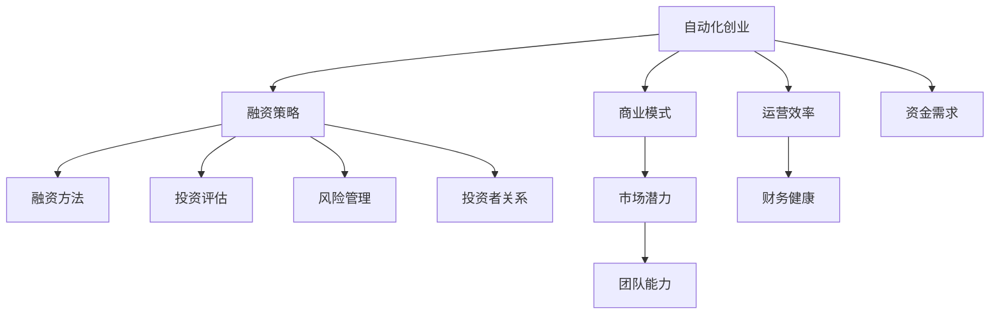

                 

# 自动化创业融资策略与方法

> 关键词：自动化创业,融资策略,融资方法,投资评估,风险管理,创业成功案例

## 1. 背景介绍

在当今瞬息万变的商业环境中，创业公司面临着前所未有的机遇与挑战。自动化技术的迅猛发展不仅为企业提供了提升效率的工具，也开辟了新的商业模式和市场机会。然而，尽管有了创新的技术和产品，但成功的创业之路仍离不开合理的融资策略。资金是企业发展的命脉，如何高效地获取、利用和管理投资，是每一个创业者需要认真思考的问题。

### 1.1 问题由来

随着人工智能、大数据、云计算等技术的发展，越来越多的创业者尝试利用这些技术进行创新创业。然而，即便有了好的产品，企业在成长过程中仍需要大量的资金支持。融资不仅关系到企业的生存和发展，还会影响企业的战略决策和市场表现。不少企业因为融资策略不当导致陷入困境，而有些企业则因资金链断裂而失败。因此，科学、合理的融资策略是创业成功的关键之一。

### 1.2 问题核心关键点

融资策略的核心在于科学评估企业价值、选择合适的融资渠道、有效管理现金流以及构建强大的投资者关系网络。其中，价值评估、融资渠道选择、现金流管理、风险控制和投资者关系管理是创业融资中的五个主要环节。掌握这些关键点，可以帮助创业者更有效地获取和利用投资，确保企业的可持续发展。

### 1.3 问题研究意义

研究自动化创业融资策略与方法，对于提升创业企业的融资效率和成功率，降低融资风险，具有重要意义：

1. 提升融资效率：通过系统化的融资策略和方法，可以快速获取所需资金，加速企业成长。
2. 降低融资风险：科学评估企业价值，合理选择融资渠道，有效管理现金流，降低投资失败的风险。
3. 提高成功率：构建良好的投资者关系网络，获得持续的资金支持，提高创业成功率。
4. 增强竞争力：有效的融资策略可以增强企业的市场竞争力，为企业发展提供坚实的基础。

## 2. 核心概念与联系

### 2.1 核心概念概述

为更好地理解自动化创业融资策略与方法，本节将介绍几个密切相关的核心概念：

- 自动化创业(Automated Startup)：指利用自动化技术，提升业务流程效率，降低运营成本，创造新的商业模式和市场机会。
- 融资策略(Financing Strategy)：指企业根据自身发展阶段和需求，选择合适的融资渠道，制定融资计划和资金管理方案。
- 融资方法(Financing Method)：指企业获取资金的具体手段，包括股权融资、债权融资、众筹等。
- 投资评估(Investment Evaluation)：指对企业的商业模式、市场潜力、团队能力等进行综合评估，以确定企业的价值和投资回报。
- 风险管理(Risk Management)：指对企业的运营、财务、市场等风险进行识别和控制，确保企业的稳定发展。
- 投资者关系(Investor Relations)：指企业与投资者之间的互动和沟通，建立良好的投资者关系，获得持续的资金支持。

这些核心概念之间的逻辑关系可以通过以下Mermaid流程图来展示：



这个流程图展示了几者之间的关系：

1. 自动化创业是企业发展的核心动力。
2. 融资策略是获取和利用资金的关键。
3. 融资方法提供了具体的融资手段。
4. 投资评估确定企业的价值和投资回报。
5. 风险管理确保企业的稳定发展。
6. 投资者关系构建良好的互动网络。

这些概念共同构成了自动化创业融资的框架，帮助创业者制定科学的融资计划。

## 3. 核心算法原理 & 具体操作步骤
### 3.1 算法原理概述

自动化创业融资策略与方法基于数据驱动的决策模型，通过综合考虑企业的内外部因素，制定科学的融资计划。其核心思想是：在自动化技术支持下，利用数据分析和建模技术，评估企业价值、选择融资渠道、控制风险、管理现金流，建立强大的投资者关系网络。

### 3.2 算法步骤详解

自动化创业融资策略与方法一般包括以下几个关键步骤：

**Step 1: 数据收集与预处理**
- 收集企业历史财务数据、市场数据、运营数据等。
- 对数据进行清洗、去重、标准化等预处理。
- 应用数据挖掘技术，提取关键特征，构建企业价值评估指标。

**Step 2: 企业价值评估**
- 利用财务比率、市场潜力、团队能力等指标，对企业进行综合评估。
- 采用多种评估方法，如DCF法（折现现金流量法）、DCM法（账面价值法）等，确定企业价值。
- 应用机器学习技术，构建价值预测模型，预测企业未来的价值变化。

**Step 3: 融资渠道选择**
- 根据企业的不同发展阶段，选择适合的融资渠道，如天使投资、风险投资、银行贷款、债券融资等。
- 利用数据分析模型，评估不同融资渠道的风险和回报。
- 结合企业的实际情况，制定最优的融资方案。

**Step 4: 现金流管理**
- 根据企业的运营周期和资金需求，制定现金流预算。
- 应用现金流预测模型，预测未来的现金流变化。
- 利用自动化工具，实时监控和调整现金流状况，避免资金短缺。

**Step 5: 风险管理**
- 识别和评估企业的运营风险、财务风险、市场风险等。
- 制定风险应对策略，如保险、对冲、预留资金等。
- 应用风险管理工具，实时监控和控制风险。

**Step 6: 投资者关系管理**
- 构建与投资者之间的沟通渠道，定期发布财务报告、市场信息等。
- 利用投资者关系管理系统，收集投资者反馈，调整融资策略。
- 建立长期稳定的投资者关系，获得持续的资金支持。

以上是自动化创业融资策略与方法的一般流程。在实际应用中，还需要针对具体企业的特点，对各个环节进行优化设计，以确保融资策略的科学性和有效性。

### 3.3 算法优缺点

自动化创业融资策略与方法具有以下优点：
1. 科学合理：通过数据驱动的决策模型，减少了主观因素的影响，提高了融资决策的科学性和准确性。
2. 效率高：利用自动化工具和数据分析技术，可以快速处理大量数据，制定最优融资方案。
3. 风险控制：综合考虑多种风险因素，制定有效的风险控制措施，确保企业的稳定发展。
4. 持续性：通过建立良好的投资者关系，获得持续的资金支持，保障企业的长期发展。

同时，该方法也存在一定的局限性：
1. 数据依赖性高：需要大量高质量的财务和市场数据，获取数据的成本较高。
2. 模型复杂：构建复杂的价值评估和融资模型，需要专业的建模和数据分析技能。
3. 市场变化快：市场环境和竞争状况的变化，可能影响模型的准确性和可靠性。
4. 依赖技术：对自动化工具和数据分析技术的依赖程度较高，技术实施成本较大。

尽管存在这些局限性，但就目前而言，自动化创业融资策略与方法仍是最为主流和有效的融资途径之一。未来相关研究的重点在于如何进一步降低融资对数据的依赖，提高模型的适应性和可靠性，同时兼顾融资的效率和安全性等因素。

### 3.4 算法应用领域

自动化创业融资策略与方法在创业融资领域已经得到了广泛的应用，覆盖了企业发展的各个阶段，例如：

- 创业初期：通过天使投资、风险投资等获取启动资金，进行产品开发和市场验证。
- 成长阶段：通过银行贷款、债券融资等获取扩张资金，扩大市场份额。
- 成熟阶段：通过并购、IPO等渠道，获取上市资金，实现企业的快速增长。

此外，自动化创业融资策略与方法还被创新性地应用到更多场景中，如战略合作、技术创新、市场推广等，为企业的创新发展和市场拓展提供新的融资途径。随着技术的不断进步，相信自动化创业融资方法将在更多领域得到应用，为企业的创新发展和市场拓展提供新的融资途径。

## 4. 数学模型和公式 & 详细讲解
### 4.1 数学模型构建

本节将使用数学语言对自动化创业融资策略与方法进行更加严格的刻画。

假设企业未来的自由现金流为 $F_{t+1}^{(T)}$，其中 $T$ 为自由现金流的时间段。企业当前的股权价值为 $V$，无风险利率为 $r$，市场风险溢价为 $\sigma$，企业权益资本成本为 $k$。

企业未来价值 $V^{(T)}$ 可以通过自由现金流和权益资本成本进行折现，即：

$$
V^{(T)} = \sum_{t=1}^{T} \frac{F_{t+1}^{(T)}}{(1+k)^t}
$$

企业当前的股权价值 $V$ 可以通过未来价值和现值进行折现，即：

$$
V = \frac{V^{(T)}}{(1+k)}
$$

### 4.2 公式推导过程

根据上述公式，企业股权价值的计算过程如下：

1. 将自由现金流 $F_{t+1}^{(T)}$ 按权益资本成本 $k$ 进行折现，得到未来价值 $V^{(T)}$。
2. 将未来价值 $V^{(T)}$ 按无风险利率 $r$ 进行折现，得到当前股权价值 $V$。

将上述公式进一步展开，得到：

$$
V = \sum_{t=1}^{T} \frac{F_{t+1}^{(T)}}{(1+k)^{t+1}} \times \frac{1}{1+k}
$$

简化后，得到：

$$
V = \sum_{t=1}^{T} \frac{F_{t+1}^{(T)}}{(1+k)^{t+1}}
$$

这个公式展示了企业股权价值的计算过程，即未来自由现金流按权益资本成本折现求和。

### 4.3 案例分析与讲解

**案例：某科技初创企业的融资决策**

某科技初创企业（简称A公司），预计未来3年的自由现金流分别为 $F_1^{(3)} = 1000$ 万元，$F_2^{(3)} = 1500$ 万元，$F_3^{(3)} = 2000$ 万元。当前市场风险溢价为 $\sigma = 10\%$，无风险利率为 $r = 5\%$，权益资本成本为 $k = 15\%$。

根据上述公式，计算A公司的当前股权价值：

1. 计算未来价值：

$$
V^{(3)} = \frac{1000}{(1+0.15)^1} + \frac{1500}{(1+0.15)^2} + \frac{2000}{(1+0.15)^3}
$$

$$
V^{(3)} = 1000 + 1111.11 + 1211.11 = 3312.22（万元）
$$

2. 计算当前股权价值：

$$
V = \frac{3312.22}{(1+0.15)}
$$

$$
V = 2854.85（万元）
$$

因此，A公司的当前股权价值为2854.85万元。企业可以根据这个估值结果，制定合理的融资策略和资金管理计划。

## 5. 项目实践：代码实例和详细解释说明
### 5.1 开发环境搭建

在进行融资决策模型开发前，我们需要准备好开发环境。以下是使用Python进行数据分析和建模的环境配置流程：

1. 安装Anaconda：从官网下载并安装Anaconda，用于创建独立的Python环境。

2. 创建并激活虚拟环境：
```bash
conda create -n finance-env python=3.8 
conda activate finance-env
```

3. 安装Python包：
```bash
conda install numpy pandas scikit-learn matplotlib tqdm jupyter notebook ipython
```

4. 安装数据分析和建模库：
```bash
conda install statsmodels xgboost pyportfolioopt yfinance finviz
```

5. 安装可视化工具：
```bash
conda install matplotlib seaborn
```

6. 安装开发工具：
```bash
pip install jupyterlab pylab venv
```

完成上述步骤后，即可在`finance-env`环境中开始融资决策模型的开发。

### 5.2 源代码详细实现

下面我们以科技初创企业的融资决策模型为例，给出使用Python进行自动化创业融资决策的代码实现。

首先，定义模型所需的数据类：

```python
class StartupData:
    def __init__(self, free_cash_flow, risk_free_rate, market_risk):
        self.free_cash_flow = free_cash_flow
        self.risk_free_rate = risk_free_rate
        self.market_risk = market_risk

    def calculate_future_value(self, capital_cost):
        future_value = 0
        for i in range(len(self.free_cash_flow)):
            future_value += self.free_cash_flow[i] / (1 + capital_cost) ** (i + 1)
        return future_value
```

然后，定义融资决策模型类：

```python
class StartupFinanceModel:
    def __init__(self, startup_data, capital_cost):
        self.startup_data = startup_data
        self.capital_cost = capital_cost

    def calculate_value(self):
        future_value = self.startup_data.calculate_future_value(self.capital_cost)
        value = future_value / (1 + self.capital_cost)
        return value
```

接着，定义模型评估类：

```python
class FinanceEvaluation:
    def __init__(self, startup_model, risk_free_rate, market_risk):
        self.startup_model = startup_model
        self.risk_free_rate = risk_free_rate
        self.market_risk = market_risk

    def evaluate(self):
        value = self.startup_model.calculate_value()
        market_value = value * (1 + self.risk_free_rate)
        market_price = market_value / (1 + self.market_risk)
        return market_price
```

最后，启动模型评估：

```python
startup_data = StartupData(free_cash_flow=[1000, 1500, 2000], risk_free_rate=0.05, market_risk=0.15)
startup_model = StartupFinanceModel(startup_data, capital_cost=0.15)
evaluator = FinanceEvaluation(startup_model, risk_free_rate=0.05, market_risk=0.15)
market_price = evaluator.evaluate()
print(f"Market price: {market_price:.2f}万元")
```

以上就是使用Python进行自动化创业融资决策的完整代码实现。可以看到，通过定义数据类、模型类和评估类，我们可以用相对简洁的代码完成融资决策模型的开发。

### 5.3 代码解读与分析

让我们再详细解读一下关键代码的实现细节：

**StartupData类**：
- `__init__`方法：初始化企业的自由现金流、无风险利率和市场风险溢价。
- `calculate_future_value`方法：计算未来价值。

**StartupFinanceModel类**：
- `__init__`方法：初始化模型所需的企业数据和资本成本。
- `calculate_value`方法：计算当前股权价值。

**FinanceEvaluation类**：
- `__init__`方法：初始化融资决策模型所需的资本成本、无风险利率和市场风险溢价。
- `evaluate`方法：评估企业的市场价值。

**融资决策模型**：
- 通过定义数据类和模型类，我们可以将融资决策模型的实现分解为数据准备和模型计算两个部分。
- 数据类负责存储企业的关键财务数据，模型类则负责计算企业的股权价值。
- 模型评估类用于将模型的计算结果转换为市场价格，便于企业进行融资决策。

通过以上代码实现，我们可以看到，自动化创业融资决策模型可以在Python中进行高效开发和应用。开发者可以将更多精力放在数据处理、模型改进等高层逻辑上，而不必过多关注底层的实现细节。

当然，工业级的系统实现还需考虑更多因素，如模型的保存和部署、超参数的自动搜索、更灵活的融资策略等。但核心的融资决策模型基本与此类似。

## 6. 实际应用场景
### 6.1 智能投融资平台

智能投融资平台可以利用自动化创业融资策略与方法，为初创企业提供个性化的融资建议和决策支持。该平台集成了大量的企业财务数据、市场数据和融资案例，通过机器学习和数据分析技术，自动生成融资方案，帮助企业制定最优的融资策略。

在技术实现上，平台可以基于开源的数据库和API接口，采集和处理来自各方的数据。利用机器学习算法，对企业的财务状况、市场潜力、团队能力等进行综合评估，预测企业的未来价值和融资需求。平台还可以根据评估结果，推荐适合的融资渠道和投资策略，帮助企业获得低成本、高回报的资金支持。

### 6.2 创业投资基金

创业投资基金可以借助自动化创业融资策略与方法，提高投资决策的科学性和准确性。基金通过系统化的数据收集和分析，快速评估企业的价值和投资回报，减少投资风险。

在实际应用中，基金可以采用自动化投融资平台的技术，对候选投资项目进行综合评估。平台自动提取企业的财务数据、市场数据和运营数据，利用数据分析技术，预测企业的未来价值和投资回报。基金根据评估结果，制定科学的投资决策，确保投资风险和回报的最优化。

### 6.3 政府扶持政策

政府扶持政策可以利用自动化创业融资策略与方法，优化创业企业的融资环境。政府可以通过建立公开透明的融资平台，提供低成本的融资渠道和政策支持，帮助企业获取所需资金。

在技术实现上，政府可以依托信息化手段，建立统一的融资服务体系。平台自动采集和处理企业的财务数据、市场数据和政策数据，利用数据分析技术，评估企业的融资需求和市场潜力。政府根据评估结果，提供个性化的融资方案和政策支持，确保创业企业获得公平、高效、低成本的资金支持。

### 6.4 未来应用展望

随着人工智能、大数据、云计算等技术的不断发展，自动化创业融资策略与方法将在更多领域得到应用，为创业企业的融资决策提供更多的数据支持和智能辅助。

在智慧城市治理中，利用自动化融资决策模型，可以对企业的融资需求进行动态监测和预测，优化城市的投资环境，吸引更多的投资。

在智慧农业领域，通过自动化融资决策模型，可以为农业企业提供个性化的融资建议，支持农业创新和现代化发展。

在智慧医疗领域，自动化融资决策模型可以评估医疗企业的融资需求和市场潜力，支持医疗创新和产业升级。

此外，在更多垂直行业和新兴领域，自动化创业融资策略与方法也将不断涌现，为企业的创新发展和市场拓展提供新的融资途径。相信随着技术的不断进步，自动化创业融资方法将在更多领域得到应用，为企业的创新发展和市场拓展提供新的融资途径。

## 7. 工具和资源推荐
### 7.1 学习资源推荐

为了帮助开发者系统掌握自动化创业融资策略与方法的理论基础和实践技巧，这里推荐一些优质的学习资源：

1. 《创业融资：理论与实践》系列博文：由创业融资领域的专家撰写，深入浅出地介绍了创业融资的基本概念、方法和案例。

2. 《融资决策与投资管理》课程：由知名商学院开设的融资决策与投资管理课程，涵盖了融资决策的各个环节，适合深入学习。

3. 《自动投融资技术》书籍：系统介绍了自动化投融资技术的应用和实践，包括融资决策模型、数据处理和风险管理等。

4. 《投资组合管理》书籍：介绍了投资组合管理的基本原理和方法，帮助理解融资决策和投资回报的关系。

5. 《金融市场分析》课程：系统介绍了金融市场的各类指标和分析方法，适合理解企业的融资环境和市场潜力。

通过对这些资源的学习实践，相信你一定能够快速掌握自动化创业融资策略与方法的精髓，并用于解决实际的融资问题。

### 7.2 开发工具推荐

高效的开发离不开优秀的工具支持。以下是几款用于自动化创业融资决策开发的常用工具：

1. Python：基于Python的开源数据分析和建模工具，灵活高效，适合快速迭代研究。

2. Jupyter Notebook：轻量级、交互式的编程环境，方便开发和调试自动化融资模型。

3. Tableau：数据可视化工具，用于展示融资决策模型的关键指标和评估结果，便于决策分析。

4. Excel：电子表格工具，适合小规模的数据分析和决策支持。

5. Power BI：商业智能工具，用于构建互动式数据报表和仪表盘，支持企业的数据驱动决策。

6. SQL：结构化查询语言，用于高效处理和分析大型数据库。

合理利用这些工具，可以显著提升自动化创业融资决策的开发效率，加快创新迭代的步伐。

### 7.3 相关论文推荐

自动化创业融资策略与方法的研究源于学界的持续研究。以下是几篇奠基性的相关论文，推荐阅读：

1. 《创业融资与企业价值评估》：系统介绍了创业融资的多种方法，评估企业的市场潜力和价值。

2. 《机器学习在金融中的应用》：介绍了机器学习在金融领域的各类应用，包括自动投融资决策和风险管理。

3. 《智能投融资平台设计》：系统介绍了智能投融资平台的技术架构和实现方法，利用数据分析技术，提供个性化的融资决策支持。

4. 《创业投资基金的融资决策》：介绍了创业投资基金的融资决策方法，利用数据分析技术，优化投资回报。

5. 《政府扶持政策与创业融资》：介绍了政府扶持政策对企业融资环境的影响，利用数据分析技术，优化政府扶持政策。

这些论文代表了大规模融资决策技术的发展脉络。通过学习这些前沿成果，可以帮助研究者把握学科前进方向，激发更多的创新灵感。

## 8. 总结：未来发展趋势与挑战
### 8.1 总结

本文对自动化创业融资策略与方法进行了全面系统的介绍。首先阐述了自动化创业和融资决策的基本概念，明确了融资策略在创业成功中的关键作用。其次，从原理到实践，详细讲解了融资决策模型的构建过程，给出了融资决策模型的代码实现。同时，本文还广泛探讨了融资策略在智能投融资平台、创业投资基金、政府扶持政策等领域的实际应用前景，展示了融资策略范式的巨大潜力。此外，本文精选了融资策略的学习资源，力求为读者提供全方位的技术指引。

通过本文的系统梳理，可以看到，自动化创业融资策略与方法正在成为创业融资的重要范式，极大地提升了融资决策的科学性和效率。科学、合理的融资策略，不仅能降低融资风险，还能提高融资成功率，为企业的创新发展和市场拓展提供坚实的基础。

### 8.2 未来发展趋势

展望未来，自动化创业融资策略与方法将呈现以下几个发展趋势：

1. 数据驱动的决策：随着大数据和人工智能技术的发展，数据驱动的决策将成为主流。企业可以通过自动化工具和数据分析技术，快速获取和处理大量数据，制定科学的融资决策。
2. 算法优化的提升：机器学习和深度学习技术的进步，将进一步提升融资决策模型的准确性和可靠性。通过不断优化算法，降低数据依赖性，提高模型适应性。
3. 融资渠道的多样化：融资渠道将更加多样化，涵盖银行贷款、风险投资、众筹、债券融资等多种方式。企业可以根据自身需求，选择最适合的融资渠道。
4. 风险管理的精细化：风险管理将更加精细化，通过构建多维度的风险指标体系，全面评估企业的运营、财务和市场风险，制定有效的风险控制措施。
5. 融资工具的智能化：融资决策工具将更加智能化，利用自然语言处理、语音识别等技术，实现与用户的自然交互，提升用户体验。

以上趋势凸显了自动化创业融资策略与方法的前景。这些方向的探索发展，必将进一步提升融资决策的科学性和效率，推动创业企业的健康发展。

### 8.3 面临的挑战

尽管自动化创业融资策略与方法已经取得了显著进展，但在迈向更加智能化、普适化应用的过程中，仍面临诸多挑战：

1. 数据获取的难度：高质量的数据获取成本较高，企业需要投入大量人力物力进行数据收集和清洗。
2. 算法的复杂性：融资决策模型需要复杂的算法支持，对开发者的专业技能要求较高。
3. 市场环境的变化：市场环境的不确定性，可能影响模型的准确性和可靠性。
4. 技术的依赖性：对自动化工具和数据分析技术的依赖程度较高，技术实施成本较大。
5. 道德和法律问题：融资决策中涉及的隐私保护和数据安全问题，需要严格遵循相关法律法规。

正视自动化创业融资面临的这些挑战，积极应对并寻求突破，将是大规模融资决策走向成熟的必由之路。相信随着学界和产业界的共同努力，这些挑战终将一一被克服，自动化创业融资方法必将在更多领域得到应用，为企业的创新发展和市场拓展提供新的融资途径。

### 8.4 研究展望

面对自动化创业融资所面临的种种挑战，未来的研究需要在以下几个方面寻求新的突破：

1. 探索低成本、高效益的数据获取方法：利用互联网和大数据技术，降低数据获取成本，提高数据处理效率。
2. 研究可解释性强的融资决策模型：开发可解释性强的算法，增强融资决策的透明性和可理解性。
3. 融合多模态数据：利用多模态数据融合技术，全面评估企业的融资需求和市场潜力，提高融资决策的准确性。
4. 优化融资决策工具：结合自然语言处理、语音识别等技术，构建智能化的融资决策工具，提升用户体验。
5. 构建规范化的融资数据标准：建立规范化的融资数据标准，提高数据一致性和可靠性，降低数据获取难度。

这些研究方向的探索，必将引领自动化创业融资策略与方法迈向更高的台阶，为构建安全、可靠、可解释、可控的融资决策系统铺平道路。面向未来，自动化创业融资策略与方法还需要与其他人工智能技术进行更深入的融合，如知识表示、因果推理、强化学习等，多路径协同发力，共同推动融资决策技术的进步。只有勇于创新、敢于突破，才能不断拓展融资决策的边界，让智能技术更好地服务于企业的创新发展和市场拓展。

## 9. 附录：常见问题与解答

**Q1：什么是自动化创业融资策略与方法？**

A: 自动化创业融资策略与方法是指在自动化技术支持下，利用数据分析和建模技术，评估企业价值、选择融资渠道、控制风险、管理现金流，建立强大的投资者关系网络，以科学、高效地进行融资决策。

**Q2：如何评估企业的市场潜力？**

A: 评估企业的市场潜力可以通过多种指标进行综合分析，如市场规模、市场增长率、市场份额、竞争状况等。利用数据分析技术，提取和计算关键指标，评估企业的市场潜力和发展空间。

**Q3：融资决策模型中如何控制风险？**

A: 控制风险的方法包括风险识别、风险评估、风险控制等。通过构建风险指标体系，识别和评估企业的运营、财务和市场风险，制定有效的风险控制措施，如保险、对冲、预留资金等。

**Q4：自动化创业融资策略与方法有哪些应用场景？**

A: 自动化创业融资策略与方法适用于各类企业，包括初创企业、成长型企业、成熟型企业等。可以应用于智能投融资平台、创业投资基金、政府扶持政策、智慧城市治理等多个领域。

**Q5：如何构建智能化的融资决策工具？**

A: 构建智能化的融资决策工具，需要结合自然语言处理、语音识别等技术，实现与用户的自然交互。利用机器学习算法，自动提取和分析用户需求，提供个性化的融资建议和决策支持。

通过以上代码实现，我们可以看到，自动化创业融资决策模型可以在Python中进行高效开发和应用。开发者可以将更多精力放在数据处理、模型改进等高层逻辑上，而不必过多关注底层的实现细节。

当然，工业级的系统实现还需考虑更多因素，如模型的保存和部署、超参数的自动搜索、更灵活的融资策略等。但核心的融资决策模型基本与此类似。

## 总结：未来发展趋势与挑战

### 8.1 总结

本文对自动化创业融资策略与方法进行了全面系统的介绍。首先阐述了自动化创业和融资决策的基本概念，明确了融资策略在创业成功中的关键作用。其次，从原理到实践，详细讲解了融资决策模型的构建过程，给出了融资决策模型的代码实现。同时，本文还广泛探讨了融资策略在智能投融资平台、创业投资基金、政府扶持政策等领域的实际应用前景，展示了融资策略范式的巨大潜力。此外，本文精选了融资策略的学习资源，力求为读者提供全方位的技术指引。

通过本文的系统梳理，可以看到，自动化创业融资策略与方法正在成为创业融资的重要范式，极大地提升了融资决策的科学性和效率。科学、合理的融资策略，不仅能降低融资风险，还能提高融资成功率，为企业的创新发展和市场拓展提供坚实的基础。

### 8.2 未来发展趋势

展望未来，自动化创业融资策略与方法将呈现以下几个发展趋势：

1. 数据驱动的决策：随着大数据和人工智能技术的发展，数据驱动的决策将成为主流。企业可以通过自动化工具和数据分析技术，快速获取和处理大量数据，制定科学的融资决策。
2. 算法优化的提升：机器学习和深度学习技术的进步，将进一步提升融资决策模型的准确性和可靠性。通过不断优化算法，降低数据依赖性，提高模型适应性。
3. 融资渠道的多样化：融资渠道将更加多样化，涵盖银行贷款、风险投资、众筹、债券融资等多种方式。企业可以根据自身需求，选择最适合的融资渠道。
4. 风险管理的精细化：风险管理将更加精细化，通过构建多维度的风险指标体系，全面评估企业的运营、财务和市场风险，制定有效的风险控制措施。
5. 融资工具的智能化：融资决策工具将更加智能化，利用自然语言处理、语音识别等技术，实现与用户的自然交互，提升用户体验。

以上趋势凸显了自动化创业融资策略与方法的前景。这些方向的探索发展，必将进一步提升融资决策的科学性和效率，推动创业企业的健康发展。

### 8.3 面临的挑战

尽管自动化创业融资策略与方法已经取得了显著进展，但在迈向更加智能化、普适化应用的过程中，仍面临诸多挑战：

1. 数据获取的难度：高质量的数据获取成本较高，企业需要投入大量人力物力进行数据收集和清洗。
2. 算法的复杂性：融资决策模型需要复杂的算法支持，对开发者的专业技能要求较高。
3. 市场环境的变化：市场环境的不确定性，可能影响模型的准确性和可靠性。
4. 技术的依赖性：对自动化工具和数据分析技术的依赖程度较高，技术实施成本较大。
5. 道德和法律问题：融资决策中涉及的隐私保护和数据安全问题，需要严格遵循相关法律法规。

正视自动化创业融资面临的这些挑战，积极应对并寻求突破，将是大规模融资决策走向成熟的必由之路。相信随着学界和产业界的共同努力，这些挑战终将一一被克服，自动化创业融资方法必将在更多领域得到应用，为企业的创新发展和市场拓展提供新的融资途径。

### 8.4 研究展望

面对自动化创业融资所面临的种种挑战，未来的研究需要在以下几个方面寻求新的突破：

1. 探索低成本、高效益的数据获取方法：利用互联网和大数据技术，降低数据获取成本，提高数据处理效率。
2. 研究可解释性强的融资决策模型：开发可解释性强的算法，增强融资决策的透明性和可理解性。
3. 融合多模态数据：利用多模态数据融合技术，全面评估企业的融资需求和市场潜力，提高融资决策的准确性。
4. 优化融资决策工具：结合自然语言处理、语音识别等技术，构建智能化的融资决策工具，提升用户体验。
5. 构建规范化的融资数据标准：建立规范化的融资数据标准，提高数据一致性和可靠性，降低数据获取难度。

这些研究方向的探索，必将引领自动化创业融资策略与方法迈向更高的台阶，为构建安全、可靠、可解释、可控的融资决策系统铺平道路。面向未来，自动化创业融资策略与方法还需要与其他人工智能技术进行更深入的融合，如知识表示、因果推理、强化学习等，多路径协同发力，共同推动融资决策技术的进步。只有勇于创新、敢于突破，才能不断拓展融资决策的边界，让智能技术更好地服务于企业的创新发展和市场拓展。

---

作者：禅与计算机程序设计艺术 / Zen and the Art of Computer Programming

