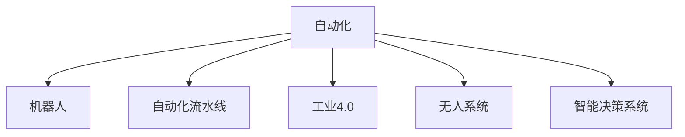

                 

# 自动化的未来发展与应用

## 1. 背景介绍

### 1.1 问题由来
在过去的几十年里，自动化技术已经从机械臂、自动化流水线发展到了人工智能(AI)、机器学习(ML)等高级形式。在当代，自动化正迅速渗透到各行各业，成为推动经济发展和社会进步的关键力量。特别是随着深度学习、自然语言处理等前沿技术的突破，自动化技术在各个领域的应用前景愈发广阔。自动化技术已经从简单的重复性任务处理，发展到能够处理复杂任务，甚至能够自主学习和决策。

### 1.2 问题核心关键点
本文将深入探讨自动化技术未来的发展方向和应用前景。自动化技术的应用主要涉及以下几个方面：

1. **工业自动化**：在制造业中，自动化技术能够显著提高生产效率，降低生产成本，减少人为误差。自动化技术包括机器人、自动化流水线、智能化控制系统等。
2. **交通自动化**：在交通领域，自动化技术能够改善道路安全，提高交通效率。自动驾驶技术是交通自动化的重要分支，已广泛应用于公交、物流等领域。
3. **医疗自动化**：在医疗领域，自动化技术能够提升诊断精度，提高治疗效率，减少医疗成本。智能诊断系统、自动化手术系统等都是医疗自动化的重要应用。
4. **金融自动化**：在金融领域，自动化技术能够提高交易速度，降低操作风险，增强数据分析能力。智能投顾、金融风控系统等都是金融自动化的典型应用。
5. **零售自动化**：在零售领域，自动化技术能够提高库存管理效率，提升客户服务质量。无人超市、智能推荐系统等都是零售自动化的重要应用。

### 1.3 问题研究意义
自动化技术的发展和应用对于提升生产效率、降低运营成本、增强用户体验具有重要意义。同时，自动化技术的应用也带来了诸多挑战，如就业问题、安全问题、隐私问题等。因此，深入研究自动化技术的未来发展方向和应用场景，对于促进技术进步和社会进步具有重要的理论和实践价值。

## 2. 核心概念与联系

### 2.1 核心概念概述

为了更好地理解自动化技术的发展和应用，本节将介绍几个密切相关的核心概念：

- **自动化(Automatication)**：指通过技术手段，自动完成某些工作任务的过程。自动化技术旨在提高工作效率，降低人力成本。
- **机器人(Robotics)**：指利用人工智能、计算机技术等技术手段，构建能够自主决策、执行任务的实体系统。机器人是自动化技术的重要分支。
- **自动化流水线(Assembly Line Automation)**：指在制造业中，通过自动控制设备、传送带等手段，实现材料加工、产品制造的自动化流程。
- **工业4.0**：指利用物联网、云计算、大数据、人工智能等技术，实现生产过程的数字化、网络化和智能化。工业4.0是自动化技术的高级形式。
- **无人系统(Unmanned Systems)**：指无需人工直接干预，能够在特定环境下自主执行任务的自动化系统。无人系统包括无人驾驶车辆、无人机、无人水面舰艇等。
- **智能决策系统(Intelligent Decision-Making System)**：指利用人工智能技术，自动分析数据、制定决策的系统。智能决策系统广泛应用于金融、医疗、交通等领域。

这些核心概念之间的逻辑关系可以通过以下Mermaid流程图来展示：



这个流程图展示了自动化技术的主要分支及其相互关系：

1. **自动化技术**是基础，涵盖了从机器人到智能决策系统等各个方面。
2. **机器人**是自动化技术的重要组成部分，能够在制造业、服务业等多个领域执行复杂的任务。
3. **自动化流水线**是自动化技术在制造业中的典型应用，能够实现高效、精确的生产过程。
4. **工业4.0**是自动化技术的高级形式，通过数字化、网络化、智能化实现更高层次的自动化。
5. **无人系统**能够执行更加复杂、多样化的任务，广泛应用于交通、环保、安全等领域。
6. **智能决策系统**通过人工智能技术，实现数据的自动分析、决策制定，是自动化技术的关键环节。

## 3. 核心算法原理 & 具体操作步骤
### 3.1 算法原理概述

自动化技术的发展离不开算法和计算能力的支持。本文将重点介绍基于深度学习的自动化技术，特别是其在工业自动化、交通自动化、医疗自动化、金融自动化和零售自动化中的应用。

### 3.2 算法步骤详解

以工业自动化为例，基于深度学习的自动化技术通常包括以下几个关键步骤：

**Step 1: 数据收集与预处理**
- 收集工厂生产过程中的数据，包括传感器数据、设备状态数据、工艺参数数据等。
- 对数据进行清洗、去噪、归一化等预处理操作。

**Step 2: 模型训练**
- 选择合适的深度学习模型，如卷积神经网络(CNN)、长短期记忆网络(LSTM)等。
- 划分训练集、验证集和测试集，使用训练集训练模型。
- 调整模型超参数，如学习率、批大小、迭代轮数等，以提高模型性能。

**Step 3: 模型评估与优化**
- 在验证集上评估模型性能，使用指标如准确率、召回率、F1分数等。
- 根据评估结果，调整模型参数，优化模型性能。

**Step 4: 模型部署**
- 将训练好的模型部署到生产环境中。
- 在实际生产中，实时采集数据，使用模型进行预测和决策。

### 3.3 算法优缺点

自动化技术的发展为各行各业带来了巨大的效益，但也存在一些问题和挑战：

**优点**：
1. **提高效率**：自动化技术能够显著提高生产、服务效率，减少人力成本。
2. **降低成本**：自动化技术减少了人为操作带来的错误和损失，提高了资源利用效率。
3. **增强灵活性**：自动化技术能够快速适应环境变化，实现任务灵活调整。
4. **提升用户体验**：自动化技术能够提供更加精准、高效的服务，提升用户体验。

**缺点**：
1. **初始成本高**：自动化技术的开发和部署需要较高的初始投资。
2. **技术复杂度高**：自动化技术的实现和维护需要专业知识和技能。
3. **数据依赖性强**：自动化技术的效果很大程度上依赖于数据的质量和数量。
4. **就业影响**：自动化技术的发展可能对某些工种产生替代效应，导致就业问题。

### 3.4 算法应用领域

自动化技术在多个领域中具有广泛的应用，以下是几个典型应用场景：

- **制造业**：自动化技术广泛应用于机器人制造、自动化生产线、质量检测等领域。例如，使用深度学习模型进行质量检测和缺陷分类。
- **农业**：自动化技术能够提高农业生产效率，实现精准农业。例如，使用无人机进行农作物监测和病虫害检测。
- **交通**：自动化技术在交通领域的应用包括自动驾驶、智能交通信号控制等。例如，使用深度学习模型进行交通流量预测和交通信号优化。
- **医疗**：自动化技术在医疗领域的应用包括智能诊断、手术辅助等。例如，使用深度学习模型进行医学影像分析和疾病预测。
- **金融**：自动化技术在金融领域的应用包括智能投顾、金融风险控制等。例如，使用深度学习模型进行股票交易策略优化和信用风险评估。
- **零售**：自动化技术在零售领域的应用包括智能推荐、库存管理等。例如，使用深度学习模型进行客户行为分析和个性化推荐。

## 4. 数学模型和公式 & 详细讲解 & 举例说明

### 4.1 数学模型构建

基于深度学习的自动化技术通常使用神经网络模型进行建模。以工业自动化为例，假设工厂生产线上的传感器数据为 $\{x_1, x_2, ..., x_n\}$，设备状态数据为 $\{y_1, y_2, ..., y_n\}$，工艺参数数据为 $\{z_1, z_2, ..., z_n\}$。设 $f(x; \theta)$ 为深度学习模型，其中 $\theta$ 为模型参数。

目标是在训练集 $\mathcal{D}=\{(x_1, y_1), (x_2, y_2), ..., (x_n, y_n)\}$ 上最小化损失函数 $\mathcal{L}$，即：

$$
\min_{\theta} \mathcal{L}(f(x; \theta))
$$

常用的损失函数包括均方误差损失、交叉熵损失等。

### 4.2 公式推导过程

以均方误差损失为例，其计算公式为：

$$
\mathcal{L}(f(x; \theta)) = \frac{1}{N} \sum_{i=1}^N (y_i - f(x_i; \theta))^2
$$

其中 $y_i$ 为设备状态数据，$f(x_i; \theta)$ 为模型预测结果。

在实际应用中，可以使用反向传播算法对模型进行训练，计算梯度并更新参数。例如，使用梯度下降算法更新参数 $\theta$：

$$
\theta \leftarrow \theta - \eta \nabla_{\theta} \mathcal{L}(f(x; \theta))
$$

其中 $\eta$ 为学习率，$\nabla_{\theta} \mathcal{L}(f(x; \theta))$ 为损失函数对模型参数的梯度。

### 4.3 案例分析与讲解

以智能工厂为例，可以使用深度学习模型对传感器数据进行实时分析，预测设备状态和工艺参数。具体步骤如下：

1. 收集传感器数据 $x_1, x_2, ..., x_n$。
2. 使用深度学习模型 $f(x; \theta)$ 对传感器数据进行预测，得到设备状态 $y_1, y_2, ..., y_n$ 和工艺参数 $z_1, z_2, ..., z_n$。
3. 将预测结果与实际设备状态和工艺参数进行对比，计算损失函数 $\mathcal{L}(f(x; \theta))$。
4. 使用梯度下降算法更新模型参数 $\theta$，最小化损失函数。
5. 在生产环境中，实时采集传感器数据，使用模型进行预测和决策。

通过深度学习模型，可以实现设备状态的实时预测和优化，提高生产效率和产品质量。

## 5. 项目实践：代码实例和详细解释说明

### 5.1 开发环境搭建

在进行深度学习项目开发时，需要搭建适合的环境。以下是使用Python进行TensorFlow开发的开发环境配置流程：

1. 安装Anaconda：从官网下载并安装Anaconda，用于创建独立的Python环境。
2. 创建并激活虚拟环境：
```bash
conda create -n tensorflow-env python=3.8 
conda activate tensorflow-env
```

3. 安装TensorFlow：根据CUDA版本，从官网获取对应的安装命令。例如：
```bash
conda install tensorflow -c tf -c conda-forge
```

4. 安装Pandas、Numpy、Matplotlib等工具包：
```bash
pip install pandas numpy matplotlib scikit-learn tensorboard
```

5. 安装TensorFlow可视化工具：
```bash
pip install tensorflow-probability tensorflow-addons
```

完成上述步骤后，即可在`tensorflow-env`环境中开始深度学习项目开发。

### 5.2 源代码详细实现

下面以工业自动化中的质量检测为例，给出使用TensorFlow进行模型训练的代码实现。

```python
import tensorflow as tf
import numpy as np
import pandas as pd

# 读取数据
data = pd.read_csv('data.csv')

# 数据预处理
X = data.iloc[:, :-1].values
y = data.iloc[:, -1].values

# 数据标准化
X = (X - np.mean(X)) / np.std(X)

# 划分训练集和测试集
X_train, X_test, y_train, y_test = train_test_split(X, y, test_size=0.2, random_state=42)

# 定义模型
model = tf.keras.Sequential([
    tf.keras.layers.Dense(64, activation='relu', input_shape=(X_train.shape[1],)),
    tf.keras.layers.Dense(64, activation='relu'),
    tf.keras.layers.Dense(1, activation='sigmoid')
])

# 编译模型
model.compile(optimizer='adam', loss='binary_crossentropy', metrics=['accuracy'])

# 训练模型
model.fit(X_train, y_train, epochs=10, batch_size=32, validation_data=(X_test, y_test))

# 模型评估
loss, accuracy = model.evaluate(X_test, y_test)
print(f'Test Loss: {loss}, Test Accuracy: {accuracy}')
```

这段代码实现了使用TensorFlow进行二分类问题的深度学习模型训练。具体步骤如下：

1. 读取数据，并进行预处理。
2. 定义神经网络模型，包括两个全连接层和一个输出层。
3. 编译模型，设置优化器、损失函数和评估指标。
4. 使用训练集训练模型，并在测试集上评估模型性能。

### 5.3 代码解读与分析

这段代码中，我们使用了TensorFlow库来实现深度学习模型的训练。以下是对关键代码的详细解读：

- `train_test_split`函数：用于将数据集划分为训练集和测试集。
- `Sequential`模型：用于构建序列化的神经网络模型。
- `Dense`层：用于定义全连接层。
- `compile`函数：用于编译模型，设置优化器、损失函数和评估指标。
- `fit`函数：用于训练模型，并设置训练轮数、批次大小等超参数。
- `evaluate`函数：用于在测试集上评估模型性能。

这段代码展示了深度学习模型训练的基本流程，包括数据预处理、模型定义、模型编译、模型训练和模型评估。通过这些步骤，我们能够构建和训练深度学习模型，并将其应用于自动化技术中。

## 6. 实际应用场景

### 6.1 智能工厂

在智能工厂中，深度学习模型被广泛用于质量检测、设备状态预测、工艺参数优化等场景。具体应用包括：

- **质量检测**：使用深度学习模型对生产线上的产品质量进行实时检测和分类。例如，使用CNN模型对图像中的缺陷进行识别。
- **设备状态预测**：使用深度学习模型对设备状态进行预测，提前发现故障并采取措施。例如，使用LSTM模型对设备振动数据进行时间序列分析。
- **工艺参数优化**：使用深度学习模型对生产过程中的工艺参数进行优化，提高产品质量和生产效率。例如，使用GAN模型对工艺参数进行生成和优化。

### 6.2 智慧农业

在智慧农业中，深度学习模型被广泛用于农作物监测、病虫害检测、产量预测等场景。具体应用包括：

- **农作物监测**：使用深度学习模型对农作物生长状态进行实时监测和分析。例如，使用CNN模型对农作物图像进行分类和识别。
- **病虫害检测**：使用深度学习模型对农田中的病虫害进行检测和分类。例如，使用RNN模型对传感器数据进行时序分析。
- **产量预测**：使用深度学习模型对农作物的产量进行预测和优化。例如，使用LSTM模型对气候数据进行时间序列分析。

### 6.3 自动驾驶

在自动驾驶中，深度学习模型被广泛用于道路环境感知、目标检测、路径规划等场景。具体应用包括：

- **道路环境感知**：使用深度学习模型对道路环境进行感知和分析。例如，使用CNN模型对道路图像进行分类和识别。
- **目标检测**：使用深度学习模型对道路上的行人、车辆等目标进行检测和分类。例如，使用YOLO模型对道路图像进行目标检测。
- **路径规划**：使用深度学习模型对驾驶路径进行规划和优化。例如，使用RNN模型对驾驶数据进行时序分析。

### 6.4 金融风控

在金融风控中，深度学习模型被广泛用于信用评分、风险评估、欺诈检测等场景。具体应用包括：

- **信用评分**：使用深度学习模型对客户的信用行为进行评分和分析。例如，使用CNN模型对客户的交易记录进行分类和识别。
- **风险评估**：使用深度学习模型对客户的风险进行评估和预测。例如，使用LSTM模型对客户的交易数据进行时序分析。
- **欺诈检测**：使用深度学习模型对交易行为进行欺诈检测和分类。例如，使用GAN模型对交易数据进行生成和分类。

### 6.5 零售推荐

在零售推荐中，深度学习模型被广泛用于客户行为分析、个性化推荐、库存管理等场景。具体应用包括：

- **客户行为分析**：使用深度学习模型对客户的购买行为进行分析和分类。例如，使用CNN模型对客户的购买记录进行分类和识别。
- **个性化推荐**：使用深度学习模型对客户的个性化需求进行推荐。例如，使用LSTM模型对客户的浏览行为进行时序分析。
- **库存管理**：使用深度学习模型对库存进行管理和优化。例如，使用RNN模型对销售数据进行时序分析。

## 7. 工具和资源推荐

### 7.1 学习资源推荐

为了帮助开发者系统掌握深度学习技术的应用，这里推荐一些优质的学习资源：

1. 《深度学习》系列书籍：由深度学习领域的专家编写，涵盖深度学习的基础、算法、应用等方面。
2. Coursera《深度学习》课程：由斯坦福大学Andrew Ng教授讲授的深度学习课程，内容全面，实践性强。
3. Udacity《深度学习纳米学位》课程：涵盖深度学习的理论基础和实践技能，注重项目实践。
4. PyTorch官方文档：提供丰富的深度学习模型和算法示例，适合初学者快速上手。
5. TensorFlow官方文档：提供完整的深度学习模型和算法实现，适合中高级开发者深入学习。
6. GitHub深度学习项目：包含大量开源深度学习项目，适合学习者参考和实践。

通过对这些资源的学习实践，相信你一定能够快速掌握深度学习技术，并将其应用于自动化技术的各个领域。

### 7.2 开发工具推荐

高效的开发离不开优秀的工具支持。以下是几款用于深度学习开发的工具：

1. PyTorch：基于Python的开源深度学习框架，灵活的动态计算图，适合快速迭代研究。
2. TensorFlow：由Google主导开发的开源深度学习框架，生产部署方便，适合大规模工程应用。
3. Keras：基于TensorFlow和Theano的高级深度学习框架，易于上手，适合初学者使用。
4. Jupyter Notebook：交互式的数据科学和机器学习开发环境，支持Python、R、Julia等多种语言。
5. Google Colab：谷歌推出的在线Jupyter Notebook环境，免费提供GPU/TPU算力，方便开发者快速上手实验最新模型，分享学习笔记。

合理利用这些工具，可以显著提升深度学习项目的开发效率，加快创新迭代的步伐。

### 7.3 相关论文推荐

深度学习技术的发展源于学界的持续研究。以下是几篇奠基性的相关论文，推荐阅读：

1. LeCun Y., Bottou L., Bengio Y., Haffner P., Elman J., & Ballard W. (1998). Gradient-based learning applied to document recognition. Proceedings of the IEEE, 86(11), 2278-2324.
2. Hinton G. E., Osindero S., & Teh Y. W. (2006). A fast learning algorithm for deep belief nets. Neural Computation, 18(7), 1527-1554.
3. Krizhevsky A., Sutskever I., & Hinton G. E. (2012). ImageNet classification with deep convolutional neural networks. Advances in neural information processing systems, 25(1), 1097-1105.
4. Sutskever I., Vinyals O., & Le Q. V. (2014). Sequence to sequence learning with neural networks. Advances in Neural Information Processing Systems, 27(1), 3104-3112.
5. Goodfellow I., Bengio Y., & Courville A. (2016). Deep learning. MIT Press.
6. He K., Zhang X., Ren S., & Sun J. (2016). Deep residual learning for image recognition. In Proceedings of the IEEE Conference on Computer Vision and Pattern Recognition (pp. 770-778).

这些论文代表了大规模深度学习技术的发展脉络。通过学习这些前沿成果，可以帮助研究者把握学科前进方向，激发更多的创新灵感。

## 8. 总结：未来发展趋势与挑战

### 8.1 研究成果总结

本文对自动化技术的发展和应用进行了全面系统的介绍。自动化技术的应用不仅提高了各行各业的生产效率，还在智能化、自动化方面迈出了重要步伐。基于深度学习的自动化技术，能够实现更高效、精准、灵活的自动化操作，提升了各行各业的核心竞争力。

### 8.2 未来发展趋势

展望未来，自动化技术的发展趋势将主要体现在以下几个方面：

1. **技术融合**：自动化技术将与物联网、人工智能、大数据等技术深度融合，形成更加智能、高效的自动化系统。例如，工业4.0中的智能制造、智慧农业中的精准农业等。
2. **边缘计算**：自动化系统将更多地采用边缘计算技术，减少对中心服务器的依赖，提高数据处理效率和系统可靠性。例如，智能工厂中的工业边缘计算、智能交通中的边缘计算等。
3. **人机协同**：自动化系统将更多地考虑人机协同，提高系统的可解释性和可控性。例如，自动驾驶中的人机协同决策、智慧农业中的人机协同监测等。
4. **跨领域应用**：自动化技术将更多地应用于不同领域，如医疗、教育、文化等，形成跨领域的自动化应用。例如，智慧医疗中的智能诊断系统、智能教育中的个性化推荐系统等。
5. **可持续发展**：自动化技术将更多地考虑环境、资源等因素，推动可持续发展。例如，智能交通中的绿色出行、智能制造中的节能减排等。

### 8.3 面临的挑战

尽管自动化技术的发展前景广阔，但在实现过程中仍面临诸多挑战：

1. **技术复杂度**：自动化技术的实现需要较高的技术门槛，尤其是在深度学习模型训练和部署方面。
2. **数据质量和数量**：自动化技术的性能很大程度上依赖于数据的质量和数量，获取高质量的数据是关键。
3. **安全性与隐私**：自动化技术的应用需要考虑数据安全性和隐私保护，防止数据泄露和滥用。
4. **成本问题**：自动化技术的开发和部署需要较高的初始投资，企业需要权衡成本和效益。
5. **标准化问题**：自动化技术的应用需要统一的标准和规范，防止技术壁垒和数据孤岛。

### 8.4 研究展望

自动化技术的未来研究将主要聚焦以下几个方向：

1. **模型优化**：优化深度学习模型，提高模型效率和精度。例如，引入稀疏化技术、模型压缩技术等。
2. **数据增强**：利用数据增强技术，提高模型泛化能力。例如，利用数据生成技术、迁移学习技术等。
3. **跨模态学习**：将不同模态的数据进行融合，提高模型对复杂场景的理解能力。例如，将视觉、听觉、文本等多模态数据进行融合。
4. **人机交互**：提高自动化系统的人机交互能力，增强系统的可解释性和可控性。例如，利用自然语言处理技术实现人机交互。
5. **跨领域应用**：推动自动化技术在跨领域的应用，提升自动化系统的普适性和通用性。例如，将自动化技术应用于教育、文化等领域。

## 9. 附录：常见问题与解答

**Q1: 自动化技术对就业有何影响？**

A: 自动化技术的发展可能会对某些工种产生替代效应，导致就业问题。然而，自动化技术也创造了新的就业机会，如技术开发、系统维护、数据分析等。通过培训和教育，劳动者可以逐步适应新技术，实现从传统工种向高技能工种的转型。

**Q2: 自动化技术是否会降低人类的创造力？**

A: 自动化技术的应用可能会降低某些重复性工作的劳动强度，使人类能够将更多时间和精力投入到创造性工作中。然而，自动化技术也需要人类的监督和维护，这需要更高的技术水平和创造力。因此，自动化技术可能会激发人类的创造力，使其能够更好地应对复杂问题。

**Q3: 自动化技术是否会引发数据隐私和安全问题？**

A: 自动化技术的应用需要大量的数据，这可能会引发数据隐私和安全问题。为解决这些问题，需要采取一系列技术和管理措施，如数据加密、访问控制、隐私保护等。只有确保数据的安全性和隐私性，才能确保自动化技术的可持续应用。

**Q4: 自动化技术是否会导致资源浪费？**

A: 自动化技术的应用能够提高资源利用效率，减少浪费。例如，智能制造中的生产过程优化、智慧农业中的资源高效利用等。然而，自动化技术的部署和维护也需要资源，需要权衡成本和效益。

**Q5: 自动化技术是否会降低人类的工作满意度？**

A: 自动化技术的应用可能会提高工作效率，减少劳动强度，提升工作满意度。然而，自动化技术也可能导致某些工作岗位的消失，引起就业问题。因此，在推广自动化技术的同时，需要关注员工的职业发展和再培训，确保其工作满意度和生活质量。

总之，自动化技术的发展和应用是一个复杂的系统工程，需要各方面的综合考虑和努力。只有通过技术创新、政策引导、社会共识等多方面的协同，才能真正实现自动化技术的可持续发展，推动人类社会的进步和繁荣。

---

作者：禅与计算机程序设计艺术 / Zen and the Art of Computer Programming

