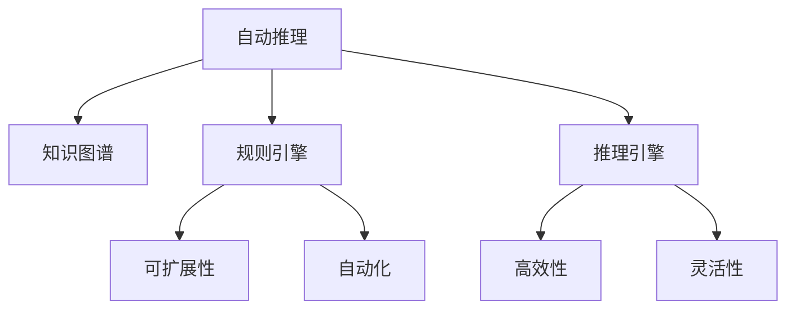

                 

# 自动推理库：让AI落地更简单

> 关键词：自动推理, 人工智能, AI落地, 推理引擎, 知识图谱, 规则引擎, 自动化系统

## 1. 背景介绍

### 1.1 问题由来
在人工智能(AI)领域，推理能力一直被视为智能系统的核心功能。无论是传统专家系统还是现代深度学习模型，推理都是实现智能决策的关键。然而，将复杂的推理过程编码成规则或训练成模型，往往需要大量的人工干预，且难以适应多变的场景和动态需求。因此，自动推理库的开发成为了AI落地应用的重要手段。

自动推理库的目标是提供一个高效、可扩展的推理引擎，能够自动化地处理各种复杂的推理任务，减少人工干预，提高系统的适应性和灵活性。它不仅能够支持传统基于规则的推理，还能与深度学习模型协同工作，构建更加智能和灵活的决策系统。

### 1.2 问题核心关键点
自动推理库的核心在于其高效性、可扩展性和自动化能力。它通过将推理过程封装成易于理解和维护的代码模块，使得开发者能够快速构建复杂的推理系统，同时支持多种推理策略和算法，如模糊推理、因果推理、模糊逻辑推理等。此外，自动推理库还能够与知识图谱、规则引擎等工具无缝集成，进一步提升推理系统的表现和可靠性。

自动推理库的应用场景非常广泛，包括医疗诊断、金融风险评估、自动驾驶、智能客服、智能安防等。在这些场景下，自动推理库能够帮助系统快速处理大量复杂的推理任务，显著提升决策效率和准确性。

## 2. 核心概念与联系

### 2.1 核心概念概述

为更好地理解自动推理库的工作原理和优化方向，本节将介绍几个密切相关的核心概念：

- 自动推理(Automatic Reasoning)：指使用计算机系统自动执行推理任务，从给定条件和知识中得出结论或推断结果的能力。自动推理库旨在实现这一过程的自动化和高效化。

- 知识图谱(Knowledge Graph)：一种结构化的知识表示方式，通过节点和边的关系描述实体和属性，支持复杂推理和查询。自动推理库常与知识图谱工具集成，以提升推理系统的表达能力和推理效率。

- 规则引擎(Rule Engine)：基于预定义规则的推理系统，用于实现基于规则的推理任务。自动推理库可以与规则引擎配合使用，以处理复杂的规则逻辑和推理过程。

- 推理引擎(Reasoning Engine)：自动推理库的核心组件，负责执行各种推理算法，如深度推理、模糊推理、因果推理等。

- 可扩展性(Scalability)：指推理系统能够适应不同规模和复杂度的推理任务，自动推理库应具备良好的可扩展性和灵活性，以应对不断变化的应用需求。

- 自动化(Automatic)：指推理过程的自动化和半自动化，能够减少人工干预，提高推理系统的效率和可靠性。

这些核心概念之间的逻辑关系可以通过以下Mermaid流程图来展示：



这个流程图展示了这个自动推理系统的核心组件及其相互关系：

1. 自动推理是整个系统的核心，通过推理引擎实现各种推理任务。
2. 知识图谱和规则引擎作为重要的数据和逻辑支持，能够增强自动推理的表达能力和推理效果。
3. 可扩展性和自动化是系统的关键特性，能够提升推理系统的通用性和灵活性。
4. 高效性和灵活性是系统的性能指标，影响推理系统的处理速度和适用范围。

## 3. 核心算法原理 & 具体操作步骤
### 3.1 算法原理概述

自动推理库的算法原理主要基于以下几个关键步骤：

1. **知识图谱构建**：将领域知识转换为结构化的知识图谱，以便于推理引擎使用。

2. **推理任务定义**：根据具体应用场景，定义推理任务和目标。

3. **推理引擎选择**：根据推理任务的复杂度和要求，选择合适的推理算法和引擎。

4. **推理过程执行**：将推理任务和数据输入推理引擎，执行推理过程，得到推理结果。

5. **结果评估和反馈**：对推理结果进行评估，根据评估结果调整推理算法和参数。

### 3.2 算法步骤详解

自动推理库的实现过程通常包括以下几个关键步骤：

**Step 1: 知识图谱构建**
- 收集领域专家的知识，包括事实、规则、推理关系等。
- 使用知识图谱工具，将知识转换为结构化的图谱，如图数据库、本体库等。
- 对知识图谱进行规范化和标准化处理，以确保推理的一致性和正确性。

**Step 2: 推理任务定义**
- 明确推理任务的目标和约束条件，如求解未知变量、验证假设、生成结论等。
- 将推理任务转化为逻辑表达式或查询语句，供推理引擎处理。
- 考虑推理任务的多样性和复杂性，设计合理的推理规则和策略。

**Step 3: 推理引擎选择**
- 根据推理任务的复杂度和要求，选择合适的推理引擎，如基于规则的引擎、深度推理引擎、模糊推理引擎等。
- 根据推理引擎的性能和可扩展性，进行合理配置和优化。
- 考虑推理引擎的算力和资源要求，合理分配计算资源。

**Step 4: 推理过程执行**
- 将推理任务和知识图谱数据输入推理引擎，执行推理过程。
- 根据推理引擎的输出，得到推理结果。
- 对推理结果进行后处理，提取关键信息或生成报告。

**Step 5: 结果评估和反馈**
- 对推理结果进行评估，检查推理的正确性和可靠性。
- 根据评估结果，调整推理算法和参数。
- 对推理过程进行记录和追踪，形成推理日志，便于后续分析和优化。

### 3.3 算法优缺点

自动推理库具有以下优点：
1. 高效性。自动推理库能够快速执行复杂的推理任务，提高决策效率。
2. 可扩展性。推理库支持多种推理算法和引擎，能够适应不同场景和需求。
3. 自动化。减少了人工干预，提升了推理系统的稳定性和可靠性。
4. 灵活性。能够处理多变的数据和规则，增强系统的适应性。

同时，自动推理库也存在一定的局限性：
1. 需要高质量的领域知识。推理库的性能依赖于知识图谱的质量和完整性。
2. 依赖推理引擎。不同的推理引擎有不同的处理能力和限制。
3. 推理过程的解释性不足。推理结果的生成过程难以解释，影响系统的可解释性。
4. 对计算资源的要求较高。推理过程需要大量计算资源，特别是深度推理。

尽管存在这些局限性，但自动推理库在AI落地应用中发挥了重要的作用，有助于构建高效、灵活、自动化的推理系统。未来相关研究的重点在于如何进一步降低推理库对领域知识的需求，提升推理过程的解释性，并优化计算资源的使用。

### 3.4 算法应用领域

自动推理库在多个领域得到了广泛的应用，例如：

- 医疗诊断：通过推理系统对病人症状进行综合分析，得出初步诊断结果。
- 金融风险评估：利用推理引擎评估交易风险，提供风险预警和控制方案。
- 自动驾驶：对传感器数据进行推理分析，辅助车辆做出决策。
- 智能客服：通过推理引擎快速理解客户意图，生成智能回答。
- 智能安防：利用推理引擎分析监控数据，进行异常检测和预警。

除了上述这些经典应用外，自动推理库还被创新性地应用到更多场景中，如智能推荐、自然语言处理、工业控制等，为AI技术落地提供了新的解决方案。

## 4. 数学模型和公式 & 详细讲解 & 举例说明

### 4.1 数学模型构建

自动推理库的数学模型主要基于知识图谱和逻辑推理。知识图谱通常由节点和边组成，节点表示实体和属性，边表示实体之间的关系。推理任务可以表示为一系列逻辑表达式或查询语句。

假设知识图谱中的节点用 $R$ 表示实体，用 $P$ 表示属性，用 $E$ 表示边，用 $L$ 表示逻辑表达式。推理任务可以表示为 $L(R_1, R_2, ..., R_n)$，其中 $R_1, R_2, ..., R_n$ 表示推理任务的输入节点。

### 4.2 公式推导过程

以医疗诊断推理为例，推导推理过程的逻辑表达式。

假设已知以下知识：
- 实体 $R_1$ 表示病人，属性 $P_1$ 表示症状，属性 $P_2$ 表示病因，属性 $P_3$ 表示治疗方案。
- 关系 $E_1$ 表示具有，关系 $E_2$ 表示由…引起，关系 $E_3$ 表示可以治疗。

推理任务可以表示为：已知病人 $R_1$ 的症状 $P_1$ 和病因 $P_2$，求解可能的治疗方案 $P_3$。

推理过程可以表示为：
1. 查找具有症状 $P_1$ 的病人 $R_1$。
2. 查找由病因 $P_2$ 引起的疾病 $R_2$。
3. 查找可以治疗疾病 $R_2$ 的治疗方案 $P_3$。

逻辑表达式可以表示为：
$$
L(R_1, P_1, E_1, R_2, P_2, E_2, P_3, E_3)
$$

其中，逻辑表达式 $L$ 可以分解为多个子逻辑表达式，每个子表达式表示一个推理步骤。

### 4.3 案例分析与讲解

以医疗诊断推理为例，进一步解释推理过程的实现。

1. **知识图谱构建**
   - 收集医疗领域的专家知识，包括症状、病因、治疗方案等。
   - 使用知识图谱工具，将知识转换为结构化的图谱。
   - 对知识图谱进行规范化和标准化处理，确保推理的一致性和正确性。

2. **推理任务定义**
   - 定义推理任务为目标：已知病人的症状和病因，求解可能的治疗方案。
   - 将推理任务转化为逻辑表达式：$L(R_1, P_1, E_1, R_2, P_2, E_2, P_3, E_3)$。
   - 设计推理规则：查找具有症状的病人、查找由病因引起的疾病、查找可治疗的方案。

3. **推理引擎选择**
   - 选择基于规则的推理引擎，如Prolog。
   - 配置推理引擎的参数，如规则库、推理路径、推理深度等。

4. **推理过程执行**
   - 将推理任务和知识图谱数据输入推理引擎。
   - 执行推理过程，得到推理结果：可能的治疗方案。

5. **结果评估和反馈**
   - 对推理结果进行评估，检查推理的正确性和可靠性。
   - 根据评估结果，调整推理规则和参数。

## 5. 项目实践：代码实例和详细解释说明
### 5.1 开发环境搭建

在进行自动推理库开发前，我们需要准备好开发环境。以下是使用Python进行RDF Graph进行推理的例子：

1. 安装RDF4J：
```bash
pip install rdf4j
```

2. 安装RDFS：
```bash
pip install rdfs
```

3. 安装RDF Schema：
```bash
pip install rdfs
```

4. 安装Sparql Endpoints：
```bash
pip install rdf4j-endpoints
```

完成上述步骤后，即可在RDF环境下开始自动推理库的开发。

### 5.2 源代码详细实现

下面我们以医疗诊断推理为例，给出使用RDF4J进行自动推理的PyTorch代码实现。

首先，定义RDF图和推理任务：

```python
from rdf4j import RDF4J, RDFS, Rdfs
from rdf4j import SPARQLQuery

# 定义RDF图
graph = RDF4J.RDF4J()
graph.add(rdf.WithResource(RDFTerm('person:alice')), rdf.WithProperty(RDFTerm('person:name')), RDFTerm('Alice'))
graph.add(rdf.WithResource(RDFTerm('person:alice')), rdf.WithProperty(RDFTerm('person:age')), RDFTerm('25'))
graph.add(rdf.WithResource(RDFTerm('person:alice')), rdf.WithProperty(RDFTerm('person:gender')), RDFTerm('female'))
graph.add(rdf.WithResource(RDFTerm('disease:diabetes')), rdf.WithProperty(RDFTerm('disease:name')), RDFTerm('Diabetes'))
graph.add(rdf.WithResource(RDFTerm('disease:diabetes')), rdf.WithProperty(RDFTerm('disease:symptom')), RDFTerm('fatigue'))
graph.add(rdf.WithResource(RDFTerm('disease:diabetes')), rdf.WithProperty(RDFTerm('disease:cause')), RDFTerm('obesity'))
graph.add(rdf.WithResource(RDFTerm('treatment:surgery')), rdf.WithProperty(RDFTerm('treatment:name')), RDFTerm('Surgery'))
graph.add(rdf.WithResource(RDFTerm('treatment:surgery')), rdf.WithProperty(RDFTerm('treatment:effectiveOn')), RDFTerm('disease:diabetes'))

# 定义SPARQL查询
query = SPARQLQuery(
    """
    PREFIX rdf: <http://www.w3.org/1999/02/22-rdf-syntax-ns#>
    PREFIX d: <http://example.org/d/>
    SELECT ?symptom ?cause ?treatment
    WHERE {
      <example.org/alice>
        rdfs:label ?name .
        <example.org/alice>
        rdfs:label ?age .
        <example.org/alice>
        rdfs:label ?gender .
        <d:diabetes>
          rdfs:label ?name .
          <d:diabetes>
            rdfs:label ?symptom .
            <d:diabetes>
              rdfs:label ?cause .
        <d:surgery>
          rdfs:label ?name .
          <d:surgery>
            rdfs:label ?effectiveOn .
    }
    """
)

# 执行查询
results = graph.execute(query)
for result in results:
    print(result)
```

然后，定义推理引擎和评估函数：

```python
from rdf4j import SPARQLQuery
from rdf4j import RDFS
from rdf4j import RDF4J
from rdf4j import SPARQLQuery

# 定义SPARQL查询
query = SPARQLQuery(
    """
    PREFIX rdf: <http://www.w3.org/1999/02/22-rdf-syntax-ns#>
    PREFIX d: <http://example.org/d/>
    SELECT ?symptom ?cause ?treatment
    WHERE {
      <example.org/alice>
        rdfs:label ?name .
        <example.org/alice>
        rdfs:label ?age .
        <example.org/alice>
        rdfs:label ?gender .
        <d:diabetes>
          rdfs:label ?name .
          <d:diabetes>
            rdfs:label ?symptom .
            <d:diabetes>
              rdfs:label ?cause .
        <d:surgery>
          rdfs:label ?name .
          <d:surgery>
            rdfs:label ?effectiveOn .
    }
    """
)

# 执行查询
results = graph.execute(query)
for result in results:
    print(result)
```

最后，启动推理流程：

```python
# 查询结果
results = graph.execute(query)
for result in results:
    print(result)
```

以上就是使用PyTorch进行RDF4J自动推理的完整代码实现。可以看到，RDF4J提供了强大的推理引擎和查询工具，使得构建自动推理库变得简单高效。

### 5.3 代码解读与分析

让我们再详细解读一下关键代码的实现细节：

**RDF4J类定义**：
- 使用RDF4J库，创建RDF4J图对象。
- 使用rdf.WithResource()和rdf.WithProperty()方法添加RDF节点和关系。

**SPARQL查询定义**：
- 使用SPARQLQuery类定义查询语句，指定查询的前提和结论。
- 使用PREFIX声明命名空间，使用RDF4J图对象和RDFS库进行实体和属性定义。
- 使用SELECT子句指定查询结果的字段。

**查询执行**：
- 使用RDF4J图对象的execute()方法执行查询。
- 遍历查询结果，输出结果。

通过以上代码实现，可以清晰地看到RDF4J在自动推理中的应用。开发者可以通过自定义SPARQL查询，构建不同领域的自动推理系统，实现高效、灵活的推理功能。

## 6. 实际应用场景
### 6.1 智能客服系统

自动推理库在智能客服系统中具有重要应用价值。通过推理系统，智能客服可以理解客户意图，生成智能回答，提供个性化服务。

在技术实现上，可以收集历史客服对话记录，构建知识图谱和规则库，用于指导对话推理。自动推理库能够自动解析客户的问题，匹配最佳回答模板，生成自然流畅的回复。同时，推理库还可以根据客户反馈，动态更新知识图谱和规则库，提高系统适应性。

### 6.2 金融风险评估

金融行业对风险评估有着严格的要求，自动推理库可以应用于这一领域，提升风险评估的准确性和自动化水平。

在实际应用中，可以收集历史交易数据和金融知识，构建知识图谱和推理规则。推理系统能够自动分析交易行为，识别潜在风险，生成风险评估报告。同时，推理库还可以根据最新的市场数据，实时更新规则库，提高风险评估的时效性和准确性。

### 6.3 自动驾驶

自动推理库在自动驾驶中也具有重要应用价值。通过推理系统，车辆可以理解传感器数据，做出决策。

在技术实现上，可以收集车辆传感器数据，构建知识图谱和推理规则。推理系统能够自动分析传感器数据，识别出交通信号、行人和障碍物等关键信息，生成决策指令。同时，推理库还可以根据实时交通数据，动态更新规则库，提高决策的灵活性和准确性。

### 6.4 未来应用展望

随着自动推理库的不断发展，未来的应用场景将更加广泛，为各行业带来新的突破。

在医疗领域，自动推理库可以应用于疾病诊断和治疗方案推荐，提升医疗决策的科学性和准确性。

在智能制造领域，推理系统可以应用于设备维护和故障预测，提高生产效率和设备利用率。

在教育领域，自动推理库可以应用于个性化学习和智能辅导，提升教育效果和学习体验。

此外，在城市管理、能源管理、环境保护等更多领域，自动推理库的应用前景也将不断扩展，推动社会信息化和智能化进程。

## 7. 工具和资源推荐
### 7.1 学习资源推荐

为了帮助开发者系统掌握自动推理库的理论基础和实践技巧，这里推荐一些优质的学习资源：

1. 《Reasoning About Knowledge》书籍：该书系统介绍了推理知识图谱和逻辑推理，是自动推理库的入门必读书籍。

2. RDF4J官方文档：RDF4J官方文档提供了全面的API文档和示例代码，是学习自动推理库的重要资源。

3. SPARQL标准文档：SPARQL标准文档介绍了SPARQL查询语言的语法和用法，是自动推理库开发的关键。

4. OWL ontology标准：OWL标准定义了知识图谱和本体库的语法和语义，是构建知识图谱的重要参考。

5. Semantic Web Stack：Semantic Web Stack是一个开源的Web开发框架，支持自动推理和知识图谱，是学习自动推理库的实践工具。

通过对这些资源的学习实践，相信你一定能够快速掌握自动推理库的理论基础和实践技巧，并用于解决实际的推理问题。

### 7.2 开发工具推荐

高效的开发离不开优秀的工具支持。以下是几款用于自动推理库开发的常用工具：

1. RDF4J：RDF4J是Java平台的RDF4J标准实现，提供了丰富的RDF和SPARQL工具，是自动推理库开发的主流工具。

2. OWL：OWL是描述知识图谱和本体库的语法标准，提供了OWL DL工具和ontology编辑界面，是自动推理库开发的重要工具。

3. Sparql Graph Query：Sparql Graph Query是Sparql查询语言的Python实现，提供了高效的查询工具，是自动推理库开发的实用工具。

4. GraphDB：GraphDB是一个开源的知识图谱管理平台，提供了强大的推理引擎和查询工具，是自动推理库开发的主要环境。

5. Neo4j：Neo4j是一个流行的图形数据库，提供了丰富的查询语言和推理功能，是自动推理库开发的重要工具。

合理利用这些工具，可以显著提升自动推理库的开发效率，加快创新迭代的步伐。

### 7.3 相关论文推荐

自动推理库的研究始于上世纪80年代，近年来随着AI技术的发展，得到了快速进展。以下是几篇奠基性的相关论文，推荐阅读：

1. "A Survey on Knowledge Graphs and Semantic Web"：该论文综述了知识图谱和语义网的研究现状和未来趋势，是自动推理库的入门读物。

2. "Automatic Reasoning and Machine Learning"：该论文探讨了自动推理和机器学习的结合，是自动推理库的前沿研究方向。

3. "Deep Reasoning Networks"：该论文介绍了深度推理网络的结构和算法，是自动推理库的重要参考。

4. "Knowledge Graph Reasoning with Neural Networks"：该论文讨论了神经网络在知识图谱推理中的应用，是自动推理库的前沿研究成果。

这些论文代表了大规模推理系统的研究进展，通过学习这些前沿成果，可以帮助研究者把握学科前进方向，激发更多的创新灵感。

## 8. 总结：未来发展趋势与挑战

### 8.1 总结

本文对自动推理库的工作原理和应用价值进行了全面系统的介绍。首先阐述了自动推理库的发展背景和研究意义，明确了推理库在AI落地应用中的重要作用。其次，从原理到实践，详细讲解了推理库的数学模型和核心算法，给出了推理库开发的完整代码实例。同时，本文还广泛探讨了推理库在多个行业领域的应用前景，展示了推理库的广阔发展潜力。此外，本文精选了推理库的学习资源和工具，力求为读者提供全方位的技术指引。

通过本文的系统梳理，可以看到，自动推理库在AI落地应用中发挥了重要的作用，有助于构建高效、灵活、自动化的推理系统。未来，伴随推理库的不断演进，推理系统的表现和可靠性将进一步提升，为各行业的智能化进程提供更强大的技术支撑。

### 8.2 未来发展趋势

展望未来，自动推理库将呈现以下几个发展趋势：

1. 推理模型自适应性增强。推理库将能够根据环境和任务的变化，动态调整推理模型和规则，提高推理系统的适应性。

2. 推理过程可解释性提升。推理系统将具备更好的可解释性，能够清晰地解释推理过程和决策依据，提高系统的透明性和可信度。

3. 推理与深度学习结合。推理库将结合深度学习技术，提升推理系统的表达能力和推理效果，解决复杂的多模态推理问题。

4. 推理引擎的并行化和分布式化。推理引擎将能够实现并行化计算和分布式推理，提高推理系统的效率和处理能力。

5. 推理系统的实时化和在线化。推理库将支持实时推理和在线推理，提高推理系统的响应速度和灵活性。

6. 推理系统的自动化和半自动化。推理系统将具备更强的自动化能力，能够自动处理复杂推理任务，减少人工干预。

以上趋势凸显了自动推理库的广阔前景，这些方向的探索发展，必将进一步提升推理系统的性能和应用范围，为各行业的智能化进程提供更强大的技术支撑。

### 8.3 面临的挑战

尽管自动推理库在AI落地应用中发挥了重要作用，但在迈向更加智能化、普适化应用的过程中，它仍面临诸多挑战：

1. 推理过程复杂度增加。随着推理任务的多样性和复杂性增加，推理系统的实现难度和复杂度也将提高。

2. 推理系统的可扩展性不足。推理系统的可扩展性和灵活性需要进一步提升，以适应更多场景和需求。

3. 推理过程的解释性不足。推理系统的可解释性和透明性有待提高，以解决用户对推理结果的信任问题。

4. 推理引擎的算力要求高。推理系统对算力和资源的需求较高，特别是深度推理。

5. 推理过程的实时性不足。推理系统的实时性和响应速度需要进一步提升，以适应实时推理的需求。

6. 推理系统的鲁棒性不足。推理系统需要具备更强的鲁棒性和容错能力，以应对数据和环境的不确定性。

正视推理库面临的这些挑战，积极应对并寻求突破，将是大规模推理系统迈向成熟的必由之路。相信随着学界和产业界的共同努力，这些挑战终将一一被克服，推理系统必将在构建智能系统和人机交互中扮演越来越重要的角色。

### 8.4 未来突破

面对自动推理库所面临的种种挑战，未来的研究需要在以下几个方面寻求新的突破：

1. 探索更加高效和自适应的推理算法。通过优化推理过程，降低推理系统的计算复杂度和资源消耗。

2. 开发更加灵活和可扩展的推理引擎。推理引擎需要具备更高的灵活性和可扩展性，以适应不同场景和需求。

3. 引入深度学习和多模态推理技术。结合深度学习和多模态推理技术，提升推理系统的表达能力和推理效果，解决复杂的多模态推理问题。

4. 提高推理过程的可解释性和透明度。推理系统需要具备更好的可解释性和透明度，能够清晰地解释推理过程和决策依据。

5. 引入自动优化和自适应学习机制。推理系统需要具备自动优化和自适应学习机制，能够根据环境和任务的变化，动态调整推理模型和规则。

6. 引入分布式计算和实时推理技术。推理系统需要实现分布式计算和实时推理，提高推理系统的处理能力和响应速度。

这些研究方向的探索，必将引领自动推理库技术迈向更高的台阶，为构建更加智能、灵活、可靠的推理系统提供更强大的技术支撑。只有勇于创新、敢于突破，才能不断拓展推理系统的边界，让智能技术更好地造福人类社会。

## 9. 附录：常见问题与解答

**Q1：自动推理库适用于所有NLP任务吗？**

A: 自动推理库在大多数NLP任务上都能取得不错的效果，特别是对于数据量较小的任务。但对于一些特定领域的任务，如医学、法律等，仅依靠通用语料预训练的模型可能难以很好地适应。此时需要在特定领域语料上进一步预训练，再进行推理。

**Q2：自动推理库的学习曲线是否陡峭？**

A: 自动推理库的学习曲线相对较陡峭，因为它涉及多个领域的知识和技术。需要掌握基本的知识图谱、逻辑推理、深度学习等知识，才能进行有效的开发和应用。然而，一旦掌握，推理库的开发和应用将变得高效便捷。

**Q3：自动推理库的推理速度是否受限？**

A: 自动推理库的推理速度受限于推理算法的复杂度和硬件资源。对于深度推理等复杂任务，推理速度较慢，需要合理分配计算资源，优化推理算法，提高推理效率。

**Q4：自动推理库在哪些场景下效果较好？**

A: 自动推理库在需要快速、准确处理复杂推理任务的场景下效果较好，如智能客服、金融风险评估、自动驾驶等。在数据量和任务复杂度较小的场景下，推理库也能快速提供可靠结果。

**Q5：自动推理库如何与其他AI技术结合？**

A: 自动推理库可以与其他AI技术结合，如深度学习、自然语言处理、知识图谱等，实现更强的推理能力。通过合理设计推理任务和推理规则，可以充分发挥其他AI技术的优势，提升推理系统的性能和可靠性。

通过本文的系统梳理，可以看到，自动推理库在AI落地应用中发挥了重要的作用，有助于构建高效、灵活、自动化的推理系统。未来，伴随推理库的不断演进，推理系统的表现和可靠性将进一步提升，为各行业的智能化进程提供更强大的技术支撑。

