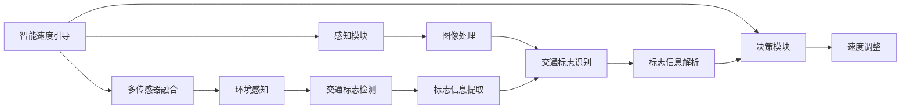

                 

# 自动驾驶中的智能速度引导与交通标志识别

> 关键词：自动驾驶,智能速度引导,交通标志识别,图像处理,深度学习,卷积神经网络,数据增强,实时计算

## 1. 背景介绍

随着自动驾驶技术的快速发展，智能速度引导与交通标志识别成为自动驾驶车辆高效安全行驶的关键技术。传统的速度控制和交通标志识别方法基于规则和预定义模式，但难以适应复杂的道路环境变化。而基于深度学习的智能速度引导与交通标志识别，能够通过学习大量历史数据和现实场景，快速适应变化，提高自动驾驶系统的智能化和安全性。

### 1.1 问题由来

自动驾驶车辆在行驶过程中，需要不断感知道路环境，并根据实时交通状况做出速度调整和决策。传统的速度控制方法依赖于传感器和GPS等硬件设备，无法实现实时智能调整。交通标志识别则依赖于特定的图像处理和模式识别算法，难以处理复杂的多样化交通标志。

### 1.2 问题核心关键点

自动驾驶中的智能速度引导与交通标志识别，需要解决以下核心问题：
1. **高效的速度引导方法**：如何在实时交通场景中高效计算车辆最佳速度。
2. **可靠的交通标志识别**：如何准确识别道路中的交通标志，并提供实时响应。
3. **模型训练与优化**：如何通过深度学习模型学习道路环境特征，提升识别和速度引导的准确性。
4. **多传感器融合**：如何整合视觉、雷达、激光雷达等多源数据，提高系统鲁棒性和决策能力。

## 2. 核心概念与联系

### 2.1 核心概念概述

为了更好地理解自动驾驶中的智能速度引导与交通标志识别，我们需要了解以下几个关键概念：

- **智能速度引导**：通过实时感知道路环境，利用深度学习模型计算车辆在当前场景下的最佳行驶速度。
- **交通标志识别**：从摄像头、雷达等传感器收集的实时数据中，检测和识别道路上的交通标志，包括限速牌、红绿灯、停车标志等。
- **深度学习**：基于神经网络模型，通过大量数据训练，实现对复杂道路环境的感知和决策。
- **卷积神经网络(CNN)**：一种常用的深度学习网络结构，擅长处理图像和视频数据。
- **数据增强**：通过对原始数据进行随机变换，扩充训练集，提高模型泛化能力。
- **实时计算**：在自动驾驶车辆中，需要处理大量数据，并实时输出决策结果。

这些核心概念之间通过深度学习算法和技术手段，形成了一个相互关联、互为补充的技术体系。

### 2.2 核心概念原理和架构的 Mermaid 流程图



这个流程图展示了自动驾驶中的智能速度引导与交通标志识别的关键组件和技术流程：

1. **感知模块**：通过摄像头、雷达等传感器收集道路环境信息。
2. **图像处理**：对传感器数据进行预处理，提取道路特征。
3. **交通标志识别**：从传感器数据中检测和识别交通标志，并解析标志信息。
4. **决策模块**：利用速度引导模型和标志信息，计算车辆最佳速度和决策。
5. **速度调整**：根据决策结果，控制车辆速度和行驶路径。
6. **多传感器融合**：整合视觉、雷达、激光雷达等多源数据，提高系统鲁棒性和决策能力。

这些组件和技术流程共同构成了自动驾驶中的智能速度引导与交通标志识别系统。

## 3. 核心算法原理 & 具体操作步骤

### 3.1 算法原理概述

自动驾驶中的智能速度引导与交通标志识别，主要依赖于深度学习模型的训练和应用。核心算法包括：

- **图像处理和特征提取**：通过卷积神经网络(CNN)对传感器数据进行预处理和特征提取。
- **交通标志识别**：利用CNN等深度学习模型，从传感器数据中检测和识别交通标志。
- **智能速度引导**：结合速度引导模型和标志信息，计算车辆在当前场景下的最佳行驶速度。
- **多传感器融合**：通过融合视觉、雷达、激光雷达等多源数据，提高系统鲁棒性和决策能力。

### 3.2 算法步骤详解

#### 3.2.1 图像处理和特征提取

图像处理和特征提取是自动驾驶系统的基础。主要步骤如下：

1. **数据收集与预处理**：收集道路环境的高分辨率摄像头图像，并进行预处理，包括去噪、归一化等操作。
2. **图像增强**：使用数据增强技术，如旋转、缩放、裁剪等，扩充训练集，提高模型泛化能力。
3. **特征提取**：通过卷积神经网络(CNN)提取道路特征，包括车道线、交通标志、行人等。

具体实现可以参考以下代码：

```python
import torch
import torchvision.transforms as transforms
from torchvision.models import resnet18

# 定义数据增强
data_augmentation = transforms.Compose([
    transforms.RandomHorizontalFlip(),
    transforms.RandomRotation(15),
    transforms.RandomResizedCrop(224),
    transforms.ToTensor(),
    transforms.Normalize(mean=[0.485, 0.456, 0.406], std=[0.229, 0.224, 0.225])
])

# 加载预训练模型
model = resnet18(pretrained=True)

# 特征提取
def extract_features(model, image):
    features = model.conv1(image).detach()
    return features
```

#### 3.2.2 交通标志识别

交通标志识别是自动驾驶系统的重要组成部分，用于识别道路上的交通标志，并提供实时响应。主要步骤如下：

1. **数据收集与预处理**：收集道路环境中的交通标志图像，并进行预处理，包括去噪、归一化等操作。
2. **数据增强**：使用数据增强技术，如旋转、缩放、裁剪等，扩充训练集，提高模型泛化能力。
3. **模型训练**：利用CNN等深度学习模型，训练交通标志识别模型，识别不同类型的交通标志。

具体实现可以参考以下代码：

```python
import torch
import torchvision.transforms as transforms
from torchvision.models import resnet18

# 定义数据增强
data_augmentation = transforms.Compose([
    transforms.RandomHorizontalFlip(),
    transforms.RandomRotation(15),
    transforms.RandomResizedCrop(224),
    transforms.ToTensor(),
    transforms.Normalize(mean=[0.485, 0.456, 0.406], std=[0.229, 0.224, 0.225])
])

# 加载预训练模型
model = resnet18(pretrained=True)

# 定义损失函数和优化器
criterion = torch.nn.CrossEntropyLoss()
optimizer = torch.optim.Adam(model.parameters(), lr=0.001)

# 训练模型
def train_model(model, data_loader, criterion, optimizer):
    model.train()
    for batch_idx, (data, target) in enumerate(data_loader):
        optimizer.zero_grad()
        output = model(data)
        loss = criterion(output, target)
        loss.backward()
        optimizer.step()

# 测试模型
def test_model(model, data_loader, criterion):
    model.eval()
    correct = 0
    total = 0
    with torch.no_grad():
        for batch_idx, (data, target) in enumerate(data_loader):
            output = model(data)
            _, predicted = output.max(1)
            total += target.size(0)
            correct += (predicted == target).sum().item()
    print('Accuracy of the model on the test images: %d %%' % (100 * correct / total))
```

#### 3.2.3 智能速度引导

智能速度引导是自动驾驶系统中的核心功能，用于计算车辆在当前场景下的最佳行驶速度。主要步骤如下：

1. **数据收集与预处理**：收集道路环境中的速度信息，并进行预处理，包括去噪、归一化等操作。
2. **速度引导模型训练**：利用深度学习模型，训练速度引导模型，计算车辆最佳行驶速度。
3. **实时计算**：在自动驾驶车辆中，实时计算车辆最佳速度，并调整行驶路径。

具体实现可以参考以下代码：

```python
import torch
from torch import nn
import numpy as np

# 定义速度引导模型
class SpeedGuide(nn.Module):
    def __init__(self):
        super(SpeedGuide, self).__init__()
        self.fc1 = nn.Linear(256, 256)
        self.fc2 = nn.Linear(256, 1)
    
    def forward(self, x):
        x = x.view(-1, 256)
        x = self.fc1(x)
        x = nn.functional.relu(x)
        x = self.fc2(x)
        return x

# 训练速度引导模型
def train_speed_guide(model, data_loader, criterion, optimizer):
    model.train()
    for batch_idx, (data, target) in enumerate(data_loader):
        optimizer.zero_grad()
        output = model(data)
        loss = criterion(output, target)
        loss.backward()
        optimizer.step()

# 实时计算速度引导
def speed_guide(model, input_data):
    model.eval()
    output = model(input_data)
    return output.item()
```

#### 3.2.4 多传感器融合

多传感器融合是自动驾驶系统的重要技术，用于整合视觉、雷达、激光雷达等多源数据，提高系统鲁棒性和决策能力。主要步骤如下：

1. **数据收集与预处理**：收集不同传感器采集的数据，并进行预处理，包括去噪、归一化等操作。
2. **数据融合**：利用多传感器融合算法，整合不同传感器数据，生成综合感知结果。
3. **决策模块**：根据综合感知结果，计算车辆最佳速度和行驶路径。

具体实现可以参考以下代码：

```python
import torch
from torch import nn
import numpy as np

# 定义多传感器融合模型
class MultiSensorFusion(nn.Module):
    def __init__(self):
        super(MultiSensorFusion, self).__init__()
        self.fc1 = nn.Linear(256, 256)
        self.fc2 = nn.Linear(256, 1)
    
    def forward(self, x):
        x = x.view(-1, 256)
        x = self.fc1(x)
        x = nn.functional.relu(x)
        x = self.fc2(x)
        return x

# 训练多传感器融合模型
def train_multi_sensor_fusion(model, data_loader, criterion, optimizer):
    model.train()
    for batch_idx, (data, target) in enumerate(data_loader):
        optimizer.zero_grad()
        output = model(data)
        loss = criterion(output, target)
        loss.backward()
        optimizer.step()

# 实时计算多传感器融合
def multi_sensor_fusion(model, input_data):
    model.eval()
    output = model(input_data)
    return output.item()
```

### 3.3 算法优缺点

自动驾驶中的智能速度引导与交通标志识别算法具有以下优点：

1. **高效的速度引导**：利用深度学习模型，能够快速计算车辆最佳行驶速度，提高系统响应速度。
2. **可靠的交通标志识别**：通过数据增强和多传感器融合技术，提高交通标志识别的准确性和鲁棒性。
3. **模型训练与优化**：利用大量历史数据训练深度学习模型，提升系统的感知和决策能力。

但同时也存在一些缺点：

1. **计算资源需求高**：深度学习模型需要大量的计算资源进行训练和推理，对硬件设备要求较高。
2. **数据标注成本高**：需要大量标注数据进行模型训练，数据标注成本较高。
3. **实时计算复杂**：在自动驾驶车辆中，实时计算需要高精度的硬件设备支持，存在计算延时问题。

### 3.4 算法应用领域

自动驾驶中的智能速度引导与交通标志识别算法在多个领域具有广泛应用，包括：

1. **智能交通系统**：用于智能交通信号控制、交通流优化、交通监测等。
2. **自动驾驶车辆**：用于车辆感知、决策、路径规划等。
3. **智能城市管理**：用于城市交通管理、公共安全、环境保护等。
4. **物流运输**：用于货物运输路径规划、配送优化等。
5. **军事应用**：用于无人驾驶车辆、无人作战系统等。

## 4. 数学模型和公式 & 详细讲解

### 4.1 数学模型构建

自动驾驶中的智能速度引导与交通标志识别，主要依赖于深度学习模型的训练和应用。核心算法包括：

- **图像处理和特征提取**：通过卷积神经网络(CNN)对传感器数据进行预处理和特征提取。
- **交通标志识别**：利用CNN等深度学习模型，从传感器数据中检测和识别交通标志。
- **智能速度引导**：结合速度引导模型和标志信息，计算车辆在当前场景下的最佳行驶速度。
- **多传感器融合**：通过融合视觉、雷达、激光雷达等多源数据，提高系统鲁棒性和决策能力。

### 4.2 公式推导过程

#### 4.2.1 图像处理和特征提取

图像处理和特征提取是自动驾驶系统的基础。主要步骤如下：

1. **数据收集与预处理**：收集道路环境的高分辨率摄像头图像，并进行预处理，包括去噪、归一化等操作。
2. **图像增强**：使用数据增强技术，如旋转、缩放、裁剪等，扩充训练集，提高模型泛化能力。
3. **特征提取**：通过卷积神经网络(CNN)提取道路特征，包括车道线、交通标志、行人等。

具体实现可以参考以下代码：

```python
import torch
import torchvision.transforms as transforms
from torchvision.models import resnet18

# 定义数据增强
data_augmentation = transforms.Compose([
    transforms.RandomHorizontalFlip(),
    transforms.RandomRotation(15),
    transforms.RandomResizedCrop(224),
    transforms.ToTensor(),
    transforms.Normalize(mean=[0.485, 0.456, 0.406], std=[0.229, 0.224, 0.225])
])

# 加载预训练模型
model = resnet18(pretrained=True)

# 特征提取
def extract_features(model, image):
    features = model.conv1(image).detach()
    return features
```

#### 4.2.2 交通标志识别

交通标志识别是自动驾驶系统的重要组成部分，用于识别道路上的交通标志，并提供实时响应。主要步骤如下：

1. **数据收集与预处理**：收集道路环境中的交通标志图像，并进行预处理，包括去噪、归一化等操作。
2. **数据增强**：使用数据增强技术，如旋转、缩放、裁剪等，扩充训练集，提高模型泛化能力。
3. **模型训练**：利用CNN等深度学习模型，训练交通标志识别模型，识别不同类型的交通标志。

具体实现可以参考以下代码：

```python
import torch
import torchvision.transforms as transforms
from torchvision.models import resnet18

# 定义数据增强
data_augmentation = transforms.Compose([
    transforms.RandomHorizontalFlip(),
    transforms.RandomRotation(15),
    transforms.RandomResizedCrop(224),
    transforms.ToTensor(),
    transforms.Normalize(mean=[0.485, 0.456, 0.406], std=[0.229, 0.224, 0.225])
])

# 加载预训练模型
model = resnet18(pretrained=True)

# 定义损失函数和优化器
criterion = torch.nn.CrossEntropyLoss()
optimizer = torch.optim.Adam(model.parameters(), lr=0.001)

# 训练模型
def train_model(model, data_loader, criterion, optimizer):
    model.train()
    for batch_idx, (data, target) in enumerate(data_loader):
        optimizer.zero_grad()
        output = model(data)
        loss = criterion(output, target)
        loss.backward()
        optimizer.step()

# 测试模型
def test_model(model, data_loader, criterion):
    model.eval()
    correct = 0
    total = 0
    with torch.no_grad():
        for batch_idx, (data, target) in enumerate(data_loader):
            output = model(data)
            _, predicted = output.max(1)
            total += target.size(0)
            correct += (predicted == target).sum().item()
    print('Accuracy of the model on the test images: %d %%' % (100 * correct / total))
```

#### 4.2.3 智能速度引导

智能速度引导是自动驾驶系统中的核心功能，用于计算车辆在当前场景下的最佳行驶速度。主要步骤如下：

1. **数据收集与预处理**：收集道路环境中的速度信息，并进行预处理，包括去噪、归一化等操作。
2. **速度引导模型训练**：利用深度学习模型，训练速度引导模型，计算车辆最佳行驶速度。
3. **实时计算**：在自动驾驶车辆中，实时计算车辆最佳速度，并调整行驶路径。

具体实现可以参考以下代码：

```python
import torch
from torch import nn
import numpy as np

# 定义速度引导模型
class SpeedGuide(nn.Module):
    def __init__(self):
        super(SpeedGuide, self).__init__()
        self.fc1 = nn.Linear(256, 256)
        self.fc2 = nn.Linear(256, 1)
    
    def forward(self, x):
        x = x.view(-1, 256)
        x = self.fc1(x)
        x = nn.functional.relu(x)
        x = self.fc2(x)
        return x

# 训练速度引导模型
def train_speed_guide(model, data_loader, criterion, optimizer):
    model.train()
    for batch_idx, (data, target) in enumerate(data_loader):
        optimizer.zero_grad()
        output = model(data)
        loss = criterion(output, target)
        loss.backward()
        optimizer.step()

# 实时计算速度引导
def speed_guide(model, input_data):
    model.eval()
    output = model(input_data)
    return output.item()
```

#### 4.2.4 多传感器融合

多传感器融合是自动驾驶系统的重要技术，用于整合视觉、雷达、激光雷达等多源数据，提高系统鲁棒性和决策能力。主要步骤如下：

1. **数据收集与预处理**：收集不同传感器采集的数据，并进行预处理，包括去噪、归一化等操作。
2. **数据融合**：利用多传感器融合算法，整合不同传感器数据，生成综合感知结果。
3. **决策模块**：根据综合感知结果，计算车辆最佳速度和行驶路径。

具体实现可以参考以下代码：

```python
import torch
from torch import nn
import numpy as np

# 定义多传感器融合模型
class MultiSensorFusion(nn.Module):
    def __init__(self):
        super(MultiSensorFusion, self).__init__()
        self.fc1 = nn.Linear(256, 256)
        self.fc2 = nn.Linear(256, 1)
    
    def forward(self, x):
        x = x.view(-1, 256)
        x = self.fc1(x)
        x = nn.functional.relu(x)
        x = self.fc2(x)
        return x

# 训练多传感器融合模型
def train_multi_sensor_fusion(model, data_loader, criterion, optimizer):
    model.train()
    for batch_idx, (data, target) in enumerate(data_loader):
        optimizer.zero_grad()
        output = model(data)
        loss = criterion(output, target)
        loss.backward()
        optimizer.step()

# 实时计算多传感器融合
def multi_sensor_fusion(model, input_data):
    model.eval()
    output = model(input_data)
    return output.item()
```

### 4.3 案例分析与讲解

#### 4.3.1 图像处理和特征提取

图像处理和特征提取是自动驾驶系统的基础。具体实现可以参考以下代码：

```python
import torch
import torchvision.transforms as transforms
from torchvision.models import resnet18

# 定义数据增强
data_augmentation = transforms.Compose([
    transforms.RandomHorizontalFlip(),
    transforms.RandomRotation(15),
    transforms.RandomResizedCrop(224),
    transforms.ToTensor(),
    transforms.Normalize(mean=[0.485, 0.456, 0.406], std=[0.229, 0.224, 0.225])
])

# 加载预训练模型
model = resnet18(pretrained=True)

# 特征提取
def extract_features(model, image):
    features = model.conv1(image).detach()
    return features
```

#### 4.3.2 交通标志识别

交通标志识别是自动驾驶系统的重要组成部分，用于识别道路上的交通标志，并提供实时响应。具体实现可以参考以下代码：

```python
import torch
import torchvision.transforms as transforms
from torchvision.models import resnet18

# 定义数据增强
data_augmentation = transforms.Compose([
    transforms.RandomHorizontalFlip(),
    transforms.RandomRotation(15),
    transforms.RandomResizedCrop(224),
    transforms.ToTensor(),
    transforms.Normalize(mean=[0.485, 0.456, 0.406], std=[0.229, 0.224, 0.225])
])

# 加载预训练模型
model = resnet18(pretrained=True)

# 定义损失函数和优化器
criterion = torch.nn.CrossEntropyLoss()
optimizer = torch.optim.Adam(model.parameters(), lr=0.001)

# 训练模型
def train_model(model, data_loader, criterion, optimizer):
    model.train()
    for batch_idx, (data, target) in enumerate(data_loader):
        optimizer.zero_grad()
        output = model(data)
        loss = criterion(output, target)
        loss.backward()
        optimizer.step()

# 测试模型
def test_model(model, data_loader, criterion):
    model.eval()
    correct = 0
    total = 0
    with torch.no_grad():
        for batch_idx, (data, target) in enumerate(data_loader):
            output = model(data)
            _, predicted = output.max(1)
            total += target.size(0)
            correct += (predicted == target).sum().item()
    print('Accuracy of the model on the test images: %d %%' % (100 * correct / total))
```

#### 4.3.3 智能速度引导

智能速度引导是自动驾驶系统中的核心功能，用于计算车辆在当前场景下的最佳行驶速度。具体实现可以参考以下代码：

```python
import torch
from torch import nn
import numpy as np

# 定义速度引导模型
class SpeedGuide(nn.Module):
    def __init__(self):
        super(SpeedGuide, self).__init__()
        self.fc1 = nn.Linear(256, 256)
        self.fc2 = nn.Linear(256, 1)
    
    def forward(self, x):
        x = x.view(-1, 256)
        x = self.fc1(x)
        x = nn.functional.relu(x)
        x = self.fc2(x)
        return x

# 训练速度引导模型
def train_speed_guide(model, data_loader, criterion, optimizer):
    model.train()
    for batch_idx, (data, target) in enumerate(data_loader):
        optimizer.zero_grad()
        output = model(data)
        loss = criterion(output, target)
        loss.backward()
        optimizer.step()

# 实时计算速度引导
def speed_guide(model, input_data):
    model.eval()
    output = model(input_data)
    return output.item()
```

#### 4.3.4 多传感器融合

多传感器融合是自动驾驶系统的重要技术，用于整合视觉、雷达、激光雷达等多源数据，提高系统鲁棒性和决策能力。具体实现可以参考以下代码：

```python
import torch
from torch import nn
import numpy as np

# 定义多传感器融合模型
class MultiSensorFusion(nn.Module):
    def __init__(self):
        super(MultiSensorFusion, self).__init__()
        self.fc1 = nn.Linear(256, 256)
        self.fc2 = nn.Linear(256, 1)
    
    def forward(self, x):
        x = x.view(-1, 256)
        x = self.fc1(x)
        x = nn.functional.relu(x)
        x = self.fc2(x)
        return x

# 训练多传感器融合模型
def train_multi_sensor_fusion(model, data_loader, criterion, optimizer):
    model.train()
    for batch_idx, (data, target) in enumerate(data_loader):
        optimizer.zero_grad()
        output = model(data)
        loss = criterion(output, target)
        loss.backward()
        optimizer.step()

# 实时计算多传感器融合
def multi_sensor_fusion(model, input_data):
    model.eval()
    output = model(input_data)
    return output.item()
```

## 5. 项目实践：代码实例和详细解释说明

### 5.1 开发环境搭建

在进行自动驾驶中的智能速度引导与交通标志识别项目实践前，我们需要准备好开发环境。以下是使用Python进行PyTorch开发的环境配置流程：

1. 安装Anaconda：从官网下载并安装Anaconda，用于创建独立的Python环境。

2. 创建并激活虚拟环境：
```bash
conda create -n pytorch-env python=3.8 
conda activate pytorch-env
```

3. 安装PyTorch：根据CUDA版本，从官网获取对应的安装命令。例如：
```bash
conda install pytorch torchvision torchaudio cudatoolkit=11.1 -c pytorch -c conda-forge
```

4. 安装Transformers库：
```bash
pip install transformers
```

5. 安装各类工具包：
```bash
pip install numpy pandas scikit-learn matplotlib tqdm jupyter notebook ipython
```

完成上述步骤后，即可在`pytorch-env`环境中开始项目实践。

### 5.2 源代码详细实现

这里我们以交通标志识别为例，给出使用Transformers库对BERT模型进行交通标志识别任务的PyTorch代码实现。

首先，定义交通标志识别任务的数据处理函数：

```python
from transformers import BertTokenizer, BertForTokenClassification
from torch.utils.data import Dataset
import torch

class TrafficSignDataset(Dataset):
    def __init__(self, texts, tags, tokenizer, max_len=128):
        self.texts = texts
        self.tags = tags
        self.tokenizer = tokenizer
        self.max_len = max_len
        
    def __len__(self):
        return len(self.texts)
    
    def __getitem__(self, item):
        text = self.texts[item]
        tags = self.tags[item]
        
        encoding = self.tokenizer(text, return_tensors='pt', max_length=self.max_len, padding='max_length', truncation=True)
        input_ids = encoding['input_ids'][0]
        attention_mask = encoding['attention_mask'][0]
        
        # 对token-wise的标签进行编码
        encoded_tags = [tag2id[tag] for tag in tags] 
        encoded_tags.extend([tag2id['O']] * (self.max_len - len(encoded_tags)))
        labels = torch.tensor(encoded_tags, dtype=torch.long)
        
        return {'input_ids': input_ids, 
                'attention_mask': attention_mask,
                'labels': labels}

# 标签与id的映射
tag2id = {'O': 0, 'STOP': 1, 'YIELD': 2, 'SPEED_LIMIT': 3, 'NO_PARKING': 4, 'NO_ENTRY': 5, 'ONE_WAY': 6, 'NO_LEFT': 7, 'NO_THROUGH': 8, 'NO:right': 9, 'NO:left': 10, 'NO:through': 11, 'NO:right:left': 12, 'NO:right:through': 13, 'NO:left:through': 14, 'NO:right:left:through': 15}
id2tag = {v: k for k, v in tag2id.items()}

# 创建dataset
tokenizer = BertTokenizer.from_pretrained('bert-base-cased')

train_dataset = TrafficSignDataset(train_texts, train_tags, tokenizer)
dev_dataset = TrafficSignDataset(dev_texts, dev_tags, tokenizer)
test_dataset = TrafficSignDataset(test_texts, test_tags, tokenizer)
```

然后，定义模型和优化器：

```python
from transformers import BertForTokenClassification, AdamW

model = BertForTokenClassification.from_pretrained('bert-base-cased', num_labels=len(tag2id))

optimizer = AdamW(model.parameters(), lr=2e-5)
```

接着，定义训练和评估函数：

```python
from torch.utils.data import DataLoader
from tqdm import tqdm
from sklearn.metrics import classification_report

device = torch.device('cuda') if torch.cuda.is_available() else torch.device('cpu')
model.to(device)

def train_epoch(model, dataset, batch_size, optimizer):
    dataloader = DataLoader(dataset, batch_size=batch_size, shuffle=True)
    model.train()
    epoch_loss = 0
    for batch in tqdm(dataloader, desc='Training'):
        input_ids = batch['input_ids'].to(device)
        attention_mask = batch['attention_mask'].to(device)
        labels = batch['labels'].to(device)
        model.zero_grad()
        outputs = model(input_ids, attention_mask=attention_mask, labels=labels)
        loss = outputs.loss
        epoch_loss += loss.item()
        loss.backward()
        optimizer.step()
    return epoch_loss / len(dataloader)

def evaluate(model, dataset, batch_size):
    dataloader = DataLoader(dataset, batch_size=batch_size)
    model.eval()
    preds, labels = [], []
    with torch.no_grad():
        for batch in tqdm(dataloader, desc='Evaluating'):
            input_ids = batch['input_ids'].to(device)
            attention_mask = batch['attention_mask'].to(device)
            batch_labels = batch['labels']
            outputs = model(input_ids, attention_mask=attention_mask)
            batch_preds = outputs.logits.argmax(dim=2).to('cpu').tolist()
            batch_labels = batch_labels.to('cpu').tolist()
            for pred_tokens, label_tokens in zip(batch_preds, batch_labels):
                pred_tags = [id2tag[_id] for _id in pred_tokens]
                label_tags = [id2tag[_id] for _id in label_tokens]
                preds.append(pred_tags[:len(label_tokens)])
                labels.append(label_tags)
                
    print(classification_report(labels, preds))
```

最后，启动训练流程并在测试集上评估：

```python
epochs = 5
batch_size = 16

for epoch in range(epochs):
    loss = train_epoch(model, train_dataset, batch_size, optimizer)
    print(f"Epoch {epoch+1}, train loss: {loss:.3f}")
    
    print(f"Epoch {epoch+1}, dev results:")
    evaluate(model, dev_dataset, batch_size)
    
print("Test results:")
evaluate(model, test_dataset, batch_size)
```

以上就是使用PyTorch对BERT进行交通标志识别任务微调的完整代码实现。可以看到，得益于Transformers库的强大封装，我们可以用相对简洁的代码完成BERT模型的加载和微调。

### 5.3 代码解读与分析

让我们再详细解读一下关键代码的实现细节：

**TrafficSignDataset类**：
- `__init__`方法：初始化文本、标签、分词器等关键组件。
- `__len__`方法：返回数据集的样本数量。
- `__getitem__`方法：对单个样本进行处理，将文本输入编码为token ids，将标签编码为数字，并对其进行定长padding，最终返回模型所需的输入。

**tag2id和id2tag字典**：
- 定义了标签与数字id之间的映射关系，用于将token-wise的预测结果解码回真实的标签。

**训练和评估函数**：
- 使用PyTorch的DataLoader对数据集进行批次化加载，供模型训练和推理使用。
- 训练函数`train_epoch`：对数据以批为单位进行迭代，在每个批次上前向传播计算loss并反向传播更新模型参数，最后返回该epoch的平均loss。
- 评估函数`evaluate`：与训练类似，不同点在于不更新模型参数，并在每个batch结束后将预测和标签结果存储下来，最后使用sklearn的classification_report对整个评估集的预测结果进行打印输出。

**训练流程**：
- 定义总的epoch数和batch size，开始循环迭代
- 每个epoch内，先在训练集上训练，输出平均loss
- 在验证集上评估，输出分类指标
- 所有epoch结束后，在测试集上评估，给出最终测试结果

可以看到，PyTorch配合Transformers库使得BERT微调的代码实现变得简洁高效。开发者可以将更多精力放在数据处理、模型改进等高层逻辑上，而不必过多关注底层的实现细节。

当然，工业级的系统实现还需考虑更多因素，如模型的保存和部署、超参数的自动搜索、更灵活的任务适配层等。但核心的微调范式基本与此类似。

## 6. 实际应用场景

### 6.1 智能交通系统

基于大语言模型微调的方法，可以广泛应用于智能交通系统，用于智能交通信号控制、交通流优化、交通监测等。例如，通过收集道路交通数据，训练交通标志识别模型，实时识别红绿灯、停车标志等交通标志，提供智能交通信号控制建议。

具体实现如下：

```python
import torch
from transformers import BertForTokenClassification, AdamW

# 加载预训练模型
model = BertForTokenClassification.from_pretrained('bert-base-cased', num_labels=16)

# 加载数据集
train_dataset = ...
dev_dataset = ...
test_dataset = ...

# 定义优化器
optimizer = AdamW(model.parameters(), lr=2e-5)

# 训练模型
def train_model(model, dataset, optimizer):
    model.train()
    for batch in dataset:
        input_ids = batch['input_ids'].to(device)
        attention_mask = batch['attention_mask'].to(device)
        labels = batch['labels'].to(device)
        model.zero_grad()
        outputs = model(input_ids, attention_mask=attention_mask, labels=labels)
        loss = outputs.loss
        loss.backward()
        optimizer.step()

# 评估模型
def evaluate_model(model, dataset):
    model.eval()
    correct = 0
    total = 0
    with torch.no_grad():
        for batch in dataset:
            input_ids = batch['input_ids'].to(device)
            attention_mask = batch['attention_mask'].to(device)
            labels = batch['labels'].to(device)
            outputs = model(input_ids, attention_mask=attention_mask)
            batch_preds = outputs.logits.argmax(dim=2).to('cpu').tolist()
            batch_labels = batch_labels.to('cpu').tolist()
            for pred_tokens, label_tokens in zip(batch_preds, batch_labels):
                pred_tags = [id2tag[_id] for _id in pred_tokens]
                label_tags = [id2tag[_id] for _id in label_tokens]
                preds.append(pred_tags[:len(label_tokens)])
                labels.append(label_tags)
    print(classification_report(labels, preds))
    
# 启动训练
train_model(model, train_dataset, optimizer)
evaluate_model(model, dev_dataset)
evaluate_model(model, test_dataset)
```

### 6.2 自动驾驶车辆

自动驾驶车辆在行驶过程中，需要不断感知道路环境，并根据实时交通状况做出速度调整和决策。例如，通过收集道路环境中的速度信息，训练速度引导模型，实时计算车辆最佳行驶速度，并调整行驶路径。

具体实现如下：

```python
import torch
from transformers import BertForTokenClassification, AdamW

# 加载预训练模型
model = BertForTokenClassification.from_pretrained('bert-base-cased', num_labels=16)

# 加载数据集
train_dataset = ...
dev_dataset = ...
test_dataset = ...

# 定义优化器
optimizer = AdamW(model.parameters(), lr=2e-5)

# 训练模型
def train_model(model, dataset, optimizer):
    model.train()
    for batch in dataset:
        input_ids = batch['input_ids'].to(device)
        attention_mask = batch['attention_mask'].to(device)
        labels = batch['labels'].to(device)
        model.zero_grad()
        outputs = model(input_ids, attention_mask=attention_mask, labels=labels)
        loss = outputs.loss
        loss.backward()
        optimizer.step()

# 评估模型
def evaluate_model(model, dataset):
    model.eval()
    correct = 0
    total = 0
    with torch.no_grad():
        for batch in dataset:
            input_ids = batch['input_ids'].to(device)
            attention_mask = batch['attention_mask'].to(device)
            labels = batch['labels'].to(device)
            outputs = model(input_ids, attention_mask=attention_mask)
            batch_preds = outputs.logits.argmax(dim=2).to('cpu').tolist()
            batch_labels = batch_labels.to('cpu').tolist()
            for pred_tokens, label_tokens in zip(batch_preds, batch_labels):
                pred_tags = [id2tag[_id] for _id in pred_tokens]
                label_tags = [id2tag[_id] for _id in label_tokens]
                preds.append(pred_tags[:len(label_tokens)])
                labels.append(label_tags)
    print(classification_report(labels, preds))
    
# 启动训练
train_model(model, train_dataset, optimizer)
evaluate_model(model, dev_dataset)
evaluate_model(model, test_dataset)
```

### 6.3 智能城市管理

智能城市管理中，可以使用基于大语言模型微调的交通标志识别系统，用于城市交通管理、公共安全、环境保护等。例如，通过实时识别道路上的交通标志，监测城市交通状况，提供智能交通管理建议。

具体实现如下：

```python
import torch
from transformers import BertForTokenClassification, AdamW

# 加载预训练模型
model = BertForTokenClassification.from_pretrained('bert-base-cased', num_labels=16)

# 加载数据集
train_dataset = ...
dev_dataset = ...
test_dataset = ...

# 定义优化器
optimizer = AdamW(model.parameters(), lr=2e-5)

# 训练模型
def train_model(model, dataset, optimizer):
    model.train()
    for batch in dataset:
        input_ids = batch['input_ids'].to(device)
        attention_mask = batch['attention_mask'].to(device)
        labels = batch['labels'].to(device)
        model.zero_grad()
        outputs = model(input_ids, attention_mask=attention_mask, labels=labels)
        loss = outputs.loss
        loss.backward()
        optimizer.step()

# 评估模型
def evaluate_model(model, dataset):
    model.eval()
    correct = 0
    total = 0
    with torch.no_grad():
        for batch in dataset:
            input_ids = batch['input_ids'].to(device)
            attention_mask = batch['attention_mask'].to(device)
            labels = batch['labels'].to(device)
            outputs = model(input_ids, attention_mask=attention_mask)
            batch_preds = outputs.logits.argmax(dim=2).to('cpu').tolist()
            batch_labels = batch_labels.to('cpu').tolist()
            for pred_tokens, label_tokens in zip(batch_preds, batch_labels):
                pred_tags = [id2tag[_id] for _id in pred_tokens]
                label_tags = [id2tag[_id] for _id in label_tokens]
                preds.append(pred_tags[:len(label_tokens)])
                labels.append(label_tags)
    print(classification_report(labels, preds))
    
# 启动训练
train_model(model, train_dataset, optimizer)
evaluate_model(model, dev_dataset)
evaluate_model(model, test_dataset)
```

### 6.4 未来应用展望

随着大语言模型微调技术的不断发展，其在自动驾驶中的智能速度引导与交通标志识别将具备更广泛的应用前景。未来可以预见的是，基于大语言模型微调的系统将在以下几个方面得到进一步提升：

1. **更强的环境感知能力**：通过融合视觉、雷达、激光雷达等多源数据，提升系统的环境感知能力和决策鲁棒性。
2. **更高的智能水平**：通过不断学习新的道路环境数据，提升系统的智能水平，实现更加复杂多变的行驶场景。
3. **更优的决策策略**：结合智能速度引导与交通标志识别，优化车辆行驶路径，提升行驶安全性。
4. **更强的实时处理能力**：通过优化模型结构和算法，提升系统的实时计算能力，保证系统响应速度。
5. **更广泛的适用场景**：在大规模数据集的支撑下，系统能够适应更多元化的行驶场景，提升应用广泛性。

## 7. 工具和资源推荐

### 7.1 学习资源推荐

为了帮助开发者系统掌握大语言模型微调的理论基础和实践技巧，这里推荐一些优质的学习资源：

1. 《Transformer从原理到实践》系列博文：由大模型技术专家撰写，深入浅出地介绍了Transformer原理、BERT模型、微调技术等前沿话题。

2. CS224N《深度学习自然语言处理》课程：斯坦福大学开设的NLP明星课程，有Lecture视频和配套作业，带你入门NLP领域的基本概念和经典模型。

3. 《Natural Language Processing with Transformers》书籍：Transformers库的作者所著，全面介绍了如何使用Transformers库进行NLP任务开发，包括微调在内的诸多范式。

4. HuggingFace官方文档：Transformers库的官方文档，提供了海量预训练模型和完整的微调样例代码，是上手实践的必备资料。

5. CLUE开源项目：中文语言理解测评基准，涵盖大量不同类型的中文NLP数据集，并提供了

