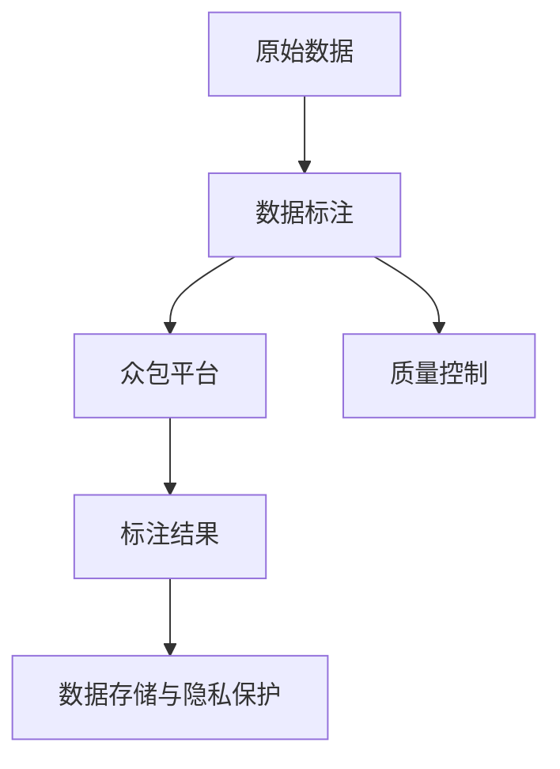

                 

# 自动驾驶公司的数据标注众包平台搭建

## 1. 背景介绍

随着自动驾驶技术的不断成熟，数据标注成为自动驾驶公司训练和优化机器学习模型的重要环节。然而，自动驾驶数据标注的难度高、成本大，标注工作复杂繁琐，对标注人员的领域知识和技能要求也较高。因此，构建一个高效、低成本、易用的数据标注众包平台，对于提升自动驾驶模型的训练效率和降低成本具有重要意义。

## 2. 核心概念与联系

### 2.1 核心概念概述

为了更好地理解如何搭建一个高效的数据标注众包平台，我们先来明确一些关键概念：

- **数据标注 (Data Annotation)**：指将原始数据转换为结构化格式的过程，如给图像添加注释框，为自然语言文本标注分类标签等。
- **众包平台 (Crowdsourcing Platform)**：指将任务分解成若干子任务，通过网络平台分配给不同人员完成，最终将子任务结果汇总形成完整标注结果的技术。
- **自动驾驶 (Autonomous Driving)**：指车辆通过计算机视觉、传感器数据和AI算法，实现自主驾驶的技术。
- **标注质量控制 (Annotation Quality Control)**：指对标注结果进行审核和修正，确保标注数据质量的重要环节。
- **数据隐私保护 (Data Privacy Protection)**：指在标注过程中保护用户数据隐私，防止数据泄露。

这些概念之间通过数据标注和众包平台搭建的流程串联起来，如图表所示：



### 2.2 核心概念原理和架构的 Mermaid 流程图


### 2.3 核心概念之间的联系

上述核心概念之间有着密切的联系：

- 原始数据是自动驾驶公司进行模型训练的基础。
- 数据标注是将原始数据转换为模型能够理解的形式，供自动驾驶系统使用。
- 众包平台通过将任务分配给不同人员，大幅降低标注成本，提高标注效率。
- 标注质量控制是确保标注数据质量的关键步骤，避免标注错误对自动驾驶系统产生负面影响。
- 数据隐私保护是保障用户数据安全，避免数据泄露的重要环节。

## 3. 核心算法原理 & 具体操作步骤

### 3.1 算法原理概述

搭建自动驾驶公司数据标注众包平台的核心算法主要涉及以下几个方面：

- 任务分解与分配：将标注任务分解为子任务，合理分配给不同的标注人员。
- 标注质量控制：通过预设规则和人工审核，确保标注结果的准确性和一致性。
- 数据隐私保护：在标注过程中采用加密、匿名化等技术，保护用户数据隐私。

### 3.2 算法步骤详解

#### 3.2.1 任务分解与分配

自动驾驶公司常见的标注任务包括：

- **图像标注**：为自动驾驶摄像头拍摄的图像添加边界框，标出行人、车辆、道路标识等。
- **语义分割**：将自然语言文本转换为结构化数据，如地名、路标、交通标志等。
- **行为分类**：对自动驾驶车在道路上的行为进行分类，如直线行驶、变道、停车等。

在标注任务分解与分配过程中，采用以下步骤：

1. **任务定义**：根据标注任务类型，定义清晰的标注格式和规范。
2. **任务分配**：根据标注人员的技能和经验，合理分配任务，避免重复分配或标注质量差的人员参与任务。
3. **任务监控**：实时监控标注进度和质量，及时调整任务分配策略，确保任务按时完成。

#### 3.2.2 标注质量控制

标注质量控制采用以下步骤：

1. **预设规则**：定义标注质量的判断标准和误差容忍范围。
2. **随机抽样**：从标注结果中随机抽取样本，进行人工审核和修正。
3. **系统审核**：通过预设规则自动审核标注结果，发现异常数据并标记。
4. **人工审核**：对异常数据进行人工审核，修正错误标注，确保标注数据质量。

#### 3.2.3 数据隐私保护

数据隐私保护采用以下步骤：

1. **数据加密**：在标注数据传输和存储过程中，采用加密技术保护数据安全。
2. **数据匿名化**：在标注数据处理过程中，去除可能泄露用户隐私的个人信息。
3. **访问控制**：限制系统访问权限，确保只有授权人员可以访问标注数据。

### 3.3 算法优缺点

搭建自动驾驶公司数据标注众包平台的核心算法具有以下优点：

- **高效性**：通过任务分解与分配，将标注任务自动分配给不同人员，大幅降低标注成本和提高标注效率。
- **质量控制**：通过预设规则和人工审核，确保标注数据质量，避免标注错误对自动驾驶系统产生负面影响。
- **隐私保护**：采用数据加密、匿名化等技术，保障用户数据隐私，避免数据泄露风险。

同时，也存在以下缺点：

- **标注规范复杂**：不同任务有不同的标注规范和格式要求，标注人员需要学习不同的标注知识。
- **人员技能要求高**：自动驾驶数据标注需要标注人员具备较高的领域知识和技能。
- **质量控制成本高**：人工审核和修正标注数据，需要投入大量人力和时间成本。

### 3.4 算法应用领域

数据标注众包平台在以下领域具有广泛应用：

- **自动驾驶公司**：用于训练和优化自动驾驶算法，提升自动驾驶系统的安全性和可靠性。
- **医疗影像标注**：用于辅助医生进行疾病诊断，提高医疗影像分析的准确性和效率。
- **视频分析**：用于视频内容分类、行为识别等任务，为视频监控、安防等领域提供数据支持。
- **自然语言处理**：用于文本分类、情感分析等任务，为智能客服、舆情监测等领域提供数据支持。

## 4. 数学模型和公式 & 详细讲解 & 举例说明

### 4.1 数学模型构建

在自动驾驶数据标注众包平台中，常见的数学模型包括：

- **标注任务模型**：定义标注任务的格式和规范，如图像标注的边界框位置、语义分割的类别标签等。
- **任务分配模型**：计算任务分配的合理性，如考虑标注人员的领域知识和标注进度等。
- **质量控制模型**：评估标注结果的质量，如计算标注错误率、一致性等。
- **隐私保护模型**：在数据传输和存储过程中，计算数据隐私泄露的风险。

### 4.2 公式推导过程

#### 4.2.1 标注任务模型

假设标注任务为图像标注，其中每张图像的标注结果为 $y = (x_1, x_2, ..., x_n)$，其中 $x_i = (x_i^1, x_i^2)$ 表示第 $i$ 个边界框的位置和类别标签。

根据标注规范，计算每个标注结果的得分 $s_i$，如：

$$
s_i = \frac{\text{正确位置}-\text{错误位置}}{\text{正确位置}+\text{错误位置}} \times \text{类别标签匹配度}
$$

#### 4.2.2 任务分配模型

任务分配模型用于计算每个标注人员的权重 $w_j$，如：

$$
w_j = \frac{\text{标注进度}-\text{平均进度}}{\text{平均进度}} \times \text{标注质量得分}
$$

#### 4.2.3 质量控制模型

假设标注结果中存在 $k$ 个错误标注，则计算错误率 $\epsilon$ 为：

$$
\epsilon = \frac{k}{n} \times 100\%
$$

#### 4.2.4 隐私保护模型

假设标注数据传输过程中的加密强度为 $c$，则数据隐私泄露风险 $R$ 计算如下：

$$
R = c \times (1 - c^{-1})
$$

### 4.3 案例分析与讲解

以自动驾驶图像标注为例，我们将分析如何通过数据标注众包平台搭建完成图像标注任务：

1. **任务分解**：将每张图像的标注任务分解为若干个边界框标注任务。
2. **任务分配**：根据标注人员的领域知识和标注进度，合理分配每个边界框任务。
3. **标注结果**：标注人员在平台上传标注结果，系统自动计算得分。
4. **质量控制**：系统随机抽取标注结果，进行人工审核和修正，计算标注错误率。
5. **数据隐私保护**：标注数据在传输和存储过程中进行加密和匿名化处理。

## 5. 项目实践：代码实例和详细解释说明

### 5.1 开发环境搭建

搭建数据标注众包平台需要以下开发环境：

- **Python**：用于编写标注平台的后端和前端代码。
- **Django**：用于搭建标注平台的后端API接口。
- **Flask**：用于搭建标注平台的前端页面。
- **数据库**：用于存储标注数据和标注人员信息，如MySQL、PostgreSQL等。
- **云服务**：用于提供平台部署和数据存储服务，如AWS、Google Cloud等。

### 5.2 源代码详细实现

以下是一个简单的数据标注众包平台搭建代码实现，包括后端API和前端页面：

#### 5.2.1 后端API实现

**todolist.py**

```python
from django.shortcuts import render
from django.http import JsonResponse
from .models import Task, Annotator, Annotation

def task_list(request):
    tasks = Task.objects.all()
    tasks_json = [{'id': task.id, 'name': task.name, 'description': task.description} for task in tasks]
    return JsonResponse({'tasks': tasks_json})

def annotator_list(request):
    annotators = Annotator.objects.all()
    annotators_json = [{'id': annotator.id, 'name': annotator.name, 'field_knowledge': annotator.field_knowledge} for annotator in annotators]
    return JsonResponse({'annotators': annotators_json})

def annotate(request, task_id):
    task = Task.objects.get(id=task_id)
    annotators = Annotator.objects.all()
    annotators_json = [{'id': annotator.id, 'name': annotator.name} for annotator in annotators]
    return render(request, 'annotate.html', {'task': task, 'annotators': annotators_json})
```

**tasks.py**

```python
from django.db import models

class Task(models.Model):
    name = models.CharField(max_length=255)
    description = models.TextField()

    def __str__(self):
        return self.name

class Annotator(models.Model):
    name = models.CharField(max_length=255)
    field_knowledge = models.BooleanField(default=False)

    def __str__(self):
        return self.name

class Annotation(models.Model):
    task = models.ForeignKey(Task, on_delete=models.CASCADE)
    annotator = models.ForeignKey(Annotator, on_delete=models.CASCADE)
    data = models.TextField()
    score = models.FloatField()

    def __str__(self):
        return f"{self.task.name} - {self.annotator.name} - {self.score}"
```

#### 5.2.2 前端页面实现

**annotate.html**

```html
<html>
<head>
    <title>Data Annotation</title>
</head>
<body>
    <h1>Data Annotation</h1>
    <form>
        <label for="task_name">Task:</label>
        <select id="task_name" name="task_name">
            
            <option value="{{ task.id }}">
                {{ task.name }}
            </option>
            
        </select>
        <br>
        <label for="annotator_name">Annotator:</label>
        <select id="annotator_name" name="annotator_name">
            
            <option value="{{ annotator.id }}">
                {{ annotator.name }}
            </option>
            
        </select>
        <br>
        <label for="data">Data:</label>
        <textarea id="data" name="data" rows="10" cols="50"></textarea>
        <br>
        <input type="submit" value="Submit">
    </form>
</body>
</html>
```

### 5.3 代码解读与分析

**todolist.py**

- **task_list**：获取所有任务列表，并返回JSON格式的任务信息。
- **annotator_list**：获取所有标注人员列表，并返回JSON格式的标注人员信息。
- **annotate**：显示标注任务详细信息，并获取可参与的标注人员列表。

**tasks.py**

- **Task**：定义任务模型，包含任务名称和描述。
- **Annotator**：定义标注人员模型，包含标注人员名称和领域知识。
- **Annotation**：定义标注数据模型，包含任务、标注人员、标注数据和标注得分。

**annotate.html**

- **<form>**：用于提交标注数据。
- **<select>**：显示任务和标注人员列表。
- **<textarea>**：用于输入标注数据。
- **<input type="submit">**：提交标注数据。

### 5.4 运行结果展示

搭建好数据标注众包平台后，可以运行以下命令启动服务器：

```bash
python manage.py runserver
```

打开浏览器，访问 `http://127.0.0.1:8000/annotate/1`，进入标注页面，输入标注数据并提交，即完成了数据标注任务的标注。

## 6. 实际应用场景

### 6.1 智能交通管理

自动驾驶数据标注众包平台在智能交通管理中具有重要应用。交通监控系统可以利用平台提供的标注数据，训练和优化计算机视觉模型，实现自动化的车辆行为分析和事故预警。平台还可以用于采集道路交通环境数据，提高交通管理决策的科学性和精确性。

### 6.2 自动驾驶安全测试

在自动驾驶车辆的测试阶段，自动驾驶数据标注众包平台可以用于标注模拟驾驶场景，提供丰富的道路场景数据。标注人员可以对模拟场景进行标注，帮助测试团队评估自动驾驶系统的安全性和可靠性。平台还可以用于车辆行为模拟，训练和优化自动驾驶算法。

### 6.3 自动驾驶研发加速

在自动驾驶技术的研发过程中，数据标注众包平台可以提供大量的标注数据，帮助研究人员快速迭代和验证自动驾驶算法。标注数据可以用于自动驾驶系统的训练和测试，提高算法的准确性和鲁棒性。

### 6.4 未来应用展望

未来，数据标注众包平台将在更多自动驾驶应用场景中得到应用，如自动驾驶车辆与环境交互、自动驾驶车辆与车辆交互、自动驾驶车辆与行人交互等。通过优化任务分配和质量控制，平台可以大幅提高标注数据的质量和效率，提升自动驾驶系统的安全性和可靠性。

## 7. 工具和资源推荐

### 7.1 学习资源推荐

搭建数据标注众包平台需要掌握以下知识：

- **Python编程**：熟悉Python语言基础和网络编程技术。
- **Django框架**：掌握Django框架的API设计和前后端开发技术。
- **Flask框架**：掌握Flask框架的前端页面开发技术。
- **数据库设计**：熟悉关系型数据库和NoSQL数据库的设计与使用。
- **云服务部署**：掌握AWS、Google Cloud等云服务平台的搭建和使用。

推荐阅读以下资源：

1. **《Python编程：从入门到实践》**：初学者必备Python编程教材，涵盖基础编程知识和项目实战。
2. **《Django实战》**：Django框架实战教程，涵盖API设计和前后端开发技术。
3. **《Flask Web开发：实战篇》**：Flask框架实战教程，涵盖前端页面开发技术。
4. **《MySQL数据库实用教程》**：MySQL数据库实战教程，涵盖数据库设计和数据管理技术。
5. **《AWS云服务实战教程》**：AWS云服务实战教程，涵盖云服务平台的搭建和使用技术。

### 7.2 开发工具推荐

搭建数据标注众包平台需要以下开发工具：

- **PyCharm**：Python开发集成环境，支持代码编辑、调试和测试。
- **Visual Studio Code**：前端开发集成环境，支持HTML、CSS和JavaScript等前端开发技术。
- **Postman**：API测试工具，支持自动化测试和接口调试。
- **Git**：版本控制系统，支持代码版本管理和团队协作。
- **Docker**：容器化技术，支持环境隔离和应用程序部署。

### 7.3 相关论文推荐

以下是几篇关于数据标注众包平台的研究论文：

1. **《Crowdsource Learning: Data Collection for Deep Learning in the Wild》**：描述了使用众包平台进行数据标注的实用技术，如标注质量控制和数据隐私保护。
2. **《Distributed Crowdsourcing with Collaboration and Crowds(ans)itivity》**：介绍了分布式众包平台的设计和实现，包括任务分配和标注质量控制。
3. **《Innovations in Deep Learning for Natural Language Processing》**：描述了深度学习在自然语言处理中的应用，包括标注任务的自动标注和质量控制。
4. **《Machine Learning with Crowdsourcing》**：描述了使用众包平台进行机器学习的技术，包括任务分解和标注质量控制。

## 8. 总结：未来发展趋势与挑战

### 8.1 研究成果总结

搭建自动驾驶公司数据标注众包平台是提升自动驾驶技术的重要环节，通过任务分解与分配、标注质量控制和数据隐私保护等关键技术，实现了高效、低成本、易用的数据标注过程。

### 8.2 未来发展趋势

未来，数据标注众包平台将在更多自动驾驶应用场景中得到应用，如智能交通管理、自动驾驶安全测试、自动驾驶研发加速等。平台将朝着自动化、智能化、安全化方向发展，进一步提升自动驾驶技术的可靠性和安全性。

### 8.3 面临的挑战

虽然数据标注众包平台在提升自动驾驶技术方面具有重要价值，但也面临以下挑战：

- **标注质量控制**：需要投入大量人力进行人工审核和修正，确保标注数据质量。
- **数据隐私保护**：需要在数据传输和存储过程中，采用加密和匿名化技术，保护用户数据隐私。
- **任务分解与分配**：需要考虑标注人员的领域知识和标注进度，确保任务分配的合理性。

### 8.4 研究展望

未来，需要在标注任务自动分解、智能标注人员分配、自动化标注质量控制等方面进行深入研究，提升数据标注众包平台的技术水平和应用效果。同时，需要进一步探索分布式标注、众包联盟等技术，实现更大规模、更高效率的数据标注过程。

## 9. 附录：常见问题与解答

### 9.1 问题1：如何确保标注数据的质量？

**解答**：通过预设规则和人工审核，确保标注数据的质量。标注人员需要具备较高的领域知识和技能，标注数据需要经过多次审核和修正。

### 9.2 问题2：如何保护标注人员的隐私？

**解答**：采用数据加密和匿名化技术，限制系统访问权限，确保只有授权人员可以访问标注数据。

### 9.3 问题3：如何优化任务分配策略？

**解答**：考虑标注人员的领域知识和标注进度，合理分配任务。采用分布式标注和众包联盟等技术，实现更大规模、更高效率的数据标注过程。

### 9.4 问题4：如何降低标注成本？

**解答**：通过任务分解与分配，将标注任务自动分配给不同人员，大幅降低标注成本和提高标注效率。

### 9.5 问题5：如何提升标注效率？

**解答**：通过任务监控和实时反馈，及时调整任务分配策略，确保任务按时完成。采用自动化标注质量控制和标注任务自动分解等技术，提升标注效率。

---

作者：禅与计算机程序设计艺术 / Zen and the Art of Computer Programming

