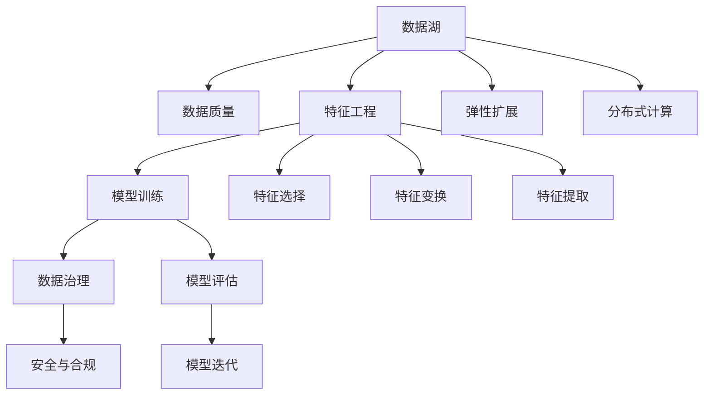

                 

# 自动驾驶公司的数据湖与特征工程平台

## 1. 背景介绍

### 1.1 问题由来
随着自动驾驶技术的不断成熟，自动驾驶公司面临海量数据的处理与分析任务。如何将这些数据高效地存储、管理和利用，是自动驾驶公司信息化建设中的一大难题。同时，自动驾驶的决策过程依赖于对高维度、非结构化数据的理解，特征工程在这其中扮演了至关重要的角色。如何设计高效、可扩展、易于维护的特征工程平台，成为当前自动驾驶领域亟需解决的问题。

### 1.2 问题核心关键点
自动驾驶公司数据湖与特征工程平台的构建，涉及到数据存储、数据治理、特征提取、模型训练等多个环节，各个环节相互关联，形成了一个复杂的生态系统。核心关键点包括：

1. 数据湖架构设计：如何构建一个能够高效存储、管理和查询海量数据的分布式数据平台。
2. 数据质量控制：如何通过数据清洗、数据验证等手段，保证数据的质量和一致性。
3. 特征工程流程化：如何设计一套标准的特征工程流程，实现特征提取、特征选择、特征变换等自动化操作。
4. 特征存储与管理：如何实现特征数据的存储、更新、版本控制等功能，支持特征数据的长期保存和快速回溯。
5. 模型训练与评估：如何在数据湖的基础上，构建模型训练与评估的管道，加速模型迭代和优化。

### 1.3 问题研究意义
构建自动驾驶公司数据湖与特征工程平台，对于推动自动驾驶技术的商业化落地具有重要意义：

1. 提升数据处理效率：通过分布式数据存储与处理技术，大幅提升数据处理效率，减少计算资源消耗。
2. 增强数据质量保障：通过严格的数据质量控制机制，确保数据的准确性和一致性，降低模型训练的风险。
3. 促进特征工程自动化：通过自动化特征工程流程，降低人工干预成本，加速模型优化迭代速度。
4. 优化模型训练管道：在数据湖的基础上，建立模型训练与评估的自动化管道，提升模型训练效率和性能。
5. 支持长期数据保存：通过高效的数据管理和存储技术，实现特征数据的长期保存，方便后续分析与迭代。

## 2. 核心概念与联系

### 2.1 核心概念概述

为更好地理解自动驾驶公司数据湖与特征工程平台，本节将介绍几个密切相关的核心概念：

- 数据湖：分布式存储和处理大规模数据的数据平台，支持数据的长期保存和弹性扩展。
- 特征工程：数据预处理的过程，包括特征提取、特征选择、特征变换等，旨在提高模型的预测性能。
- 数据质量：数据一致性、完整性、准确性的度量，是数据湖构建中的重要环节。
- 模型训练：通过输入特征数据，训练模型学习任务映射的机器学习过程。
- 数据治理：确保数据安全、合规、可靠的管理机制，是数据湖构建的重要保障。

这些核心概念之间的逻辑关系可以通过以下Mermaid流程图来展示：



这个流程图展示的数据湖与特征工程平台的核心概念及其之间的关系：

1. 数据湖是数据存储与处理的根基，通过弹性扩展和分布式计算，实现海量数据的存储和高效处理。
2. 数据质量是数据湖构建中的重要环节，通过数据清洗、验证等手段，确保数据的准确性和一致性。
3. 特征工程是数据预处理的过程，通过特征选择、变换等手段，提高模型的预测性能。
4. 模型训练是在数据湖的基础上进行的，通过输入特征数据，训练模型学习任务映射。
5. 数据治理确保数据安全、合规，是数据湖构建的重要保障。
6. 特征工程中包含了特征选择、特征变换和特征提取等操作。
7. 模型评估和迭代是在模型训练后进行的，用于验证模型性能并进行优化。

## 3. 核心算法原理 & 具体操作步骤
### 3.1 算法原理概述

自动驾驶公司数据湖与特征工程平台的构建，本质上是数据处理和特征工程在分布式计算环境下的实现。其核心思想是：将自动驾驶数据存储在分布式文件系统中，通过并行处理机制高效地进行数据清洗、特征提取和模型训练，形成数据湖与特征工程的整体架构。

形式化地，假设自动驾驶公司需要处理的数据量为 $D$，其中包含 $N$ 个样本，每个样本有 $M$ 个特征。则在数据湖中，数据存储和处理的流程如下：

1. 数据收集：从自动驾驶设备、传感器、地图服务器等源中收集原始数据，形成数据流。
2. 数据清洗：对数据进行去重、去噪、缺失值填充等预处理，确保数据的完整性和一致性。
3. 特征提取：从清洗后的数据中，提取有意义的特征，生成特征数据集。
4. 特征选择：对特征数据进行特征选择，保留对模型预测性能贡献大的特征。
5. 特征变换：对选择的特征进行数据变换，如标准化、归一化等，提高模型训练效果。
6. 特征存储：将特征数据存储在分布式文件系统中，支持快速读写和查询。
7. 模型训练：在特征数据的基础上，使用机器学习算法训练模型，学习任务映射。
8. 模型评估：对训练好的模型进行评估，验证其在验证集上的表现。
9. 模型迭代：根据评估结果，调整模型参数，进行模型迭代优化。

### 3.2 算法步骤详解

自动驾驶公司数据湖与特征工程平台的构建，通常包括以下几个关键步骤：

**Step 1: 数据湖构建**
- 选择合适的分布式文件系统，如Hadoop HDFS、Apache Cassandra等，部署数据湖基础设施。
- 安装并配置相关的计算框架，如Apache Spark、Apache Flink等，支持并行数据处理。
- 使用分布式存储技术，如Hadoop HBase、Apache Cassandra等，支持海量数据的存储和查询。

**Step 2: 数据质量控制**
- 设计数据质量标准和监控机制，对数据进行定期检查和验证。
- 使用ETL工具，如Apache Nifi、Apache Kafka等，自动抽取、清洗和加载数据。
- 引入数据质量工具，如Informatica Data Quality、Talend等，对数据进行清洗和校正。

**Step 3: 特征工程流程化**
- 定义特征工程的标准流程，包括特征提取、特征选择、特征变换等步骤。
- 使用特征工程框架，如Open Feature Engineering、AutoML等，自动化生成特征工程代码。
- 引入机器学习工具，如Scikit-learn、XGBoost等，进行特征选择和特征变换。

**Step 4: 特征存储与管理**
- 设计特征数据的存储架构，如Hadoop HDFS、Apache Cassandra等，支持高效的数据存储和查询。
- 使用版本控制工具，如Git、SVN等，管理特征数据的版本和变更历史。
- 引入特征数据库，如Apache Druid、Apache Cassandra等，支持特征数据的长期保存和查询。

**Step 5: 模型训练与评估**
- 构建模型训练管道，使用机器学习框架，如TensorFlow、PyTorch等，进行模型训练和评估。
- 设计模型评估指标，如准确率、召回率、F1值等，评估模型性能。
- 引入自动化模型训练平台，如Hyperopt、Keras Tuner等，自动化搜索模型超参数。

### 3.3 算法优缺点

自动驾驶公司数据湖与特征工程平台具有以下优点：
1. 高效存储与处理：通过分布式计算和存储技术，大幅提升数据处理效率，支持海量数据的存储和管理。
2. 数据质量保障：通过严格的数据质量控制机制，确保数据的准确性和一致性，降低模型训练的风险。
3. 特征工程自动化：通过自动化特征工程流程，降低人工干预成本，加速模型优化迭代速度。
4. 模型训练管道化：在数据湖的基础上，建立模型训练与评估的自动化管道，提升模型训练效率和性能。
5. 长期数据保存：通过高效的数据管理和存储技术，实现特征数据的长期保存，方便后续分析与迭代。

同时，该平台也存在一定的局限性：
1. 对技术要求高：构建和维护数据湖与特征工程平台需要较高的技术门槛，需要经验丰富的数据工程师和架构师。
2. 初始投资大：建设分布式数据平台和特征工程平台需要较大的初始投资，包括硬件设备和软件工具的采购。
3. 数据隐私与安全问题：分布式数据存储带来了数据隐私和安全问题，需要采取严格的数据管理和加密措施。
4. 平台复杂度高：平台建设涉及多个环节，集成多个工具和系统，管理复杂度较高。
5. 模型训练资源消耗大：大规模模型训练需要高性能计算资源，可能面临硬件资源不足的问题。

尽管存在这些局限性，但就目前而言，数据湖与特征工程平台仍然是自动驾驶领域数据处理与分析的重要工具，为自动驾驶技术的商业化落地提供了有力支持。未来相关研究的重点在于如何进一步优化平台架构，降低技术门槛，提高数据处理效率和模型训练性能，同时兼顾数据隐私和安全等伦理问题。

### 3.4 算法应用领域

自动驾驶公司数据湖与特征工程平台已经在自动驾驶领域得到了广泛的应用，覆盖了从数据存储、数据处理、特征工程到模型训练等多个环节，为自动驾驶技术的商业化落地提供了坚实的基础。具体应用场景包括：

- 数据采集与清洗：收集自动驾驶设备传感器数据、地图数据等，进行数据清洗和预处理。
- 特征提取与选择：从原始数据中提取有意义的特征，如车辆速度、轨迹、传感器数据等，进行特征选择和变换。
- 模型训练与评估：在数据湖的基础上，使用机器学习算法训练模型，评估模型性能，进行模型迭代优化。
- 模型部署与监控：将训练好的模型部署到生产环境，进行实时预测和监控，确保模型性能稳定。
- 数据可视化与分析：使用数据可视化工具，如Tableau、PowerBI等，分析自动驾驶数据，发现潜在问题和改进方向。

除了上述这些经典应用外，数据湖与特征工程平台还被创新性地应用于自动驾驶技术评估、安全事故分析、用户行为分析等新场景中，为自动驾驶技术的持续优化提供了数据支持。

## 4. 数学模型和公式 & 详细讲解  
### 4.1 数学模型构建

本节将使用数学语言对自动驾驶公司数据湖与特征工程平台进行更加严格的刻画。

假设自动驾驶公司需要处理的数据量为 $D$，其中包含 $N$ 个样本，每个样本有 $M$ 个特征。设数据湖中的特征数据量为 $F$，特征选择后的特征向量为 $\mathbf{X} \in \mathbb{R}^{N \times M}$。

定义特征工程的标准流程为：
- 特征提取：$T(\mathbf{X})$，将原始数据转换为特征数据。
- 特征选择：$S(T(\mathbf{X}))$，对特征数据进行选择。
- 特征变换：$T_2(S(T(\mathbf{X})))$，对选择的特征进行变换。

数据湖与特征工程平台的目标是最大化模型预测性能：
$$
\max_{T,S,T_2} \mathbb{E}[L(\hat{y},y)]
$$

其中，$\hat{y}$ 为模型预测结果，$y$ 为真实标签，$L(\cdot,\cdot)$ 为损失函数。

### 4.2 公式推导过程

以下我们以二分类任务为例，推导数据湖与特征工程平台构建的数学模型。

假设自动驾驶公司使用线性分类器进行二分类任务，特征数据集为 $\mathbf{X} \in \mathbb{R}^{N \times M}$。线性分类器的损失函数为交叉熵损失，定义为：
$$
L(y,\hat{y}) = -\frac{1}{N} \sum_{i=1}^N [y_i\log \hat{y}_i+(1-y_i)\log(1-\hat{y}_i)]
$$

根据特征工程的标准流程，特征数据集 $\mathbf{X}$ 需要经过特征提取 $T$、特征选择 $S$、特征变换 $T_2$ 等多个步骤。假设这些步骤可以表示为矩阵形式，即：
$$
T_2(S(T(\mathbf{X}))) = \mathbf{A}T(\mathbf{X})
$$

其中，$\mathbf{A}$ 为特征变换矩阵。因此，数据湖与特征工程平台的目标可以表示为：
$$
\max_{T,S,\mathbf{A}} \mathbb{E}[L(\hat{y},y)]
$$

引入正则化项 $\lambda$，避免过拟合：
$$
\max_{T,S,\mathbf{A}} -\frac{1}{N} \sum_{i=1}^N [y_i\log \hat{y}_i+(1-y_i)\log(1-\hat{y}_i)] - \lambda\|\mathbf{A}\|_F^2
$$

其中，$\|\mathbf{A}\|_F$ 为特征变换矩阵的 Frobenius 范数。

通过梯度下降等优化算法，求解上述优化问题，更新特征提取、特征选择、特征变换等参数，使模型预测性能最大化。

### 4.3 案例分析与讲解

以自动驾驶中的轨迹预测任务为例，展示数据湖与特征工程平台的构建过程。

假设自动驾驶车辆需要预测未来的轨迹，原始数据包括车辆速度、位置、方向等特征，数据流如下：
- 车辆传感器数据：实时采集车辆速度、位置、方向等特征。
- 地图数据：包括道路信息、交通信号、限速标志等。
- 历史轨迹数据：包括车辆历史行驶轨迹和事故记录等。

数据湖的构建流程如下：

1. 使用分布式文件系统 Hadoop HDFS 存储原始数据，支持海量数据的存储和读取。
2. 使用 Apache Spark 进行数据清洗和预处理，去除噪声和缺失数据。
3. 使用 Apache Cassandra 存储清洗后的特征数据，支持高并发读写和查询。

特征工程流程如下：

1. 特征提取：从传感器数据中提取车辆速度、位置、方向等特征。
2. 特征选择：选择对轨迹预测影响大的特征，如速度、方向、交通信号等。
3. 特征变换：对选择的特征进行标准化、归一化等变换，提高模型训练效果。

特征存储与管理如下：

1. 使用 Git 进行特征数据的版本控制，记录特征数据的变化历史。
2. 使用 Apache Druid 进行特征数据的查询和分析，支持实时数据探查和历史数据回溯。

模型训练与评估流程如下：

1. 使用 TensorFlow 进行模型训练，学习轨迹预测的映射关系。
2. 使用交叉熵损失函数评估模型性能，优化模型参数。
3. 使用 Keras Tuner 自动化搜索模型超参数，加速模型优化。

通过上述流程，自动驾驶公司可以高效地处理、存储、分析和利用自动驾驶数据，实现轨迹预测等任务的模型训练与优化。

## 5. 项目实践：代码实例和详细解释说明
### 5.1 开发环境搭建

在进行数据湖与特征工程平台实践前，我们需要准备好开发环境。以下是使用Python进行Apache Spark开发的环境配置流程：

1. 安装Anaconda：从官网下载并安装Anaconda，用于创建独立的Python环境。

2. 创建并激活虚拟环境：
```bash
conda create -n spark-env python=3.8 
conda activate spark-env
```

3. 安装PySpark：
```bash
pip install pyspark
```

4. 安装Spark和其他工具包：
```bash
pip install pyspark-notebook fsspec dask[dataframe]
```

5. 启动Jupyter Notebook环境：
```bash
jupyter notebook
```

完成上述步骤后，即可在`spark-env`环境中开始数据湖与特征工程平台的开发实践。

### 5.2 源代码详细实现

这里我们以自动驾驶中的轨迹预测任务为例，给出使用Apache Spark进行特征工程和模型训练的PySpark代码实现。

首先，定义特征工程函数：

```python
from pyspark.sql.functions import col, transform, string_upper

def feature_engineering(df):
    # 特征提取
    df = df.withColumn("speed", df["speed"].round(2))
    df = df.withColumn("direction", df["direction"].replace("N", 1).replace("S", -1).replace("E", 1).replace("W", -1))
    
    # 特征选择
    df = df.select("speed", "direction", "traffic_signals", "accident_records")
    
    # 特征变换
    df = df.withColumn("speed_norm", df["speed"] / 100)
    df = df.withColumn("direction_cos", df["direction"] / 360 * 2 * math.pi)
    
    return df
```

然后，定义数据处理和特征工程函数：

```python
from pyspark.sql import SparkSession

spark = SparkSession.builder.appName("autodrive_feature_engineering").getOrCreate()

# 读取数据
df = spark.read.format("csv").option("header", "true").load("data.csv")

# 特征工程
df = feature_engineering(df)

# 数据保存
df.write.format("parquet").save("data_parquet")
```

接着，定义模型训练和评估函数：

```python
from pyspark.ml.classification import LogisticRegression
from pyspark.ml.tuning import CrossValidator

# 定义模型
lr = LogisticRegression(featuresCol="features", labelCol="label", maxIter=10, regParam=0.1)

# 定义交叉验证器
cv = CrossValidator(estimator=lr, estimatorParamMaps=[{"regParam": [0.1, 0.01, 0.001]}, {"maxIter": [10, 20, 30]}], numFolds=5)

# 训练模型
cv.fit(df.select("features", "label"))

# 评估模型
cv.evaluate(df.select("features", "label"))
```

最后，启动特征工程和模型训练流程：

```python
# 特征工程
feature_engineering(df)

# 模型训练与评估
lr = LogisticRegression(featuresCol="features", labelCol="label", maxIter=10, regParam=0.1)
cv = CrossValidator(estimator=lr, estimatorParamMaps=[{"regParam": [0.1, 0.01, 0.001]}, {"maxIter": [10, 20, 30]}], numFolds=5)
cv.fit(df.select("features", "label"))
cv.evaluate(df.select("features", "label"))
```

以上就是使用Apache Spark进行特征工程和模型训练的完整代码实现。可以看到，得益于Spark的强大封装，我们可以用相对简洁的代码完成自动驾驶数据的处理和模型训练。

### 5.3 代码解读与分析

让我们再详细解读一下关键代码的实现细节：

**特征工程函数**：
- `feature_engineering`方法：对原始数据进行特征提取、特征选择和特征变换。
- 特征提取：将车辆速度进行四舍五入处理，将方向数据进行标准化处理。
- 特征选择：选择对轨迹预测影响大的特征，如速度、方向、交通信号等。
- 特征变换：对速度和方向进行归一化处理，提高模型训练效果。

**数据处理与特征工程函数**：
- 使用Spark读取CSV文件，并进行数据清洗和预处理。
- 调用特征工程函数，对原始数据进行特征提取、特征选择和特征变换。
- 使用Parquet格式保存处理后的特征数据，便于后续查询和分析。

**模型训练与评估函数**：
- 定义逻辑回归模型，使用交叉验证器优化模型参数。
- 使用交叉验证器进行模型训练和评估，找到最优的模型参数组合。
- 评估训练好的模型，输出模型性能指标。

**特征工程和模型训练流程**：
- 先进行特征工程，处理原始数据，生成特征数据集。
- 再进行模型训练，使用逻辑回归模型进行轨迹预测。
- 最后进行模型评估，输出模型性能指标，指导后续优化。

可以看到，Apache Spark框架使得数据湖与特征工程平台的构建变得简洁高效。开发者可以将更多精力放在数据处理、模型优化等高层逻辑上，而不必过多关注底层的实现细节。

当然，工业级的系统实现还需考虑更多因素，如数据增强、模型部署、超参数搜索等。但核心的数据湖与特征工程流程基本与此类似。

## 6. 实际应用场景
### 6.1 智能驾驶决策系统

自动驾驶公司数据湖与特征工程平台，可以应用于智能驾驶决策系统的构建。传统驾驶系统依赖于驾驶员的经验和直觉，难以应对复杂的驾驶场景。而基于数据湖与特征工程平台的智能驾驶系统，能够从海量数据中学习驾驶行为和环境因素的规律，实现自主决策和智能导航。

在技术实现上，可以收集车辆传感器数据、地图数据、历史行驶数据等，构建数据湖和特征工程平台。使用机器学习算法训练模型，实时处理传感器数据和环境信息，输出最优驾驶策略。在遇到复杂场景时，系统可以主动提出预警，并提供驾驶建议。

### 6.2 自动驾驶车辆路径规划

自动驾驶公司数据湖与特征工程平台，可以应用于自动驾驶车辆路径规划任务。路径规划是自动驾驶的核心环节，需要综合考虑交通状况、车辆位置、道路条件等因素。通过构建数据湖和特征工程平台，自动驾驶公司可以高效处理多源数据，实现路径规划的自动化。

在路径规划任务中，数据湖和特征工程平台可以支持从地图数据、历史轨迹数据、实时传感器数据等多源数据中提取特征，构建特征数据集。使用机器学习算法训练模型，预测最优路径，并进行路径优化。

### 6.3 自动驾驶车辆异常检测

自动驾驶公司数据湖与特征工程平台，可以应用于自动驾驶车辆异常检测任务。异常检测是自动驾驶安全保障的关键环节，需要及时发现和处理车辆异常情况，确保行车安全。

在异常检测任务中，数据湖和特征工程平台可以支持从车辆传感器数据、地图数据、历史异常记录等多源数据中提取特征，构建特征数据集。使用机器学习算法训练模型，实时检测车辆异常情况，并输出预警信息。

### 6.4 未来应用展望

随着数据湖与特征工程平台的发展，其在自动驾驶领域的应用前景广阔：

1. 提升数据处理效率：通过分布式数据存储和处理技术，大幅提升数据处理效率，降低计算资源消耗。
2. 增强数据质量保障：通过严格的数据质量控制机制，确保数据的准确性和一致性，降低模型训练的风险。
3. 促进特征工程自动化：通过自动化特征工程流程，降低人工干预成本，加速模型优化迭代速度。
4. 优化模型训练管道：在数据湖的基础上，建立模型训练与评估的自动化管道，提升模型训练效率和性能。
5. 支持长期数据保存：通过高效的数据管理和存储技术，实现特征数据的长期保存，方便后续分析与迭代。

## 7. 工具和资源推荐
### 7.1 学习资源推荐

为了帮助开发者系统掌握自动驾驶公司数据湖与特征工程平台的技术基础和实践技巧，这里推荐一些优质的学习资源：

1. 《Apache Spark 实战指南》：详细介绍了Spark框架的核心概念和应用场景，适合初学者入门。

2. 《深度学习与数据工程》：介绍了深度学习技术在数据工程中的应用，包括特征工程、模型训练、模型评估等环节。

3. 《机器学习实战》：通过多个实际案例，展示了机器学习技术在自动驾驶中的应用，包括数据采集、数据处理、模型训练等环节。

4. 《Apache Hadoop 3 权威指南》：详细介绍了Hadoop框架的构建和应用，适合深入学习大数据技术。

5. 《Apache Cassandra 权威指南》：详细介绍了Cassandra框架的构建和应用，适合学习分布式数据库技术。

通过对这些资源的学习实践，相信你一定能够快速掌握数据湖与特征工程平台的精髓，并用于解决实际的自动驾驶问题。

### 7.2 开发工具推荐

高效的开发离不开优秀的工具支持。以下是几款用于数据湖与特征工程平台开发的常用工具：

1. Apache Spark：基于内存计算的分布式计算框架，支持大规模数据处理和并行计算。

2. Apache Cassandra：分布式数据库，支持高并发读写和海量数据存储。

3. Apache HDFS：分布式文件系统，支持海量数据的存储和读取。

4. PySpark：Python语言接口的Spark，提供了丰富的API和便捷的开发体验。

5. Jupyter Notebook：交互式编程环境，支持代码块、注释、Markdown等格式，适合开发和实验。

合理利用这些工具，可以显著提升数据湖与特征工程平台的开发效率，加快创新迭代的步伐。

### 7.3 相关论文推荐

数据湖与特征工程平台的构建，涉及分布式计算、数据处理、机器学习等多个领域。以下是几篇奠基性的相关论文，推荐阅读：

1. "A Survey of Large-Scale Machine Learning Paradigms"：回顾了大规模机器学习的主要范式，包括分布式计算、在线学习、迁移学习等。

2. "The Hadoop Distributed File System"：介绍Hadoop HDFS的构建原理和应用场景，是理解分布式文件系统的经典文献。

3. "Apache Cassandra: A Decentralized Sequence Database"：介绍Cassandra框架的设计理念和应用场景，是理解分布式数据库技术的经典文献。

4. "Feature Engineering for Explainable Machine Learning"：探讨了特征工程在解释性机器学习中的应用，提供了实用的特征工程技巧和案例。

5. "Spark SQL: Distributed Relational Query Processing with Spark"：介绍Spark SQL的核心概念和应用场景，是理解Spark数据处理技术的经典文献。

这些论文代表了大数据与特征工程平台的发展脉络。通过学习这些前沿成果，可以帮助研究者把握学科前进方向，激发更多的创新灵感。

## 8. 总结：未来发展趋势与挑战

### 8.1 总结

本文对自动驾驶公司数据湖与特征工程平台进行了全面系统的介绍。首先阐述了自动驾驶公司数据湖与特征工程平台的研究背景和意义，明确了其在自动驾驶数据处理与分析中的核心价值。其次，从原理到实践，详细讲解了数据湖与特征工程平台的数学原理和关键步骤，给出了数据湖与特征工程平台开发的完整代码实例。同时，本文还广泛探讨了数据湖与特征工程平台在智能驾驶决策系统、路径规划、异常检测等多个领域的应用前景，展示了其在自动驾驶技术商业化落地中的重要意义。此外，本文精选了数据湖与特征工程平台的各类学习资源，力求为读者提供全方位的技术指引。

通过本文的系统梳理，可以看到，自动驾驶公司数据湖与特征工程平台是自动驾驶技术落地的重要支撑，极大地提升了数据处理效率和模型训练性能。未来，伴随大数据与机器学习技术的不断演进，数据湖与特征工程平台将迎来更多创新应用，为自动驾驶技术的商业化落地提供坚实的基础。

### 8.2 未来发展趋势

展望未来，自动驾驶公司数据湖与特征工程平台将呈现以下几个发展趋势：

1. 数据处理效率持续提升：通过分布式计算和存储技术，实现海量数据的快速处理和分析。

2. 数据质量保障更加严格：引入数据清洗、验证等手段，确保数据的准确性和一致性，降低模型训练的风险。

3. 特征工程自动化程度提高：通过自动化特征工程流程，降低人工干预成本，加速模型优化迭代速度。

4. 模型训练管道化进一步优化：在数据湖的基础上，建立更加高效、可靠的模型训练和评估管道。

5. 长期数据保存和分析能力增强：通过高效的数据管理和存储技术，实现特征数据的长期保存和快速回溯，支持后续分析和优化。

6. 跨领域融合创新应用涌现：结合计算机视觉、自然语言处理等多领域技术，实现跨领域融合创新应用，提升自动驾驶系统的性能。

以上趋势凸显了数据湖与特征工程平台的广阔前景。这些方向的探索发展，必将进一步提升自动驾驶系统的性能和应用范围，为自动驾驶技术的商业化落地提供坚实的技术支撑。

### 8.3 面临的挑战

尽管自动驾驶公司数据湖与特征工程平台已经取得了显著成效，但在迈向更加智能化、普适化应用的过程中，仍面临诸多挑战：

1. 技术门槛高：构建和维护数据湖与特征工程平台需要较高的技术门槛，需要经验丰富的数据工程师和架构师。

2. 初始投资大：建设分布式数据平台和特征工程平台需要较大的初始投资，包括硬件设备和软件工具的采购。

3. 数据隐私与安全问题：分布式数据存储带来了数据隐私和安全问题，需要采取严格的数据管理和加密措施。

4. 平台复杂度高：平台建设涉及多个环节，集成多个工具和系统，管理复杂度较高。

5. 模型训练资源消耗大：大规模模型训练需要高性能计算资源，可能面临硬件资源不足的问题。

尽管存在这些挑战，但就目前而言，数据湖与特征工程平台仍然是自动驾驶领域数据处理与分析的重要工具，为自动驾驶技术的商业化落地提供了有力支持。未来相关研究的重点在于如何进一步优化平台架构，降低技术门槛，提高数据处理效率和模型训练性能，同时兼顾数据隐私和安全等伦理问题。

### 8.4 研究展望

面对自动驾驶公司数据湖与特征工程平台所面临的挑战，未来的研究需要在以下几个方面寻求新的突破：

1. 探索无监督和半监督数据处理技术：摆脱对大规模标注数据的依赖，利用自监督学习、主动学习等无监督和半监督范式，最大限度利用非结构化数据，实现更加灵活高效的数据处理。

2. 研究参数高效和计算高效的特征工程方法：开发更加参数高效的特征工程方法，在固定大部分特征数据的基础上，只更新极少量的特征工程参数。同时优化特征工程的计算图，减少前向传播和反向传播的资源消耗，实现更加轻量级、实时性的特征工程。

3. 引入因果推断和对比学习思想：通过引入因果推断和对比学习思想，增强特征工程模型建立稳定因果关系的能力，学习更加普适、鲁棒的语言表征，从而提升模型泛化性和抗干扰能力。

4. 结合符号化的先验知识：将符号化的先验知识，如知识图谱、逻辑规则等，与神经网络模型进行巧妙融合，引导特征工程过程学习更准确、合理的语言模型。

5. 引入更多领域专家的知识：将领域专家的知识与特征工程过程进行结合，形成更加全面、准确的特征工程模型。

这些研究方向的探索，必将引领自动驾驶公司数据湖与特征工程平台迈向更高的台阶，为自动驾驶技术的商业化落地提供坚实的技术支撑。面向未来，数据湖与特征工程平台还需要与其他人工智能技术进行更深入的融合，如计算机视觉、自然语言处理、强化学习等，多路径协同发力，共同推动自动驾驶技术的持续优化和发展。只有勇于创新、敢于突破，才能不断拓展自动驾驶数据处理与分析的边界，让自动驾驶技术在更多领域得到广泛应用，造福人类社会的方方面面。

## 9. 附录：常见问题与解答

**Q1：什么是数据湖？**

A: 数据湖是一个集成了各种数据源、存储和处理能力的分布式数据平台，支持海量数据的存储和管理。它通常由分布式文件系统、分布式数据库、数据清洗工具等组成。

**Q2：如何选择合适的特征工程方法？**

A: 特征工程方法的选择应基于任务的性质和数据的特点。通常需要考虑特征提取、特征选择、特征变换等多个环节。可以采用经验法、自动化法、结合领域知识法等多种方法，选择最适合的特征工程流程。

**Q3：自动驾驶公司数据湖与特征工程平台的主要应用场景是什么？**

A: 自动驾驶公司数据湖与特征工程平台的主要应用场景包括数据采集与清洗、特征提取与选择、模型训练与评估等。具体场景包括智能驾驶决策系统、自动驾驶车辆路径规划、自动驾驶车辆异常检测等。

**Q4：如何优化特征工程流程？**

A: 优化特征工程流程的方法包括：
1. 引入领域知识：将领域专家的知识与特征工程过程进行结合，形成更加全面、准确的特征工程模型。
2. 自动化特征工程：通过自动化特征工程流程，降低人工干预成本，加速模型优化迭代速度。
3. 引入因果推断和对比学习思想：通过引入因果推断和对比学习思想，增强特征工程模型建立稳定因果关系的能力，学习更加普适、鲁棒的语言表征。
4. 结合符号化的先验知识：将符号化的先验知识，如知识图谱、逻辑规则等，与神经网络模型进行巧妙融合，引导特征工程过程学习更准确、合理的语言模型。

**Q5：如何构建高效的数据湖？**

A: 构建高效的数据湖需要考虑以下几个方面：
1. 选择合适的分布式文件系统，如Hadoop HDFS、Apache Cassandra等。
2. 使用分布式计算框架，如Apache Spark、Apache Flink等，支持并行数据处理。
3. 使用分布式数据库，如Apache Cassandra、Apache Hive等，支持高并发读写和海量数据存储。
4. 引入数据质量工具，如Informatica Data Quality、Talend等，对数据进行清洗和校正。
5. 使用数据可视化工具，如Tableau、PowerBI等，进行数据探查和分析，发现数据问题。

这些方法可以显著提升数据湖的构建效率和数据处理能力，支持自动驾驶数据的高效管理和分析。

---

作者：禅与计算机程序设计艺术 / Zen and the Art of Computer Programming

