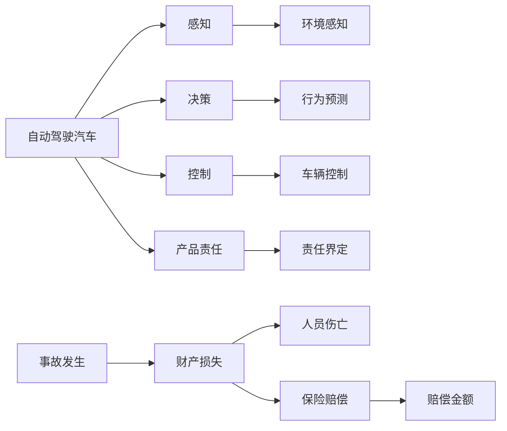

                 

# 自动驾驶行业的产品责任与保险模式

## 1. 背景介绍

随着自动驾驶技术的不断发展，其产品责任与保险问题逐渐成为行业关注的焦点。自动驾驶汽车通过复杂的感知、决策和控制算法，在复杂的城市道路上进行自主驾驶，与传统驾驶模式存在显著差异。其产品责任与保险问题涉及复杂的法律、技术和经济问题，需要系统性研究和解决方案。

### 1.1 背景与现状
自动驾驶技术目前仍处于发展阶段，涉及的法律法规、技术标准、责任归属和保险产品等尚未完全明确。近年来，各大厂商和研究机构在自动驾驶技术的研发、测试和应用方面取得了显著进展，但也出现了多起交通事故和事故纠纷，引发了公众对自动驾驶安全性的担忧，促使政府、企业和学术界深入探讨其产品责任与保险模式。

### 1.2 问题提出
自动驾驶汽车在行驶过程中可能出现意外碰撞、故障、软件故障等问题，导致乘客或第三方人员伤亡或财产损失。如何合理界定自动驾驶厂商、软件开发商、车辆制造商、保险公司等各方责任，制定科学合理的保险方案，成为亟待解决的重要问题。

## 2. 核心概念与联系

### 2.1 核心概念概述

- **自动驾驶**：指通过车载传感器、摄像头、雷达、激光雷达等设备感知周围环境，利用人工智能算法进行决策，实现车辆自主行驶的技术。
- **产品责任**：指产品生产者或销售者因产品缺陷导致他人损害，依法应承担的侵权责任。
- **保险**：指保险公司向投保人收取保费，在保险合同约定的保险事故发生时，对投保人给予经济补偿的商业行为。
- **自动驾驶汽车**：指配备高级驾驶辅助系统(ADAS)或完全自动驾驶系统(全自动驾驶)的汽车，能够实现一定程度的自主决策和控制。
- **道德风险**：指由于保险合同的存在，被保险人可能故意制造事故或隐瞒信息，以获得保险赔偿的现象。
- **因果关系**：指事件之间的逻辑关系，自动驾驶事故中，需明确事件发生的直接原因和间接原因，以确定责任归属。

### 2.2 核心概念原理和架构的 Mermaid 流程图



## 3. 核心算法原理 & 具体操作步骤
### 3.1 算法原理概述

自动驾驶汽车的产品责任与保险问题，涉及到多方的法律、技术和经济因素。解决这一问题需要构建一套系统化的产品责任与保险模式，包括产品责任界定、保险方案设计、风险评估与控制等环节。

### 3.2 算法步骤详解

#### 3.2.1 产品责任界定

产品责任界定是自动驾驶汽车产品责任的核心，涉及对自动驾驶厂商、软件开发商、车辆制造商的责任判定。主要步骤如下：

1. **因果关系分析**：确定事故的直接原因和间接原因。例如，硬件故障、软件缺陷、人为干预、道路环境等因素。
2. **责任判定标准**：根据因果关系分析结果，制定明确的产品责任判定标准。例如，自动驾驶系统在感知、决策、控制等环节存在缺陷，导致事故发生的，自动驾驶厂商和软件开发商需承担主要责任。
3. **责任承担方式**：根据责任判定标准，明确责任方应承担的具体责任形式，例如赔偿、修复、改进措施等。

#### 3.2.2 保险方案设计

保险方案设计是自动驾驶汽车保险的核心，涉及保险产品设计、保费定价和赔偿处理等环节。主要步骤如下：

1. **风险评估**：评估自动驾驶汽车面临的风险，包括硬件故障、软件缺陷、人为干预、道路环境等因素。
2. **保费定价**：根据风险评估结果，设计合理的保险产品，并根据不同场景和风险水平，制定差异化的保费定价方案。
3. **赔偿处理**：制定详细的赔偿处理流程，包括事故报告、责任界定、理赔申请和赔偿处理等环节。

#### 3.2.3 风险评估与控制

风险评估与控制是确保自动驾驶汽车安全和稳定的关键，涉及风险识别、风险管理和风险监测等环节。主要步骤如下：

1. **风险识别**：识别自动驾驶汽车在运行过程中面临的各种风险因素，例如传感器失效、软件漏洞、人为失误等。
2. **风险管理**：采取有效的风险管理措施，降低事故发生率。例如，加强传感器校准、软件优化、人为干预监控等。
3. **风险监测**：实时监测自动驾驶汽车运行状态，及时发现并处理潜在风险。例如，利用数据分析、实时监控等技术手段，及时预警和处理异常情况。

### 3.3 算法优缺点

#### 3.3.1 优点

- **系统性**：产品责任与保险模式涉及多方面因素，系统性研究和解决方案能够全面考虑各方面问题，确保自动驾驶汽车的安全性和稳定性。
- **科学性**：基于因果关系分析和风险评估，能够客观、科学地界定责任和设计保险方案，避免道德风险和法律纠纷。
- **灵活性**：根据不同场景和风险水平，灵活设计保险产品和保费定价方案，满足不同需求和预期。

#### 3.3.2 缺点

- **复杂性**：自动驾驶汽车面临的法律法规和技术标准尚未完全明确，导致产品责任和保险方案设计复杂，需综合考虑多方因素。
- **不确定性**：自动驾驶汽车的运行环境复杂多样，可能面临难以预测的突发情况，增加风险评估和控制的难度。
- **成本高**：产品责任和保险方案设计、实施和维护需要高额的成本，包括技术研发、法律法规咨询、保险费用等。

### 3.4 算法应用领域

自动驾驶汽车的产品责任与保险模式，适用于以下领域：

- **汽车制造**：车辆制造商和自动驾驶厂商需根据责任判定标准，设计和改进自动驾驶系统的性能和安全。
- **保险行业**：保险公司需设计符合自动驾驶场景的保险产品，制定差异化的保费定价方案和赔偿处理流程。
- **法律法规**：政府需制定和完善自动驾驶汽车的法律法规，明确各方责任和保险要求。
- **行业标准**：行业需制定统一的自动驾驶汽车技术标准和测试方法，确保产品质量和安全性。

## 4. 数学模型和公式 & 详细讲解 & 举例说明

### 4.1 数学模型构建

自动驾驶汽车的产品责任与保险问题，可以构建如下数学模型：

$$
\text{总责任} = \text{直接责任} + \text{间接责任}
$$

其中，直接责任指自动驾驶系统在感知、决策、控制等环节存在的缺陷，导致事故发生的责任；间接责任指由于外部环境、人为干预等因素导致的责任。

### 4.2 公式推导过程

基于上述数学模型，推导如下公式：

$$
\text{直接责任} = \text{系统故障率} \times \text{事故发生概率} \times \text{损害赔偿}
$$

$$
\text{间接责任} = \text{环境风险系数} \times \text{事故发生概率} \times \text{损害赔偿}
$$

其中，系统故障率指自动驾驶系统在运行过程中发生故障的概率，环境风险系数指外部环境对事故发生的影响系数，事故发生概率和损害赔偿可根据具体情况进行调整。

### 4.3 案例分析与讲解

假设某自动驾驶汽车在行驶过程中发生碰撞事故，导致车辆损坏和乘客受伤。根据数学模型，需分别计算直接责任和间接责任：

1. **直接责任计算**：
   - 系统故障率为0.01（即每100次运行中有1次发生故障）
   - 事故发生概率为0.1
   - 损害赔偿为10万元
   - 直接责任 = 0.01 * 0.1 * 10万元 = 1万元

2. **间接责任计算**：
   - 环境风险系数为1.2（即环境对事故影响较大）
   - 事故发生概率为0.1
   - 损害赔偿为10万元
   - 间接责任 = 1.2 * 0.1 * 10万元 = 1.2万元

根据责任判定标准，自动驾驶厂商需承担直接责任1万元，车辆制造商需承担间接责任1.2万元。保险公司需根据保险合同，进行相应赔偿。

## 5. 项目实践：代码实例和详细解释说明

### 5.1 开发环境搭建

开发自动驾驶汽车的产品责任与保险方案，需要搭建Python开发环境，具体步骤如下：

1. **安装Python**：从官网下载Python3.x版本，进行安装。
2. **安装必要的库**：安装Pandas、NumPy、Scikit-learn等数据分析和机器学习库。
3. **设置虚拟环境**：使用Virtualenv或Anaconda创建虚拟环境，以隔离不同项目的依赖关系。
4. **配置开发环境**：配置必要的开发工具，如PyCharm、Jupyter Notebook等。

### 5.2 源代码详细实现

下面给出一个简单的Python代码示例，用于计算自动驾驶汽车的直接责任和间接责任：

```python
import numpy as np
import pandas as pd

# 假设数据
system_fault_rate = 0.01
accident_probability = 0.1
damage_compensation = 100000
environment_risk_coefficient = 1.2

# 计算直接责任和间接责任
direct_responsibility = system_fault_rate * accident_probability * damage_compensation
indirect_responsibility = environment_risk_coefficient * accident_probability * damage_compensation

# 输出结果
print(f"直接责任：{direct_responsibility}万元")
print(f"间接责任：{indirect_responsibility}万元")
```

### 5.3 代码解读与分析

上述代码通过简单计算，实现了自动驾驶汽车直接责任和间接责任的计算。具体步骤如下：

1. **引入库**：使用NumPy和Pandas库，方便数据处理和计算。
2. **定义数据**：定义系统故障率、事故发生概率、损害赔偿和环境风险系数等关键数据。
3. **计算责任**：根据数学模型，计算直接责任和间接责任。
4. **输出结果**：打印计算结果，供开发者和用户查看。

## 6. 实际应用场景

### 6.1 智能交通管理

智能交通管理系统中，自动驾驶汽车的产品责任与保险问题具有重要应用价值。通过分析自动驾驶汽车的运行数据，可以评估系统性能，优化决策算法，降低事故发生率。同时，为系统设计科学合理的保险方案，确保事故发生时的及时赔偿，保障公共安全。

### 6.2 商业保险业务

商业保险公司需开发适用于自动驾驶汽车的保险产品，设计合理的保费定价和赔偿处理流程。例如，针对不同自动驾驶级别（L1-L5），设计差异化的保费和赔偿方案，降低道德风险，保障保险公司和客户的权益。

### 6.3 城市配送物流

城市配送物流行业需针对自动驾驶汽车的运行特点，设计符合实际场景的产品责任与保险方案。例如，根据配送路线、车辆类型和驾驶行为，评估不同环节的风险水平，制定差异化的保费和赔偿标准。

### 6.4 未来应用展望

随着自动驾驶技术的发展和应用场景的拓展，产品责任与保险问题将更加复杂和多样。未来，产品责任与保险模式将朝着以下方向发展：

- **动态调整**：根据自动驾驶系统的运行数据和事故记录，动态调整保费和赔偿标准，确保保险方案的公平性和合理性。
- **多层次保险**：设计多层次保险产品，覆盖不同风险水平和场景，降低道德风险和赔偿纠纷。
- **人工智能应用**：引入人工智能技术，进行自动驾驶系统的实时监测和风险预警，优化保险方案的设计和实施。

## 7. 工具和资源推荐

### 7.1 学习资源推荐

- **《自动驾驶技术及应用》**：全面介绍自动驾驶技术的基本原理、系统架构和应用场景，是理解自动驾驶汽车产品责任与保险问题的入门必读。
- **《自动驾驶法规与标准》**：收录自动驾驶汽车的法律法规和技术标准，提供权威的法规参考。
- **《自动驾驶保险原理与实践》**：详细介绍自动驾驶保险的基本原理、产品设计和理赔流程，是理解自动驾驶保险模式的关键读物。
- **Coursera《自动驾驶技术》课程**：由斯坦福大学教授主讲，涵盖自动驾驶技术的多方面内容，包括产品责任与保险问题。

### 7.2 开发工具推荐

- **PyCharm**：功能强大的Python集成开发环境，支持数据分析、机器学习和可视化等。
- **Jupyter Notebook**：开源的交互式计算平台，方便编写和运行Python代码，支持数据可视化和报告生成。
- **Virtualenv**：Python虚拟环境管理工具，方便管理和隔离不同项目的依赖关系。
- **NumPy和Pandas**：高效的数据处理和分析库，支持数组、矩阵、数据框等数据结构。
- **Scikit-learn**：机器学习库，提供丰富的算法和工具，支持分类、回归、聚类等任务。

### 7.3 相关论文推荐

- **《自动驾驶系统中的产品责任与保险问题》**：分析自动驾驶系统的责任归属和保险模式，提出系统化的解决方案。
- **《基于因果分析的自动驾驶产品责任界定方法》**：提出基于因果分析的产品责任界定方法，提高责任判定的科学性和合理性。
- **《自动驾驶保险方案设计》**：设计符合自动驾驶场景的保险产品，提供差异化的保费和赔偿方案。
- **《自动驾驶安全与保险》**：系统介绍自动驾驶汽车的安全性评估和保险模式，提供实际应用案例。

## 8. 总结：未来发展趋势与挑战

### 8.1 研究成果总结

本文从背景、核心概念、算法原理和操作步骤等方面，系统介绍了自动驾驶行业的产品责任与保险模式。通过数学模型和实际案例，展示了自动驾驶汽车的产品责任界定和保险方案设计过程。结合实际应用场景和工具资源，为开发者和相关从业人员提供了详细的参考和指导。

### 8.2 未来发展趋势

自动驾驶行业的产品责任与保险问题将随着技术的发展和应用的深入，不断演进和变化。未来，产品责任与保险模式将朝着以下方向发展：

- **技术驱动**：引入人工智能、大数据和云计算等技术，优化产品责任与保险方案的设计和实施。
- **法规完善**：政府和行业需制定和完善自动驾驶汽车的法律法规，明确各方责任和保险要求。
- **市场化应用**：自动驾驶汽车的保险市场将逐步成熟，保险公司和客户将享受更多个性化的保险产品和服务。

### 8.3 面临的挑战

自动驾驶汽车的产品责任与保险问题仍面临诸多挑战，主要包括：

- **法律法规不完善**：自动驾驶汽车的法律法规尚未完全明确，导致责任归属和保险方案设计复杂。
- **技术标准不一致**：不同厂商和地区制定的技术标准和测试方法不一致，增加了产品责任与保险的复杂性。
- **数据隐私和安全**：自动驾驶汽车的运行数据涉及大量敏感信息，需采取有效的数据保护措施。

### 8.4 研究展望

为应对这些挑战，未来的研究需要在以下几个方面寻求新的突破：

- **技术规范**：制定统一的自动驾驶汽车技术标准和测试方法，确保产品质量和安全性。
- **法规制定**：完善自动驾驶汽车的法律法规，明确各方责任和保险要求。
- **市场监管**：建立自动驾驶汽车的市场监管机制，保障市场健康发展。

总之，自动驾驶行业的产品责任与保险问题需多方协同努力，共同推动技术的进步和应用的普及。只有系统性解决好这一问题，才能让自动驾驶技术更好地服务于社会和经济，实现人与车、车与车的协同共生。

## 9. 附录：常见问题与解答

### 9.1 问题1：自动驾驶汽车的责任界定标准是什么？

答：自动驾驶汽车的责任界定主要依据因果关系分析结果，区分直接责任和间接责任。例如，自动驾驶系统在感知、决策、控制等环节存在缺陷，导致事故发生的，自动驾驶厂商和软件开发商需承担主要责任。

### 9.2 问题2：如何设计自动驾驶汽车的保险方案？

答：设计自动驾驶汽车的保险方案需进行风险评估和保费定价，根据不同场景和风险水平，设计差异化的保费和赔偿方案。例如，针对不同自动驾驶级别（L1-L5），设计差异化的保费和赔偿标准。

### 9.3 问题3：自动驾驶汽车的运行数据涉及哪些隐私信息？

答：自动驾驶汽车的运行数据涉及大量敏感信息，如车辆位置、行驶速度、传感器数据等。需采取有效的数据保护措施，确保数据安全和隐私保护。

### 9.4 问题4：如何降低自动驾驶汽车的道德风险？

答：通过设计合理的保险产品，设定差异化的保费和赔偿标准，降低道德风险。例如，对于故意制造事故的行为，保险公司不予理赔，并追究法律责任。

### 9.5 问题5：自动驾驶汽车的法律法规现状如何？

答：自动驾驶汽车的法律法规尚未完全明确，各国和地区存在较大差异。政府和行业需共同努力，制定统一的法律法规，明确各方责任和保险要求。

---

作者：禅与计算机程序设计艺术 / Zen and the Art of Computer Programming

