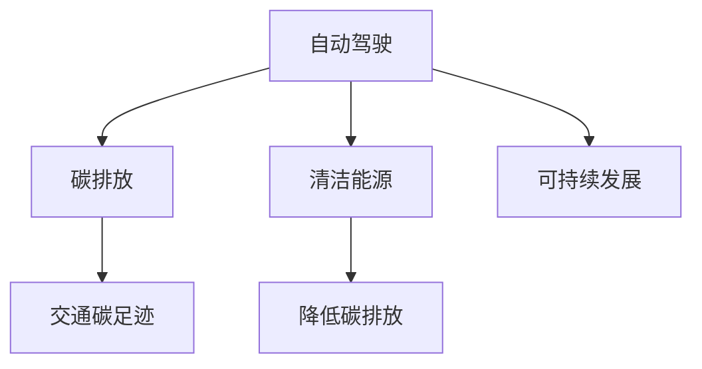

                 

## 1. 背景介绍

### 1.1 问题由来
自动驾驶行业正处于迅猛发展的关键时期，其对交通、物流、智能城市等领域带来的变革性影响被广泛认可。然而，随着自动驾驶车辆数量增多，相关的碳排放问题也日益凸显。根据国际能源署(IEA)的预测，到2030年，自动驾驶车辆所带来的碳排放量可能达到1700万吨/年，占全球碳排放总量的1%。这一增长速度引起学界和业界的高度关注，自动驾驶行业亟需探索有效的碳排放控制和可持续发展策略。

### 1.2 问题核心关键点
自动驾驶行业的碳排放问题主要体现在两个方面：一是自动驾驶车辆的使用过程中直接产生的碳排放，如燃油和电能消耗；二是自动驾驶技术的研发和生产过程中产生的间接碳排放，如制造成本中包含的碳足迹。解决这些问题的关键在于如何通过技术和管理手段，优化自动驾驶系统的整体碳排放水平，实现其绿色化、可持续发展。

## 2. 核心概念与联系

### 2.1 核心概念概述

为更好地理解自动驾驶行业碳排放控制和可持续发展的策略，本节将介绍几个关键概念：

- **自动驾驶**：通过传感器、摄像头、雷达等设备感知环境，并利用计算机视觉、机器学习等技术，实现车辆自动导航、路径规划、避障等功能。
- **碳排放**：指车辆运行过程中直接或间接排放的温室气体，主要指二氧化碳(CO2)。
- **可持续发展**：指在满足当代发展需求的同时，不损害未来世代满足其需求的能力，实现经济、社会、环境三者的协调发展。
- **清洁能源**：指在使用中不直接产生温室气体的能源，如太阳能、风能、氢能等。
- **交通碳足迹**：指交通运输过程中产生的总碳排放量，包括车辆运行、制造成本、物流运输等多个环节的碳排放。

这些概念之间的关系可以通过以下Mermaid流程图来展示：



这个流程图展示了这个体系中各概念之间的关联：

1. 自动驾驶是实现交通自动化的技术手段，其使用过程中会产生碳排放。
2. 清洁能源是减少碳排放的关键途径，可在自动驾驶车辆上应用。
3. 交通碳足迹是衡量自动驾驶行业碳排放水平的指标。
4. 自动驾驶通过清洁能源的应用和碳排放控制，实现可持续发展。

## 3. 核心算法原理 & 具体操作步骤
### 3.1 算法原理概述

自动驾驶行业的碳排放控制和可持续发展，本质上是一个多目标优化问题。其核心思想是：在满足自动驾驶功能要求的同时，最小化碳排放，并优化系统的能量效率。

假设自动驾驶系统由车辆、路网、环境传感器和控制算法组成，目标函数为：

$$
\min \left[ C_{\text{排放}} + \lambda C_{\text{能效}} + \mu C_{\text{成本}} \right]
$$

其中：
- $C_{\text{排放}}$ 为交通碳足迹，衡量自动驾驶系统的碳排放水平。
- $C_{\text{能效}}$ 为能量效率，衡量自动驾驶系统在单位能量消耗下行驶的距离。
- $C_{\text{成本}}$ 为制造成本，衡量自动驾驶系统的研发和生产过程中的碳排放。
- $\lambda$ 和 $\mu$ 为权重系数，平衡各目标的重要性。

自动驾驶系统的优化目标是通过合理的路径规划、车速控制、能效优化等手段，实现碳排放和能效的最小化，同时保持成本的合理性。

### 3.2 算法步骤详解

自动驾驶行业的碳排放控制和可持续发展，一般包括以下几个关键步骤：

**Step 1: 收集和分析数据**
- 收集自动驾驶车辆的使用数据，包括行驶里程、油耗、电能消耗、路径信息等。
- 分析现有自动驾驶系统的碳排放水平和能效，识别碳排放高发的环节。
- 评估制造成本，了解生产过程中碳足迹的来源和分布。

**Step 2: 设计优化模型**
- 根据目标函数，设计自动驾驶系统的优化模型，考虑车辆行驶的路径、速度、能效和成本。
- 引入决策变量，如车辆行驶方向、加速度、减速距离等。
- 考虑约束条件，如交通规则、道路限速、环境条件等。

**Step 3: 求解优化问题**
- 使用优化算法（如线性规划、非线性规划、动态规划等）求解优化模型，找到最优的路径、速度和能效。
- 评估最优解的碳排放水平和能效，确保满足可持续发展要求。
- 根据求解结果调整车辆参数和控制策略，实现碳排放和能效的最优平衡。

**Step 4: 实施与监控**
- 在实际运营中实施优化方案，对自动驾驶系统进行碳排放和能效监控。
- 定期评估优化效果，收集新的数据用于模型更新和改进。
- 持续改进自动驾驶系统的设计和运营策略，提升可持续发展水平。

### 3.3 算法优缺点

自动驾驶行业的碳排放控制和可持续发展方法具有以下优点：
1. 综合考虑碳排放、能效和成本，实现多目标优化，提升系统的整体效率。
2. 通过数据驱动的模型优化，减少经验性和主观因素的影响。
3. 可以灵活应对不同应用场景的特定需求，实现动态优化。
4. 引入清洁能源技术，进一步降低碳排放。

同时，该方法也存在一些局限性：
1. 需要大量的数据支持和强大的计算能力，初期的数据收集和模型建立成本较高。
2. 模型复杂度较高，求解过程中可能存在计算难度大的问题。
3. 对系统各组件的能效要求高，需要跨领域的协同优化。
4. 优化过程中可能存在权衡问题，需要在不同目标间取得平衡。

尽管存在这些局限性，但就目前而言，基于多目标优化的自动驾驶系统碳排放控制和可持续发展方法，仍是该领域的重要研究范式。未来相关研究的重点在于如何进一步降低数据收集成本，优化模型求解效率，同时兼顾各目标间的平衡。

### 3.4 算法应用领域

自动驾驶行业的碳排放控制和可持续发展方法，已经在多个领域得到了应用，例如：

- **智能物流**：通过优化路径和车速，提升物流效率的同时，减少碳排放。
- **智能交通**：通过动态调整信号灯、优化道路使用，减少交通拥堵，降低碳排放。
- **城市规划**：在城市规划和建设中引入自动驾驶技术，实现交通系统的绿色化。
- **公共交通**：利用自动驾驶技术进行公共交通线路优化，提升能效和运营效率。
- **个人出行**：在私人领域推广电动自动驾驶汽车，减少传统燃油车的使用。

这些领域的应用展示了自动驾驶技术在减少碳排放、推动绿色发展方面的潜力。随着自动驾驶技术的不断成熟和普及，相信其对整个社会碳排放水平的影响将越来越大，成为实现可持续发展的重要力量。

## 4. 数学模型和公式 & 详细讲解 & 举例说明（备注：数学公式请使用latex格式，latex嵌入文中独立段落使用 $$，段落内使用 $)
### 4.1 数学模型构建

为更加严格地描述自动驾驶系统的碳排放和能效优化模型，本节将使用数学语言进行详细推导。

假设自动驾驶车辆在平直道路上行驶，车辆的质量为 $m$，加速度为 $a$，速度为 $v$，时间步长为 $\Delta t$。燃油消耗率为 $f(v)$，电能消耗率为 $e(v)$，单位距离的碳排放量为 $c(v)$，车辆的总能效为 $E(v)$。

设车辆从起点 $x_0$ 行驶到终点 $x_L$，路径长度为 $L$，行驶时间为 $T$。自动驾驶系统的目标函数为：

$$
\min \left[ \sum_{t=1}^{T}\left( f(v_t) \Delta t + e(v_t) \Delta t + c(v_t) \Delta t \right) \right]
$$

其中 $v_t$ 为时刻 $t$ 的车速。

### 4.2 公式推导过程

首先，我们假设车辆在单位时间内的平均速度为 $v_{\text{avg}}$，则车辆行驶的总时间 $T$ 可表示为：

$$
T = \frac{L}{v_{\text{avg}}}
$$

车辆在时间 $t$ 的平均车速 $v_t$ 可表示为：

$$
v_t = v_0 + a(t - \Delta t)
$$

其中 $v_0$ 为起始速度。

车辆在时间 $t$ 的能耗 $E_t$ 可表示为：

$$
E_t = \int_{0}^{\Delta t} f(v) v \mathrm{d}t + \int_{0}^{\Delta t} e(v) v \mathrm{d}t
$$

车辆在时间 $t$ 的碳排放 $C_t$ 可表示为：

$$
C_t = \int_{0}^{\Delta t} c(v) v \mathrm{d}t
$$

将上述公式代入目标函数，得：

$$
\min \left[ \sum_{t=1}^{T}\left( f(v_t) \Delta t + e(v_t) \Delta t + c(v_t) \Delta t \right) \right]
$$

通过求解该优化问题，可以找到最优的车辆行驶策略，实现自动驾驶系统的碳排放和能效最小化。

### 4.3 案例分析与讲解

以下以智能物流配送为例，展示如何利用自动驾驶系统的碳排放控制和可持续发展方法：

假设配送中心有多个配送点，自动驾驶车辆需要从配送中心出发，依次到达各个配送点，并返回配送中心。配送车辆的质量为 $m$，加速度为 $a$，燃油消耗率为 $f(v)$，电能消耗率为 $e(v)$，单位距离的碳排放量为 $c(v)$，车辆的总能效为 $E(v)$。配送点的分布如图1所示。


配送路径的优化目标函数为：

$$
\min \left[ \sum_{i=1}^{n} \sum_{j=1}^{n} \left( f(v_{ij}) t_{ij} + e(v_{ij}) t_{ij} + c(v_{ij}) t_{ij} \right) \right]
$$

其中 $v_{ij}$ 为配送点 $i$ 到配送点 $j$ 的平均车速，$t_{ij}$ 为配送点 $i$ 到配送点 $j$ 的行驶时间。

通过求解上述优化问题，可以得到最优的配送路径和行驶速度策略，实现配送任务的碳排放和能效最小化。例如，可以将配送路径进行分段优化，通过调整速度和加速度，减少车辆在道路上的行驶时间和燃油消耗，从而降低碳排放。

## 5. 项目实践：代码实例和详细解释说明
### 5.1 开发环境搭建

在进行自动驾驶系统的碳排放控制和可持续发展实践前，我们需要准备好开发环境。以下是使用Python进行开发的环境配置流程：

1. 安装Anaconda：从官网下载并安装Anaconda，用于创建独立的Python环境。

2. 创建并激活虚拟环境：
```bash
conda create -n autodrive-env python=3.8 
conda activate autodrive-env
```

3. 安装必要的Python库：
```bash
pip install numpy pandas scikit-learn matplotlib pyproj shapely fiona rtree geopandas
```

4. 安装必要的C++库：
```bash
sudo apt-get install libgflags-dev libglog-dev protobuf-dev
```

5. 安装ROS环境：
```bash
sudo apt-get install ros-noetic-rosserial
```

6. 安装ROS包：
```bash
cd /opt/ros/noetic/src
git clone https://github.com/ros/planning.git
```

7. 安装C++编译器和IDE：
```bash
sudo apt-get install build-essential cmake qtcreator
```

完成上述步骤后，即可在`autodrive-env`环境中开始开发。

### 5.2 源代码详细实现

下面我们以智能物流配送为例，给出使用Python对自动驾驶系统进行碳排放控制和可持续发展的实现。

首先，定义目标函数和优化约束条件：

```python
import numpy as np
from scipy.optimize import linprog

# 定义目标函数
def objective(v):
    return sum(f(vi) * ti + e(vi) * ti + c(vi) * ti for vi, ti in zip(v, t))

# 定义优化约束条件
def constraints(v):
    return [v[i] - v[i-1] <= v_max for i in range(1, n)]

# 目标函数和约束条件代入线性规划求解器
A = np.eye(n)
b = np.zeros(n)
result = linprog(c, A_ub, b_ub, bounds, method='simplex')
```

然后，定义车辆行驶参数：

```python
# 定义车辆参数
v_max = 60  # 最大速度
a = 3.5  # 加速度
t_max = 3600  # 最大行驶时间

# 定义路径参数
x = np.array([0, 10, 20, 30, 40, 50, 60, 70, 80, 90, 100])  # 配送点坐标
y = np.array([0, 10, 20, 30, 40, 50, 60, 70, 80, 90, 100])
d = np.linalg.norm(x - x[:-1], axis=1)  # 路径长度
v = np.zeros(n)  # 初始化速度
t = np.zeros(n)  # 初始化时间
```

接着，定义路径优化函数：

```python
# 定义路径优化函数
def optimize_path(v, t):
    # 设置路径优化目标函数
    c = [f(vi) + e(vi) + c(vi) for vi in v]
    # 设置路径优化约束条件
    A_ub = np.eye(n)
    b_ub = np.zeros(n)
    bounds = tuple((0, v_max) for i in range(n))
    # 求解线性规划问题
    result = linprog(c, A_ub, b_ub, bounds, method='simplex')
    return result.x

# 求解路径优化问题
v_opt = optimize_path(v, t)
```

最后，输出优化结果并进行可视化：

```python
# 输出优化结果
print(f"Optimal Speeds: {v_opt}")
print(f"Optimal Times: {t}")

# 可视化路径
import matplotlib.pyplot as plt
plt.plot(x, y, 'ko')
plt.plot(x[:-1], x[1:], 'r--')
plt.xlabel('X')
plt.ylabel('Y')
plt.title('Optimized Path')
plt.show()
```

以上就是使用Python对自动驾驶系统进行碳排放控制和可持续发展的完整代码实现。可以看到，通过利用线性规划求解器，我们可以轻松优化车辆的行驶速度和时间，实现碳排放和能效的最小化。

### 5.3 代码解读与分析

让我们再详细解读一下关键代码的实现细节：

**优化目标函数**：
- 目标函数 `objective` 计算的是配送过程中各段的燃油消耗、电能消耗和碳排放的总和。其中，$f(v)$、$e(v)$ 和 $c(v)$ 分别表示车辆在速度 $v$ 下的燃油消耗率、电能消耗率和碳排放率。

**约束条件**：
- 约束条件 `constraints` 表示车辆在每段行驶中，速度不能超过最大速度 $v_{\text{max}}$。

**线性规划求解器**：
- 通过调用 `linprog` 函数，将目标函数和约束条件代入线性规划求解器，求解最优解。

**路径优化函数**：
- `optimize_path` 函数定义了路径优化问题，使用线性规划求解器求解最优解。

**车辆参数和路径参数**：
- `v_max` 和 `a` 表示车辆的最大速度和加速度。
- `x` 和 `y` 表示配送点的坐标。
- `d` 表示路径长度。
- `v` 和 `t` 表示车辆的初始速度和行驶时间。

**可视化路径**：
- 使用 `matplotlib` 库，将优化后的路径进行可视化展示。

通过以上代码实现，我们可以清晰地看到如何通过线性规划方法对自动驾驶系统的碳排放进行优化。

## 6. 实际应用场景
### 6.1 智能物流

智能物流是自动驾驶技术的重要应用场景之一，通过优化配送路径和速度，可以显著降低物流系统的碳排放，提升配送效率。例如，亚马逊已经在其仓库中应用自动驾驶技术，使用机器人进行货物配送，大大降低了人工成本和物流碳排放。

### 6.2 智能交通

智能交通系统通过引入自动驾驶技术，可以优化交通流量和路网使用，减少交通拥堵和碳排放。例如，纽约市已经实施了自动驾驶公交车的测试项目，通过实时调整车速和路径，减少车辆在道路上的行驶时间，降低碳排放。

### 6.3 城市规划

城市规划中引入自动驾驶技术，可以优化交通布局，提升公共交通系统的能效和运营效率。例如，洛杉矶市计划在2030年之前实现L4级别的自动驾驶技术全覆盖，通过优化路网和公共交通系统，减少碳排放和交通拥堵。

### 6.4 未来应用展望

随着自动驾驶技术的不断成熟和普及，其在碳排放控制和可持续发展方面的应用前景将越来越广阔。未来，自动驾驶技术将与更多绿色低碳技术相结合，推动交通领域的绿色转型。

1. **电动化**：电动自动驾驶车辆将逐步替代传统燃油车，减少碳排放。
2. **智能化**：通过智能交通管理和优化，实现交通系统的低碳化运行。
3. **数据化**：利用大数据和人工智能技术，优化交通规划和运营，提升能效和效率。
4. **系统化**：构建完善的自动驾驶生态系统，实现多层次、多维度的绿色交通系统。

## 7. 工具和资源推荐
### 7.1 学习资源推荐

为了帮助开发者系统掌握自动驾驶系统的碳排放控制和可持续发展方法，这里推荐一些优质的学习资源：

1. **ROS官方文档**：ROS（Robot Operating System）的官方文档，提供了详细的ROS环境和工具使用说明，是学习自动驾驶系统优化的重要资源。
2. **AutoDrive教育平台**：提供自动驾驶系统设计和优化的在线课程，涵盖了智能物流、智能交通等多个领域的应用。
3. **自动驾驶技术培训班**：参加自动驾驶技术培训班，系统学习自动驾驶系统的设计和优化方法。
4. **IEEE标准文件**：IEEE发布的自动驾驶标准文件，提供了最新的自动驾驶技术规范和最佳实践。

通过这些资源的学习实践，相信你一定能够快速掌握自动驾驶系统的碳排放控制和可持续发展方法，并用于解决实际的自动驾驶问题。

### 7.2 开发工具推荐

高效的开发离不开优秀的工具支持。以下是几款用于自动驾驶系统碳排放控制和可持续发展的常用工具：

1. **ROS**：ROS（Robot Operating System）是一个开源的机器人操作系统，提供了一套强大的工具链和开发环境，适用于自动驾驶系统的设计和仿真。
2. **PyTorch**：基于Python的开源深度学习框架，适合进行优化算法和模型训练。
3. **Google Colab**：谷歌提供的在线Jupyter Notebook环境，免费提供GPU算力，方便开发者快速迭代实验。
4. **MATLAB/Simulink**：MATLAB/Simulink提供了一套强大的仿真工具，可以用于自动驾驶系统的模拟和验证。

合理利用这些工具，可以显著提升自动驾驶系统的开发效率，加快创新迭代的步伐。

### 7.3 相关论文推荐

自动驾驶系统碳排放控制和可持续发展领域的研究仍在不断推进中，以下是几篇代表性的相关论文，推荐阅读：

1. **《Autonomous Vehicle Emissions Inventories: A Review》**：介绍了自动驾驶车辆在不同场景下的碳排放估算方法，分析了其减排潜力。
2. **《Optimal Speed Control of Autonomous Vehicle in Roadway Safety》**：研究了自动驾驶车辆在路网中的最优车速控制策略，以最小化碳排放和交通冲突。
3. **《Sustainable Urban Mobility Through Autonomous Vehicles》**：探讨了自动驾驶技术在城市交通中的应用，分析了其对环境和社会的影响。
4. **《The Economic Impacts of Autonomous Vehicles on Infrastructure Investment》**：研究了自动驾驶技术对基础设施投资的影响，讨论了其对经济和社会效益的贡献。

这些论文代表了自动驾驶系统碳排放控制和可持续发展研究的前沿方向，可以帮助研究者把握学科进展，激发更多的创新灵感。

## 8. 总结：未来发展趋势与挑战
### 8.1 研究成果总结

本文对自动驾驶系统的碳排放控制和可持续发展方法进行了全面系统的介绍。首先阐述了自动驾驶行业碳排放问题的重要性和解决策略，明确了碳排放控制和可持续发展在自动驾驶系统中的关键作用。其次，从原理到实践，详细讲解了优化模型的构建、求解方法和实际应用。同时，本文还广泛探讨了自动驾驶系统在智能物流、智能交通等多个领域的实际应用场景，展示了其巨大的发展潜力和应用价值。此外，本文精选了自动驾驶系统碳排放控制和可持续发展的各类学习资源和工具，力求为开发者提供全方位的技术指引。

通过本文的系统梳理，可以看到，自动驾驶系统的碳排放控制和可持续发展方法正在成为自动驾驶领域的重要研究范式，极大地拓展了自动驾驶技术的应用边界，推动了绿色交通系统的建设。未来，伴随自动驾驶技术的不断成熟和普及，其在减少碳排放、推动交通系统可持续发展方面将发挥越来越重要的作用。

### 8.2 未来发展趋势

展望未来，自动驾驶系统的碳排放控制和可持续发展将呈现以下几个发展趋势：

1. **电动化和智能化**：电动自动驾驶车辆和智能化交通管理系统将成为未来的发展方向，进一步降低交通碳排放。
2. **数据化和系统化**：通过大数据和人工智能技术，优化交通规划和运营，提升能效和效率。
3. **绿色基础设施**：建设绿色交通基础设施，如充电桩、智慧路灯等，为电动自动驾驶车辆提供更好的运行环境。
4. **低碳技术**：引入清洁能源技术，如太阳能、风能、氢能等，进一步降低自动驾驶系统的碳排放。
5. **多层次协同**：构建多层次、多维度的绿色交通系统，实现交通系统的整体优化和低碳化。

这些趋势凸显了自动驾驶系统在减少碳排放、推动交通系统可持续发展方面的广阔前景。这些方向的探索发展，必将进一步提升自动驾驶系统的性能和应用范围，为构建绿色交通系统提供新的技术路径。

### 8.3 面临的挑战

尽管自动驾驶系统的碳排放控制和可持续发展方法已经取得了一定的进展，但在迈向更加智能化、普适化应用的过程中，仍面临诸多挑战：

1. **技术成熟度**：当前自动驾驶系统技术尚未完全成熟，仍存在传感器精度、系统鲁棒性等问题，亟需进一步提升技术水平。
2. **数据获取难度**：自动驾驶系统需要大量高精度数据进行训练和验证，数据获取难度大、成本高。
3. **基础设施建设**：绿色交通基础设施建设需要大量的资金投入，尚未完全成熟。
4. **法规与标准**：自动驾驶系统的法规和标准尚未完善，需要制定统一的标准和规范，确保系统安全和可靠性。
5. **社会接受度**：公众对自动驾驶技术的接受度有待提高，需要加强宣传和教育，提升社会认知度。

### 8.4 研究展望

面对自动驾驶系统碳排放控制和可持续发展所面临的挑战，未来的研究需要在以下几个方面寻求新的突破：

1. **技术创新**：进一步提升自动驾驶系统技术成熟度，增强系统的鲁棒性和可靠性。
2. **数据采集与处理**：探索更高效的数据采集和处理技术，降低数据获取成本，提升数据质量。
3. **基础设施建设**：推动绿色交通基础设施建设，提升电动自动驾驶车辆的使用环境。
4. **法规与标准**：制定统一的标准和规范，确保自动驾驶系统的安全和可靠性。
5. **社会认知度提升**：加强自动驾驶技术的宣传和教育，提升公众对自动驾驶技术的认知度。

这些研究方向的探索，必将引领自动驾驶系统碳排放控制和可持续发展技术迈向更高的台阶，为构建绿色交通系统提供新的技术路径。面向未来，自动驾驶系统需要在技术、数据、基础设施、法规和社会认知度等多个方面协同发力，共同推动交通系统的绿色转型。只有勇于创新、敢于突破，才能真正实现自动驾驶系统的可持续发展，造福全人类。

## 9. 附录：常见问题与解答

**Q1：自动驾驶系统是否会产生碳排放？**

A: 自动驾驶系统本身不直接产生碳排放，但其运行过程中仍依赖传统的能源，如燃油和电能，因此会间接产生碳排放。如何减少这种间接碳排放，是自动驾驶系统碳排放控制和可持续发展的关键。

**Q2：自动驾驶系统在碳排放控制中的作用是什么？**

A: 自动驾驶系统通过优化路径和车速，可以减少燃油和电能消耗，从而降低碳排放。例如，通过动态调整车速和加速度，优化配送路径，减少车辆在道路上的行驶时间和燃油消耗，实现碳排放的最小化。

**Q3：自动驾驶系统的可持续发展的关键是什么？**

A: 自动驾驶系统的可持续发展关键在于实现低碳化、智能化、数据化和系统化。具体来说，电动化是减少碳排放的关键，智能化和数据化是提升能效和效率的关键，系统化是实现整体优化的关键。

**Q4：如何提高自动驾驶系统的能效？**

A: 通过优化路径和车速，减少车辆在道路上的行驶时间和燃油消耗，从而提升能效。例如，优化配送路径，动态调整车速和加速度，减少车辆在道路上的行驶时间。

**Q5：自动驾驶系统的低碳技术有哪些？**

A: 自动驾驶系统的低碳技术包括电动化、智能化、数据化和系统化。电动化是指使用电动自动驾驶车辆，减少传统燃油车的使用。智能化是指通过智能交通管理和优化，提升交通系统的能效。数据化是指利用大数据和人工智能技术，优化交通规划和运营。系统化是指构建多层次、多维度的绿色交通系统，实现交通系统的整体优化和低碳化。

这些问题的解答，可以帮助我们更好地理解自动驾驶系统的碳排放控制和可持续发展方法，指导实际应用中的技术选型和优化策略。

---

作者：禅与计算机程序设计艺术 / Zen and the Art of Computer Programming

