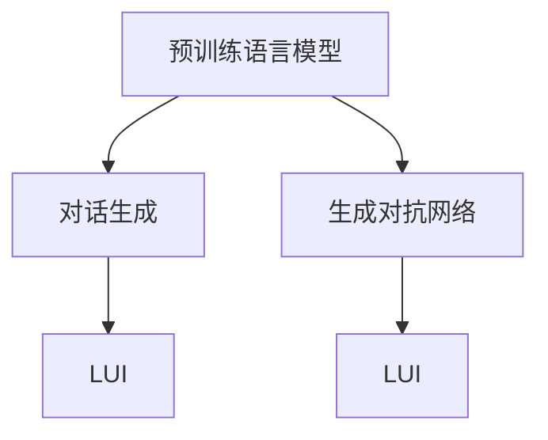

                 

# 自然语言交互（LUI）的潜力

> 关键词：自然语言交互，人机对话，智能客服，语音助手，对话生成，生成对抗网络（GAN）

## 1. 背景介绍

随着人工智能技术的不断进步，自然语言交互（LUI，Language Understanding and Interaction）技术的应用领域正在迅速拓展。从智能客服到语音助手，从虚拟现实（VR）到增强现实（AR），越来越多的场景正在引入自然语言交互技术，以提升用户体验、降低人力成本并增强用户粘性。然而，现有的自然语言交互系统往往难以理解上下文语境、准确捕捉用户意图、提供连贯和一致的回应。本文将从LUI的核心技术及其应用场景出发，探讨LUI的潜力，并展望未来发展趋势。

## 2. 核心概念与联系

### 2.1 核心概念概述

为了更好地理解LUI技术，本文将介绍几个关键概念：

- **自然语言交互（LUI）**：是指通过自然语言来理解和执行指令的交互方式，涵盖语音和文本交互，旨在实现人机自然对话。
- **对话生成**：指自然语言交互系统理解用户意图后，生成响应文本或语音的技术。
- **生成对抗网络（GAN）**：一种通过两个对抗性神经网络模型（生成器和判别器）生成逼真、自然语言的技术。
- **预训练语言模型（PLMs）**：如BERT、GPT等，通过在大规模无标签文本数据上预训练，可以理解自然语言的内在结构和语义。

这些概念通过以下Mermaid流程图进行了联系：



这个图表展示了LUI与预训练语言模型、对话生成和生成对抗网络之间的联系。预训练语言模型提供丰富的语言知识和表征，对话生成技术将用户意图转化为自然语言响应，而生成对抗网络可以进一步提高响应的自然度和逼真度。

### 2.2 核心概念原理和架构

**预训练语言模型**：预训练语言模型通过在大规模无标签文本数据上进行自监督学习，学习语言的通用结构和语义表示。如BERT通过遮掩语言模型（Masked Language Model, MLM）和下一句预测（Next Sentence Prediction, NSP）任务，学习到单词间的语义关系和句子的连贯性。

**对话生成**：对话生成是LUI的核心技术之一，包括从用户输入中提取意图和上下文信息，生成自然、连贯的响应。传统的基于规则或模板的方法难以处理复杂的语境，因此深度学习驱动的端到端生成方法（如Seq2Seq模型、Transformer等）成为主流。

**生成对抗网络（GAN）**：GAN由生成器和判别器组成，生成器通过学习真实语料的数据分布，生成逼真的语言响应；判别器则区分生成的语言与真实语言，两者通过对抗性训练不断提升生成器的性能。GAN可以增强对话响应的自然度和丰富性，尤其适用于对话生成中复杂表达和多样性的提升。

## 3. 核心算法原理 & 具体操作步骤

### 3.1 算法原理概述

LUI系统的核心算法主要分为以下几步：

1. **预训练语言模型**：在大规模无标签文本数据上进行预训练，学习语言的表征。
2. **对话生成**：利用预训练模型和生成对抗网络，生成响应文本。
3. **LUI框架**：将对话生成技术集成到LUI系统中，实现自然语言交互。

### 3.2 算法步骤详解

#### 3.2.1 预训练语言模型

预训练语言模型的构建步骤如下：

1. **数据准备**：收集大规模无标签文本数据，包括维基百科、新闻、社交媒体等。
2. **模型选择**：选择合适的预训练模型架构，如BERT、GPT等。
3. **预训练过程**：在预训练数据上执行MLM和NSP任务，通过反向传播更新模型参数。
4. **模型保存**：保存预训练后的模型参数，供后续微调和应用使用。

#### 3.2.2 对话生成

对话生成的关键步骤如下：

1. **用户意图提取**：通过预训练语言模型分析用户输入，提取意图和上下文信息。
2. **响应生成**：使用Transformer模型或Seq2Seq模型生成自然语言响应。
3. **评价和优化**：通过BLEU、ROUGE等指标评价生成响应的质量，使用GAN进一步优化生成效果。

#### 3.2.3 LUI框架

LUI框架的构建步骤如下：

1. **集成预训练模型**：将预训练语言模型集成到LUI系统中，用于意图理解和上下文处理。
2. **生成器设计**：设计对话生成器，确保生成的响应自然、连贯、合理。
3. **框架集成**：将对话生成器集成到LUI系统中，提供用户交互界面。

### 3.3 算法优缺点

**优点**：

- **泛化能力强**：预训练语言模型通过大量数据学习语言的一般性表示，适应性广。
- **生成自然**：生成对抗网络（GAN）可以提高生成响应的自然度和丰富性。
- **易于部署**：深度学习驱动的对话生成技术可以通过现成的框架实现快速部署。

**缺点**：

- **高成本**：大规模预训练和生成对抗网络训练需要大量的计算资源和时间。
- **依赖语料**：模型的表现高度依赖于训练语料的质量和多样性。
- **易受攻击**：生成的响应容易受到输入噪声和攻击的影响，导致模型决策失误。

### 3.4 算法应用领域

LUI技术可以应用于多个领域，包括但不限于：

- **智能客服**：通过对话生成技术，提供24小时不间断的客户服务，解决复杂咨询。
- **语音助手**：如Siri、Alexa等，通过语音交互，实现自然语言命令控制设备。
- **虚拟现实和增强现实**：在VR/AR场景中，提供自然语言对话，增强用户体验。
- **智能家居**：通过自然语言交互，控制家中的智能设备，提升生活便利性。
- **游戏互动**：在游戏中，通过对话生成技术，实现NPC与玩家间的自然对话。

## 4. 数学模型和公式 & 详细讲解

### 4.1 数学模型构建

LUI系统中，对话生成是核心任务之一，其数学模型主要涉及以下组件：

- **编码器**：将用户输入转换为上下文表示。
- **解码器**：根据上下文表示生成响应文本。
- **注意力机制**：帮助解码器聚焦于上下文中的关键信息。

### 4.2 公式推导过程

以下是对Seq2Seq模型（编码器-解码器架构）中注意力机制的推导：

设用户输入为 $x_1,x_2,\dots,x_n$，目标文本为 $y_1,y_2,\dots,y_m$。则编码器输出为 $h_1,h_2,\dots,h_n$，解码器输出为 $\tilde{y}_1,\tilde{y}_2,\dots,\tilde{y}_m$。

注意力机制 $a_{ij}$ 表示在生成第 $j$ 个目标词 $y_j$ 时，对于输入序列中第 $i$ 个词的关注程度。其计算方式如下：

$$
a_{ij} = \frac{e^{at_{ij}}}{\sum_{k=1}^n e^{at_{ik}}}
$$

其中，$at_{ij}$ 为注意力得分，通常使用点积形式计算：

$$
at_{ij} = h_i^T W_a y_j
$$

$W_a$ 为注意力权重矩阵，$h_i$ 为编码器第 $i$ 个位置的隐藏表示。

### 4.3 案例分析与讲解

以Siri的对话生成为例，分析其生成自然响应的方法：

- **意图理解**：通过预训练语言模型分析用户语音输入，提取意图。
- **上下文处理**：利用注意力机制，从历史对话中提取关键信息，更新模型状态。
- **响应生成**：使用Transformer模型生成自然语言响应，并利用GAN技术优化生成效果。

## 5. 项目实践：代码实例和详细解释说明

### 5.1 开发环境搭建

搭建开发环境需安装Python、PyTorch、TensorFlow等工具，并使用预训练模型和相关库。

```bash
conda create -n pytorch_env python=3.7
conda activate pytorch_env
pip install torch torchtext tensorboard
pip install transformers
```

### 5.2 源代码详细实现

以下是一个简单的对话生成模型实现，使用Seq2Seq架构和注意力机制：

```python
import torch
from torch import nn
from torchtext.data import Field, BucketIterator
from transformers import Seq2SeqModel

# 定义编码器和解码器
class Encoder(nn.Module):
    def __init__(self, input_dim, enc_dim, hid_dim):
        super().__init__()
        self.enc_dim = enc_dim
        self.hid_dim = hid_dim
        self.emb = nn.Embedding(input_dim, hid_dim)
        self.enc_lstm = nn.LSTM(hid_dim, enc_dim, batch_first=True)
        self.attention = nn.Linear(enc_dim, hid_dim)
        self.fc = nn.Linear(enc_dim, hid_dim)
        self.fc_h = nn.Linear(enc_dim, hid_dim)
        self.fc_c = nn.Linear(enc_dim, hid_dim)

    def forward(self, x):
        emb = self.emb(x)
        lstm_out, (h_n, c_n) = self.enc_lstm(emb)
        attn = self.attention(lstm_out)
        return lstm_out, attn

class Decoder(nn.Module):
    def __init__(self, output_dim, enc_dim, hid_dim):
        super().__init__()
        self.output_dim = output_dim
        self.enc_dim = enc_dim
        self.hid_dim = hid_dim
        self.emb = nn.Embedding(output_dim, hid_dim)
        self.dec_lstm = nn.LSTM(hid_dim, enc_dim, batch_first=True)
        self.attention = nn.Linear(enc_dim, hid_dim)
        self.fc = nn.Linear(enc_dim, output_dim)
        self.fc_h = nn.Linear(enc_dim, output_dim)
        self.fc_c = nn.Linear(enc_dim, output_dim)

    def forward(self, x, enc_output, attn):
        emb = self.emb(x)
        lstm_out, (h_n, c_n) = self.dec_lstm(emb)
        attn = self.attention(lstm_out)
        return lstm_out, attn

# 定义LUI模型
class LUI(nn.Module):
    def __init__(self, encoder, decoder):
        super().__init__()
        self.encoder = encoder
        self.decoder = decoder

    def forward(self, x, y):
        enc_output, attn = self.encoder(x)
        dec_output, attn = self.decoder(y, enc_output, attn)
        return dec_output

# 训练模型
model = LUI(Encoder(input_dim=10000, enc_dim=256, hid_dim=512), Decoder(output_dim=10000, enc_dim=256, hid_dim=512))
criterion = nn.CrossEntropyLoss()
optimizer = torch.optim.Adam(model.parameters(), lr=0.001)

# 数据预处理
text_field = Field(tokenize='spacy', lower=True, batch_first=True)
train_data, test_data = some_data

train_iterator, test_iterator = BucketIterator.splits((train_data, test_data), batch_size=32, device='cuda')
```

### 5.3 代码解读与分析

代码中主要定义了编码器、解码器和LUI模型，并使用CrossEntropyLoss作为损失函数，Adam优化器进行训练。数据预处理部分，使用PyTorch的torchtext库进行文本处理。

### 5.4 运行结果展示

训练完成后，可以使用TensorBoard可视化模型训练过程和效果。

## 6. 实际应用场景

### 6.1 智能客服

智能客服系统是LUI技术的典型应用之一。通过对话生成技术，智能客服能够理解和处理用户提出的各种问题，提供及时准确的解答，极大提升了客户服务效率和满意度。

### 6.2 语音助手

语音助手通过自然语言交互技术，能够响应用户的语音指令，实现智能控制家中的各种设备，如灯光、温度等，提供便捷的生活体验。

### 6.3 虚拟现实和增强现实

在虚拟现实和增强现实应用中，自然语言交互技术能够提供自然语言导航、实时互动等功能，提升用户体验和互动性。

## 7. 工具和资源推荐

### 7.1 学习资源推荐

- 《深度学习与自然语言处理》（周志华、林轩田）
- 《自然语言处理综论》（Daniel Jurafsky、James H. Martin）
- 《序列到序列学习与自然语言处理》（Ilya Sutskever、Oriol Vinyals、Quoc V. Le）
- 《Attention is All You Need》论文（Vaswani et al.）

### 7.2 开发工具推荐

- PyTorch
- TensorFlow
- TensorBoard
- Transformers库

### 7.3 相关论文推荐

- "Attention is All You Need"（Vaswani et al.）
- "Sequence to Sequence Learning with Neural Networks"（Sutskever et al.）
- "Learning Phrase Representations using RNN Encoder-Decoder for Statistical Machine Translation"（Sutskever et al.）

## 8. 总结：未来发展趋势与挑战

### 8.1 研究成果总结

LUI技术在近年来的研究和发展中，取得了显著进展。预训练语言模型、生成对抗网络和对话生成技术的发展，使得LUI系统能够提供更加自然、连贯的响应。然而，LUI系统仍面临着高成本、依赖语料和易受攻击等挑战。

### 8.2 未来发展趋势

- **多模态交互**：LUI系统将结合视觉、语音、文本等多种模态，提供更加丰富、自然的人机交互体验。
- **智能决策**：结合因果推理、强化学习等技术，提高LUI系统的决策能力和鲁棒性。
- **个性化推荐**：通过用户行为数据，提供个性化的对话生成策略，提升用户体验。

### 8.3 面临的挑战

- **数据隐私和安全**：自然语言交互过程中涉及大量用户隐私信息，如何保障数据安全和隐私保护，是一大挑战。
- **计算资源**：LUI系统需要处理大规模文本数据和复杂模型，计算资源需求巨大，如何优化模型和提高计算效率，是一大挑战。
- **模型的可解释性**：自然语言交互模型往往是“黑盒”模型，缺乏可解释性，如何在提升性能的同时，提高模型的可解释性，是一大挑战。

### 8.4 研究展望

未来的研究应在以下几个方面取得突破：

- **结合因果推理**：结合因果推理模型，增强LUI系统的决策能力和鲁棒性。
- **结合生成对抗网络**：利用生成对抗网络，提高对话生成响应的自然度和多样性。
- **结合知识图谱**：结合知识图谱，增强LUI系统的知识整合能力和决策准确性。

## 9. 附录：常见问题与解答

### Q1: LUI系统如何处理复杂语境？

A: LUI系统通过预训练语言模型和注意力机制，能够处理复杂的语境。在解码过程中，通过上下文表示和注意力机制，系统能够聚焦于关键信息，生成连贯、自然的响应。

### Q2: 如何优化LUI系统的性能？

A: 优化LUI系统性能可以从以下几个方面入手：
1. 数据质量：使用高质量的数据进行训练，提高模型的泛化能力。
2. 模型架构：尝试不同的模型架构和注意力机制，寻找最优解。
3. 优化技术：使用梯度剪枝、混合精度训练等技术，优化模型性能。

### Q3: LUI系统如何保护用户隐私？

A: LUI系统在处理用户数据时，应采用差分隐私、数据脱敏等技术，保护用户隐私。同时，系统设计应符合数据保护法规，如GDPR等。

### Q4: LUI系统如何保障系统的鲁棒性？

A: LUI系统可以通过对抗训练、生成对抗网络等技术，提升系统的鲁棒性和抗干扰能力。同时，结合因果推理和强化学习技术，增强系统的决策能力和稳定性。

---

作者：禅与计算机程序设计艺术 / Zen and the Art of Computer Programming

