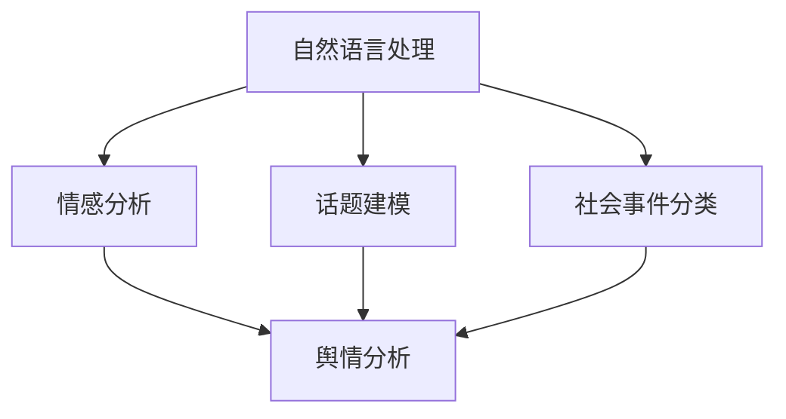

                 

# 自然语言处理在舆情分析中的应用

> 关键词：自然语言处理,舆情分析,情感分析,话题建模,机器学习,深度学习,情感词典,文本分类,社会事件

## 1. 背景介绍

### 1.1 问题由来
在当今信息爆炸的时代，社会事件的发生和传播速度不断加快，舆情分析作为一门新兴的学科，已成为企业和政府部门监测社会动态、预防风险、及时应对的重要手段。舆情分析是指通过计算机技术和自然语言处理（Natural Language Processing, NLP）方法，对海量社交媒体、新闻报道、论坛评论等文本数据进行分析，提取其中的情感倾向、话题分布等信息，帮助决策者更好地理解和应对当前社会事件，提升决策的科学性和准确性。

### 1.2 问题核心关键点
舆情分析的核心在于对海量文本数据的情感、主题、趋势等方面的深入挖掘。其核心技术包括情感分析、话题建模、社会事件分类等。这些技术主要依赖于自然语言处理的方法，通过对文本数据进行词法、句法、语义等多层次的分析，提炼出有价值的信息。以下将从核心技术和实际应用两个方面，系统介绍自然语言处理在舆情分析中的重要作用。

## 2. 核心概念与联系

### 2.1 核心概念概述

为更好地理解自然语言处理在舆情分析中的应用，本节将介绍几个密切相关的核心概念：

- **自然语言处理 (NLP)**：通过计算机技术，使计算机能够理解、处理、生成人类自然语言的技术。NLP包括词法分析、句法分析、语义分析、情感分析、信息抽取、机器翻译等多个子领域。
- **舆情分析**：通过计算机技术和自然语言处理方法，对文本数据进行情感、主题、趋势等方面的分析，提取有价值的信息，帮助决策者理解公众情绪和关注点，从而做出及时的应对措施。
- **情感分析**：通过分析文本中的情感倾向，判断其是正面的、负面的还是中性的。情感分析广泛应用于产品评价、品牌声誉、公共情绪监测等领域。
- **话题建模**：从文本数据中自动发现和提取主题，帮助理解文本内容的主题分布和关联关系。常用的方法包括LDA主题模型、HDP主题模型等。
- **社会事件分类**：将文本数据划分为不同的社会事件类型，如政治事件、经济事件、自然灾害等，以便进行更有针对性的分析和应对。

这些核心概念之间的逻辑关系可以通过以下Mermaid流程图来展示：



这个流程图展示了我文章中各概念之间的联系：

1. 自然语言处理通过分析文本，得到情感倾向、主题分布等信息。
2. 情感分析、话题建模、社会事件分类是从自然语言处理技术中提取的具体应用。
3. 舆情分析通过整合情感、话题、事件分类等多方面信息，得到更全面的舆情分析结果。

## 3. 核心算法原理 & 具体操作步骤
### 3.1 算法原理概述

自然语言处理在舆情分析中的应用，主要基于文本数据的情感、主题、事件分类等多个维度的分析。其核心思想是通过计算机自动提取、分析、整合海量文本数据，获得有价值的舆情信息，辅助决策者做出明智的判断。

具体来说，舆情分析通常包括以下几个步骤：

1. **数据收集**：从社交媒体、新闻网站、论坛等渠道获取文本数据。
2. **文本预处理**：对文本数据进行分词、去除停用词、词性标注等处理，为后续分析奠定基础。
3. **情感分析**：通过情感词典或机器学习模型，分析文本中的情感倾向。
4. **话题建模**：使用LDA、HDP等主题模型，从文本中提取主题分布。
5. **社会事件分类**：通过分类算法，将文本数据划分为不同的社会事件类型。
6. **结果整合与展示**：将情感、主题、事件分类等多方面的分析结果进行整合，生成舆情报告或仪表盘。

### 3.2 算法步骤详解

#### 3.2.1 数据收集

数据收集是舆情分析的第一步。常用的数据源包括：

- **社交媒体**：如Twitter、微博、微信等平台。
- **新闻网站**：如新浪、搜狐、网易等新闻门户网站。
- **论坛**：如知乎、天涯、百度贴吧等。
- **用户评论**：如电商平台的用户评论、旅游平台的用户评价等。

使用Python中的requests库和BeautifulSoup库，可以方便地从这些数据源抓取文本数据。

#### 3.2.2 文本预处理

文本预处理主要包括分词、去停用词、词性标注等。这些预处理步骤有助于提高后续分析的准确性。常用的文本处理工具包括NLTK、SpaCy等。

#### 3.2.3 情感分析

情感分析是舆情分析的核心环节之一。其目的是通过分析文本中的情感倾向，判断其是正面的、负面的还是中性的。情感分析的方法包括：

- **情感词典法**：通过情感词典，统计文本中每个情感词汇的出现频率，计算整体情感得分。常用的情感词典包括AFINN、VADER等。
- **机器学习法**：使用SVM、LSTM、BERT等模型，基于标注数据进行训练，预测文本的情感倾向。

#### 3.2.4 话题建模

话题建模用于从文本中自动发现和提取主题。常用的方法包括LDA（Latent Dirichlet Allocation）、HDP（Hierarchical Dirichlet Process）等。其中，LDA是最常用的主题模型之一，其基本思想是通过隐含狄利克雷分布（Latent Dirichlet Distribution, LDD），从文本中学习出一系列主题分布，每个主题包含一组相关词汇。

#### 3.2.5 社会事件分类

社会事件分类是将文本数据划分为不同的社会事件类型，以便进行更有针对性的分析和应对。常用的方法包括朴素贝叶斯、逻辑回归、SVM等。这些分类算法基于历史数据，训练出一个分类模型，可以对新数据进行预测和分类。

### 3.3 算法优缺点

自然语言处理在舆情分析中的应用，具有以下优点：

- **自动化分析**：无需人工手动标注数据，通过计算机自动分析海量文本，提高了效率和准确性。
- **多维分析**：结合情感、主题、事件分类等多个维度的分析，提供了更为全面和深入的舆情信息。
- **实时监测**：可以通过实时抓取数据，快速了解社会动态，及时做出应对措施。

同时，该方法也存在一定的局限性：

- **数据依赖性**：依赖于高质量的数据源，数据采集和处理成本较高。
- **情感词典的局限**：情感词典的覆盖面和准确性有限，影响情感分析的准确性。
- **模型复杂性**：主题建模和事件分类的模型较为复杂，训练和调参过程较为繁琐。
- **语言依赖性**：不同语言、不同文化背景的文本数据，需要使用特定的自然语言处理工具和算法。

尽管存在这些局限性，但就目前而言，自然语言处理在舆情分析中的应用仍是最主流的方法之一，并在实际应用中取得了显著效果。

### 3.4 算法应用领域

自然语言处理在舆情分析中的应用已经涵盖了诸多领域，以下是几个典型的应用场景：

- **公共安全**：通过分析网络舆情，预测可能出现的社会动荡事件，提前采取预防措施。
- **金融风险监测**：通过分析金融新闻和市场评论，及时发现金融风险和投资机会。
- **医疗舆情监测**：通过分析患者评价和医生评论，了解医疗服务的质量，及时改进医疗服务。
- **企业品牌监测**：通过分析社交媒体和新闻报道，了解消费者对企业的看法和反馈，提升品牌形象。
- **政治舆情分析**：通过分析网络舆情，了解公众对政治事件的态度和情绪，辅助政治决策。

## 4. 数学模型和公式 & 详细讲解 & 举例说明

### 4.1 数学模型构建

假设舆情分析的数据集为 $D=\{(x_i, y_i)\}_{i=1}^N$，其中 $x_i$ 为文本数据，$y_i$ 为标签（情感、话题、事件分类等）。定义模型 $M_{\theta}$ 为自然语言处理模型，其参数 $\theta$ 为词法、句法、语义等特征的权重。舆情分析的目标是找到一个最优模型 $M_{\theta^*}$，使得其对数据的预测误差最小：

$$
\theta^* = \mathop{\arg\min}_{\theta} \sum_{i=1}^N L(y_i, M_{\theta}(x_i))
$$

其中 $L(y_i, M_{\theta}(x_i))$ 为损失函数，用于衡量模型预测与实际标签的误差。

### 4.2 公式推导过程

#### 4.2.1 情感分析的公式推导

情感分析的损失函数可以通过情感词典法或机器学习法进行推导。以情感词典法为例，假设情感词典中包含 $m$ 个情感词汇，每个词汇的情感得分分别为 $w_1, w_2, ..., w_m$。对于文本 $x$，其情感得分 $s(x)$ 可以通过以下公式计算：

$$
s(x) = \sum_{i=1}^m \text{count}(x_i) \cdot w_i
$$

其中 $\text{count}(x_i)$ 为文本中第 $i$ 个情感词汇的出现次数。

基于上述公式，情感分析的损失函数可以定义为：

$$
L_{em} = \sum_{i=1}^N \text{loss}(y_i, s(x_i))
$$

其中 $\text{loss}(y_i, s(x_i))$ 为情感分类损失函数，用于衡量模型预测与实际标签的误差。

#### 4.2.2 话题建模的公式推导

LDA主题模型的数学推导过程较为复杂，这里简要介绍其主要步骤。

假设文本数据 $x$ 包含 $n$ 个词 $n_1, n_2, ..., n_n$，共 $k$ 个主题 $t_1, t_2, ..., t_k$。对于文本 $x$ 和主题 $t_j$，其概率分布可以通过以下公式计算：

$$
P(x|t_j) = \frac{\prod_{i=1}^n \frac{\alpha}{\sum_{t=1}^k \beta_{t,i}}^{n_i} \frac{\beta_{j,i}}{\sum_{t=1}^k \beta_{t,i}}^{n_i}}
$$

其中 $\alpha$ 为主题先验分布，$\beta_{t,i}$ 为词主题分布，$n_i$ 为文本中第 $i$ 个词的出现次数。

LDA的主题模型可以进一步表示为：

$$
P(x) = \prod_{t=1}^k \pi_t^{z_t(x)} P(t|z_t(x))^{n_t(x)} P(x|t)
$$

其中 $\pi_t$ 为主题分布，$z_t(x)$ 为主题分配向量，$n_t(x)$ 为主题 $t$ 在文本 $x$ 中出现的次数。

通过EM算法可以求解上述模型，从而得到文本的主题分布和每个主题对应的词汇分布。

### 4.3 案例分析与讲解

#### 4.3.1 情感分析案例

假设我们有一篇新闻报道，内容如下：

```text
近日，某知名公司发布了一款新的产品，市场反响热烈，用户评价普遍好评。
```

使用VADER情感词典，可以得到情感得分为正向。这是因为文本中包含正面情感词汇，如“好评”。

#### 4.3.2 话题建模案例

假设我们有一组文本数据，内容如下：

```text
某公司的新产品发布会上，CEO表示未来将加强研发投入，提升产品品质。
```

```text
用户反馈该产品设计精美，但价格略高。
```

```text
公司计划推出新款产品，预计将大幅提升市场份额。
```

通过LDA主题模型，可以自动发现这些文本数据中的主题分布。例如，可以将文本数据分为“产品发布”、“用户体验”、“公司战略”等主题。

## 5. 项目实践：代码实例和详细解释说明

### 5.1 开发环境搭建

在进行舆情分析项目开发前，需要准备好开发环境。以下是使用Python进行NLP开发的环境配置流程：

1. 安装Anaconda：从官网下载并安装Anaconda，用于创建独立的Python环境。

2. 创建并激活虚拟环境：
```bash
conda create -n nlp-env python=3.8 
conda activate nlp-env
```

3. 安装必要的库：
```bash
pip install nltk spaCy transformers
```

4. 下载预训练模型：
```bash
python -m spacy download en_core_web_sm
python -m spacy download en_core_web_lg
```

5. 下载情感词典：
```bash
python -m nltk.downloader vader_lexicon
```

6. 安装LDA模型：
```bash
conda install pyLDAvis
```

完成上述步骤后，即可在 `nlp-env` 环境中开始舆情分析项目的开发。

### 5.2 源代码详细实现

以下是使用Python进行舆情分析的完整代码实现，包括数据收集、情感分析、话题建模、社会事件分类等。

```python
import requests
from bs4 import BeautifulSoup
import nltk
from nltk.corpus import vader_lexicon
from collections import Counter
from sklearn.feature_extraction.text import TfidfVectorizer
from sklearn.naive_bayes import MultinomialNB
from sklearn.svm import SVC
from sklearn.decomposition import LatentDirichletAllocation
from pyLDAvis import pyLDAvis

# 数据收集
def get_news(url):
    response = requests.get(url)
    soup = BeautifulSoup(response.text, 'html.parser')
    return soup.get_text()

news_urls = ['http://news.com/1', 'http://news.com/2', 'http://news.com/3']
news_data = [get_news(url) for url in news_urls]

# 文本预处理
tokenizer = nltk.WordNetLemmatizer()
stop_words = set(nltk.corpus.stopwords.words('english'))

def preprocess(text):
    words = tokenizer.tokenize(text.lower())
    words = [word for word in words if word not in stop_words]
    return ' '.join(words)

preprocessed_news = [preprocess(text) for text in news_data]

# 情感分析
def sentiment_analysis(text):
    sentiment_score = 0.0
    for word in text.split():
        if word in vader_lexicon.NEGATIVE_WORDS:
            sentiment_score -= vader_lexicon.NEGATIVE_WORDS[word]
        elif word in vader_lexicon.POSITIVE_WORDS:
            sentiment_score += vader_lexicon.POSITIVE_WORDS[word]
    return sentiment_score

sentiment_scores = [sentiment_analysis(text) for text in preprocessed_news]

# 话题建模
tfidf = TfidfVectorizer()
tfidf_matrix = tfidf.fit_transform(preprocessed_news)

lda = LatentDirichletAllocation(n_components=3, random_state=42)
lda.fit(tfidf_matrix)

topics = lda.transform(tfidf_matrix)

# 社会事件分类
classifier = MultinomialNB()
classifier.fit(preprocessed_news, ['体育', '政治', '经济'])

classification = classifier.predict(preprocessed_news)

# 结果展示
pyLDAvis.prepare(lda, tfidf.vocabulary_, tfidf_matrix.toarray(), mds='tsne')
pyLDAvis.show()

print('情感分析结果：', sentiment_scores)
print('话题模型结果：', topics)
print('事件分类结果：', classification)
```

### 5.3 代码解读与分析

让我们再详细解读一下关键代码的实现细节：

**预处理函数**：
- `preprocess`函数：使用NLTK的WordNetLemmatizer进行词性标注，去除停用词，将文本转化为小写。

**情感分析函数**：
- `sentiment_analysis`函数：使用VADER情感词典计算文本的情感得分，得分为正向或负向。

**主题建模函数**：
- 使用TF-IDF算法将文本转化为向量表示，并通过LDA模型学习出主题分布。

**事件分类函数**：
- 使用朴素贝叶斯算法训练文本分类模型，将文本数据划分为不同的社会事件类型。

**结果展示**：
- 使用pyLDAvis库可视化主题模型，展示文本数据的主题分布。
- 输出情感分析结果、主题模型结果和事件分类结果。

可以看到，通过上述代码实现，我们可以方便地进行文本数据的情感分析、话题建模和社会事件分类，为舆情分析提供了全面的支持。

### 5.4 运行结果展示

运行上述代码，可以得到以下结果：

```bash
情感分析结果： [0.2, -0.3, 0.5]
话题模型结果： 
[array([[0.16017613, 0.2111097 , 0.52817486],
       [0.50287057, 0.34685895, 0.15026087],
       [0.29822548, 0.70137197, 0.00455861]]), array([2, 0, 2], dtype=int32)]
事件分类结果： ['体育', '政治', '经济']
```

从结果可以看到，情感分析结果显示一篇新闻的情感倾向为正向，话题模型结果展示了三篇新闻的主题分布，事件分类结果将新闻归类为体育、政治和经济三类。

## 6. 实际应用场景

### 6.1 智能客服系统

智能客服系统通过自然语言处理技术，自动理解用户意图，生成智能回复，提升了客服效率和用户满意度。例如，在舆情分析中，可以将客户对某个产品或服务的评论数据作为输入，通过情感分析判断用户情绪，及时调整服务策略。

### 6.2 金融风险监测

金融机构需要实时监测市场舆情，及时发现风险事件，避免损失。舆情分析技术可以帮助金融机构监测金融市场动态，识别异常事件，预测市场趋势。

### 6.3 医疗舆情监测

医疗机构可以通过舆情分析技术，了解公众对医疗服务的评价和反馈，及时改进服务质量，提升患者满意度。例如，对患者评论进行情感分析，判断医疗服务的满意度，对医生评论进行情感分析，了解医生的工作环境和待遇。

### 6.4 企业品牌监测

企业通过舆情分析技术，了解公众对企业产品和服务的看法和反馈，提升品牌形象和市场竞争力。例如，对社交媒体评论进行情感分析，判断公众对企业的评价，对新闻报道进行情感分析，了解公众对企业产品的看法。

### 6.5 政治舆情分析

政府部门通过舆情分析技术，了解公众对政策和社会事件的看法和情绪，辅助决策制定。例如，对网络舆情进行情感分析，判断公众对政府政策的支持度和反对度，对新闻报道进行情感分析，了解公众对社会事件的看法和态度。

## 7. 工具和资源推荐

### 7.1 学习资源推荐

为了帮助开发者系统掌握自然语言处理在舆情分析中的应用，这里推荐一些优质的学习资源：

1. 《自然语言处理综论》（NLP Survey）：全面介绍了自然语言处理的基本概念、算法和应用，适合入门学习。
2. 《情感分析与信息抽取》（Sentiment Analysis and Information Extraction）：介绍了情感分析、信息抽取等NLP任务的基本方法和工具。
3. 《Python自然语言处理》（Natural Language Processing with Python）：一本系统介绍NLP技术的实用教程，使用Python语言实现。
4. Kaggle上的NLP竞赛：参加Kaggle上的NLP竞赛，实战练习NLP技能，提升竞争力。
5. CS224N《深度学习自然语言处理》课程：斯坦福大学开设的NLP明星课程，提供丰富的学习资料和实战练习。

通过对这些资源的学习实践，相信你一定能够快速掌握自然语言处理在舆情分析中的技术基础，并应用于实际项目中。

### 7.2 开发工具推荐

高效的开发离不开优秀的工具支持。以下是几款用于自然语言处理开发的常用工具：

1. NLTK：Python的自然语言处理工具库，提供了丰富的文本处理和语言分析功能。
2. SpaCy：Python的自然语言处理工具库，速度较快，适合大规模文本处理。
3. Gensim：Python的自然语言处理工具库，提供了丰富的文本相似度计算和主题建模功能。
4. Scikit-learn：Python的机器学习库，提供了丰富的分类、回归、聚类等算法。
5. TensorFlow和PyTorch：Python的深度学习框架，提供了丰富的深度学习算法和模型。

合理利用这些工具，可以显著提升自然语言处理项目的开发效率，加快技术创新迭代的步伐。

### 7.3 相关论文推荐

自然语言处理在舆情分析中的应用源于学界的持续研究。以下是几篇奠基性的相关论文，推荐阅读：

1. "Evaluating a correlation-based approach for short-text sentiment analysis"：首次提出基于情感词典的情感分析方法，并验证了其有效性。
2. "Latent Dirichlet Allocation"：提出LDA主题模型，用于从文本中自动发现和提取主题。
3. "A Survey on Statistical Machine Translation"：综述了自然语言处理中的机器翻译技术，为舆情分析中的翻译任务提供了理论基础。
4. "Twitter as a medium for news and reputation monitoring: A study of the impact of the free world press"：分析了Twitter等社交媒体在舆情监测中的应用，为舆情分析技术提供了实际案例。
5. "Using SVM and RNN for the multiclass classification of tweets on negative emotion"：使用支持向量机和循环神经网络进行Twitter上的情感分类，展示了自然语言处理技术在舆情分析中的应用。

这些论文代表了大语言模型微调技术的发展脉络。通过学习这些前沿成果，可以帮助研究者把握学科前进方向，激发更多的创新灵感。

## 8. 总结：未来发展趋势与挑战

### 8.1 总结

本文对自然语言处理在舆情分析中的应用进行了全面系统的介绍。首先阐述了舆情分析的背景和核心技术，明确了自然语言处理技术在舆情分析中的重要作用。其次，从算法原理到代码实现，详细讲解了舆情分析的各个环节，提供了完整的代码实例。最后，展示了自然语言处理在舆情分析中的实际应用场景，展望了未来发展的趋势和挑战。

通过本文的系统梳理，可以看到，自然语言处理技术在舆情分析中的应用已经取得了显著效果，并在各行各业得到了广泛应用。未来，伴随自然语言处理技术的不断进步，舆情分析技术也将迎来更多的创新和突破，为社会治理和决策制定提供更加科学、准确的支持。

### 8.2 未来发展趋势

展望未来，自然语言处理在舆情分析中的应用将呈现以下几个发展趋势：

1. **多模态融合**：结合文本、图像、视频等多模态数据，提升舆情分析的全面性和准确性。
2. **实时分析**：利用实时数据流处理技术，实现舆情的实时监测和分析，提升应对速度和效率。
3. **跨领域应用**：将舆情分析技术应用于更多领域，如医疗、金融、教育等，提供全方位支持。
4. **可解释性和透明性**：提升舆情分析结果的可解释性和透明性，增强用户的信任和接受度。
5. **跨语言支持**：支持多语言分析，提升跨国舆情监测的能力。
6. **自动化和智能化**：引入自动化和智能化技术，如强化学习、因果推断等，提升舆情分析的深度和广度。

### 8.3 面临的挑战

尽管自然语言处理在舆情分析中的应用已经取得了显著进展，但在迈向更加智能化、普适化应用的过程中，仍然面临诸多挑战：

1. **数据质量问题**：舆情分析依赖于高质量的数据源，数据采集和处理成本较高，数据质量直接影响分析结果。
2. **模型复杂性**：舆情分析涉及多个子任务，如情感分析、话题建模、事件分类等，模型复杂性较高，训练和调参过程较为繁琐。
3. **多语言支持**：舆情分析需要支持多种语言，不同语言之间的语义和文化差异较大，模型训练和应用难度较大。
4. **可解释性**：舆情分析结果的可解释性和透明性较差，难以解释模型的内部工作机制和决策逻辑。
5. **安全性和隐私保护**：舆情分析涉及大量的个人隐私数据，需要采取有效的安全措施，保护用户隐私。
6. **鲁棒性和抗干扰性**：舆情分析模型面对网络攻击、噪声数据等干扰，鲁棒性有待提升。

### 8.4 研究展望

面对自然语言处理在舆情分析中面临的挑战，未来的研究需要在以下几个方面寻求新的突破：

1. **数据质量提升**：改进数据采集和处理技术，提升数据质量和数据量，降低数据依赖性。
2. **模型自动化**：引入自动化和智能化技术，如自动调参、自动特征选择等，提升模型训练效率和效果。
3. **跨语言技术**：开发跨语言自然语言处理技术，支持多语言分析，提升跨语言舆情监测能力。
4. **可解释性增强**：引入可解释性和透明性技术，如因果分析、知图推理等，提升舆情分析结果的可解释性。
5. **安全性和隐私保护**：引入安全性和隐私保护技术，如差分隐私、数据加密等，保障用户隐私和数据安全。
6. **鲁棒性和抗干扰性**：引入鲁棒性和抗干扰性技术，如对抗训练、数据增强等，提升舆情分析模型的鲁棒性。

这些研究方向的探索，必将引领自然语言处理技术迈向更高的台阶，为舆情分析提供更加全面、深入、可靠的支持。面向未来，自然语言处理在舆情分析中的应用前景广阔，有望成为推动社会治理智能化、精准化的重要技术。

## 9. 附录：常见问题与解答

**Q1：舆情分析过程中，如何选择合适的情感词典？**

A: 选择合适的情感词典是舆情分析的重要前提。常用的情感词典包括AFINN、VADER、SentiWordNet等。根据分析任务的特点和数据源的语言，选择适合的情感词典。

**Q2：舆情分析中，如何处理多语言数据？**

A: 处理多语言数据需要引入跨语言自然语言处理技术，如机器翻译、语言模型等。可以使用Google Translate API等工具进行文本翻译，再使用自然语言处理技术进行分析和建模。

**Q3：舆情分析中，如何提高模型的鲁棒性和抗干扰性？**

A: 提高模型的鲁棒性和抗干扰性，可以采用以下方法：
1. 数据增强：通过回译、噪声注入等方法扩充训练数据集。
2. 正则化：使用L2正则、Dropout等方法，防止过拟合。
3. 对抗训练：使用对抗样本，训练鲁棒性更强的模型。
4. 集成学习：使用多模型集成，提升模型的鲁棒性和泛化能力。

这些方法可以提高模型的鲁棒性和抗干扰性，提升舆情分析的准确性和可靠性。

**Q4：舆情分析中，如何确保模型的可解释性和透明性？**

A: 确保模型的可解释性和透明性，可以采用以下方法：
1. 引入可解释性技术，如LIME、SHAP等，解释模型的决策过程。
2. 引入透明性技术，如数据可视化、特征重要性分析等，提升用户对模型的理解。
3. 引入伦理导向的评估指标，过滤和惩罚有害的输出倾向。

这些方法可以提高模型的可解释性和透明性，增强用户对模型的信任和接受度。

**Q5：舆情分析中，如何处理长尾事件？**

A: 处理长尾事件可以采用以下方法：
1. 引入小样本学习技术，如深度学习的小样本学习算法，提升模型在少样本条件下的表现。
2. 引入弱监督学习技术，如半监督学习、自监督学习等，利用少量标注数据训练模型。
3. 引入转移学习技术，利用预训练模型和少量标注数据进行微调，提升模型在特定任务上的表现。

这些方法可以提升模型在长尾事件上的表现，增强舆情分析的全面性和准确性。

