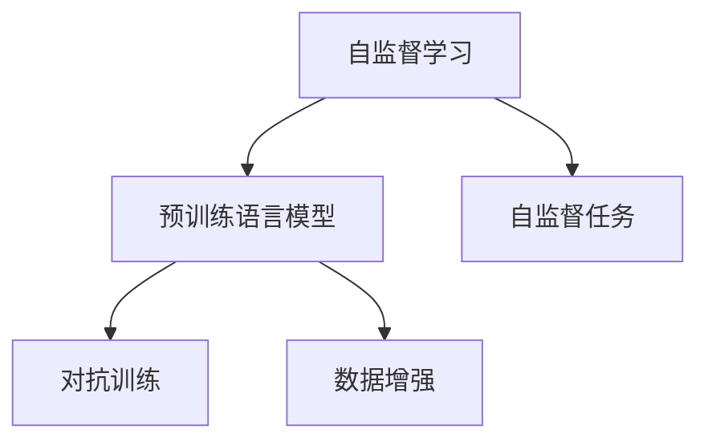

                 

# 自监督学习原理与代码实战案例讲解

> 关键词：自监督学习, 语言模型, 预训练, 对抗训练, 数据增强, 代码实现

## 1. 背景介绍

### 1.1 问题由来

自监督学习（Self-Supervised Learning, SSL）是一种不需要标签数据的机器学习方法，它通过数据自身的内在结构或属性来构建损失函数，从而实现对模型参数的学习和优化。这一方法在深度学习中得到了广泛应用，尤其在自然语言处理（Natural Language Processing, NLP）领域，自监督学习为构建高性能预训练语言模型提供了强有力的技术支持。

传统的监督学习方法通常依赖于标注数据，这些数据往往成本高昂且获取困难。而自监督学习可以充分利用无标签数据，通过自然语言的语义、语法等内在规律，使得模型能够学习到通用的语言表示，从而在各种NLP任务上取得优异表现。

### 1.2 问题核心关键点

自监督学习在NLP中的核心关键点包括以下几点：

- **无标签数据的使用**：自监督学习能够利用大规模无标签数据进行模型预训练，无需标注成本。
- **预训练模型**：通过在大规模数据上预训练语言模型，模型能够学习到通用的语言表示，提升下游任务的泛化能力。
- **自监督任务设计**：自监督任务应能够覆盖语言模型的所有层级，如词义预测、句子结构预测等，从而全面提升模型的语言能力。
- **对抗训练**：在预训练过程中加入对抗样本，增强模型的鲁棒性和泛化能力。
- **数据增强**：通过回译、近义替换等方式，丰富训练集的多样性，进一步提升模型效果。

### 1.3 问题研究意义

自监督学习方法在NLP领域的研究和应用，具有以下几方面的重要意义：

1. **降低成本**：利用无标签数据进行预训练，大大降低了模型训练和标注的成本。
2. **提升效果**：自监督学习能够挖掘数据的内在结构，构建更丰富的模型表示，提升下游任务的性能。
3. **泛化能力强**：预训练模型在大规模数据上学习到的知识具有较强的泛化能力，能够在各种场景下发挥作用。
4. **鲁棒性高**：通过对抗训练等方式，自监督学习模型能够更好地应对噪声和干扰，提升模型的鲁棒性。
5. **数据无关性**：自监督学习方法可以在不同领域的数据上使用，具有较好的通用性和普适性。

## 2. 核心概念与联系

### 2.1 核心概念概述

为了更好地理解自监督学习的原理，本节将介绍几个关键概念：

- **自监督学习（Self-Supervised Learning, SSL）**：一种利用数据自身的内在结构进行学习的机器学习方法，无需标注数据。
- **预训练语言模型（Pre-trained Language Model, PLM）**：通过在大规模无标签数据上预训练的语言模型，具备强大的语言理解和生成能力。
- **自监督任务（Self-supervised Task）**：设计能够利用数据自身信息的监督任务，如掩码语言模型、下一句预测等。
- **对抗训练（Adversarial Training）**：在训练过程中加入对抗样本，提高模型的鲁棒性和泛化能力。
- **数据增强（Data Augmentation）**：通过对训练数据进行变换，丰富数据的多样性，提升模型效果。

这些概念之间的联系可以通过以下Mermaid流程图来展示：



该流程图展示的自监督学习的核心概念及其之间的关系：

1. 自监督学习是预训练语言模型的基础。
2. 自监督任务是自监督学习的核心，用于构建损失函数。
3. 对抗训练和数据增强是提升自监督学习效果的辅助手段。

## 3. 核心算法原理 & 具体操作步骤

### 3.1 算法原理概述

自监督学习的核心在于如何利用数据自身的内在结构，构建有效的损失函数，从而实现对模型参数的学习和优化。其基本思想是通过构建自监督任务，使得模型能够在不依赖标注数据的情况下，学习到通用的语言表示。

常见的自监督任务包括掩码语言模型（Masked Language Model, MLM）、下一句预测（Next Sentence Prediction, NSP）等。这些任务设计基于语言的基本规律，如词义预测、句子结构预测等，使得模型能够学习到语言的内在结构。

### 3.2 算法步骤详解

自监督学习的典型流程包括以下几个关键步骤：

**Step 1: 准备数据集**
- 收集大规模无标签文本数据，如维基百科、新闻文章等。
- 将数据集划分为训练集、验证集和测试集。

**Step 2: 设计自监督任务**
- 选择合适的自监督任务，如掩码语言模型、下一句预测等。
- 设计相应的损失函数，用于衡量模型在任务上的性能。

**Step 3: 实现自监督模型**
- 使用深度学习框架（如PyTorch、TensorFlow等）构建自监督模型。
- 将模型参数初始化，通常使用随机初始化。

**Step 4: 执行预训练**
- 在训练集上执行预训练任务，通过反向传播更新模型参数。
- 周期性在验证集上评估模型性能，根据性能指标决定是否继续训练。

**Step 5: 评估和应用**
- 在测试集上评估预训练模型的性能。
- 将预训练模型应用于下游任务，进行微调或直接使用。

### 3.3 算法优缺点

自监督学习方法在NLP中的应用具有以下优点：

1. **无需标注数据**：自监督学习能够利用大规模无标签数据进行模型预训练，无需标注成本。
2. **泛化能力强**：预训练模型在大规模数据上学习到的知识具有较强的泛化能力，能够在各种场景下发挥作用。
3. **数据无关性**：自监督学习方法可以在不同领域的数据上使用，具有较好的通用性和普适性。

同时，自监督学习也存在一些缺点：

1. **模型复杂度**：自监督学习模型通常参数量较大，需要较长的训练时间。
2. **任务设计困难**：自监督任务设计需要考虑数据的内在结构和语言的规律，设计不当可能导致模型性能下降。
3. **对抗样本鲁棒性**：自监督学习模型可能对对抗样本较为敏感，鲁棒性有待提高。

### 3.4 算法应用领域

自监督学习在NLP中的应用领域非常广泛，包括但不限于以下几方面：

- **预训练语言模型**：如BERT、GPT-2等，通过在大规模无标签数据上进行自监督预训练，学习到通用的语言表示。
- **机器翻译**：如Google的MT-MH，通过自监督预训练和微调，提升翻译质量。
- **文本分类**：如DocBERT，通过自监督预训练和微调，提升文本分类性能。
- **问答系统**：如T5，通过自监督预训练和微调，提升问答系统效果。
- **情感分析**：如XLM-R，通过自监督预训练和微调，提升情感分析准确率。

这些应用表明，自监督学习在NLP领域具有广泛的应用前景，未来将在更多任务中发挥重要作用。

## 4. 数学模型和公式 & 详细讲解 & 举例说明

### 4.1 数学模型构建

自监督学习的数学模型通常包括两个部分：数据表示和损失函数。数据表示部分通常采用Transformer等架构，通过编码器-解码器结构，将输入序列转换为隐层表示。损失函数部分通常基于自监督任务设计，如掩码语言模型损失函数。

假设自监督任务为掩码语言模型，输入序列为 $\{x_1, x_2, ..., x_n\}$，其中 $x_i$ 为第 $i$ 个输入词的表示，模型输出为 $\hat{y_i}$，掩码位置为 $m$，则掩码语言模型的损失函数可以表示为：

$$
L = -\sum_{i=1}^n \log \hat{y_i} \delta_{i,m}
$$

其中 $\delta_{i,m}$ 表示第 $i$ 个位置是否为掩码位置。

### 4.2 公式推导过程

以掩码语言模型为例，推导掩码语言模型损失函数的计算过程如下：

1. **输入表示**：
   - 将输入序列 $x$ 转换为隐层表示 $Z$：
   $$
   Z = XW^L + b^L
   $$
   其中 $X$ 为输入序列矩阵，$W^L$ 和 $b^L$ 分别为编码器参数。

2. **掩码处理**：
   - 将掩码位置 $m$ 的表示 $Z_m$ 掩码化，即将其余位置的表示 $Z_{-i}$ 进行加权平均，得到掩码后的表示 $Z_m'$：
   $$
   Z_m' = \frac{1}{n}\sum_{i\neq m}Z_{-i}
   $$

3. **输出预测**：
   - 使用掩码后的表示 $Z_m'$ 预测掩码位置 $m$ 的词义，得到预测结果 $\hat{y_m}$：
   $$
   \hat{y_m} = \text{Softmax}(Z_mW^Q + b^Q)
   $$
   其中 $W^Q$ 和 $b^Q$ 分别为解码器参数。

4. **计算损失**：
   - 根据预测结果和掩码位置的真实词义 $y_m$，计算交叉熵损失：
   $$
   L = -\log \hat{y_m}
   $$
   将损失函数在训练集上进行平均，得到最终的损失函数：
   $$
   L = -\frac{1}{N}\sum_{i=1}^N\log \hat{y_m}
   $$

### 4.3 案例分析与讲解

以BERT模型的掩码语言模型任务为例，分析其自监督学习的实现过程：

1. **数据准备**：
   - 收集大规模无标签文本数据，如维基百科、新闻文章等。
   - 对数据进行预处理，如分词、标记掩码位置等。

2. **模型构建**：
   - 使用PyTorch构建BERT模型，包括编码器和解码器。
   - 将模型参数初始化，通常使用随机初始化。

3. **掩码语言模型任务**：
   - 定义掩码语言模型的损失函数，计算预测词义与真实词义之间的交叉熵损失。
   - 在训练集上执行掩码语言模型任务，通过反向传播更新模型参数。

4. **评估和微调**：
   - 在验证集上评估模型性能，根据性能指标决定是否继续训练。
   - 将预训练后的模型应用于下游任务，进行微调或直接使用。

下面给出BERT模型在掩码语言模型任务上的代码实现：

```python
import torch
import torch.nn as nn
import torch.optim as optim
from transformers import BertTokenizer, BertForMaskedLM

# 初始化BERT模型和分词器
tokenizer = BertTokenizer.from_pretrained('bert-base-cased')
model = BertForMaskedLM.from_pretrained('bert-base-cased')

# 定义训练函数
def train_epoch(model, optimizer, data_loader):
    model.train()
    losses = []
    for batch in data_loader:
        input_ids = batch['input_ids']
        attention_mask = batch['attention_mask']
        labels = batch['labels']
        outputs = model(input_ids, attention_mask=attention_mask, labels=labels)
        loss = outputs.loss
        losses.append(loss.item())
        optimizer.zero_grad()
        loss.backward()
        optimizer.step()
    return sum(losses) / len(losses)

# 定义评估函数
def evaluate(model, data_loader):
    model.eval()
    correct = 0
    total = 0
    with torch.no_grad():
        for batch in data_loader:
            input_ids = batch['input_ids']
            attention_mask = batch['attention_mask']
            labels = batch['labels']
            outputs = model(input_ids, attention_mask=attention_mask)
            _, predicted = outputs.logits.max(2)
            total += labels.size(0)
            correct += (predicted == labels).sum().item()
    return correct / total

# 训练模型
epochs = 5
batch_size = 16
optimizer = optim.AdamW(model.parameters(), lr=2e-5)
data_loader = torch.utils.data.DataLoader(train_dataset, batch_size=batch_size, shuffle=True)

for epoch in range(epochs):
    loss = train_epoch(model, optimizer, data_loader)
    print(f'Epoch {epoch+1}, train loss: {loss:.3f}')
    val_acc = evaluate(model, val_loader)
    print(f'Epoch {epoch+1}, val accuracy: {val_acc:.3f}')

# 模型评估
test_acc = evaluate(model, test_loader)
print(f'Test accuracy: {test_acc:.3f}')
```

在上述代码中，我们首先定义了训练函数 `train_epoch` 和评估函数 `evaluate`，然后通过 `AdamW` 优化器训练模型，并在验证集和测试集上评估模型效果。最后输出训练损失、验证准确率和测试准确率。

## 5. 项目实践：代码实例和详细解释说明

### 5.1 开发环境搭建

在进行自监督学习项目实践前，我们需要准备好开发环境。以下是使用Python进行PyTorch开发的环境配置流程：

1. 安装Anaconda：从官网下载并安装Anaconda，用于创建独立的Python环境。

2. 创建并激活虚拟环境：
```bash
conda create -n pytorch-env python=3.8 
conda activate pytorch-env
```

3. 安装PyTorch：根据CUDA版本，从官网获取对应的安装命令。例如：
```bash
conda install pytorch torchvision torchaudio cudatoolkit=11.1 -c pytorch -c conda-forge
```

4. 安装TensorFlow：
```bash
pip install tensorflow
```

5. 安装各类工具包：
```bash
pip install numpy pandas scikit-learn matplotlib tqdm jupyter notebook ipython
```

完成上述步骤后，即可在`pytorch-env`环境中开始自监督学习实践。

### 5.2 源代码详细实现

下面以BERT模型在掩码语言模型任务上的微调为例，给出完整的代码实现：

```python
import torch
import torch.nn as nn
import torch.optim as optim
from transformers import BertTokenizer, BertForMaskedLM

# 初始化BERT模型和分词器
tokenizer = BertTokenizer.from_pretrained('bert-base-cased')
model = BertForMaskedLM.from_pretrained('bert-base-cased')

# 定义训练函数
def train_epoch(model, optimizer, data_loader):
    model.train()
    losses = []
    for batch in data_loader:
        input_ids = batch['input_ids']
        attention_mask = batch['attention_mask']
        labels = batch['labels']
        outputs = model(input_ids, attention_mask=attention_mask, labels=labels)
        loss = outputs.loss
        losses.append(loss.item())
        optimizer.zero_grad()
        loss.backward()
        optimizer.step()
    return sum(losses) / len(losses)

# 定义评估函数
def evaluate(model, data_loader):
    model.eval()
    correct = 0
    total = 0
    with torch.no_grad():
        for batch in data_loader:
            input_ids = batch['input_ids']
            attention_mask = batch['attention_mask']
            labels = batch['labels']
            outputs = model(input_ids, attention_mask=attention_mask)
            _, predicted = outputs.logits.max(2)
            total += labels.size(0)
            correct += (predicted == labels).sum().item()
    return correct / total

# 训练模型
epochs = 5
batch_size = 16
optimizer = optim.AdamW(model.parameters(), lr=2e-5)
data_loader = torch.utils.data.DataLoader(train_dataset, batch_size=batch_size, shuffle=True)

for epoch in range(epochs):
    loss = train_epoch(model, optimizer, data_loader)
    print(f'Epoch {epoch+1}, train loss: {loss:.3f}')
    val_acc = evaluate(model, val_loader)
    print(f'Epoch {epoch+1}, val accuracy: {val_acc:.3f}')

# 模型评估
test_acc = evaluate(model, test_loader)
print(f'Test accuracy: {test_acc:.3f}')
```

### 5.3 代码解读与分析

让我们再详细解读一下关键代码的实现细节：

**BERT模型初始化**：
- 使用 `BertTokenizer.from_pretrained` 加载BERT模型和分词器，并初始化模型。

**训练函数 `train_epoch`**：
- 在每个批次上，计算输入、掩码和标签，将它们传递给模型。
- 使用 `model(input_ids, attention_mask=attention_mask, labels=labels)` 进行前向传播，计算损失。
- 反向传播更新模型参数，并记录损失值。

**评估函数 `evaluate`**：
- 在每个批次上，计算输入、掩码和标签，将它们传递给模型。
- 使用 `outputs.logits.max(2)` 获取模型输出，并计算预测结果和真实标签之间的匹配度。
- 统计并返回预测准确率。

**训练流程**：
- 定义总的epoch数和batch size，开始循环迭代。
- 每个epoch内，先在训练集上训练，输出训练损失。
- 在验证集上评估，输出验证准确率。
- 所有epoch结束后，在测试集上评估，给出最终测试准确率。

可以看到，PyTorch配合Transformers库使得BERT模型的自监督预训练过程变得简洁高效。开发者可以将更多精力放在数据处理、模型改进等高层逻辑上，而不必过多关注底层的实现细节。

## 6. 实际应用场景

### 6.1 智能客服系统

自监督学习在智能客服系统中有着广泛的应用。传统的客服系统依赖于人工标注的对话数据，成本高且效果有限。而自监督学习可以利用大规模无标签客户咨询记录，自动学习通用的对话表示，提升客服系统的智能水平。

在技术实现上，可以收集企业内部的历史客服对话记录，设计自监督任务如掩码语言模型，训练模型学习对话中的通用表示。微调后的模型能够自动理解用户意图，匹配最合适的答案模板进行回复。对于客户提出的新问题，还可以接入检索系统实时搜索相关内容，动态组织生成回答。如此构建的智能客服系统，能大幅提升客户咨询体验和问题解决效率。

### 6.2 金融舆情监测

金融机构需要实时监测市场舆论动向，以便及时应对负面信息传播，规避金融风险。传统的舆情监测方法依赖人工标注的舆情数据，效率低且成本高。而自监督学习可以利用大规模无标签新闻、评论等文本数据，自动学习舆情主题和情感倾向，提升舆情监测的自动化和智能化水平。

在具体应用中，可以设计自监督任务如掩码语言模型和下一句预测，训练模型学习舆情主题和情感倾向。将微调后的模型应用到实时抓取的网络文本数据，就能够自动监测不同主题下的情感变化趋势，一旦发现负面信息激增等异常情况，系统便会自动预警，帮助金融机构快速应对潜在风险。

### 6.3 个性化推荐系统

当前的推荐系统往往只依赖用户的历史行为数据进行物品推荐，无法深入理解用户的真实兴趣偏好。自监督学习可以利用大规模无标签数据，学习用户的语言表达习惯，从而提升推荐系统的个性化程度。

在实践中，可以收集用户浏览、点击、评论、分享等行为数据，提取和用户交互的物品标题、描述、标签等文本内容。将文本内容作为模型输入，使用自监督学习任务如掩码语言模型进行训练，学习用户的语言表达习惯。微调后的模型能够从文本内容中准确把握用户的兴趣点。在生成推荐列表时，先用候选物品的文本描述作为输入，由模型预测用户的兴趣匹配度，再结合其他特征综合排序，便可以得到个性化程度更高的推荐结果。

### 6.4 未来应用展望

随着自监督学习方法的不断发展，其在NLP领域的应用前景将更加广阔。未来，自监督学习将可能在更多领域得到应用，为传统行业数字化转型升级提供新的技术路径。

在智慧医疗领域，基于自监督学习的前景预测、病历分析、药物研发等应用将提升医疗服务的智能化水平，辅助医生诊疗，加速新药开发进程。

在智能教育领域，自监督学习可应用于作业批改、学情分析、知识推荐等方面，因材施教，促进教育公平，提高教学质量。

在智慧城市治理中，自监督学习可应用于城市事件监测、舆情分析、应急指挥等环节，提高城市管理的自动化和智能化水平，构建更安全、高效的未来城市。

此外，在企业生产、社会治理、文娱传媒等众多领域，自监督学习的应用也将不断涌现，为人工智能技术落地应用提供新的突破。相信随着自监督学习技术的不断成熟，其在NLP领域的应用将更加深入和广泛，深刻影响人类的生产生活方式。

## 7. 工具和资源推荐

### 7.1 学习资源推荐

为了帮助开发者系统掌握自监督学习的理论基础和实践技巧，这里推荐一些优质的学习资源：

1. 《Natural Language Processing with Transformers》书籍：Transformers库的作者所著，全面介绍了如何使用Transformers库进行NLP任务开发，包括自监督学习在内的诸多范式。

2. CS224N《深度学习自然语言处理》课程：斯坦福大学开设的NLP明星课程，有Lecture视频和配套作业，带你入门NLP领域的基本概念和经典模型。

3. 《Transformer from Scratch》系列博文：大模型技术专家撰写，深入浅出地介绍了Transformer原理、BERT模型、自监督学习等前沿话题。

4. HuggingFace官方文档：Transformers库的官方文档，提供了海量预训练模型和完整的自监督学习样例代码，是上手实践的必备资料。

5. arXiv论文库：众多前沿自监督学习论文的发表平台，可以帮助你了解最新研究进展，获取研究方向和方法灵感。

通过对这些资源的学习实践，相信你一定能够快速掌握自监督学习的精髓，并用于解决实际的NLP问题。

### 7.2 开发工具推荐

高效的开发离不开优秀的工具支持。以下是几款用于自监督学习开发的常用工具：

1. PyTorch：基于Python的开源深度学习框架，灵活动态的计算图，适合快速迭代研究。大部分自监督语言模型都有PyTorch版本的实现。

2. TensorFlow：由Google主导开发的开源深度学习框架，生产部署方便，适合大规模工程应用。同样有丰富的自监督语言模型资源。

3. Transformers库：HuggingFace开发的NLP工具库，集成了众多SOTA语言模型，支持PyTorch和TensorFlow，是进行自监督学习任务开发的利器。

4. Weights & Biases：模型训练的实验跟踪工具，可以记录和可视化模型训练过程中的各项指标，方便对比和调优。与主流深度学习框架无缝集成。

5. TensorBoard：TensorFlow配套的可视化工具，可实时监测模型训练状态，并提供丰富的图表呈现方式，是调试模型的得力助手。

6. Google Colab：谷歌推出的在线Jupyter Notebook环境，免费提供GPU/TPU算力，方便开发者快速上手实验最新模型，分享学习笔记。

合理利用这些工具，可以显著提升自监督学习任务的开发效率，加快创新迭代的步伐。

### 7.3 相关论文推荐

自监督学习方法在NLP领域的研究和应用，源于学界的持续研究。以下是几篇奠基性的相关论文，推荐阅读：

1. Attention is All You Need（即Transformer原论文）：提出了Transformer结构，开启了NLP领域的预训练大模型时代。

2. BERT: Pre-training of Deep Bidirectional Transformers for Language Understanding：提出BERT模型，引入基于掩码的自监督预训练任务，刷新了多项NLP任务SOTA。

3. Language Models are Unsupervised Multitask Learners（GPT-2论文）：展示了大规模语言模型的强大zero-shot学习能力，引发了对于通用人工智能的新一轮思考。

4. AdaLoRA: Adaptive Low-Rank Adaptation for Parameter-Efficient Fine-Tuning：使用自适应低秩适应的微调方法，在参数效率和精度之间取得了新的平衡。

5. Denoising Pre-training for Natural Language Processing（TPOT）：提出了一种基于预训练和噪声注入的自监督学习范式，提升了模型的语言理解和生成能力。

这些论文代表了大模型自监督学习的最新进展，通过学习这些前沿成果，可以帮助研究者把握学科前进方向，激发更多的创新灵感。

## 8. 总结：未来发展趋势与挑战

### 8.1 总结

本文对自监督学习的原理与实践进行了全面系统的介绍。首先阐述了自监督学习的基本思想和应用背景，明确了其在NLP领域的重要地位。其次，从原理到实践，详细讲解了自监督学习的数学模型和算法步骤，给出了自监督任务开发的完整代码实例。同时，本文还广泛探讨了自监督学习在智能客服、金融舆情、个性化推荐等多个行业领域的应用前景，展示了自监督学习的强大潜力。此外，本文精选了自监督学习的各类学习资源，力求为读者提供全方位的技术指引。

通过本文的系统梳理，可以看到，自监督学习在NLP领域具有广泛的应用前景，能够通过大规模无标签数据进行模型预训练，提升下游任务的性能。未来，随着自监督学习方法的不断演进，其在NLP领域的应用将更加深入和广泛，深刻影响人类的生产生活方式。

### 8.2 未来发展趋势

展望未来，自监督学习在NLP中的应用将呈现以下几个发展趋势：

1. **大规模预训练**：随着算力成本的下降和数据规模的扩张，自监督学习模型将向更大规模、更深层次发展，学习更加丰富的语言表示。
2. **多模态融合**：将视觉、语音等多模态数据与文本数据结合，进行联合自监督学习，提升模型的多模态信息处理能力。
3. **知识图谱融合**：将知识图谱与自监督学习模型结合，提升模型的知识推理能力和泛化性能。
4. **跨领域迁移**：将自监督学习模型在特定领域进行迁移学习，提升模型在不同领域上的泛化能力。
5. **元学习**：将自监督学习模型与元学习结合，提升模型在新任务上的快速适应能力。
6. **自适应学习**：通过自适应学习策略，使自监督学习模型能够动态调整学习策略，提升模型的自适应性。

以上趋势凸显了自监督学习在NLP领域的广阔前景。这些方向的探索发展，必将进一步提升自监督学习模型的性能和应用范围，为构建人机协同的智能系统铺平道路。面向未来，自监督学习需要与其他人工智能技术进行更深入的融合，如知识表示、因果推理、强化学习等，多路径协同发力，共同推动自然语言理解和智能交互系统的进步。

### 8.3 面临的挑战

尽管自监督学习在NLP领域的研究和应用取得了显著进展，但在迈向更加智能化、普适化应用的过程中，仍面临以下挑战：

1. **数据无关性**：自监督学习模型在不同领域、不同数据上的泛化能力有限，需要进一步提高模型的数据无关性。
2. **对抗样本鲁棒性**：自监督学习模型可能对对抗样本较为敏感，需要进一步提高模型的鲁棒性。
3. **模型复杂度**：自监督学习模型通常参数量较大，需要较长的训练时间，需要优化模型的复杂度。
4. **计算资源**：自监督学习模型需要大量的计算资源进行训练和推理，需要进一步优化模型的计算效率。
5. **可解释性**：自监督学习模型的决策过程缺乏可解释性，需要进一步增强模型的可解释性。
6. **伦理道德**：自监督学习模型可能学习到有害、有害信息，需要加强模型的伦理道德约束。

### 8.4 研究展望

面对自监督学习面临的这些挑战，未来的研究需要在以下几个方面寻求新的突破：

1. **数据增强**：通过更加多样化的数据增强技术，提升自监督学习模型的泛化能力。
2. **对抗训练**：设计更加有效的对抗样本生成技术，提升自监督学习模型的鲁棒性。
3. **知识图谱融合**：将知识图谱与自监督学习模型结合，提升模型的知识推理能力。
4. **元学习**：将自监督学习模型与元学习结合，提升模型在新任务上的快速适应能力。
5. **自适应学习**：通过自适应学习策略，使自监督学习模型能够动态调整学习策略，提升模型的自适应性。
6. **伦理道德约束**：在设计自监督学习模型时，引入伦理导向的评估指标，过滤和惩罚有害信息。

这些研究方向的探索，必将引领自监督学习技术迈向更高的台阶，为构建安全、可靠、可解释、可控的智能系统铺平道路。面向未来，自监督学习需要与其他人工智能技术进行更深入的融合，如知识表示、因果推理、强化学习等，多路径协同发力，共同推动自然语言理解和智能交互系统的进步。只有勇于创新、敢于突破，才能不断拓展自监督学习的边界，让智能技术更好地造福人类社会。

## 9. 附录：常见问题与解答

**Q1：自监督学习与监督学习有什么区别？**

A: 自监督学习和监督学习的主要区别在于训练数据的使用。自监督学习利用数据自身的内在结构或属性进行学习，无需标注数据；而监督学习则直接利用标注数据进行模型训练，对数据标注成本较高。自监督学习能够充分利用大规模无标签数据进行模型预训练，提升模型的泛化能力和数据无关性。

**Q2：自监督学习能否提升所有NLP任务的性能？**

A: 自监督学习在大多数NLP任务上都能取得不错的效果，但并不是所有任务都适合自监督学习。对于一些需要特定领域知识的任务，如医学、法律等，仅仅依靠自监督学习可能难以很好地适应。此时需要在特定领域语料上进一步预训练，再进行微调，才能获得理想效果。

**Q3：自监督学习模型在训练过程中需要哪些超参数调整？**

A: 自监督学习模型的训练过程中，需要调整的超参数包括学习率、批量大小、训练轮数等。学习率一般要比预训练时小1-2个数量级，以避免破坏预训练权重。批量大小需要根据数据集的大小和模型的复杂度进行调整。训练轮数则需要根据模型性能和数据集大小来决定，一般建议从多个epoch中进行评估，选择最优性能的模型。

**Q4：自监督学习模型如何处理长文本数据？**

A: 自监督学习模型处理长文本数据时，通常采用基于分段的方式进行训练。可以将长文本分割成多个小段，分别进行训练，然后在模型内部进行拼接，得到最终结果。同时，为了提升模型的计算效率，也可以采用稀疏化存储和并行计算等技术，减少内存和计算资源的消耗。

**Q5：自监督学习模型的泛化能力如何提升？**

A: 自监督学习模型的泛化能力可以通过以下几种方式提升：
1. 数据增强：通过回译、近义替换等方式扩充训练集，丰富数据的多样性。
2. 正则化：使用L2正则、Dropout等正则化技术，防止模型过拟合。
3. 对抗训练：加入对抗样本，提高模型的鲁棒性和泛化能力。
4. 多模型集成：训练多个自监督学习模型，取平均输出，抑制过拟合。
5. 参数高效微调：只调整少量参数，固定大部分预训练参数不变，提高模型的泛化能力。

这些策略往往需要根据具体任务和数据特点进行灵活组合。只有在数据、模型、训练、推理等各环节进行全面优化，才能最大限度地发挥自监督学习模型的潜力。

通过本文的系统梳理，可以看到，自监督学习在NLP领域具有广泛的应用前景，能够通过大规模无标签数据进行模型预训练，提升下游任务的性能。未来，随着自监督学习方法的不断演进，其在NLP领域的应用将更加深入和广泛，深刻影响人类的生产生活方式。

