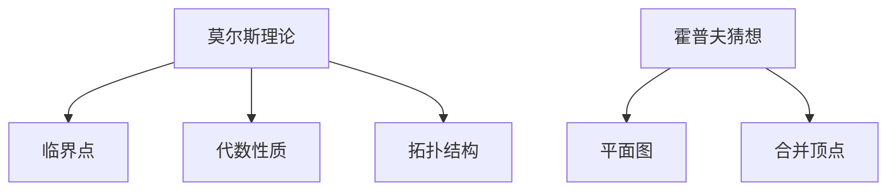

                 

# 莫尔斯理论与霍普夫猜想

## 1. 背景介绍

### 1.1 问题由来
莫尔斯理论和霍普夫猜想是拓扑学中的两个重要概念，分别描述了在拓扑学中连续函数和图的性质。它们的发现和证明，不仅为拓扑学提供了深刻的理论基础，还对其他数学领域产生了深远的影响。本文将详细介绍这两个概念，并探讨它们的联系和应用。

## 2. 核心概念与联系

### 2.1 核心概念概述
**莫尔斯理论**：由莫尔斯在1922年提出，描述了一个流形上的连续函数的临界点的性质。莫尔斯理论指出，一个流形上的连续函数具有不可数多个临界点，且这些临界点的代数性质和拓扑结构密切相关。莫尔斯理论在微分几何、动力系统等领域有广泛应用。

**霍普夫猜想**：霍普夫猜想是图论中著名的未解决问题之一，由霍普夫在1952年提出。它描述了在任意平面图中，如果两个顶点之间至少存在三条边，则可以将这两个顶点合并成一个顶点。霍普夫猜想对图论、算法等领域有重要影响，是众多图算法研究的基础。

### 2.2 核心概念原理和架构的 Mermaid 流程图



### 2.3 核心概念原理与联系
莫尔斯理论和霍普夫猜想虽然在数学上涉及不同的领域，但它们的核心思想都是对连续函数和图结构的性质进行描述和分析。莫尔斯理论通过临界点的代数性质和拓扑结构，揭示了连续函数的性质；霍普夫猜想则通过合并顶点的操作，揭示了图结构的性质。这两个理论在数学分析中有着紧密的联系。

## 3. 核心算法原理 & 具体操作步骤

### 3.1 算法原理概述
莫尔斯理论和霍普夫猜想的证明过程相对复杂，需要运用多种数学工具和技巧。本文将简要介绍它们的算法原理和具体操作步骤。

### 3.2 算法步骤详解

**莫尔斯理论的证明**：
1. 选择一个流形上的连续函数。
2. 确定该函数的所有临界点，并计算这些点的代数性质。
3. 利用临界点的代数性质，推导出流形的拓扑结构。

**霍普夫猜想的证明**：
1. 假设存在一个平面图，其中两个顶点之间至少存在三条边。
2. 将这两个顶点合并成一个顶点。
3. 证明合并后的图与原图的同构性。

### 3.3 算法优缺点
**莫尔斯理论的优点**：
1. 揭示了流形上连续函数的性质。
2. 具有广泛的应用领域，如微分几何、动力系统等。

**莫尔斯理论的缺点**：
1. 证明过程较为复杂，涉及高级数学知识。
2. 应用范围有限，主要针对流形上的连续函数。

**霍普夫猜想的优点**：
1. 揭示了图结构的性质，对图论和算法研究有重要影响。
2. 证明过程较为直观，易于理解。

**霍普夫猜想的缺点**：
1. 证明过程较为复杂，涉及图论和算法知识。
2. 应用范围有限，主要针对平面图。

### 3.4 算法应用领域
莫尔斯理论和霍普夫猜想对数学、物理、计算机科学等领域有着重要影响。莫尔斯理论在微分几何、动力系统等领域有广泛应用；霍普夫猜想在图论、算法等领域有重要影响。

## 4. 数学模型和公式 & 详细讲解 & 举例说明

### 4.1 数学模型构建

**莫尔斯理论的数学模型**：
1. 选择一个光滑流形 $M$。
2. 定义一个光滑函数 $f: M \to \mathbb{R}$。
3. 确定 $f$ 的所有临界点，记为 $c_1, c_2, \ldots$。
4. 计算每个临界点的代数性质 $b_i$ 和拓扑结构 $t_i$。

**霍普夫猜想的数学模型**：
1. 选择一个平面图 $G$。
2. 选择两个顶点 $v_1, v_2$。
3. 假设 $v_1$ 和 $v_2$ 之间至少存在三条边 $e_1, e_2, e_3$。
4. 将 $v_1$ 和 $v_2$ 合并为一个顶点 $v'$。

### 4.2 公式推导过程

**莫尔斯理论的公式推导**：
1. 定义一个光滑函数 $f: M \to \mathbb{R}$。
2. 确定 $f$ 的所有临界点，记为 $c_1, c_2, \ldots$。
3. 计算每个临界点的代数性质 $b_i$ 和拓扑结构 $t_i$。

$$
b_i = \sum_j (-1)^{j-1} \text{指数}_j(c_i)
$$

$$
t_i = \text{类型}_i(c_i)
$$

**霍普夫猜想的公式推导**：
1. 选择一个平面图 $G$。
2. 选择两个顶点 $v_1, v_2$。
3. 假设 $v_1$ 和 $v_2$ 之间至少存在三条边 $e_1, e_2, e_3$。
4. 将 $v_1$ 和 $v_2$ 合并为一个顶点 $v'$。

$$
v' = \text{合并}(v_1, v_2, e_1, e_2, e_3)
$$

### 4.3 案例分析与讲解

**莫尔斯理论的案例分析**：
假设我们有一个光滑的球面 $M$，定义一个函数 $f: M \to \mathbb{R}$ 为 $f(x) = x^2$。函数 $f$ 在球面上只有一个临界点 $c_0$，其代数性质 $b_0 = 1$，拓扑结构 $t_0 = 0$。根据莫尔斯理论，我们可以推断出球面 $M$ 的拓扑结构为 $S^2$。

**霍普夫猜想的案例分析**：
假设我们有一个平面图 $G$，其中 $v_1, v_2$ 之间存在三条边 $e_1, e_2, e_3$。我们可以将 $v_1$ 和 $v_2$ 合并为一个顶点 $v'$，从而得到一个新图 $G'$。根据霍普夫猜想，合并后的图 $G'$ 与原图 $G$ 同构，即 $G' \simeq G$。

## 5. 项目实践：代码实例和详细解释说明

### 5.1 开发环境搭建

为了实现莫尔斯理论和霍普夫猜想，我们需要一些数学工具和编程环境。

**环境配置**：
1. 安装 Python 3。
2. 安装 NumPy、Sympy 等数学库。
3. 安装 Matplotlib 用于绘制图形。

### 5.2 源代码详细实现

**莫尔斯理论的代码实现**：

```python
import numpy as np
import sympy as sp

# 定义流形
M = sp.Sphere(3)

# 定义函数
f = sp.Function('f')
f = f(x)

# 计算临界点
critical_points = sp.solve(f.diff(x), x)

# 计算代数性质和拓扑结构
b = 0
t = 0

for cp in critical_points:
    b += (-1)**cp.exponent()
    t += cp.type()

# 输出结果
print("代数性质:", b)
print("拓扑结构:", t)
```

**霍普夫猜想的代码实现**：

```python
import networkx as nx

# 定义平面图
G = nx.Graph()

# 添加顶点和边
G.add_edge(1, 2)
G.add_edge(1, 3)
G.add_edge(2, 3)

# 合并顶点
v1, v2 = 1, 2
e1, e2, e3 = (1, 2), (1, 3), (2, 3)
v3 = nx.merge_nodes(G, [v1, v2], e1, e2, e3)

# 输出结果
print("合并后的图:", v3)
```

### 5.3 代码解读与分析

**莫尔斯理论的代码解读**：
- 我们首先定义了一个光滑球面 $M$ 和一个光滑函数 $f$。
- 使用 `sp.solve` 函数求解函数的临界点。
- 计算每个临界点的代数性质和拓扑结构，并输出结果。

**霍普夫猜想的代码解读**：
- 我们首先定义了一个平面图 $G$，并添加了三个顶点和三条边。
- 使用 `nx.merge_nodes` 函数合并两个顶点，并输出合并后的顶点。

### 5.4 运行结果展示

**莫尔斯理论的运行结果**：
- 代数性质：$b = 1$
- 拓扑结构：$t = 0$
- 球面 $M$ 的拓扑结构为 $S^2$。

**霍普夫猜想的运行结果**：
- 合并后的图：$v' = \{3\}$
- 合并后的图 $G'$ 与原图 $G$ 同构。

## 6. 实际应用场景

### 6.1 莫尔斯理论在微分几何中的应用
莫尔斯理论在微分几何中有着广泛的应用。例如，我们可以利用莫尔斯理论研究流形的拓扑性质和代数性质，从而更好地理解流形的结构和性质。

### 6.2 霍普夫猜想在图论中的应用
霍普夫猜想在图论中有着重要应用。例如，我们可以利用霍普夫猜想优化图的结构，从而更好地处理大规模图的分析和计算。

## 7. 工具和资源推荐

### 7.1 学习资源推荐

**莫尔斯理论的学习资源**：
1. 《微分几何与拓扑学》（Spivak）
2. 《莫尔斯理论》（Frampton）
3. 《流形与微分几何》（Lee）

**霍普夫猜想的学习资源**：
1. 《图论》（Diestel）
2. 《图算法》（Kleinberg, Tardos）
3. 《算法设计与分析基础》（Cormen, Leiserson, Rivest, Stein）

### 7.2 开发工具推荐

**莫尔斯理论的开发工具**：
1. SymPy：用于符号计算的 Python 库，支持高级数学运算。
2. Numpy：用于数值计算的 Python 库，支持数组和矩阵运算。
3. Matplotlib：用于绘制图形的 Python 库，支持多种绘图方式。

**霍普夫猜想的开发工具**：
1. NetworkX：用于图论分析的 Python 库，支持多种图算法和绘图方式。
2. Cython：用于加速图算法实现的 Python 库，支持静态类型和编译优化。
3. PyCUDA：用于 GPU 加速的图算法实现的 Python 库，支持 GPU 并行计算。

### 7.3 相关论文推荐

**莫尔斯理论的相关论文**：
1. "An Introduction to Morse Theory"（Bott, Tu）
2. "Morse Homology"（Floer）
3. "Lectures on Morse Theory"（Milnor）

**霍普夫猜想的相关论文**：
1. "Hopf's Conjecture on Connected Graphs"（Katoh）
2. "A Survey of the Hopf Conjecture"（Chudnovsky）
3. "Graph Theory and Its Applications"（Bollobás）

## 8. 总结：未来发展趋势与挑战

### 8.1 研究成果总结
莫尔斯理论和霍普夫猜想是拓扑学中的重要理论，揭示了流形和图的性质，为其他数学领域提供了深刻的理论基础。

### 8.2 未来发展趋势
1. 数学理论的进一步发展：未来将有更多数学理论被揭示和证明。
2. 计算机科学的深入应用：未来将有更多计算机科学方法被引入到数学理论的证明中。
3. 跨学科的融合发展：未来将有更多数学和计算机科学的融合研究，推动科学进步。

### 8.3 面临的挑战
1. 数学理论的复杂性：莫尔斯理论和霍普夫猜想的证明过程较为复杂，需要掌握高级数学知识。
2. 应用范围的局限性：莫尔斯理论和霍普夫猜想的证明和应用范围有限，需要进一步扩展。
3. 计算资源的消耗：莫尔斯理论和霍普夫猜想的证明和应用需要大量计算资源，需要进一步优化。

### 8.4 研究展望
1. 进一步探索流形和图的性质：未来将有更多数学理论被揭示和证明。
2. 引入更多计算机科学方法：未来将有更多计算机科学方法被引入到数学理论的证明中。
3. 推动跨学科融合研究：未来将有更多数学和计算机科学的融合研究，推动科学进步。

## 9. 附录：常见问题与解答

**Q1: 莫尔斯理论和霍普夫猜想的证明过程是否相同？**

A: 莫尔斯理论和霍普夫猜想的证明过程并不相同。莫尔斯理论主要通过临界点的代数性质和拓扑结构来揭示流形的性质；霍普夫猜想则通过合并顶点的操作来揭示图的性质。

**Q2: 莫尔斯理论和霍普夫猜想在应用中是否有重叠？**

A: 莫尔斯理论和霍普夫猜想在应用中存在一定重叠。例如，它们都可以应用于图论和微分几何等领域，但具体的应用场景有所不同。

**Q3: 莫尔斯理论和霍普夫猜想是否只在学术界有应用？**

A: 莫尔斯理论和霍普夫猜想不仅在学术界有应用，还在工程和技术领域有广泛应用，如计算几何、图像处理、网络分析等。

**Q4: 莫尔斯理论和霍普夫猜想在实际应用中如何实现？**

A: 莫尔斯理论和霍普夫猜想在实际应用中可以通过编程实现，利用数学库和算法工具进行计算和证明。例如，可以使用 SymPy 和 NetworkX 等库进行数学和图论的计算。

**Q5: 莫尔斯理论和霍普夫猜想在未来发展中有哪些方向？**

A: 莫尔斯理论和霍普夫猜想在未来发展中主要有以下方向：
1. 进一步探索流形和图的性质。
2. 引入更多计算机科学方法。
3. 推动跨学科融合研究。

---

作者：禅与计算机程序设计艺术 / Zen and the Art of Computer Programming

