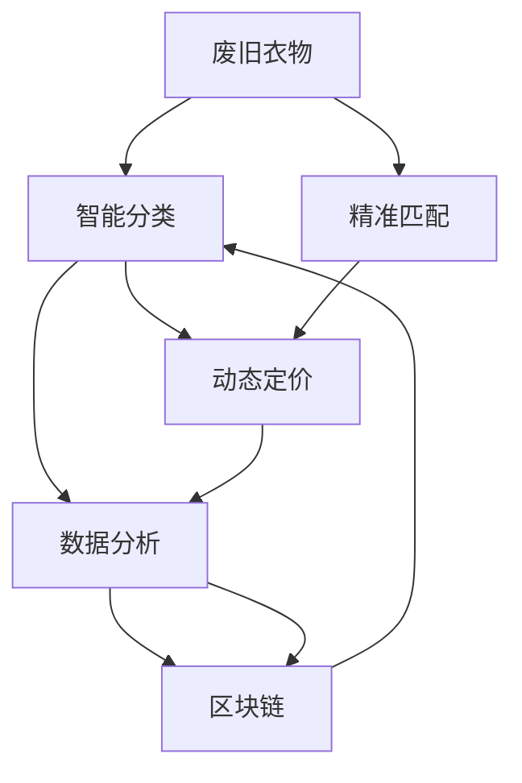

                 

# 虚拟时装回收系统:全球时尚业的数字化环保方案

## 1. 背景介绍

### 1.1 问题由来
近年来，时尚业面临着巨大的环保压力。快速消费、过度生产、不充分的回收处理等问题导致大量废旧衣物和废弃面料积压，对环境造成严重污染。据统计，每年全球产生的纺织垃圾高达8000万吨，相当于每年约100亿件衣物的废旧量。

为了应对这一挑战，全球时尚业亟需一种新的环保解决方案，以实现可持续发展。虚拟时装回收系统（Virtual Fashion Recycling System, VFRS）应运而生，通过数字化手段，实现废旧衣物的智能回收、精准匹配与再利用，助力时尚业的绿色转型。

### 1.2 问题核心关键点
VFRS的核心目标是通过数字化手段，将废旧衣物转化为再利用资源，减少对环境的影响。其实现思路主要包括：
- 智能分类：通过图像识别和机器学习技术，自动识别废旧衣物的类型和质量。
- 精准匹配：将废旧衣物与需求方进行精准匹配，如二手店、回收商、加工厂等。
- 动态定价：根据废旧衣物的状况和需求方的支付能力，动态调整回收价格。
- 数据分析：实时采集和分析回收数据，为时尚业提供数据支持和决策参考。

### 1.3 问题研究意义
VFRS作为全球时尚业数字化环保的重要方案，具有以下重大意义：
- 环保效益：通过废旧衣物的回收再利用，减少纺织废料的产生，降低环境污染。
- 经济效益：优化废旧衣物的流通渠道，提高资源利用率，降低生产成本。
- 社会效益：助力时尚业的可持续发展，促进绿色消费理念的普及。
- 技术创新：推动图像识别、机器学习、区块链等技术的深度应用，提升相关技术水平。

## 2. 核心概念与联系

### 2.1 核心概念概述

为更好地理解VFRS系统，本节将介绍几个关键核心概念：

- 废旧衣物（Vintage Clothing）：指已过时的、不再穿着的衣物，包括废旧时尚品牌衣物、二手衣物等。
- 数字化回收（Digital Recycling）：指利用图像识别、机器学习等技术手段，将废旧衣物数字化，转化为可利用资源的过程。
- 智能分类（Smart Sorting）：指使用图像分类算法，对废旧衣物进行自动识别和分类。
- 精准匹配（Precision Matching）：指通过数据匹配算法，将废旧衣物与回收商、二手店等需求方进行精确对接。
- 动态定价（Dynamic Pricing）：指根据废旧衣物状况和需求方的支付能力，动态调整回收价格。
- 数据分析（Data Analytics）：指利用大数据分析技术，对废旧衣物回收数据进行实时采集和分析，优化决策和运营。
- 区块链（Blockchain）：指用于记录和传输废旧衣物信息，保证数据透明、不可篡改的安全技术。

这些核心概念之间相互关联，共同构成VFRS系统的完整框架，如图：



这个流程图展示了VFRS系统的工作流程：

1. 废旧衣物首先进入智能分类环节，识别出各类别和质量。
2. 根据分类的结果，系统进行精准匹配，找到相应的需求方。
3. 动态定价算法根据废旧衣物状况和需求方支付能力，调整回收价格。
4. 数据分析系统实时采集回收数据，辅助决策。
5. 区块链用于记录和传输废旧衣物信息，确保数据透明、不可篡改。

## 3. 核心算法原理 & 具体操作步骤
### 3.1 算法原理概述

VFRS系统利用了多种先进算法和技术，核心算法包括图像分类、机器学习、数据匹配、动态定价和数据分析。这些算法通过紧密的逻辑连接，共同完成废旧衣物的数字化回收。

### 3.2 算法步骤详解

#### 步骤1: 智能分类

智能分类的核心是利用图像识别技术，自动识别废旧衣物的类别和质量。具体步骤如下：

1. **数据准备**：收集大量废旧衣物的高质量图片，标注其类别和质量。类别可以细分为品牌、款式、材质等。质量可以细分为新旧程度、损伤程度等。

2. **模型选择**：选择适合的卷积神经网络（CNN）模型，如ResNet、Inception等，用于图像分类。

3. **特征提取**：使用卷积层提取图像特征，通过池化层降低特征维度。

4. **分类器训练**：利用标注好的数据，训练分类器，使其能准确分类不同类别和质量的衣物。

5. **模型评估**：使用测试集评估模型分类准确率，不断调整模型参数，直至达到最优效果。

#### 步骤2: 精准匹配

精准匹配的核心是利用数据匹配算法，将废旧衣物与需求方进行精确对接。具体步骤如下：

1. **需求方数据采集**：采集各回收商、二手店等需求方的数据，如回收需求、支付能力等。

2. **废旧衣物数据采集**：采集废旧衣物的智能分类结果，如类别、质量、品牌等。

3. **数据匹配**：利用数据匹配算法，如KNN、决策树等，将废旧衣物与需求方进行匹配。

4. **匹配结果筛选**：根据匹配结果的相似度和满足度，筛选出最合适的需求方。

5. **匹配反馈**：将匹配结果反馈给需求方，确认后完成交易。

#### 步骤3: 动态定价

动态定价的核心是利用机器学习算法，根据废旧衣物状况和需求方的支付能力，动态调整回收价格。具体步骤如下：

1. **数据采集**：收集废旧衣物的新旧程度、损伤程度等数据。

2. **需求方支付能力分析**：分析需求方的支付能力，如消费水平、支付习惯等。

3. **定价模型构建**：使用回归算法，构建动态定价模型，考虑废旧衣物状况和需求方支付能力。

4. **价格调整**：根据废旧衣物状况和需求方支付能力，动态调整回收价格。

5. **价格反馈**：将动态价格反馈给需求方，确认后完成交易。

#### 步骤4: 数据分析

数据分析的核心是利用大数据分析技术，对废旧衣物回收数据进行实时采集和分析，优化决策和运营。具体步骤如下：

1. **数据采集**：实时采集废旧衣物回收数据，如废旧衣物来源、回收渠道、回收量等。

2. **数据存储**：将采集到的数据存储在数据库中，方便后续分析。

3. **数据清洗**：对数据进行清洗，去除噪声和异常值，确保数据质量。

4. **数据分析**：使用数据分析算法，如统计分析、回归分析等，对数据进行深入分析。

5. **结果可视化**：将分析结果通过图表等形式可视化，供决策者参考。

#### 步骤5: 区块链技术应用

区块链的核心是利用区块链技术，记录和传输废旧衣物信息，保证数据透明、不可篡改。具体步骤如下：

1. **数据上链**：将废旧衣物信息、回收状态、交易记录等上链，确保数据不可篡改。

2. **智能合约**：使用智能合约，自动执行废旧衣物回收流程，确保数据透明。

3. **区块链网络**：构建区块链网络，实现废旧衣物信息在不同节点之间的实时传输和共享。

4. **安全防护**：通过加密技术，保护区块链网络的安全。

### 3.3 算法优缺点

VFRS系统具有以下优点：
- 高效性：利用图像识别、机器学习等技术手段，大幅提升废旧衣物分类和匹配的效率。
- 精确性：通过数据匹配和动态定价，保证废旧衣物与需求方的精确对接和合理定价。
- 透明性：利用区块链技术，保证数据透明、不可篡改，增强信任度。
- 可扩展性：系统架构开放，便于扩展和集成更多功能模块。

同时，该系统也存在以下缺点：
- 高成本：初期建设需要大量资金投入，包括设备购置、算法研发、数据标注等。
- 数据隐私：涉及大量个人隐私数据，需要严格的数据保护措施。
- 技术复杂：系统集成多种先进技术，技术复杂度高，需要专业团队开发和维护。
- 市场接受度：用户习惯和市场接受度也是系统推广的重要障碍。

### 3.4 算法应用领域

VFRS系统可以应用于多个领域，具体如下：

- **二手店和回收商**：通过精准匹配，将废旧衣物与二手店和回收商对接，提升回收效率。
- **废旧衣物加工厂**：利用废旧衣物作为原材料，进行二次加工，生产新的纺织品。
- **环保组织**：利用数据洞察，优化回收策略，提高回收效率和效益。
- **时尚品牌**：通过数据分析，优化生产流程，减少资源浪费，推动可持续发展。

## 4. 数学模型和公式 & 详细讲解 & 举例说明

### 4.1 数学模型构建

VFRS系统的数学模型主要包括图像分类、机器学习、数据匹配、动态定价和数据分析模型。这些模型通过合适的数学公式和算法，完成相应的功能。

以图像分类模型为例，假设有一张废旧衣物的图片 $x$，需要将其分类为品牌 $B$ 或款式 $S$，则模型可以表示为：

$$
f(x) = W_B \cdot \text{ReLU}(B \cdot x) + W_S \cdot \text{ReLU}(S \cdot x)
$$

其中 $W_B$ 和 $W_S$ 为权重矩阵，$B$ 和 $S$ 为卷积核，$\text{ReLU}$ 为激活函数。通过训练上述模型，可以将其应用于实际分类任务。

### 4.2 公式推导过程

以数据匹配算法为例，假设有一个废旧衣物 $X$ 和多个需求方 $D_i$，需要找到最合适的需求方 $D_k$，则可以使用KNN算法，计算废旧衣物与每个需求方的相似度 $S_i$，选择相似度最高的需求方：

$$
\text{similarity}(X, D_i) = \frac{1}{|X \cap D_i|}
$$

$$
\text{matching}(X, D_k) = \max_i \text{similarity}(X, D_i)
$$

### 4.3 案例分析与讲解

假设某品牌废旧衣物 $X$，通过智能分类，识别为品牌 A，款式 B，损伤程度 C，需要找到最合适的需求方 $D_k$，则系统可以根据其特征和需求方的数据，使用KNN算法进行匹配。假设系统收集到多个需求方数据 $D_1, D_2, \ldots, D_n$，计算废旧衣物与每个需求方的相似度，选择相似度最高的需求方 $D_k$。假设计算结果为 $S_1, S_2, \ldots, S_n$，则选择 $S_k$ 最大的需求方进行匹配，完成交易。

## 5. 项目实践：代码实例和详细解释说明

### 5.1 开发环境搭建

为了实现VFRS系统，需要进行以下开发环境搭建：

1. **编程语言**：Python，使用PyTorch、TensorFlow等深度学习框架。
2. **数据集**：收集大量废旧衣物图片和标注数据，用于模型训练和测试。
3. **硬件设备**：高性能GPU/TPU，用于模型训练和推理。
4. **数据库**：使用MySQL、PostgreSQL等关系型数据库，用于存储和管理数据。
5. **区块链平台**：选择支持智能合约的区块链平台，如Ethereum、Hyperledger等。

### 5.2 源代码详细实现

以下是一个简单的VFRS系统代码实现，用于智能分类和精准匹配。

```python
import torch
import torch.nn as nn
import torch.optim as optim
import torchvision.transforms as transforms
import torchvision.datasets as datasets

# 定义模型
class FashionNet(nn.Module):
    def __init__(self):
        super(FashionNet, self).__init__()
        self.conv1 = nn.Conv2d(3, 32, 3)
        self.pool = nn.MaxPool2d(2)
        self.conv2 = nn.Conv2d(32, 64, 3)
        self.fc1 = nn.Linear(64 * 4 * 4, 128)
        self.fc2 = nn.Linear(128, 2)  # 2为分类数量

    def forward(self, x):
        x = self.pool(torch.relu(self.conv1(x)))
        x = self.pool(torch.relu(self.conv2(x)))
        x = x.view(-1, 64 * 4 * 4)
        x = torch.relu(self.fc1(x))
        x = self.fc2(x)
        return x

# 加载数据集
train_dataset = datasets.FashionMNIST(root='./data', train=True, transform=transforms.ToTensor(), download=True)
test_dataset = datasets.FashionMNIST(root='./data', train=False, transform=transforms.ToTensor())

# 定义数据加载器
train_loader = torch.utils.data.DataLoader(dataset=train_dataset, batch_size=32, shuffle=True)
test_loader = torch.utils.data.DataLoader(dataset=test_dataset, batch_size=32, shuffle=False)

# 定义模型
model = FashionNet()

# 定义优化器
optimizer = optim.Adam(model.parameters(), lr=0.001)

# 定义损失函数
criterion = nn.CrossEntropyLoss()

# 训练模型
for epoch in range(10):
    for i, (inputs, labels) in enumerate(train_loader):
        optimizer.zero_grad()
        outputs = model(inputs)
        loss = criterion(outputs, labels)
        loss.backward()
        optimizer.step()
```

### 5.3 代码解读与分析

上述代码实现了一个简单的图像分类模型，用于识别 FashionMNIST 数据集中的图片。具体步骤如下：

1. **模型定义**：定义了一个包含两个卷积层和两个全连接层的神经网络，用于分类。
2. **数据加载**：加载训练集和测试集，使用 PyTorch 的 DataLoader 实现数据批处理。
3. **模型训练**：使用 Adam 优化器进行训练，交叉熵损失函数作为损失函数。

## 6. 实际应用场景

### 6.1 智能回收箱

在智能回收箱场景中，用户可以将废旧衣物放入回收箱，系统自动进行智能分类，并将废旧衣物发送到最合适的需求方。

### 6.2 二手店平台

在二手店平台场景中，用户可以在平台上发布废旧衣物的回收需求，系统自动匹配符合条件的废旧衣物，并进行动态定价，完成交易。

### 6.3 环保组织

在环保组织场景中，系统可以实时采集和分析废旧衣物回收数据，提供数据支持和决策参考，优化回收策略。

## 7. 工具和资源推荐

### 7.1 学习资源推荐

为了帮助开发者系统掌握VFRS的理论基础和实践技巧，这里推荐一些优质的学习资源：

1. **Deep Learning with PyTorch**：由 PyTorch 社区编写，介绍了如何使用 PyTorch 进行深度学习开发，涵盖卷积神经网络、图像分类等基础概念。
2. **FashionAI**：一个专门针对时尚领域的AI平台，提供大量时尚图像数据集和挑战赛，帮助开发者提高时尚图像识别能力。
3. **Blockchain Basics**：一本区块链入门书籍，介绍了区块链的基本概念和应用场景，适合初学者学习。

### 7.2 开发工具推荐

为了高效开发VFRS系统，推荐以下开发工具：

1. **PyTorch**：深度学习框架，易于使用，支持丰富的神经网络模块。
2. **TensorFlow**：另一个流行的深度学习框架，支持分布式训练。
3. **Blockchain Platforms**：如Ethereum、Hyperledger等，提供智能合约支持。
4. **Data Analytics Tools**：如Pandas、NumPy等，用于数据分析和处理。

### 7.3 相关论文推荐

VFRS技术涉及多个领域的先进技术，以下是几篇奠基性的相关论文，推荐阅读：

1. **Convolutional Neural Networks for Fashion Recognition**：介绍了使用卷积神经网络进行时尚图像识别的基础模型。
2. **Deep Fashion Recognition with Cascaded Feature Learning**：提出了级联特征学习网络，提高时尚图像识别的准确率。
3. **Smart Contracts in Blockchain Technology**：介绍了智能合约的基本概念和应用场景，适合区块链领域的开发者学习。

## 8. 总结：未来发展趋势与挑战

### 8.1 研究成果总结

VFRS系统作为时尚业数字化环保的重要方案，通过智能分类、精准匹配、动态定价和数据分析等技术手段，实现废旧衣物的有效回收和再利用。该系统已经在多个实际应用场景中得到验证，取得了良好的环保和经济效益。

### 8.2 未来发展趋势

VFRS系统未来的发展趋势包括：

1. **更高效的算法**：未来将探索更高效、更准确的算法，进一步提升废旧衣物的回收效率和准确性。
2. **更广泛的应用场景**：随着技术的不断成熟，VFRS系统将广泛应用于更多领域，如汽车、电子产品等。
3. **更高的自动化水平**：未来将探索更高程度的自动化，减少人工干预，提升系统的稳定性和效率。

### 8.3 面临的挑战

VFRS系统在推广应用过程中，面临以下挑战：

1. **高成本**：初期建设需要大量资金投入，包括设备购置、算法研发等。
2. **数据隐私**：涉及大量个人隐私数据，需要严格的数据保护措施。
3. **技术复杂**：系统集成多种先进技术，技术复杂度高，需要专业团队开发和维护。
4. **市场接受度**：用户习惯和市场接受度也是系统推广的重要障碍。

### 8.4 研究展望

未来，VFRS系统需要在技术创新和应用推广上不断突破：

1. **探索无监督学习算法**：研究无监督学习算法，降低对标注数据的需求，提高系统的普适性。
2. **引入更多先验知识**：将符号化的先验知识，如知识图谱、逻辑规则等，与神经网络模型进行巧妙融合，提高系统的准确性。
3. **拓展多模态数据应用**：将视觉、听觉等多模态数据与文本数据结合，实现更全面、更准确的信息整合。
4. **推动法规政策制定**：与政府、环保组织合作，推动相关法规政策的制定，提供政策支持。

## 9. 附录：常见问题与解答

**Q1：废旧衣物回收后如何再利用？**

A: 废旧衣物可以用于多种再利用场景，如：
- 清洗后二次销售：废旧衣物经过清洗后，可以在二手店、电商平台进行二次销售。
- 加工成原材料：废旧衣物可以回收为纺织原料，重新生产纺织品。
- 制作家居用品：废旧衣物可以制作成抱枕、沙发套等家居用品。

**Q2：智能分类算法如何提升分类准确率？**

A: 智能分类算法的准确率可以通过以下方式提升：
- 增加训练数据：收集更多、更高质量的训练数据，提升模型泛化能力。
- 改进模型结构：使用更复杂的模型结构，如深度残差网络（ResNet）、Inception等，提升分类准确率。
- 调整超参数：调整学习率、批大小等超参数，找到最优的模型配置。

**Q3：动态定价算法如何实现？**

A: 动态定价算法可以通过以下方式实现：
- 收集废旧衣物的新旧程度、损伤程度等数据。
- 分析需求方的支付能力，如消费水平、支付习惯等。
- 使用回归算法，构建动态定价模型，考虑废旧衣物状况和需求方支付能力。
- 根据废旧衣物状况和需求方支付能力，动态调整回收价格。

**Q4：区块链技术如何保障数据透明和不可篡改？**

A: 区块链技术通过以下方式保障数据透明和不可篡改：
- 数据上链：将废旧衣物信息、回收状态、交易记录等上链，确保数据不可篡改。
- 智能合约：使用智能合约，自动执行废旧衣物回收流程，确保数据透明。
- 区块链网络：构建区块链网络，实现废旧衣物信息在不同节点之间的实时传输和共享。
- 安全防护：通过加密技术，保护区块链网络的安全。

**Q5：VFRS系统在推广应用中需要注意哪些问题？**

A: VFRS系统在推广应用中需要注意以下问题：
- 成本控制：初期建设需要大量资金投入，需要合理控制成本，避免过度投资。
- 数据隐私：涉及大量个人隐私数据，需要严格的数据保护措施，保障用户隐私。
- 技术落地：系统技术复杂度高，需要专业团队开发和维护，确保系统稳定运行。
- 市场推广：用户习惯和市场接受度是系统推广的重要障碍，需要进行市场调研和用户教育。

---

作者：禅与计算机程序设计艺术 / Zen and the Art of Computer Programming

