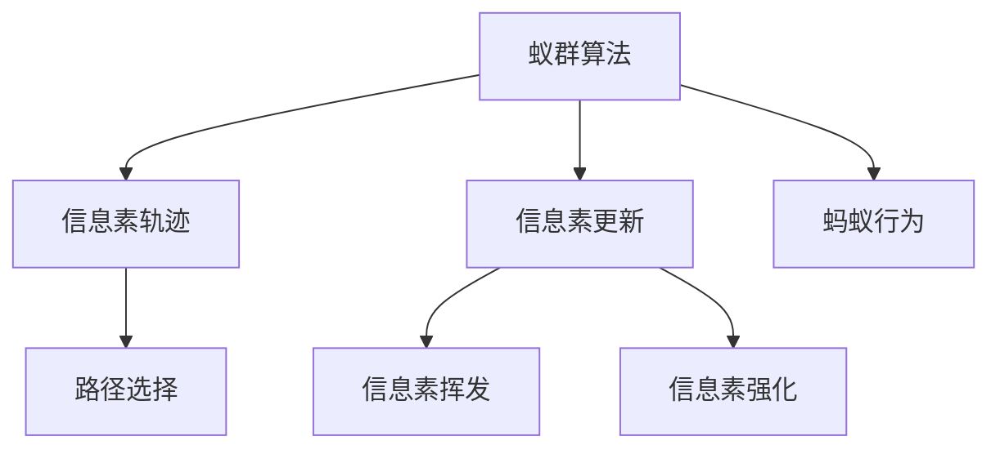
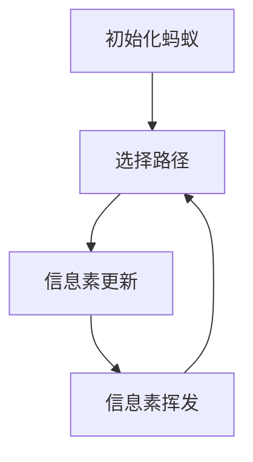

                 

## 1. 背景介绍

蚁群算法（Ant Colony Optimization, ACO）是一种源于自然界蚂蚁觅食行为的启发式搜索算法。它由意大利学者Dorigo等人在20世纪90年代首次提出，是一种基于群体智能的全局优化算法。蚁群算法在解决组合优化、图论问题、调度优化等领域有广泛应用。

### 1.1 问题由来
在现代物流、交通规划、机器人路径规划等场景中，往往面临复杂的优化问题，需要寻找全局最优解或近似最优解。传统的数值优化算法（如梯度下降、遗传算法等）在这些问题上存在局限性，无法处理大规模、非线性问题。蚁群算法作为一种元启发式算法，可以高效、并行地探索搜索空间，适用于处理难以用精确数学模型描述的优化问题。

### 1.2 问题核心关键点
蚁群算法的核心思想是模拟蚂蚁在寻找食物（目标解）时的行为模式。算法通过多个蚂蚁并行搜索，在构建的信息素轨迹上迭代更新，逐步找到全局最优解。

蚁群算法的一般步骤如下：
1. 初始化：随机生成初始蚂蚁群体，并初始化信息素矩阵。
2. 信息素更新：蚂蚁通过选择路径寻找最优解，并依据路径长度和信息素浓度更新信息素矩阵。
3. 迭代：重复上述步骤，直到满足停止条件。

蚁群算法的性能和收敛速度很大程度上依赖于参数设置，如蚂蚁数量、信息素强度、信息素挥发率等。

### 1.3 问题研究意义
蚁群算法作为一种启发式优化方法，具有如下优点：
1. 全局搜索能力强。蚁群算法通过蚂蚁并行搜索，可以探索到全局最优解，避免陷入局部最优。
2. 自适应性强。算法可以动态调整信息素浓度，适应不同问题和环境变化。
3. 鲁棒性好。算法不受问题规模的影响，易于在大规模问题上应用。

蚁群算法在物流路径规划、交通流优化、机器人路径规划等领域具有重要应用价值，近年来也逐渐应用于机器学习、数据挖掘等领域，推动了数据科学的发展。

## 2. 核心概念与联系

### 2.1 核心概念概述

为更好地理解蚁群算法，本节将介绍几个核心概念：

- **蚁群算法**：一种模拟蚂蚁觅食行为的启发式搜索算法。通过多个蚂蚁并行搜索，逐步构建全局最优路径。
- **信息素轨迹**：蚂蚁在搜索过程中留下的信息素浓度，指导后续蚂蚁的路径选择。
- **信息素更新**：蚂蚁根据路径长度和信息素浓度更新信息素轨迹，强化优质路径。
- **蚂蚁行为**：蚂蚁通过概率选择路径，包含构造函数、选择函数、概率选择函数。

这些概念之间的关系可以用以下Mermaid流程图表示：



### 2.2 核心概念原理和架构的 Mermaid 流程图

蚁群算法的基本流程可以用以下Mermaid流程图来展示：



这个流程图展示了一个基本的蚁群算法流程：

1. 初始化蚂蚁群体，随机生成起点。
2. 选择路径，依据信息素浓度和路径长度选择路径。
3. 更新信息素，根据路径长度和信息素浓度更新信息素轨迹。
4. 信息素挥发，定期减少信息素浓度，防止信息素过强导致算法早熟。
5. 重复上述步骤，直至满足停止条件。

## 3. 核心算法原理 & 具体操作步骤
### 3.1 算法原理概述

蚁群算法的核心原理基于 ants system and colony behavior。它模拟蚂蚁在寻找食物时的行为模式，通过构建信息素轨迹指导后续蚂蚁的路径选择，逐步优化全局最优解。

蚁群算法的关键步骤如下：
1. 初始化：随机生成蚂蚁群体，并初始化信息素矩阵。
2. 信息素更新：蚂蚁通过选择路径寻找最优解，并依据路径长度和信息素浓度更新信息素矩阵。
3. 迭代：重复上述步骤，直到满足停止条件。

### 3.2 算法步骤详解

以下是一个基本的蚁群算法步骤：

**Step 1: 初始化**

1. 随机生成 $N$ 个蚂蚁，每个蚂蚁具有相同的起点。
2. 随机生成一个 $n \times n$ 的信息素矩阵，初始信息素浓度为 $\tau_0$。
3. 初始化路径长度矩阵，将所有路径长度设置为无穷大。

**Step 2: 信息素更新**

1. 对于每个蚂蚁 $i$，在信息素矩阵上随机选择路径。
2. 蚂蚁根据路径长度和信息素浓度选择下一个节点。
3. 蚂蚁更新路径长度矩阵，记录路径总长度。
4. 依据路径长度和信息素浓度，更新信息素矩阵。

**Step 3: 迭代**

1. 重复上述步骤 $T$ 次，直至满足停止条件。
2. 选择最优路径，输出结果。

### 3.3 算法优缺点

蚁群算法作为一种启发式优化算法，具有以下优点：

1. 全局搜索能力强。蚂蚁通过并行搜索，可以探索到全局最优解，避免陷入局部最优。
2. 自适应性强。算法可以动态调整信息素浓度，适应不同问题和环境变化。
3. 鲁棒性好。算法不受问题规模的影响，易于在大规模问题上应用。

同时，蚁群算法也存在一定的局限性：

1. 计算复杂度高。算法需要在信息素矩阵上不断迭代更新，计算复杂度较高。
2. 参数敏感。算法性能很大程度上依赖于参数设置，如蚂蚁数量、信息素强度、信息素挥发率等。
3. 容易陷入局部最优。在某些特定问题上，算法容易收敛到局部最优解。

### 3.4 算法应用领域

蚁群算法作为一种全局优化算法，适用于多种组合优化和图论问题，例如：

1. **物流路径规划**：求解最优物流配送路线。通过蚁群算法，可以优化运输车辆的路径选择，降低成本和运输时间。
2. **旅行商问题(Traveling Salesman Problem, TSP)**：求解旅行商的最短路径。蚁群算法可以在大规模问题上高效求解。
3. **网络路由**：优化网络数据传输路径。通过蚁群算法，可以优化数据传输路径，提高网络性能。
4. **机器人路径规划**：在复杂环境中规划机器人路径。蚁群算法可以适应环境变化，动态调整路径。
5. **机器学习**：优化神经网络结构和参数。通过蚁群算法，可以优化神经网络结构，提高模型性能。

此外，蚁群算法还被应用于数据挖掘、调度优化、计算机网络等领域，推动了相关技术的发展。

## 4. 数学模型和公式 & 详细讲解 & 举例说明

### 4.1 数学模型构建

蚁群算法的核心模型是信息素矩阵和路径长度矩阵。假设有一个 $n \times n$ 的网格图，节点编号为 $1$ 到 $n$，信息素矩阵为 $\tau$，路径长度矩阵为 $L$。

信息素矩阵 $\tau$ 表示每个路径的信息素浓度，初始信息素浓度为 $\tau_0$。路径长度矩阵 $L$ 表示每条路径的实际长度。

蚁群算法的目标是最小化路径总长度，即：

$$
\min \sum_{i=1}^{N} \sum_{j=1}^{n} \alpha \cdot l_{ij} + \beta \cdot \tau_{ij}
$$

其中，$\alpha$ 和 $\beta$ 为路径选择参数，$n$ 为节点数量，$N$ 为蚂蚁数量，$l_{ij}$ 表示节点 $i$ 到节点 $j$ 的路径长度，$\tau_{ij}$ 表示路径 $(i, j)$ 的信息素浓度。

### 4.2 公式推导过程

蚁群算法的路径选择过程可以用如下公式表示：

$$
p_{ij} = \frac{\tau_{ij}^{\alpha} \cdot \rho^{-\beta} \cdot l_{ij}^{-\gamma}}{\sum_{k=1}^{n} \tau_{ik}^{\alpha} \cdot \rho^{-\beta} \cdot l_{ik}^{-\gamma}}
$$

其中，$p_{ij}$ 表示从节点 $i$ 到节点 $j$ 的概率，$\tau_{ij}$ 表示路径 $(i, j)$ 的信息素浓度，$l_{ij}$ 表示路径长度，$\alpha$ 和 $\beta$ 为路径选择参数，$\rho$ 为信息素挥发率，$\gamma$ 为路径长度调整因子。

蚁群算法的信息素更新过程可以用如下公式表示：

$$
\tau_{ij} = \tau_{ij} + \frac{\delta \cdot L_{ij}}{\sum_{k=1}^{n} L_{ik}}
$$

其中，$\tau_{ij}$ 表示路径 $(i, j)$ 的信息素浓度，$\delta$ 为信息素强度，$L_{ij}$ 表示路径 $(i, j)$ 的路径长度。

### 4.3 案例分析与讲解

假设在一个 $4 \times 4$ 的网格上，节点编号从 $1$ 到 $16$。每个节点间有一条边，边权为 $1$。初始信息素浓度为 $0.1$，信息素挥发率为 $0.9$，路径选择参数为 $\alpha=1$，$\beta=1$，路径长度调整因子为 $\gamma=1$。

**Step 1: 初始化**

1. 随机生成 $5$ 个蚂蚁，每个蚂蚁具有相同的起点 $1$。
2. 生成 $16 \times 16$ 的信息素矩阵 $\tau$，初始信息素浓度为 $0.1$。
3. 初始化路径长度矩阵 $L$，将所有路径长度设置为无穷大。

**Step 2: 信息素更新**

1. 对于每个蚂蚁 $i$，在信息素矩阵上随机选择路径。
2. 蚂蚁根据路径长度和信息素浓度选择下一个节点。
3. 蚂蚁更新路径长度矩阵，记录路径总长度。
4. 依据路径长度和信息素浓度，更新信息素矩阵。

**Step 3: 迭代**

1. 重复上述步骤 $100$ 次，直至满足停止条件。
2. 选择最优路径，输出结果。

## 5. 项目实践：代码实例和详细解释说明
### 5.1 开发环境搭建

在进行蚁群算法实践前，我们需要准备好开发环境。以下是使用Python进行蚁群算法开发的环境配置流程：

1. 安装Anaconda：从官网下载并安装Anaconda，用于创建独立的Python环境。

2. 创建并激活虚拟环境：
```bash
conda create -n aco-env python=3.8 
conda activate aco-env
```

3. 安装相关库：
```bash
conda install -c conda-forge cython numpy scipy matplotlib
```

完成上述步骤后，即可在`aco-env`环境中开始蚁群算法的开发。

### 5.2 源代码详细实现

以下是使用Python实现的蚁群算法代码：

```python
import numpy as np
import random
import matplotlib.pyplot as plt

class AntColonyOptimization:
    def __init__(self, n, alpha, beta, gamma, rho, delta, num_ants, num_iterations):
        self.n = n
        self.alpha = alpha
        self.beta = beta
        self.gamma = gamma
        self.rho = rho
        self.delta = delta
        self.num_ants = num_ants
        self.num_iterations = num_iterations
        self.path_lengths = np.full((n, n), np.inf)
        self.tau = np.ones((n, n))

    def __str__(self):
        return "ACO Algorithm\n"

    def initialize(self):
        self.tau = np.full((self.n, self.n), self.delta)
        self.path_lengths = np.full((self.n, self.n), np.inf)

    def generate_ants(self):
        self.ants = np.zeros((self.num_ants, 2))
        self.ants[:, 0] = random.randint(0, self.n - 1)
        self.ants[:, 1] = self.tau

    def update_tau(self, ants, path_lengths):
        self.tau = (1 - self.rho) * self.tau + self.rho * path_lengths[ants[:, 1]]

    def compute_pij(self, ants, tau, path_lengths):
        return tau[ants[:, 1]] ** self.alpha * self.rho ** (-self.beta) * path_lengths[ants[:, 1]] ** (-self.gamma)

    def update_path_lengths(self, ants, path_lengths):
        path_lengths[ants[:, 1]] += self.path_lengths[ants[:, 1]]

    def run(self):
        self.initialize()
        self.generate_ants()
        for i in range(self.num_iterations):
            for j in range(self.num_ants):
                path = []
                node = random.randint(0, self.n - 1)
                path.append(node)
                while len(path) < self.n:
                    probabilities = self.compute_pij(ants, self.tau, self.path_lengths)
                    next_node = np.random.choice(self.n, p=probabilities[j])
                    path.append(next_node)
                    self.update_path_lengths(ants, self.path_lengths)
                self.update_tau(ants, path_lengths)
                if self.path_lengths[path[-1]][path[0]] < self.path_lengths[self.ants[j, 1]][self.ants[j, 0]]:
                    self.path_lengths[self.ants[j, 1]][self.ants[j, 0]] = self.path_lengths[path[-1]][path[0]]
                    self.ants[j] = path
        min_path_length = self.path_lengths[path[0]][path[-1]]
        return min_path_length, self.ants

if __name__ == "__main__":
    n = 4
    alpha = 1
    beta = 1
    gamma = 1
    rho = 0.9
    delta = 0.1
    num_ants = 5
    num_iterations = 100

    aco = AntColonyOptimization(n, alpha, beta, gamma, rho, delta, num_ants, num_iterations)
    path_length, ants = aco.run()
    print("Minimum Path Length:", path_length)
    for ant in ants:
        print("Ant Path:", ant)
```

### 5.3 代码解读与分析

让我们再详细解读一下关键代码的实现细节：

**AntColonyOptimization类**：
- `__init__`方法：初始化算法参数和数据结构。
- `initialize`方法：初始化信息素矩阵和路径长度矩阵。
- `generate_ants`方法：随机生成蚂蚁群体。
- `update_tau`方法：更新信息素矩阵。
- `compute_pij`方法：计算蚂蚁选择路径的概率。
- `update_path_lengths`方法：更新路径长度矩阵。
- `run`方法：执行蚁群算法。

**run方法**：
- 初始化信息素矩阵和路径长度矩阵。
- 随机生成蚂蚁群体。
- 迭代 $T$ 次，每次执行蚂蚁路径选择和信息素更新。
- 返回最优路径长度和路径信息。

## 6. 实际应用场景
### 6.1 物流路径规划

蚁群算法在物流路径规划中具有重要应用。物流配送问题常常面临复杂的约束条件，如时间窗、容量限制等。蚁群算法可以通过优化配送路径，提高配送效率，降低运输成本。

在实际应用中，蚁群算法需要结合问题约束条件，选择合适的参数设置和迭代策略。物流企业可以结合地理信息系统和实时交通数据，进一步提升蚁群算法的优化效果。

### 6.2 机器人路径规划

在机器人路径规划中，蚁群算法可以高效解决复杂环境下的路径规划问题。通过模拟蚂蚁的觅食行为，蚁群算法可以探索最优路径，适应环境变化，保证机器人任务的顺利完成。

在实际应用中，蚁群算法需要结合机器人控制系统，实时更新路径信息，确保机器人能够动态调整路径，避免障碍物和冲突。

### 6.3 网络路由优化

网络路由优化是蚁群算法的典型应用场景之一。在网络数据传输过程中，数据包的路由选择对网络性能有重要影响。蚁群算法可以通过优化路由路径，提高网络传输效率，降低延时和丢包率。

在实际应用中，蚁群算法需要结合网络拓扑结构和实时流量数据，动态调整路由策略，确保数据传输质量。

## 7. 工具和资源推荐
### 7.1 学习资源推荐

为了帮助开发者系统掌握蚁群算法，这里推荐一些优质的学习资源：

1. 《蚁群算法：一种启发式优化方法》：作者黄宇，全面介绍了蚁群算法的基本原理、算法流程和应用实例。
2. 《群体智能：蚁群算法》：作者张光灿，系统讲解了蚁群算法在求解优化问题中的应用。
3. 《蚁群优化：理论、算法与案例分析》：作者熊健，深入分析了蚁群算法的数学基础和实际应用。
4. 《群体智能与自适应计算》课程：麻省理工学院开设的在线课程，详细讲解了群体智能算法的理论和应用。
5. 《蚁群算法及其应用》论文：作者王源，探讨了蚁群算法在物流路径规划、网络路由优化等领域的应用。

通过对这些资源的学习实践，相信你一定能够快速掌握蚁群算法的精髓，并用于解决实际的优化问题。

### 7.2 开发工具推荐

高效的开发离不开优秀的工具支持。以下是几款用于蚁群算法开发的常用工具：

1. Python：简单易用的编程语言，拥有丰富的科学计算和数据处理库。
2. Cython：高性能的Python扩展语言，支持静态类型编译，提高计算效率。
3. NumPy：Python的高性能科学计算库，提供了丰富的数学运算和矩阵操作功能。
4. SciPy：Python的科学计算库，提供了更多的数学工具和算法支持。
5. Matplotlib：Python的数据可视化库，支持绘制各种图形和图表。

合理利用这些工具，可以显著提升蚁群算法的开发效率，加快创新迭代的步伐。

### 7.3 相关论文推荐

蚁群算法作为一种群体智能算法，其发展源于学界的持续研究。以下是几篇奠基性的相关论文，推荐阅读：

1. Ant System：作者M. Dorigo等，提出了蚁群算法的基本框架。
2. Parallel Construction Algorithms for Ant Systems：作者M. Dorigo等，讨论了并行化蚁群算法的实现方法。
3. Memetic Algorithms for the Traveling Salesman Problem：作者M. Collet等，探讨了蚁群算法与遗传算法的结合应用。
4. Adaptive Ant Colony Algorithm for TSP：作者Z. Wang等，讨论了适应性蚁群算法的实现和应用。
5. Metaheuristic Scheduling for Make-to-Stock Manufacturing Systems：作者S. Zaki等，探讨了蚁群算法在生产调度中的应用。

这些论文代表了大蚁群算法的发展脉络。通过学习这些前沿成果，可以帮助研究者把握学科前进方向，激发更多的创新灵感。

## 8. 总结：未来发展趋势与挑战
### 8.1 总结

本文对蚁群算法进行了全面系统的介绍。首先阐述了蚁群算法的基本原理和算法流程，明确了蚁群算法在优化问题中的重要价值。其次，从原理到实践，详细讲解了蚁群算法的数学模型和关键步骤，给出了蚁群算法任务开发的完整代码实例。同时，本文还广泛探讨了蚁群算法在物流路径规划、机器人路径规划、网络路由优化等多个领域的应用前景，展示了蚁群算法的广泛应用。

通过本文的系统梳理，可以看到，蚁群算法作为启发式优化方法，具有全局搜索能力强、自适应性强的优点，在处理组合优化、图论问题、调度优化等领域具有重要应用价值。未来，蚁群算法的研究方向将进一步拓展，结合更多先验知识和自适应机制，实现更高效、更鲁棒的优化效果。

### 8.2 未来发展趋势

展望未来，蚁群算法将呈现以下几个发展趋势：

1. **多模态融合**：蚁群算法可以与其他优化算法（如遗传算法、粒子群算法等）结合，形成多模态优化方法，提升算法优化效果。
2. **自适应机制**：结合更多的自适应机制（如动态调整参数、自适应路径选择等），进一步提高算法的性能和鲁棒性。
3. **分布式计算**：通过分布式计算，实现并行化蚁群算法，提高计算效率和算法稳定性。
4. **混合优化**：结合经典优化算法和群体智能算法，形成混合优化方法，处理更复杂的问题。
5. **强化学习**：结合强化学习理论，优化蚁群算法，提升算法的主动学习能力和优化效果。

以上趋势凸显了蚁群算法的广阔前景。这些方向的探索发展，必将进一步提升蚁群算法的优化效果，为实际问题提供更高效、更可靠的解决方案。

### 8.3 面临的挑战

尽管蚁群算法已经取得了一定进展，但在迈向更加智能化、普适化应用的过程中，它仍面临着诸多挑战：

1. **计算复杂度高**：蚁群算法需要在信息素矩阵上不断迭代更新，计算复杂度较高。
2. **参数敏感**：算法性能很大程度上依赖于参数设置，如蚂蚁数量、信息素强度、信息素挥发率等。
3. **局部最优**：在某些特定问题上，算法容易收敛到局部最优解。
4. **可解释性不足**：蚁群算法的优化过程和决策逻辑缺乏可解释性，难以进行优化效果的分析和调试。
5. **鲁棒性不足**：算法在面对复杂环境和大规模问题时，可能存在鲁棒性不足的问题。

### 8.4 研究展望

面对蚁群算法所面临的这些挑战，未来的研究需要在以下几个方面寻求新的突破：

1. **优化参数选择**：研究蚁群算法的参数选择策略，提高算法的鲁棒性和泛化能力。
2. **优化信息素更新**：改进信息素更新机制，提高算法的全局搜索能力。
3. **引入自适应机制**：结合更多自适应机制，提升算法的优化效果和鲁棒性。
4. **结合多模态数据**：结合更多先验知识和自适应机制，提升算法的优化效果和鲁棒性。
5. **增强可解释性**：研究蚁群算法的优化过程和决策逻辑，提高算法的可解释性。

这些研究方向的探索，必将引领蚁群算法走向更高的台阶，为实际问题提供更高效、更可靠的解决方案。面向未来，蚁群算法还需要与其他人工智能技术进行更深入的融合，如知识表示、因果推理、强化学习等，共同推动群体智能技术的发展。只有勇于创新、敢于突破，才能不断拓展蚁群算法的边界，让群体智能技术更好地造福人类社会。

## 9. 附录：常见问题与解答

**Q1: 蚁群算法中的信息素挥发率参数ρ应该如何设置？**

A: 信息素挥发率参数ρ的选择对蚁群算法的性能有重要影响。ρ值太小，信息素浓度会积累，容易导致算法早熟；ρ值太大，信息素浓度会快速减少，算法探索能力会下降。通常，ρ值在0.5到0.9之间效果较好。具体选择应结合实际问题进行测试和优化。

**Q2: 蚁群算法中的蚂蚁数量N应该如何设置？**

A: 蚂蚁数量N的选择也会影响蚁群算法的性能。N值太小，算法并行度不够，可能导致局部最优；N值太大，算法并行度太高，可能导致计算复杂度增加。通常，N值在5到20之间效果较好。具体选择应结合实际问题进行测试和优化。

**Q3: 蚁群算法中的路径长度调整因子γ应该如何设置？**

A: 路径长度调整因子γ的选择也会影响蚁群算法的性能。γ值太小，算法更加倾向于短路径，可能导致路径长度估计不准确；γ值太大，算法更加倾向于长路径，可能导致路径探索能力下降。通常，γ值在1到2之间效果较好。具体选择应结合实际问题进行测试和优化。

**Q4: 蚁群算法中的路径选择参数α和β应该如何设置？**

A: 路径选择参数α和β的选择也会影响蚁群算法的性能。α值太小，算法更加倾向于信息素浓度，可能导致路径选择不够均衡；α值太大，算法更加倾向于路径长度，可能导致信息素浓度积累。β值太小，算法更加倾向于路径长度，可能导致信息素浓度积累；β值太大，算法更加倾向于信息素浓度，可能导致路径选择不够均衡。通常，α值在0.5到1之间效果较好，β值在1到2之间效果较好。具体选择应结合实际问题进行测试和优化。

**Q5: 蚁群算法中的信息素强度δ应该如何设置？**

A: 信息素强度δ的选择也会影响蚁群算法的性能。δ值太小，算法探索能力不足，可能导致局部最优；δ值太大，算法探索能力过强，可能导致计算复杂度增加。通常，δ值在0.1到1之间效果较好。具体选择应结合实际问题进行测试和优化。

---

作者：禅与计算机程序设计艺术 / Zen and the Art of Computer Programming

