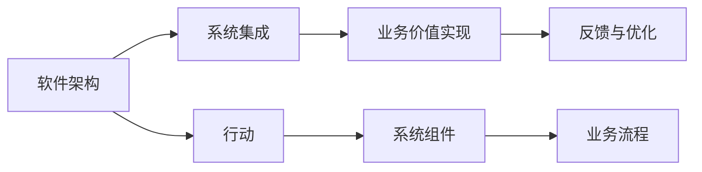

                 

# 行动体系:落地执行的保障

在现代软件开发和系统部署的语境中，落地执行（Delivery）不仅仅是交付一个代码库或者一个软件应用，它更关乎于如何将软件技术转化为可被广泛接受、可持续运营和持续改进的业务价值。行动体系(Agent System)提供了一套系统化的方法，帮助团队和组织确保软件开发项目的成功落地执行。本文将深入探讨行动体系的核心概念、关键原理和具体操作步骤，以及其在游戏、物联网、区块链等领域的实际应用场景和未来展望。

## 1. 背景介绍

### 1.1 问题由来
随着软件技术的快速发展，软件工程已经从简单的编码、调试、测试，演变成了一个包含架构设计、系统集成、用户需求响应等多环节的综合工程。对于大型软件项目和复杂系统，如何确保其成功落地执行成为越来越大的挑战。

在过去的几年中，DevOps文化兴起，强调了代码持续集成（CI）、持续部署（CD）的重要性，但从系统工程的角度来看，DevOps只是行动体系中的一部分，它强调了软件交付和部署的自动化，但并没有解决如何将系统集成到业务流程中，并在实际业务场景中产生价值的问题。

### 1.2 问题核心关键点
行动体系强调了技术交付与业务价值实现之间的桥梁，即如何将软件系统的各个组件有效地组织起来，确保它们能与现有的业务流程和组织架构无缝集成，并在实际应用中产生业务价值。核心关键点包括：

1. **软件架构设计**：如何设计一个能够支持复杂业务需求的软件架构，确保系统的可扩展性、可维护性和可重用性。
2. **系统集成与部署**：如何将系统集成到现有的业务流程和组织架构中，确保系统的可靠性和稳定性。
3. **业务价值实现**：如何通过软件系统在实际业务场景中产生具体的业务价值，实现系统目标与业务目标的一致性。

## 2. 核心概念与联系

### 2.1 核心概念概述

行动体系是一个涵盖软件架构、系统集成和业务价值实现的系统化方法。它包含以下核心概念：

- **软件架构**：用于设计可扩展、可维护和可重用的系统组件的蓝图。
- **系统集成**：将系统组件组装成能够满足特定业务需求的软件系统。
- **业务价值实现**：通过软件系统在实际业务场景中实现预期的业务目标。
- **行动**：行动体系中的核心单位，即能够对特定任务负责的软件组件，行动体系强调将复杂的系统分解为多个可操作的行动。

### 2.2 核心概念原理和架构的 Mermaid 流程图



这个流程图展示了行动体系的核心架构：软件架构定义了系统的基础组件和架构；系统集成将这些组件组装成完整的应用系统；业务价值实现保证了系统在实际业务场景中的价值；行动体系通过行动将系统的各个部分连接起来，确保每个部分都与业务流程紧密结合。反馈与优化确保系统能够根据业务需求的变化进行持续改进。

## 3. 核心算法原理 & 具体操作步骤

### 3.1 算法原理概述
行动体系的核心算法原理建立在软件架构、系统集成和业务价值实现的协同工作之上。其核心思想是通过定义和组织行动，将复杂的软件系统分解为可操作的子任务，确保每个子任务都能与业务需求紧密结合，从而实现系统的整体目标。

行动体系中的关键算法包括：

1. **行动定义**：定义每个行动的目标、输入、输出和执行策略。
2. **行动编排**：将行动组合成工作流，确保它们按照业务需求顺序执行。
3. **业务流程建模**：通过业务流程图等工具，描述系统在实际业务场景中的流程。
4. **反馈与优化**：通过监控和评估系统的表现，根据业务需求的变化进行调整和优化。

### 3.2 算法步骤详解
行动体系的具体操作步骤包括以下几个关键环节：

**Step 1: 定义软件架构**
- 分析业务需求，确定系统的核心组件和功能模块。
- 选择合适的技术栈和设计模式，设计系统的架构。

**Step 2: 设计行动**
- 定义每个行动的目标、输入、输出和执行策略。
- 确定行动之间的依赖关系和数据流。

**Step 3: 系统集成**
- 将行动组装成工作流，确保每个行动都能与业务流程紧密结合。
- 进行系统测试和部署，确保系统的可靠性和稳定性。

**Step 4: 业务价值实现**
- 通过业务流程图等工具，描述系统在实际业务场景中的流程。
- 根据业务需求的变化，调整和优化系统。

**Step 5: 反馈与优化**
- 通过监控和评估系统的表现，收集业务反馈。
- 根据反馈，进行系统的持续改进和优化。

### 3.3 算法优缺点
行动体系作为一种系统化的软件开发方法，具有以下优点：

- **系统化思考**：通过分解系统为可操作的行动，使得团队能够系统化地思考和解决问题。
- **业务集成**：确保系统能够与现有的业务流程和组织架构无缝集成，实现业务价值的最大化。
- **持续改进**：通过反馈与优化机制，持续改进系统，确保其适应不断变化的需求。

同时，行动体系也存在以下缺点：

- **复杂度高**：定义和组织行动的过程可能比较复杂，需要团队具备较高的技术水平和系统思维能力。
- **初期投入大**：定义和设计行动体系可能需要较大的初期投入。

### 3.4 算法应用领域
行动体系广泛应用于以下领域：

- **游戏开发**：通过定义和组织行动，确保游戏的各个组件能够无缝集成，提升游戏的可扩展性和可维护性。
- **物联网(IoT)**：通过定义和组织行动，确保物联网系统的各个组件能够与实际业务场景紧密结合，实现业务价值的最大化。
- **区块链**：通过定义和组织行动，确保区块链系统的各个组件能够与现有的业务流程和组织架构无缝集成，实现区块链技术在金融、供应链等领域的应用。

## 4. 数学模型和公式 & 详细讲解 & 举例说明

### 4.1 数学模型构建
行动体系的数学模型构建基于系统架构、行动定义和业务价值实现的多重约束条件。模型构建的目标是找到一个最优的行动组合，使得系统能够在满足业务需求的同时，最大化业务价值。

### 4.2 公式推导过程
假设系统由 $N$ 个行动组成，每个行动 $A_i$ 的目标是最大化其业务价值 $V_i$，同时满足业务需求约束 $C_j$ 和系统架构约束 $S_k$。通过构建优化模型，求解最优的行动组合：

$$
\begin{aligned}
& \max_{A_i} \sum_{i=1}^N V_i \\
& \text{s.t.} \\
& C_j \leq V_i \quad j=1,\ldots,N \\
& S_k \leq V_i \quad k=1,\ldots,N
\end{aligned}
$$

### 4.3 案例分析与讲解
以一个简单的电商系统为例，系统包括用户注册、商品管理、订单处理等多个行动。通过定义和组织这些行动，确保它们能够无缝集成，提升系统的可扩展性和可维护性，同时实现系统的业务价值。

假设系统目标是在特定时间窗口内，最大化销售额 $V_1$ 和用户增长率 $V_2$。用户注册行动 $A_1$ 的目标是最大化用户增长率 $V_2$，同时满足系统架构约束 $S_1$，即在用户数据安全方面不出现任何问题。商品管理行动 $A_2$ 的目标是最大化销售额 $V_1$，同时满足系统架构约束 $S_2$，即商品数据更新及时准确。订单处理行动 $A_3$ 的目标是最大化销售额 $V_1$ 和用户满意度 $V_3$，同时满足系统架构约束 $S_3$，即订单处理效率高且用户反馈良好。

通过定义和组织这些行动，并根据实际情况调整和优化，系统可以最大化实现其业务价值。

## 5. 项目实践：代码实例和详细解释说明

### 5.1 开发环境搭建
在行动体系中，开发环境搭建是关键的一环。以下是使用Python和Django框架搭建电商系统的示例。

1. 安装Python和Django。
2. 创建虚拟环境。
3. 安装相关依赖包。
4. 配置数据库。

### 5.2 源代码详细实现
以下是电商系统的核心代码实现，包括用户注册、商品管理、订单处理等行动的定义和组织。

```python
# 用户注册行动
class RegisterAction:
    def __init__(self):
        self.name = '用户注册'
        self.target = '最大化用户增长率'
        self.input = {}
        self.output = {}
        self.constraints = {'S_1': {'condition': '用户数据安全'}}

    def execute(self):
        # 实现用户注册逻辑
        pass

# 商品管理行动
class ManageGoodsAction:
    def __init__(self):
        self.name = '商品管理'
        self.target = '最大化销售额'
        self.input = {}
        self.output = {}
        self.constraints = {'S_2': {'condition': '商品数据更新及时准确'}}

    def execute(self):
        # 实现商品管理逻辑
        pass

# 订单处理行动
class HandleOrdersAction:
    def __init__(self):
        self.name = '订单处理'
        self.target = '最大化销售额和用户满意度'
        self.input = {}
        self.output = {}
        self.constraints = {'S_3': {'condition': '订单处理效率高且用户反馈良好'}}

    def execute(self):
        # 实现订单处理逻辑
        pass
```

### 5.3 代码解读与分析
代码中定义了三个行动，每个行动都包含了其名称、目标、输入、输出和约束条件。每个行动的执行逻辑都需要实现，并且需要满足其约束条件。这些行动通过组合形成了电商系统的完整流程。

### 5.4 运行结果展示
运行上述代码，可以验证系统的整体流程是否按照预期执行。可以通过监控系统的关键指标，评估系统的表现，并进行持续优化。

## 6. 实际应用场景

### 6.1 游戏开发
在游戏开发中，行动体系帮助团队将复杂的系统分解为可操作的子任务，确保游戏的各个组件能够无缝集成，提升游戏的可扩展性和可维护性。

以《堡垒之夜》为例，游戏系统由数百万行代码和数百个系统组成。通过定义和组织行动，团队能够系统化地思考和解决问题，确保游戏在各个平台上的流畅运行和用户满意度。

### 6.2 物联网(IoT)
在物联网领域，行动体系通过定义和组织行动，确保物联网系统的各个组件能够与实际业务场景紧密结合，实现业务价值的最大化。

以智能家居为例，系统包括传感器、控制器、云平台等多个组件。通过定义和组织这些行动，确保它们能够无缝集成，实现智能家居系统的稳定性和可靠性。

### 6.3 区块链
在区块链领域，行动体系通过定义和组织行动，确保区块链系统的各个组件能够与现有的业务流程和组织架构无缝集成，实现区块链技术在金融、供应链等领域的应用。

以智能合约为例，系统包括合约编写、合约部署、合约执行等多个行动。通过定义和组织这些行动，确保它们能够无缝集成，实现智能合约的可靠性和安全性。

## 7. 工具和资源推荐

### 7.1 学习资源推荐

1. **《软件开发之美：行动体系》系列博文**：由行动体系专家撰写，深入浅出地介绍了行动体系的原理和应用。
2. **《系统架构设计》课程**：涵盖系统架构设计的基本原则和方法，是行动体系学习的基础。
3. **《行动体系实战》书籍**：介绍行动体系在实际项目中的应用案例和实践经验。
4. **HuggingFace博客**：分享行动体系在自然语言处理中的应用，提供丰富的案例和实践指南。
5. **Unreal Engine文档**：提供游戏开发中行动体系的应用示例，适合游戏开发人员学习。

### 7.2 开发工具推荐

1. **Git**：版本控制系统，支持协作开发。
2. **Jira**：项目管理和跟踪工具，支持行动体系的行动定义和任务跟踪。
3. **Docker**：容器化技术，支持行动体系的持续集成和部署。
4. **Kubernetes**：容器编排工具，支持行动体系的自动扩展和优化。
5. **Postman**：API测试工具，支持行动体系的接口设计和测试。

### 7.3 相关论文推荐

1. **《行动体系：构建可扩展、可维护的软件系统》**：介绍行动体系的基本概念和方法。
2. **《行动体系在物联网系统中的应用》**：介绍行动体系在物联网系统中的具体应用和实现。
3. **《行动体系在区块链系统中的应用》**：介绍行动体系在区块链系统中的具体应用和实现。

## 8. 总结：未来发展趋势与挑战

### 8.1 总结

本文对行动体系进行了全面的介绍，包括其核心概念、关键原理和具体操作步骤。行动体系强调通过定义和组织行动，将复杂的软件系统分解为可操作的子任务，确保每个子任务都能与业务需求紧密结合，从而实现系统的整体目标。

通过本文的系统梳理，可以看到，行动体系为软件开发和系统部署提供了一套系统化的方法，有助于团队和组织确保软件开发项目的成功落地执行。未来，随着行动体系技术的不断成熟，它将在更多的行业领域得到应用，为系统工程实践带来新的突破。

### 8.2 未来发展趋势

行动体系的未来发展趋势包括以下几个方面：

1. **自动化水平提升**：通过自动化工具和框架，进一步提升行动体系的自动化水平，减少人工干预。
2. **数据驱动优化**：通过引入数据驱动的优化方法，提升行动体系对业务需求的响应速度和准确性。
3. **跨平台支持**：通过支持多种平台和环境，提升行动体系的可移植性和可扩展性。
4. **人工智能融合**：通过引入人工智能技术，如自然语言处理、计算机视觉等，提升行动体系的智能化水平。

### 8.3 面临的挑战

尽管行动体系已经取得了不少成功，但在实践中仍面临一些挑战：

1. **复杂性管理**：行动体系的复杂性管理仍然是挑战之一，如何系统化地分解和组织行动，需要更多的实践经验和工具支持。
2. **技术栈选择**：行动体系的技术栈选择需谨慎，需要综合考虑系统的需求、团队的技术能力和可用工具。
3. **持续改进**：行动体系需要持续改进和优化，以适应不断变化的需求和业务场景。

### 8.4 研究展望

行动体系的未来研究将在以下几个方向寻求新的突破：

1. **模型优化**：通过优化模型和算法，提升行动体系在复杂系统中的应用效果。
2. **智能化升级**：通过引入智能化技术，如人工智能、机器学习等，提升行动体系的智能化水平。
3. **协作工具改进**：通过改进协作工具，提升行动体系的团队协作效率和效果。

## 9. 附录：常见问题与解答

**Q1：行动体系与DevOps的区别是什么？**

A: 行动体系和DevOps都是软件开发和系统部署的重要方法，但行动体系更强调系统的整体设计和业务价值的实现，而DevOps则更注重代码的持续集成和部署。行动体系可以看作是DevOps的一种高级形式，它通过系统的整体设计和业务价值的实现，确保系统在实际应用中产生价值。

**Q2：行动体系如何应对系统的复杂性？**

A: 行动体系通过将系统分解为可操作的行动，系统化地思考和解决问题，降低了系统的复杂性。同时，通过定义和组织行动，确保每个子任务都能与业务需求紧密结合，从而实现系统的整体目标。

**Q3：如何选择合适的行动体系工具？**

A: 选择合适的行动体系工具需要综合考虑系统的需求、团队的技术能力和可用工具。一般来说，可以选择一些已经成熟的工具，如Jira、Docker、Kubernetes等，同时也可以根据实际需求，自定义开发一些辅助工具。

**Q4：行动体系的应用范围有哪些？**

A: 行动体系广泛应用于软件开发、系统集成、业务价值实现等多个领域。除了游戏开发、物联网、区块链等领域，行动体系还可以应用于医疗、金融、教育等多个行业，帮助团队和组织确保项目成功落地执行。

**Q5：行动体系如何适应快速变化的需求？**

A: 行动体系通过持续改进和优化，能够适应快速变化的需求。通过收集业务反馈，不断调整和优化行动组合，确保系统能够持续适应变化的需求。

---

作者：禅与计算机程序设计艺术 / Zen and the Art of Computer Programming

