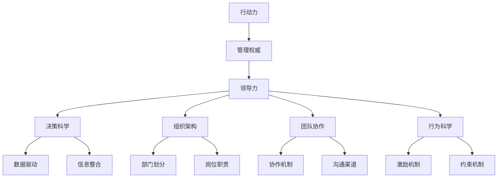

                 

# 行动力与管理权威的建立

> 关键词：行动力, 管理权威, 领导力, 决策科学, 组织架构, 行为科学

## 1. 背景介绍

### 1.1 问题由来

随着企业的快速发展，组织规模不断扩大，管理层在决策过程中面临的信息量和复杂性日益增加。如何提升管理层的行动力，增强决策的科学性和有效性，构建权威且高效的领导团队，成为现代企业管理的一项重要课题。传统的自上而下管理模式难以适应快速变化的市场环境，迫切需要引入新的管理理念和方法。

### 1.2 问题核心关键点

管理权威的建立需要基于科学的决策理论、有效的组织架构和团队协作机制。行动力是确保管理决策得以有效执行的核心要素，通过科学的方法提升管理层行动力，可以显著提高企业的市场响应速度和竞争力。

**核心关键点**包括：
- 决策科学：基于数据和信息的科学决策方法，确保决策的客观性和有效性。
- 组织架构：设计合理的组织结构，促进信息流通和资源配置的优化。
- 团队协作：通过有效的团队协作机制，激发团队成员的积极性和创造力。
- 行为科学：理解组织行为背后的心理学规律，制定科学的激励和约束机制。

### 1.3 问题研究意义

构建权威且高效的领导团队，是企业持续发展的基础。行动力和管理权威的建立，可以增强管理层的决策执行力，提升组织的运营效率和市场竞争力，为企业的长期健康发展提供有力保障。具体意义包括：

1. **提升决策质量**：科学的数据驱动决策方法，可有效减少决策失误，提高决策的科学性和准确性。
2. **优化资源配置**：合理的组织架构和资源配置机制，可以最大化利用企业资源，提升运营效率。
3. **增强团队凝聚力**：有效的团队协作机制和激励约束机制，可提升团队成员的工作积极性和创造力。
4. **应对市场变化**：快速响应市场变化，提升企业的市场适应能力和竞争力。

## 2. 核心概念与联系

### 2.1 核心概念概述

为更好地理解行动力与管理权威的建立，本节将介绍几个密切相关的核心概念：

- **行动力**：指管理层执行决策、推动企业发展的能力。行动力包括决策执行力、目标达成能力、问题解决能力等方面。
- **管理权威**：指管理层在企业中的地位和影响力。权威基于知识、经验和领导能力，能够有效影响和引导组织行为。
- **领导力**：指通过个人魅力和影响力，引领团队达成目标的能力。领导力包括愿景规划、激励团队、协调沟通等方面。
- **决策科学**：指基于数据和信息的决策方法，通过科学的方法提升决策的准确性和有效性。
- **组织架构**：指企业内部各个部门和岗位的设置及其相互关系，直接影响信息的流通和资源的配置。
- **团队协作**：指团队成员之间的协作机制和沟通方式，通过高效的协作机制提升团队绩效。
- **行为科学**：指研究个体和群体行为规律，制定科学的激励和约束机制，提升组织行为管理水平。

这些核心概念之间的逻辑关系可以通过以下Mermaid流程图来展示：



这个流程图展示了几大核心概念的相互关系：

1. 行动力是管理权威的基础。
2. 领导力是行动力和权威的核心，通过愿景规划和激励机制，引领团队达成目标。
3. 决策科学、组织架构、团队协作和行为科学，是行动力和权威的具体实现手段。
4. 数据驱动、信息整合、部门划分、岗位职责、协作机制、沟通渠道、激励约束机制等，是实现行动力和权威的关键要素。

## 3. 核心算法原理 & 具体操作步骤
### 3.1 算法原理概述

行动力和管理权威的建立，本质上是一个系统性的工程，需要综合运用科学的管理理论和实践方法。其核心思想是：通过科学的决策方法、合理的组织架构和团队协作机制，构建权威且高效的领导团队，确保决策执行力。

形式化地，假设管理层需要执行某项决策 $D$，则行动力 $\textit{Act}$ 可以表示为：

$$
\textit{Act} = \textit{DecisionQuality} \times \textit{ResourceAllocation} \times \textit{TeamPerformance} \times \textit{BehaviorManagement}
$$

其中，$\textit{DecisionQuality}$ 表示决策质量，$\textit{ResourceAllocation}$ 表示资源配置，$\textit{TeamPerformance}$ 表示团队绩效，$\textit{BehaviorManagement}$ 表示行为管理。

### 3.2 算法步骤详解

构建权威且高效的领导团队，一般包括以下几个关键步骤：

**Step 1: 评估当前决策质量和行动力**

- 收集企业历史决策数据，分析其效果和执行情况，评估当前决策质量的现状。
- 通过调研和访谈，了解团队成员的工作态度和行为表现，评估当前行动力水平。

**Step 2: 科学决策方法**

- 引入决策科学理论，如决策树、贝叶斯网络、A/B测试等，建立科学的数据驱动决策模型。
- 通过数据分析和模型预测，提供决策依据，提升决策的准确性和科学性。

**Step 3: 优化组织架构**

- 根据企业的业务特点和市场环境，设计合理的组织架构，确保信息的流通和资源的配置优化。
- 引入跨部门协作机制，促进部门之间的信息共享和资源整合。

**Step 4: 团队协作机制**

- 制定明确的团队目标和角色分工，确保每个成员清楚自己的职责和任务。
- 引入团队协作工具和平台，如Slack、Trello等，促进成员之间的沟通和协作。
- 建立透明的激励和约束机制，激发团队成员的积极性和创造力。

**Step 5: 行为科学应用**

- 通过行为科学研究，了解组织行为背后的心理学规律，制定科学的激励和约束机制。
- 引入心理学培训和辅导，提升团队成员的心理素质和工作能力。

### 3.3 算法优缺点

科学决策、合理的组织架构和团队协作机制，是构建权威且高效领导团队的基础。但这些方法也存在一定的局限性：

优点包括：
1. **提升决策质量**：科学决策方法能显著提高决策的准确性和科学性。
2. **优化资源配置**：合理的组织架构和协作机制，可以最大化利用企业资源，提升运营效率。
3. **增强团队凝聚力**：科学的激励约束机制，可提升团队成员的工作积极性和创造力。

缺点包括：
1. **实施难度大**：科学决策和组织架构的设计需要大量的调研和分析工作，实施难度较大。
2. **复杂度高**：科学决策和协作机制的设计，需要综合考虑多方面因素，复杂度高。
3. **适应性差**：科学方法和机制可能难以应对快速变化的市场环境，灵活性不足。

### 3.4 算法应用领域

行动力和管理权威的建立，已在多个领域得到广泛应用，例如：

- **企业战略管理**：通过科学的决策和组织架构，制定合理的企业战略，提升市场竞争力。
- **项目管理**：通过科学的决策和团队协作机制，提升项目执行效率和质量。
- **人力资源管理**：通过科学的激励约束机制，提升员工的工作积极性和满意度。
- **品牌建设**：通过科学的品牌管理决策和行为管理，提升品牌影响力和市场认可度。
- **创新管理**：通过科学的创新激励机制和团队协作，促进技术创新和产品创新。

除了上述这些经典领域外，行动力和管理权威的建立方法也被创新性地应用于更多场景中，如供应链管理、客户关系管理、社交媒体管理等，为企业管理带来了新的思路和工具。

## 4. 数学模型和公式 & 详细讲解 & 举例说明
### 4.1 数学模型构建

本节将使用数学语言对行动力和管理权威的建立过程进行更加严格的刻画。

假设企业需要执行某项决策 $D$，其决策质量为 $\textit{DQ}$，资源配置为 $\textit{RA}$，团队绩效为 $\textit{TP}$，行为管理为 $\textit{BM}$。则行动力 $\textit{Act}$ 可以表示为：

$$
\textit{Act} = \textit{DQ} \times \textit{RA} \times \textit{TP} \times \textit{BM}
$$

为了更好地评估和优化决策质量、资源配置、团队绩效和行为管理，可以建立如下的数学模型：

**决策质量模型**：

$$
\textit{DQ} = f(\textit{DataQuality}, \textit{ModelAccuracy}, \textit{DecisionRule})
$$

其中 $\textit{DataQuality}$ 表示数据质量，$\textit{ModelAccuracy}$ 表示模型准确性，$\textit{DecisionRule}$ 表示决策规则。

**资源配置模型**：

$$
\textit{RA} = g(\textit{ResourceCapacity}, \textit{ProcessEfficiency}, \textit{CostControl})
$$

其中 $\textit{ResourceCapacity}$ 表示资源能力，$\textit{ProcessEfficiency}$ 表示过程效率，$\textit{CostControl}$ 表示成本控制。

**团队绩效模型**：

$$
\textit{TP} = h(\textit{TaskCompletion}, \textit{CollaborationQuality}, \textit{PerformanceEvaluation})
$$

其中 $\textit{TaskCompletion}$ 表示任务完成度，$\textit{CollaborationQuality}$ 表示协作质量，$\textit{PerformanceEvaluation}$ 表示绩效评估。

**行为管理模型**：

$$
\textit{BM} = i(\textit{IncentiveSystem}, \textit{BehaviorModeling}, \textit{ConflictResolution})
$$

其中 $\textit{IncentiveSystem}$ 表示激励系统，$\textit{BehaviorModeling}$ 表示行为建模，$\textit{ConflictResolution}$ 表示冲突解决。

### 4.2 公式推导过程

以下我们以决策质量模型的推导为例，展示如何通过数据质量和模型准确性，计算决策质量的数值。

假设企业收集了历史决策数据，其中包含决策前的客观数据 $D$ 和实际执行结果 $R$。决策质量 $\textit{DQ}$ 可以通过以下公式计算：

$$
\textit{DQ} = \frac{\sum_{i=1}^N (R_i - \hat{R}_i)^2}{N} + \lambda \times (\textit{DataQuality} - \textit{Threshold})
$$

其中 $N$ 表示样本数量，$\hat{R}_i$ 表示模型预测的决策结果，$\textit{Threshold}$ 表示决策质量的阈值，$\lambda$ 表示决策质量的权重。

**数据质量模型**：

$$
\textit{DataQuality} = \frac{\sum_{i=1}^N (D_i - \hat{D}_i)^2}{N} + \mu \times (\textit{ModelAccuracy} - \textit{Threshold'})
$$

其中 $\textit{ModelAccuracy}$ 表示模型的准确性，$\textit{Threshold'}$ 表示数据质量的阈值，$\mu$ 表示数据质量的权重。

### 4.3 案例分析与讲解

假设某制造企业需要决定是否增加某条生产线，决策质量 $\textit{DQ}$ 可以通过以下公式计算：

$$
\textit{DQ} = \frac{\sum_{i=1}^N (R_i - \hat{R}_i)^2}{N} + \lambda \times (\textit{DataQuality} - \textit{Threshold})
$$

其中 $N$ 表示样本数量，$\hat{R}_i$ 表示模型预测的决策结果，$\textit{Threshold}$ 表示决策质量的阈值，$\lambda$ 表示决策质量的权重。

假设企业收集了过去十年的生产线投资决策数据，包含以下字段：

- 投资金额：表示投资成本，单位为万元。
- 生产量：表示产出的产品数量，单位为吨。
- 生产效率：表示单位成本下的生产效率，单位为吨/万元。
- 收益：表示投资的净收益，单位为万元。
- 决策结果：表示是否增加生产线，取值为1（增加）和0（不增加）。

首先，对数据进行预处理和特征工程，将原始数据转化为模型可处理的格式。然后，引入决策树、贝叶斯网络等机器学习模型，对投资金额、生产量、生产效率、收益等特征进行建模，预测决策结果。

假设模型预测的决策结果与实际执行结果的误差为 $E$，则决策质量 $\textit{DQ}$ 可以通过以下公式计算：

$$
\textit{DQ} = \frac{\sum_{i=1}^N (R_i - \hat{R}_i)^2}{N} + \lambda \times (\textit{DataQuality} - \textit{Threshold})
$$

其中 $N$ 表示样本数量，$\hat{R}_i$ 表示模型预测的决策结果，$\textit{Threshold}$ 表示决策质量的阈值，$\lambda$ 表示决策质量的权重。

通过计算得到决策质量 $\textit{DQ}$，将其代入行动力公式中，即可计算出企业的行动力。

## 5. 项目实践：代码实例和详细解释说明
### 5.1 开发环境搭建

在进行项目实践前，我们需要准备好开发环境。以下是使用Python进行TensorFlow开发的环境配置流程：

1. 安装Anaconda：从官网下载并安装Anaconda，用于创建独立的Python环境。

2. 创建并激活虚拟环境：
```bash
conda create -n tf-env python=3.8 
conda activate tf-env
```

3. 安装TensorFlow：根据CUDA版本，从官网获取对应的安装命令。例如：
```bash
conda install tensorflow -c pytorch -c conda-forge
```

4. 安装各类工具包：
```bash
pip install numpy pandas scikit-learn matplotlib tqdm jupyter notebook ipython
```

完成上述步骤后，即可在`tf-env`环境中开始项目实践。

### 5.2 源代码详细实现

下面我们以资源配置优化为例，给出使用TensorFlow进行模型训练和优化的PyTorch代码实现。

首先，定义资源配置的数据集：

```python
import tensorflow as tf
import numpy as np

# 定义数据集
x = np.array([[100, 200, 0.5], [200, 300, 0.3], [150, 150, 0.6]])
y = np.array([[1, 0], [1, 0], [0, 1]])

# 创建TensorFlow数据集
dataset = tf.data.Dataset.from_tensor_slices((x, y))
dataset = dataset.shuffle(buffer_size=1000).batch(batch_size=32)
```

然后，定义模型：

```python
# 定义模型结构
model = tf.keras.Sequential([
    tf.keras.layers.Dense(64, activation='relu', input_shape=(3,)),
    tf.keras.layers.Dense(2, activation='softmax')
])

# 编译模型
model.compile(optimizer='adam', loss='binary_crossentropy', metrics=['accuracy'])
```

接着，训练模型：

```python
# 训练模型
model.fit(dataset, epochs=10, validation_split=0.2)
```

最后，评估模型：

```python
# 评估模型
loss, accuracy = model.evaluate(dataset, verbose=2)
print(f'Loss: {loss:.2f}, Accuracy: {accuracy:.2f}')
```

以上代码展示了如何使用TensorFlow进行简单的二分类模型训练和评估。通过优化模型结构和调整超参数，可以在资源配置优化的场景中提升模型的预测精度。

### 5.3 代码解读与分析

让我们再详细解读一下关键代码的实现细节：

**定义数据集**：
- 使用NumPy创建训练样本 $x$ 和标签 $y$，$x$ 表示资源配置，$y$ 表示决策结果。
- 创建TensorFlow数据集，并进行数据增强和批处理。

**定义模型结构**：
- 使用TensorFlow的Sequential模型，定义全连接层和输出层，激活函数分别设置为ReLU和softmax。
- 编译模型，选择Adam优化器和二元交叉熵损失函数。

**训练模型**：
- 使用模型的fit方法，进行多轮训练，并在验证集上进行评估。
- 设置训练轮数为10轮，验证集占总样本的20%。

**评估模型**：
- 使用模型的evaluate方法，计算损失和精度，并打印输出。

可以看到，TensorFlow提供了强大的模型训练和评估工具，使得资源配置优化的模型开发变得简洁高效。开发者可以根据具体问题，调整模型结构和超参数，进一步提升模型的预测精度。

当然，在实际应用中，还需要考虑更多因素，如模型泛化性、训练时间等。合理利用TensorFlow的工具和技巧，可以显著提升模型开发和训练的效率。

## 6. 实际应用场景
### 6.1 智能制造

在智能制造领域，通过科学决策和资源配置优化，可以显著提升生产效率和产品质量。传统的制造业管理模式，往往依赖于经验丰富的管理者，对数据和信息的应用不够充分。而基于行动力和管理权威建立的智能制造系统，可以通过科学决策方法，提升生产计划的准确性和执行效率。

具体而言，可以构建智能生产管理系统，实时收集生产线数据，通过数据分析和模型预测，优化生产计划和资源配置。例如，通过预测设备维护时间，提前安排维护计划，减少设备停机时间；通过预测库存需求，优化库存管理和供应链协调。通过科学的决策和优化，可以显著提升生产效率，降低生产成本。

### 6.2 金融风险管理

在金融领域，风险管理是企业生存和发展的重要环节。通过科学的决策和行为管理，可以有效规避金融风险，保障企业稳健发展。

具体而言，可以构建风险管理决策支持系统，通过数据分析和模型预测，评估投资项目和贷款风险。例如，通过分析历史投资数据，预测投资回报和风险，制定科学的投资策略；通过分析贷款数据，预测贷款违约概率，优化信贷决策。通过科学的决策和行为管理，可以有效规避金融风险，保障企业稳健发展。

### 6.3 智慧城市治理

在智慧城市治理中，行动力和管理权威的建立，可以提升城市管理的自动化和智能化水平，构建更安全、高效的未来城市。

具体而言，可以构建智慧城市治理平台，通过数据分析和模型预测，优化城市资源配置和公共服务。例如，通过分析交通数据，优化交通信号灯控制，减少交通拥堵；通过分析环境数据，预测天气变化，优化城市应急响应。通过科学的决策和行为管理，可以有效提升城市管理效率，保障城市安全和稳定。

### 6.4 未来应用展望

随着行动力和管理权威建立方法的发展，其在更多领域的应用前景也将更加广阔。未来，可以预见在医疗健康、教育培训、旅游休闲等领域，行动力和管理权威的建立方法将进一步优化和创新，为社会生活带来新的变革。

在医疗健康领域，可以通过科学的决策和行为管理，优化医疗资源配置和患者管理，提升医疗服务质量和效率。在教育培训领域，可以通过科学的决策和行为管理，优化教学资源配置和学生管理，提升教育质量和学生满意度。在旅游休闲领域，可以通过科学的决策和行为管理，优化旅游资源配置和游客管理，提升旅游体验和满意度。

总之，行动力和管理权威的建立，是实现智慧城市、智慧企业、智慧社会的基础，具有广泛的应用前景和重要的现实意义。

## 7. 工具和资源推荐
### 7.1 学习资源推荐

为了帮助开发者系统掌握行动力和管理权威的建立方法，这里推荐一些优质的学习资源：

1. **《领导力与决策科学》**：深入讲解科学决策方法和领导力构建的理论基础，适合企业管理者阅读。
2. **《组织行为学》**：介绍组织行为背后的心理学规律，帮助管理者理解和应用行为管理方法。
3. **《数据科学实战》**：结合实际案例，讲解数据驱动决策的实现方法，适合数据科学家和企业决策者。
4. **《智能制造与工业4.0》**：介绍智能制造的理论和实践方法，适合制造业企业管理者阅读。
5. **《金融工程与管理》**：讲解金融风险管理的科学方法和技术工具，适合金融机构管理者阅读。

通过对这些资源的学习实践，相信你一定能够快速掌握行动力和管理权威的建立方法，并用于解决实际的决策问题。
###  7.2 开发工具推荐

高效的开发离不开优秀的工具支持。以下是几款用于行动力和管理权威建立开发的常用工具：

1. **TensorFlow**：由Google主导开发的开源深度学习框架，生产部署方便，适合大规模工程应用。

2. **PyTorch**：基于Python的开源深度学习框架，灵活高效的计算图，适合快速迭代研究。

3. **Jupyter Notebook**：支持交互式编程和数据可视化的开发环境，方便开发者进行模型训练和调试。

4. **Tableau**：强大的数据可视化工具，支持多种数据源，适合数据分析和报告生成。

5. **GitHub**：开源代码托管平台，方便开发者进行版本控制和协作开发。

合理利用这些工具，可以显著提升行动力和管理权威建立的开发效率，加快创新迭代的步伐。

### 7.3 相关论文推荐

行动力和管理权威建立的研究源于学界的持续研究。以下是几篇奠基性的相关论文，推荐阅读：

1. **《科学决策：理论与实践》**：介绍了科学决策的理论和方法，适合管理者和决策者阅读。

2. **《组织行为学》**：经典组织行为学教材，介绍了组织行为背后的心理学规律，适合管理者阅读。

3. **《数据驱动决策：理论与应用》**：介绍了数据驱动决策的理论和方法，适合数据科学家和企业决策者。

4. **《智能制造：理论与实践》**：介绍了智能制造的理论和实践方法，适合制造业企业管理者阅读。

5. **《金融风险管理：理论与实践》**：介绍了金融风险管理的科学方法和技术工具，适合金融机构管理者阅读。

这些论文代表了大语言模型微调技术的发展脉络。通过学习这些前沿成果，可以帮助研究者把握学科前进方向，激发更多的创新灵感。

## 8. 总结：未来发展趋势与挑战
### 8.1 总结

本文对行动力和管理权威的建立方法进行了全面系统的介绍。首先阐述了行动力和管理权威的研究背景和意义，明确了行动力建立的核心要素和科学决策方法。其次，从原理到实践，详细讲解了行动力建立的基本步骤和关键技术，给出了具体的代码实例。同时，本文还广泛探讨了行动力建立方法在智能制造、金融风险管理、智慧城市治理等领域的实际应用，展示了行动力建立方法的广泛应用前景。此外，本文精选了行动力建立的相关学习资源和开发工具，力求为读者提供全方位的技术指引。

通过本文的系统梳理，可以看到，行动力和管理权威的建立，是企业持续发展的重要基础。通过科学的决策方法、合理的组织架构和团队协作机制，可以显著提升企业的市场响应速度和竞争力。未来，伴随数据科学、人工智能等技术的发展，行动力和管理权威的建立方法必将进一步优化和创新，为企业发展提供更强大的动力和支持。

### 8.2 未来发展趋势

展望未来，行动力和管理权威的建立将呈现以下几个发展趋势：

1. **数据驱动决策**：大数据和人工智能技术的不断发展，将使数据驱动决策方法更加普及，提升决策的科学性和有效性。
2. **智能制造与工业4.0**：基于数据驱动的智能制造和工业4.0技术将进一步提升生产效率和质量，推动制造业的数字化转型。
3. **金融科技与区块链**：金融科技和区块链技术将为金融风险管理提供更高效、安全的解决方案，提升金融系统的稳定性和透明度。
4. **智慧城市与物联网**：智慧城市和物联网技术的不断发展，将使城市管理更加智能高效，提升城市治理水平。
5. **人工智能与自然语言处理**：基于人工智能和自然语言处理技术的智能决策系统，将为企业管理提供更强大、智能的决策支持。

这些趋势表明，行动力和管理权威的建立方法将在更多领域得到应用，为社会管理和企业运营提供更强大的支持。

### 8.3 面临的挑战

尽管行动力和管理权威的建立方法已经取得了一定的进展，但在迈向更加智能化、普适化应用的过程中，仍面临诸多挑战：

1. **数据质量与隐私**：高质量的数据是科学决策的前提，但数据的获取和处理往往涉及隐私和伦理问题。如何在保障隐私的前提下，获取高质量的数据，是一个重要的挑战。
2. **模型复杂度**：复杂的数据驱动决策模型，需要大量的计算资源和时间，如何高效优化模型结构和参数，是一个亟待解决的问题。
3. **跨部门协作**：跨部门协作机制的建立，需要打破部门壁垒，协调不同利益方，实现信息的共享和整合，具有较高的实施难度。
4. **激励约束机制**：科学的激励约束机制，需要考虑多方面的因素，如公平性、透明性、可操作性等，设计合理的机制是一个复杂的任务。
5. **行为管理**：行为管理需要深入理解组织行为背后的心理学规律，制定科学的激励和约束机制，提升团队成员的工作积极性和满意度。

正视行动力和管理权威建立面临的这些挑战，积极应对并寻求突破，将使行动力和管理权威建立方法迈向成熟。相信随着学界和产业界的共同努力，这些挑战终将一一被克服，行动力和管理权威的建立必将为企业发展提供更强大的动力和支持。

### 8.4 研究展望

面对行动力和管理权威建立所面临的挑战，未来的研究需要在以下几个方面寻求新的突破：

1. **多模态数据融合**：将多种数据源（如文本、图像、语音等）进行融合，提升决策的全面性和准确性。
2. **深度学习与神经网络**：利用深度学习和神经网络技术，提升决策模型的复杂性和泛化能力。
3. **自适应决策机制**：开发自适应决策机制，根据环境变化自动调整决策策略，提高决策的灵活性和适应性。
4. **跨学科研究**：结合心理学、社会学、工程学等多学科知识，深入理解组织行为，制定科学的激励和约束机制。
5. **数据隐私保护**：研究数据隐私保护技术，保障数据安全，同时获取高质量的数据。

这些研究方向和探索，必将引领行动力和管理权威建立技术迈向更高的台阶，为企业管理和社会治理提供更强大的支持。面向未来，行动力和管理权威的建立方法还需要与其他人工智能技术进行更深入的融合，如知识表示、因果推理、强化学习等，多路径协同发力，共同推动决策科学的发展。只有勇于创新、敢于突破，才能不断拓展决策模型的边界，让决策科学技术更好地服务于社会和企业管理。

## 9. 附录：常见问题与解答

**Q1：行动力与管理权威建立是否适用于所有企业？**

A: 行动力与管理权威建立方法适用于绝大多数企业，特别是中大型企业。通过科学的决策方法、合理的组织架构和团队协作机制，可以显著提升企业的市场响应速度和竞争力。但小型企业或创业型企业，由于组织规模较小，资源和数据有限，可能需要简化方法，灵活应用。

**Q2：如何选择合适的决策模型？**

A: 选择合适的决策模型需要综合考虑多方面因素，如数据类型、问题复杂度、应用场景等。常用的决策模型包括决策树、贝叶斯网络、支持向量机、神经网络等。可以根据具体问题选择合适的模型，并结合数据驱动方法进行优化。

**Q3：行动力与管理权威建立过程中，如何应对数据质量问题？**

A: 数据质量是行动力与管理权威建立的基础。可以通过数据清洗、特征工程、数据可视化等方法，提升数据质量。对于数据隐私问题，可以采用数据脱敏、差分隐私等技术，保障数据安全和隐私。

**Q4：在实际应用中，如何优化团队协作机制？**

A: 优化团队协作机制需要综合考虑多方面因素，如角色分工、任务分配、沟通渠道等。可以引入协作工具和平台，如Slack、Trello等，促进成员之间的沟通和协作。同时，建立透明的激励和约束机制，激发团队成员的积极性和创造力。

**Q5：行动力与管理权威建立过程中，如何应对激励约束机制的设计问题？**

A: 设计科学的激励约束机制需要考虑多方面的因素，如公平性、透明性、可操作性等。可以引入心理学、社会学等学科知识，深入理解组织行为，制定科学的激励和约束机制。同时，通过试点项目和数据分析，不断优化机制设计，提升激励效果。

这些常见问题的解答，可以为读者提供行动力与管理权威建立的实用指导，帮助企业在实际应用中更好地解决问题，提升决策质量和管理效率。

