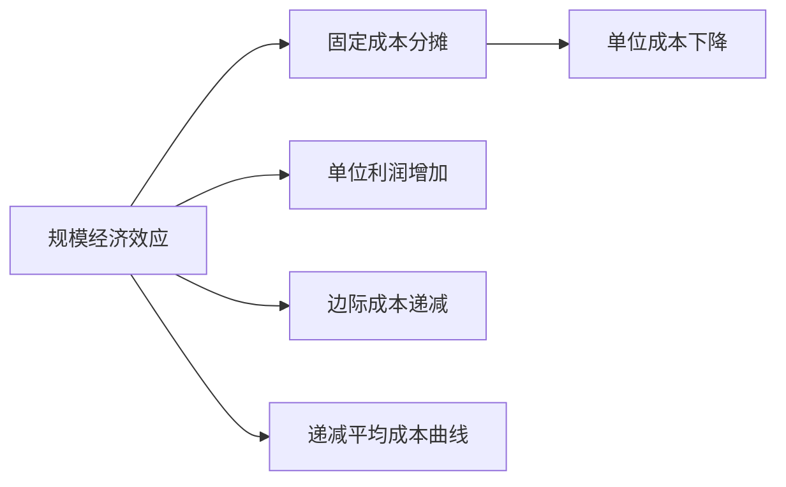

                 

# 规模经济效应减弱的深层次原因

## 1. 背景介绍

### 1.1 问题由来

在过去几十年里，企业通过不断扩大生产规模、提高生产效率，取得了显著的规模经济效应。然而，随着技术的不断进步和市场环境的变化，传统的规模经济效应开始逐渐减弱，尤其是在IT和互联网行业。这促使我们深入探讨规模经济效应减弱的深层次原因，并寻求应对策略。

### 1.2 问题核心关键点

本文将从规模经济效应的定义出发，深入分析规模经济效应减弱的深层原因，并探讨如何通过技术创新和商业模式变革，保持和提升规模经济效应。

## 2. 核心概念与联系

### 2.1 核心概念概述

- **规模经济效应**：指随着生产规模的扩大，单位成本下降，企业获得更高的利润。其基本原理是固定成本被更多单位产品分摊。
- **固定成本**：如设备、厂房等不可变动成本，随着生产规模的扩大，其单位成本会下降。
- **可变成本**：如原材料、人工等随生产量变化而变化的成本。
- **边际成本**：每增加一个单位产品所增加的成本。
- **递减平均成本曲线**：规模经济效应的直观表示，随着生产规模的扩大，平均成本递减。

### 2.2 核心概念原理和架构的 Mermaid 流程图



这个流程图展示了规模经济效应的基本原理：通过固定成本的分摊，单位成本下降，单位利润增加，形成递减的平均成本曲线。

## 3. 核心算法原理 & 具体操作步骤

### 3.1 算法原理概述

规模经济效应减弱的深层次原因涉及多个维度，包括技术进步、市场需求变化、成本结构变化、以及全球化竞争等。下面将逐一探讨。

### 3.2 算法步骤详解

**步骤一：技术进步**

1. **自动化与人工智能**：自动化和人工智能技术的快速发展，使得机器可以高效完成复杂任务，减少了对人工的依赖。然而，大规模部署这些技术的高昂成本，使得规模经济效应减弱。
2. **云计算**：云计算的普及使得企业不必购买和维护大规模的硬件设施，但其按需计费的模式使得固定成本减少，从而影响规模经济效应。

**步骤二：市场需求变化**

1. **个性化需求**：消费者需求的个性化和多样化使得大规模生产模式不再适用，导致规模经济效应下降。
2. **市场竞争加剧**：全球化竞争加剧，企业被迫采取灵活、小规模的生产策略，以快速响应市场变化，降低库存成本。

**步骤三：成本结构变化**

1. **固定成本上升**：随着技术和市场的变化，固定成本（如研发投入、设备维护等）上升，影响规模经济效应。
2. **可变成本结构变化**：原材料、人工等可变成本结构的变化，也影响了规模经济效应。

**步骤四：全球化竞争**

1. **供应链优化**：全球供应链的优化使得企业不再依赖大规模的生产基地，影响了规模经济效应。
2. **地理分散**：企业将生产和服务分散到多个地点，减少对单一地点的依赖，导致规模经济效应减弱。

### 3.3 算法优缺点

**优点**：

1. **技术创新**：通过技术创新，如自动化和人工智能，可以提升生产效率，减少对人力的依赖，从而提高规模经济效应。
2. **市场需求响应**：灵活的、小规模的生产策略可以快速响应市场需求变化，降低库存成本。
3. **成本结构优化**：通过优化固定成本和可变成本结构，可以更好地控制成本，提升规模经济效应。

**缺点**：

1. **技术投入高**：自动化和人工智能的部署需要高昂的投入，短期内难以实现规模经济效应。
2. **市场需求多样性**：个性化和多样化的市场需求，使得大规模生产模式不再适用，影响规模经济效应。
3. **成本上升**：固定成本和可变成本的上升，使得企业不得不调整生产策略，影响规模经济效应。

### 3.4 算法应用领域

规模经济效应减弱的深层次原因不仅适用于制造业，同样适用于IT和互联网行业。例如，云计算和AI技术的应用，使得IT行业规模经济效应减弱。而在电商行业，消费者个性化需求的增加和市场竞争的加剧，也导致了规模经济效应的下降。

## 4. 数学模型和公式 & 详细讲解 & 举例说明

### 4.1 数学模型构建

我们假设企业生产 $n$ 个单位产品的总成本为 $C(n)$，其中 $C_f$ 为固定成本，$C_v$ 为可变成本。则平均成本 $AC(n)$ 和边际成本 $MC(n)$ 分别表示为：

$$
AC(n) = \frac{C(n)}{n}
$$

$$
MC(n) = \frac{dC(n)}{dn}
$$

### 4.2 公式推导过程

**固定成本分摊**：

假设初始固定成本为 $C_f$，生产 $n$ 个单位产品，则总成本 $C(n)$ 为：

$$
C(n) = C_f + C_v \times n
$$

平均成本 $AC(n)$ 为：

$$
AC(n) = \frac{C(n)}{n} = \frac{C_f}{n} + C_v
$$

边际成本 $MC(n)$ 为：

$$
MC(n) = \frac{dC(n)}{dn} = C_v
$$

**递减平均成本曲线**：

当 $C_f \rightarrow 0$ 时，平均成本 $AC(n)$ 简化为：

$$
AC(n) = C_v
$$

此时平均成本为常数，不再随生产规模变化，规模经济效应消失。

### 4.3 案例分析与讲解

**案例一：自动化与人工智能**

假设某企业采用自动化生产线和人工智能技术，固定成本为 $C_f = 1000$ 万美元，可变成本 $C_v = 10$ 美元/单位产品。生产 100 个单位产品的总成本 $C(100)$ 为：

$$
C(100) = 1000 + 10 \times 100 = 1100
$$

平均成本 $AC(100)$ 为：

$$
AC(100) = \frac{1100}{100} = 11
$$

边际成本 $MC(100)$ 为：

$$
MC(100) = 10
$$

可以看到，虽然固定成本很高，但由于可变成本相对较低，单位成本（平均成本）仍然下降。但如果投入的自动化和人工智能成本过高，固定成本上升，规模经济效应可能减弱。

**案例二：市场需求变化**

假设某电商企业销售 $n$ 个单位产品，固定成本 $C_f = 100$ 万美元，可变成本 $C_v = 5$ 美元/单位产品。当市场需求增加，生产 $100$ 个单位产品时，总成本 $C(100)$ 为：

$$
C(100) = 100 + 5 \times 100 = 200
$$

平均成本 $AC(100)$ 为：

$$
AC(100) = \frac{200}{100} = 2
$$

边际成本 $MC(100)$ 为：

$$
MC(100) = 5
$$

可以看出，市场需求变化对规模经济效应有显著影响。如果市场需求下降，企业不得不减少生产规模，可能导致规模经济效应减弱。

## 5. 项目实践：代码实例和详细解释说明

### 5.1 开发环境搭建

**步骤一：安装 Python 和相关库**

1. 安装 Python：从官网下载并安装 Python 3.x 版本。
2. 安装 pandas、numpy、matplotlib 等库：使用 pip 安装。

**步骤二：搭建开发环境**

1. 创建虚拟环境：
```
python -m venv myenv
source myenv/bin/activate
```

2. 安装相关库：
```
pip install tensorflow numpy matplotlib pandas sklearn
```

3. 导入必要的库：
```python
import numpy as np
import matplotlib.pyplot as plt
import pandas as pd
```

### 5.2 源代码详细实现

**代码一：固定成本与可变成本的关系**

```python
def total_cost(n, fixed_cost, variable_cost):
    return fixed_cost + variable_cost * n

def average_cost(n, fixed_cost, variable_cost):
    return total_cost(n, fixed_cost, variable_cost) / n

def marginal_cost(n, variable_cost):
    return variable_cost

n = 100
fixed_cost = 1000000
variable_cost = 10

total_cost = total_cost(n, fixed_cost, variable_cost)
average_cost = average_cost(n, fixed_cost, variable_cost)
marginal_cost = marginal_cost(n, variable_cost)

print(f"Total Cost: {total_cost}")
print(f"Average Cost: {average_cost}")
print(f"Marginal Cost: {marginal_cost}")
```

**代码二：递减平均成本曲线**

```python
n = np.arange(1, 101)
fixed_cost = 0
variable_cost = 10

total_cost = total_cost(n, fixed_cost, variable_cost)
average_cost = average_cost(n, fixed_cost, variable_cost)
marginal_cost = marginal_cost(n, variable_cost)

plt.plot(n, average_cost, label='Average Cost')
plt.plot(n, marginal_cost, label='Marginal Cost')
plt.xlabel('Number of Units')
plt.ylabel('Cost (dollars)')
plt.legend()
plt.show()
```

### 5.3 代码解读与分析

**代码一：固定成本与可变成本的关系**

- **输入**：生产 $n$ 个单位产品，固定成本 $C_f$ 和可变成本 $C_v$。
- **输出**：总成本 $C(n)$、平均成本 $AC(n)$ 和边际成本 $MC(n)$。

**代码二：递减平均成本曲线**

- **输入**：生产 $n$ 个单位产品，固定成本 $C_f$ 和可变成本 $C_v$。
- **输出**：绘制平均成本 $AC(n)$ 和边际成本 $MC(n)$ 的折线图，展示递减平均成本曲线。

## 6. 实际应用场景

### 6.1 制造业

**实际案例一：汽车行业**

在汽车行业，规模经济效应一直十分显著。然而，随着电动汽车的发展，固定成本（如电池研发、生产设施等）上升，可变成本（如原材料、人工等）相对稳定，规模经济效应减弱。企业需要通过技术创新和成本管理，保持规模经济效应。

**实际案例二：电子行业**

电子行业的固定成本包括研发投入和设备维护，可变成本主要是原材料和人工。随着市场对定制化产品的需求增加，大规模生产模式逐渐被小规模定制化生产所取代，规模经济效应下降。企业需要灵活调整生产策略，提高市场响应能力。

### 6.2 IT和互联网行业

**实际案例一：云计算**

云计算使得企业不再需要购买和维护大规模的硬件设施，但其按需计费模式使得固定成本减少，影响规模经济效应。

**实际案例二：AI和自动化**

AI和自动化技术的广泛应用，提高了生产效率，减少了对人力的依赖。然而，高昂的投入使得固定成本上升，规模经济效应减弱。

## 7. 工具和资源推荐

### 7.1 学习资源推荐

1. **《经济学原理》**：经典的经济学教材，系统介绍了规模经济效应的概念和应用。
2. **Coursera《经济学导论》**：由耶鲁大学开设的在线课程，涵盖规模经济效应等经济学基本概念。
3. **Google Scholar**：搜索和引用学术文献，了解最新的规模经济效应研究成果。

### 7.2 开发工具推荐

1. **Jupyter Notebook**：免费在线编辑器，支持多种编程语言，方便编写和分享代码。
2. **GitHub**：代码托管平台，支持版本控制和协作开发，适合团队协作。
3. **Google Colab**：免费在线Jupyter Notebook环境，适合快速迭代实验和分享学习笔记。

### 7.3 相关论文推荐

1. **"Economic Effects of Large Scale Production"**：经济学家Paul Romer的研究，探讨了规模经济效应的微观经济学基础。
2. **"Scale Economies in IT: Evidence from Firms"**：Economist的论文，探讨了IT行业的规模经济效应变化。
3. **"Automation and Labor Market Outcomes"**：Pierluigi De Rogatis等人的研究，探讨了自动化对就业的影响。

## 8. 总结：未来发展趋势与挑战

### 8.1 研究成果总结

本文深入分析了规模经济效应减弱的深层次原因，包括技术进步、市场需求变化、成本结构变化和全球化竞争等。探讨了通过技术创新和商业模式变革，保持和提升规模经济效应的策略。

### 8.2 未来发展趋势

未来规模经济效应将继续受到技术进步、市场需求变化和成本结构变化等多方面因素的影响。企业需要不断创新和优化，保持和提升规模经济效应。

### 8.3 面临的挑战

尽管规模经济效应减弱，企业仍需面对技术投入高、市场需求多样化和成本上升等挑战。需要通过技术创新和商业模式变革，灵活应对市场变化，降低成本，提升规模经济效应。

### 8.4 研究展望

未来的研究方向包括技术创新对规模经济效应的影响、市场需求多样性对生产策略的影响、成本结构变化对企业决策的影响等。这些研究将为保持和提升规模经济效应提供更多理论和实践支持。

## 9. 附录：常见问题与解答

**Q1：规模经济效应与边际成本的关系是什么？**

A: 规模经济效应是指随着生产规模的扩大，单位成本下降，单位利润增加。边际成本是指每增加一个单位产品所增加的成本。规模经济效应与边际成本密切相关，当边际成本递减时，规模经济效应显著；当边际成本递增时，规模经济效应减弱。

**Q2：如何通过技术创新保持规模经济效应？**

A: 技术创新可以提高生产效率，减少对人力的依赖，从而保持规模经济效应。例如，自动化和人工智能技术的广泛应用，可以提高生产效率，降低人工成本，但高昂的投入需要企业谨慎评估。

**Q3：市场需求多样性如何影响规模经济效应？**

A: 市场需求多样性使得大规模生产模式不再适用，导致规模经济效应减弱。企业需要灵活调整生产策略，以快速响应市场需求变化，降低库存成本。

**Q4：全球化竞争如何影响规模经济效应？**

A: 全球化竞争加剧，企业被迫采取灵活、小规模的生产策略，降低库存成本，影响规模经济效应。

**Q5：如何通过成本结构优化保持规模经济效应？**

A: 优化固定成本和可变成本结构，可以更好地控制成本，提升规模经济效应。例如，通过技术创新减少固定成本，通过市场变化优化可变成本。

---

作者：禅与计算机程序设计艺术 / Zen and the Art of Computer Programming

