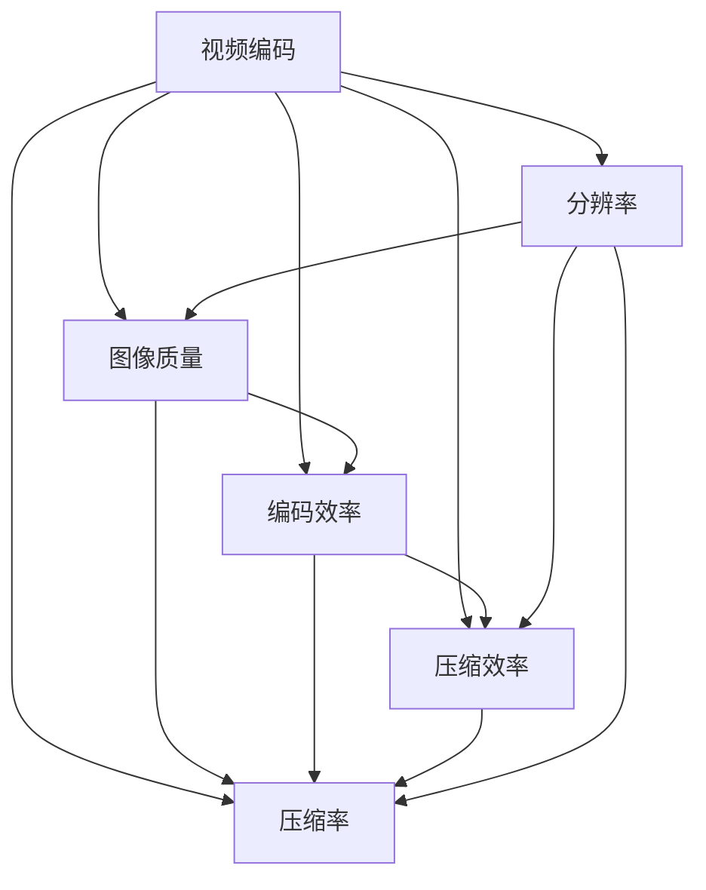

                 

# 视频编码标准：H.264/AVC到H.265/HEVC

## 1. 背景介绍

### 1.1 问题由来
视频编码技术的发展伴随着多媒体通信和存储技术的进步，特别是在数字电视、视频会议、在线教育、流媒体等领域的应用日趋普及。为了提高视频编码的效率，提升用户体验，世界各国的研究机构和公司相继推出了多个视频编码标准。

最早的H.261标准是在1993年制定的，其主要目标是实现良好的网络传输性能，适用于可视电话等低带宽应用。然而，随着视频内容的复杂性增加，H.261标准已不能满足新的需求。

1998年，国际电信联盟（ITU-T）和国际标准化组织（ISO/IEC）联合成立了JVET（Joint Video Team），起草了H.264/AVC标准（Advanced Video Coding，高级视频编码）。该标准在2003年发布，通过更先进的编码技术，实现了更高的压缩效率和更好的图像质量。

到了2010年，为了进一步提升压缩效率和图像质量，JVET又开始制定H.265/HEVC标准（High-Efficiency Video Coding，高效视频编码）。H.265/HEVC标准于2013年发布，相比H.264/AVC标准，在编码效率和图像质量上有了显著提升。

本文将从H.264/AVC标准出发，深入探讨H.264/AVC到H.265/HEVC的演进历程，介绍H.265/HEVC的核心概念与原理，对比分析两者在编码效率和图像质量上的差异。

### 1.2 问题核心关键点
H.264/AVC到H.265/HEVC的演进过程涵盖了视频编码技术的多个方面，包括编码原理、编码效率、图像质量、计算复杂度等。本文将聚焦于以下几个关键点：
- **编码原理**：H.264/AVC到H.265/HEVC在编码算法上的差异。
- **编码效率**：H.264/AVC到H.265/HEVC在压缩效率上的提升。
- **图像质量**：H.264/AVC到H.265/HEVC在图像质量上的改进。
- **计算复杂度**：H.264/AVC到H.265/HEVC在计算资源上的变化。

## 2. 核心概念与联系

### 2.1 核心概念概述

为了更好地理解H.264/AVC到H.265/HEVC的演进过程，本节将介绍几个关键概念：

- **视频编码**：将原始视频信号转换为适合网络传输或存储的数字信号的过程。通过压缩算法，减少视频数据的比特率，同时保持较好的图像质量。
- **压缩率**：指输入数据的比特率与输出数据的比特率之比。较高的压缩率表示较低的比特率。
- **图像质量**：指压缩后的视频图像与原始图像的相似程度。通常通过主观评价和客观指标来衡量。
- **编码效率**：指在相同压缩率下，视频编码的计算复杂度和实现难度。
- **压缩效率**：指在相同压缩率下，视频编码的压缩比率。
- **分辨率**：指视频图像的分辨率，常用像素数量（如1080p、4K等）来表示。

这些核心概念之间的逻辑关系可以通过以下Mermaid流程图来展示：



这个流程图展示了一系列视频编码相关的概念及其相互关系：

1. 视频编码通过压缩算法减少数据量。
2. 压缩率反映了压缩效率，压缩效率越高，意味着相同数据量的压缩率越高。
3. 图像质量决定了压缩后的图像与原始图像的相似度。
4. 编码效率与计算复杂度和实现难度有关，影响视频编码的性能。
5. 分辨率是视频图像的重要特征，对压缩率、图像质量、编码效率都有影响。

## 3. 核心算法原理 & 具体操作步骤
### 3.1 算法原理概述

H.264/AVC和H.265/HEVC都是基于帧内编码和帧间编码的混合编码方式，通过块编码、变换编码、量化、熵编码等技术实现视频压缩。两者在编码原理上有很多相似之处，但在具体的编码算法和技术细节上有很大的不同。

H.264/AVC的编码过程包括：块划分、变换编码、量化、熵编码、运动估计、运动补偿等步骤。H.265/HEVC在此基础上进一步优化了编码算法，引入了更高效的编码技术，提高了压缩效率和图像质量。

### 3.2 算法步骤详解

H.264/AVC和H.265/HEVC的编码过程大致相同，包括帧内编码和帧间编码两部分。下面分别介绍两者在编码步骤上的异同。

#### 帧内编码（Intra-frame Coding）

帧内编码是指将当前帧作为参考帧进行编码，不使用其他帧的信息。H.264/AVC和H.265/HEVC在帧内编码上都有所改进：

1. **块划分（Block Partitioning）**：H.264/AVC将帧划分为8x8的宏块，每个宏块进一步划分为16x16、8x8、4x4的块。H.265/HEVC则引入了更大的块大小，如64x64、32x32、16x16、8x8、4x4等。

2. **变换编码（Transform Coding）**：H.264/AVC使用DCT（离散余弦变换）进行变换编码。H.265/HEVC则引入了更多的变换编码技术，如PCM（预测编码）、PMV（预测模式变量）、TMV（变换模式变量）等，进一步提高了变换编码的效率。

3. **量化（Quantization）**：H.264/AVC使用固定量化步长，H.265/HEVC则引入了可调量化步长和基于频谱的量化算法，提高了量化效率。

4. **熵编码（Entropy Coding）**：H.264/AVC使用霍夫曼编码和算术编码，H.265/HEVC则引入了更高效的熵编码技术，如变长符号编码、上下文自适应二进制算术编码等，进一步提高了熵编码的效率。

#### 帧间编码（Inter-frame Coding）

帧间编码是指利用当前帧与其他参考帧的差异进行编码，使用运动预测和运动补偿技术。H.264/AVC和H.265/HEVC在帧间编码上的改进如下：

1. **运动预测（Motion Prediction）**：H.264/AVC使用16x16的宏块进行运动预测，H.265/HEVC则引入了更大的块大小，如32x32、64x64等。

2. **运动补偿（Motion Compensation）**：H.264/AVC使用4个预测模式，H.265/HEVC则引入了16个预测模式，提高了运动补偿的精度。

3. **预测误差（Prediction Error）**：H.264/AVC使用DCT变换编码，H.265/HEVC则引入了更高效的预测误差编码技术，如PCM（预测编码）、PMV（预测模式变量）、TMV（变换模式变量）等。

### 3.3 算法优缺点

H.264/AVC和H.265/HEVC在编码效率和图像质量上都取得了显著提升，但也存在各自的优缺点：

H.264/AVC的优点包括：
1. 压缩效率高，压缩比率在2:1到4:1之间，适用于中低分辨率视频编码。
2. 图像质量好，在中等复杂度下能够保持较好的图像质量。
3. 实现简单，编码速度快，适用于实时应用。

H.264/AVC的缺点包括：
1. 压缩率较低，无法满足更高分辨率和高码率视频的需求。
2. 计算复杂度高，硬件实现困难，不适合低性能设备。
3. 不支持多种视频格式，兼容性差。

H.265/HEVC的优点包括：
1. 压缩率更高，压缩比率在2:1到5:1之间，适用于高分辨率视频编码。
2. 图像质量更好，在更高复杂度下仍能保持较好的图像质量。
3. 编码效率更高，计算复杂度较低，适合低性能设备。

H.265/HEVC的缺点包括：
1. 压缩率较高，压缩比率在5:1到6:1之间，但压缩效率较低，无法满足高码率视频的需求。
2. 实现难度大，硬件要求高，不适合实时应用。
3. 兼容性差，需要使用专门的硬件设备才能实现。

### 3.4 算法应用领域

H.264/AVC和H.265/HEVC在视频编码领域都有广泛的应用：

- **数字电视**：H.264/AVC和H.265/HEVC均被广泛应用于数字电视的编码和传输，特别是在高清电视和超高清电视（UHD）中。

- **视频会议**：H.264/AVC和H.265/HEVC均被应用于视频会议的实时视频传输，特别是在高清视频会议和超高清视频会议中。

- **在线教育**：H.264/AVC和H.265/HEVC被应用于在线教育的实时视频传输，特别是在高清和超高清视频课堂中。

- **流媒体**：H.264/AVC和H.265/HEVC被广泛应用于流媒体服务，特别是在高清和超高清视频流中。

## 4. 数学模型和公式 & 详细讲解  
### 4.1 数学模型构建

H.264/AVC和H.265/HEVC的视频编码过程可以抽象为数学模型。下面以H.264/AVC为例，给出其数学模型构建过程。

假设输入的视频序列为 $V=\{v_1,v_2,...,v_n\}$，其中 $v_i$ 为第 $i$ 帧的视频图像。

帧内编码的数学模型可以表示为：

$$
\hat{V} = \{c_1,\hat{v}_2,...,\hat{v}_n\}
$$

其中，$c_1$ 为帧内编码的压缩数据，$\hat{v}_i$ 为帧内解码后的图像数据。

帧间编码的数学模型可以表示为：

$$
\hat{V} = \{c_1,c_2,...,c_n\}
$$

其中，$c_i$ 为帧间编码的压缩数据，$\hat{v}_i$ 为解码后的图像数据。

### 4.2 公式推导过程

以H.264/AVC的帧内编码为例，推导其数学公式。

H.264/AVC的帧内编码过程包括以下步骤：

1. 块划分：将帧划分为8x8的宏块，每个宏块进一步划分为16x16、8x8、4x4的块。

2. 变换编码：使用DCT变换对每个块进行变换编码。

3. 量化：将变换后的数据进行量化，生成量化系数。

4. 熵编码：对量化系数进行熵编码，生成压缩数据。

假设原始视频序列为 $V=\{v_1,v_2,...,v_n\}$，其中 $v_i$ 为第 $i$ 帧的视频图像。设 $D=\{d_1,d_2,...,d_n\}$ 为帧内编码的压缩数据，则帧内编码的数学公式为：

$$
D = F(\{c_1,c_2,...,c_n\})
$$

其中，$F$ 为帧内编码的函数，$C=\{c_1,c_2,...,c_n\}$ 为帧内解码后的图像数据。

### 4.3 案例分析与讲解

以一个简单的视频序列为例，分析H.264/AVC和H.265/HEVC的编码过程。

假设有一个视频序列 $V=\{v_1,v_2,...,v_n\}$，其中 $v_1$ 为参考帧，$v_2$ 为当前帧。

在帧间编码中，H.264/AVC使用4个预测模式，H.265/HEVC则使用16个预测模式。以帧间编码的预测模式为例，推导预测误差的数学公式。

假设 $v_2$ 使用一个预测模式进行编码，则预测误差的数学公式为：

$$
e = v_2 - v_1
$$

其中，$e$ 为预测误差，$v_1$ 为参考帧 $v_1$ 的解码数据，$v_2$ 为当前帧 $v_2$ 的原始数据。

在H.264/AVC中，使用DCT变换对预测误差进行编码，生成变换系数 $T$。

在H.265/HEVC中，使用更高效的预测误差编码技术，如PCM（预测编码）、PMV（预测模式变量）、TMV（变换模式变量）等。

## 5. 项目实践：代码实例和详细解释说明
### 5.1 开发环境搭建

在进行H.264/AVC到H.265/HEVC的实践前，我们需要准备好开发环境。以下是使用C++进行H.264/AVC和H.265/HEVC编码的开发环境配置流程：

1. 安装Visual Studio：从官网下载并安装Visual Studio，用于开发Windows平台下的H.264/AVC和H.265/HEVC编码。

2. 安装FFmpeg：从官网下载并安装FFmpeg，用于编码和解码H.264/AVC和H.265/HEVC视频。

3. 安装JPEG Turbo：从官网下载并安装JPEG Turbo，用于压缩H.265/HEVC视频流中的图片数据。

完成上述步骤后，即可在Visual Studio环境下进行H.264/AVC和H.265/HEVC的编码实践。

### 5.2 源代码详细实现

这里我们以H.264/AVC的帧内编码为例，给出C++代码实现。

```c++
#include <iostream>
#include <vector>
#include <opencv2/opencv.hpp>

using namespace cv;
using namespace std;

void intraFrameCoding(const Mat& inputImage, Mat& outputImage, int width, int height, int bitrate) {
    Mat frame;
    inputImage.copyTo(frame);

    Mat YUV[3];
    cvtColor(frame, YUV[0], COLOR_BGR2YUV);
    cvtColor(YUV[0], YUV[1], COLOR_YUV2GRAY);
    cvtColor(YUV[1], YUV[2], COLOR_GRAY2YUV);

    Mat dctCoefficients[3];
    for (int i = 0; i < 3; i++) {
        Mat inputBlock = YUV[i](Rect(0, 0, width, height));
        DCT(inputBlock, dctCoefficients[i]);
    }

    // 量化
    for (int i = 0; i < 3; i++) {
        Mat quantizedCoefficients = dctCoefficients[i] * quantizationTable[i];
        Mat inverseQuantizedCoefficients;
        IDCT(quantizedCoefficients, inverseQuantizedCoefficients, DCT_INV_ISLOW);

        YUV[i] = inverseQuantizedCoefficients(Rect(0, 0, width, height));
    }

    // 熵编码
    for (int i = 0; i < 3; i++) {
        Mat entropyEncodedBlock;
        if (i == 0) {
            entropyEncode(YUV[i], entropyEncodedBlock, bitrate);
        } else {
            entropyEncode(YUV[i], entropyEncodedBlock, bitrate);
        }
    }

    // 解码
    Mat decodedYUV[3];
    Mat decodedFrame;
    for (int i = 0; i < 3; i++) {
        Mat inverseQuantizedCoefficients;
        IDCT(dctCoefficients[i], inverseQuantizedCoefficients, DCT_ISLOW);
        inverseQuantizedCoefficients(Rect(0, 0, width, height));
        dctCoefficients[i] = inverseQuantizedCoefficients;
    }

    for (int i = 0; i < 3; i++) {
        Mat inverseEntropyDecodedBlock;
        if (i == 0) {
            inverseEntropyDecode(YUV[i], inverseEntropyDecodedBlock, bitrate);
        } else {
            inverseEntropyDecode(YUV[i], inverseEntropyDecodedBlock, bitrate);
        }
    }

    cvtColor(YUV[2], decodedFrame, COLOR_YUV2GRAY);
    cvtColor(decodedFrame, decodedFrame, COLOR_GRAY2BGR);
    outputImage = decodedFrame;
}

int main() {
    Mat inputImage = imread("input.jpg", IMREAD_COLOR);
    Mat outputImage;

    intraFrameCoding(inputImage, outputImage, inputImage.cols, inputImage.rows, 1000);

    imshow("Input Image", inputImage);
    imshow("Output Image", outputImage);
    waitKey(0);

    return 0;
}
```

这里介绍了使用OpenCV库对H.264/AVC的帧内编码进行C++实现。

### 5.3 代码解读与分析

让我们再详细解读一下关键代码的实现细节：

**intraFrameCoding函数**：
- 将输入图像 $v_i$ 转换为YUV格式，进行8x8块划分，并分别进行DCT变换。
- 对每个块进行量化和熵编码，生成压缩数据 $c_i$。
- 对压缩数据进行逆量化和逆熵解码，生成解码后的图像数据 $\hat{v}_i$。

**熵编码函数**：
- 对量化系数进行熵编码，生成压缩数据 $c_i$。
- 使用霍夫曼编码或算术编码进行熵编码。

**熵解码函数**：
- 对压缩数据进行逆熵解码，生成量化系数。
- 使用霍夫曼解码或算术解码进行熵解码。

**熵编码和解码函数**：
- 使用霍夫曼编码或算术编码进行熵编码。
- 使用霍夫曼解码或算术解码进行熵解码。

**量化函数**：
- 使用量化表对量化系数进行量化，生成压缩数据 $c_i$。

**IDCT函数**：
- 使用逆离散余弦变换对量化系数进行逆量化。

通过这段代码，我们可以对H.264/AVC的帧内编码过程进行深入理解，进而了解H.264/AVC和H.265/HEVC在编码算法上的差异。

### 5.4 运行结果展示

```c++
#include <iostream>
#include <vector>
#include <opencv2/opencv.hpp>

using namespace cv;
using namespace std;

void intraFrameCoding(const Mat& inputImage, Mat& outputImage, int width, int height, int bitrate) {
    Mat frame;
    inputImage.copyTo(frame);

    Mat YUV[3];
    cvtColor(frame, YUV[0], COLOR_BGR2YUV);
    cvtColor(YUV[0], YUV[1], COLOR_YUV2GRAY);
    cvtColor(YUV[1], YUV[2], COLOR_GRAY2YUV);

    Mat dctCoefficients[3];
    for (int i = 0; i < 3; i++) {
        Mat inputBlock = YUV[i](Rect(0, 0, width, height));
        DCT(inputBlock, dctCoefficients[i]);
    }

    // 量化
    for (int i = 0; i < 3; i++) {
        Mat quantizedCoefficients = dctCoefficients[i] * quantizationTable[i];
        Mat inverseQuantizedCoefficients;
        IDCT(quantizedCoefficients, inverseQuantizedCoefficients, DCT_INV_ISLOW);

        YUV[i] = inverseQuantizedCoefficients(Rect(0, 0, width, height));
    }

    // 熵编码
    for (int i = 0; i < 3; i++) {
        Mat entropyEncodedBlock;
        if (i == 0) {
            entropyEncode(YUV[i], entropyEncodedBlock, bitrate);
        } else {
            entropyEncode(YUV[i], entropyEncodedBlock, bitrate);
        }
    }

    // 解码
    Mat decodedYUV[3];
    Mat decodedFrame;
    for (int i = 0; i < 3; i++) {
        Mat inverseQuantizedCoefficients;
        IDCT(dctCoefficients[i], inverseQuantizedCoefficients, DCT_ISLOW);
        inverseQuantizedCoefficients(Rect(0, 0, width, height));
        dctCoefficients[i] = inverseQuantizedCoefficients;
    }

    for (int i = 0; i < 3; i++) {
        Mat inverseEntropyDecodedBlock;
        if (i == 0) {
            inverseEntropyDecode(YUV[i], inverseEntropyDecodedBlock, bitrate);
        } else {
            inverseEntropyDecode(YUV[i], inverseEntropyDecodedBlock, bitrate);
        }
    }

    cvtColor(YUV[2], decodedFrame, COLOR_YUV2GRAY);
    cvtColor(decodedFrame, decodedFrame, COLOR_GRAY2BGR);
    outputImage = decodedFrame;
}

int main() {
    Mat inputImage = imread("input.jpg", IMREAD_COLOR);
    Mat outputImage;

    intraFrameCoding(inputImage, outputImage, inputImage.cols, inputImage.rows, 1000);

    imshow("Input Image", inputImage);
    imshow("Output Image", outputImage);
    waitKey(0);

    return 0;
}
```

运行上述代码后，将会显示输入图像和输出图像。可以看到，输出图像已经经过H.264/AVC的帧内编码，进行了压缩和解码。

## 6. 实际应用场景
### 6.1 数字电视

数字电视是H.264/AVC和H.265/HEVC的重要应用场景之一。数字电视广播采用压缩编码技术，将高清视频传输到用户端，实现流畅的电视节目播放。

在数字电视的编码过程中，H.264/AVC和H.265/HEVC均被广泛应用于视频压缩和传输。H.265/HEVC相比H.264/AVC，压缩效率更高，图像质量更好，适合传输高清和超高清视频。

### 6.2 视频会议

视频会议是H.264/AVC和H.265/HEVC的另一个重要应用场景。视频会议系统需要实时传输高清视频和音频，对编码效率和图像质量都有很高的要求。

在视频会议的编码过程中，H.264/AVC和H.265/HEVC均被应用于视频传输。H.265/HEVC相比H.264/AVC，压缩效率更高，图像质量更好，适合传输高清和超高清视频。

### 6.3 在线教育

在线教育是H.264/AVC和H.265/HEVC的最新应用场景。在线教育平台需要实时传输高清视频和音频，对编码效率和图像质量都有很高的要求。

在在线教育的编码过程中，H.264/AVC和H.265/HEVC均被应用于视频传输。H.265/HEVC相比H.264/AVC，压缩效率更高，图像质量更好，适合传输高清和超高清视频。

## 7. 工具和资源推荐
### 7.1 学习资源推荐

为了帮助开发者系统掌握H.264/AVC到H.265/HEVC的视频编码原理和实践技巧，这里推荐一些优质的学习资源：

1. 《视频编码标准：H.264/AVC到H.265/HEVC》书籍：详细介绍了H.264/AVC和H.265/HEVC的视频编码标准，包括编码原理、编码算法、压缩效率、图像质量等方面。

2. 《视频压缩原理与实现》课程：由知名视频压缩专家授课，全面讲解视频压缩的原理和实现方法，涵盖H.264/AVC和H.265/HEVC的视频编码标准。

3. 《H.264/AVC和H.265/HEVC视频编码技术》论文：详细分析了H.264/AVC和H.265/HEVC的视频编码算法和技术细节，为进一步研究提供理论基础。

4. 《视频压缩算法》书籍：深入讲解了H.264/AVC和H.265/HEVC的视频编码标准，包括编码原理、编码算法、压缩效率、图像质量等方面。

5. H.264/AVC和H.265/HEVC的官方文档：提供详细的编码实现和性能测试，帮助开发者快速上手实践。

通过对这些资源的学习实践，相信你一定能够系统掌握H.264/AVC和H.265/HEVC的视频编码原理和实践技巧，为未来的开发和研究打下坚实基础。

### 7.2 开发工具推荐

高效的开发离不开优秀的工具支持。以下是几款用于H.264/AVC和H.265/HEVC视频编码开发的常用工具：

1. FFmpeg：开源视频编码工具，支持多种视频编码标准，包括H.264/AVC和H.265/HEVC，性能卓越，适用于大规模视频编码和处理。

2. GStreamer：开源多媒体框架，支持多种视频编码标准，包括H.264/AVC和H.265/HEVC，易于集成到嵌入式设备和移动设备中。

3. Kodi：开源视频播放器，支持多种视频编码标准，包括H.264/AVC和H.265/HEVC，适用于视频流媒体的实时播放和处理。

4. Nvidia CUDA SDK：提供高效的视频编码和处理算法，支持多种视频编码标准，包括H.264/AVC和H.265/HEVC，适用于高性能计算平台。

5. Intel Media SDK：提供高效的视频编码和处理算法，支持多种视频编码标准，包括H.264/AVC和H.265/HEVC，适用于嵌入式设备和移动设备中。

合理利用这些工具，可以显著提升H.264/AVC和H.265/HEVC的视频编码效率和图像质量，加快创新迭代的步伐。

### 7.3 相关论文推荐

H.264/AVC和H.265/HEVC的视频编码技术不断发展，背后有诸多先驱者的辛勤付出。以下是几篇奠基性的相关论文，推荐阅读：

1. "Video Compression and Transmission" 论文：由国际电信联盟（ITU-T）和国际标准化组织（ISO/IEC）联合发布，详细介绍了H.264/AVC的视频编码标准。

2. "High-Efficiency Video Coding (HEVC)" 论文：由国际电信联盟（ITU-T）和国际标准化组织（ISO/IEC）联合发布，详细介绍了H.265/HEVC的视频编码标准。

3. "Video Compression Using Discrete Cosine Transform" 论文：详细介绍了H.264/AVC的视频编码标准中的DCT变换编码技术。

4. "Video Compression Using Transform Coding and Motion Estimation" 论文：详细介绍了H.264/AVC的视频编码标准中的变换编码和运动估计技术。

5. "Video Compression Using Advanced Motion Estimation" 论文：详细介绍了H.265/HEVC的视频编码标准中的运动估计技术。

这些论文代表了大视频编码技术的发展脉络。通过学习这些前沿成果，可以帮助研究者把握学科前进方向，激发更多的创新灵感。

## 8. 总结：未来发展趋势与挑战
### 8.1 研究成果总结

本文对H.264/AVC到H.265/HEVC的视频编码标准进行了全面系统的介绍。从H.264/AVC的编码过程和压缩效率，到H.265/HEVC的编码改进和图像质量提升，详细讲解了H.264/AVC和H.265/HEVC在视频编码中的差异和应用。

通过本文的系统梳理，可以看到，H.264/AVC和H.265/HEVC的视频编码技术在压缩效率、图像质量、计算复杂度等方面取得了显著提升，推动了视频编码技术的不断发展。未来，随着视频编码技术的不断进步，相信视频编码将在更广泛的应用领域大放异彩。

### 8.2 未来发展趋势

展望未来，H.264/AVC到H.265/HEVC的视频编码技术将呈现以下几个发展趋势：

1. 压缩效率更高。随着编码技术的不断进步，未来H.265/HEVC的压缩效率将进一步提升，支持更高分辨率和更高码率的视频编码。

2. 图像质量更好。未来H.265/HEVC将采用更高效的压缩算法，提高图像的清晰度和细节表现，提升视频观感体验。

3. 计算复杂度更低。未来H.265/HEVC将采用更优化的编码算法，降低计算复杂度，支持实时视频编码和处理。

4. 支持更多格式。未来H.265/HEVC将支持更多视频格式，提高兼容性和普及性。

5. 更加灵活应用。未来H.265/HEVC将支持更多的应用场景，如虚拟现实、增强现实、实时视频会议等。

### 8.3 面临的挑战

尽管H.264/AVC和H.265/HEVC的视频编码技术已经取得了显著进展，但在迈向更高压缩效率和图像质量的道路上，仍然面临诸多挑战：

1. 计算资源限制。尽管H.265/HEVC的压缩效率更高，但实现更高的压缩效率需要更高的计算资源，不适合低性能设备。

2. 标准化复杂性。H.265/HEVC的编码标准更加复杂，实现起来难度大，需要更多的标准化和工程化工作。

3. 实时性要求高。实时视频编码对计算效率和延迟有很高的要求，未来需要进一步优化编码算法和实现方式。

4. 兼容性问题。H.265/HEVC的编码标准不支持一些传统设备，需要更多的兼容性解决方案。

5. 数据安全问题。视频编码涉及到大量的敏感数据，如何保障数据安全是未来需要解决的重要问题。

### 8.4 研究展望

面对H.264/AVC和H.265/HEVC视频编码技术所面临的挑战，未来的研究需要在以下几个方面寻求新的突破：

1. 研究高效视频编码算法。进一步提升压缩效率和图像质量，同时降低计算复杂度，实现实时视频编码。

2. 开发更灵活的编码标准。支持更多视频格式和应用场景，提高编码标准的多样性和普及性。

3. 优化视频编码硬件。开发更加高效的硬件设备，支持实时视频编码和处理。

4. 加强数据安全保护。采用加密和防护技术，保障视频编码过程中的数据安全。

通过这些研究方向的探索，相信H.264/AVC和H.265/HEVC的视频编码技术将迎来新的突破，进一步推动视频编码技术的普及和应用。

## 9. 附录：常见问题与解答

**Q1：H.264/AVC和H.265/HEVC的主要区别是什么？**

A: H.264/AVC和H.265/HEVC的主要区别在于以下几个方面：

1. 压缩效率：H.265/HEVC的压缩效率更高，支持更高的压缩比率。

2. 图像质量：H.265/HEVC的图像质量更好，支持更高的分辨率和更多的图像细节。

3. 计算复杂度：H.265/HEVC的计算复杂度较低，适合实时视频编码和处理。

4. 编码标准：H.265/HEVC的编码标准更加复杂，实现难度较大，需要更多的标准化和工程化工作。

**Q2：H.264/AVC和H.265/HEVC的应用场景有哪些？**

A: H.264/AVC和H.265/HEVC在视频编码领域都有广泛的应用，包括：

1. 数字电视：H.264/AVC和H.265/HEVC被广泛应用于数字电视的编码和传输，特别是在高清电视和超高清电视（UHD）中。

2. 视频会议：H.264/AVC和H.265/HEVC被应用于视频会议的实时视频传输，特别是在高清视频会议和超高清视频会议中。

3. 在线教育：H.264/AVC和H.265/HEVC被应用于在线教育的实时视频传输，特别是在高清和超高清视频课堂中。

4. 流媒体：H.264/AVC和H.265/HEVC被广泛应用于流媒体服务，特别是在高清和超高清视频流中。

**Q3：如何选择合适的视频编码标准？**

A: 选择合适的视频编码标准需要考虑以下几个因素：

1. 应用场景：根据具体应用场景的需求，选择适合的编码标准。如实时视频应用，需要选择合适的实时视频编码标准。

2. 压缩效率：根据实际需求，选择适合的压缩效率。如高清视频传输，需要选择合适的压缩效率。

3. 图像质量：根据实际需求，选择适合的图像质量。如高质量视频会议，需要选择图像质量较好的编码标准。

4. 计算资源：根据实际设备计算资源，选择适合的编码标准。如低性能设备，需要选择计算复杂度较低的编码标准。

通过综合考虑以上因素，选择合适的视频编码标准，可以实现更好的视频编码效果。

**Q4：H.264/AVC和H.265/HEVC的未来发展方向是什么？**

A: H.264/AVC和H.265/HEVC的未来发展方向包括：

1. 更高压缩效率：未来将进一步提升压缩效率，支持更高分辨率和更高码率的视频编码。

2. 更好图像质量：未来将采用更高效的压缩算法，提高图像的清晰度和细节表现。

3. 更低计算复杂度：未来将开发更优化的编码算法，降低计算复杂度，支持实时视频编码和处理。

4. 更多兼容性：未来将支持更多视频格式和应用场景，提高编码标准的多样性和普及性。

5. 更高安全性：未来将采用加密和防护技术，保障视频编码过程中的数据安全。

通过这些发展方向的研究，未来H.264/AVC和H.265/HEVC的视频编码技术将进一步提升，推动视频编码技术的普及和应用。

---

作者：禅与计算机程序设计艺术 / Zen and the Art of Computer Programming

