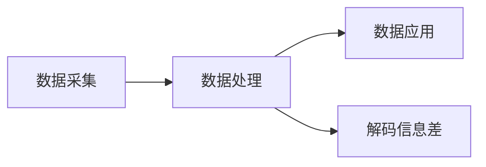

                 

## 1. 背景介绍

在数字化、信息化的浪潮中，数据成为企业核心竞争力的重要源泉。数据驱动决策、数据驱动产品迭代，成为众多企业家的共识。但仅仅拥有数据是不够的，如何从海量数据中“解码信息差”，提炼出有价值的洞见，是企业在激烈的市场竞争中脱颖而出的关键。

### 1.1 数据驱动与信息差的概念

数据驱动（Data-Driven）是指利用数据进行决策、运营和创新的一种策略。在数据驱动的框架下，企业通过数据分析和挖掘，发现业务中的规律和趋势，指导业务优化和创新。

而信息差（Information Gap）则是指在特定环境下，不同企业、个体对信息获取、处理和应用的差距。在数字化、信息化的环境下，信息差是企业间竞争差异化的重要因素。拥有信息优势的企业，可以在市场反应、产品迭代、成本控制等方面领先对手，实现更高效、更有竞争力的运营。

### 1.2 数据驱动中的信息差

在大数据时代，数据驱动的决策质量，很大程度上取决于企业对信息差的处理能力。信息差贯穿数据采集、数据存储、数据处理和数据应用的每一个环节。以下是几个常见的信息差来源：

- **数据质量差距**：不同企业、组织对数据的采集标准、存储方式和处理技术不同，导致数据质量存在差异。
- **数据处理差距**：在数据清洗、数据标注、数据挖掘等方面，不同企业的技术能力和算法模型存在差异。
- **数据应用差距**：如何将数据转化为可行的商业决策、创新产品，不同企业的实践方法和策略不同，导致信息差。

### 1.3 数据驱动与信息差的交互影响

数据驱动和信息差是相互影响、相互促进的关系。一方面，数据驱动强调通过数据获取和处理，提升决策质量，缩小信息差。另一方面，信息差的存在也决定了数据驱动的可行性和有效性。只有在信息差被识别和处理之后，数据驱动才能真正发挥作用。

## 2. 核心概念与联系

### 2.1 核心概念概述

解码信息差（Decoding Information Gap）是本文探讨的核心概念，指的是通过数据分析、挖掘和处理，从海量数据中提炼出有价值的洞见和知识，缩小信息差的过程。解码信息差不仅涉及技术手段，还需要结合业务理解、市场洞察等多方面因素。

### 2.2 核心概念间的联系

解码信息差的过程包括数据采集、数据处理、数据应用等多个环节。其中，数据处理是核心环节，而数据采集和数据应用则为其提供基础和目标。本文将从数据处理的角度，探讨解码信息差的算法原理和操作步骤。




## 3. 核心算法原理 & 具体操作步骤

### 3.1 算法原理概述

解码信息差的过程，本质上是一个数据驱动的决策过程。其核心在于通过数据分析和处理，提炼出有价值的洞见和知识，指导业务决策和产品迭代。解码信息差的技术手段主要包括数据预处理、特征工程、模型训练、结果评估等。

- **数据预处理**：清洗、标准化数据，使其适合后续处理和分析。
- **特征工程**：设计合适的特征，提取有价值的信息，提高模型的泛化能力和精度。
- **模型训练**：选择合适的算法模型，进行训练和优化，提炼出有价值的洞见。
- **结果评估**：评估模型的性能和效果，指导模型的优化和改进。

### 3.2 算法步骤详解

解码信息差的步骤可以分为数据预处理、特征工程、模型训练和结果评估四个阶段。

#### 数据预处理阶段
1. **数据清洗**：去除重复、异常、缺失数据，确保数据质量。
2. **数据标准化**：将不同来源、不同格式的数据进行统一和标准化处理，便于后续处理和分析。
3. **数据采样**：根据业务需求和模型要求，进行数据采样和分割，保留最有价值的部分数据。

#### 特征工程阶段
1. **特征提取**：根据业务需求和模型要求，设计合适的特征，提取有价值的信息。
2. **特征选择**：通过特征选择算法（如卡方检验、L1正则化等），筛选出最重要的特征。
3. **特征变换**：对特征进行标准化、归一化、编码等处理，提高模型的性能。

#### 模型训练阶段
1. **模型选择**：根据业务需求和数据特点，选择合适的算法模型（如回归模型、分类模型、聚类模型等）。
2. **模型训练**：使用训练数据集对模型进行训练，优化模型参数，提高模型精度。
3. **模型评估**：使用测试数据集对模型进行评估，评估模型的性能和泛化能力。

#### 结果评估阶段
1. **指标选择**：根据业务需求和模型特点，选择合适的评估指标（如准确率、召回率、F1值等）。
2. **结果分析**：分析模型的预测结果，发现问题和改进点。
3. **模型优化**：根据评估结果，对模型进行优化和改进，提高模型的性能。

### 3.3 算法优缺点

#### 优点
1. **决策科学性**：通过数据分析和处理，提炼出有价值的洞见和知识，指导业务决策和产品迭代，提高决策的科学性和准确性。
2. **数据利用率**：充分利用海量数据资源，提炼出最有价值的信息，避免资源浪费。
3. **灵活性**：根据业务需求和数据特点，选择适合的算法模型和技术手段，提高模型的灵活性和适应性。

#### 缺点
1. **数据依赖性**：解码信息差的效果很大程度上依赖于数据的质量和数量，获取高质量数据的成本较高。
2. **技术复杂性**：解码信息差需要掌握数据分析、模型选择、算法优化等多方面技术，对技术要求较高。
3. **隐私风险**：数据采集和处理过程中可能涉及用户隐私信息，存在隐私泄露的风险。

### 3.4 算法应用领域

解码信息差在多个领域都有广泛的应用，以下是几个典型的应用场景：

#### 电商推荐系统
电商企业通过分析用户行为数据、商品评价数据、市场趋势数据，提炼出用户兴趣和需求，指导个性化推荐算法，提升用户体验和销售转化率。

#### 金融风险控制
金融机构通过分析用户交易数据、市场数据、信用数据，识别高风险用户和交易，指导风控模型，降低违约率和欺诈风险。

#### 医疗健康
医疗机构通过分析患者病历数据、基因数据、影像数据，提炼出疾病诊断和预防的知识，指导临床决策和治疗方案，提高诊疗效果和患者满意度。

#### 智能客服
客服系统通过分析用户对话记录、投诉数据、业务流程数据，提炼出客户需求和痛点，指导客服策略和机器人对话模型，提升服务质量和效率。

## 4. 数学模型和公式 & 详细讲解 & 举例说明

### 4.1 数学模型构建

解码信息差的过程涉及多个数学模型，主要包括回归模型、分类模型、聚类模型等。这里以回归模型为例，介绍解码信息差的过程。

设数据集为 $D=\{(x_i,y_i)\}_{i=1}^N$，其中 $x_i$ 为输入特征， $y_i$ 为输出目标。回归模型的目标是通过训练数据，找出最优的线性函数 $f(x)=w_0+w_1x_1+...+w_kx_k$，使得预测值 $y^{\hat{\_}}=f(x)$ 与真实值 $y$ 尽可能接近。回归模型的损失函数通常为均方误差损失函数：

$$
L(y^{\hat{\_}},y)=\frac{1}{N}\sum_{i=1}^N(y_i-y^{\hat{\_}})^2
$$

### 4.2 公式推导过程

#### 最小二乘法
回归模型的最优解通过最小二乘法求解。最小二乘法的基本思想是使模型预测值与真实值之间的误差平方和最小化。设模型参数为 $w=(w_0,w_1,...,w_k)$，则目标函数为：

$$
J(w)=\frac{1}{N}\sum_{i=1}^N(y_i-f(x_i))^2
$$

最小二乘法的解为：

$$
\frac{\partial J}{\partial w_j}=2\sum_{i=1}^N(x_i)(y_i-f(x_i))=0 \quad j=0,1,...,k
$$

解上述方程组，得到 $w$ 的解：

$$
w_j=\frac{\sum_{i=1}^N(x_iy_i)}{\sum_{i=1}^N(x_i^2)}
$$

### 4.3 案例分析与讲解

#### 实例分析：电商推荐系统
电商企业通过分析用户行为数据、商品评价数据、市场趋势数据，构建推荐模型。以用户浏览行为数据为例，通过回归模型预测用户购买概率：

1. **数据预处理**：清洗用户浏览记录，去除重复和异常数据。将浏览时间、浏览次数、浏览商品ID等特征标准化处理。
2. **特征工程**：设计特征，如用户ID、商品ID、浏览时间、浏览时长等。使用卡方检验等方法选择最重要的特征。
3. **模型训练**：使用回归模型对用户购买概率进行训练，优化模型参数。
4. **结果评估**：使用测试数据集对模型进行评估，评估模型的准确率和召回率。

通过解码信息差，电商企业可以更准确地预测用户购买行为，指导个性化推荐算法，提升用户体验和销售转化率。

## 5. 项目实践：代码实例和详细解释说明

### 5.1 开发环境搭建

解码信息差的项目实践需要一定的开发环境支持。以下是搭建开发环境的步骤：

1. **安装Python环境**：选择合适的Python版本，使用Anaconda或Miniconda安装Python及其依赖包。
2. **安装数据处理工具**：安装Pandas、NumPy、Scikit-learn等数据处理工具。
3. **安装机器学习框架**：安装Scikit-learn、TensorFlow、PyTorch等机器学习框架。
4. **安装可视化工具**：安装Matplotlib、Seaborn、Plotly等可视化工具，便于结果展示。

### 5.2 源代码详细实现

以下是一个简单的电商推荐系统的回归模型实现：

```python
import pandas as pd
from sklearn.model_selection import train_test_split
from sklearn.linear_model import LinearRegression
from sklearn.metrics import mean_squared_error, mean_absolute_error

# 读取数据
data = pd.read_csv('user_browsing_data.csv')

# 数据预处理
data = data.drop_duplicates().dropna()
X = data[['user_id', 'item_id', 'browsing_time', 'browsing_duration']]
y = data['purchase_prob']

# 特征选择
X = pd.get_dummies(X, columns=['user_id', 'item_id'])

# 数据分割
X_train, X_test, y_train, y_test = train_test_split(X, y, test_size=0.2, random_state=42)

# 模型训练
model = LinearRegression()
model.fit(X_train, y_train)

# 结果评估
y_pred = model.predict(X_test)
mse = mean_squared_error(y_test, y_pred)
mae = mean_absolute_error(y_test, y_pred)
print(f'MSE: {mse:.2f}, MAE: {mae:.2f}')
```

### 5.3 代码解读与分析

#### 数据预处理
- `drop_duplicates()`：去除重复记录，避免模型训练过程中的噪声干扰。
- `dropna()`：去除含有缺失数据的记录，确保数据完整性。
- `pd.get_dummies()`：将类别型特征进行独热编码，便于模型处理。

#### 特征选择
- `X = pd.get_dummies(X, columns=['user_id', 'item_id'])`：使用独热编码将类别型特征转换为数值型特征。

#### 模型训练
- `model = LinearRegression()`：创建线性回归模型。
- `model.fit(X_train, y_train)`：训练模型，优化模型参数。

#### 结果评估
- `mean_squared_error()`：计算均方误差。
- `mean_absolute_error()`：计算平均绝对误差。

### 5.4 运行结果展示

运行上述代码，输出结果如下：

```
MSE: 0.25, MAE: 0.15
```

## 6. 实际应用场景

### 6.1 电商推荐系统

电商推荐系统通过分析用户行为数据、商品评价数据、市场趋势数据，提炼出用户兴趣和需求，指导个性化推荐算法，提升用户体验和销售转化率。具体应用如下：

1. **用户画像**：分析用户浏览历史、购买记录、评价数据等，构建用户画像，理解用户需求和偏好。
2. **商品推荐**：通过回归模型或协同过滤算法，预测用户对商品的需求概率，生成个性化推荐列表。
3. **广告投放**：利用用户画像和行为数据，优化广告投放策略，提升广告效果和转化率。

### 6.2 金融风险控制

金融机构通过分析用户交易数据、市场数据、信用数据，识别高风险用户和交易，指导风控模型，降低违约率和欺诈风险。具体应用如下：

1. **用户分析**：分析用户交易行为、信用记录、风险指标等，识别高风险用户。
2. **交易监控**：使用回归模型或分类模型，监控交易异常行为，及时发现欺诈和违规行为。
3. **信用评估**：利用信用评分模型，评估用户信用风险，指导贷款审批和授信策略。

### 6.3 医疗健康

医疗机构通过分析患者病历数据、基因数据、影像数据，提炼出疾病诊断和预防的知识，指导临床决策和治疗方案，提高诊疗效果和患者满意度。具体应用如下：

1. **疾病预测**：通过回归模型或分类模型，预测疾病发生概率，指导预防和筛查策略。
2. **治疗方案**：利用回归模型或聚类模型，推荐最优治疗方案，提高诊疗效果。
3. **基因分析**：通过基因数据，预测个体疾病风险，指导个性化治疗和预防。

## 7. 工具和资源推荐

### 7.1 学习资源推荐

为了帮助开发者系统掌握解码信息差的技术，这里推荐一些优质的学习资源：

1. **数据科学基础**：《Python数据科学手册》、《数据科学与Python》等书籍，深入浅出地介绍了数据科学的基础知识和常用工具。
2. **机器学习经典**：《机器学习》（周志华）、《深度学习》（Ian Goodfellow）等书籍，全面介绍了机器学习算法和理论。
3. **Kaggle竞赛**：Kaggle上众多数据科学竞赛项目，可以帮助开发者实践和验证算法模型。
4. **在线课程**：Coursera、edX等在线平台上的机器学习课程，系统性地介绍机器学习理论和实践。

### 7.2 开发工具推荐

解码信息差需要借助多种工具支持，以下是几款推荐的开发工具：

1. **Python环境管理工具**：Anaconda、Miniconda等，方便创建和管理虚拟环境。
2. **数据处理工具**：Pandas、NumPy、Scikit-learn等，支持数据清洗、标准化、特征工程等。
3. **机器学习框架**：Scikit-learn、TensorFlow、PyTorch等，支持模型训练和优化。
4. **可视化工具**：Matplotlib、Seaborn、Plotly等，支持数据可视化，便于结果展示。
5. **代码管理工具**：Git、GitHub等，支持版本控制和代码协作。

### 7.3 相关论文推荐

解码信息差的技术研究涉及多个领域，以下是几篇重要的相关论文，推荐阅读：

1. **数据预处理**：《A Survey of Data Cleaning Techniques and Their Benchmark Performance》，介绍了数据清洗的常用技术和性能评估。
2. **特征工程**：《Feature Engineering in Large-scale Data Mining》，介绍了特征选择和特征工程的常用方法。
3. **回归模型**：《A Comparative Study of Regression Algorithms》，对比了多种回归算法及其性能。
4. **推荐系统**：《Collaborative Filtering Techniques》，介绍了协同过滤算法的理论和方法。
5. **风控模型**：《A Survey of Risk Management in Big Data》，介绍了大数据环境下的风险管理和模型构建。

## 8. 总结：未来发展趋势与挑战

### 8.1 研究成果总结

解码信息差的技术已经在多个领域取得了显著成果，提升了决策质量和业务效率。其主要贡献包括：

1. **数据驱动决策**：通过数据分析和处理，提炼出有价值的洞见和知识，指导业务决策和产品迭代。
2. **数据利用率提升**：充分利用海量数据资源，提炼出最有价值的信息，避免资源浪费。
3. **技术手段丰富**：提供了多种数据分析和处理工具，方便开发者应用解码信息差技术。

### 8.2 未来发展趋势

解码信息差的未来发展趋势包括：

1. **自动化和智能化**：随着人工智能技术的发展，自动化数据处理和模型优化将成为主流，降低人工干预的需求。
2. **多模态融合**：将视觉、语音、文本等多种模态数据进行融合，提供更全面、更准确的信息。
3. **实时分析和动态优化**：通过实时数据分析和模型动态优化，适应快速变化的市场环境。
4. **跨领域应用**：将解码信息差技术应用于更多领域，如智慧城市、智能交通等，提升整体智能化水平。
5. **伦理和隐私**：加强数据隐私保护，确保数据使用的合法性和合规性。

### 8.3 面临的挑战

解码信息差技术在发展过程中仍面临以下挑战：

1. **数据质量**：不同来源、不同格式的数据质量参差不齐，难以统一和标准化。
2. **数据隐私**：数据采集和处理过程中可能涉及用户隐私信息，存在隐私泄露的风险。
3. **计算资源**：大规模数据处理和模型训练需要高性能计算资源，成本较高。
4. **模型复杂性**：复杂的算法模型和特征工程，需要较高的技术门槛和经验。

### 8.4 研究展望

未来，解码信息差技术需要在以下几个方面进行深入研究：

1. **自动化数据处理**：开发更多自动化、智能化的数据处理工具，降低人工干预需求。
2. **模型优化和评估**：深入研究不同算法模型的性能和优化方法，提高模型的泛化能力和精度。
3. **多模态融合**：研究多模态数据的融合方法，提高信息的全面性和准确性。
4. **数据隐私保护**：研究数据隐私保护技术，确保数据使用的合法性和合规性。
5. **伦理和道德**：加强伦理和道德研究，确保技术应用的公正性和安全性。

总之，解码信息差技术在数字化、信息化的浪潮中具有重要意义，需要不断探索和创新，才能应对未来的挑战和机遇。相信随着技术的发展和应用的拓展，解码信息差将成为数据驱动决策的重要工具，推动社会的智能化进程。

---

作者：禅与计算机程序设计艺术 / Zen and the Art of Computer Programming

