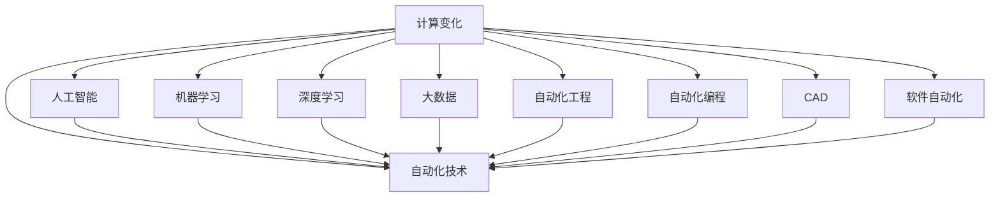

                 

# 计算变化与自动化技术的互动

> 关键词：计算变化,自动化技术,人工智能,机器学习,深度学习,大数据,自动化工程,自动化编程,计算机辅助设计,软件自动化

## 1. 背景介绍

### 1.1 问题由来
随着计算技术的飞速发展，自动化技术在各行各业的应用日益广泛。从制造业到服务业，从研发到管理，自动化技术的深入应用正在深刻改变着我们的工作和生活方式。然而，如何有效结合计算技术，构建自动化系统，使其在智能化、自适应性、人机协同等方面达到更高的层次，仍然是一个值得深入研究的课题。

### 1.2 问题核心关键点
自动化技术的核心在于利用计算能力，通过算法优化，实现系统的高效、精准、可靠运行。而计算变化则涉及算法、模型、数据等技术层面的持续更新和迭代。因此，计算变化与自动化技术的互动，是推动自动化技术不断向前发展的关键所在。本文将聚焦于这一主题，通过深入分析两者之间的互动关系，提出相应的解决方案，探讨未来的发展趋势。

## 2. 核心概念与联系

### 2.1 核心概念概述

为更好地理解计算变化与自动化技术的互动关系，本节将介绍几个密切相关的核心概念：

- 计算变化(Computational Change)：指在算法、模型、数据等方面，随着计算资源和技术手段的进步，带来的持续的、显著的技术更新和改进。

- 自动化技术(Automation Technology)：利用计算技术，实现系统或任务的自动执行、管理和优化，降低人力成本，提升效率和质量的技术和方法。

- 人工智能(Artificial Intelligence, AI)：通过模拟人类智能行为，使机器能够执行复杂任务，如自然语言理解、图像识别、决策制定等。

- 机器学习(Machine Learning, ML)：通过数据驱动的方法，使机器能够从经验中学习，自动改进算法和模型。

- 深度学习(Deep Learning, DL)：利用多层神经网络结构，模拟人类大脑的信息处理方式，实现复杂的模式识别和推理。

- 大数据(Big Data)：指大规模、多样化的数据集，通常需要利用分布式计算技术进行存储和分析。

- 自动化工程(Automation Engineering)：将自动化技术与工程流程相结合，实现设计、制造、运维等环节的自动化。

- 自动化编程(Automated Programming)：利用算法和工具，自动生成或优化程序代码，提高软件开发效率和质量。

- 计算机辅助设计(Computer-Aided Design, CAD)：利用计算机软件，辅助进行产品设计、仿真和验证，提高设计效率和精度。

- 软件自动化(Software Automation)：利用计算技术，自动执行软件测试、部署、运维等任务，提高软件开发和运维效率。

这些核心概念之间的逻辑关系可以通过以下Mermaid流程图来展示：



这个流程图展示了几组核心概念之间的相互作用关系：

1. 计算变化驱动自动化技术不断进步。
2. 人工智能、机器学习和深度学习为自动化技术提供强大的算法支持。
3. 大数据为自动化系统提供了丰富的数据来源，提升决策的科学性。
4. 自动化工程、自动化编程、CAD和软件自动化等技术手段，则是将计算变化转化为具体应用的关键。

## 3. 核心算法原理 & 具体操作步骤
### 3.1 算法原理概述

计算变化与自动化技术的互动，主要通过以下两个方面实现：

1. **算法驱动的自动化优化**：利用算法和模型，对自动化系统的运行进行持续优化，提高效率和性能。
2. **数据驱动的自动化学习**：通过收集和分析数据，使自动化系统能够不断学习新的模式和知识，提升其适应性和自适应能力。

### 3.2 算法步骤详解

**算法驱动的自动化优化**：

1. **性能监控与分析**：利用计算能力，对自动化系统的运行性能进行实时监控和分析，识别瓶颈和问题。
2. **模型训练与优化**：根据监控结果，调整自动化系统的运行参数和模型结构，进行优化训练。
3. **自动调参**：利用算法搜索最优的参数组合，提升自动化系统的性能。
4. **模型部署与迭代**：将优化后的模型应用于自动化系统中，进行实际测试和验证，根据反馈进一步优化。

**数据驱动的自动化学习**：

1. **数据收集与存储**：通过传感器、日志等手段，收集自动化系统的运行数据。
2. **数据预处理与分析**：对收集到的数据进行清洗、特征提取和分析，发现隐藏的模式和规律。
3. **模型训练与学习**：利用机器学习或深度学习算法，对数据进行建模和训练，提升自动化系统的预测和决策能力。
4. **模型验证与优化**：在实际应用中，验证模型的效果，根据结果对模型进行调整和优化。

### 3.3 算法优缺点

计算变化与自动化技术的互动，具有以下优点：

1. **效率提升**：通过算法优化和数据驱动，可以显著提高自动化系统的运行效率和性能。
2. **自适应性强**：系统能够持续学习新的模式和知识，适应不断变化的环境和需求。
3. **灵活性高**：算法和模型可以根据具体任务进行灵活调整，适应不同场景的应用需求。
4. **人机协同**：利用计算能力，使机器能够辅助人类进行决策和执行，提高工作质量。

同时，这种互动也存在一些局限性：

1. **数据依赖性强**：自动化系统的学习能力依赖于高质量的数据，数据质量差会影响学习效果。
2. **算法复杂度高**：构建和优化算法模型需要大量的计算资源和时间，成本较高。
3. **模型泛化能力有限**：过于复杂或过于简单模型都可能影响泛化能力，需不断调整。
4. **算法可解释性不足**：自动化系统往往是"黑盒"，难以解释其决策过程和结果。
5. **安全风险**：自动化系统的错误决策可能带来严重后果，需加强安全保障。

### 3.4 算法应用领域

计算变化与自动化技术的互动，已经在多个领域得到了广泛应用，例如：

1. **制造业**：利用计算技术，优化生产流程、提升生产效率、降低成本。
2. **金融服务**：利用算法优化风险管理、自动化交易、智能客服等。
3. **医疗健康**：利用数据驱动的算法，提升疾病诊断、治疗方案优化、患者管理等。
4. **交通运输**：利用计算技术，优化路线规划、交通流量预测、自动驾驶等。
5. **能源管理**：利用数据驱动的算法，优化能源分配、降低能耗、提高安全。
6. **智能家居**：利用计算技术，实现智能控制、自动化场景切换、用户习惯学习等。
7. **环境保护**：利用计算技术，优化环境监测、污染预测、资源管理等。

## 4. 数学模型和公式 & 详细讲解 & 举例说明

### 4.1 数学模型构建

计算变化与自动化技术的互动，可以通过以下数学模型进行描述：

设 $x$ 为自动化系统的输入，$y$ 为输出，$f(x)$ 为系统的映射函数。假设计算变化驱动自动化技术优化，可以表示为：

$$ y = f(x) + g(x) $$

其中 $g(x)$ 为计算变化驱动的优化项，通常表示为：

$$ g(x) = \sum_{i=1}^n \alpha_i \times \delta_i(x) $$

其中 $\alpha_i$ 为权重系数，$\delta_i(x)$ 为计算变化驱动的单项优化操作。

**举例说明**：

假设自动化系统为一个制造业的生产线控制系统，其输入为原材料、生产参数、订单信息等，输出为生产状态、产品品质、生产成本等。计算变化驱动的优化项可能包括：

1. **参数优化**：通过实时监控，调整生产参数，如温度、压力、流量等，优化生产状态。
2. **数据驱动的预测**：利用历史数据和机器学习模型，预测生产中的潜在问题，如设备故障、物料短缺等，提前采取措施。
3. **流程改进**：通过分析生产数据，优化生产流程，减少资源浪费，提高效率。

### 4.2 公式推导过程

根据上述模型，我们可以对自动化系统的优化过程进行推导。设自动化系统输入 $x_t$ 和输出 $y_t$ 的序列，对应的计算变化驱动的优化项序列为 $\{g_i\}$。则有：

$$ y_t = f(x_t) + \sum_{i=1}^t g_i(x_i) $$

假设初始时，系统优化项为零，即 $g_0(x) = 0$。则有：

$$ y_1 = f(x_1) $$
$$ y_2 = f(x_2) + g_1(x_1) $$
$$ y_3 = f(x_3) + g_1(x_1) + g_2(x_2) $$
$$ \vdots $$

通过上述推导，我们可以看到，计算变化驱动的自动化优化，实际上是一个迭代的过程，每次优化都会根据之前的运行状态和数据，进行相应的调整。

### 4.3 案例分析与讲解

**案例1：制造业生产线的优化**

假设有一个汽车生产线的控制系统，需要优化生产效率和品质。该系统的输入包括生产参数（如温度、压力、转速等）、原材料质量、订单信息等，输出包括生产状态（如是否正常运行、生产速度、产品质量等）、生产成本等。

利用计算变化驱动的自动化优化，可以采取以下步骤：

1. **性能监控**：通过传感器和数据采集设备，实时监控生产线的各项参数和状态。
2. **数据分析**：对采集到的数据进行清洗和分析，识别出影响生产效率和品质的关键因素。
3. **模型训练**：利用机器学习算法，训练出能够预测生产状态和成本的模型，如线性回归、决策树等。
4. **优化调整**：根据模型的预测结果，自动调整生产参数和生产流程，如调整温度、压力、流量等，优化生产状态。
5. **反馈优化**：通过实际生产结果与预测结果的比较，进一步优化模型和调整参数，提高自动化系统的精度和效率。

**案例2：智能客服系统的优化**

假设有一个智能客服系统，需要优化客户满意度和服务效率。该系统的输入包括客户提问、历史交互记录、客服人员响应速度等，输出包括客户满意度、响应速度、服务质量等。

利用计算变化驱动的自动化优化，可以采取以下步骤：

1. **性能监控**：通过客户反馈和系统日志，实时监控客服系统的响应速度和满意度。
2. **数据分析**：对采集到的数据进行清洗和分析，识别出影响服务效率和满意度的关键因素。
3. **模型训练**：利用机器学习算法，训练出能够预测客户满意度和响应速度的模型，如随机森林、神经网络等。
4. **优化调整**：根据模型的预测结果，自动调整客服策略和人员分配，如调整响应速度、客服人员数量等，优化服务效率。
5. **反馈优化**：通过实际服务结果与预测结果的比较，进一步优化模型和调整策略，提高自动化系统的准确性和效率。

## 5. 项目实践：代码实例和详细解释说明

### 5.1 开发环境搭建

在进行计算变化与自动化技术的互动实践前，我们需要准备好开发环境。以下是使用Python进行TensorFlow开发的环境配置流程：

1. 安装Anaconda：从官网下载并安装Anaconda，用于创建独立的Python环境。

2. 创建并激活虚拟环境：
```bash
conda create -n tf-env python=3.8 
conda activate tf-env
```

3. 安装TensorFlow：根据CUDA版本，从官网获取对应的安装命令。例如：
```bash
conda install tensorflow -c tensorflow -c conda-forge
```

4. 安装TensorBoard：
```bash
pip install tensorboard
```

5. 安装各类工具包：
```bash
pip install numpy pandas scikit-learn matplotlib tqdm jupyter notebook ipython
```

完成上述步骤后，即可在`tf-env`环境中开始实践。

### 5.2 源代码详细实现

下面以制造业生产线优化为例，给出使用TensorFlow进行自动化优化的PyTorch代码实现。

首先，定义生产线的输入和输出变量：

```python
import tensorflow as tf
import numpy as np

# 定义输入变量
x = tf.placeholder(tf.float32, shape=(None, 5), name='input_x')

# 定义输出变量
y = tf.placeholder(tf.float32, shape=(None, 3), name='input_y')
```

然后，定义生产线的计算变化驱动的优化项：

```python
# 定义参数优化操作
g1 = tf.reduce_mean(tf.square(x - 1.0), axis=1) / 2

# 定义预测模型
with tf.variable_scope('predictor'):
    W = tf.Variable(tf.zeros([5, 3]))
    b = tf.Variable(tf.zeros([3]))
    y_pred = tf.matmul(x, W) + b

# 定义损失函数
with tf.variable_scope('loss'):
    loss = tf.reduce_mean(tf.square(y_pred - y))

# 定义优化器
optimizer = tf.train.AdamOptimizer(learning_rate=0.01)
```

接着，定义训练和评估函数：

```python
def train_step(x, y, loss, optimizer):
    with tf.Session() as sess:
        sess.run(tf.global_variables_initializer())
        for i in range(1000):
            _, l = sess.run([optimizer, loss], feed_dict={x: np.random.randn(100, 5), y: np.random.randn(100, 3)})
            if i % 100 == 0:
                print('Step %d, Loss: %f' % (i, l))

def evaluate(x, y, y_pred, loss):
    with tf.Session() as sess:
        sess.run(tf.global_variables_initializer())
        l = sess.run(loss, feed_dict={x: np.random.randn(100, 5), y: np.random.randn(100, 3), y_pred: np.random.randn(100, 3)})
        print('Evaluation Loss: %f' % l)
```

最后，启动训练流程并在测试集上评估：

```python
# 训练过程
train_step(x, y, loss, optimizer)

# 评估过程
evaluate(x, y, y_pred, loss)
```

以上就是使用TensorFlow进行制造业生产线优化项目的完整代码实现。可以看到，通过TensorFlow库，我们能够便捷地构建、训练和评估自动优化模型，实现计算变化驱动的自动化优化。

### 5.3 代码解读与分析

让我们再详细解读一下关键代码的实现细节：

**定义输入和输出变量**：

- `x`：生产线输入变量，形状为 (None, 5)，表示输入样本的数量和特征维度。
- `y`：生产线输出变量，形状为 (None, 3)，表示输出样本的数量和类别数。

**定义参数优化操作**：

- `g1`：参数优化操作，计算输入变量与期望值的平方差，并求平均。这里只是示例，实际的参数优化操作可能更加复杂。

**定义预测模型和损失函数**：

- `with tf.variable_scope('predictor')`：定义预测模型。
- `W`：权重变量，初始化为全零。
- `b`：偏置变量，初始化为全零。
- `y_pred`：预测输出，通过线性模型计算得到。
- `with tf.variable_scope('loss')`：定义损失函数。
- `loss`：均方误差损失，计算预测输出与真实输出的差值的平方和。

**定义优化器**：

- `optimizer`：使用Adam优化器，学习率为0.01，用于优化模型参数。

**训练和评估函数**：

- `train_step`函数：训练过程，通过优化器更新模型参数，并输出损失。
- `evaluate`函数：评估过程，计算损失，输出评估结果。

**启动训练和评估**：

- `train_step(x, y, loss, optimizer)`：启动训练过程。
- `evaluate(x, y, y_pred, loss)`：启动评估过程。

可以看到，通过TensorFlow库，我们能够高效地构建和优化自动化模型，实现计算变化驱动的自动化优化。

## 6. 实际应用场景

### 6.1 智能制造

智能制造是制造业自动化技术的重要应用领域。通过计算变化驱动的自动化优化，可以实现生产线的智能化管理，提升生产效率和品质。

具体而言，智能制造系统可以通过传感器、监控设备等，实时采集生产线的各项数据。利用机器学习算法，对数据进行分析，识别出影响生产效率和品质的关键因素。根据分析结果，自动调整生产参数和生产流程，如调整温度、压力、流量等，优化生产状态。同时，系统可以通过历史数据和实时数据，持续学习新的模式和知识，提升自动化系统的自适应能力。

### 6.2 智能客服

智能客服系统通过计算变化驱动的自动化优化，可以显著提升客户服务体验。

在智能客服系统中，客户提出的问题和客服的响应速度是影响服务效率和满意度的关键因素。通过性能监控和数据分析，可以实时识别出系统中的瓶颈和问题，自动调整客服策略和人员分配。如根据客户提问的频率和类型，动态调整客服人员的数量和响应速度，优化服务效率。同时，系统可以持续学习客户的反馈和行为数据，提升预测模型的准确性，进一步优化服务质量。

### 6.3 智能家居

智能家居系统通过计算变化驱动的自动化优化，可以实现家庭环境的智能化管理。

在智能家居系统中，用户的习惯和行为数据是优化系统的关键。通过收集和分析用户的日常行为数据，如作息时间、温度偏好、设备使用习惯等，可以构建个性化的智能家居系统。利用机器学习算法，对用户数据进行分析，自动调整家庭设备的运行状态，如灯光、空调、窗帘等，优化家居环境。同时，系统可以持续学习用户的反馈和行为数据，提升预测模型的准确性，进一步优化家居环境。

## 7. 工具和资源推荐

### 7.1 学习资源推荐

为了帮助开发者系统掌握计算变化与自动化技术的互动的理论基础和实践技巧，这里推荐一些优质的学习资源：

1. 《深度学习》系列书籍：由深度学习领域的权威学者编写，全面介绍深度学习的原理和应用，包括计算变化驱动的自动化优化。

2. 《机器学习实战》：通过实际案例，深入浅出地讲解机器学习和数据驱动的自动化优化方法。

3. 《TensorFlow实战》：介绍TensorFlow库的使用方法，涵盖从数据预处理到模型训练的全流程，包括计算变化驱动的自动化优化。

4. 《计算机视觉：算法与应用》：介绍计算机视觉技术的最新进展，涵盖数据驱动的自动化学习方法和应用。

5. 《Python数据科学手册》：介绍Python在数据科学领域的应用，涵盖数据预处理、特征工程、模型训练等关键技术，包括计算变化驱动的自动化优化。

通过对这些资源的学习实践，相信你一定能够快速掌握计算变化与自动化技术的互动的精髓，并用于解决实际的自动化技术问题。

### 7.2 开发工具推荐

高效的开发离不开优秀的工具支持。以下是几款用于计算变化与自动化技术互动开发的常用工具：

1. TensorFlow：基于Python的开源深度学习框架，灵活动态的计算图，适合快速迭代研究。
2. PyTorch：基于Python的开源深度学习框架，动态计算图，适合高效研究。
3. Scikit-learn：基于Python的机器学习库，提供丰富的机器学习算法和工具。
4. Matplotlib：基于Python的数据可视化库，支持绘制复杂图表，方便数据分析和可视化。
5. Jupyter Notebook：基于Python的交互式开发环境，方便编写和运行代码，展示计算结果。
6. Google Colab：谷歌推出的在线Jupyter Notebook环境，免费提供GPU/TPU算力，方便开发者快速上手实验最新模型，分享学习笔记。

合理利用这些工具，可以显著提升计算变化与自动化技术互动任务的开发效率，加快创新迭代的步伐。

### 7.3 相关论文推荐

计算变化与自动化技术的互动的研究源于学界的持续研究。以下是几篇奠基性的相关论文，推荐阅读：

1. "Automated Machine Learning"：介绍自动化机器学习技术，涵盖自动模型选择、自动超参数调优等内容。

2. "The Application of Deep Learning in Manufacturing Automation"：介绍深度学习在制造业自动化中的应用，涵盖参数优化、数据驱动的自动化学习等内容。

3. "Machine Learning for Intelligent Manufacturing"：介绍机器学习在智能制造中的应用，涵盖计算变化驱动的自动化优化等内容。

4. "Deep Reinforcement Learning for Smart Manufacturing"：介绍深度强化学习在智能制造中的应用，涵盖自动化策略优化等内容。

5. "Automated Model Building for Intelligent Manufacturing"：介绍自动化模型构建技术，涵盖模型训练、优化、部署等内容。

这些论文代表了大规模计算变化与自动化技术互动的发展脉络。通过学习这些前沿成果，可以帮助研究者把握学科前进方向，激发更多的创新灵感。

## 8. 总结：未来发展趋势与挑战

### 8.1 总结

本文对计算变化与自动化技术的互动进行了全面系统的介绍。首先阐述了计算变化驱动的自动化优化和数据驱动的自动化学习的基本原理，明确了计算变化在自动化技术进步中的关键作用。其次，从原理到实践，详细讲解了计算变化与自动化技术的互动实现过程，给出了计算变化驱动的自动化优化的完整代码实例。同时，本文还广泛探讨了计算变化与自动化技术在智能制造、智能客服、智能家居等多个领域的应用前景，展示了计算变化与自动化技术互动的巨大潜力。此外，本文精选了计算变化与自动化技术互动的学习资源、开发工具和相关论文，力求为读者提供全方位的技术指引。

通过本文的系统梳理，可以看到，计算变化与自动化技术的互动正在深刻改变我们的工作和生活方式。它不仅提升了自动化系统的运行效率和性能，还增强了系统的自适应性和自学习能力，推动了自动化技术的持续进步。未来，随着计算技术的发展和自动化技术的创新，计算变化与自动化技术的互动必将带来更多革命性的应用，为各行各业带来新的机遇和挑战。

### 8.2 未来发展趋势

展望未来，计算变化与自动化技术的互动将呈现以下几个发展趋势：

1. **自动化技术的智能化**：未来的自动化系统将更注重智能化，通过深度学习和强化学习等技术手段，实现更高层次的决策和执行。

2. **多模态数据的融合**：未来的自动化系统将融合视觉、语音、文本等多模态数据，实现更加全面、准确的感知和理解。

3. **数据驱动的持续学习**：未来的自动化系统将不断从海量数据中学习新的模式和知识，提升其适应性和自适应能力。

4. **人机协同的提升**：未来的自动化系统将更好地与人类进行交互，通过语音识别、自然语言处理等技术，提升人机协同的效率和质量。

5. **自动化工具的普及**：未来的自动化工具将更加易用、易学、易部署，帮助开发者和使用者更高效地构建和优化自动化系统。

6. **跨领域应用的拓展**：未来的自动化技术将拓展到更多领域，如医疗、金融、教育、农业等，为各行各业带来新的变革。

7. **计算资源的普及**：随着计算能力的普及和算力成本的降低，未来的自动化系统将更加普及和便捷。

这些趋势凸显了计算变化与自动化技术的互动的广阔前景。随着技术的不断演进，计算变化与自动化技术的互动将为自动化技术的发展带来更多新的机遇和突破，推动各行各业进入智能化、高效化的新时代。

### 8.3 面临的挑战

尽管计算变化与自动化技术的互动已经取得了瞩目成就，但在迈向更加智能化、普适化应用的过程中，它仍面临着诸多挑战：

1. **数据质量问题**：自动化系统的学习能力依赖于高质量的数据，数据质量差会影响学习效果。
2. **算法复杂性**：构建和优化算法模型需要大量的计算资源和时间，成本较高。
3. **模型泛化能力**：过于复杂或过于简单模型都可能影响泛化能力，需不断调整。
4. **模型可解释性**：自动化系统往往是"黑盒"，难以解释其决策过程和结果。
5. **安全风险**：自动化系统的错误决策可能带来严重后果，需加强安全保障。
6. **计算资源限制**：计算资源有限的条件下，自动化系统的规模和性能受限。

### 8.4 研究展望

面对计算变化与自动化技术互动所面临的挑战，未来的研究需要在以下几个方面寻求新的突破：

1. **数据质量提升**：采用先进的数据清洗和特征工程技术，提升数据质量，提高自动化系统的学习效果。
2. **算法优化**：开发更加高效、易用的自动化算法，降低模型构建和优化的成本。
3. **模型泛化能力**：研究和探索新的模型结构和训练方法，提升模型的泛化能力。
4. **模型可解释性**：开发能够解释自动化系统决策过程和结果的可解释性方法，提高系统的可信度和安全性。
5. **安全保障**：引入安全机制和监控手段，保障自动化系统的决策可靠性和安全性。
6. **计算资源优化**：研究和探索高效的计算资源管理和优化技术，提升自动化系统的规模和性能。

这些研究方向将引领计算变化与自动化技术的互动向更高层次发展，为自动化技术在各行各业的应用提供更多的支撑和保障。

## 9. 附录：常见问题与解答

**Q1：计算变化与自动化技术的互动是否适用于所有自动化系统？**

A: 计算变化与自动化技术的互动适用于大多数自动化系统，特别是在数据密集型、复杂决策的场景中。但对于一些简单的自动化任务，如重复性操作、流程控制等，可能效果有限。此时可以采用传统的自动化技术手段，如脚本编程、自动化工具等，进行优化。

**Q2：计算变化驱动的自动化优化需要哪些步骤？**

A: 计算变化驱动的自动化优化主要需要以下步骤：

1. **性能监控**：利用传感器、监控设备等手段，实时采集系统的各项数据。
2. **数据分析**：对采集到的数据进行清洗、特征提取和分析，识别出影响系统性能的关键因素。
3. **模型训练**：利用机器学习或深度学习算法，对数据进行建模和训练，提升系统的预测和决策能力。
4. **优化调整**：根据模型的预测结果，自动调整系统参数和运行策略，优化系统性能。
5. **反馈优化**：通过实际运行结果与预测结果的比较，进一步优化模型和调整参数，提高系统精度和效率。

这些步骤需要根据具体系统进行灵活调整，确保计算变化驱动的自动化优化能够取得理想效果。

**Q3：计算变化与自动化技术互动在落地部署时需要注意哪些问题？**

A: 在将计算变化与自动化技术互动模型部署到实际应用中时，需要注意以下问题：

1. **模型裁剪**：去除不必要的层和参数，减小模型尺寸，加快推理速度。
2. **量化加速**：将浮点模型转为定点模型，压缩存储空间，提高计算效率。
3. **服务化封装**：将模型封装为标准化服务接口，便于集成调用。
4. **弹性伸缩**：根据请求流量动态调整资源配置，平衡服务质量和成本。
5. **监控告警**：实时采集系统指标，设置异常告警阈值，确保服务稳定性。
6. **安全防护**：采用访问鉴权、数据脱敏等措施，保障数据和模型安全。

这些步骤需要根据具体应用场景进行细致设计，确保计算变化与自动化技术互动模型能够稳定、高效、安全地运行。

总之，计算变化与自动化技术的互动是一个跨学科、多领域的研究方向，涉及算法、模型、数据、应用等多个方面。只有在这些方面协同发力，才能最大限度地发挥其潜力，推动自动化技术的不断进步和应用。

