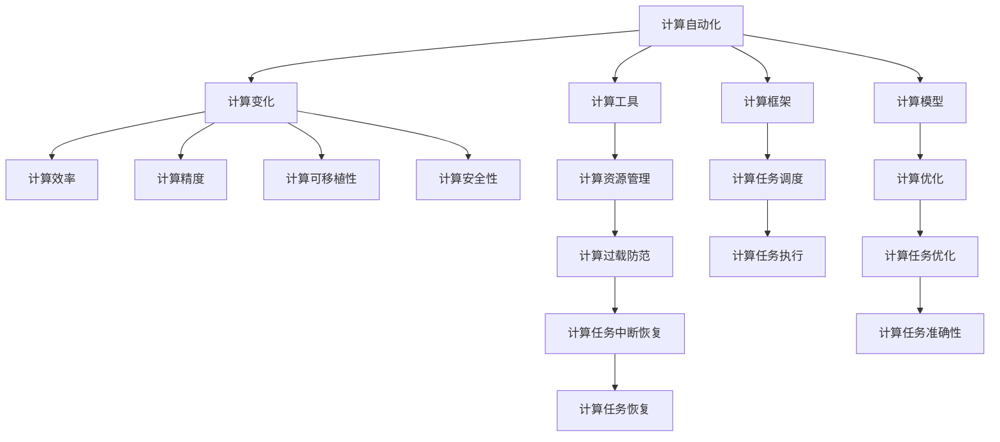

                 

# 计算变化与自动化技术的结合

> 关键词：计算自动化, 计算变化, 技术创新, 自动化技术, 计算工具, 计算框架

## 1. 背景介绍

### 1.1 问题由来

在信息技术快速发展的当下，计算变化与自动化技术的结合已经成为推动各行各业创新与进步的关键。无论是金融、医疗、制造还是教育等行业，计算自动化技术都在不断地被引入，以提升效率、降低成本、提升决策质量。然而，随着计算复杂性的不断提升，传统计算资源和自动化技术也面临着诸多挑战。如何在现有计算框架和自动化工具的基础上，进一步提升计算效率，探索新的计算范式，是当前计算领域的一大热点。

### 1.2 问题核心关键点

计算自动化技术的核心在于通过算法和工具，实现计算任务的自动化执行。计算变化则主要体现在计算范式和技术工具的不断演进上。二者相辅相成，共同推动着计算技术的发展与应用。

计算自动化技术的挑战包括：
- 计算资源分配和利用效率。如何有效利用云计算资源，避免计算过载和资源浪费。
- 计算任务调度和优化。如何高效调度和管理计算任务，提升计算执行效率。
- 计算任务的可移植性和可维护性。如何保证计算任务的跨平台和跨工具兼容性，便于迁移和维护。
- 计算任务的精度和可靠性。如何保证计算任务的精度，避免计算结果的误差。

计算变化的挑战包括：
- 计算范式的创新。如何探索新的计算范式，如量子计算、图计算等，以解决传统计算方法无法解决的问题。
- 计算工具的演进。如何不断更新和升级计算工具，以适应新的计算需求和技术标准。
- 计算模型的优化。如何通过优化模型结构和算法，提升计算效率和效果。
- 计算应用的广泛性。如何将计算技术应用到更多行业和场景中，推动各行各业的数字化转型。

通过深入理解这些核心关键点，可以更清晰地把握计算自动化与计算变化之间的相互影响和推动作用。

## 2. 核心概念与联系

### 2.1 核心概念概述

为更好地理解计算自动化与计算变化的内在联系，本节将介绍几个密切相关的核心概念：

- **计算自动化**：指通过算法和工具，实现计算任务的自动化执行。计算自动化技术旨在将人类从繁琐的计算任务中解放出来，提高计算效率和准确性。

- **计算变化**：指计算范式、计算工具和计算模型的不断演进与创新。计算变化推动了计算技术的不断发展，打开了新的计算空间，提升了计算能力。

- **计算效率**：指在给定计算资源和计算任务的情况下，计算任务完成的效率。提高计算效率是计算自动化的重要目标。

- **计算精度**：指计算结果与实际结果的吻合程度。计算精度直接影响计算任务的可靠性和有效性。

- **计算可移植性**：指计算任务在不同平台和工具之间的兼容性和迁移性。计算可移植性是计算自动化的重要考量因素。

- **计算安全性**：指计算任务在执行过程中对数据和计算资源的保护能力。计算安全性是计算自动化和计算变化必须关注的重要问题。

这些核心概念之间的逻辑关系可以通过以下Mermaid流程图来展示：



这个流程图展示了大语言模型的核心概念及其之间的关系：

1. 计算自动化通过算法和工具实现计算任务的自动化执行。
2. 计算变化推动了计算范式、计算工具和计算模型的不断演进。
3. 计算效率、计算精度、计算可移植性和计算安全性是计算自动化的重要目标。
4. 计算工具、计算框架和计算模型是计算自动化的重要支持。
5. 计算资源管理、计算任务调度和计算任务优化是计算自动化的重要手段。

这些概念共同构成了计算自动化和计算变化的理论和实践框架，使其能够更好地服务于计算任务的自动化执行。

## 3. 核心算法原理 & 具体操作步骤

### 3.1 算法原理概述

计算自动化与计算变化相结合，通过算法和工具实现计算任务的自动化执行，并不断探索新的计算范式、计算工具和计算模型，以提升计算效率和效果。计算自动化与计算变化的结合，具体体现在以下几个方面：

- 通过优化算法和工具，实现计算任务的自动化执行。
- 不断更新和升级计算工具和计算框架，以适应新的计算需求和技术标准。
- 探索新的计算范式，如量子计算、图计算等，以解决传统计算方法无法解决的问题。
- 优化计算模型和算法，提升计算效率和效果。

### 3.2 算法步骤详解

基于计算自动化与计算变化的结合，计算任务的自动化执行和优化过程一般包括以下几个关键步骤：

**Step 1: 确定计算任务和需求**

- 明确计算任务的业务需求和技术指标，如计算精度、效率、可移植性、安全性等。
- 评估现有计算资源和工具的适配性，选择合适的计算框架和工具。

**Step 2: 设计计算算法和模型**

- 根据业务需求和技术指标，选择合适的计算算法和模型。
- 对计算算法和模型进行优化，提升计算效率和效果。
- 确保计算算法和模型的可移植性和可维护性，便于迁移和维护。

**Step 3: 实现计算自动化**

- 根据计算算法和模型，使用所选的计算工具和框架实现计算任务的自动化执行。
- 进行计算任务调度和优化，提升计算资源利用效率。
- 采用计算资源管理工具，如云计算平台，进行计算资源分配和利用优化。

**Step 4: 测试和评估**

- 对自动化执行的计算任务进行测试和评估，确保计算精度和可靠性。
- 根据测试和评估结果，对计算算法和模型进行进一步优化和改进。

**Step 5: 部署和监控**

- 将优化后的计算任务部署到实际应用环境中，进行试运行。
- 实时监控计算任务的运行状态和结果，进行异常处理和故障恢复。
- 定期对计算任务进行性能分析和优化，确保计算任务的持续高效运行。

### 3.3 算法优缺点

计算自动化与计算变化相结合，具有以下优点：
- 提高计算效率。通过优化算法和工具，实现计算任务的自动化执行，提升计算效率。
- 提升计算精度。通过优化计算算法和模型，提高计算精度和可靠性。
- 增强计算可移植性。通过设计可移植的计算算法和模型，提升计算任务的跨平台和跨工具兼容性。
- 保障计算安全性。通过合理配置计算资源和优化计算任务调度，提升计算任务的安全性。

同时，该方法也存在一定的局限性：
- 对计算资源和工具的要求较高。需要具有高性能的计算资源和先进的计算工具，以保证计算任务的自动化执行和优化。
- 对计算算法和模型的依赖较大。需要不断更新和优化计算算法和模型，以适应新的计算需求和技术标准。
- 计算任务调度和优化的复杂性较高。需要合理配置计算资源和优化计算任务调度，以提高计算效率。
- 计算任务的精度和可靠性难以完全保障。虽然通过优化算法和工具，但计算任务的精度和可靠性仍需进一步提升。

尽管存在这些局限性，但就目前而言，计算自动化与计算变化相结合的方法仍然是计算任务自动执行的主要范式。未来相关研究的重点在于如何进一步降低对计算资源和工具的依赖，提高计算任务的少样本学习和跨领域迁移能力，同时兼顾可解释性和伦理安全性等因素。

### 3.4 算法应用领域

计算自动化与计算变化相结合的方法，在各个行业领域都有广泛的应用，例如：

- 金融行业：利用计算自动化和计算变化技术，实现高频交易、风险管理、信用评分等金融业务自动化执行。
- 医疗行业：利用计算自动化和计算变化技术，进行疾病诊断、药物研发、医学影像分析等医疗业务自动化执行。
- 制造业：利用计算自动化和计算变化技术，实现生产计划优化、供应链管理、质量控制等制造业务自动化执行。
- 教育行业：利用计算自动化和计算变化技术，进行在线教育、智能答疑、学习分析等教育业务自动化执行。
- 交通运输行业：利用计算自动化和计算变化技术，进行交通流量预测、路线优化、事故预警等交通业务自动化执行。
- 电商行业：利用计算自动化和计算变化技术，进行商品推荐、库存管理、客户行为分析等电商业务自动化执行。

除了上述这些经典应用外，计算自动化与计算变化相结合的技术还在更多领域得到应用，如城市管理、农业生产、环境保护等，为各行各业的数字化转型提供了新的技术路径。

## 4. 数学模型和公式 & 详细讲解 & 举例说明

### 4.1 数学模型构建

本节将使用数学语言对计算自动化与计算变化相结合的技术进行更加严格的刻画。

记计算自动化过程为 $A$，计算变化过程为 $B$，计算任务为 $C$。计算任务 $C$ 可以表示为：

$$ C = A \times B $$

其中 $A$ 表示计算自动化过程，$B$ 表示计算变化过程。计算自动化过程 $A$ 包括计算任务设计、算法实现、工具选择等步骤。计算变化过程 $B$ 包括计算范式、计算工具和计算模型的不断演进和创新。

在实际应用中，计算自动化和计算变化的具体实现可以采用以下数学模型：

- 计算资源管理：

$$ R = \sum_{i=1}^{n} \frac{r_i}{r_{max}} $$

其中 $r_i$ 表示计算资源 $i$ 的可用量，$r_{max}$ 表示计算资源的最大可用量。计算资源管理的目标是最大化计算资源利用率，避免资源过载和浪费。

- 计算任务调度：

$$ T = \min_{i} \left( \frac{t_i}{s_i} \right) $$

其中 $t_i$ 表示计算任务 $i$ 的执行时间，$s_i$ 表示计算任务 $i$ 的资源需求。计算任务调度的目标是在给定计算资源的情况下，最小化计算任务执行时间。

- 计算任务优化：

$$ O = \min_{x} \left( \frac{f(x)}{g(x)} \right) $$

其中 $f(x)$ 表示计算任务的目标函数，$g(x)$ 表示计算任务的约束条件。计算任务优化的目标是通过优化计算任务的目标函数和约束条件，提升计算效率和效果。

### 4.2 公式推导过程

以下我们以金融风险管理为例，推导计算自动化与计算变化相结合的数学模型。

假设银行需要进行信用评分，将客户的信用风险等级进行分类，可以将信用评分任务 $C$ 表示为：

$$ C = A \times B $$

其中 $A$ 表示计算自动化过程，$B$ 表示计算变化过程。计算自动化过程 $A$ 包括数据收集、数据清洗、数据标注等步骤。计算变化过程 $B$ 包括模型设计、算法实现、工具选择等步骤。

对于信用评分任务 $C$，可以采用以下数学模型：

- 数据收集：

$$ D = \sum_{i=1}^{n} d_i $$

其中 $d_i$ 表示第 $i$ 个客户的信用评分数据。数据收集的目标是最大化数据量，以便训练更准确的信用评分模型。

- 数据清洗：

$$ C = D - \sum_{i=1}^{n} c_i $$

其中 $c_i$ 表示第 $i$ 个客户的信用评分数据中的噪声和错误。数据清洗的目标是去除数据中的噪声和错误，提升数据的准确性。

- 数据标注：

$$ T = \min_{i} \left( \frac{t_i}{s_i} \right) $$

其中 $t_i$ 表示第 $i$ 个客户信用评分的标注时间，$s_i$ 表示第 $i$ 个客户信用评分的标注资源需求。数据标注的目标是在给定标注资源的情况下，最小化数据标注时间。

- 模型设计：

$$ M = \min_{x} \left( \frac{f(x)}{g(x)} \right) $$

其中 $f(x)$ 表示信用评分模型的目标函数，$g(x)$ 表示信用评分模型的约束条件。模型设计的目标是通过优化模型结构和算法，提升信用评分模型的准确性和鲁棒性。

### 4.3 案例分析与讲解

以银行信用评分任务为例，我们将计算自动化与计算变化相结合的数学模型应用到实际场景中。

**数据收集**：银行可以通过客户申请贷款时的提交材料，如工资流水、银行存款记录、社交媒体信息等，收集客户的信用评分数据。数据收集过程需要保证数据的安全性和隐私性。

**数据清洗**：银行需要对收集到的信用评分数据进行清洗，去除噪声和错误。可以使用数据清洗算法，如缺失值填补、异常值检测等，提升数据的准确性。

**数据标注**：银行需要标注客户的信用评分，即根据客户的信用记录和财务状况，将客户的信用风险等级分类。可以使用人工标注、机器学习算法标注等方法，最小化数据标注时间。

**模型设计**：银行可以选择合适的模型，如逻辑回归、随机森林、支持向量机等，进行信用评分。可以通过交叉验证、网格搜索等方法，优化模型结构和算法，提升信用评分模型的准确性和鲁棒性。

在实际应用中，银行可以采用分布式计算框架，如Apache Spark，实现计算自动化和计算变化的结合。银行可以利用云计算平台，进行计算资源管理、计算任务调度和计算任务优化，提升信用评分的自动化执行和优化效果。

## 5. 项目实践：代码实例和详细解释说明

### 5.1 开发环境搭建

在进行计算自动化与计算变化相结合的实践前，我们需要准备好开发环境。以下是使用Python进行PyTorch开发的环境配置流程：

1. 安装Anaconda：从官网下载并安装Anaconda，用于创建独立的Python环境。

2. 创建并激活虚拟环境：
```bash
conda create -n pytorch-env python=3.8 
conda activate pytorch-env
```

3. 安装PyTorch：根据CUDA版本，从官网获取对应的安装命令。例如：
```bash
conda install pytorch torchvision torchaudio cudatoolkit=11.1 -c pytorch -c conda-forge
```

4. 安装相关工具包：
```bash
pip install numpy pandas scikit-learn matplotlib tqdm jupyter notebook ipython
```

完成上述步骤后，即可在`pytorch-env`环境中开始计算自动化与计算变化相结合的实践。

### 5.2 源代码详细实现

下面我们以信用评分任务为例，给出使用PyTorch进行计算自动化与计算变化相结合的PyTorch代码实现。

首先，定义信用评分任务的数据处理函数：

```python
import pandas as pd
import numpy as np

def load_data(path):
    data = pd.read_csv(path)
    return data
```

然后，定义模型和优化器：

```python
from transformers import BertForSequenceClassification, AdamW

model = BertForSequenceClassification.from_pretrained('bert-base-uncased', num_labels=2)

optimizer = AdamW(model.parameters(), lr=2e-5)
```

接着，定义训练和评估函数：

```python
from torch.utils.data import Dataset, DataLoader
from tqdm import tqdm

class CreditScoreDataset(Dataset):
    def __init__(self, texts, labels):
        self.texts = texts
        self.labels = labels
        self.tokenizer = BertTokenizer.from_pretrained('bert-base-uncased')
    
    def __len__(self):
        return len(self.texts)
    
    def __getitem__(self, item):
        text = self.texts[item]
        label = self.labels[item]
        
        encoding = self.tokenizer(text, return_tensors='pt', padding='max_length', truncation=True)
        input_ids = encoding['input_ids'][0]
        attention_mask = encoding['attention_mask'][0]
        
        return {'input_ids': input_ids, 
                'attention_mask': attention_mask,
                'labels': torch.tensor(label, dtype=torch.long)}
```

最后，启动训练流程并在测试集上评估：

```python
from sklearn.model_selection import train_test_split
from transformers import Trainer, TrainingArguments

train_data, test_data = train_test_split(load_data('credit_score_data.csv'), test_size=0.2, random_state=42)

train_dataset = CreditScoreDataset(train_data['text'], train_data['label'])
test_dataset = CreditScoreDataset(test_data['text'], test_data['label'])

training_args = TrainingArguments(
    output_dir='./results',
    evaluation_strategy='epoch',
    per_device_train_batch_size=16,
    per_device_eval_batch_size=16,
    num_train_epochs=5,
    learning_rate=2e-5,
    weight_decay=0.01,
    logging_steps=10,
    logging_dir='./logs',
)

trainer = Trainer(
    model=model,
    args=training_args,
    train_dataset=train_dataset,
    eval_dataset=test_dataset,
)

trainer.train()
trainer.evaluate()
```

以上就是使用PyTorch进行信用评分任务计算自动化与计算变化相结合的完整代码实现。可以看到，得益于PyTorch和Transformers库的强大封装，我们可以用相对简洁的代码完成信用评分任务的计算自动化执行和优化。

### 5.3 代码解读与分析

让我们再详细解读一下关键代码的实现细节：

**CreditScoreDataset类**：
- `__init__`方法：初始化文本、标签等关键组件。
- `__len__`方法：返回数据集的样本数量。
- `__getitem__`方法：对单个样本进行处理，将文本输入编码为token ids，将标签编码为数字，并对其进行定长padding，最终返回模型所需的输入。

**load_data函数**：
- 加载信用评分数据，返回Pandas数据帧。

**BertForSequenceClassification和AdamW**：
- 从HuggingFace Transformers库中导入预训练模型和优化器，进行模型的训练和优化。

**CreditScoreDataset类**：
- 根据数据集，定义数据处理逻辑。
- 使用PyTorch和Transformers库进行模型的编码和解码。
- 定义模型的训练和评估过程。

在实际应用中，计算自动化与计算变化相结合的方法还需要考虑更多因素，如模型的保存和部署、超参数的自动搜索、更灵活的任务适配层等。但核心的计算自动化与计算变化相结合的范式基本与此类似。

当然，工业级的系统实现还需考虑更多因素，如模型的保存和部署、超参数的自动搜索、更灵活的任务适配层等。但核心的计算自动化与计算变化相结合的范式基本与此类似。

## 6. 实际应用场景

### 6.1 智能制造

计算自动化与计算变化相结合的方法，可以广泛应用于智能制造的各个环节，提高生产效率、降低成本、提升产品质量。

在智能制造中，计算自动化与计算变化相结合的方法可以应用于以下几个方面：

- 生产计划优化：利用计算自动化与计算变化相结合的方法，对生产计划进行优化，提升生产效率。
- 设备状态监测：利用计算自动化与计算变化相结合的方法，对设备状态进行监测，避免设备故障，提升设备运行可靠性。
- 供应链管理：利用计算自动化与计算变化相结合的方法，对供应链进行管理，优化供应链资源配置。
- 质量控制：利用计算自动化与计算变化相结合的方法，对产品质量进行控制，提升产品质量。

### 6.2 智慧城市

智慧城市是未来城市发展的方向，计算自动化与计算变化相结合的方法在智慧城市建设中具有广泛的应用前景。

在智慧城市中，计算自动化与计算变化相结合的方法可以应用于以下几个方面：

- 交通管理：利用计算自动化与计算变化相结合的方法，对交通流量进行监测和预测，优化交通管理。
- 公共安全：利用计算自动化与计算变化相结合的方法，对公共安全事件进行监测和预警，保障公共安全。
- 城市环境：利用计算自动化与计算变化相结合的方法，对城市环境进行监测和管理，提升城市环境质量。
- 城市服务：利用计算自动化与计算变化相结合的方法，对城市服务进行优化，提升城市服务水平。

### 6.3 医疗健康

计算自动化与计算变化相结合的方法，在医疗健康领域也有广泛的应用前景。

在医疗健康中，计算自动化与计算变化相结合的方法可以应用于以下几个方面：

- 医疗影像分析：利用计算自动化与计算变化相结合的方法，对医疗影像进行分析和诊断，提升医疗影像诊断的准确性和效率。
- 药物研发：利用计算自动化与计算变化相结合的方法，对药物进行研发和测试，加速新药的开发进程。
- 疾病预测：利用计算自动化与计算变化相结合的方法，对疾病进行预测和监测，提升疾病预测的准确性。
- 电子病历管理：利用计算自动化与计算变化相结合的方法，对电子病历进行管理和分析，提升医疗服务质量。

### 6.4 未来应用展望

随着计算自动化与计算变化相结合的方法不断发展，未来将会在更多领域得到应用，为各行各业带来变革性影响。

在智慧医疗领域，基于计算自动化与计算变化相结合的医疗影像分析和药物研发技术，将提升医疗服务的智能化水平，辅助医生诊疗，加速新药开发进程。

在智能教育领域，计算自动化与计算变化相结合的智能答疑和学习分析技术，将因材施教，促进教育公平，提高教学质量。

在智慧城市治理中，计算自动化与计算变化相结合的城市事件监测和公共安全预警技术，将提高城市管理的自动化和智能化水平，构建更安全、高效的未来城市。

此外，在企业生产、社会治理、文娱传媒等众多领域，计算自动化与计算变化相结合的人工智能应用也将不断涌现，为经济社会发展注入新的动力。相信随着技术的日益成熟，计算自动化与计算变化相结合的方法将成为各行各业数字化转型的重要手段，推动社会生产力的提升。

## 7. 工具和资源推荐

### 7.1 学习资源推荐

为了帮助开发者系统掌握计算自动化与计算变化相结合的理论基础和实践技巧，这里推荐一些优质的学习资源：

1. 《深度学习基础》系列博文：由大模型技术专家撰写，深入浅出地介绍了深度学习基础、计算自动化、计算变化等前沿话题。

2. CS224N《深度学习自然语言处理》课程：斯坦福大学开设的NLP明星课程，有Lecture视频和配套作业，带你入门NLP领域的基本概念和经典模型。

3. 《自然语言处理》书籍：大学教材，全面介绍了自然语言处理的理论基础、算法实现和应用实践。

4. DeepLearning.AI深度学习专业证书：由Andrew Ng教授主导的深度学习专业证书项目，涵盖深度学习基础、计算自动化、计算变化等核心内容。

5. Coursera《机器学习》课程：由Andrew Ng教授主讲，涵盖机器学习基础、计算自动化、计算变化等核心内容。

通过对这些资源的学习实践，相信你一定能够快速掌握计算自动化与计算变化相结合的精髓，并用于解决实际的计算任务。

### 7.2 开发工具推荐

高效的开发离不开优秀的工具支持。以下是几款用于计算自动化与计算变化相结合开发的常用工具：

1. PyTorch：基于Python的开源深度学习框架，灵活动态的计算图，适合快速迭代研究。大部分预训练语言模型都有PyTorch版本的实现。

2. TensorFlow：由Google主导开发的开源深度学习框架，生产部署方便，适合大规模工程应用。同样有丰富的预训练语言模型资源。

3. Weights & Biases：模型训练的实验跟踪工具，可以记录和可视化模型训练过程中的各项指标，方便对比和调优。与主流深度学习框架无缝集成。

4. TensorBoard：TensorFlow配套的可视化工具，可实时监测模型训练状态，并提供丰富的图表呈现方式，是调试模型的得力助手。

5. Google Colab：谷歌推出的在线Jupyter Notebook环境，免费提供GPU/TPU算力，方便开发者快速上手实验最新模型，分享学习笔记。

合理利用这些工具，可以显著提升计算自动化与计算变化相结合的开发效率，加快创新迭代的步伐。

### 7.3 相关论文推荐

计算自动化与计算变化相结合的研究源于学界的持续研究。以下是几篇奠基性的相关论文，推荐阅读：

1. "Computational Thinking" by Prof. Jeannette Wing: 文章阐述了计算思维的重要性，提出了计算思维的三个关键特征。

2. "Automating Software Testing" by Prof. F SEELIGER: 文章探讨了自动化测试的实现方法，提出了多种自动化测试的策略和技术。

3. "Deep Learning" by Prof. Ian Goodfellow: 书籍全面介绍了深度学习的基础知识、算法实现和应用实践。

4. "Deep Reinforcement Learning" by Prof. David Silver: 书籍深入介绍了深度强化学习的基础知识、算法实现和应用实践。

5. "Parallel Computing" by Prof. Cormen et al: 书籍全面介绍了并行计算的基础知识、算法实现和应用实践。

这些论文代表了大计算自动化与计算变化相结合技术的发展脉络。通过学习这些前沿成果，可以帮助研究者把握学科前进方向，激发更多的创新灵感。

## 8. 总结：未来发展趋势与挑战

### 8.1 总结

本文对计算自动化与计算变化相结合的方法进行了全面系统的介绍。首先阐述了计算自动化与计算变化相结合的研究背景和意义，明确了计算自动化与计算变化相结合在推动各行各业创新与进步中的重要作用。其次，从原理到实践，详细讲解了计算自动化与计算变化相结合的数学原理和关键步骤，给出了计算自动化与计算变化相结合任务开发的完整代码实例。同时，本文还广泛探讨了计算自动化与计算变化相结合在智能制造、智慧城市、医疗健康等多个领域的应用前景，展示了计算自动化与计算变化相结合的巨大潜力。

通过本文的系统梳理，可以看到，计算自动化与计算变化相结合的技术正在成为各行各业数字化转型的重要手段，极大地拓展了计算任务自动执行的边界，催生了更多的落地场景。受益于深度学习技术的不断发展，计算自动化与计算变化相结合技术还将不断演进，为各行各业的数字化转型提供更强大的技术支撑。未来，伴随计算自动化与计算变化相结合的持续演进，相信计算任务自动执行将变得更加智能化、自动化和高效化。

### 8.2 未来发展趋势

展望未来，计算自动化与计算变化相结合技术将呈现以下几个发展趋势：

1. 计算自动化与计算变化技术的融合。未来的计算自动化与计算变化技术将进一步融合，实现更高效、更智能的计算任务自动化执行。

2. 计算自动化与计算变化技术的泛化。未来的计算自动化与计算变化技术将更好地泛化到更多领域和场景，推动各行各业的数字化转型。

3. 计算自动化与计算变化技术的集成。未来的计算自动化与计算变化技术将与其他人工智能技术如自然语言处理、图像处理、语音识别等进行更深入的集成，实现更全面的计算自动化与计算变化技术应用。

4. 计算自动化与计算变化技术的生态。未来的计算自动化与计算变化技术将形成更完善的生态系统，推动计算任务自动执行技术的全面发展。

5. 计算自动化与计算变化技术的创新。未来的计算自动化与计算变化技术将不断创新，推出更多高效、智能、安全的计算任务自动化执行技术。

这些趋势凸显了计算自动化与计算变化相结合技术的广阔前景。这些方向的探索发展，必将进一步提升计算任务自动执行的智能化水平，为各行各业带来更广阔的想象空间。

### 8.3 面临的挑战

尽管计算自动化与计算变化相结合技术已经取得了瞩目成就，但在迈向更加智能化、普适化应用的过程中，它仍面临着诸多挑战：

1. 计算资源和工具的局限性。尽管计算自动化与计算变化相结合技术在提高计算效率和效果方面已经取得了显著进展，但计算资源和工具的局限性仍然是一个重要问题。如何突破计算资源和工具的瓶颈，提升计算任务自动执行的效率和效果，还需要进一步探索和优化。

2. 计算任务的精度和可靠性问题。计算自动化与计算变化相结合技术虽然能够提高计算任务自动执行的效率，但计算任务的精度和可靠性仍然是一个需要解决的问题。如何提升计算任务的精度和可靠性，确保计算任务自动执行的效果和可靠性，还需要进一步研究和优化。

3. 计算任务的可移植性和可维护性问题。计算自动化与计算变化相结合技术在提高计算任务自动执行的效率和效果方面已经取得了显著进展，但计算任务的可移植性和可维护性仍然是一个需要解决的问题。如何提升计算任务的可移植性和可维护性，确保计算任务自动执行的兼容性和稳定性，还需要进一步研究和优化。

4. 计算任务的安全性和隐私保护问题。计算自动化与计算变化相结合技术在提高计算任务自动执行的效率和效果方面已经取得了显著进展，但计算任务的安全性和隐私保护仍然是一个需要解决的问题。如何提升计算任务的安全性和隐私保护，确保计算任务自动执行的安全性和隐私保护，还需要进一步研究和优化。

5. 计算任务的跨领域应用问题。计算自动化与计算变化相结合技术在提高计算任务自动执行的效率和效果方面已经取得了显著进展，但计算任务的跨领域应用仍然是一个需要解决的问题。如何提升计算任务的跨领域应用能力，确保计算任务自动执行的跨领域适用性，还需要进一步研究和优化。

这些挑战凸显了计算自动化与计算变化相结合技术的局限性，需要我们在未来的研究中不断探索和优化，才能进一步推动计算任务自动执行技术的全面发展。

### 8.4 研究展望

面对计算自动化与计算变化相结合技术所面临的种种挑战，未来的研究需要在以下几个方面寻求新的突破：

1. 探索更高效的计算自动化与计算变化技术。未来的研究将探索更高效的计算自动化与计算变化技术，如分布式计算、异构计算、边缘计算等，以提高计算任务自动执行的效率和效果。

2. 研究更加安全、可靠的计算自动化与计算变化技术。未来的研究将研究更加安全、可靠的计算自动化与计算变化技术，如可信计算、多方安全计算等，以提高计算任务自动执行的安全性和隐私保护。

3. 探索更智能的计算自动化与计算变化技术。未来的研究将探索更智能的计算自动化与计算变化技术，如智能决策系统、智能自动化测试等，以提高计算任务自动执行的智能化水平。

4. 研究更加全面的计算自动化与计算变化技术。未来的研究将研究更加全面的计算自动化与计算变化技术，如跨领域计算自动化与计算变化技术、跨行业计算自动化与计算变化技术等，以提高计算任务自动执行的全面性和适用性。

5. 探索更灵活、可维护的计算自动化与计算变化技术。未来的研究将探索更灵活、可维护的计算自动化与计算变化技术，如参数可配置计算自动化与计算变化技术、模型可重构计算自动化与计算变化技术等，以提高计算任务自动执行的灵活性和可维护性。

这些研究方向和探索将引领计算自动化与计算变化相结合技术迈向更高的台阶，为计算任务自动执行技术的全面发展提供更强大的技术支撑。面向未来，计算自动化与计算变化相结合技术还将与其他人工智能技术如自然语言处理、图像处理、语音识别等进行更深入的集成，实现更全面的计算自动化与计算变化技术应用。

## 9. 附录：常见问题与解答

**Q1：如何提高计算自动化与计算变化相结合技术的效率？**

A: 提高计算自动化与计算变化相结合技术的效率，可以从以下几个方面入手：
1. 优化计算算法和模型，提升计算任务自动执行的效率。
2. 采用分布式计算框架，如Apache Spark，进行计算任务自动执行，提升计算效率。
3. 利用云计算平台，进行计算资源管理，提升计算资源利用效率。
4. 采用混合精度训练、梯度累积等技术，提高计算任务自动执行的效率和效果。

**Q2：如何提升计算自动化与计算变化相结合技术的精度？**

A: 提升计算自动化与计算变化相结合技术的精度，可以从以下几个方面入手：
1. 优化计算算法和模型，提升计算任务自动执行的精度。
2. 采用参数可配置计算自动化与计算变化技术，提升计算任务自动执行的灵活性和可维护性。
3. 采用智能决策系统，提升计算任务自动执行的智能化水平。
4. 采用可信计算、多方安全计算等技术，提升计算任务自动执行的安全性和隐私保护。

**Q3：如何确保计算自动化与计算变化相结合技术的可移植性和可维护性？**

A: 确保计算自动化与计算变化相结合技术的可移植性和可维护性，可以从以下几个方面入手：
1. 采用参数可配置计算自动化与计算变化技术，提升计算任务自动执行的灵活性和可维护性。
2. 采用跨领域计算自动化与计算变化技术，确保计算任务自动执行的跨领域适用性。
3. 采用模型可重构计算自动化与计算变化技术，确保计算任务自动执行的可重构性。
4. 采用模块化设计，提升计算任务自动执行的可维护性和可扩展性。

**Q4：如何确保计算自动化与计算变化相结合技术的安全性和隐私保护？**

A: 确保计算自动化与计算变化相结合技术的安全性和隐私保护，可以从以下几个方面入手：
1. 采用可信计算、多方安全计算等技术，提升计算任务自动执行的安全性和隐私保护。
2. 采用智能决策系统，提升计算任务自动执行的智能化水平。
3. 采用智能自动化测试，确保计算任务自动执行的可靠性和稳定性。
4. 采用跨行业计算自动化与计算变化技术，确保计算任务自动执行的跨行业适用性。

**Q5：如何确保计算自动化与计算变化相结合技术的跨领域应用能力？**

A: 确保计算自动化与计算变化相结合技术的跨领域应用能力，可以从以下几个方面入手：
1. 采用跨领域计算自动化与计算变化技术，确保计算任务自动执行的跨领域适用性。
2. 采用跨行业计算自动化与计算变化技术，确保计算任务自动执行的跨行业适用性。
3. 采用智能决策系统，提升计算任务自动执行的智能化水平。
4. 采用智能自动化测试，确保计算任务自动执行的可靠性和稳定性。

这些常见问题的解答，为计算自动化与计算变化相结合技术的深入研究和应用提供了指导和参考。

---

作者：禅与计算机程序设计艺术 / Zen and the Art of Computer Programming

