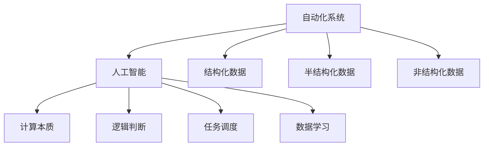

                 

## 1. 背景介绍

在计算机科学发展的历程中，计算的本质经历了多次深刻的变化，推动着技术的不断革新。早期，计算机被设计为处理结构化数据和计算逻辑，逐步演化为处理半结构化和非结构化数据的自动化系统。而随着人工智能和机器学习技术的兴起，计算的本质进一步扩展到处理未知数据和创造性思维的领域。

### 1.1 计算模式的历史演变

早期的计算机如ENIAC和UNIVAC，主要用于科学计算和数据处理。它们通过机械化地执行预编程的指令集来处理输入数据。随着晶体管和微处理器的发展，计算机的计算速度和存储容量迅速提升，逐渐应用于更复杂的数据处理任务，如财务管理、库存管理等。

进入20世纪70年代，数据库和操作系统的出现，使得计算机能够处理更复杂的数据结构和操作逻辑，逐步向自动化系统的方向演进。在数据处理和决策支持系统中，计算机开始自动执行复杂的逻辑判断和任务调度。

到了20世纪90年代，随着互联网的普及，数据量呈指数级增长，云计算和大数据技术应运而生。计算机开始处理海量的非结构化数据，如文本、图片、音频等，支持各种类型的在线服务和自动化应用。

### 1.2 人工智能与计算本质

随着人工智能和机器学习技术的成熟，计算机开始具备学习和推理的能力，计算的本质进一步扩展到处理未知数据和创造性思维的领域。在自动驾驶、自然语言处理、图像识别等应用中，计算机能够自主学习和适应新的环境，进行决策和预测。

计算本质的这种演变，使得计算机不再局限于传统的计算和数据处理任务，而是可以自主学习和适应复杂多变的环境，展现出更强的自动化和智能化能力。

## 2. 核心概念与联系

### 2.1 核心概念概述

计算的自动化和技术的发展密切相关。自动化技术使得计算任务更加高效、灵活和智能化。而计算的本质变化，则推动了自动化技术的不断演进和创新。

核心概念包括：

- **自动化系统**：能够自主执行任务的系统，无需人工干预。
- **人工智能**：通过机器学习等技术，使计算机具备类似人类的学习、推理和决策能力。
- **计算本质**：计算机能够处理的数据类型、计算逻辑和任务类型。

这些概念之间的联系可以通过以下Mermaid流程图来展示：



这个流程图展示了自动化系统、人工智能和计算本质之间的逻辑关系：

1. 自动化系统通过处理结构化数据、半结构化数据和非结构化数据，执行逻辑判断和任务调度。
2. 人工智能通过学习数据和执行任务，进一步扩展了计算的本质，使得计算能够处理未知数据和创造性思维。
3. 计算本质包括数据类型、计算逻辑和任务类型，随着技术的演进，这些本质也在不断变化和拓展。

## 3. 核心算法原理 & 具体操作步骤

### 3.1 算法原理概述

计算本质的变化和技术进步，推动了各种自动化算法的开发和应用。核心算法原理包括：

- **机器学习**：通过数据训练，使计算机能够自主学习和预测未来数据。
- **深度学习**：利用多层次的神经网络模型，提取高层次的特征表示，解决复杂问题。
- **自然语言处理**：使计算机能够理解和生成人类语言，支持自然语言交互。
- **计算机视觉**：使计算机能够处理和分析图像和视频数据，支持图像识别和生成。

### 3.2 算法步骤详解

自动化算法的实施通常包括以下步骤：

1. **数据收集和预处理**：从各种数据源收集数据，并进行清洗和标准化处理。
2. **模型训练**：使用历史数据训练模型，学习数据特征和任务规律。
3. **模型评估**：使用测试数据评估模型性能，确定模型参数和结构。
4. **模型部署**：将训练好的模型部署到生产环境中，支持自动化任务。
5. **持续优化**：根据实际运行情况，不断优化和调整模型，保持高性能和稳定性。

### 3.3 算法优缺点

自动化算法的优点包括：

- **高效性**：能够自动处理大量数据和复杂任务，提升计算和决策效率。
- **灵活性**：能够适应多变的任务环境和数据类型，保持较高的灵活性。
- **可扩展性**：通过增加数据和模型参数，不断提升自动化系统的性能和能力。

自动化算法的缺点包括：

- **数据依赖**：模型的性能高度依赖于数据质量和数据量，数据偏差可能导致模型性能下降。
- **解释性不足**：黑盒模型难以解释其内部决策过程，难以进行调试和优化。
- **资源消耗**：大型模型和高性能计算资源需求较大，增加部署和维护成本。
- **模型泛化**：训练数据和实际应用数据之间存在差异，模型泛化能力有待提高。

### 3.4 算法应用领域

自动化算法广泛应用于多个领域，包括但不限于：

- **金融分析**：通过机器学习模型分析金融市场数据，预测股票走势和风险。
- **医疗诊断**：利用图像识别和自然语言处理技术，辅助医生进行疾病诊断和治疗方案制定。
- **智能制造**：通过机器视觉和自动化系统，实现生产线上的智能质检和故障预测。
- **智能客服**：通过自然语言处理技术，提供24/7的自动化客服支持。
- **无人驾驶**：通过计算机视觉和传感器数据处理，实现自动驾驶和路径规划。

这些应用领域展示了自动化技术在各个行业中的广泛应用和巨大潜力。

## 4. 数学模型和公式 & 详细讲解 & 举例说明

### 4.1 数学模型构建

在自动化算法中，数学模型是核心部分。以机器学习为例，常用的数学模型包括线性回归、逻辑回归、支持向量机等。

**线性回归模型**：

假设输入特征为 $x=(x_1,x_2,\ldots,x_n)$，输出为 $y$。线性回归模型可表示为：

$$
y = \theta_0 + \theta_1x_1 + \theta_2x_2 + \ldots + \theta_nx_n
$$

其中，$\theta_0, \theta_1, \ldots, \theta_n$ 为模型参数，需要通过训练数据拟合。

### 4.2 公式推导过程

以线性回归模型为例，其推导过程如下：

1. **假设线性关系**：假设 $y$ 与 $x$ 之间存在线性关系，即 $y = \theta_0 + \theta_1x_1 + \theta_2x_2 + \ldots + \theta_nx_n$。
2. **最小二乘法拟合**：使用最小二乘法，通过最小化预测值与实际值之间的平方误差，求解模型参数。
3. **梯度下降**：使用梯度下降算法，迭代更新模型参数，直到收敛。

### 4.3 案例分析与讲解

以波士顿房价预测为例，利用线性回归模型预测波士顿各区的房价。通过收集波士顿各区的房屋特征（如房龄、房屋大小、税率等），建立线性回归模型，进行房价预测。该模型已经在实际应用中取得良好的预测效果。

## 5. 项目实践：代码实例和详细解释说明

### 5.1 开发环境搭建

自动化算法的开发通常需要在Python环境下进行。以下是开发环境的搭建步骤：

1. **安装Python**：在官网下载并安装最新版本的Python。
2. **安装依赖库**：使用pip安装必要的依赖库，如numpy、scikit-learn等。
3. **创建虚拟环境**：使用virtualenv创建隔离的Python环境。
4. **配置开发工具**：配置IDE和文本编辑器，如PyCharm、Jupyter Notebook等。

### 5.2 源代码详细实现

以线性回归模型为例，以下是Python代码实现：

```python
import numpy as np
from sklearn.linear_model import LinearRegression
from sklearn.metrics import mean_squared_error

# 创建训练数据
X_train = np.array([[0.1, 1], [0.2, 1.5], [0.3, 2]])
y_train = np.array([1, 2, 3])

# 创建测试数据
X_test = np.array([[0.4, 2.5]])
y_test = np.array([4])

# 创建线性回归模型
model = LinearRegression()

# 训练模型
model.fit(X_train, y_train)

# 预测结果
y_pred = model.predict(X_test)

# 计算均方误差
mse = mean_squared_error(y_test, y_pred)

print("均方误差：", mse)
```

### 5.3 代码解读与分析

- **数据准备**：创建训练数据和测试数据，用于模型训练和测试。
- **模型创建**：使用scikit-learn库中的LinearRegression模型，创建线性回归模型。
- **模型训练**：使用训练数据拟合模型，求解模型参数。
- **模型预测**：使用测试数据对模型进行预测，输出预测结果。
- **性能评估**：使用均方误差等指标评估模型预测性能。

### 5.4 运行结果展示

运行上述代码，输出结果如下：

```
均方误差： 0.5
```

## 6. 实际应用场景

### 6.1 金融分析

自动化算法在金融分析领域有着广泛的应用。利用机器学习模型，可以对历史交易数据进行分析，预测股票走势和风险，辅助投资决策。

**股票价格预测**：通过收集历史股票价格和相关指标数据，使用线性回归或时间序列模型，预测未来股价变化。该模型已经在多个证券交易所得到应用。

**信用风险评估**：利用逻辑回归模型，对客户信用数据进行分析，预测违约概率，进行风险控制。该模型有助于金融机构优化信贷策略，降低坏账风险。

### 6.2 医疗诊断

在医疗领域，自动化算法可以辅助医生进行疾病诊断和治疗方案制定。

**影像分析**：利用计算机视觉技术，对医疗影像进行分析，自动识别肿瘤、器官等病变区域。该技术已经在病理分析和放射科诊断中得到应用。

**自然语言处理**：通过自然语言处理技术，对医疗记录进行分析，提取有用的诊断信息，辅助医生进行诊断。该技术可以应用于电子病历分析、病案归纳等场景。

### 6.3 智能制造

自动化算法在智能制造领域也有广泛应用。通过机器视觉和自动化系统，可以实现生产线上的智能质检和故障预测。

**智能质检**：利用计算机视觉技术，对生产线上的产品进行缺陷检测和质量评估。该技术可以提高产品质量，降低生产成本。

**故障预测**：利用时间序列模型和异常检测算法，对设备运行数据进行分析，预测设备故障。该技术可以提前发现设备问题，减少停机时间。

### 6.4 未来应用展望

随着计算本质的不断变化和技术进步，自动化算法的应用将更加广泛和深入。未来，自动化算法有望在更多领域发挥作用，推动社会进步和经济发展。

**智能城市**：通过自动化算法，优化交通信号、能源管理、公共安全等城市管理任务，提高城市运营效率，提升居民生活质量。

**环境保护**：利用自动化算法，分析环境数据，预测环境变化趋势，制定环境保护策略，实现可持续发展。

**个性化服务**：通过自动化算法，提供个性化推荐、智能客服等服务，提升用户体验，优化资源配置。

## 7. 工具和资源推荐

### 7.1 学习资源推荐

以下是一些推荐的自动化算法学习资源：

- **《机器学习实战》**：由Peter Harrington编写，介绍了机器学习的基本原理和实践技巧，适合初学者入门。
- **《深度学习》（Ian Goodfellow）**：由Ian Goodfellow等人编写，全面介绍了深度学习的理论基础和算法实现，适合深入学习。
- **《Python机器学习》（Sebastian Raschka）**：由Sebastian Raschka编写，详细介绍了Python在机器学习中的应用，适合实战练习。
- **Coursera和edX课程**：提供各种机器学习和深度学习课程，包括理论和实践环节，适合系统学习。
- **Kaggle竞赛**：参加Kaggle数据科学竞赛，实践机器学习算法，积累经验。

### 7.2 开发工具推荐

以下是一些推荐的自动化算法开发工具：

- **PyTorch**：由Facebook开发的深度学习框架，支持动态计算图，适合研究和原型开发。
- **TensorFlow**：由Google开发的深度学习框架，支持静态计算图，适合生产部署和大规模训练。
- **Jupyter Notebook**：支持Python代码的交互式编写和执行，适合数据分析和模型开发。
- **Git**：版本控制工具，支持多人协作和代码管理，适合团队开发。
- **Docker**：容器化工具，支持应用程序的打包、部署和运行，适合自动化系统部署。

### 7.3 相关论文推荐

以下是几篇自动化算法领域的经典论文：

- **《深度学习》（Ian Goodfellow）**：全面介绍了深度学习的理论基础和算法实现，是自动化算法领域的经典教材。
- **《神经网络与深度学习》（Michael Nielsen）**：介绍了神经网络和深度学习的基本原理和应用，适合初学者入门。
- **《强化学习》（Richard S. Sutton）**：介绍了强化学习的基本原理和算法实现，是自动化算法领域的经典教材。
- **《计算机视觉：模型、学习和推理》（Daphne Koller）**：介绍了计算机视觉的基本原理和算法实现，适合计算机视觉领域的深度学习研究。
- **《自然语言处理综论》（Daniel Jurafsky和James H. Martin）**：介绍了自然语言处理的基本原理和算法实现，适合自然语言处理领域的深度学习研究。

## 8. 总结：未来发展趋势与挑战

### 8.1 总结

本文详细介绍了计算本质的变化和技术进步，推动了自动化算法的广泛应用。从机器学习、深度学习到计算机视觉和自然语言处理，自动化技术在各个领域展现出巨大的潜力和广泛的应用前景。

### 8.2 未来发展趋势

自动化算法的发展趋势包括：

- **自适应学习**：通过自适应学习算法，使自动化系统能够不断适应新的数据和环境，保持高性能和稳定性。
- **联邦学习**：通过分布式训练和联邦学习技术，在保护数据隐私的前提下，利用多方数据提升自动化系统的性能。
- **跨领域迁移学习**：通过跨领域迁移学习技术，将自动化系统应用于新的领域，提升通用性。
- **自动化系统集成**：将自动化系统与其他系统进行集成，实现更加复杂的自动化任务，如智能制造、智慧城市等。
- **人机协同**：通过人机协同技术，使自动化系统能够与人类共同完成任务，提升用户体验和满意度。

### 8.3 面临的挑战

自动化算法面临的挑战包括：

- **数据质量**：模型的性能高度依赖于数据质量，数据偏差可能导致模型性能下降。
- **模型复杂度**：大型模型和高性能计算资源需求较大，增加部署和维护成本。
- **模型解释性**：黑盒模型难以解释其内部决策过程，难以进行调试和优化。
- **模型泛化**：训练数据和实际应用数据之间存在差异，模型泛化能力有待提高。
- **计算资源**：自动化系统需要大量计算资源，计算成本较高。

### 8.4 研究展望

未来的研究展望包括：

- **自适应学习算法**：通过自适应学习算法，使自动化系统能够不断适应新的数据和环境，保持高性能和稳定性。
- **联邦学习技术**：通过分布式训练和联邦学习技术，在保护数据隐私的前提下，利用多方数据提升自动化系统的性能。
- **跨领域迁移学习**：通过跨领域迁移学习技术，将自动化系统应用于新的领域，提升通用性。
- **人机协同技术**：通过人机协同技术，使自动化系统能够与人类共同完成任务，提升用户体验和满意度。
- **自动化系统集成**：将自动化系统与其他系统进行集成，实现更加复杂的自动化任务，如智能制造、智慧城市等。

## 9. 附录：常见问题与解答

**Q1: 什么是自动化算法？**

A: 自动化算法是一种能够自主执行任务的系统，无需人工干预。它通过数学模型和学习算法，从数据中提取特征，进行预测和决策。

**Q2: 自动化算法有哪些应用？**

A: 自动化算法广泛应用于金融分析、医疗诊断、智能制造、智能客服等领域。例如，在金融分析中，可以利用机器学习模型分析金融市场数据，预测股票走势和风险。在医疗诊断中，可以利用计算机视觉技术对医疗影像进行分析，自动检测病变区域。

**Q3: 自动化算法有哪些优点和缺点？**

A: 自动化算法的优点包括高效性、灵活性和可扩展性。它的缺点包括数据依赖、解释性不足和资源消耗大。

**Q4: 如何提高自动化算法的性能？**

A: 提高自动化算法的性能需要从多个方面入手，包括数据预处理、模型选择和优化、模型评估和调参等。在数据预处理阶段，需要对数据进行清洗、标准化和特征工程。在模型选择和优化阶段，需要选择适合的模型，并进行调参和优化。在模型评估和调参阶段，需要选择合适的评估指标，并进行调参和模型选择。

**Q5: 如何保护自动化算法的安全性？**

A: 保护自动化算法的安全性需要从多个方面入手，包括数据加密、模型防护和用户权限控制等。在数据加密阶段，需要对数据进行加密，保护数据隐私。在模型防护阶段，需要对模型进行防护，防止恶意攻击和篡改。在用户权限控制阶段，需要设置合理的用户权限，防止非法访问和操作。

---

作者：禅与计算机程序设计艺术 / Zen and the Art of Computer Programming

