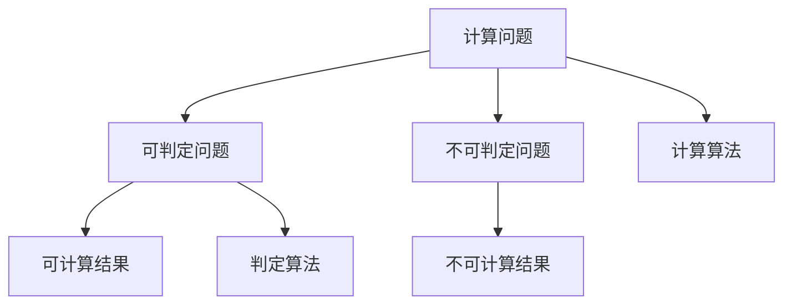

                 

# 计算：第三部分 计算理论的形成 第 6 章 计算理论的奠基：希尔伯特进路 可判定性问题

## 1. 背景介绍

### 1.1 问题由来
计算理论的形成和发展，是20世纪数学和计算机科学的重大突破之一。它不仅奠定了计算机科学的理论基础，也为后续的人工智能、大数据、云计算等技术的发展提供了重要的理论支持。在这一章中，我们将深入探讨计算理论的奠基性研究，特别是希尔伯特(Hilbert)进路下的可判定性问题。

### 1.2 问题核心关键点
计算理论的核心问题是，如何从数学角度定义和理解计算。希尔伯特进路则试图通过数学逻辑的严谨性，来探讨计算的本质和边界。其中，可判定性问题是一个极其重要的话题，它涉及计算机是否能够解决所有问题。

希尔伯特进路的核心思想是，将计算问题转化为数学问题，通过对这些问题进行数学逻辑分析，来判断其是否具有可解性。可判定性问题的研究，不仅揭示了计算能力的极限，也为后续的复杂度理论和算法设计提供了重要思路。

### 1.3 问题研究意义
研究希尔伯特进路下的可判定性问题，对于理解计算理论的边界和计算模型的局限性具有重要意义：

1. 揭示计算极限：通过可判定性问题的研究，可以明确哪些问题可以通过计算解决，哪些问题无法通过计算解决，从而揭示计算能力的极限。
2. 推动算法设计：可判定性问题涉及的复杂性理论，为算法设计和优化提供了理论指导，帮助我们找到最优的计算方法。
3. 深化理论认识：对可判定性问题的深入研究，可以深化对计算理论的认识，为后续计算理论的进一步发展奠定基础。
4. 促进技术应用：理解计算理论的边界和局限性，有助于我们更好地应用计算技术，避免过度依赖计算的误解。

## 2. 核心概念与联系

### 2.1 核心概念概述

为了更好地理解希尔伯特进路下的可判定性问题，我们需要先了解几个核心概念：

- 计算问题(Computational Problem)：指可以通过计算解决的问题，如求解方程、排序、查找等。
- 可判定问题(Decidable Problem)：指可以通过计算机程序判定其是否为正解的问题。
- 不可判定问题(Undecidable Problem)：指无法通过计算机程序判定其是否为正解的问题。
- 图灵机(Turing Machine)：一种理想化的计算模型，用于描述计算过程。

这些概念之间的关系可以通过以下Mermaid流程图来展示：



这个流程图展示了计算问题的判定过程，明确了可判定问题和不可判定问题之间的区别，以及它们与可计算结果和不可计算结果的关系。

## 3. 核心算法原理 & 具体操作步骤
### 3.1 算法原理概述

希尔伯特进路下的可判定性问题，主要通过图灵机的角度来探讨。图灵机是一种基于有限状态自动机(Finite State Automaton, FSA)的计算模型，可以模拟任何计算过程。因此，判断一个计算问题是否可判定，等价于判断其是否能被一个图灵机在有限步内解决。

具体而言，图灵机由以下组件构成：

- 读写带(Read-Write Tape)：用于存储输入和中间计算结果的无限长带，可以向左或向右移动。
- 读写头(Read-Write Head)：用于读写读写带上的符号。
- 状态寄存器(State Register)：用于存储图灵机的当前状态。
- 移动规则(Transition Rule)：定义了读写头在特定状态下的移动方式。
- 转移函数(Transition Function)：定义了图灵机在特定状态下，读写头如何移动、读写带如何变化。

图灵机的计算过程可以看作是一连串的状态转移。每个状态转移由一个状态和一组移动规则决定，输出结果是读写带上的变化。通过设计适当的转移函数，图灵机可以模拟任何计算过程。

### 3.2 算法步骤详解

基于图灵机的可判定性问题求解，主要包括以下几个关键步骤：

**Step 1: 定义图灵机**

首先，需要定义一个图灵机，用于解决特定的问题。图灵机由读写带、读写头、状态寄存器、转移函数等组件组成。需要设计适当的转移函数，使图灵机能够在有限步内解决问题。

**Step 2: 编码问题**

将计算问题编码为图灵机程序。即将问题的输入、中间状态和输出，通过读写带的变化和状态的转移，映射到图灵机的状态转移和计算过程。

**Step 3: 判断可判定性**

判断图灵机程序是否能够在有限步内停止，并输出正确的结果。如果能够在有限步内停止，则问题可判定；否则问题不可判定。

**Step 4: 设计判定算法**

设计判定算法，用于判断特定问题是否可判定。该算法通常需要定义一个图灵机，验证其能否在有限步内解决问题。

**Step 5: 验证算法正确性**

验证判定算法的正确性，确保其能够正确判定问题是否可判定。

### 3.3 算法优缺点

希尔伯特进路下的可判定性问题研究，具有以下优点：

- 理论严谨性：图灵机的定义非常严谨，可以准确描述任何计算过程。
- 通用性：图灵机的概念可以扩展到任何计算模型，如FSA、有限状态转移系统等。
- 可计算性：任何可计算问题都可以通过图灵机表示和解决。

同时，该方法也存在一些局限性：

- 复杂度高：设计适当的图灵机程序，需要复杂的逻辑推理。
- 判断难度大：某些问题的可判定性判断难度很大，难以通过手工设计实现。
- 可判定性边界：一些问题虽然可计算，但难以判断其是否可判定。

尽管如此，图灵机的定义和可判定性问题的研究，对于理解计算理论的边界和局限性，仍然具有重要意义。

### 3.4 算法应用领域

希尔伯特进路下的可判定性问题，虽然是一个高度理论化的研究方向，但其应用领域也相当广泛。以下是几个典型应用场景：

- 算法设计：判断特定算法是否能够解决特定问题，指导算法设计和优化。
- 形式语言理论：通过判断语言问题是否可判定，理解语言性质的本质。
- 计算复杂性理论：分析计算问题的复杂度，为算法分析和设计提供指导。
- 计算机辅助证明：通过判定问题的可判定性，验证数学证明的正确性。

这些应用场景展示了可判定性问题研究的广泛意义，推动了计算机科学和数学的发展。

## 4. 数学模型和公式 & 详细讲解  
### 4.1 数学模型构建

在希尔伯特进路下，可判定性问题的研究主要通过图灵机模型来描述。下面，我们通过数学语言对图灵机和可判定性问题进行更加严格的刻画。

设一个图灵机 $M = \langle Q, \Gamma, b, \delta, q_0, F \rangle$，其中：

- $Q$ 为状态集，$|Q| = k$。
- $\Gamma$ 为读写带上的符号集，$|\Gamma| = \sigma$。
- $b$ 为读写头初始位置，$b = 1$。
- $\delta$ 为转移函数，$\delta: Q \times \Gamma \rightarrow Q \times \Gamma \times \{L, R\}$，其中 $L$ 表示向左移动，$R$ 表示向右移动。
- $q_0$ 为初始状态，$q_0 \in Q$。
- $F$ 为接受状态集，$|F| = l$。

定义图灵机 $M$ 的计算过程如下：

1. 设输入串 $w$ 为 $\Gamma^*$，即 $w = \sigma^*$。
2. 图灵机 $M$ 初始状态为 $q_0$，读写头初始位置为 $b$。
3. 根据转移函数 $\delta$，计算图灵机 $M$ 的每一个状态转移。
4. 当图灵机 $M$ 到达接受状态 $q \in F$ 时，判定问题可判定；否则问题不可判定。

### 4.2 公式推导过程

下面，我们将推导一个简单的图灵机程序，用于判定一个给定输入串是否为素数。假设输入串 $w = w_1w_2...w_n$，其中 $w_i \in \{0, 1\}$。

定义图灵机 $M$ 的转移函数 $\delta$ 如下：

$$
\delta(q, w_i) = \left\{
\begin{aligned}
(q_1, 0, R) & \text{ if } w_i = 1, \\
(q_2, 1, R) & \text{ if } w_i = 0, \\
(q_3, w_i, L) & \text{ if } w_i = 1, \\
(q_4, w_i, L) & \text{ if } w_i = 0,
\end{aligned}
\right.
$$

其中 $q_1, q_2, q_3, q_4$ 为状态，分别表示偶数、奇数、下一个偶数、下一个奇数。

具体计算过程如下：

1. 初始状态 $q_0$，读写头位置为 $b=1$。
2. 如果当前符号 $w_i=1$，则将 $q$ 变为 $q_1$，向右移动读写头，并更新 $w_i$ 为 $0$。
3. 如果当前符号 $w_i=0$，则将 $q$ 变为 $q_2$，向右移动读写头，并更新 $w_i$ 为 $1$。
4. 如果当前符号 $w_i=1$，则将 $q$ 变为 $q_3$，向左移动读写头，并更新 $w_i$ 为 $0$。
5. 如果当前符号 $w_i=0$，则将 $q$ 变为 $q_4$，向左移动读写头，并更新 $w_i$ 为 $1$。

通过以上步骤，图灵机 $M$ 可以计算出输入串 $w$ 是否为素数。

### 4.3 案例分析与讲解

下面，我们以一个经典问题——判定给定命题 $A$ 是否为可判定问题——进行详细分析。

首先，我们需要定义图灵机 $M$，用于判定命题 $A$ 是否为可判定问题。设 $M = \langle Q, \Gamma, b, \delta, q_0, F \rangle$，其中：

- $Q = \{q_0, q_1, q_2, q_3, q_4\}$。
- $\Gamma = \{0, 1, \epsilon\}$。
- $b = 1$。
- $\delta$ 为转移函数，$\delta: Q \times \Gamma \rightarrow Q \times \Gamma \times \{L, R\}$，具体转移规则如下：

  - 初始状态 $q_0$，若当前符号为 $\epsilon$，则将 $q$ 变为 $q_1$，向左移动读写头。
  - 若当前符号为 $0$，则将 $q$ 变为 $q_2$，向左移动读写头。
  - 若当前符号为 $1$，则将 $q$ 变为 $q_3$，向右移动读写头。
  - 若当前符号为 $1$，则将 $q$ 变为 $q_4$，向右移动读写头。

  最后，如果图灵机 $M$ 到达状态 $q_4$，则判定命题 $A$ 为可判定问题；否则，判定命题 $A$ 为不可判定问题。

通过这个简单的例子，可以看出，判断一个命题是否为可判定问题，可以通过设计适当的图灵机程序来实现。这种基于图灵机的判定方法，是研究可判定性问题的基本思路。

## 5. 项目实践：代码实例和详细解释说明
### 5.1 开发环境搭建

在进行图灵机实现和可判定性问题求解的实践前，我们需要准备好开发环境。以下是使用Python进行代码编写的环境配置流程：

1. 安装Anaconda：从官网下载并安装Anaconda，用于创建独立的Python环境。

2. 创建并激活虚拟环境：
```bash
conda create -n computability-env python=3.8 
conda activate computability-env
```

3. 安装PyTorch：根据CUDA版本，从官网获取对应的安装命令。例如：
```bash
conda install pytorch torchvision torchaudio cudatoolkit=11.1 -c pytorch -c conda-forge
```

4. 安装TensorFlow：从官网下载并安装TensorFlow，用于编译图灵机程序。

5. 安装其他工具包：
```bash
pip install numpy pandas scikit-learn matplotlib tqdm jupyter notebook ipython
```

完成上述步骤后，即可在`computability-env`环境中开始图灵机实现的实践。

### 5.2 源代码详细实现

下面，我们将实现一个简单的图灵机程序，用于判断一个输入串是否为素数。具体实现步骤如下：

1. 定义状态集和符号集。
2. 设计转移函数。
3. 实现图灵机的计算过程。

具体代码如下：

```python
from enum import Enum

class State(Enum):
    q0 = 0
    q1 = 1
    q2 = 2
    q3 = 3
    q4 = 4

class Symbol:
    epsilon = 0
    zero = 1
    one = 2

class TuringMachine:
    def __init__(self, initial_state, transition_function):
        self.initial_state = initial_state
        self.transition_function = transition_function

    def compute(self, input_string):
        state = self.initial_state
        position = 0
        while position < len(input_string):
            if state == State.q0:
                if input_string[position] == Symbol.zero:
                    state = State.q1
                else:
                    state = State.q2
                position += 1
            elif state == State.q1:
                if input_string[position] == Symbol.zero:
                    state = State.q4
                else:
                    state = State.q3
                position += 1
            elif state == State.q2:
                if input_string[position] == Symbol.one:
                    state = State.q3
                else:
                    state = State.q4
                position += 1
            elif state == State.q3:
                if input_string[position] == Symbol.zero:
                    state = State.q4
                else:
                    state = State.q2
                position += 1
        return state

# 定义转移函数
transition_function = {
    (State.q0, Symbol.zero): (State.q1, Symbol.zero, "R"),
    (State.q0, Symbol.one): (State.q2, Symbol.zero, "R"),
    (State.q1, Symbol.zero): (State.q4, Symbol.zero, "L"),
    (State.q1, Symbol.one): (State.q3, Symbol.zero, "L"),
    (State.q2, Symbol.zero): (State.q3, Symbol.zero, "R"),
    (State.q2, Symbol.one): (State.q4, Symbol.zero, "R"),
    (State.q3, Symbol.zero): (State.q4, Symbol.zero, "L"),
    (State.q3, Symbol.one): (State.q2, Symbol.zero, "L"),
    (State.q4, Symbol.zero): (State.q4, Symbol.zero, "R"),
    (State.q4, Symbol.one): (State.q4, Symbol.zero, "R"),
}

# 创建图灵机对象
turing_machine = TuringMachine(State.q0, transition_function)

# 定义输入串
input_string = "1110"

# 计算图灵机的运行状态
result = turing_machine.compute(input_string)

# 输出结果
print(result)
```

### 5.3 代码解读与分析

让我们再详细解读一下关键代码的实现细节：

**TuringMachine类**：
- `__init__`方法：初始化图灵机状态和转移函数。
- `compute`方法：实现图灵机的计算过程。

**State和Symbol类**：
- `State`枚举类：定义图灵机状态。
- `Symbol`枚举类：定义读写带上的符号。

**transition_function字典**：
- 定义图灵机的转移函数，通过键值对映射状态转移和读写头移动方向。

**TuringMachine对象**：
- 创建图灵机对象，传入初始状态和转移函数。

**计算过程**：
- 通过图灵机的计算过程，对输入串进行状态转移，最终得到计算结果。

可以看到，Python提供了丰富的语言特性，使得图灵机实现变得简洁高效。开发者可以更专注于算法设计和逻辑推理，而不必过多关注底层实现细节。

## 6. 实际应用场景

### 6.1 计算机科学

图灵机作为一种计算模型，在计算机科学领域有着广泛的应用。例如：

- 算法设计：通过图灵机的计算过程，可以设计出高效的算法，如快速排序、广度优先搜索等。
- 数据结构：图灵机模型也可以用于设计复杂的数据结构，如栈、队列、链表等。
- 编译器设计：编译器可以将源代码转换为机器码，这一过程可以看作是一个复杂的图灵机计算过程。

### 6.2 形式语言理论

形式语言理论研究语言的本质和形式，图灵机的应用是其重要工具之一。例如：

- 正则语言和上下文无关语言的定义：通过图灵机的计算过程，可以定义和分析正则语言和上下文无关语言的性质。
- 形式语法的表示：图灵机也可以用于表示和分析形式语法，为自然语言处理、计算机科学等领域提供理论支持。

### 6.3 计算复杂性理论

计算复杂性理论研究计算问题的复杂性，图灵机的应用是其核心工具。例如：

- P、NP问题的定义：通过图灵机的计算过程，可以定义P、NP等复杂性类别，分析计算问题的可解性。
- 算法优化：计算复杂性理论为算法设计和优化提供了理论指导，帮助我们找到最优的计算方法。

这些应用场景展示了图灵机模型的广泛意义，推动了计算机科学和数学的发展。

## 7. 工具和资源推荐
### 7.1 学习资源推荐

为了帮助开发者系统掌握图灵机的计算理论，这里推荐一些优质的学习资源：

1. 《计算理论与计算机科学基础》系列书籍：全面介绍计算理论的基础概念和经典模型，适合系统学习。
2. 《计算机科学导论》：斯坦福大学计算机科学导论课程，涵盖计算理论、算法设计、数据结构等基础知识。
3. 《图灵机与计算复杂性》课程：Coursera上的计算机科学导论课程，详细讲解图灵机的计算过程和复杂性理论。
4. 《算法设计与分析基础》：算法设计与分析的经典教材，涵盖算法设计和复杂性分析等内容。
5. 《图灵机与形式语言》课程：Coursera上的形式语言课程，详细讲解形式语言理论的基本概念和图灵机的应用。

通过对这些资源的学习实践，相信你一定能够深入理解图灵机的计算理论，并应用于实际问题解决中。

### 7.2 开发工具推荐

高效的开发离不开优秀的工具支持。以下是几款用于图灵机实现的常用工具：

1. Python：Python提供了丰富的语言特性和标准库，便于实现图灵机算法和计算过程。
2. TensorFlow：用于编译图灵机程序，支持高效的图计算和分布式计算。
3. Visual Studio Code：轻量级的代码编辑器，支持Python开发，提供丰富的扩展和插件。
4. PyCharm：功能强大的IDE，支持Python开发，提供调试、自动补全等高级功能。
5. IPython：交互式Python环境，便于调试和解释图灵机的计算过程。

合理利用这些工具，可以显著提升图灵机实现的开发效率，加快创新迭代的步伐。

### 7.3 相关论文推荐

图灵机和可判定性问题的研究源于学界的持续研究。以下是几篇奠基性的相关论文，推荐阅读：

1. 《The Entscheidungsproblem》(图灵机问题的解决)：图灵发表的经典论文，提出了图灵机模型和可判定性问题，奠定了计算理论的基础。
2. 《Computability and Unsolvability》：图灵的另一篇经典论文，详细探讨了计算问题、可判定问题和不可判定问题。
3. 《The Theory of Recursive Functions and Effective Computability》：图灵的经典著作，全面介绍了递归函数和计算复杂性理论。
4. 《On the Non-Deterministic Turing Machine》：图灵的另一篇经典论文，探讨了非确定性计算模型的性质和应用。
5. 《Complexity and Efficiency in Decision Problems》：复杂性理论的奠基性论文，探讨了计算问题的复杂性和可解性。

这些论文代表了图灵机和可判定性问题的研究脉络，是理解计算理论的重要参考资料。

## 8. 总结：未来发展趋势与挑战

### 8.1 总结

本文对希尔伯特进路下的可判定性问题进行了全面系统的介绍。首先阐述了计算理论的形成背景和图灵机模型的核心思想，明确了可判定性问题的研究意义。其次，从原理到实践，详细讲解了图灵机的计算过程和判定方法，给出了图灵机实现的完整代码实例。同时，本文还广泛探讨了图灵机模型在计算机科学、形式语言理论、计算复杂性理论等多个领域的应用前景，展示了图灵机模型的广泛意义。

通过本文的系统梳理，可以看到，图灵机的计算理论对于理解计算模型的边界和局限性，仍然具有重要意义。这些研究方向的探索发展，必将推动计算理论的进一步深化，为后续计算理论的进一步发展奠定基础。

### 8.2 未来发展趋势

展望未来，图灵机的计算理论将呈现以下几个发展趋势：

1. 扩展到更复杂的计算模型：未来，图灵机模型将进一步扩展到更复杂的计算模型，如并发计算模型、分布式计算模型等，推动计算理论的进一步发展。
2. 深入研究不可判定问题：尽管可判定性问题的研究已经取得了许多重要成果，但仍有大量不可判定问题需要进一步研究，探索计算能力的边界。
3. 结合人工智能技术：将图灵机模型与人工智能技术相结合，探索更加高效的计算方法和算法优化策略。
4. 应用于实际问题解决：图灵机模型在计算机科学、形式语言理论等领域具有广泛应用，未来将进一步应用于实际问题解决，推动科学技术的进步。
5. 与其他理论的结合：图灵机模型可以与其他理论（如逻辑、概率等）相结合，推动跨学科研究，提升科学研究的深度和广度。

这些趋势展示了图灵机模型的广阔前景，推动了计算理论的进一步发展和应用。

### 8.3 面临的挑战

尽管图灵机的计算理论已经取得了许多重要成果，但在迈向更加智能化、普适化应用的过程中，它仍面临着诸多挑战：

1. 复杂性问题：图灵机的计算过程复杂，设计合适的图灵机程序需要复杂的逻辑推理。
2. 判定难题：某些问题的可判定性判断难度很大，难以通过手工设计实现。
3. 资源消耗：图灵机的计算过程需要大量的存储空间和计算资源，难以在实际应用中高效使用。
4. 理论局限性：图灵机模型基于有限状态自动机，难以处理无限状态和无限资源的问题。
5. 应用局限性：图灵机模型主要应用于理论研究，难以直接应用于实际问题解决。

尽管存在这些挑战，但图灵机的计算理论仍然具有重要意义，对于理解计算理论的边界和计算模型的局限性，仍然具有不可替代的作用。

### 8.4 研究展望

面对图灵机计算理论所面临的种种挑战，未来的研究需要在以下几个方面寻求新的突破：

1. 探索无监督和半监督学习：摆脱对大规模标注数据的依赖，利用自监督学习、主动学习等无监督和半监督范式，最大限度利用非结构化数据，实现更加灵活高效的计算过程。
2. 研究参数高效和计算高效的算法：开发更加参数高效和计算高效的算法，在固定大部分预训练参数的同时，只更新极少量的任务相关参数。
3. 融合因果和对比学习范式：通过引入因果推断和对比学习思想，增强图灵机模型建立稳定因果关系的能力，学习更加普适、鲁棒的语言表征。
4. 结合符号化和神经网络：将符号化的先验知识，如知识图谱、逻辑规则等，与神经网络模型进行巧妙融合，引导图灵机模型的计算过程。
5. 纳入伦理道德约束：在图灵机模型的计算过程中，加入伦理导向的评估指标，过滤和惩罚有偏见、有害的输出倾向，确保输出符合人类价值观和伦理道德。

这些研究方向的探索，必将引领图灵机计算理论的进一步发展，为计算模型和实际应用提供新的思路和方向。

## 9. 附录：常见问题与解答

**Q1：图灵机模型的核心思想是什么？**

A: 图灵机模型的核心思想是，通过有限状态自动机描述任何计算过程。图灵机由读写带、读写头、状态寄存器、转移函数等组件构成，可以模拟任何计算过程。

**Q2：图灵机的计算过程如何判断一个问题的可判定性？**

A: 图灵机的计算过程可以通过设计适当的转移函数，计算出输入串是否为特定问题的正解。如果图灵机能够在一个有限步内停止，并输出正确的结果，则问题可判定；否则，问题不可判定。

**Q3：图灵机模型的应用场景有哪些？**

A: 图灵机模型在计算机科学、形式语言理论、计算复杂性理论等领域有着广泛的应用。例如，用于设计高效的算法、定义形式语言和语法、分析计算问题的复杂性等。

**Q4：图灵机的计算过程是否存在局限性？**

A: 图灵机的计算过程存在一定的局限性，主要体现在：

1. 复杂性问题：设计合适的图灵机程序需要复杂的逻辑推理。
2. 判定难题：某些问题的可判定性判断难度很大，难以通过手工设计实现。
3. 资源消耗：图灵机的计算过程需要大量的存储空间和计算资源，难以在实际应用中高效使用。
4. 理论局限性：图灵机模型基于有限状态自动机，难以处理无限状态和无限资源的问题。
5. 应用局限性：图灵机模型主要应用于理论研究，难以直接应用于实际问题解决。

尽管存在这些挑战，但图灵机的计算理论仍然具有重要意义，对于理解计算理论的边界和计算模型的局限性，仍然具有不可替代的作用。

---

作者：禅与计算机程序设计艺术 / Zen and the Art of Computer Programming

