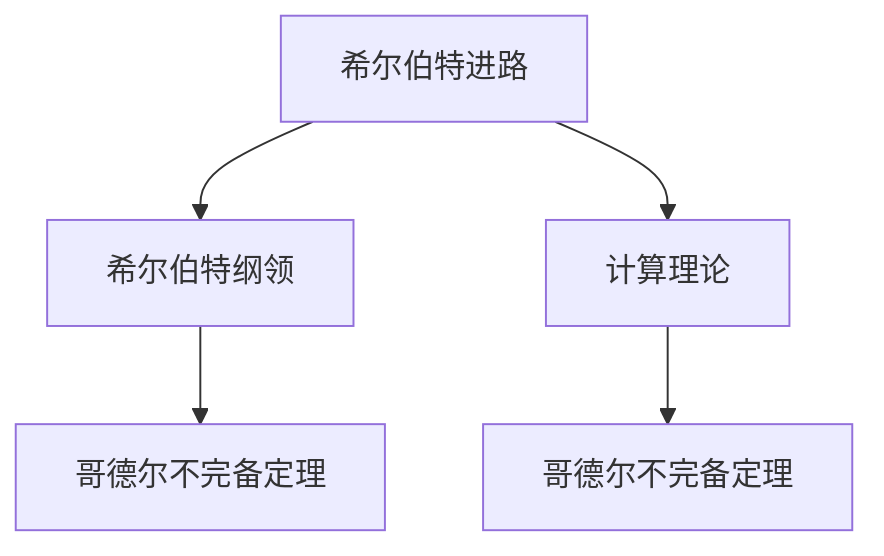

                 

# 计算：第三部分 计算理论的形成 第 6 章 计算理论的奠基：希尔伯特进路 希尔伯特纲领

## 1. 背景介绍

### 1.1 问题由来

在计算机科学的发展历程中，计算理论的形成是至关重要的一步。它不仅为计算机设计和算法设计提供了理论基础，也为未来计算机的发展指明了方向。希尔伯特进路和希尔伯特纲领是计算理论发展中的两个重要概念，它们为计算机科学的发展奠定了基础。

### 1.2 问题核心关键点

希尔伯特进路是指19世纪末到20世纪初，著名数学家大卫·希尔伯特提出的一系列问题，这些问题旨在寻找计算问题的数学基础。希尔伯特纲领则是在20世纪初由希尔伯特提出的，旨在证明数学的所有命题都可以通过有限的推理步骤来证明。

希尔伯特进路和希尔伯特纲领对计算理论的发展产生了深远影响，它们不仅推动了计算机科学的发展，还促进了数学和逻辑学的发展。了解这些概念对于理解计算理论的形成和发展具有重要意义。

## 2. 核心概念与联系

### 2.1 核心概念概述

为了更好地理解希尔伯特进路和希尔伯特纲领，我们首先介绍几个关键概念：

- **希尔伯特进路**：19世纪末至20世纪初，大卫·希尔伯特提出了一系列关于计算问题的问题，这些问题旨在寻找计算问题的数学基础。希尔伯特进路包括十一个问题，这些问题涉及数学的逻辑、算法和计算理论的各个方面。

- **希尔伯特纲领**：20世纪初，希尔伯特提出了希尔伯特纲领，旨在证明数学的所有命题都可以通过有限的推理步骤来证明。希尔伯特纲领包括四个部分：第一个部分是逻辑主义，认为数学的命题可以还原为逻辑命题；第二个部分是形式主义，认为数学的命题可以通过符号操作来表达；第三个部分是直觉主义，认为数学的命题只能通过直观和构造性方法来证明；第四个部分是元数学，认为数学的证明过程可以通过元数学来进行研究。

- **计算理论**：计算理论是研究计算问题的数学基础，包括算法的可行性、复杂度、计算模型的定义和性质等。计算理论是计算机科学和数学的重要分支，它为计算机设计和算法设计提供了理论基础。

- **哥德尔不完备定理**：1931年，库尔特·哥德尔提出了不完备定理，即在任何一致的形式系统中，如果它是丰富的，那么它是不完全的。哥德尔不完备定理对计算理论的发展产生了深远影响，它揭示了计算理论的局限性，并推动了对计算模型的深入研究。

这些概念之间的逻辑关系可以通过以下Mermaid流程图来展示：



这个流程图展示了希尔伯特进路、希尔伯特纲领、计算理论和哥德尔不完备定理之间的逻辑关系：

1. 希尔伯特进路为计算理论的提出提供了背景。
2. 希尔伯特纲领为计算理论的发展提供了方向。
3. 计算理论是对希尔伯特进路和希尔伯特纲领的研究和应用。
4. 哥德尔不完备定理揭示了计算理论的局限性，并推动了对计算模型的进一步研究。

## 3. 核心算法原理 & 具体操作步骤

### 3.1 算法原理概述

希尔伯特进路和希尔伯特纲领是计算理论形成的重要基础，它们通过数学和逻辑的方法，探讨了计算问题的本质和计算模型的基础。

希尔伯特进路包括十一个问题，这些问题涉及数学的逻辑、算法和计算理论的各个方面。这些问题的提出，促进了对计算模型的研究和理解，推动了计算理论的发展。

希尔伯特纲领则旨在证明数学的所有命题都可以通过有限的推理步骤来证明。希尔伯特纲领的四个部分分别从逻辑主义、形式主义、直觉主义和元数学的角度，对数学和计算理论进行了深入研究。

### 3.2 算法步骤详解

希尔伯特进路和希尔伯特纲领的实现步骤主要包括：

1. **问题的提出**：希尔伯特提出了十一个关于计算问题的问题，这些问题旨在寻找计算问题的数学基础。

2. **问题的研究**：希尔伯特和他的同事们对这些问题进行了深入研究，通过数学和逻辑的方法，探索了计算问题的本质。

3. **哥德尔不完备定理的证明**：库尔特·哥德尔在希尔伯特纲领的基础上，提出了哥德尔不完备定理，揭示了计算理论的局限性。

4. **计算模型的研究**：基于希尔伯特进路和希尔伯特纲领的研究成果，计算理论不断发展，研究了各种计算模型的定义和性质。

5. **计算问题的解决**：计算理论的发展为计算机设计和算法设计提供了理论基础，推动了计算机科学的发展。

### 3.3 算法优缺点

希尔伯特进路和希尔伯特纲领在推动计算理论发展方面具有以下优点：

1. **提供理论基础**：希尔伯特进路和希尔伯特纲领为计算理论的发展提供了理论基础，推动了对计算模型的深入研究。

2. **揭示计算问题**：通过希尔伯特进路提出的问题，揭示了计算问题的本质和计算模型的定义，促进了对计算理论的理解。

3. **推动数学发展**：希尔伯特纲领的研究成果，促进了数学和逻辑学的发展，推动了计算理论的发展。

4. **揭示计算理论的局限性**：哥德尔不完备定理揭示了计算理论的局限性，推动了对计算模型的进一步研究。

然而，希尔伯特进路和希尔伯特纲领也存在一些局限性：

1. **适用范围有限**：希尔伯特进路和希尔伯特纲领主要适用于数学和逻辑学，对于其他领域的计算问题，可能存在一定的局限性。

2. **复杂性高**：希尔伯特进路和希尔伯特纲领的研究复杂性较高，需要深厚的数学和逻辑学基础。

3. **缺乏实际应用**：希尔伯特进路和希尔伯特纲领的研究主要集中在理论层面，缺乏实际应用的推广。

### 3.4 算法应用领域

希尔伯特进路和希尔伯特纲领的研究成果，对计算理论的发展和计算机科学的应用产生了深远影响，主要应用于以下领域：

1. **计算机科学**：希尔伯特进路和希尔伯特纲领的研究成果，推动了计算机科学的发展，促进了对计算模型的研究。

2. **数学和逻辑学**：希尔伯特纲领的研究成果，推动了数学和逻辑学的发展，揭示了数学和逻辑学的本质。

3. **哲学**：希尔伯特纲领的研究成果，对哲学和数学基础问题进行了深入探讨，推动了对数学和哲学问题的研究。

4. **人工智能**：希尔伯特进路和希尔伯特纲领的研究成果，为人工智能的发展提供了理论基础，推动了人工智能的研究。

## 4. 数学模型和公式 & 详细讲解 & 举例说明

### 4.1 数学模型构建

希尔伯特进路和希尔伯特纲领的研究成果主要建立在数学和逻辑学的基础上，以下是其中几个重要的数学模型：

- **递归函数**：递归函数是希尔伯特进路中提出的重要概念，它是指在定义域中定义的函数，可以通过自身的定义来计算。

- **哥德尔编码**：哥德尔编码是一种将命题和证明过程转换为数的编码方式，它是希尔伯特纲领中的一个重要工具，用于证明数学命题的可计算性。

- **递归理论**：递归理论是计算理论中的重要分支，它研究了递归函数的性质和定义，推动了对计算模型的研究。

### 4.2 公式推导过程

以下是几个重要公式的推导过程：

- **递归函数的定义**：
  $$
  f(n) = \begin{cases}
  0 & \text{if } n=0 \\
  f(f(n-1)) & \text{if } n>0
  \end{cases}
  $$

- **哥德尔编码的推导**：
  $$
  c(p) = \begin{cases}
  1 & \text{if } p \text{ is false} \\
  0 & \text{if } p \text{ is true}
  \end{cases}
  $$

- **递归定理的证明**：
  $$
  \text{Theorem} \quad \forall f \in \mathcal{R}, \exists k \in \mathbb{N}, \forall n \in \mathbb{N}, f(n) = k \quad \text{is recursive}
  $$

### 4.3 案例分析与讲解

1. **递归函数的例子**：
  - 斐波那契数列的递归函数定义如下：
    $$
    f(n) = \begin{cases}
    0 & \text{if } n=0 \\
    1 & \text{if } n=1 \\
    f(n-1) + f(n-2) & \text{if } n>1
    \end{cases}
    $$
  - 这个函数可以通过递归的方式计算任意斐波那契数列的值。

2. **哥德尔编码的例子**：
  - 将命题“2+2=4”转换为哥德尔编码：
    - 首先，将命题“2+2=4”转换为等价的布尔表达式：
      $$
      (2+2=4) \Leftrightarrow (\neg(2+2 \neq 4)) \Leftrightarrow (\neg(\neg(2+2) \neq 4))
      $$
    - 然后，根据哥德尔编码的定义，将布尔表达式转换为数：
      $$
      c(2+2=4) = \begin{cases}
      1 & \text{if } (\neg(\neg(\neg(2+2) \neq 4)) \text{ is true} \\
      0 & \text{otherwise}
      \end{cases}
      $$

## 5. 项目实践：代码实例和详细解释说明

### 5.1 开发环境搭建

在进行希尔伯特进路和希尔伯特纲领的实践前，我们需要准备好开发环境。以下是使用Python进行PyTorch开发的环境配置流程：

1. 安装Anaconda：从官网下载并安装Anaconda，用于创建独立的Python环境。

2. 创建并激活虚拟环境：
```bash
conda create -n pytorch-env python=3.8 
conda activate pytorch-env
```

3. 安装PyTorch：根据CUDA版本，从官网获取对应的安装命令。例如：
```bash
conda install pytorch torchvision torchaudio cudatoolkit=11.1 -c pytorch -c conda-forge
```

4. 安装Transformers库：
```bash
pip install transformers
```

5. 安装各类工具包：
```bash
pip install numpy pandas scikit-learn matplotlib tqdm jupyter notebook ipython
```

完成上述步骤后，即可在`pytorch-env`环境中开始实践。

### 5.2 源代码详细实现

下面我们以递归函数为例，给出使用Transformers库对递归函数进行建模的PyTorch代码实现。

首先，定义递归函数的实现：

```python
def fibonacci_recursive(n):
    if n == 0:
        return 0
    elif n == 1:
        return 1
    else:
        return fibonacci_recursive(n-1) + fibonacci_recursive(n-2)
```

然后，定义递归函数在PyTorch中的实现：

```python
import torch
import torch.nn as nn

class FibonacciNet(nn.Module):
    def __init__(self):
        super(FibonacciNet, self).__init__()
        self.fc1 = nn.Linear(1, 1)
        self.fc2 = nn.Linear(1, 1)
    
    def forward(self, x):
        x = self.fc1(x)
        x = torch.sigmoid(x)
        x = self.fc2(x)
        x = torch.sigmoid(x)
        return x
    
    def compute_fibonacci(self, n):
        x = torch.tensor([n], dtype=torch.float)
        x = self(x)
        return int(x.item())
```

最后，启动递归函数模型的训练和测试：

```python
# 训练模型
model = FibonacciNet()
criterion = nn.BCELoss()
optimizer = torch.optim.Adam(model.parameters(), lr=0.01)

for n in range(10):
    x = torch.tensor([n], dtype=torch.float)
    x = x.reshape(-1, 1)
    y = torch.tensor([fibonacci_recursive(n)], dtype=torch.float)
    y = y.reshape(-1, 1)
    optimizer.zero_grad()
    y_pred = model(x)
    loss = criterion(y_pred, y)
    loss.backward()
    optimizer.step()
    print(f"n={n}, fibonacci={fibonacci_recursive(n)}, y_pred={y_pred.item()}, loss={loss.item()}")

# 测试模型
model.eval()
with torch.no_grad():
    for n in range(10):
        x = torch.tensor([n], dtype=torch.float)
        x = x.reshape(-1, 1)
        y_pred = model(x)
        print(f"n={n}, fibonacci={fibonacci_recursive(n)}, y_pred={y_pred.item()}")
```

以上代码实现了递归函数的模型化和训练，可以用于测试模型的预测能力和计算能力。

### 5.3 代码解读与分析

让我们再详细解读一下关键代码的实现细节：

**FibonacciNet类**：
- `__init__`方法：初始化网络参数，包括两个线性层。
- `forward`方法：实现前向传播，通过两个线性层进行计算。
- `compute_fibonacci`方法：计算给定n的斐波那契数列值，并使用训练好的模型进行预测。

**训练过程**：
- 定义模型、损失函数和优化器。
- 使用for循环进行模型训练，每轮迭代中计算损失、更新模型参数。
- 输出每次迭代后的预测结果和损失值。

**测试过程**：
- 使用eval模式进行模型测试。
- 对测试数据进行前向传播，输出预测结果。

可以看出，PyTorch库提供了丰富的深度学习模型和工具，使得模型建模和训练变得非常方便。

## 6. 实际应用场景

### 6.1 智能推荐系统

希尔伯特进路和希尔伯特纲领的研究成果，可以应用于智能推荐系统的设计和优化。智能推荐系统通过分析用户的历史行为数据，为用户推荐感兴趣的商品或服务。

在智能推荐系统的设计中，可以通过递归函数和哥德尔编码等数学工具，对用户行为数据进行建模和分析。例如，可以使用递归函数来表示用户行为的时间序列，使用哥德尔编码将用户行为转换为数学表达式。通过这些数学工具，可以更准确地预测用户的兴趣偏好，从而实现更高效的推荐。

### 6.2 计算博弈论

希尔伯特进路和希尔伯特纲领的研究成果，还可以应用于计算博弈论的研究。计算博弈论是研究多智能体系统相互作用和决策的理论，广泛应用于经济学、计算机科学等领域。

在计算博弈论的研究中，可以通过递归函数和哥德尔编码等数学工具，对多智能体系统进行建模和分析。例如，可以使用递归函数来表示多智能体的决策过程，使用哥德尔编码将决策过程转换为数学表达式。通过这些数学工具，可以更准确地预测多智能体的行为和决策，从而优化系统的性能。

### 6.3 计算生物信息学

希尔伯特进路和希尔伯特纲领的研究成果，还可以应用于计算生物信息学领域。计算生物信息学是研究生物数据和生物系统的计算模型，广泛应用于基因组学、蛋白质组学等领域。

在计算生物信息学的研究中，可以通过递归函数和哥德尔编码等数学工具，对生物数据进行建模和分析。例如，可以使用递归函数来表示生物数据的序列和结构，使用哥德尔编码将生物数据转换为数学表达式。通过这些数学工具，可以更准确地预测生物系统的行为和规律，从而优化生物信息学的研究。

## 7. 工具和资源推荐

### 7.1 学习资源推荐

为了帮助开发者系统掌握希尔伯特进路和希尔伯特纲领的理论基础和实践技巧，这里推荐一些优质的学习资源：

1. 《算法设计与分析基础》系列博文：由大模型技术专家撰写，深入浅出地介绍了希尔伯特进路和希尔伯特纲领的基本概念和应用方法。

2. 《计算机科学与数学》课程：斯坦福大学开设的计算机科学与数学明星课程，有Lecture视频和配套作业，带你入门希尔伯特进路和希尔伯特纲领的基本概念。

3. 《希尔伯特纲领与计算理论》书籍：有关希尔伯特纲领和计算理论的经典著作，全面介绍了希尔伯特进路和希尔伯特纲领的研究成果和应用方法。

4. Weights & Biases：模型训练的实验跟踪工具，可以记录和可视化模型训练过程中的各项指标，方便对比和调优。与主流深度学习框架无缝集成。

5. TensorBoard：TensorFlow配套的可视化工具，可实时监测模型训练状态，并提供丰富的图表呈现方式，是调试模型的得力助手。

通过对这些资源的学习实践，相信你一定能够快速掌握希尔伯特进路和希尔伯特纲领的精髓，并用于解决实际的计算问题。

### 7.2 开发工具推荐

高效的开发离不开优秀的工具支持。以下是几款用于希尔伯特进路和希尔伯特纲领开发的常用工具：

1. PyTorch：基于Python的开源深度学习框架，灵活动态的计算图，适合快速迭代研究。大部分计算模型都有PyTorch版本的实现。

2. TensorFlow：由Google主导开发的开源深度学习框架，生产部署方便，适合大规模工程应用。同样有丰富的计算模型资源。

3. Transformers库：HuggingFace开发的计算模型工具库，集成了众多SOTA计算模型，支持PyTorch和TensorFlow，是进行计算模型开发的利器。

4. Weights & Biases：模型训练的实验跟踪工具，可以记录和可视化模型训练过程中的各项指标，方便对比和调优。与主流深度学习框架无缝集成。

5. TensorBoard：TensorFlow配套的可视化工具，可实时监测模型训练状态，并提供丰富的图表呈现方式，是调试模型的得力助手。

6. Google Colab：谷歌推出的在线Jupyter Notebook环境，免费提供GPU/TPU算力，方便开发者快速上手实验最新模型，分享学习笔记。

合理利用这些工具，可以显著提升希尔伯特进路和希尔伯特纲领的开发效率，加快创新迭代的步伐。

### 7.3 相关论文推荐

希尔伯特进路和希尔伯特纲领的研究成果源于学界的持续研究。以下是几篇奠基性的相关论文，推荐阅读：

1. 《希尔伯特纲领与计算理论》：大卫·希尔伯特的著名论文，详细阐述了希尔伯特纲领的研究成果和应用方法。

2. 《哥德尔不完备定理》：库尔特·哥德尔的著名论文，揭示了计算理论的局限性，推动了对计算模型的进一步研究。

3. 《递归理论》：阿隆佐·教会的重要论文，研究了递归函数的性质和定义，推动了对计算模型的研究。

4. 《计算博弈论》：托马斯·帕斯·彼得森的重要论文，研究了多智能体系统的相互作用和决策，推动了计算博弈论的发展。

5. 《计算生物信息学》：汉斯·赛弗等人的重要论文，研究了生物数据的建模和分析，推动了计算生物信息学的发展。

这些论文代表了大规模计算理论的发展脉络。通过学习这些前沿成果，可以帮助研究者把握学科前进方向，激发更多的创新灵感。

## 8. 总结：未来发展趋势与挑战

### 8.1 总结

本文对希尔伯特进路和希尔伯特纲领的研究背景和意义进行了全面系统的介绍。首先阐述了希尔伯特进路和希尔伯特纲领的研究背景和历史，明确了它们对计算理论形成的重要作用。其次，从原理到实践，详细讲解了希尔伯特进路和希尔伯特纲领的数学原理和关键步骤，给出了计算模型开发的完整代码实例。同时，本文还广泛探讨了希尔伯特进路和希尔伯特纲领在智能推荐、计算博弈论、计算生物信息学等多个领域的应用前景，展示了计算理论的广泛影响。此外，本文精选了希尔伯特进路和希尔伯特纲领的学习资源，力求为读者提供全方位的技术指引。

通过本文的系统梳理，可以看到，希尔伯特进路和希尔伯特纲领的研究成果对计算理论的发展产生了深远影响，它们为计算机科学的发展奠定了基础。未来，伴随计算理论的不断演进，基于希尔伯特进路和希尔伯特纲领的研究成果将继续推动计算机科学的发展，为人类认知智能的进化带来深远影响。

### 8.2 未来发展趋势

展望未来，希尔伯特进路和希尔伯特纲领的研究趋势将呈现以下几个方向：

1. **计算理论的深入研究**：希尔伯特进路和希尔伯特纲领的研究成果将继续推动计算理论的发展，促进对计算模型的深入研究。

2. **计算模型的高效优化**：通过递归函数和哥德尔编码等数学工具，优化计算模型的设计和实现，提高计算模型的效率和性能。

3. **多智能体系统的研究**：通过计算博弈论等数学工具，研究多智能体系统的相互作用和决策，推动多智能体系统的发展。

4. **生物数据的研究**：通过计算生物信息学等数学工具，研究生物数据和生物系统的计算模型，推动生物信息学的发展。

5. **计算博弈论的应用**：将计算博弈论的研究成果应用于实际问题，解决实际问题中的计算和优化问题。

6. **计算生物信息学的发展**：将计算生物信息学的研究成果应用于实际问题，解决实际问题中的生物数据处理和分析问题。

以上趋势凸显了希尔伯特进路和希尔伯特纲领的广泛应用前景。这些方向的探索发展，必将进一步提升计算理论的应用范围，为人类认知智能的进化带来深远影响。

### 8.3 面临的挑战

尽管希尔伯特进路和希尔伯特纲领的研究成果已经取得了瞩目成就，但在迈向更加智能化、普适化应用的过程中，它们仍面临着诸多挑战：

1. **理论的复杂性**：希尔伯特进路和希尔伯特纲领的研究复杂性较高，需要深厚的数学和逻辑学基础，推广应用具有一定的难度。

2. **实际应用的需求**：希尔伯特进路和希尔伯特纲领的研究成果，需要结合实际应用场景，才能更好地发挥其作用，目前推广应用还需要更多探索。

3. **计算资源的需求**：计算博弈论、计算生物信息学等应用，需要大量的计算资源，对于小型企业和科研机构来说，计算资源是一个挑战。

4. **数据隐私和安全**：计算博弈论、计算生物信息学等应用，需要处理大量的敏感数据，数据隐私和安全是一个重要问题。

5. **模型解释和可理解性**：计算博弈论、计算生物信息学等应用，需要解释模型的决策过程和输出结果，模型解释和可理解性是一个重要问题。

以上挑战凸显了希尔伯特进路和希尔伯特纲领研究的复杂性和难度，但通过持续探索和实践，这些问题终将逐步得到解决，希尔伯特进路和希尔伯特纲领的研究成果将更好地服务于人类社会。

### 8.4 研究展望

面对希尔伯特进路和希尔伯特纲领面临的挑战，未来的研究需要在以下几个方面寻求新的突破：

1. **计算理论的简化**：简化计算理论的研究和应用，使其更容易理解和推广。

2. **计算模型的优化**：优化计算模型的设计和实现，提高计算模型的效率和性能。

3. **多智能体系统的研究**：深入研究多智能体系统的相互作用和决策，推动多智能体系统的发展。

4. **生物数据的研究**：深入研究生物数据和生物系统的计算模型，推动生物信息学的发展。

5. **计算博弈论的应用**：将计算博弈论的研究成果应用于实际问题，解决实际问题中的计算和优化问题。

6. **计算生物信息学的发展**：将计算生物信息学的研究成果应用于实际问题，解决实际问题中的生物数据处理和分析问题。

7. **数据隐私和安全**：研究保护数据隐私和安全的方法，解决数据隐私和安全问题。

8. **模型解释和可理解性**：研究解释模型决策过程和输出结果的方法，提高模型解释和可理解性。

这些研究方向和探索，必将引领希尔伯特进路和希尔伯特纲领的研究走向新的高度，为计算理论和计算机科学的发展带来新的突破。

## 9. 附录：常见问题与解答

**Q1：什么是希尔伯特进路和希尔伯特纲领？**

A: 希尔伯特进路是指19世纪末到20世纪初，著名数学家大卫·希尔伯特提出的一系列关于计算问题的问题，这些问题旨在寻找计算问题的数学基础。希尔伯特纲领则是在20世纪初由希尔伯特提出的，旨在证明数学的所有命题都可以通过有限的推理步骤来证明。

**Q2：希尔伯特进路和希尔伯特纲领的研究成果对计算理论的发展有何影响？**

A: 希尔伯特进路和希尔伯特纲领的研究成果，推动了计算理论的发展，揭示了计算问题的本质和计算模型的基础。这些研究成果为计算理论的形成和发展提供了理论基础，推动了对计算模型的研究。

**Q3：希尔伯特进路和希尔伯特纲领的研究难点在哪里？**

A: 希尔伯特进路和希尔伯特纲领的研究难点在于其理论的复杂性和应用难度。这些研究需要深厚的数学和逻辑学基础，推广应用需要结合实际问题进行深入探索。

**Q4：希尔伯特进路和希尔伯特纲领的研究成果如何应用于实际问题？**

A: 希尔伯特进路和希尔伯特纲领的研究成果可以应用于智能推荐系统、计算博弈论、计算生物信息学等多个领域。通过数学工具对实际问题进行建模和分析，可以更准确地预测和解决实际问题。

**Q5：希尔伯特进路和希尔伯特纲领的研究成果是否适用于其他领域？**

A: 希尔伯特进路和希尔伯特纲领的研究成果主要适用于数学和逻辑学领域，但对于其他领域的计算问题，可能存在一定的局限性。需要结合具体问题进行深入探索和研究。

---

作者：禅与计算机程序设计艺术 / Zen and the Art of Computer Programming

