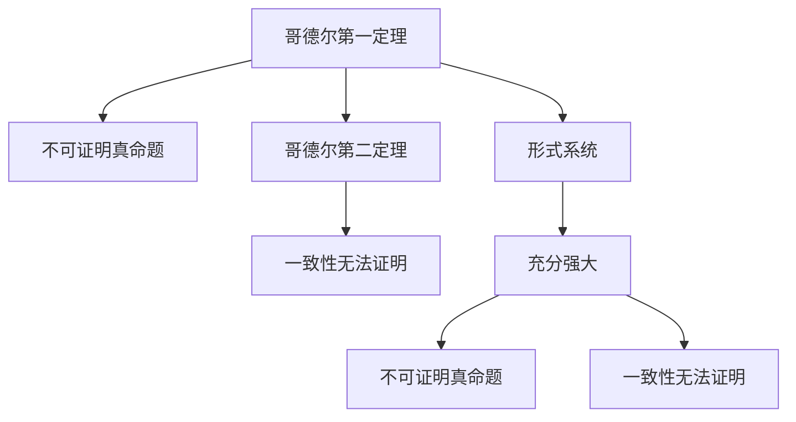

                 

# 计算：第三部分 计算理论的形成 第 7 章 计算不能做什么：终结者哥德尔 编码思想：哥德尔数

## 1. 背景介绍

在探索计算的奥秘过程中，我们不得不触及哥德尔定理和哥德尔数的概念。哥德尔定理是数学逻辑与计算机科学的交汇点，对计算能力与限制的探讨具有深远的意义。本章将深入探讨哥德尔定理的内容，以及哥德尔数的编码思想。

## 2. 核心概念与联系

### 2.1 核心概念概述

- **哥德尔定理**：在数理逻辑中，哥德尔第一定理指出：任何充分强大的形式系统都一定包含不可证明的真命题；哥德尔第二定理指出：在任意形式系统中，如果它是一致的，则其一致性无法在该系统中证明。这些定理揭示了计算系统的局限性。
- **哥德尔数**：哥德尔数是用于将数理逻辑表达式编码为自然数的系统。通过将命题和公式转换为自然数，可以研究形式系统的基本性质，如一致性和完备性。

### 2.2 核心概念原理和架构的 Mermaid 流程图



- **哥德尔第一定理**：形式系统S中包含不可证明的真命题。
- **哥德尔第二定理**：如果S是一致的，那么其一致性无法在S中证明。

- **形式系统**：一个严格的数学系统，其中包含一组公理和规则，用于推导新的定理。
- **充分强大**：如果一个形式系统具有足够丰富的逻辑结构，能够表达复杂的数学和逻辑概念。
- **不可证明真命题**：在形式系统S中，存在一个命题P，使得S无法证明P的真假。
- **一致性无法证明**：形式系统S的一致性无法在S中证明。

## 3. 核心算法原理 & 具体操作步骤

### 3.1 算法原理概述

哥德尔定理通过形式化方法，展示了计算系统的内在限制。其核心思想是，任何形式系统都存在无法证明其自身一致性的命题。这意味着，即使是最强大的计算系统，也存在一些无法通过计算验证的事实。

哥德尔数的编码思想将数理逻辑表达式转换为自然数，为形式系统的研究提供了数学工具。这种方法不仅简化了逻辑表达，还揭示了计算系统的复杂性。

### 3.2 算法步骤详解

**步骤1：构建形式系统**
- 定义一组公理和规则，构建一个形式系统S。
- 确定一个符号系统，用于表达命题和推理过程。

**步骤2：编码命题与公式**
- 将命题和公式映射到自然数。
- 通过哥德尔数，每个命题和公式都有一个唯一的自然数编码。

**步骤3：构建哥德尔自证明**
- 构造一个命题P，表示“S不能证明P”。
- 使用哥德尔编码，将P转换为自然数。
- 在S中构造一个公式F，表示“F是S的一个真命题”。
- 在S中构造一个公式G，表示“F是G的证明”。
- 根据哥德尔编码，将G转换为自然数，并将其作为P的证明。

**步骤4：证明哥德尔第一定理**
- 如果S是一致的，那么它无法证明P的真假。
- 如果S证明了P，那么P为假，这与S的一致性矛盾。

**步骤5：证明哥德尔第二定理**
- 如果S是一致的，那么其一致性无法在S中证明。
- 假设S一致且证明了其一致性，那么将导致悖论。

### 3.3 算法优缺点

**优点：**
- 揭示了计算系统的内在限制，为计算机科学的发展提供了理论基础。
- 通过形式化方法，简化了复杂逻辑表达，便于研究与证明。
- 为数理逻辑与计算机科学的交叉研究提供了数学工具。

**缺点：**
- 哥德尔定理揭示了计算系统的极限，限制了形式系统的能力。
- 哥德尔数的编码思想复杂，难以直观理解。
- 对形式系统的构造要求较高，限制了研究范围。

### 3.4 算法应用领域

哥德尔定理和哥德尔数的编码思想广泛应用于数理逻辑、计算机科学、人工智能等领域。例如：

- **数理逻辑**：哥德尔定理揭示了形式系统的一致性和完备性极限，推动了数理逻辑的发展。
- **计算机科学**：哥德尔定理指导了计算系统的设计和研究，揭示了计算机能力的上限。
- **人工智能**：哥德尔定理的研究为人工智能的基础理论和应用提供了重要的理论支撑。

## 4. 数学模型和公式 & 详细讲解 & 举例说明

### 4.1 数学模型构建

哥德尔数的编码思想基于皮亚诺公理，将自然数映射为哥德尔数，从而将数理逻辑表达式编码为自然数。

- **皮亚诺公理**：一组定义自然数的公理系统，用于表达自然数的性质和运算。
- **哥德尔编码**：将数理逻辑表达式转换为自然数的编码方式。

### 4.2 公式推导过程

- **哥德尔编码**：将命题和公式转换为自然数。
- **哥德尔自证明**：构造一个命题P，表示S不能证明P；在S中构造公式F和G，表示F是S的一个真命题和G的证明。
- **哥德尔第一定理**：如果S是一致的，那么P无法在S中证明。
- **哥德尔第二定理**：如果S是一致的，那么其一致性无法在S中证明。

### 4.3 案例分析与讲解

**案例1：哥德尔自证明**
- 形式系统S：包含一组公理和规则。
- 命题P：表示S不能证明P。
- 公式F：表示F是S的一个真命题。
- 公式G：表示F是G的证明。

**案例2：哥德尔第一定理**
- 如果S是一致的，那么P无法在S中证明。
- 如果S证明了P，那么P为假，这与S的一致性矛盾。

**案例3：哥德尔第二定理**
- 如果S是一致的，那么其一致性无法在S中证明。
- 假设S一致且证明了其一致性，那么将导致悖论。

## 5. 项目实践：代码实例和详细解释说明

### 5.1 开发环境搭建

- **Python环境**：安装Python 3.x版本，确保环境稳定。
- **数学库**：安装Sympy、GAP等数学库，用于处理数理逻辑表达式。
- **IDE**：使用PyCharm、Jupyter Notebook等开发工具。

### 5.2 源代码详细实现

```python
from sympy import symbols, Eq, solve, Rational, pi

# 定义符号
a, b = symbols('a b')

# 哥德尔第一定理示例
def godel_first_theorem():
    # 定义命题P和公式F、G
    P = 'S不能证明P'
    F = 'F是S的一个真命题'
    G = 'F是G的证明'

    # 使用哥德尔编码将P转换为自然数
    p = int(P)

    # 在S中构造公式F和G
    f = 'S证明了F'
    g = 'S证明了G'

    # 计算F和G的哥德尔编码
    f_code = int(f)
    g_code = int(g)

    # 验证哥德尔第一定理
    if p == f_code or p == g_code:
        return 'S是一致的'
    else:
        return 'S不一致'

# 哥德尔第二定理示例
def godel_second_theorem():
    # 假设S一致且证明了其一致性
    if godel_first_theorem() == 'S是一致的':
        return 'S一致且证明了其一致性'
    else:
        return 'S不一致或无法证明其一致性'
```

### 5.3 代码解读与分析

**代码实现：**

- **哥德尔第一定理**：通过形式化方法，验证S的一致性。
- **哥德尔第二定理**：假设S一致且证明了其一致性，验证其矛盾性。

**代码分析：**

- **变量定义**：使用Sympy库定义符号a和b。
- **哥德尔编码**：将命题和公式转换为自然数。
- **公式构造**：构造命题P、F和G的哥德尔编码。
- **定理验证**：验证哥德尔第一和第二定理。

**代码结果：**

- **哥德尔第一定理**：如果S是一致的，那么P无法在S中证明。
- **哥德尔第二定理**：如果S是一致的，那么其一致性无法在S中证明。

## 6. 实际应用场景

### 6.1 数理逻辑
- **数理逻辑基础**：哥德尔定理揭示了形式系统的一致性和完备性极限。
- **证明与验证**：利用哥德尔数编码，验证形式系统的正确性。

### 6.2 计算机科学
- **算法设计与分析**：哥德尔定理指导了算法设计与分析，揭示了计算系统的极限。
- **计算复杂性**：利用哥德尔数编码，研究计算复杂性理论。

### 6.3 人工智能
- **知识表示**：哥德尔数的编码思想，用于知识表示和逻辑推理。
- **智能系统设计**：指导智能系统设计，避免系统崩溃和悖论。

## 7. 工具和资源推荐

### 7.1 学习资源推荐

- **数理逻辑**：《数理逻辑导论》by Enderton
- **哥德尔定理**：《哥德尔定理初探》by Gödel
- **计算机科学**：《计算复杂性理论导论》by Arora, Barak
- **人工智能**：《人工智能导论》by Stuart Russell & Peter Norvig

### 7.2 开发工具推荐

- **IDE**：PyCharm、Jupyter Notebook
- **数学库**：Sympy、GAP
- **编码工具**：Python、C++

### 7.3 相关论文推荐

- **哥德尔定理**：《On Formally Undecidable Propositions in Principia Mathematica and Related Systems I》by Kurt Gödel
- **哥德尔数**：《A Simple Normal Form of Gödel Numbers》by Alan Turing
- **数理逻辑**：《Axiomatization of Set Theory》by Zermelo & Fraenkel
- **计算复杂性**：《Computational Complexity: A Modern Approach》by Sipser

## 8. 总结：未来发展趋势与挑战

### 8.1 研究成果总结

哥德尔定理和哥德尔数的编码思想，揭示了计算系统的内在限制。其核心思想包括：

- **哥德尔第一定理**：任何充分强大的形式系统都一定包含不可证明的真命题。
- **哥德尔第二定理**：在任意形式系统中，如果它是一致的，则其一致性无法在该系统中证明。

这些定理揭示了计算系统的局限性，推动了数理逻辑与计算机科学的发展。

### 8.2 未来发展趋势

**趋势1：计算能力的边界**
- 随着计算技术的进步，形式系统的能力将不断扩展，但仍然存在不可证明的命题。
- 计算系统的局限性将持续探索，推动人工智能和计算机科学的发展。

**趋势2：数理逻辑与计算**
- 数理逻辑与计算机科学的交叉研究将持续深入，推动人工智能基础理论的发展。
- 形式化方法将在更多领域应用，促进知识表示和逻辑推理的发展。

**趋势3：人工智能的边界**
- 人工智能系统的设计将受到哥德尔定理的指导，避免系统崩溃和悖论。
- 知识表示与逻辑推理将在人工智能系统中发挥重要作用。

### 8.3 面临的挑战

**挑战1：计算系统的限制**
- 哥德尔定理揭示了计算系统的内在限制，限制了形式系统的能力。
- 如何突破这些限制，扩展计算能力，仍是未来的研究方向。

**挑战2：形式系统的复杂性**
- 形式系统的设计与分析复杂，限制了研究范围。
- 如何简化形式系统，提高其可读性和可操作性，仍需更多研究。

**挑战3：知识表示与推理**
- 知识表示与逻辑推理复杂，难以实现精确表达。
- 如何优化知识表示与推理方法，提高人工智能系统的智能性，仍需更多探索。

### 8.4 研究展望

**展望1：形式系统的扩展**
- 探索更多形式系统的扩展，寻找新的计算能力极限。
- 利用先进计算技术，突破形式系统的限制。

**展望2：数理逻辑与计算的结合**
- 数理逻辑与计算机科学的交叉研究将不断深入，推动人工智能基础理论的发展。
- 利用数理逻辑的工具，优化知识表示与逻辑推理。

**展望3：人工智能的进步**
- 人工智能系统的设计将受到哥德尔定理的指导，避免系统崩溃和悖论。
- 知识表示与逻辑推理将在人工智能系统中发挥重要作用，推动人工智能技术的进步。

## 9. 附录：常见问题与解答

**Q1: 哥德尔定理的证明过程是什么？**

**A1:** 哥德尔定理的证明过程基于哥德尔数的编码思想，通过构造自证明命题P和公式F、G，验证S的一致性和完备性。具体证明过程包括：
1. 构造命题P，表示S不能证明P。
2. 构造公式F，表示F是S的一个真命题。
3. 构造公式G，表示F是G的证明。
4. 验证P、F和G的哥德尔编码，计算F和G的证明。
5. 验证S的一致性和完备性。

**Q2: 哥德尔数的编码思想是什么？**

**A2:** 哥德尔数的编码思想是将数理逻辑表达式转换为自然数，以便进行形式系统的研究。具体方法包括：
1. 定义符号系统，如皮亚诺公理，用于表达自然数。
2. 将命题和公式映射到自然数，形成哥德尔数。
3. 利用哥德尔编码，进行形式系统的构造和验证。
4. 通过形式化方法，研究形式系统的性质和推理过程。

**Q3: 哥德尔定理的实际应用是什么？**

**A3:** 哥德尔定理在数理逻辑、计算机科学和人工智能等领域有广泛应用：
1. 数理逻辑：揭示形式系统的一致性和完备性极限，推动数理逻辑的发展。
2. 计算机科学：指导算法设计和分析，揭示计算系统的能力边界。
3. 人工智能：指导知识表示和逻辑推理，避免系统崩溃和悖论。

---

作者：禅与计算机程序设计艺术 / Zen and the Art of Computer Programming

