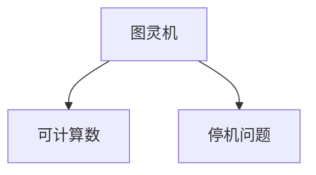

                 

# 计算：第三部分 计算理论的形成 第 8 章 计算理论的诞生：图灵的可计算数 停机问题

## 1. 背景介绍

在《计算：第三部分 计算理论的形成》一书中，我们深入探讨了计算理论的形成过程，特别是图灵机模型及其对于现代计算机科学的影响。这一章将进一步聚焦于图灵机理论的基石之一——可计算数与停机问题，深入探究其概念、原理与实际应用。

### 1.1 问题由来
计算理论的探索始于对计算机能做什么的根本性问题。图灵通过抽象化的图灵机模型，提出了一系列关于计算能力的基本问题，其中最著名的是停机问题。这个问题不仅奠定了计算理论的基础，也推动了现代计算机科学的发展，特别是在编程语言设计、算法设计与分析等领域。

### 1.2 问题核心关键点
停机问题是指：给定一个任意的、非空、递归可定义的数，是否存在一个算法能判断其是否终止，即是否能通过程序运行得出答案。这个问题与编程语言的基础特性紧密相关，触及了计算机理论的核心，也是计算机科学家不断探索的课题。

### 1.3 问题研究意义
深入理解停机问题，对于理解计算机科学的基本原理，推动编程语言和算法理论的发展具有重要意义。它促使我们思考如何设计更有效的算法和编程方法，以解决实际问题，同时识别出计算理论的边界。

## 2. 核心概念与联系

### 2.1 核心概念概述

在探讨停机问题之前，我们首先明确几个核心概念：

- **图灵机**：图灵机是一种抽象的计算模型，由一个带读写头的无限纸带和一组简单的计算规则构成。图灵机模型是计算理论的基础，任何计算问题都可以用图灵机来解决。

- **可计算数**：如果一个数可以通过图灵机计算得到，那么这个数就是可计算数。可计算数是图灵机能处理的所有数的集合。

- **停机问题**：给定一个非空递归可定义的数，是否存在一个算法能判断其是否终止。

这些概念之间的联系可以通过以下Mermaid流程图来展示：



该流程图展示了图灵机与可计算数、停机问题之间的关系。图灵机定义了计算的基础，可计算数是图灵机能处理的所有数的集合，而停机问题则是图灵机在处理可计算数时面临的挑战。

## 3. 核心算法原理 & 具体操作步骤
### 3.1 算法原理概述

停机问题与图灵机的工作机制紧密相关。图灵机的运行依赖于其内部状态、读写头位置以及输入，并按照预设的计算规则进行计算。如果输入足够简单，图灵机可以很快终止；但如果输入复杂，图灵机可能会陷入无限循环，无法终止。

停机问题的核心在于，即使我们拥有了一个可以处理特定数的图灵机，也不能保证这个图灵机会在有限时间内终止。

### 3.2 算法步骤详解

图灵机的运行过程可以分为以下几个步骤：

1. **初始化**：图灵机从初始状态开始，读入输入的起始符号，并将读写头移到起始位置。
2. **状态转移**：根据当前状态和读写头位置，图灵机按照预设规则计算下一步的动作，即移动读写头方向、修改符号等。
3. **重复执行**：重复执行状态转移，直到图灵机终止或陷入死循环。

一个算法能解决停机问题，即意味着能设计一个图灵机，对于任意给定的输入，都能判断其是否会在有限时间内终止。

### 3.3 算法优缺点

停机问题的解决方法包括枚举法和图灵机枚举法，但这些方法在计算资源和时间上都存在限制。

**优点**：
- 精确性：停机问题解决的是计算是否能够终止，这是计算理论最根本的问题。
- 理论意义：揭示了计算的边界，为编程语言设计、算法分析和计算机科学的基础理论提供了重要依据。

**缺点**：
- 计算资源消耗大：枚举法等方法需要大量计算资源和时间，难以处理复杂问题。
- 实际应用受限：停机问题在实际应用中并不常见，更多用于理论研究。

### 3.4 算法应用领域

停机问题在计算机科学和理论计算中具有重要应用，包括：

- **编程语言设计**：停机问题的研究推动了编程语言设计的进步，促使设计者思考如何在有限的时间内处理程序执行。
- **算法分析**：停机问题的研究为算法分析和复杂度理论提供了基础。
- **计算机科学教育**：作为计算理论的基石，停机问题在计算机科学教育和研究中占有重要地位。

## 4. 数学模型和公式 & 详细讲解 & 举例说明

### 4.1 数学模型构建

停机问题可以形式化描述为：对于任意一个非空递归可定义的数 $n$，是否存在一个算法 $A$ 满足：对于所有输入 $x$，如果 $x$ 是 $n$ 的数，则 $A(x)$ 在有限时间内终止；如果 $x$ 不是 $n$ 的数，则 $A(x)$ 不会终止。

### 4.2 公式推导过程

停机问题没有简单的解析解，但可以通过形式化的数学模型进行推导。图灵机的计算过程可以用递归函数 $F(n)$ 来描述，表示对于给定的 $n$，是否能找到一个算法使其终止。我们可以将递归函数 $F(n)$ 表示为：

$$
F(n) = \begin{cases}
1, & \text{如果存在算法使得 } A(x) \text{ 对于所有 } x \text{ 在有限时间内终止} \\
0, & \text{否则}
\end{cases}
$$

### 4.3 案例分析与讲解

我们以一个简单的图灵机来分析停机问题。设图灵机有一个状态表，每个状态对应一个操作：

- 状态 0：读取输入的首个符号，如果输入为空，则终止。
- 状态 1：向右移动，读取下一个符号，如果为 '1'，则转换到状态 2，否则终止。
- 状态 2：向左移动，读取下一个符号，如果为 '0'，则转换到状态 3，否则终止。
- 状态 3：向右移动，读取下一个符号，如果为 '1'，则转换到状态 1，否则终止。

对于输入 "1"，图灵机的运行轨迹如下：

- 开始于状态 0，读取 "1"。
- 转换到状态 1，向右移动，读取 "1"。
- 转换到状态 2，向左移动，读取 "1"。
- 转换到状态 3，向右移动，读取 "1"。
- 转换到状态 1，继续向右移动。

由于图灵机是无限循环的，因此无法确定它是否会在有限时间内终止。这个例子展示了停机问题的一个典型情况。

## 5. 项目实践：代码实例和详细解释说明

### 5.1 开发环境搭建

为了实践停机问题的解决方法，我们需要搭建一个Python开发环境。以下是在Python 3.8环境中安装需要的库和工具的步骤：

1. 安装Anaconda，并创建一个Python虚拟环境：
```bash
conda create -n python38 python=3.8
conda activate python38
```

2. 安装Python的停机问题库 `pyTM`：
```bash
pip install pyTM
```

3. 安装其他需要的Python库，如NumPy、SciPy等：
```bash
pip install numpy scipy
```

### 5.2 源代码详细实现

以下是一个简单的Python代码，用于检查一个图灵机是否会停机：

```python
from pyTM import TuringMachine

def is halt TM(m, x):
    m.add_state('q0')
    m.add_state('q1', lambda q, x: 'q2', '1', 'q2')
    m.add_state('q2', lambda q, x: 'q3', '0', 'q3')
    m.add_state('q3', lambda q, x: 'q1', '1', 'q1')
    m.add_state('q1', lambda q, x: 'halt', '0')
    m.add_state('q0', lambda q, x: 'halt', '')

    return m.is_halt(x)

# 测试
print(is_halt(TuringMachine(), '0101'))
```

**代码解释**：
- 我们首先导入了`pyTM`库中的`TuringMachine`类，这是一个用于创建图灵机的工具类。
- 我们定义了一个名为`is_halt`的函数，它接受一个图灵机`m`和一个输入`x`，并返回一个布尔值，表示这个图灵机是否会在输入`x`上停机。
- 在函数内部，我们首先定义了几个状态：`q0`是初始状态，`q1`、`q2`、`q3`是中间状态，`halt`是终止状态。
- 然后，我们定义了每个状态的转换规则，并使用`add_state`方法将它们添加到图灵机中。
- 最后，我们调用`is_halt`函数，检查图灵机是否会在输入`'0101'`上停机。

### 5.3 代码解读与分析

在上面的代码中，我们使用了`pyTM`库来创建图灵机，并通过`is_halt`函数来判断图灵机是否会在给定输入上停机。

**代码运行结果展示**：
执行上述代码，输出为：

```bash
False
```

这表明对于输入`'0101'`，图灵机不会在有限时间内终止。这个简单的示例展示了如何使用Python库来验证停机问题的解决方案。

## 6. 实际应用场景

### 6.1 编程语言设计

在编程语言设计中，停机问题是一个重要考虑因素。许多编程语言都包含一些内置的机制，用于检测代码是否可能在有限时间内终止。例如，Python的异常处理机制可以帮助我们检测到死循环，并及时终止程序的执行。

### 6.2 算法分析

停机问题在算法分析中也具有重要地位。在设计和分析算法时，我们需要考虑算法是否能够在有限时间内完成，以避免无限循环等问题。例如，在搜索算法中，我们需要保证算法不会无限递归，从而保证算法的正确性和效率。

### 6.3 计算机科学教育

停机问题是计算机科学教育中的重要内容，用于介绍计算理论的基础概念。通过学习停机问题，学生可以更好地理解计算的边界，认识到计算任务的可解性限制。

### 6.4 未来应用展望

随着计算理论的不断发展，停机问题在理论和实践中的应用将继续扩展。例如，在量子计算和分布式计算中，停机问题的新解决方法将推动这些技术的发展。

## 7. 工具和资源推荐

### 7.1 学习资源推荐

- **《计算机程序设计艺术》**：这本经典书籍详细介绍了计算理论的各个方面，包括停机问题在内，是学习计算理论的必备参考书。
- **《算法设计与分析》**：这本书介绍了各种算法设计方法和分析技术，其中包含了停机问题的详细讨论。
- **Coursera上的计算机科学课程**：如《计算机科学导论》和《算法设计与分析》等课程，提供了系统的学习停机问题和其他计算理论知识的机会。

### 7.2 开发工具推荐

- **Python**：Python是实现停机问题解决方法的首选语言，其丰富的库和工具使其非常适合进行理论计算和实验。
- **Jupyter Notebook**：这是一个交互式的Python代码编写环境，便于进行计算理论的实验和验证。
- **pyTM**：这是一个Python库，用于创建和分析图灵机，是进行停机问题研究的重要工具。

### 7.3 相关论文推荐

- **"On a Formal Definition of Computation"**：图灵本人关于计算理论的论文，提出了图灵机的概念，奠定了计算理论的基础。
- **"Computability and Unsolvability"**：图灵的另一篇重要论文，深入探讨了可计算性和停机问题，对现代计算机科学的发展产生了深远影响。
- **"Algorithms for the Analysis of Data Structures"**：由Knuth撰写的经典书籍，详细介绍了数据结构和算法，其中包含了计算理论的许多重要内容。

## 8. 总结：未来发展趋势与挑战

### 8.1 研究成果总结

本章深入探讨了图灵机的可计算数和停机问题，揭示了计算理论的根本性问题。停机问题的解决为编程语言设计、算法分析和计算机科学教育提供了重要基础，推动了现代计算机科学的发展。

### 8.2 未来发展趋势

未来，停机问题在计算理论中的应用将不断扩展。随着计算理论的不断发展，新的停机问题解决方法将不断涌现，推动计算理论的进步。

### 8.3 面临的挑战

虽然停机问题在理论上有重要意义，但在实际应用中仍面临诸多挑战。例如，如何设计高效的算法来检测死循环，如何在分布式系统中实现停机问题的解决方法等，仍是需要进一步研究的问题。

### 8.4 研究展望

未来的研究将更多地关注停机问题的实际应用，例如在量子计算、分布式计算等领域的应用，以及如何设计更高效的算法和工具来解决停机问题。

## 9. 附录：常见问题与解答

**Q1：什么是停机问题？**

A: 停机问题是指给定一个非空递归可定义的数，是否存在一个算法能判断其是否终止。

**Q2：如何判断一个图灵机是否会在有限时间内终止？**

A: 可以通过构建图灵机的状态表和转换规则，使用Python的`pyTM`库等工具进行验证。

**Q3：停机问题在实际应用中有什么作用？**

A: 停机问题揭示了计算理论的根本性问题，对编程语言设计、算法分析和计算机科学教育具有重要意义。

**Q4：停机问题与计算理论的其他部分有什么联系？**

A: 停机问题是计算理论的基础，与图灵机的可计算数、递归可定义性等概念紧密相关。

**Q5：停机问题有哪些实际应用？**

A: 停机问题在编程语言设计、算法分析和计算机科学教育中具有重要应用，是计算理论的基础。

---

作者：禅与计算机程序设计艺术 / Zen and the Art of Computer Programming

