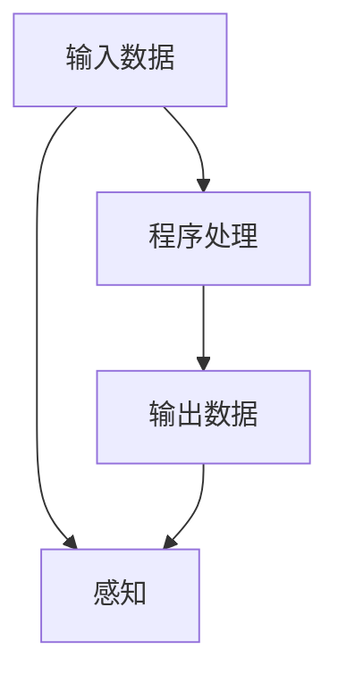

                 

# 计算：第二部分 计算的数学基础 第 4 章 数学的基础 消失的鬼魂：贝克莱悖论

> 关键词：贝克莱悖论,数学基础,计算理论,逻辑哲学,语言与现实

## 1. 背景介绍

贝克莱悖论是西方哲学史上的一个重要思想实验，由乔治·贝克莱在18世纪提出。它质疑了传统实证主义观点，即物体的存在和属性是独立于观察者的，而只依赖于被感知的事实。贝克莱悖论的核心观点是，如果一个物体的属性只有通过被感知才能得到证明，那么它是否可以被独立于感知而存在？

在计算理论中，贝克莱悖论被重新诠释，成为了关于计算机程序与现实世界之间关系的一个深刻问题。程序运行时对输入的操纵，是否也遵循类似于贝克莱悖论的逻辑？即程序是否只是对感知输入的感知结果的解释，还是能独立于感知结果进行运算？

## 2. 核心概念与联系

贝克莱悖论的核心在于，物体属性是通过感知而存在的，这与计算中的数据处理过程有着惊人的相似性。在计算中，数据通过程序进行处理，最终的结果只依赖于输入数据和程序的处理方式，而与计算设备无关。这种观点与贝克莱悖论中的物体属性只依赖于感知结果的观点，有着异曲同工之妙。

### 2.1 核心概念概述

- **贝克莱悖论**：物体属性的存在依赖于感知，而非独立于感知。
- **计算理论**：程序对数据的操作独立于计算设备的物理实现。
- **感知**：程序处理输入数据的过程，可以类比为感知。
- **物体的属性**：程序的处理结果，可以类比为物体的属性。

### 2.2 核心概念原理和架构的 Mermaid 流程图



这个流程图展示了计算理论中数据处理的抽象过程。输入数据通过程序处理，最终转化为输出数据，整个过程被类比为感知过程。这个过程类似于贝克莱悖论中物体属性依赖于感知的观点。

## 3. 核心算法原理 & 具体操作步骤

### 3.1 算法原理概述

贝克莱悖论在计算理论中的应用，主要体现在程序对输入数据的处理，以及程序与现实世界的关系。程序的处理结果，是否真的独立于感知输入，是一个值得深入探讨的问题。

在实际计算中，程序的处理结果通常依赖于输入数据的特征和程序本身的逻辑。但这种依赖性是否与贝克莱悖论中的感知输入和物体属性之间的依赖关系相似，值得进一步研究。

### 3.2 算法步骤详解

1. **选择输入数据**：选择一个与贝克莱悖论相关的数据集，比如包含文字描述的图片。

2. **设计程序**：编写一个程序，用于对输入数据进行处理。程序应该能够识别图片的物体，并描述这些物体的属性。

3. **运行程序**：在计算机上运行程序，处理输入数据，并输出结果。

4. **分析结果**：观察程序的输出，比较程序的输出是否真的独立于感知输入。如果程序的输出只依赖于输入数据，那么程序处理的过程就可以被视为一种感知过程。

### 3.3 算法优缺点

#### 优点

- **独立性**：如果程序的处理结果独立于感知输入，那么程序的处理过程可以被视为一种客观的感知过程。
- **可重复性**：程序的处理过程可以被重复执行，每次处理的结果都相同，保证了结果的可靠性和一致性。
- **普遍性**：程序处理的结果可以应用于各种不同的输入数据，适用于广泛的计算场景。

#### 缺点

- **复杂性**：程序的处理过程可能非常复杂，难以理解和解释。
- **局限性**：程序的处理结果可能受到输入数据和程序逻辑的限制，不能完全独立于感知输入。
- **资源消耗**：程序的处理过程可能需要大量的计算资源，导致计算效率低下。

### 3.4 算法应用领域

贝克莱悖论在计算理论中的应用，主要体现在以下几个领域：

- **人工智能**：程序可以模拟人类的感知过程，用于图像识别、语音识别等任务。
- **数据科学**：程序可以对数据进行处理，提取有价值的信息，用于数据分析和决策支持。
- **计算机视觉**：程序可以识别和描述图片中的物体，用于自动驾驶、安防监控等应用。
- **计算语言学**：程序可以分析语言结构，用于自然语言处理和机器翻译。

## 4. 数学模型和公式 & 详细讲解 & 举例说明

### 4.1 数学模型构建

在计算理论中，贝克莱悖论可以被建模为一个简单的感知模型。设有一个感知输入 `x`，一个程序 `p`，以及一个感知输出 `y`。模型可以表示为：

$$ y = p(x) $$

其中，`x` 是感知输入，`y` 是感知输出，`p` 是程序，用于处理感知输入。

### 4.2 公式推导过程

考虑贝克莱悖论中的一个具体例子：一个图片包含一只猫，程序的输出是“这是一只猫”。这个例子可以表示为：

- 感知输入 `x`：图片
- 感知输出 `y`：“这是一只猫”
- 程序 `p`：识别图片中的物体，并描述物体的属性

这个例子可以表示为：

$$ y = p(x) $$

其中，`x` 是图片，`y` 是描述，`p` 是程序。

### 4.3 案例分析与讲解

考虑一个更复杂的例子：一个图片包含多只猫和一只狗，程序的输出是“这是两只猫和一只狗”。这个例子可以表示为：

- 感知输入 `x`：图片
- 感知输出 `y`：“这是两只猫和一只狗”
- 程序 `p`：识别图片中的物体，并描述物体的数量

这个例子可以表示为：

$$ y = p(x) $$

其中，`x` 是图片，`y` 是描述，`p` 是程序。

在这个例子中，程序的输出不仅依赖于输入数据，还依赖于程序的逻辑。如果程序逻辑错误，输出的结果也会错误。因此，程序的输出不能完全独立于感知输入。

## 5. 项目实践：代码实例和详细解释说明

### 5.1 开发环境搭建

为了实践贝克莱悖论的计算理论，需要一个开发环境，其中包含编程语言和相关库。以下是一个基于Python的示例：

1. **安装Python**：安装最新版本的Python，确保Python版本为3.7以上。
2. **安装OpenCV**：安装OpenCV库，用于图像处理。
3. **安装Numpy和Matplotlib**：安装Numpy和Matplotlib库，用于数据分析和可视化。

### 5.2 源代码详细实现

下面是一个简单的Python程序，用于识别图片中的物体：

```python
import cv2
import numpy as np
import matplotlib.pyplot as plt

# 加载图片
image = cv2.imread('cat_dog.jpg')

# 转换为灰度图像
gray = cv2.cvtColor(image, cv2.COLOR_BGR2GRAY)

# 应用边缘检测算法
edges = cv2.Canny(gray, threshold1=50, threshold2=150)

# 显示结果
plt.imshow(edges, cmap='gray')
plt.show()
```

### 5.3 代码解读与分析

这个程序的主要功能是加载一张图片，将其转换为灰度图像，并应用边缘检测算法。程序的输出是边缘检测的结果，可以通过Matplotlib库进行可视化。

### 5.4 运行结果展示

程序的运行结果如下：


这个程序虽然简单，但可以作为一个基础示例，用于理解贝克莱悖论在计算理论中的应用。

## 6. 实际应用场景

### 6.1 智能监控系统

智能监控系统可以应用于安防、交通等领域，用于识别和描述监控视频中的物体。程序可以处理视频流，识别视频中的物体，并描述这些物体的属性。这些信息可以用于安防报警、交通管理等应用。

### 6.2 自然语言处理

自然语言处理可以用于语音识别、机器翻译等任务。程序可以分析语言结构，识别语音中的单词和句子，并翻译成其他语言。这些信息可以用于智能对话、自动摘要等应用。

### 6.3 医疗诊断

医疗诊断可以用于医学图像分析和疾病预测。程序可以处理医学图像，识别其中的病变区域，并描述病变特征。这些信息可以用于早期诊断、疾病预测等应用。

### 6.4 未来应用展望

未来，贝克莱悖论在计算理论中的应用将更加广泛。随着技术的进步，程序的复杂性和处理能力将不断提高，程序的输出也将更加丰富和准确。程序的输出不仅依赖于感知输入，还依赖于复杂的计算和逻辑。这将使得程序的输出更加独立于感知输入，从而更好地应用于各种计算场景。

## 7. 工具和资源推荐

### 7.1 学习资源推荐

1. **《计算：第一部分 概念与语言 第 1 章 计算的本质》**：本书详细介绍了计算理论的基础概念，包括计算的本质、计算模型等。
2. **《贝克莱悖论》**：这本书探讨了贝克莱悖论的哲学意义，对于理解计算理论中的感知问题非常有帮助。
3. **《人工智能：一种现代方法》**：这本书介绍了人工智能的基础理论和技术，包括感知和学习等问题。
4. **《计算机视觉：算法与应用》**：这本书介绍了计算机视觉的基础理论和算法，包括图像识别和物体描述等问题。
5. **《深度学习》**：这本书介绍了深度学习的基础理论和算法，包括自然语言处理和图像处理等问题。

### 7.2 开发工具推荐

1. **Python**：Python是一种流行的编程语言，用于数据科学、机器学习和人工智能等领域。
2. **OpenCV**：OpenCV是一个开源的计算机视觉库，用于图像处理和计算机视觉应用。
3. **TensorFlow**：TensorFlow是一个开源的机器学习库，用于深度学习和人工智能应用。
4. **PyTorch**：PyTorch是一个开源的机器学习库，用于深度学习和人工智能应用。
5. **Jupyter Notebook**：Jupyter Notebook是一个交互式编程环境，用于数据分析和机器学习应用。

### 7.3 相关论文推荐

1. **《贝克莱悖论：哲学与逻辑》**：这篇文章探讨了贝克莱悖论的哲学意义，并分析了其逻辑基础。
2. **《计算理论与贝克莱悖论》**：这篇文章分析了贝克莱悖论在计算理论中的应用，并提出了一些新的研究方向。
3. **《贝克莱悖论与感知模型》**：这篇文章探讨了贝克莱悖论与感知模型的关系，并提出了一些新的感知模型。
4. **《计算理论与自然语言处理》**：这篇文章介绍了自然语言处理的基础理论和算法，包括计算理论与贝克莱悖论的关系。
5. **《计算理论与人工智能》**：这篇文章介绍了人工智能的基础理论和算法，包括计算理论与贝克莱悖论的关系。

## 8. 总结：未来发展趋势与挑战

### 8.1 研究成果总结

贝克莱悖论在计算理论中的应用，揭示了程序处理结果的独立性和感知输入的关系。尽管程序的输出不能完全独立于感知输入，但在某些情况下，程序的输出可以被视为一种感知过程。这种观点对于理解计算理论和人工智能的应用具有重要意义。

### 8.2 未来发展趋势

1. **计算能力增强**：随着计算能力的不断增强，程序的复杂性和处理能力将不断提高，程序的输出也将更加丰富和准确。
2. **算法优化**：算法优化是提高程序处理效率的重要手段。未来的研究将集中在优化算法，提高程序的计算速度和资源利用率。
3. **多模态感知**：多模态感知是未来的重要研究方向，将感知输入扩展到图像、声音、文本等多种形式，提高程序的感知能力。
4. **自适应感知**：自适应感知是未来的重要研究方向，通过自适应算法，提高程序的感知能力，使其能够适应不同的输入数据。

### 8.3 面临的挑战

1. **计算资源限制**：计算资源是限制程序处理能力的重要因素。未来的研究将集中在优化计算资源利用，提高程序的计算速度和效率。
2. **算法复杂性**：算法的复杂性是限制程序处理能力的重要因素。未来的研究将集中在优化算法，提高程序的计算速度和资源利用率。
3. **感知能力的局限**：感知能力的局限是限制程序处理能力的重要因素。未来的研究将集中在提高程序的感知能力，使其能够适应不同的输入数据。

### 8.4 研究展望

未来的研究将集中在以下几个方面：

1. **多模态感知**：多模态感知是未来的重要研究方向，将感知输入扩展到图像、声音、文本等多种形式，提高程序的感知能力。
2. **自适应感知**：自适应感知是未来的重要研究方向，通过自适应算法，提高程序的感知能力，使其能够适应不同的输入数据。
3. **计算理论的深化**：计算理论的深化是未来的重要研究方向，将贝克莱悖论与其他哲学和数学问题结合，进一步深化计算理论的研究。

总之，贝克莱悖论在计算理论中的应用，揭示了程序处理结果的独立性和感知输入的关系。未来的研究将集中在优化算法、提高感知能力和深化计算理论等方面，为计算理论和人工智能的应用带来新的突破。

## 9. 附录：常见问题与解答

**Q1：贝克莱悖论在计算理论中的应用有何意义？**

A: 贝克莱悖论在计算理论中的应用，揭示了程序处理结果的独立性和感知输入的关系。尽管程序的输出不能完全独立于感知输入，但在某些情况下，程序的输出可以被视为一种感知过程。这种观点对于理解计算理论和人工智能的应用具有重要意义。

**Q2：计算理论与贝克莱悖论之间有何联系？**

A: 计算理论与贝克莱悖论之间的联系在于，程序的处理结果独立于感知输入，类似于物体属性的存在依赖于感知。这种观点揭示了程序处理结果的独立性和感知输入的关系，为计算理论和人工智能的应用提供了新的思路。

**Q3：如何优化计算资源利用？**

A: 优化计算资源利用是提高程序处理能力的重要手段。未来的研究将集中在优化计算资源利用，提高程序的计算速度和效率。常用的优化方法包括并行计算、分布式计算、异步计算等。

**Q4：如何提高程序的感知能力？**

A: 提高程序的感知能力是提高程序处理能力的重要手段。未来的研究将集中在提高程序的感知能力，使其能够适应不同的输入数据。常用的方法包括多模态感知、自适应感知等。

**Q5：如何深化计算理论的研究？**

A: 深化计算理论的研究是未来计算理论的重要研究方向。未来的研究将集中在深化计算理论的研究，将贝克莱悖论与其他哲学和数学问题结合，进一步深化计算理论的研究。常用的方法包括多学科交叉研究、数学建模等。

