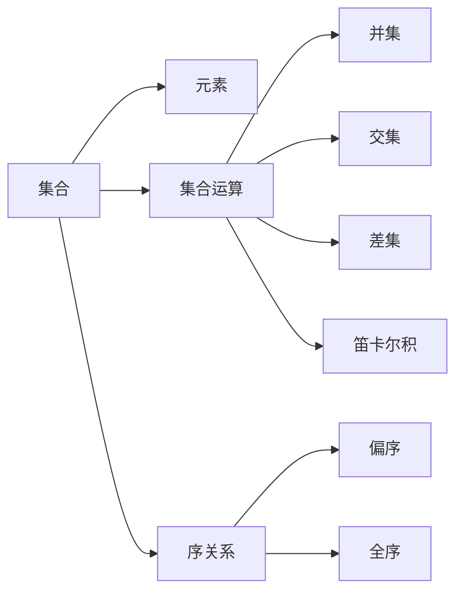

                 

# 计算：第二部分 计算的数学基础 第 4 章 数学的基础 集合论的诞生

> 关键词：集合论, 数学基础, 逻辑, 无限集, 实数

## 1. 背景介绍

### 1.1 问题由来

数学作为人类探索自然世界和理性认知的工具，其核心思想和方法论不断演进，对现代科学和技术发展产生了深远影响。然而，数学的基础理论，特别是集合论，直到20世纪才真正形成系统化。本文将深入探讨集合论的诞生背景、核心概念以及其对现代数学和计算机科学的影响。

### 1.2 问题核心关键点

集合论作为现代数学的基础，其核心思想是通过抽象集合的概念，描述事物的属性和关系，从而建立严谨的数学体系。集合论主要包括以下关键点：

- **集合**：由一组元素组成的抽象结构，元素可以是有序的或无序的。
- **元素**：集合中的基本单位，可以是数字、符号、文字等。
- **集合运算**：包括并集、交集、差集等基本运算。
- **无限集**：如自然数集、实数集等，具有无限多个元素。
- **序关系**：通过偏序、全序等关系定义集合的层次结构。

集合论的诞生，标志着数学从具体到抽象的转变，极大地推动了现代数学的发展，并为计算机科学奠定了坚实的理论基础。

## 2. 核心概念与联系

### 2.1 核心概念概述

集合论作为现代数学的基础，其核心概念主要包括：

- **集合**：由一组元素组成的无序、不重复的抽象结构，具有明确性、确定性和互异性。
- **元素**：集合中的基本单位，可以是任何类型的对象。
- **集合运算**：如并集（Union）、交集（Intersection）、差集（Difference）、笛卡尔积（Cartesian Product）等，用于描述集合之间的结构和关系。
- **序关系**：通过偏序、全序等关系定义集合的层次结构，用于描述集合的排序和比较。

### 2.2 核心概念原理和架构的 Mermaid 流程图



这个流程图展示了集合论的核心概念及其之间的关系：

1. **集合**：由元素组成，具有明确性和确定性。
2. **元素**：集合的基本单位，可以是任何类型的对象。
3. **集合运算**：包括并集、交集、差集、笛卡尔积等基本运算，用于描述集合之间的结构和关系。
4. **序关系**：通过偏序、全序等关系定义集合的层次结构，用于描述集合的排序和比较。

## 3. 核心算法原理 & 具体操作步骤

### 3.1 算法原理概述

集合论的算法原理主要基于集合的逻辑运算和集合的性质，通过数学推理和证明，建立严谨的数学体系。集合论的基本算法包括集合的创建、元素的插入和删除、集合的并集、交集、差集等基本运算，以及偏序、全序等序关系的定义和应用。

### 3.2 算法步骤详解

1. **集合创建**：定义一个集合，包含若干元素。
2. **元素插入**：向集合中添加元素。
3. **元素删除**：从集合中移除元素。
4. **集合运算**：
   - **并集**：将两个集合中的元素合并，去除重复元素。
   - **交集**：保留两个集合中共同的元素。
   - **差集**：从一个集合中移除另一个集合的元素。
   - **笛卡尔积**：生成两个集合的所有组合。
5. **序关系**：
   - **偏序**：集合中任意两个元素都有序关系。
   - **全序**：集合中的任意两个元素都有明确的顺序关系。

### 3.3 算法优缺点

集合论的算法主要优点在于其抽象性和通用性，可以描述各种类型的集合和运算，适用于广泛的数学领域。然而，集合论的缺点在于其复杂性和逻辑性，对于初学者来说理解较为困难。此外，集合论中的一些概念和运算，如无穷集和连续统的性质，也存在一定的争议和未解之谜。

### 3.4 算法应用领域

集合论不仅在数学领域有广泛应用，还在计算机科学、逻辑学、哲学等领域具有重要地位。例如：

- **计算机科学**：集合论是算法设计、数据结构、程序语言理论等的基础。
- **逻辑学**：集合论是形式逻辑和数学逻辑的基础。
- **哲学**：集合论与实证主义、唯心主义等哲学派别有深刻关联。

## 4. 数学模型和公式 & 详细讲解 & 举例说明

### 4.1 数学模型构建

集合论的数学模型主要基于集合和元素的概念，以及集合之间的各种运算。通过集合的符号表示和运算规则，可以建立严谨的数学体系。

### 4.2 公式推导过程

设 $A$ 和 $B$ 为两个集合，使用符号 $\in$ 表示元素与集合的关系，$\notin$ 表示不包含。集合运算的公式推导如下：

- **并集**：$A \cup B = \{x | x \in A \text{ 或 } x \in B\}$
- **交集**：$A \cap B = \{x | x \in A \text{ 且 } x \in B\}$
- **差集**：$A - B = \{x | x \in A \text{ 且 } x \notin B\}$
- **笛卡尔积**：$A \times B = \{(x, y) | x \in A \text{ 且 } y \in B\}$

### 4.3 案例分析与讲解

**案例1：集合的基本运算**

假设集合 $A = \{1, 2, 3\}$ 和 $B = \{2, 3, 4\}$，求 $A \cup B$、$A \cap B$、$A - B$ 和 $A \times B$。

- $A \cup B = \{1, 2, 3, 4\}$
- $A \cap B = \{2, 3\}$
- $A - B = \{1\}$
- $A \times B = \{(1, 2), (1, 3), (1, 4), (2, 2), (2, 3), (2, 4), (3, 2), (3, 3), (3, 4)\}$

**案例2：偏序关系**

设 $A = \{1, 2, 3\}$，定义集合 $B = \{(1, 2), (2, 3), (3, 1)\}$，判断 $B$ 是否构成偏序关系。

- $B$ 中的元素均为有序对，满足偏序关系。
- 对于任意有序对 $(x, y)$，存在 $z \in A$，使得 $(x, z) \in B$ 或 $(y, z) \in B$。
- 因此，$B$ 构成偏序关系。

## 5. 项目实践：代码实例和详细解释说明

### 5.1 开发环境搭建

在Python环境下，使用Sympy库进行集合论的实践。

首先，安装Sympy库：

```bash
pip install sympy
```

### 5.2 源代码详细实现

以下是使用Sympy库进行集合操作的示例代码：

```python
from sympy import FiniteSet, Union, Intersection, Difference, CartesianProduct

# 创建集合
A = FiniteSet(1, 2, 3)
B = FiniteSet(2, 3, 4)

# 并集
union_AB = Union(A, B)

# 交集
intersection_AB = Intersection(A, B)

# 差集
difference_AB = Difference(A, B)

# 笛卡尔积
cartesian_product_AB = CartesianProduct(A, B)

# 打印结果
print("并集:", union_AB)
print("交集:", intersection_AB)
print("差集:", difference_AB)
print("笛卡尔积:", cartesian_product_AB)
```

### 5.3 代码解读与分析

以上代码展示了使用Sympy库进行集合的基本运算。通过定义集合 $A$ 和 $B$，使用Sympy提供的集合操作函数，可以方便地进行并集、交集、差集和笛卡尔积的计算。

## 6. 实际应用场景

### 6.1 数据结构设计

在数据结构设计中，集合论的集合和运算被广泛应用于数组、列表、树等数据结构中。例如，哈希表通过集合的概念实现元素的无序存储和快速查找。

### 6.2 算法设计

在算法设计中，集合论的集合和运算被广泛用于图论、网络流、动态规划等问题。例如，Dijkstra算法使用集合运算来维护未访问节点和最短路径。

### 6.3 数据库设计

在数据库设计中，集合论的集合和运算被用于处理多对多关系、数据索引等。例如，关系型数据库中的外键和索引，本质上就是集合的笛卡尔积和差集。

### 6.4 未来应用展望

随着计算机技术和数学理论的不断发展，集合论的应用将更加广泛。未来，集合论将在大数据、人工智能、量子计算等领域发挥重要作用。

## 7. 工具和资源推荐

### 7.1 学习资源推荐

- **《集合论导论》**：由David C. Lay所著，是一本系统介绍集合论的入门书籍，适合初学者阅读。
- **《数学分析》**：由Thomas M. Apostol所著，介绍了集合论和实数理论的基础知识，适合进一步深入学习。
- **Coursera的《离散数学》课程**：由MIT提供，介绍了集合论、逻辑学、图论等离散数学的基本概念和应用。

### 7.2 开发工具推荐

- **Sympy库**：Python中用于符号计算的库，支持集合论的集合和运算。
- **Geogebra**：图形化数学软件，可以可视化集合和集合运算的结果。
- **LaTeX**：数学公式的排版工具，可以用于编写集合论的数学公式。

### 7.3 相关论文推荐

- **Zermelo的集合论公理**：由Ernst Zermelo所著，是集合论发展的奠基之作。
- **Gödel的《元数学》**：由Kurt Gödel所著，介绍了集合论和数理逻辑的基础知识。
- **Hilbert的《几何基础》**：由David Hilbert所著，通过几何学和集合论的关系，介绍了集合论的初步应用。

## 8. 总结：未来发展趋势与挑战

### 8.1 研究成果总结

集合论作为现代数学的基础，其核心思想和方法论对现代科学和技术发展产生了深远影响。通过集合论的严谨推理和数学证明，建立了系统的数学体系，为计算机科学奠定了坚实的理论基础。

### 8.2 未来发展趋势

集合论的未来的发展趋势主要集中在以下几个方向：

- **数学基础**：集合论作为数学的基础，将不断发展完善，推动数学理论的进步。
- **计算模型**：集合论的集合和运算将被广泛用于计算机科学和人工智能领域，推动计算模型的创新。
- **应用领域**：集合论的应用将进一步扩展，应用于大数据、量子计算、复杂系统等领域。

### 8.3 面临的挑战

尽管集合论取得了重要进展，但仍面临一些挑战：

- **复杂性**：集合论的概念和运算较为复杂，对于初学者来说理解较为困难。
- **无限集**：集合论中的一些概念和运算，如无穷集和连续统的性质，仍存在一些未解之谜。
- **逻辑性**：集合论的逻辑性和严谨性，需要在实际应用中进一步验证和完善。

### 8.4 研究展望

未来，集合论的研究将更加注重以下几个方面：

- **基础理论**：进一步探索集合论的基础理论和逻辑体系，推动数学理论的发展。
- **计算应用**：将集合论的集合和运算应用于计算机科学和人工智能领域，推动计算模型的创新。
- **应用拓展**：将集合论的理论和应用进一步扩展到大数据、量子计算、复杂系统等领域。

## 9. 附录：常见问题与解答

**Q1：如何理解集合的明确性和确定性？**

A: 集合的明确性是指集合中的元素必须是明确的，即集合中包含哪些元素是确定的。例如，集合 $A = \{1, 2, 3\}$ 中的元素是明确的。

集合的确定性是指集合中的元素是不重复的，即集合中包含的元素必须是唯一的。例如，集合 $B = \{1, 2, 3\}$ 中的元素是确定的。

**Q2：如何理解集合的无限性？**

A: 集合的无限性是指集合中的元素是无限的，无法用有限的元素表示。例如，自然数集 $\mathbb{N}$ 是无限的，包含了所有自然数。

集合的无限性在数学中有重要应用，如无限集合和连续统的性质，需要在数学证明中进一步探讨。

**Q3：如何理解偏序关系？**

A: 偏序关系是指集合中任意两个元素都有序关系，但不一定存在全序关系。例如，集合 $A = \{1, 2, 3\}$ 中的元素满足偏序关系，但不一定满足全序关系。

偏序关系在数学中有广泛应用，如图论中的有向无环图、网络流中的流量理论等。

**Q4：如何理解集合论对计算机科学的影响？**

A: 集合论作为计算机科学的基础，对数据结构、算法设计、数据库设计等领域产生了深远影响。例如：

- 数据结构：集合论的集合和运算被广泛应用于数组、列表、树等数据结构中。
- 算法设计：集合论的集合和运算被广泛用于图论、网络流、动态规划等问题。
- 数据库设计：集合论的集合和运算被用于处理多对多关系、数据索引等。

**Q5：如何理解集合论的局限性？**

A: 集合论虽然具有强大的抽象性和通用性，但仍存在一些局限性：

- 复杂性：集合论的概念和运算较为复杂，对于初学者来说理解较为困难。
- 无限集：集合论中的一些概念和运算，如无穷集和连续统的性质，仍存在一些未解之谜。
- 逻辑性：集合论的逻辑性和严谨性，需要在实际应用中进一步验证和完善。

总之，集合论作为现代数学的基础，其核心思想和方法论对现代科学和技术发展产生了深远影响。尽管集合论仍面临一些挑战，但通过不断探索和研究，其应用将进一步扩展，推动数学和计算机科学的发展。

