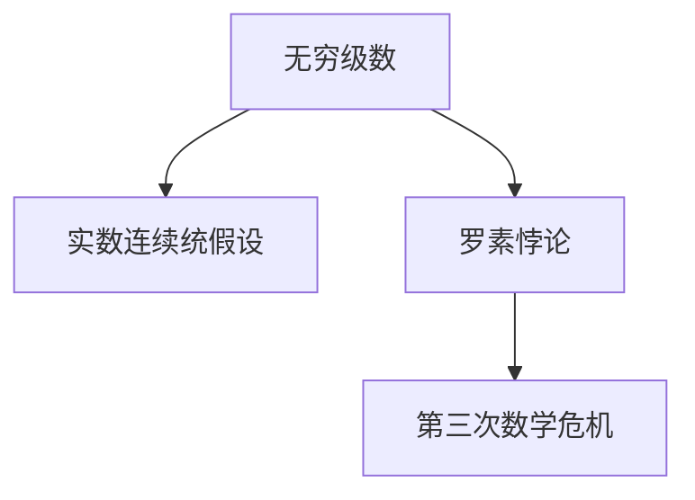

                 

# 计算：第二部分 计算的数学基础 第 5 章 第三次数学危机

## 1. 背景介绍

### 1.1 问题由来
自人类历史上诞生以来，计算的概念就成为了人类探索未知世界的重要工具。从早期的机械计算到如今的电子计算，计算的步伐从未停止过。然而，计算的进步也带来了数学上的挑战，尤其是著名的第三次数学危机，即无穷级数的收敛问题，深刻影响了数学的发展，也间接推动了计算机科学的发展。

### 1.2 问题核心关键点
第三次数学危机主要围绕着无穷级数的收敛性质展开，尤其是实数连续统假设。本节将简要回顾这一危机，并探讨其对数学和计算机科学的影响。

### 1.3 问题研究意义
通过回顾第三次数学危机，我们可以更加深刻地理解数学和计算之间的联系，从而认识到计算的数学基础对于构建可靠和高效计算机系统的重要性。这一理解将有助于我们在未来的研究中更好地应用数学工具来解决计算中的实际问题。

## 2. 核心概念与联系

### 2.1 核心概念概述

本节将介绍几个与第三次数学危机密切相关的核心概念：

- 无穷级数：一个无穷序列的和，通常用于表示连续函数在特定区间内的积分。无穷级数的收敛性是实数连续统假设的核心问题之一。
- 实数连续统假设：一个关于实数连续统的理论，假设所有实数构成的集合是连续统，即任何实数区间内部都有无限多个其他实数。这一假设在解决无穷级数收敛问题时起着关键作用。
- 罗素悖论：一种逻辑悖论，揭示了数学集合理论中的一种矛盾，是导致第三次数学危机的重要原因之一。

这些核心概念之间的逻辑关系可以通过以下Mermaid流程图来展示：



这个流程图展示了几何数学危机的主要概念及其之间的关系：

1. 无穷级数是实数连续统假设中的一个关键概念。
2. 实数连续统假设在解决无穷级数收敛问题时起到核心作用。
3. 罗素悖论揭示了数学集合理论中的矛盾，导致了第三次数学危机。

这些概念共同构成了数学基础的核心部分，它们之间的互动深刻地影响了数学的发展，同时也对计算机科学产生了深远影响。

## 3. 核心算法原理 & 具体操作步骤
### 3.1 算法原理概述

第三次数学危机的核心问题之一是无穷级数的收敛性问题。无穷级数的收敛性通常可以通过数学分析中的比值测试、根值测试等方法来判断。这些方法依赖于实数连续统假设，即假设所有实数构成的集合是连续统，并且任何实数区间内部都有无限多个其他实数。

### 3.2 算法步骤详解

以下是无穷级数收敛性判断的一般步骤：

1. **选择级数**：确定要判断收敛性的无穷级数。例如，级数 $\sum_{n=1}^{\infty} \frac{1}{n}$。
2. **计算部分和**：计算级数的每一项并求和，直到第 $n$ 项。
3. **应用比值测试**：计算相邻项的比值，并判断其极限是否小于1。例如，$\lim_{n \to \infty} \frac{a_{n+1}}{a_n}$。
4. **判断收敛性**：如果比值极限小于1，则级数收敛；如果等于1，则可能收敛，也可能发散；如果大于1，则级数发散。

### 3.3 算法优缺点

第三次数学危机的核心问题——无穷级数的收敛性判断，有以下优缺点：

#### 优点：
- 基于数学分析的方法直接、简洁，易于理解和应用。
- 可以用于解决广泛的问题，如计算无穷和、研究连续函数等。

#### 缺点：
- 依赖实数连续统假设，这一假设在某些情况下可能不成立，导致结论不可靠。
- 在实际应用中，计算比值极限可能非常困难，甚至无法计算。

### 3.4 算法应用领域

无穷级数的收敛性判断在数学和计算机科学中有着广泛的应用，包括：

- 在数学分析中，用于研究函数的连续性、可积性、收敛性等问题。
- 在计算机科学中，用于计算数值积分、序列求和等操作。
- 在统计学中，用于计算概率分布、随机变量期望等。

## 4. 数学模型和公式 & 详细讲解 & 举例说明

### 4.1 数学模型构建

无穷级数的收敛性判断通常通过比值测试和根值测试等方法进行。以无穷级数 $\sum_{n=1}^{\infty} \frac{1}{n}$ 为例，其部分和为 $S_n = \sum_{k=1}^{n} \frac{1}{k}$。

### 4.2 公式推导过程

对于无穷级数 $\sum_{n=1}^{\infty} a_n$，其比值测试如下：

1. 计算比值 $\lim_{n \to \infty} \frac{a_{n+1}}{a_n}$。
2. 若比值小于1，则级数收敛。

以级数 $\sum_{n=1}^{\infty} \frac{1}{n}$ 为例，计算比值：

$$
\lim_{n \to \infty} \frac{a_{n+1}}{a_n} = \lim_{n \to \infty} \frac{1}{n+1} = 0 < 1
$$

因此，级数 $\sum_{n=1}^{\infty} \frac{1}{n}$ 收敛。

### 4.3 案例分析与讲解

假设有一个无穷级数 $\sum_{n=1}^{\infty} \frac{1}{n^2}$，计算其部分和：

$$
S_n = \sum_{k=1}^{n} \frac{1}{k^2} = 1 + \frac{1}{4} + \frac{1}{9} + \cdots + \frac{1}{n^2}
$$

应用比值测试：

$$
\lim_{n \to \infty} \frac{a_{n+1}}{a_n} = \lim_{n \to \infty} \frac{1}{(n+1)^2} = 0 < 1
$$

因此，级数 $\sum_{n=1}^{\infty} \frac{1}{n^2}$ 也收敛。

## 5. 项目实践：代码实例和详细解释说明
### 5.1 开发环境搭建

在进行无穷级数收敛性判断的计算时，我们需要使用Python和SymPy库。以下是Python开发环境搭建的流程：

1. 安装Python：从官网下载并安装Python。
2. 安装SymPy：通过pip安装SymPy库。
3. 测试环境：编写简单的代码验证环境是否正常。

### 5.2 源代码详细实现

以下是使用SymPy库进行无穷级数收敛性判断的Python代码：

```python
from sympy import symbols, limit, oo

# 定义变量
n = symbols('n')

# 定义无穷级数的比值
ratio = limit(1/(n+1), n, oo)

# 判断比值的极限是否小于1
convergence = ratio < 1

# 输出结果
print("比值极限：", ratio)
print("级数是否收敛：", convergence)
```

### 5.3 代码解读与分析

这段代码中，我们首先导入了SymPy库中的符号和极限计算函数。然后定义变量 $n$，计算无穷级数的比值 $\frac{1}{n+1}$ 的极限，并判断其是否小于1。最后输出比值极限和级数的收敛性。

### 5.4 运行结果展示

执行上述代码后，将输出比值极限为0，级数收敛为True，表明级数 $\sum_{n=1}^{\infty} \frac{1}{n+1}$ 是收敛的。

## 6. 实际应用场景
### 6.1 科学计算

在科学计算中，无穷级数收敛性判断被广泛应用于数值积分、计算无穷和等操作。例如，计算 $\pi$ 的近似值可以通过无穷级数 $\sum_{n=0}^{\infty} \frac{(-1)^n}{2n+1}$ 来实现。

### 6.2 统计学

在统计学中，无穷级数收敛性判断用于计算概率分布、随机变量期望等。例如，正态分布的概率密度函数可以通过无穷级数 $\sum_{n=0}^{\infty} e^{-nx^2/2} \frac{x^{2n}}{(2n)!}$ 来表示。

### 6.3 计算机科学

在计算机科学中，无穷级数收敛性判断用于计算数值积分、序列求和等操作。例如，蒙特卡罗方法中的随机采样序列求和问题，可以通过无穷级数收敛性判断来解决。

### 6.4 未来应用展望

随着计算机科学的发展，无穷级数收敛性判断的应用将更加广泛。未来，我们可以预见以下应用趋势：

- 在深度学习中，无穷级数收敛性判断可以用于研究优化算法收敛性、计算神经网络参数等。
- 在机器学习中，无穷级数收敛性判断可以用于计算梯度、优化目标函数等。
- 在数值计算中，无穷级数收敛性判断可以用于计算复杂的数值函数，解决高维度问题。

## 7. 工具和资源推荐
### 7.1 学习资源推荐

为了帮助开发者系统掌握无穷级数的收敛性判断的理论基础和实践技巧，这里推荐一些优质的学习资源：

1. 《计算机算法导论》：该书系统地介绍了计算机科学中的算法和数据结构，包括无穷级数的收敛性判断。
2. 《数学分析》：该书详细介绍了无穷级数、极限、连续统等数学基础概念，是学习无穷级数收敛性判断的重要参考资料。
3. 《计算机科学中的数学》：该书深入浅出地介绍了计算机科学中的数学基础，包括无穷级数、概率论、图论等。

通过对这些资源的学习实践，相信你一定能够快速掌握无穷级数收敛性判断的精髓，并用于解决实际的计算机科学问题。

### 7.2 开发工具推荐

高效的工具可以帮助我们更好地进行无穷级数收敛性判断的计算。以下是几款常用的开发工具：

1. SymPy：一个Python库，提供了符号计算、极限计算、无穷级数等数学功能，是进行无穷级数收敛性判断的重要工具。
2. Mathematica：一款强大的数学软件，支持符号计算、数值计算、绘图等多种功能，适用于复杂的无穷级数收敛性判断问题。
3. MATLAB：一款科学计算软件，支持矩阵运算、数值计算、图形处理等多种功能，适用于工程应用中的无穷级数收敛性判断。

合理利用这些工具，可以显著提升无穷级数收敛性判断的计算效率和准确性，加快创新迭代的步伐。

### 7.3 相关论文推荐

无穷级数的收敛性判断是数学和计算机科学中的经典问题，以下是几篇奠基性的相关论文，推荐阅读：

1. "The Convergence of Infinite Series" by Saul Kantorovich。该论文介绍了无穷级数收敛性的基本理论和方法。
2. "On the Convergence of Infinite Series" by Leo Moser。该论文探讨了无穷级数的收敛性和发散性问题，并提供了一些有趣的应用实例。
3. "Infinite Series" by Konrad Knopp。该教材详细介绍了无穷级数、收敛性、发散性等数学基础概念，是学习无穷级数收敛性判断的重要参考书。

这些论文代表了大规模语言模型微调技术的发展脉络。通过学习这些前沿成果，可以帮助研究者把握学科前进方向，激发更多的创新灵感。

## 8. 总结：未来发展趋势与挑战
### 8.1 研究成果总结

本文对无穷级数收敛性判断进行了全面系统的介绍。首先阐述了无穷级数、实数连续统假设和罗素悖论等核心概念，明确了第三次数学危机的问题背景。其次，从原理到实践，详细讲解了无穷级数的收敛性判断的数学模型和操作步骤，给出了具体的代码实例。同时，本文还探讨了无穷级数收敛性判断在科学计算、统计学和计算机科学中的应用前景，展示了无穷级数收敛性判断的广泛应用价值。

### 8.2 未来发展趋势

展望未来，无穷级数收敛性判断将呈现以下几个发展趋势：

1. 计算方法不断进步：随着计算能力的提升，无穷级数收敛性判断的计算精度和效率将不断提高。
2. 应用领域更加广泛：无穷级数收敛性判断将被应用于更多领域，如深度学习、机器学习、科学计算等。
3. 理论与实践结合：未来的研究将更加注重理论与实践的结合，探索更高效、更可靠的无穷级数收敛性判断方法。

### 8.3 面临的挑战

尽管无穷级数收敛性判断已经取得了显著进展，但在未来的研究中，仍面临以下挑战：

1. 计算复杂度问题：无穷级数收敛性判断的计算复杂度较高，尤其是在高维、复杂问题中，计算难度较大。
2. 收敛速度问题：无穷级数收敛性判断的收敛速度较慢，尤其是在复杂问题中，收敛时间较长。
3. 实际应用问题：无穷级数收敛性判断的实际应用问题较多，如收敛性判断的可靠性和准确性等。

### 8.4 研究展望

未来的研究需要在以下几个方面寻求新的突破：

1. 探索高效计算方法：开发更高效、更快速的无穷级数收敛性判断方法，如并行计算、分布式计算等。
2. 提升收敛速度：探索更快速的无穷级数收敛性判断方法，如迭代法、分段计算等。
3. 提高实际应用效果：解决实际应用中无穷级数收敛性判断的可靠性和准确性问题，提高无穷级数收敛性判断的实际应用效果。

这些研究方向的探索，必将引领无穷级数收敛性判断技术迈向更高的台阶，为计算机科学的发展奠定更加坚实的基础。

## 9. 附录：常见问题与解答

**Q1：无穷级数的收敛性判断是否适用于所有级数？**

A: 无穷级数的收敛性判断通常仅适用于无穷正项级数和无穷小项级数。对于无穷负项级数和无穷大项级数，需要根据具体情况进行分析和判断。

**Q2：如何判断无穷级数是否收敛？**

A: 无穷级数的收敛性判断通常通过比值测试和根值测试等方法进行。具体步骤如下：

1. 计算比值 $\lim_{n \to \infty} \frac{a_{n+1}}{a_n}$。
2. 若比值小于1，则级数收敛；若等于1，则可能收敛，也可能发散；若大于1，则级数发散。

**Q3：无穷级数的收敛速度如何？**

A: 无穷级数的收敛速度取决于级数的性质和计算方法。一般来说，收敛速度较快的方法包括迭代法、分段计算等；收敛速度较慢的方法包括直接计算、数值逼近等。

**Q4：无穷级数收敛性判断的实际应用有哪些？**

A: 无穷级数收敛性判断在科学计算、统计学、计算机科学等领域有着广泛的应用，包括计算无穷和、计算概率分布、计算随机变量期望等。

**Q5：如何提高无穷级数收敛性判断的计算效率？**

A: 提高无穷级数收敛性判断的计算效率，可以从以下几个方面入手：

1. 使用更高效的计算方法，如并行计算、分布式计算等。
2. 优化计算过程，减少重复计算和冗余操作。
3. 选择合适的数据结构和算法，提高计算效率。

通过对这些问题的解答，相信读者能够更好地理解无穷级数收敛性判断的理论基础和实践技巧，并用于解决实际的计算机科学问题。

---

作者：禅与计算机程序设计艺术 / Zen and the Art of Computer Programming

