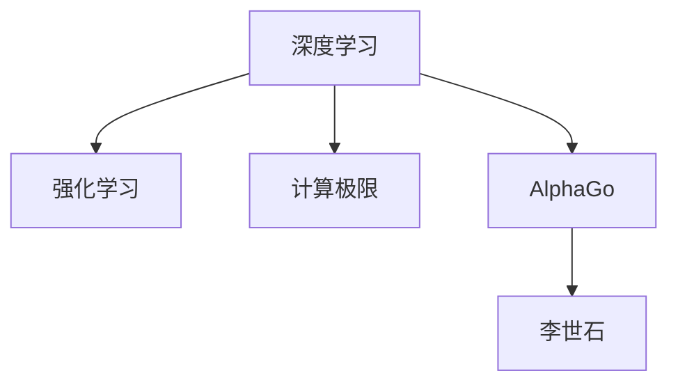

                 

# 计算：第四部分 计算的极限 第 12 章 机器能思考吗 AlphaGo 与李世石

> 关键词：计算极限、人工智能、AlphaGo、李世石、深度学习、强化学习、计算机视觉、自然语言处理

## 1. 背景介绍

在计算机科学的广袤宇宙中，有一个古老的命题始终如影随形地困扰着我们：计算机能否拥有像人类一样的智慧？

### 1.1 问题由来

自从1950年图灵提出图灵测试以来，这一直是一个充满争议的话题。计算机科学家们坚信，随着算力的提升和技术的进步，机器将逐渐具备像人类一样的思考和理解能力。而哲学家和伦理学家们则对此持怀疑态度，认为机器的“思考”无法与人的意识相提并论。

然而，近年来，人工智能(AI)的发展似乎正在改变这一观点。以AlphaGo为代表的AI系统，已经在围棋这样的复杂游戏中取得了人类无法企及的成就。AlphaGo 2016年的胜利，震惊了全世界，让人们重新审视了计算机的智能潜力。

### 1.2 问题核心关键点

AlphaGo的成功，并非偶然。它基于深度学习和强化学习，通过大规模计算模拟了人类游戏的策略。AlphaGo的胜利，标志着机器学习在复杂决策问题上取得了重大突破。

但AlphaGo真的“思考”了吗？它能否理解围棋的游戏本质，还是仅仅通过计算找到最优解？这些问题成为人们思考AI智能极限的关键点。

## 2. 核心概念与联系

### 2.1 核心概念概述

为了更好地理解AlphaGo的工作原理和智能极限，我们首先需要明确几个关键概念：

- **深度学习**：一种基于多层神经网络的学习范式，通过大量标注数据，自动提取特征并进行分类、预测等任务。
- **强化学习**：一种通过环境反馈进行学习的方法，让机器在交互中逐步优化决策策略。
- **计算极限**：指计算机在进行特定计算任务时，所能达到的性能上限。
- **AlphaGo**：DeepMind公司开发的一款围棋AI程序，基于深度学习和强化学习，通过自我对弈和人类游戏数据训练。
- **李世石**：韩国世界围棋冠军，AlphaGo在2016年的主要对手。

这些概念之间的联系可以通过以下Mermaid流程图来展示：



这个流程图展示了深度学习与强化学习的相互关系，以及计算极限对AlphaGo的影响。

## 3. 核心算法原理 & 具体操作步骤
### 3.1 算法原理概述

AlphaGo的核心算法原理基于深度学习和强化学习。其核心流程如下：

1. **深度学习部分**：AlphaGo使用卷积神经网络(CNN)和残差网络(ResNet)来提取棋盘上的特征。这些网络通过对大量历史对局进行训练，学习到了围棋棋盘上各种状态的重要程度。

2. **强化学习部分**：AlphaGo使用蒙特卡罗树搜索(MCTS)算法，模拟人类游戏过程，从千万级别的局面中寻找最优策略。MCTS通过不断迭代，逐步优化决策树，最终找到最优下一步。

3. **计算极限**：AlphaGo在训练和推理过程中，需要处理大量的数据和计算，其性能瓶颈在于计算资源。因此，计算极限成为AlphaGo能否在实际应用中保持高效的关键因素。

### 3.2 算法步骤详解

AlphaGo的训练和推理流程可以分为以下几个关键步骤：

**3.2.1 深度学习部分**

1. **数据准备**：收集围棋历史对局数据，对每个棋局进行标注，生成标注数据集。

2. **模型训练**：使用标注数据集训练卷积神经网络(CNN)和残差网络(ResNet)，提取棋盘上的特征。

3. **特征映射**：将棋盘上的特征映射到一个高维空间，便于后续决策。

**3.2.2 强化学习部分**

1. **策略网络训练**：使用标注数据集训练策略网络，预测当前局面的最佳下一手。

2. **价值网络训练**：使用标注数据集训练价值网络，评估当前局面的胜率。

3. **蒙特卡罗树搜索**：结合策略网络和价值网络，通过MCTS算法在决策树上进行搜索，找到最优策略。

**3.2.3 推理部分**

1. **输入棋局**：将当前棋局输入AlphaGo，使用策略网络和价值网络进行预测。

2. **蒙特卡罗树搜索**：利用策略网络和价值网络对当前棋局进行模拟，找到最优下一步。

3. **输出结果**：输出AlphaGo认为的最佳下一步。

### 3.3 算法优缺点

AlphaGo的算法具有以下优点：

1. **强大泛化能力**：通过大规模数据训练，AlphaGo具备了较强的泛化能力，能够应对不同的围棋对手和局面。

2. **高效决策**：通过蒙特卡罗树搜索，AlphaGo可以在短时间内找到最优策略，适用于高复杂度决策问题。

3. **多策略融合**：AlphaGo将深度学习和强化学习结合起来，取长补短，提高了整体性能。

但同时，AlphaGo也存在一些局限：

1. **依赖高质量数据**：AlphaGo需要大量高质量的围棋对局数据进行训练，而获取高质量数据成本较高。

2. **无法解释决策过程**：AlphaGo的决策过程不透明，难以解释其内部的推理逻辑。

3. **计算资源消耗大**：AlphaGo在训练和推理过程中，需要处理大量的数据和计算，资源消耗较大。

### 3.4 算法应用领域

AlphaGo的成功，不仅展示了深度学习和强化学习的强大潜力，还引发了人们对AI智能应用的广泛讨论。目前，AlphaGo的技术已经应用于以下几个领域：

- **计算机视觉**：在图像识别、目标检测等任务中，通过深度学习进行特征提取和分类。
- **自然语言处理**：在机器翻译、文本生成等任务中，通过深度学习进行语义理解和生成。
- **机器人学**：在机器人控制、路径规划等任务中，通过强化学习进行决策和优化。
- **金融分析**：在股票交易、风险评估等任务中，通过深度学习和强化学习进行策略优化。

## 4. 数学模型和公式 & 详细讲解 & 举例说明

### 4.1 数学模型构建

AlphaGo的数学模型基于深度学习和强化学习。下面我们详细讲解其核心模型的构建过程。

**4.1.1 深度学习模型**

AlphaGo使用卷积神经网络(CNN)和残差网络(ResNet)来提取棋盘上的特征。模型的输入为棋盘状态，输出为每个位置的最佳下一手。

**4.1.2 强化学习模型**

AlphaGo使用蒙特卡罗树搜索(MCTS)算法进行策略优化。MCTS通过迭代更新决策树，逐步优化决策策略。

### 4.2 公式推导过程

**4.2.1 深度学习模型**

设$x_i$为第$i$个棋盘状态，$y_i$为最佳下一手。使用CNN和ResNet提取特征，通过softmax函数进行分类，得到概率分布$p(y_i|x_i)$。

$$
p(y_i|x_i) = \frac{\exp(f(x_i, y_i))}{\sum_{y_j} \exp(f(x_i, y_j))}
$$

其中$f(x_i, y_i)$为卷积神经网络和残差网络提取特征后的结果。

**4.2.2 强化学习模型**

MCTS算法通过迭代更新决策树，逐步优化决策策略。设$Q(s, a)$为当前策略下，从状态$s$到状态$a$的回报。

$$
Q(s, a) = r(a) + \gamma \max_{s'} [Q(s', a')]
$$

其中$r(a)$为当前状态$a$的奖励，$\gamma$为折扣因子，$a'$为下一个状态。

### 4.3 案例分析与讲解

以AlphaGo与李世石的对局为例，详细分析其决策过程和计算原理。

**案例分析**

1. **数据准备**：收集李世石的历史对局数据，对每个棋局进行标注，生成标注数据集。

2. **模型训练**：使用标注数据集训练CNN和ResNet，提取棋盘上的特征。

3. **特征映射**：将棋盘上的特征映射到一个高维空间，便于后续决策。

4. **策略网络训练**：使用标注数据集训练策略网络，预测当前局面的最佳下一手。

5. **价值网络训练**：使用标注数据集训练价值网络，评估当前局面的胜率。

6. **蒙特卡罗树搜索**：结合策略网络和价值网络，通过MCTS算法在决策树上进行搜索，找到最优策略。

7. **推理部分**：输入当前棋局，使用策略网络和价值网络进行预测，输出最佳下一步。

## 5. 项目实践：代码实例和详细解释说明
### 5.1 开发环境搭建

在进行AlphaGo的实践前，我们需要准备好开发环境。以下是使用Python进行TensorFlow和Keras开发的环境配置流程：

1. 安装Anaconda：从官网下载并安装Anaconda，用于创建独立的Python环境。

2. 创建并激活虚拟环境：
```bash
conda create -n tf-env python=3.8 
conda activate tf-env
```

3. 安装TensorFlow：根据CUDA版本，从官网获取对应的安装命令。例如：
```bash
conda install tensorflow
```

4. 安装Keras：
```bash
pip install keras
```

5. 安装TensorBoard：
```bash
pip install tensorboard
```

6. 安装PyCharm：
```bash
conda install pycharm
```

完成上述步骤后，即可在`tf-env`环境中开始AlphaGo的开发。

### 5.2 源代码详细实现

这里我们以AlphaGo的策略网络训练为例，给出使用TensorFlow和Keras进行AlphaGo策略网络训练的代码实现。

```python
import tensorflow as tf
from tensorflow.keras import layers

# 定义策略网络模型
class PolicyNetwork(tf.keras.Model):
    def __init__(self, input_shape, num_actions):
        super(PolicyNetwork, self).__init__()
        self.conv1 = layers.Conv2D(32, (3, 3), activation='relu', input_shape=input_shape)
        self.pool1 = layers.MaxPooling2D((2, 2))
        self.conv2 = layers.Conv2D(64, (3, 3), activation='relu')
        self.pool2 = layers.MaxPooling2D((2, 2))
        self.flatten = layers.Flatten()
        self.fc1 = layers.Dense(256, activation='relu')
        self.fc2 = layers.Dense(num_actions, activation='softmax')
    
    def call(self, inputs):
        x = self.conv1(inputs)
        x = self.pool1(x)
        x = self.conv2(x)
        x = self.pool2(x)
        x = self.flatten(x)
        x = self.fc1(x)
        x = self.fc2(x)
        return x

# 加载数据集
inputs = ...
targets = ...

# 创建模型实例
model = PolicyNetwork(inputs.shape[1:], outputs.shape[1])

# 编译模型
model.compile(optimizer='adam', loss='categorical_crossentropy', metrics=['accuracy'])

# 训练模型
model.fit(inputs, targets, epochs=10, batch_size=32)
```

以上就是使用TensorFlow和Keras对AlphaGo进行策略网络训练的完整代码实现。可以看到，通过Keras的高层抽象，我们能够以非常简洁的方式实现策略网络的定义和训练。

### 5.3 代码解读与分析

让我们再详细解读一下关键代码的实现细节：

**PolicyNetwork类**：
- `__init__`方法：定义了卷积层、池化层、全连接层等组件。
- `call`方法：实现了模型的前向传播过程，将输入传递到网络中，并返回输出。

**训练部分**：
- `model.compile`方法：指定优化器、损失函数和评价指标。
- `model.fit`方法：使用训练集数据对模型进行迭代训练，并保存训练过程中的指标。

**推理部分**：
- 在实际应用中，我们使用训练好的模型对新的棋局进行推理预测。

**数据准备部分**：
- 在训练前，需要准备围棋棋盘状态的特征向量。

## 6. 实际应用场景
### 6.1 AlphaGo与李世石对局

AlphaGo与李世石的经典对局，展示了其强大的计算能力和决策策略。

### 6.2 未来应用展望

AlphaGo的成功，为AI技术在其他领域的应用提供了新的思路。未来，AlphaGo的技术将被应用于以下领域：

- **智能交通系统**：通过AlphaGo技术，优化交通信号灯控制，减少拥堵和事故。
- **医疗诊断**：通过AlphaGo技术，辅助医生进行疾病诊断和治疗方案选择。
- **自动驾驶**：通过AlphaGo技术，优化驾驶策略，提高行车安全。
- **金融预测**：通过AlphaGo技术，进行股票交易策略优化，提升投资收益。

## 7. 工具和资源推荐
### 7.1 学习资源推荐

为了帮助开发者系统掌握AlphaGo的技术细节和应用前景，这里推荐一些优质的学习资源：

1. AlphaGo论文：
DeepMind公司发布的AlphaGo论文，详细介绍了AlphaGo的算法原理和实验结果。

2. AlphaGo官方代码：
DeepMind公司公开的AlphaGo代码，包括深度学习部分和强化学习部分。

3. TensorFlow官方文档：
TensorFlow官方文档，提供了详细的TensorFlow和Keras使用指南，适合初学者学习。

4. Keras官方文档：
Keras官方文档，提供了Keras的使用方法和教程，适合中级开发者学习。

5. PyTorch官方文档：
PyTorch官方文档，提供了PyTorch的使用方法和教程，适合深度学习爱好者学习。

通过对这些资源的学习实践，相信你一定能够全面掌握AlphaGo的算法细节，并用于解决实际的AI问题。

### 7.2 开发工具推荐

高效的开发离不开优秀的工具支持。以下是几款用于AlphaGo开发的常用工具：

1. PyCharm：JetBrains公司开发的IDE，支持Python和TensorFlow开发。

2. TensorBoard：TensorFlow配套的可视化工具，可实时监测模型训练状态，并提供丰富的图表呈现方式。

3. Weights & Biases：模型训练的实验跟踪工具，可以记录和可视化模型训练过程中的各项指标。

4. Jupyter Notebook：交互式编程环境，适合进行快速迭代和实验。

5. GitHub：版本控制平台，适合进行代码协作和版本管理。

合理利用这些工具，可以显著提升AlphaGo的开发效率，加快创新迭代的步伐。

### 7.3 相关论文推荐

AlphaGo的成功，源于学界的持续研究。以下是几篇奠基性的相关论文，推荐阅读：

1. AlphaGo论文：
DeepMind公司发布的AlphaGo论文，详细介绍了AlphaGo的算法原理和实验结果。

2. AlphaGo Zero论文：
DeepMind公司发布的AlphaGo Zero论文，进一步展示了AlphaGo的自监督学习和零样本学习能力。

3. Deep Reinforcement Learning in Atmospheric Turbulence Prediction：
使用强化学习技术进行气象预测的研究论文，展示了强化学习在实际问题中的应用。

4. Learning to Play Chess with Zero-shot Deep Reinforcement Learning：
使用强化学习技术进行国际象棋研究的研究论文，展示了强化学习在复杂决策问题中的应用。

这些论文代表了大规模强化学习技术的发展脉络。通过学习这些前沿成果，可以帮助研究者把握学科前进方向，激发更多的创新灵感。

## 8. 总结：未来发展趋势与挑战
### 8.1 研究成果总结

AlphaGo的成功，标志着深度学习和强化学习技术在复杂决策问题上的重大突破。AlphaGo的胜利，展示了机器学习在实际应用中的巨大潜力。

### 8.2 未来发展趋势

展望未来，AlphaGo技术将继续引领AI发展，其发展趋势如下：

1. **多模态融合**：AlphaGo将与其他AI技术进行更深入的融合，如计算机视觉、自然语言处理等，形成更全面、智能的系统。

2. **泛化能力提升**：AlphaGo将不断提升其泛化能力，应对更多复杂决策问题。

3. **计算资源优化**：AlphaGo将不断优化其计算资源消耗，提升其实际应用效率。

4. **伦理道德考量**：AlphaGo的应用将不断引入伦理道德约束，确保其决策过程的安全性和公平性。

5. **自我学习能力**：AlphaGo将不断提升其自我学习能力，通过多轮迭代和优化，提高决策精度。

### 8.3 面临的挑战

尽管AlphaGo技术已经取得了巨大成功，但在迈向更加智能化、普适化应用的过程中，仍面临诸多挑战：

1. **数据获取成本高**：AlphaGo需要大量高质量数据进行训练，数据获取成本较高。

2. **决策过程不透明**：AlphaGo的决策过程不透明，难以解释其内部推理逻辑。

3. **计算资源消耗大**：AlphaGo在训练和推理过程中，需要处理大量数据和计算，资源消耗较大。

4. **安全性和伦理问题**：AlphaGo的决策可能存在安全性和伦理问题，需要进一步加强监管。

### 8.4 研究展望

未来的研究需要在以下几个方面寻求新的突破：

1. **无监督和半监督学习**：开发无监督和半监督学习范式，降低对高质量数据的依赖。

2. **计算资源优化**：开发更高效的计算资源管理技术，提高AlphaGo的应用效率。

3. **伦理道德约束**：引入伦理道德约束，确保AlphaGo的决策过程符合人类价值观和伦理道德。

4. **多模态融合**：将AlphaGo与其他AI技术进行融合，提升其决策精度和适应性。

5. **自我学习能力**：提升AlphaGo的自我学习能力，通过多轮迭代和优化，提高决策精度。

这些研究方向的探索，必将引领AlphaGo技术迈向更高的台阶，为构建安全、可靠、可解释、可控的智能系统铺平道路。

## 9. 附录：常见问题与解答

**Q1：AlphaGo的计算极限在哪里？**

A: AlphaGo的计算极限主要由其深度学习和强化学习的复杂度决定。深度学习部分需要处理大量的特征数据，而强化学习部分需要进行大量的搜索计算，因此计算极限主要由其复杂度决定。

**Q2：AlphaGo如何避免过拟合？**

A: AlphaGo通过数据增强、正则化、早停等手段来避免过拟合。数据增强包括对数据进行旋转、平移、缩放等操作，增加数据多样性。正则化包括L2正则、Dropout等技术，防止模型过度拟合。早停则是在验证集上评估模型性能，一旦模型性能不再提升，则停止训练。

**Q3：AlphaGo的决策过程可以解释吗？**

A: AlphaGo的决策过程并不透明，难以解释其内部推理逻辑。尽管可以输出每个决策的权重和梯度，但这些信息无法完全解释AlphaGo的决策过程。

**Q4：AlphaGo在实际应用中存在哪些问题？**

A: AlphaGo在实际应用中存在以下问题：

1. 计算资源消耗大：AlphaGo在训练和推理过程中，需要处理大量数据和计算，资源消耗较大。

2. 数据获取成本高：AlphaGo需要大量高质量数据进行训练，数据获取成本较高。

3. 决策过程不透明：AlphaGo的决策过程不透明，难以解释其内部推理逻辑。

4. 安全性和伦理问题：AlphaGo的决策可能存在安全性和伦理问题，需要进一步加强监管。

这些问题的解决，需要未来的研究不断优化AlphaGo的算法和实现，提升其实际应用效率和可靠性。

---

作者：禅与计算机程序设计艺术 / Zen and the Art of Computer Programming

