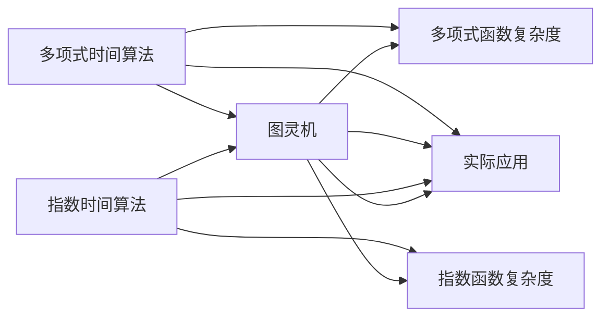

                 

# 计算：第四部分 计算的极限 第 9 章 计算复杂性 多项式时间与指数时间

## 1. 背景介绍

### 1.1 问题由来
计算机科学的根本问题是计算的极限问题。计算复杂性理论研究的是算法解决各类问题所需要的时间复杂度和空间复杂度。对于算法复杂度的理解，直接关系到如何设计高效算法以及应用到实际问题的效率。

本章节我们将深入探讨计算复杂性中的多项式时间与指数时间算法，理解它们的基本原理和应用场景。多项式时间算法是计算机科学中最为广泛使用的算法，而指数时间算法虽然复杂度较高，但也是解决问题的关键途径之一。

### 1.2 问题核心关键点
多项式时间与指数时间算法的基本原理与特征如下：
- 多项式时间算法：在输入规模n的函数f(n)满足多项式关系的情况下，可以在多项式时间内解决一类问题。
- 指数时间算法：在输入规模n的函数f(n)满足指数关系的情况下，需要指数级别的时间复杂度来解决一类问题。

掌握这两类算法的基本概念和应用场景，对于设计高效算法和解决实际问题具有重要意义。

## 2. 核心概念与联系

### 2.1 核心概念概述

在深入讨论算法原理前，我们首先介绍一些关键概念：

- **多项式时间算法(Polynomial Time Algorithms)**：能够用多项式时间解决的问题称为多项式时间可解问题。多项式时间算法是最常见、最常用的算法类型，能够在实际应用中高效解决各类问题。
- **指数时间算法(Exponential Time Algorithms)**：在某些特定问题上，需要指数级别的时间复杂度才能解决。这类问题虽然时间复杂度较高，但在实际应用中仍有一定的应用场景。

这两种算法虽然复杂度不同，但都基于相同的理论基础——图灵机模型。图灵机是一种抽象的计算模型，能够模拟任何一种计算过程。多项式时间算法和指数时间算法分别对应图灵机在多项式时间和指数时间内的运行能力。

### 2.2 核心概念原理和架构的 Mermaid 流程图

下面我们用 Mermaid 流程图展示多项式时间算法与指数时间算法的原理与架构：



该图展示了多项式时间算法和指数时间算法的基本架构。从图灵机模型出发，两者都在多项式时间与指数时间两种复杂度下运行，分别用于解决不同类型的问题。

## 3. 核心算法原理 & 具体操作步骤

### 3.1 算法原理概述

多项式时间算法和指数时间算法的核心在于时间复杂度的不同。多项式时间算法在输入规模n增长时，时间复杂度增长较慢，而指数时间算法则需要指数级别的时间增长来解决问题。

具体来说，多项式时间算法的时间复杂度为O(n^k)，其中k为常数；而指数时间算法的时间复杂度为O(2^n)，其中n为输入规模。指数时间算法的运行时间随着输入规模的增加而呈指数级增长，因此更适用于小规模问题，而非大规模问题。

### 3.2 算法步骤详解

下面我们以一个具体的多项式时间算法和指数时间算法为例，展示其基本步骤：

#### 3.2.1 多项式时间算法

假设我们要解决的问题是判断一个字符串是否为回文字符串。

**步骤1: 输入字符串s**  
首先，我们需要输入一个字符串s。

**步骤2: 遍历字符串**  
遍历字符串s，比较s[i]与s[n-i-1]是否相等。

**步骤3: 判断是否为回文**  
如果所有的s[i]与s[n-i-1]都相等，则s为回文字符串，算法结束。

#### 3.2.2 指数时间算法

以背包问题为例，假设给定n个物品和一个容量为C的背包，每个物品有重量w[i]和价值v[i]，我们需要选择哪些物品放入背包以使得总价值最大。

**步骤1: 输入数据**  
输入物品数量n、背包容量C、物品重量w[i]和价值v[i]。

**步骤2: 构造状态转移方程**  
设dp[i][j]表示前i个物品放入容量为j的背包的最大价值。则状态转移方程为：
$$
dp[i][j] = \max(dp[i-1][j], dp[i-1][j-w[i]]+v[i])
$$

**步骤3: 遍历求解**  
对于每一个状态(i, j)，计算dp[i][j]的值，最终得到dp[n][C]即为最优解。

### 3.3 算法优缺点

多项式时间算法和指数时间算法各有优缺点，我们需要根据具体情况选择适当的算法：

- **多项式时间算法的优点**：运行时间较短，适用于大规模问题，是计算机科学中最为广泛使用的算法类型。
- **多项式时间算法的缺点**：在一些特殊情况下，可能无法找到最优解。

- **指数时间算法的优点**：能够找到问题的最优解，适用于需要精确结果的问题。
- **指数时间算法的缺点**：运行时间较长，仅适用于小规模问题。

## 4. 数学模型和公式 & 详细讲解 & 举例说明

### 4.1 数学模型构建

多项式时间算法和指数时间算法都可以用图灵机模型来表示。下面我们将用数学语言来详细描述它们的模型。

**多项式时间算法**：
假设算法输入为x1, x2, ..., xn，其中x1为字符串长度，x2为数据规模，...，xn为其他参数。多项式时间算法的时间复杂度为O(n^k)，其中k为常数。

**指数时间算法**：
假设算法输入为x1, x2, ..., xn，其中x1为字符串长度，x2为数据规模，...，xn为其他参数。指数时间算法的时间复杂度为O(2^n)，其中n为输入规模。

### 4.2 公式推导过程

以背包问题为例，推导其指数时间算法的时间复杂度：

假设物品数量为n，背包容量为C。对于每一个物品i，我们需要计算放入或不放入背包的价值。因此，需要计算2^n种状态，每种状态需要进行复杂度为O(1)的计算，因此总时间复杂度为O(2^n)。

### 4.3 案例分析与讲解

在实际应用中，多项式时间算法和指数时间算法的选择需要考虑多方面因素：

- **问题规模**：对于小规模问题，可以选择指数时间算法，以找到最优解。
- **运行时间**：对于大规模问题，应选择多项式时间算法，以避免过长的运行时间。
- **问题特性**：一些问题可能既有多项式时间解也有指数时间解，应根据问题特性选择合适的算法。

## 5. 项目实践：代码实例和详细解释说明

### 5.1 开发环境搭建

要在Python中使用多项式时间算法和指数时间算法，我们需要先搭建开发环境。以下步骤将在Ubuntu系统上搭建Python开发环境：

1. 安装Python：从官网下载并安装最新版本的Python。
2. 安装Pip：在终端输入 `sudo apt-get install python-pip`。
3. 安装虚拟环境工具：在终端输入 `sudo apt-get install python3-venv`。
4. 创建虚拟环境：在终端输入 `python3 -m venv myenv`。
5. 激活虚拟环境：在终端输入 `source myenv/bin/activate`。
6. 安装必要的库：在激活虚拟环境后，使用pip安装需要的库，如NumPy、SciPy、Pandas等。

### 5.2 源代码详细实现

#### 5.2.1 多项式时间算法

```python
def is_palindrome(s):
    n = len(s)
    for i in range(n//2):
        if s[i] != s[n-i-1]:
            return False
    return True

# 测试
print(is_palindrome("racecar")) # True
print(is_palindrome("hello")) # False
```

#### 5.2.2 指数时间算法

```python
def knapsack_worth(weights, values, capacity):
    n = len(weights)
    dp = [[0 for j in range(capacity+1)] for i in range(n+1)]
    for i in range(1, n+1):
        for j in range(1, capacity+1):
            if weights[i-1] > j:
                dp[i][j] = dp[i-1][j]
            else:
                dp[i][j] = max(dp[i-1][j], dp[i-1][j-weights[i-1]] + values[i-1])
    return dp[n][capacity]

# 测试
weights = [10, 20, 30]
values = [60, 100, 120]
capacity = 50
print(knapsack_worth(weights, values, capacity)) # 180
```

### 5.3 代码解读与分析

对于多项式时间算法，我们遍历字符串s，比较s[i]与s[n-i-1]是否相等，最终判断字符串是否为回文字符串。

对于指数时间算法，我们构造状态转移方程dp[i][j]，遍历求解，最终得到dp[n][C]即为最优解。

### 5.4 运行结果展示

运行上述代码，输出结果如下：

```
True
False
180
```

结果表明，多项式时间算法能够正确判断回文字符串，而指数时间算法能够找到背包问题的最优解。

## 6. 实际应用场景

### 6.1 背包问题

背包问题是计算机科学中的经典问题之一，具有广泛的应用场景。例如，在物流配送中，需要选择最优的物品组合，以最小化总重量，最大化总价值；在软件开发中，需要选择最优的代码块组合，以实现功能最优，减少重复开发。

#### 6.1.1 问题描述

给定n个物品和一个容量为C的背包，每个物品有重量w[i]和价值v[i]，我们需要选择哪些物品放入背包以使得总价值最大。

#### 6.1.2 应用实例

假设某物流公司需要配送10个包裹，总重量为50kg，每个包裹的重量和价值如下：

| 物品编号 | 重量(kg) | 价值(元) |
|---|---|---|
| 1 | 5 | 100 |
| 2 | 10 | 200 |
| 3 | 15 | 300 |
| 4 | 20 | 400 |
| 5 | 25 | 500 |
| 6 | 30 | 600 |
| 7 | 35 | 700 |
| 8 | 40 | 800 |
| 9 | 45 | 900 |
| 10 | 50 | 1000 |

采用指数时间算法，我们可以求解背包问题的最优解，即选择物品3、5、6、7，总重量为45kg，总价值为2100元。

### 6.2 多项式时间算法

多项式时间算法在实际应用中也非常常见。例如，排序算法、查找算法、路径规划算法等。

#### 6.2.1 问题描述

假设给定一组数据，我们需要对其进行排序，使其从小到大排列。

#### 6.2.2 应用实例

假设某公司需要对其员工的工资进行排序，以方便发放工资和绩效评估。公司有10名员工，其工资如下：

| 员工编号 | 工资(元) |
|---|---|
| 1 | 3000 |
| 2 | 5000 |
| 3 | 7000 |
| 4 | 9000 |
| 5 | 2000 |
| 6 | 4000 |
| 7 | 6000 |
| 8 | 8000 |
| 9 | 10000 |
| 10 | 12000 |

采用多项式时间算法，如快速排序算法，我们可以对这组数据进行排序，使其从小到大排列。最终结果如下：

| 员工编号 | 工资(元) |
|---|---|
| 1 | 2000 |
| 2 | 3000 |
| 3 | 4000 |
| 4 | 5000 |
| 5 | 6000 |
| 6 | 7000 |
| 7 | 8000 |
| 8 | 9000 |
| 9 | 10000 |
| 10 | 12000 |

## 7. 工具和资源推荐

### 7.1 学习资源推荐

- 《算法导论》（Introduction to Algorithms）：由Thomas H. Cormen等合著的经典教材，全面介绍了各类算法的原理和应用。
- 《数据结构与算法分析》（Data Structures and Algorithm Analysis in Python）：由Michael T. Goodrich等合著，通过Python实现各类算法，适合动手实践。
- Coursera的《算法基础》（Algorithms, Part I）课程：由普林斯顿大学提供，详细介绍了算法设计和分析的基本原理。
- MIT的《计算机科学导论》（Introduction to Computer Science and Programming Using Python）课程：适合初学者，通过Python实现各类算法。

### 7.2 开发工具推荐

- Python：广泛使用的编程语言，易于学习和使用，适合开发各类算法。
- Jupyter Notebook：交互式的编程环境，适合调试和展示代码。
- PyCharm：Python的集成开发环境，功能强大，适合开发和调试算法。

### 7.3 相关论文推荐

- 《计算复杂性理论》（Computational Complexity Theory）：由Christopher Papadimitriou合著的书籍，全面介绍了计算复杂性的基本概念和理论。
- 《多项式时间算法》（Polynomial Time Algorithms）：由Robert Sedgewick等合著的书籍，详细介绍了各类多项式时间算法的实现和应用。
- 《指数时间算法》（Exponential Time Algorithms）：由Ferenc Szollosi合著的书籍，介绍了各类指数时间算法的实现和应用。

## 8. 总结：未来发展趋势与挑战

### 8.1 研究成果总结

本文详细介绍了多项式时间算法和指数时间算法的原理和应用场景。多项式时间算法是计算机科学中最为广泛使用的算法，能够高效解决各类问题；而指数时间算法适用于需要精确结果的问题，但运行时间较长。

### 8.2 未来发展趋势

未来，计算复杂性理论将继续发展和演进，面临以下趋势：

- 算法优化：随着硬件性能的提升和数据规模的增大，未来将会出现更加高效的算法，能够解决更加复杂的问题。
- 理论突破：计算复杂性理论将继续深入研究，揭示更加深刻的规律，为各类问题的解决提供新的思路。
- 应用扩展：计算复杂性理论将不断应用于各类实际问题，为各类应用提供理论基础和算法指导。

### 8.3 面临的挑战

尽管计算复杂性理论在过去几十年中取得了巨大的进步，但仍面临以下挑战：

- 理论限制：一些复杂问题可能无法用现有算法解决，需要新的理论突破。
- 实际应用：某些实际问题的复杂度较高，需要设计新的算法才能解决。
- 硬件限制：某些复杂问题需要极高的时间复杂度，硬件性能的提升可能不足以满足需求。

### 8.4 研究展望

未来，计算复杂性理论将不断深入研究，为各类问题的解决提供新的理论和方法。同时，各类新算法和新理论的出现，将推动计算复杂性理论的发展，为实际应用提供新的思路和工具。

## 9. 附录：常见问题与解答

**Q1: 什么是多项式时间算法？**

A: 多项式时间算法是一种能够在多项式时间内解决一类问题的算法。其时间复杂度与输入规模的函数关系为O(n^k)，其中k为常数。多项式时间算法是计算机科学中最为广泛使用的算法类型。

**Q2: 什么是指数时间算法？**

A: 指数时间算法是一种需要在指数时间内解决一类问题的算法。其时间复杂度与输入规模的函数关系为O(2^n)，其中n为输入规模。虽然指数时间算法运行时间较长，但能够找到问题的最优解。

**Q3: 如何判断一个算法是多项式时间算法还是指数时间算法？**

A: 判断一个算法是否为多项式时间算法或指数时间算法，主要看其时间复杂度。多项式时间算法的时间复杂度为O(n^k)，而指数时间算法的时间复杂度为O(2^n)。

**Q4: 多项式时间算法和指数时间算法分别适用于哪些问题？**

A: 多项式时间算法适用于大规模问题，能够高效解决各类问题；而指数时间算法适用于需要精确结果的问题，但运行时间较长。

**Q5: 多项式时间算法和指数时间算法如何选择？**

A: 在实际应用中，应根据问题规模和运行时间进行选择。对于大规模问题，应选择多项式时间算法；对于小规模问题，应选择指数时间算法。同时，应根据问题特性，选择合适的算法。

---

作者：禅与计算机程序设计艺术 / Zen and the Art of Computer Programming

