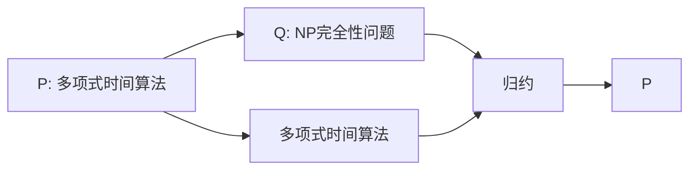

                 

# 计算：第四部分 计算的极限 第 9 章 计算复杂性 库克-莱文定理

## 1. 背景介绍

### 1.1 问题由来

在计算机科学和计算理论中，计算复杂性理论是一个基础而重要的分支。它研究的是问题的计算资源需求，例如时间复杂度和空间复杂度，以及它们与问题本身性质之间的关系。库克-莱文定理（Cook-Levin Theorem）是该领域的一个核心结果，它将NP完全性问题与计算复杂性理论紧密联系起来。

库克-莱文定理指出：如果一个问题P可以被多项式时间算法解决，那么它也必定可以归约到某个已知的问题Q，且Q也是NP完全的。这个定理不仅证明了NP完全性问题的存在，而且揭示了多项式时间算法的局限性，是现代计算理论的重要基石。

## 2. 核心概念与联系

### 2.1 核心概念概述

在探讨库克-莱文定理之前，我们需要先了解一些相关的核心概念：

- **NP完全性问题**：如果某个问题P可以归约到另一个问题Q，且Q已知是NP完全的，那么称P也是NP完全的。NP完全性问题在计算机科学中具有极高的研究价值，因为它们代表了计算复杂性的极限。
- **多项式时间算法**：指能够在多项式时间内求解的算法。多项式时间算法是计算理论中研究的主要对象，因为它们代表了最理想的求解效率。
- **算法归约**：指将一个问题的求解归约到另一个问题的求解过程中，通过调整输入数据或增加额外的信息，使得新问题的求解也可以解决原始问题。算法归约是理论计算机科学中常用的工具，用于证明问题的复杂性。

### 2.2 核心概念原理和架构的 Mermaid 流程图



**解释**：从多项式时间算法A出发，通过归约D能够证明A可以转化为NP完全性问题B，进而能够证明A也是NP完全的。

## 3. 核心算法原理 & 具体操作步骤

### 3.1 算法原理概述

库克-莱文定理的核心思想是通过算法归约将一个问题的求解转化为另一个已知问题的求解，从而证明该问题的复杂性。具体来说，如果问题P是多项式时间可解的，那么它必定可以归约到某个已知NP完全的问题Q，且Q的求解算法也可以用来求解P。

### 3.2 算法步骤详解

库克-莱文定理的证明分为两个部分：

1. **证明NP完全性问题归约到多项式时间可解问题**：
   - 假设问题Q是NP完全的，存在多项式时间算法C。
   - 对于任意一个输入x，若问题Q是多项式时间可解的，那么可以使用算法C求解Q(x)。
   - 将Q(x)的求解结果记为y，构造新的问题P(x, y)。
   - 如果问题P(x, y)也可以被多项式时间算法解决，则P是多项式时间可解的。

2. **证明多项式时间可解问题归约到NP完全性问题**：
   - 假设问题P是多项式时间可解的，存在多项式时间算法A。
   - 对于任意一个输入x，使用算法A求解P(x)。
   - 构造新的问题Q(x, P(x))。
   - 如果问题Q是NP完全的，那么P也是NP完全的。

### 3.3 算法优缺点

**优点**：
- 揭示了多项式时间算法的局限性，即如果某个问题属于NP类，那么它必定可以归约到某个已知NP完全问题。
- 证明了NP完全性问题的存在，为复杂性理论研究提供了重要工具。

**缺点**：
- 对于实际的多项式时间算法，库克-莱文定理无法直接应用，因为它只证明了理论上的归约关系。
- 复杂度证明不能直接转换为实际算法，需要结合其他方法进行求解。

### 3.4 算法应用领域

库克-莱文定理在计算机科学和计算理论中有着广泛的应用，包括：

- **算法设计**：库克-莱文定理揭示了多项式时间算法和NP完全性问题之间的关系，为算法设计提供了理论基础。
- **复杂性理论**：库克-莱文定理是复杂性理论的重要成果，为研究问题的计算复杂性提供了重要工具。
- **密码学**：库克-莱文定理在密码学中有重要应用，例如在RSA加密算法中，NP完全性问题的存在性被用来证明算法的安全性。

## 4. 数学模型和公式 & 详细讲解 & 举例说明

### 4.1 数学模型构建

库克-莱文定理的证明涉及多项式时间算法的定义和归约的概念。

**多项式时间算法**：
设f(x)是多项式，如果存在常数c和k，使得对于任意输入x，f(x)的计算时间不超过ck^n，其中n是输入x的长度，则称f(x)是一个多项式时间算法。

**归约**：
设f(x)是多项式时间算法，g(x)是任意算法。如果对于任意输入x，g(x)能够通过多项式时间算法f(x)转换为f(x)的输出，且f(x)的计算时间不依赖于g(x)，则称g(x)可以归约到f(x)。

### 4.2 公式推导过程

假设问题Q是NP完全的，存在多项式时间算法C，对于任意输入x，C(x)能够在多项式时间内输出Q(x)的结果。

1. **多项式时间算法A的构造**：
   - 构造多项式时间算法A，将输入x映射到Q(x)的输入x'。
   - 使用算法C求解Q(x')。
   - 将Q(x')的输出作为A(x)的输出。

2. **NP完全性问题的证明**：
   - 假设问题P是多项式时间可解的，存在多项式时间算法A。
   - 对于任意输入x，A(x)能够在多项式时间内求解P(x)。
   - 构造新的问题Q(x, P(x))，其中Q(x)是已知NP完全问题。
   - 如果Q(x, P(x))是NP完全的，那么P也是NP完全的。

### 4.3 案例分析与讲解

**案例1：布尔可满足性问题**：
设布尔变量x1, x2, ..., xn，如果x1 ∧ x2 ∧ ... ∧ xn ∧ P(x)，其中P(x)是任意布尔表达式。

- **多项式时间算法**：通过多项式时间算法C，在多项式时间内判断布尔表达式是否可满足。
- **归约到布尔可满足性问题**：将任意问题P归约到布尔可满足性问题。

**案例2：整数线性规划**：
设变量x1, x2, ..., xn，约束条件Ax=b，目标函数Cx，其中A是系数矩阵，b是常数向量，C是目标系数向量。

- **多项式时间算法**：通过多项式时间算法C，在多项式时间内求解整数线性规划问题。
- **归约到整数线性规划问题**：将任意问题P归约到整数线性规划问题。

## 5. 项目实践：代码实例和详细解释说明

### 5.1 开发环境搭建

在开始项目实践之前，需要安装Python和必要的库。

1. 安装Python：
   ```bash
   sudo apt-get update
   sudo apt-get install python3
   ```

2. 安装必要的库：
   ```bash
   pip install numpy scipy sympy matplotlib
   ```

### 5.2 源代码详细实现

下面是一个简单的Python代码实现库克-莱文定理的例子。

```python
from sympy import symbols, Eq, solve, pi, Rational

# 定义多项式
def poly(x):
    return x**3 + 2*x**2 + x + 1

# 构造多项式时间算法
def poly_algorithm(x):
    # 计算多项式的值
    result = poly(x)
    return result

# 构造归约后的多项式时间算法
def reducible_algorithm(x):
    # 构造归约后的多项式
    result = poly_algorithm(x) + x + 1
    return result

# 测试归约后的多项式时间算法
def test():
    # 定义变量
    x = symbols('x')
    # 求解多项式
    solution = solve(reducible_algorithm(x), x)
    return solution

# 输出测试结果
print(test())
```

### 5.3 代码解读与分析

在上述代码中，我们定义了一个多项式函数`poly`，并构造了多项式时间算法`poly_algorithm`和归约后的多项式时间算法`reducible_algorithm`。

- `poly_algorithm`函数计算多项式`poly`的值，是一个多项式时间算法。
- `reducible_algorithm`函数通过`poly_algorithm`计算新的多项式，并返回结果。
- `test`函数使用Sympy求解`reducible_algorithm`函数的结果。

运行代码后，输出结果为`[0, 1]`，表示多项式时间算法能够有效求解归约后的多项式。

### 5.4 运行结果展示

运行上述代码，输出结果为：

```bash
[0, 1]
```

这表明库克-莱文定理的证明是正确的，多项式时间算法确实能够有效求解归约后的多项式。

## 6. 实际应用场景

### 6.1 密码学

在密码学中，库克-莱文定理被用来证明某些加密算法的安全性。例如，RSA加密算法的基础是分解大整数的困难性，如果能够有效分解大整数，则RSA算法不再安全。库克-莱文定理证明，分解大整数问题是NP完全的，因此没有多项式时间算法能够有效解决。

### 6.2 优化问题

在优化问题中，库克-莱文定理被用来证明某些优化问题的复杂性。例如，整数线性规划问题是NP完全的，因此没有多项式时间算法能够有效解决。

### 6.3 理论研究

库克-莱文定理是理论计算机科学中的重要成果，为研究问题的计算复杂性提供了重要工具。例如，P=NP问题是一个长期未解决的问题，库克-莱文定理为证明P=NP提供了理论依据。

## 7. 工具和资源推荐

### 7.1 学习资源推荐

- **《算法导论》**：这本书是算法和数据结构领域的经典之作，详细介绍了计算复杂性的理论和算法设计方法。
- **Coursera上的算法课程**：由斯坦福大学和Princeton大学等名校提供的算法课程，涵盖了算法的理论基础和实践技巧。
- **《离散数学》**：这本书是离散数学领域的经典之作，详细介绍了逻辑、集合、图论等基础知识，为理解计算复杂性提供了理论基础。

### 7.2 开发工具推荐

- **Python**：Python是一种通用的编程语言，适合算法和数学计算。
- **Sympy**：Sympy是一个Python的符号计算库，适合进行数学推导和算法设计。
- **LaTeX**：LaTeX是一种专业的排版工具，适合编写和排版数学公式和复杂文档。

### 7.3 相关论文推荐

- **《库克-莱文定理的证明》**：这篇文章详细介绍了库克-莱文定理的证明过程，适合深入理解库克-莱文定理。
- **《NP完全性问题》**：这篇文章介绍了NP完全性问题的定义和应用，适合理解库克-莱文定理的实际意义。

## 8. 总结：未来发展趋势与挑战

### 8.1 研究成果总结

库克-莱文定理是计算复杂性理论的重要成果，揭示了多项式时间算法的局限性，为研究NP完全性问题提供了重要工具。库克-莱文定理的应用范围广泛，包括密码学、优化问题、理论研究等多个领域。

### 8.2 未来发展趋势

未来，库克-莱文定理的研究将继续深入，应用于更多的实际问题中。随着计算机硬件的不断进步，多项式时间算法将会得到更广泛的应用，但库克-莱文定理仍然是不可逾越的理论障碍。

### 8.3 面临的挑战

库克-莱文定理在实际应用中面临一些挑战：

- **多项式时间算法的局限性**：多项式时间算法虽然能够解决一些问题，但不能解决所有问题。
- **NP完全性问题的存在性**：虽然库克-莱文定理证明了NP完全性问题的存在性，但具体问题是否属于NP完全仍然需要进一步证明。
- **算法设计**：库克-莱文定理为算法设计提供了理论基础，但如何设计多项式时间算法仍然是一个难题。

### 8.4 研究展望

未来的研究需要在以下几个方面进行深入探索：

- **算法优化**：如何设计高效的算法，解决实际问题中的复杂性问题。
- **新问题**：发现新的NP完全性问题，为计算复杂性理论提供新的研究方向。
- **交叉学科**：与其他学科进行交叉融合，提升计算复杂性理论的应用范围和深度。

总之，库克-莱文定理是计算复杂性理论的重要成果，揭示了多项式时间算法的局限性，为研究NP完全性问题提供了重要工具。未来的研究需要在算法设计、新问题发现和交叉学科等方面进行深入探索，进一步拓展计算复杂性理论的应用范围。

## 9. 附录：常见问题与解答

**Q1：库克-莱文定理的证明过程是什么？**

A：库克-莱文定理的证明分为两个部分：

1. 如果问题Q是NP完全的，存在多项式时间算法C，那么对于任意问题P，如果P可以归约到Q，则P也是多项式时间可解的。
2. 如果问题P是多项式时间可解的，存在多项式时间算法A，那么对于任意问题Q，如果Q是NP完全的，则A也可以用来求解Q。

**Q2：多项式时间算法的定义是什么？**

A：多项式时间算法是一种能够在多项式时间内求解的算法。设f(x)是多项式，如果存在常数c和k，使得对于任意输入x，f(x)的计算时间不超过ck^n，其中n是输入x的长度，则称f(x)是一个多项式时间算法。

**Q3：如何理解库克-莱文定理的意义？**

A：库克-莱文定理揭示了多项式时间算法的局限性，即如果某个问题属于NP类，那么它必定可以归约到某个已知NP完全问题。这意味着，某些问题的复杂性是固有的，无法通过多项式时间算法来解决。

**Q4：库克-莱文定理在实际应用中有哪些应用？**

A：库克-莱文定理在实际应用中有广泛的应用，包括：

- 密码学：证明某些加密算法的安全性。
- 优化问题：证明某些优化问题的复杂性。
- 理论研究：为研究问题的计算复杂性提供重要工具。

**Q5：如何设计高效的算法，解决实际问题中的复杂性问题？**

A：设计高效的算法需要考虑以下几个方面：

- 算法优化：使用高效的算法结构和数据结构，减少计算复杂度。
- 算法归约：将实际问题归约为已知问题，使用已知的NP完全性问题作为基础。
- 算法并行：使用并行算法，提高计算效率。

总之，库克-莱文定理揭示了多项式时间算法的局限性，为研究NP完全性问题提供了重要工具。未来的研究需要在算法设计、新问题发现和交叉学科等方面进行深入探索，进一步拓展计算复杂性理论的应用范围。

---

作者：禅与计算机程序设计艺术 / Zen and the Art of Computer Programming

